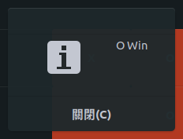

# [30 天深入淺出 Rust](https://ithelp.ithome.com.tw/users/20111802/ironman/1742)系列

https://ithelp.ithome.com.tw/articles/10199503


這系列會假設你有基礎的程式能力，不管是什麼語言都行，至少知道一下比如「參考 (reference) 」是什麼，雖說我也會盡量以初學程式的角度講解，只是 Rust 這個語言本身就包含了不少比較進階的觀念，加上我很可能會舉其它程式語言當對照，同時本系列會以類 Unix (Linux, Mac) 的環境為主，如果你使用的是 Windows 大部份情況下應該不會有什麼問題。

本系列的程式都會在 Ubuntu 18.04 下測試過，如果有任何問題歡迎回報，如果你有任何問題歡迎留言問我，我很樂意解答的，或是你有任何建議也行，我會很高興的。

Rust 是由 Mozilla 所主導的系統程式語言，旨在快速，同時保證記憶體與多執行緒的安全，這代表者使用 Rust 開發基本上不會再看到諸如 Segmentation Fault 等等的記憶體錯誤了，強大的 trait 系統，可以方便的擴充標準函式庫，這讓 Rust 雖然是靜態的程式語言，卻也有極大的靈活性，同時目前也有不少的應用，比如網頁後端、系統程式還有 WebAssembly ，另外也因為其速度快與語法簡潔跟豐富的生態，也有不少公司用來處理極需要速度的部份，比如 Dropbox, npm 想知道還有誰用可以去看看[還有誰也在用](https://www.rust-lang.org/en-US/friends.html)

預計會花 20 篇左右把 Rust 語言介紹完，剩下的則是來實作一些實際的專案，以及介紹一些 Rust 的套件與生態系，
預計會做的有：

- 連結 c 函式庫，跟現有的程式碼或第三方函式庫做整合，讓你不用重新造輪子
- 寫一個 python 的 native extension ，擴充 python 的功能
- 寫個指令列的程式，介紹使用 clap 做 argument parsing
- 寫個網頁後端，介紹 Rust 的 ORM diesel 與非同步的 tower-web 後端框架

或是有任何建議，或者你覺得改做什麼樣的專案會更有趣的也歡迎提出。

# 安裝環境

在正式開始教學前，我們要先把環境安裝好，請在終端機輸入以下指令：

```shell
$ curl https://sh.rustup.rs -sSf | sh -- -y
```

> `$` 是代表終端機的提示符號，你並不需要輸入這個符號

另外 Rust 需要 GCC 之類的工具，如果您的環境是 Ubuntu，可以直接用以下指令安裝：

```shell
$ sudo apt-get install -y build-essential
```

如果您的環境是 Windows，請至 [https://rustup.rs](https://rustup.rs/) 下載 rustup-init 來安裝，而因本教學會使用到相當多指令，我會建議使用 [cmder](http://cmder.net/) 來取代原本 Windows 內建的 cmd，或是直接使用 Visual Studio Code（VSCode）。

完成以上步驟後，您的電腦現在應該已安裝了以下程式：

- rustup: Rust 本身的安裝軟體及版本管理以及更新系統
- rustc: Rust 的編譯器
- cargo: Rust 的套件管理器

剛安裝完，為了確保環境變數有正確設定，你需要在終端機執行下方指令：

```shell
$ source $HOME/.cargo/env
```

而在你下次登入後 Rust 應該已經幫你自動設定好環境變數了，你就不需要再執行上面那條指令。

接著，可以使用 rustc --version 來查看已安裝的版本，如有正確顯示目前的版本，就代表安裝好囉，在本文撰寫時穩定版為 1.29.1。

一切都安裝設置好後，不免的，我們來寫個「Hello, World!」吧！開啟喜歡的編輯器並輸入以下程式碼：

```rust
fn main() {
    println!("Hello world");
}
```

> 這邊的 `!` 並不是打錯了， `println!` 是在一起的，在 Rust 裡以 `!` 結尾的東西是巨集 (macro) ，現在只需理解 `println!` 在背後會幫你產生一些程式碼，讓你可以用簡單的方式就完成印到螢幕這個動作，之後會介紹如何自己寫巨集。

完成後將程式存檔為 hello.rs ，並在終端機執行下方指令：

```shell
$ rustc hello.rs
```

沒意外的話在同一個資料夾下將會看到名稱為 hello 的執行檔（Windows 下為 hello.exe）， 在終端機下執行：

```shell
Hello world
```

恭喜您，您已完成了第一個 Rust 程式，從下一篇開始，我們將正式開始旅程，不過在這之前，讓我們安裝幾個好東西，這會讓我們接下來更佳順利。

```shell
$ rustup component add rls-preview rustfmt-preview
```

最後的最後，Rust 有個線上的測試環境：[https://play.rust-lang.org](https://play.rust-lang.org/) ，並且還安裝好了很多常用的套件，如果臨時有什麼想測試的可以直接在這個網站使用。

# Rust 的套件管理工具 Cargo 與套件倉庫

這篇要介紹的是 Rust 的套件管理工具 Cargo 以及套件倉庫 [crates.io](https://crates.io/) 目前 crates.io 上有一萬八千多個套件，很多功能你都可以在上面找到別人幫你寫好的套件。

在 Rust 要使用別人寫好的套件你需要直接修改 `Cargo.toml` 這個檔案，把套件的名字以及你需要的版本加進去，但無需擔心，它的寫法很簡單的，以下是個範例：

```toml
[package]
name = "guess"
version = "0.1.0"
authors = ["DanSnow"]

[dependencies]
rand = "0.5.5"
```

> `Cargo.toml` 跟 Node.js 的 `package.json` 的用途很像。

我們來建立我們的第一個專案吧，請打開終端機輸入以下的指令：

```shell
$ cargo init guess
```

這時你的目錄下應該有個名稱為 `guess` 的資料夾並且你可以看到底下的檔案與資料夾：

```plain
guess
├── Cargo.toml
├── .gitignore
└── src
    └── main.rs
```

> `.` 開頭的檔案或目錄在類 Unix 系統下是隱藏檔，如果你使用的是 Ubuntu 預設的檔案管理員的話你可以按 `Ctrl+H` 顯示所有檔案。你也可以使用指令 `ls -a` 顯示檔案。

其中 `src/main.rs` 就是我們接下來要修改的專案主程式的程式碼了，你會看到裡面已經有 Hello world， `Cargo.toml` 也已經幫你填好了基本的設定， 我們現在試著輸入 `cargo run` 來執行看看：

```shell
$ cargo run
   Compiling guess v0.1.0 (guess)
    Finished dev [unoptimized + debuginfo] target(s) in 0.52s
     Running `target/debug/guess`
Hello, world!
```

這次要做的是個終極密碼的小遊戲，主要遊戲方式是由使用者輸入數字，電腦回答是比答案大還是小，若沒猜中則猜到中為止的遊戲，接下來我們會一邊介紹基本語法一邊完成這個遊戲，不過我們先幫我們的專案加上一個套件吧，打開 `Cargo.toml` ，找到有一行為 `[depeendencies]` ，在它底下加上：

```toml
rand = "0.5.5"
```

這個套件的功能是產生隨機的數字，如果沒有它，我們的小遊戲每次的答案就要一樣了。

不過像這樣手動編輯檔案也挺容易出錯的，我們有個更好的方法，請你輸入底下的指令：

```shell
$ cargo install cargo-edit
```

這會幫 cargo 擴充新的功能，現在我們可以用底下的指令來加上套件了：

```shell
$ cargo add rand
```

是不是方便多了？

# Rust 基礎

我們直接打開 `main.rs` 來寫我們的程式吧，首先 `//` 開頭的是程式的註解，它是給人看的，電腦看到會直接忽略，我直接使用註解來說明程式的內容，希望你可以照著程式碼自己打一遍，這樣做相信會比較有印像，當然，註解的部份可以不用照著打，你也可以用你自己的方式用註解做筆記。請照著底下的內容輸入：

```rust
// 宣告使用外部的函式庫 rand
// 這告訴我們的編譯器我們要使用 rand 這個套件
extern crate rand;

// 引入需要的函式，如果不引入的話我們就需要在程式中打出全名來，
// 比如像下面使用到的 thread_rng 的全名就是 rand::thread_rng ，
// 但這裡我們選擇引入 rand::prelude::* 這是個比較方便的寫法，
// 很多套件的作者為了使用者方便，都會提供個叫 prelude 的模組，
// 讓你可以快速的引入必要的函式，我們要使用的 thread_rng 也有包含在裡面，
// 但並不是每個套件作者都會這麼做，請注意。
use rand::prelude::*;

// 這是標準輸入，也就是來自鍵盤的輸入，我們等下要從鍵盤讀玩家的答案。
use std::io::stdin;

// 這是一備函式，函式就是一段的程式，
// 我們可以在一個程式裡根據不同的功能將程式拆成一個個的函式，
// 不過今天這個程式並不大，我們直接全部寫在 main 這個函式裡就好了，
// main 是個特殊的函式， Rust 的程式都會從 main 開始執行。
fn main() {
    // 我們在這定義了一個變數 ans 來當作我們的答案，
    // 將它設定成 1~100 之間的隨機數字
    let ans = thread_rng().gen_range(1, 100);

    // 這邊又定義了兩個變數，分別代表答案所在的上下範圍，
    // 之後我們要把這個範圍做為提示顯示給玩家，
    // 因為之後需要修改這兩個變數的值，所以這邊必須加上 mut 來表示這是可修改的
    let mut upper_bound = 100;
    let mut lower_bound = 1;

    // 這是迴圈，它會重覆的執行包在這裡面的內容，
    // 因為這邊的迴圈沒有條件，所以它會一直反覆的執行，
    // 直到執行到如 break 才會結束，
    // 等下還會介紹另外兩種有條件的迴圈
    loop {
        // 這邊要建一個用來暫放玩家輸入的答案用的變數，
        // String 是個存放一串文字用的型態，也就是字串型態，
        // String::new 會建立一個空的字串
        let mut input = String::new();

        // 這邊要印出提示使用者輸入的顯示，同時我們也印出答案所在的上下界，
        // println! 在印完會自動的換行，也就是接下來的輸入輸出會從下一行開始，
        // 而裡面的 {} 則是用來佔位子用的，分別是我們要印出上下界的位置，
        // 之後傳給 println! 的變數就會被放在這兩個位置
        println!(
            "答案在 {}~{} 之間，請輸入一個數字",
            lower_bound, upper_bound
        );

        // 這邊我們使用 read_line 從鍵盤讀入一整行進來，
        // 也就是到玩家按下 Enter 的字都會讀進來，
        // 讀進來的文字會被放進 input 裡，
        // 而因為放進 input 代表著修改 input 的內容，
        // 所以這邊比較特別一點，我們要加上 &mut 來允許 read_line 修改 input ，
        // 而 read_line 會除了把輸入放進 input 外也會傳回是否有成功讀取輸入，
        // 於是這邊就使用了 expect 來處理，若回傳的值代表錯誤時，
        // expect 會印出使用者傳給它的訊息並結束掉程式
        stdin().read_line(&mut input).expect("Fail to read input");

        // trim() 會把字串前後的空白字元 (空格與換行) 去掉，
        // 而 parse::<i32>() 則是把字串從原本的文字型態轉換成數字，
        // 這樣我們在之後才可以拿它來跟答案做比較，
        // 我們這邊又重新定義了一次 input 來放轉換成數字後的結果，
        // 如果你有學過其它的語言可能會覺得奇怪，為什麼允許這麼做，
        // 這也是 Rust 一個有趣的地方， Rust 允許你重覆使用同一個變數名稱，
        // parse 也是回傳代表正確或錯誤的 Result 不過這次我們不用 expect 了，
        // 這次我們判斷是不是轉換失敗，如果是則代表玩家輸入了不是數字的東西，
        // 那我們就讓玩家再輸入一次， match 是用來比對多個條件的語法，之後
        // 會有一篇來介紹這個語法，因為它是 Rust 裡一個很強大的功能。
        let input = match input.trim().parse::<i32>() {
            // Ok 代表的是正確，同時它會包含我們需要的結果
            // 因此這邊把轉換完的數字拿出來後回傳
            // Rust 裡只要沒有分號，就會是回傳值
            Ok(val) => val,
            // Err 則是錯誤，它會包含一個錯誤訊息，不過我們其實不需要，
            // 這邊我們直接提示使用者要輸入數字並結束這次迴圈的執行
            Err(_) => {
                println!("Please input a number!!!");
                // continue 會直接跳到迴圈的開頭來執行，也就是 loop 的位置
                continue;
            }
        };

        // 這邊使用 if 來判斷玩家的答案跟正確答案是不是一樣，
        // if 會判斷裡面的判斷式成不成立，如果成立就執行裡面的程式，
        // 要注意的是判斷相等是雙等號，因為單個等於已經用在指定了。
        if input == ans {
            println!("恭喜你，你答對了");
            // break 則會直接結束迴圈的執行，
            // 於是我們就可以離開這個會一直跑下去的迴圈
            break;
        // 如果不一樣，而且玩家的答案比正確答案大的話就更新答案的上限
        } else if input > ans {
            upper_bound = input;
        // else 會在 if 的條件不成立時執行，並且可以串接 if 做連續的判斷，
        // 像上面一樣。都不是上面的情況的話就更新下限
        } else {
            lower_bound = input;
        }
    }
}
```

## 變數宣告

定義一個變數的語法是像這樣的：

```rust
let ans: i32 = 42;
```

變數是用來存放程式的資料用的，等號在這邊是指定的意思，並不是數學上的相等，我們把 `42` 指定給 `ans` 這個變數，而因為 `42` 是一個數字，因此我們把 `ans` 這個變數指定為 `i32` 這個整數型態，然而事實上大部份情況下其實是不需要給型態的，因為 Rust 可以自動的從初始值，也就是你一開始指定的值推導出你的變數的型態。

在 Rust 裡預設變數是不可以修改的，一但給了值就不能改變，如果要能修改就必須加上 `mut` ，這可以讓你在之後還能修改變數的值。

### 錯誤的範例：

```rust
let ans = 42;
ans = 123; // 這邊重新指定了值給 ans ，但 ans 並沒有宣告為可改變的
```

### 正確的範例：

```rust
let mut ans = 42;
ans = 123;
```

在 Rust 中的變數都必須要有初始值，如果沒有初始值會是一個錯誤，當然，你可以先宣告再給值，但只要有可能會發生沒有指定初始值的情況就會發生錯誤。

### 錯誤的範例：

```rust
let ans;
if true {
    ans = 42;
}
// 這邊我們沒有 else 的情況就使用了，所以 Rust 認為 ans 可能沒有初始值
println!("{}", ans);
```

### 正確的範例：

```rust
let ans;
if true {
    ans = 42;
} else {
    ans = 0;
}
println!("{}", ans);
```

# 基本型態

在電腦裡資料都有其型態，電腦必須知道資料屬於哪一種才能做出正確的處理，而 Rust 的基本型態則有：

> 以下為了說明都有在定義變數時把型態寫出來，但平常因為可以自動推導，所以並沒有必要寫出來。

- unit: 型態是 `()` ，同時值也是 `()` ，這是一個代表「無」的型態

```rust
//  就是「無」，你沒辦法拿這個值來做什麼
let unit: () = ();
```

- 布林值 `bool`: 值只有真 `true` 與假 `false` ，一個代表真假的型態，同時也是判斷式所回傳的型態

```rust
let t: bool = true;

// if 判斷的結果一定要是布林值，其實所有的判斷式的結果也都是布林值
if t {
    println!("這行會印出來");
}

if false {
    println!("這行不會印出來");
}
```

- 整數: 上面使用的 `i32` 就是整數，實際上整數家族有具有正負號的 `i8` 、 `i16` 、 `i32` 、 `i64` 、 `i128` 與只能有正整數的的 `u8` 、 `u16` 、 `u32`、 `u64` 、 `u128` 它們之間的差別在有沒有正負號，以及能存的數字最大的大小，平常通常只會用到 `i32` ，先只要記得 `i32` 就行了

```rust
let num: i32 = 123;
// 數字你可以做基本的四則運算：加法 (+) 、減法 (-) 、乘法 (*) 、除法 (/)
// 和 取餘數 (%) ，當然也還有比如取絕對值之類的方法在，不過這邊先不提
println!("1 + 1 = {}", 1 + 1);
println!("10 % 3 = {}", 10 % 3);
```

- 浮點數： 就是小數，有 `f32` 與 `f64` ，但平常只會用到 `f64` ，浮點數也可以像整數一樣做計算，只是無法取餘數

```rust
let pi: f64 = 3.14;
```

- 字串: `String` ，代表的是一串的文字，另外還有切片型態的 `str` (這兩個詳細的差別之後再提) ，如果你要讀使用者的輸入或是要能夠修改內容的要用 `String` ，如果要放固定的字串 (比如顯示的訊息) 用 `str`

```rust
let message: &str = "這是個固定的訊息";
println!("{}", message);
let mut s: String = String::from("可以用 from 來建一個 String");
s.push_str("，同時你也可以增加內容在 String 的結尾");
println!("{}", s);
```

- 字元: `char` 一個字就是一個字元，比如 `'a'` 或是 `'三'` 也是

```rust
let c1: char = '中';
let c2: char = '文';
let c3: char = '也';
let c4: char = '行';
```

> 這邊為了說明都有在變數後加上型態，如果平常沒加型態而是讓編譯器自動推導的話，整數預設會使用 `i32` ，符點數會使用 `f64` ，但若之後把變數傳入了其它函式，則會配合那個函式的需求改變。

## 複合型態

- 陣列 (array) ：由一串相同型態與固定長度的資料組成的

```rust
// i32 是元素的型態， 4 則是長度
let mut array: [i32; 4] = [1, 2, 3, 4];

// 這邊印出第一個數字與最後一個數字，陣列的編號是從 0 開始的
println!("{}, {}", array[0], array[3]);

// 我們也可以修改元素的值，同樣的，請注意上面的定義是有加 mut 的
array[1] = 42;
```

- 元組 (tuple)：可由不同的型態組成

```rust
// 元組的型態要把每個欄位的型態都寫出來
let mut tuple: (i32, char) = (42, 'a');

// 印出第一個值
println!("{}", tuple.0);

// 改變第二個值
tuple.1 = 'c';
```

## 條件判斷 `if`

```rust
// if 裡面要放條件判斷，或是布林值，
// 條件判斷除了上面出現的 == 、 > 、 < 外還有個不等於
if 10 != 5 {
    println!("10 != 5");
}
```

如果要判斷多個條件可以用底下的方式串起來：

- `&&` ：「且」，兩邊都成立時才成立
- `||` ：「或」，其中一邊成立就成立

```rust
if 2 > 1 && 3 > 2 {
    println!("2 > 1 且 3 > 2");
}
```

還有 `!` 可以把判斷式的結果反轉，也就是把布林值的 `true` 變 `false` ， `false` 變 `true`：

```rust
if !false {
    println!("這行會印出來");
}
```

另外你可以用 `if` 來根據條件來指定變數：

```rust
let ans = if true {
// 請注意，這邊沒有分號
    42
} else {
    123
}; //  這邊要加分號
```

> Rust 裡只要不加分號就會變回傳值

## `while`

`while` 是有條件的迴圈，只有當條件滿足時才會繼續執行下去：

```rust
let mut i = 0;
while i < 5 {
    println!("i = {}", i);
    // 這是 i = i + 1; 的縮寫，數學運算都可以這樣寫
    if i == 3 {
        // 我們在 i 為 3 時就結束迴圈了，所以你會看到從 0 印到 3
        break;
    }
    i += 1;
}
```

而 `break` 可以用來中斷迴圈，而 `continue` 可以直接結束這次的迴圈，跳到迴圈的開頭執行。

## `for`

`for` 是用來跑過一個「範圍」的資料的，比如像陣列，以後會再詳細介紹背後的機制。

```rust
for item in [1, 2, 3, 4, 5].iter() {
    println!("{}", item);
}

for item in 0..5 {
    println!("{}", item);
}
```

其中 `0..5` 是 Rust 的 `range` 代表的是 0~4 (不含結尾)，含結尾的話要寫成 `0..=5` (有等號)，這代表一個數字的範圍，以後講到切片時會再提到。

## 函式

上面說了函式就是一小段的程式，如果你的程式裡出現了重覆的程式碼，你可以試著把程式碼抽出來變成函式，這樣以後要修改也會比較方便。

函式來自於數學的函數的觀念「給予一個值，會對應到另一個固定的值」，函式同樣的也需要輸入的值與輸出的值，底下是個範例：

```rust
// 這個函式有兩個整數的輸入值 a 與 b 並且回傳一個整數
// 函式的開頭是 fn 接下來跟著函式的名字，後面的括號裡放著函式的輸入
// 其中當作輸入的鑾數都一定要有型態，之後 -> 後放著的是回傳的型態
fn add(a: i32, b: i32) -> i32 {
    // 這邊示範如何使用 return ，如果 a 與 b 都是 1 ，就直接回傳 2
    if a == 1 && b == 1 {
        // return 會提早結束函式的執行，並且把後面的值當成回傳值
        return 2;
    }
    // 注意這邊沒有括號，沒有括號的代表回傳值，當然你也可以像上面使用 return
    a + b
}

// 這個函式沒有寫出回傳值，這代表它其實會回傳一個 () ，只是可以省略不寫出來而已
fn print_number(num: i32) {
    println!("{}", num);
}

// 所以其實 main 函式回傳的也是 unit
fn main() {
    // 像這樣子就可以呼叫函式了
    let num = add(1, 2);
    print_number(num);

    // 你也可以寫在一起
    print_number(add(1, 2));
}
```

這篇我們很快的介紹了 Rust 的基本語法，下一篇要介紹的是 Rust 的參考，以及 Rust 中很重要的變數的所有權的觀念。

# 變數的所有權與借出變數  

## Move, Borrow & Ownership

這篇與下一篇要介紹 Rust 中可說是最複雜，卻也是最重要的一個觀念，變數的所有權 (ownership) ，在 Rust 中每個變數都有其所屬的範圍 (scope) ，在變數的有效的範圍中，可以選擇將變數「借 (borrow)」給其它的 scope ，也可以將所有權整個轉移 (move) 出去，送給別人喔，當然，送出去的東西如果別人不還你的話是拿不回來的，但借出去的就只是暫時的給別人使用而已。

## Move

```rust
fn main() {
  let message = String::from("Hello");
  {
    message;
  }
  println!("{}", message);
}
```

[](https://play.rust-lang.org/?gist=2e8d72baf064c582fcd1d7563b0ed682&version=stable&mode=debug&edition=2015)

> 範例的下方若有個  的連結，按下去就會連到 Rust Playground ，讓你可以直接執行範例。

> 補充一個之前忘了提的東西， `!` 在這邊並不是打錯了， `println!` 是一起的

```rust
fn greet(message: String) {
  println!("{}", message);
}

fn main() {
  let message = String::from("Hello");
  greet(message);
  println!("{}", message);
}
```

猜看看上面的兩段程式碼的執行結果是什麼，猜到了嗎，答案都是無法編譯，編譯器會出現：

```plain
error[E0382]: use of moved value: `message`
```

意思是使用了已經送給別人的變數，在 Rust 中一個程式碼的區塊， 也就是由 `{` 與 `}` 包圍的區域都是一個 scope ，這也包含了函式、迴圈的括號等等，只要你把變數傳給了其它區塊，都會把變數送出去，所以在上面的範例中， `message` 這個變數已經送出去，並且在接下來的 `println!` 無法使用了，另外在底下的情況也會送出變數：

```rust
let a = String::from("a");
let b = a;
println!("{}", a); // 這邊也同樣不能編譯
```

> 或許你已經注意到了，這邊使用的都是 `String::from` ，都是在建立字串，如果把上面的例子都換成數字的話，你會發現不會出現任何錯誤，而能順利的執行，因為數字可以 **複製** ，字串不能複製嗎？也可以，只是字串的大小並不固定，有可能是很長的一篇文章，也有可能是一個空字串， Rust 並不允許在沒有明確的說要複製的情況下複製這種不知道會花費多少成本的型態，如果要改寫上面的範例，複製一個字串的話，可以使用 `clone`：

```rust
let a = String::from("a");
let b = a.clone();
println!("{}", a);
```

[](https://play.rust-lang.org/?gist=bbd5cea5645d6f17a52376a1105d2ef6&version=stable&mode=debug&edition=2015)

> 數字的大小則是固定的，於是在發生把變數送出去的情況時， Rust 會使用複製一份的方式給別人，所以就變成了兩個人都擁有，不會發生錯誤的情況。
>
> > 如果你想知道哪個型態可以被複製，可以參考文件的 [`std::marker::Copy`](https://doc.rust-lang.org/stable/std/marker/trait.Copy.html) ，你會在底下看到如 `impl Copy for i32` 這就代表 `i32` 可以被複製

拿走的東西主動的還回去也是可以的：

```rust
// 我要拿走整個 message 變數
fn greet(message: String) -> String {
  println!("{}", message);
  message // 之後再還回去
}

fn main() {
  let message = String::from("Hello");

  // 這邊變數被拿走了，但是又還了回來，於是我們需要一個變數代表它
  // 當然你也可以使用同樣的名稱 message
  let msg = greet(message);

  println!("{}", msg); // 又拿回來了，於是可以使用
}
```

[](https://play.rust-lang.org/?gist=0ef153bf8dae80d3d812b57dd934e6c9&version=stable&mode=debug&edition=2015)

## Borrow

Rust 中把出借變數直接稱為 borrow ， Rust 中使用在變數前面加一個 `&` 來代表出借變數，borrow 的用途是當你不想把變數送出去時，你就可以把你的變數 **借** 出去，但還有個前提是對方要 **願意跟你借** ，底下是個借出變數給函式的範例：

```rust
// 這邊在 String 的前面加上了 & 代表我可以跟別人用借的
fn greet(message: &String) {
  println!("{}", message);
}

fn main() {
  let message = String::from("Hello");
  greet(&message); // 這邊加上了 & 來表示借出去
  println!("{}", message); // 借出去的東西只是暫時給別人而已，自己還可以使用
}
```

[](https://play.rust-lang.org/?gist=a1740013bff718d8141cec6cba465392&version=stable&mode=debug&edition=2015)

```rust
// 這邊沒有加上 & 代表我想要整個拿走
fn greet(message: String) {
  println!("{}", message);
}

fn main() {
  let message = String::from("Hello");
  // greet(&message); // 這邊就算加上了 & 也沒辦法把變數用借的借出去
  greet(message); // 一定要整個給它
  // println!("{}", message); // 因為被整個拿走了，所以這邊已經沒辦法使用了
}
```

Rust 預設借給別人的東西別人必須原封不動的還回來，也就是借出去的變數是沒辦法被修改的，如果你想允許別人修改的話，你就必須使用 `&mut` 對方也必須明確的使用 `&mut` 來代表我要借到一個可以修改的變數：

```rust
fn combine_string(target: &mut String, source: &String) {
  // push_str 會把傳進去的字串接到字串的後面
  target.push_str(source);
}

fn main() {
  // 這邊一定要加 mut ，因為這個變數會被修改，就算不是你自己改的也一樣
  let mut message = String::from("Hello, ");
  let world = String::from("World");
  // 借給 combine_string 一個可以改的變數 message ，與一個不能改的 world
  combine_string(&mut message, &world);
  println!("{}", message); // 這邊就會印出 Hello, World
}
```

[](https://play.rust-lang.org/?gist=845ebd1e9abf0c3cdf0def4f5dbcad1e&version=stable&mode=debug&edition=2015)

> 還記得前一篇的猜數字裡有 `stdin().read_line(&mut input)` 嗎？

## Borrow 的規則

Rust 的出借變數是有其規則在的：

1. 所有的變數一次都只能用可以修改的方式 (`&mut`) 出借一次

```rust
let mut n = 42;
let a = &mut n;
let b = &mut n; // 這裡用可以修改的方式總共借出去兩次了，這是不可以的
```

1. 可以無限的用唯讀的方式借出去

```rust
let n = 42;
let a = &n;
let b = &n;
```

1. 一旦用可以修改的方式 (`&mut`) 出借，那你就不能用任何其它的方式存取變數了

```rust
let mut n = 42;
{
  let a = &mut n;
  // println!("{}", n); // 你不可以使用原本的 n
  // let b = &n; // 你也不可以再用任何方式借走 n
}
println!("{}", n); // 我們離開了 a 借走 n 的範圍了，於是 n 又可以用了
```

1. 一旦你用唯讀的方式借出了變數，你就不可以修改變數

```rust
let mut n = 42;
{
  let a = &n;
  // n = 123; // 又不可以了，有夠煩的(X
}
n = 123; // 這邊才可以修改
```

> 這些規則是用來確保多執行緒時不會有資料競爭用的，也就是同時有兩個人修改了同一個變數，於是一次只允許有一個變數的擁有者能修改變數的值，同時一但借出了變數就不能隨意修改，因為別人不一定會知道變數被修改了。雖然有點麻煩 (也真的很麻煩) ，但往好處想，變數不再會被隨意的修改了。

有點可惜的是目前的 `borrow checker` ，也就是檢查，並執行上面這些規則的功能，它並不是很完善，比如：

```rust
let mut array = [123, 456];
let a = &mut array[0];
let b = &mut array[1];
```

兩個變數分別借走了不相干的兩個部份，但這沒辦法通過檢查，不過這在 Rust 2018 將會有所改善，敬請期待。

> Q： Rust 2018 是什麼？
> A： 在今年的年底 Rust 將要推出 2018 年版，版本號會是 1.30 ，將會有不少的改進以及部份的語法的變更。
> Q： 什麼！那我現在學的這些東西到年底就都沒辦法用了？
> A： 放心好了，大部份的是功能的增強與新的語法，只有一小部份的修改，之後會有一篇來討論這些修改，與看看有哪些新功能。
> Q： 那我不想更新可以嗎？
> A： 可以，你可以設定使用現在的語法版本，也就是 Rust 2015 版。
> Q： 那我要怎麼設定？
> A： 這個之後再說。

## String & str, Array & Slice

我們之前應該有提到過 Rust 有兩種字串 `String` 與 `str` ，可是一直沒有詳細說明這兩個的差別，這邊我們要提到 Rust 的一個東西「切片 (slice)」，切片可以理解為一次出借如陣列或字串這類的連續的資料型態的一部份：

> 如果你有寫過 Python 你可能知道 Python 的切片 `array[1:3]` ，只是這邊把 `:` 換成了 `..` 而已。

```rust
let mut array = [0, 1, 2, 3, 4, 5];
{ // 建立一個區塊，不然我們等下沒辦法使用原本的 array
  let slice: &mut [i32] = &mut array[1..3]; // 這邊一次的借走了 array 的第 2 跟第 3 個元素

  // 然後我們修改了切片的第 1 個元素，對應到原本的 array 則是第二個元素
  slice[0] = 42;

  println!("{:?}", slice); // 會印出 [42, 2]
}
println!("{:?}", array); // 印出 [0, 42, 2, 3, 4, 5]
```

> Rust 的切片會知道自己借走了多少長度的東西，而且跟原本的變數 **會共用同一塊空間** ，建立切片是不會複製任何資料的。

你可以看到這邊的印出來的結果很明顯的修改了原本的資料，同時很重要的一點，切片 **只能有 borrow 的型態** ，因為切片的本質就是出借資料，切片能把資料出借一小段，而使用者可以把這段資料當成像陣列一樣使用。

> `{:?}` 是把資料以 debug 的方式印出來，內建的型態不一定能直接印出來，但大部份都能用這種方式印出來，如果不能使用 `{}` 印出來時 `{:?}` 通常能派上用場。

上面的 `slice` 的型態是 `&mut [i32]` ，這就是切片型態的寫法，一般如果需要借走一個陣列都會使用切片型態，這樣可以給予使用者更大的彈性，比如決定要不要把整個陣列都借出去，或是隻借出一部份。

那終於可以來講 `str` 了， `str` 事實上就是字串的切片，而 `String` 則是一個可以在執行時改變大小的字串：

```rust
// 直接使用雙引號 (") 的字串都是字串的切片，它們都被 Rust 放在某個地方並且借給使用者使用而已
let hello: &str = "Hello";
// 建立一個 String
let string: String = String::from(hello);
// 借走字串的一部份，產生一個字串切片
let part_of_string: &str = &string[1..3];
```

同樣的 `str` 也只能有 borrow 的型態。

# Lifetime： Borrow 的存活時間

Rust 有個重要的功能叫 borrow checker ，它除了檢查在上一篇提到的規則外，還檢查使用者會不會使用到懸空參照 (dangling reference) ，懸空參照是在電腦世界中一種現象： 如果你今天把一個變數借給別人，實際上借走的人只是知道我可以去哪裡找到這個別人借我的東西而已，那個東西的擁有者還是你本人，以現實世界做比喻的話，這像是借別人東西只是把放那個東西的儲物櫃位置，以及鑰匙暫時的交給別人而已，送別人東西則是直接把儲物櫃的擁有者變成他。

所以如果今天發生了一種情況，你把東西借給別人後，管理每個儲物櫃擁有者的系統馬上把你的使用權收回去呢？會發生什麼事，這沒人說的準，可能儲物櫃還沒被清空，你還是可以拿到借來的東西，或是馬上又換了主人，你已經不是拿到原本的東西了，就像以下的程式碼：

```rust
fn foo() ->&i32 {
  // 這個變數在離開這個範圍後就消失了
  let a = 42;
  // 但是這邊卻回傳了 borrow
  &a
}
```

上面這段 code 是無法編譯的。

為瞭解決這樣的一個問題， Rust 提出來的就是 lifetime 的觀念，只要函式的參數或回傳值有 borrow 出現，使用者就要幫 borrow 標上 lifetime ，標記後讓編譯器可以去追蹤每個變數借出去與釋放掉的情況，確保不會有釋放掉已經出借的變數的可能性。

Rust 使用 `'a` 一個單引號加上一個識別字當作 lifetime 的標記，所以這些都是可以的 `'b`, `'foo`, `'_bar` ，此外有兩個保留用作特殊用途的 lifetime: `'static` 和 `'_`：

- `'static`： 這代表這是個整個程式都有效的 borrow 比如字串常數 `"foo"` 它的 lifetime 就是 `'static`
- `'_`：這是保留給 Rust 2018 使用的，這裡先不提它的功能

這邊是個加上 lifetime 標記後的範例：

```rust
fn foo<'a>(a: &'a i32) -> &'a i32 {
  a
}
```

其中我們必須在函式名稱後加上 `<>` 並在其中宣告我們的 lifetime ，接著把 borrow 的 `&` 後都加上我們的 lifetime 標記，但事實上在上一篇文章中，我們完全沒用使用到 lifetime ， Rust 可以在某些情況下自動推導出正確的 lifetime ，使得實際上需要手動標註的情況並不多，最有可能遇到的情況是一個函式同時使用了兩個 borrow ：

```rust
fn max<'a>(a: &'a i32, b: &'a i32) -> &'a i32 {
  if a > b {
    a
  } else {
    b
  }
}

fn main() {
  let a = 3;
  let m = &a;
  {
    let b = 2;
    let n = &b;
    // 對於 max 來說， m 與 n 同時存活的這個範圍就是 'a ，
    // 而回傳值也可以在這個範圍內使用
    println!("{}", max(m, n));
  } // b 與 n 會在這邊消失
} // a 與 m 會在這邊消失
```

這種情況編譯器因為看到了兩個 borrow ，於是沒辦法猜出來回傳的值應該要跟哪個 lifetime 一樣，這邊的作法就是全部都標記一樣的 lifetime ，讓 Rust 知道說我們的變數都會存活在同一個範圍內，同時回傳值也可以在同樣的範圍存活。

大部份的情況下編譯器都能自動的推導，所以需要手動標註的情況其實不多，通常是先嘗試讓編譯器做推導，如果編譯器報錯了才來想辦法標註。

lifetime 還有個用途是用來限制使用者傳入的參數必須是常數：

```rust
fn print_message(message: &'static str) {
  println!("{}", message);
}
```

這個函式就只能接受如 `"Hello"` 這樣的常數了，雖說只是偶爾會有這樣的需求。

## Lifetime Elision (Lifetime 省略規則) (進階)

這部份大概的瞭解一下就好了

1. 所有的 borrow 都會自動的分配一個 lifetime

```rust
fn foo(a: &i32, b: &i32);
fn foo<'a, 'b>(a: &'a i32, b: &'b i32); // 推導結果
```

1. 如果函式只有一個 borrow 的參數，則它的 lifetime 會自動被應用到回傳值上

```rust
fn foo(a: &i32);
fn foo<'a>(a: &'a i32) -> &'a i32; // 推導結果
```

1. 如果有多個 borrow ，但其中一個是 `self` ，則 `self` 的 lifetime 會被應用在回傳值

```rust
impl Foo {
  fn method(&self, a: &i32) -> &Self {
  }
}

// 推導結果
impl Foo {
  fn method<'a, 'b>(&'a self, b: &'b i32) -> &'a Self {
  }
}
```

若不符合上面任一條規則，則必須要標註型態。

如果我們把以上的規則套用在上面的範例 `max` 上：

```rust
fn max(a: &i32, b: &i32) -> &i32 {
  if a > b {
    a
  } else {
    b
  }
}
```

套用規則 1 ：

```rust
fn max<'a, 'b>(a: &'a, i32, b: &'b i32) -> &i32 {
  if a > b {
    a
  } else {
    b
  }
}
```

到這邊結束，編譯器已經沒有可用的規則了，但是回傳值的 lifetime 依然是未知，於是就編譯失敗。

# Struct 與 OOP

各位有在 C 裡實作過物件導向程式設計 (OOP) 嗎？
這篇要來介紹 Rust 中的 struct 以及 OOP。

## Struct

首先來介紹一下結構 (structure) ， Rust 中宣告結構是用 `struct` 關鍵字，這跟 C/C++ 很像，不過不太一樣的是， Rust 中預設所有的成員 (member) 都是私有的 (private)。

```rust
struct Foo {
  pub public_member: i32,
  private_member: i32, // 這個結尾的逗號可加可不加，但是加上去是官方推薦的
}
```

結構讓你可以組合不同的型態，給每個欄位名字，最後組合出一個新的型態，在上面我們宣告了一個有公開的 `public_member` 與私有的 `private_member` 的 struct ，事不遲疑，我們寫個 `main` 來試用一下：

```rust
fn main() {
  let foo = Foo {
    public_member: 123,
    private_member: 456
  };
}
```

Rust 裡建立一個結構就像這樣，在前面放上結構名稱，後面則是各個欄位以及它們的初始值，如果你有接觸過其它的 OOP 程式語言，你應該有注意到哪裡不太對勁了，為什麼我們可以直接使用應該是私有的 `private_member`？這不是違反封裝了嗎？在 Rust 中私有的成員代表的是隻能在這個 `package` 中存取 (你可以先理解為這個檔案，之後會詳細解釋 Rust 的模組架構) ，這就像 Java 的 `package` 修飾或 Kotlin 的 `internal` 或 C 中使用 `static` 的全域變數。

> 封裝是把資料對外部隱藏起來，只允許使用方法存取，避免外部直接存取資料而導致程式的邏輯錯誤

## More Struct

如果欄位的名稱不重要，或是隻是想建一個型態把其它的型態包裝起來的話
我們可以建一個 **"tuple struct"**：

```rust
struct Foo(i32, i32);
```

這像 tuple 與 struct 的融合體，如果要存取資料的話也跟 tuple 一樣：

```rust
let foo = Foo(1, 2);
foo.0;
foo.1;
```

另外還有完全沒有資料的 "unit-like struct"：

```rust
struct Bar;
```

這個比較少用到，通常是配合 trait 來使用的。

## Impl

OOP 是把資料與操作資料的方法結合，藉此模擬現實的東西，於是少不了的，有了資料自然要有操作資料的方法。

```rust
struct Person {
  name: String
}

impl Person {
  pub fn new(name: String) -> Self {
    Person { name }
  }

  pub fn say_hello(&self) {
    println!("Hello, my name is {}", self.name);
  }
}

fn main() {
  let john = Person::new("John".to_string());
  john.say_hello();
}
```

Rust 使用一個分開的 `impl` 區塊來幫 struct 實作方法，這邊建立了一個 `Person` 的 struct ，與建構子 `new` 還有一個方法 `say_hello`，方法可以設定可見度，在前面加上 `pub` 就會變公開的方法了，在 Rust 中並沒有指定建構子的名字，所以稱為 `new` 只是一個慣例，因為 Rust 不允許多型 (Polymorphism)，也不允許函式的參數有預設值，所以在 Rust 中一個 struct 有多個不同的建構子也是常有的事，建構子所回傳的 `Self` 是一個特殊的型態，代表的是自己所實作的 struct ，在這邊你也可以寫 `Person`，不過如果要回傳自身都建議寫 `Self` ，因為它有一些好用的特性，在下一章會提到。

其中使用的 `Person { name }` 是個語法糖，當變數名稱與欄位名稱一致時，就可以把 `Person { name: name }` 簡寫。

若實作的 method 沒有 `self` 變數則代表這個方法是個 associated method ，它只是個跟 struct 搭配的方法而已，就像其它語言的 static method ，使用時要用 `Person::new` 來呼叫。

> 多型是指函式可以有同一個名稱，但使用不同的參數，這在 OOP 也是很常見的一個特性，比如在 C++ 可以建立 `Persion()` 與 `Persion(string)` 兩個建構子，但接受不同的參數

`say_hello` 則是 `Persion` 的方法，而 `self` 是個特殊的變數，只會在實作時出現
它代表的是自己，如果要變成 struct 的方法則第一個參數必須是 `self`，同時宣告 `self` 時要決定使用什麼方式宣告，一般最常用的是唯讀的 borrow `&self` 這代表你會用唯讀的方式存取自己，另外還有 `&mut self` 這時候你就可以修改自己了，最後 `self` 這個比較少用， 若使用 `self` 代表你將會取得自身的所有權，呼叫這個方法將不再能存取這個 struct ，一般用在要將自身轉換成另一個型態，或是呼叫這個方法後自己就不再有效的情況。

大部份情況下還是使用 `&self` 居多，呼叫方法則是用 `john.say_hello()` ，Rust 在這邊會自動的把 struct 轉成 borrow 的型態。

> Rust 中的所有的 function, method 都可以直接的存取與當成參數傳遞，比如在上面的例子，你可以使用 `Person::say_hello(&john)` 來呼叫方法，這其實有一種像在 C 中實作 OOP 的感覺，而上面的呼叫方式反而像是語法糖一樣。

## 建造模式 Builder Pattern

Rust 不支援多型，也不支援預設參數，所以當建構子的參數多時就顯的很麻煩，把所有成員都設成公開的又破壞封裝，所以在 Rust 中常會看到建造模式，建造模式是個設計模式，其將會使用另一個 struct 以一系列的方法來建造我們要的目標，以 Rust 的標準函式庫中的 [`std::process::Command`](https://doc.rust-lang.org/stable/std/process/struct.Command.html) 為例：

```rust
let output = Command::new("echo")
  .arg("Hello world")
  .output();
println!("{}", String::from_utf8_lossy(&output.stdout));
```

像這樣的方式就是建造模式，最後我們要拿到的目標是那個 `output` 變數，底下我們自己實做一個：

```rust
#[derive(Debug)]
struct Point {
    x: i32,
    y: i32,
    z: i32,
}

impl Point {
    fn new(x: i32, y: i32, z: i32) -> Self {
        Point { x, y, z }
    }
}

struct Builder {
  x: i32,
  y: i32,
  z: i32,
}

impl Builder {
  fn new(x: i32) -> Self {
    Builder {
      x,
      y: 0,
      z: 0,
    }
  }

  fn y(&mut self, y: i32) -> &mut Self {
    self.y = y;
    self
  }

  fn z(&mut self, z: i32) -> &mut Self {
    self.z = z;
    self
  }
  
  fn build(&self) -> Point {
      Point::new(self.x, self.y, self.z)
  }
}

fn main() {
    let point = Builder::new(1)
        .y(2)
        .z(3)
        .build();
    println!("{:?}", point);
}
```

[](https://play.rust-lang.org/?gist=5e7b08e230a379f9c05571f8bcb66d1b&version=stable&mode=debug&edition=2015)

這邊假設了 `x` 的值是必要的，另外兩個都可以用 0 當預設值，這樣就可以只指定想要的東西了。

## Trait 與泛型 (Generic)

## Trait

Trait 本身同時提供兩個功能，一是讓不同的型態去實作同樣的功能，再來就是提供實作來共用程式碼了，這同時也是 Rust 泛型的基礎。

```rust
trait Movable {
  fn move(&self);
}

struct Human;

impl Movable for Human {
  fn move(&self) {
    println!("Human walk");
  }
}

struct Rabbit;

impl Movable for Rabbit {
  fn move(&self) {
    println!("Rabbit jump");
  }
}
```

於是不同的型別就能各自實作 trait 並提供自己專屬的實作，另外要注意的是： trait 的方法一定都是公開的。

trait 也可以提供預設的實作，與在使用者實作了特定的方法後提供像 mixin 的功能：

```rust
trait Greeter {
  fn greet(&self) {
    println!("{}", self.message());
  }

  fn greet_to(&self, name: &str) {
    println!("{} {}", self.message(), name);
  }

  fn message(&self) -> &'static str;
}

struct Someone;

impl Greeter for Someone {
  // 提供必要的方法
  fn message(&self) -> &'static str {
    "Hello"
  }

  // 覆寫 (override) 預設實作
  fn greet_to(&self, name: &str) {
    println!("Yo {}", name);
  }
}
```

也可以指定要實作這個 trait 的同時要實作另一個 trait：

```rust
trait HasName: Greeter {
    fn name(&self) -> &'static str;

    fn greet_with_name(&self) {
        println!("{} my name is {}", self.message(), self.name());
    }
}
```

trait 中也可以宣告型態別名 (type alias)，這樣就能讓方法能輸入或回傳不同型態：

```rust
trait Foo {
  type Item;
  fn foo(&self) -> Self::Item;
}

struct Bar;

impl Foo for Bar {
  type Item = i32;

  fn foo(&self) -> Self::Item { 42 }
}
```

另外這邊我們都使用 `Self` ，因為你無法知道是誰會實作這個 trait。

## 內建的 Trait

Rust 內建了很多的 trait ，只要實作了這些 trait 就能讓 Rust 知道你的型態能提供哪些功能，也能被標準函式庫或第三方的函式庫使用了，以下會介紹幾個比較重要的。

### Display

[`std::fmt::Display`](https://doc.rust-lang.org/stable/std/fmt/trait.Display.html) 是讓你的型態能被 `println!` 印出來

```rust
struct Point(i32, i32);

// 當然這邊你可以先用 use std::fmt::Display; 這樣這邊就只需要使用 Display
impl std::fmt::Display for Point {
  fn fmt(&self, f: &mut std::fmt::Formatter) -> std::fmt::Result {
    write!(f, "({}, {})", self.0, self.1)
  }
}
```

實作了這個 trait 還會自動實作 [`std::string::ToString`](https://doc.rust-lang.org/stable/std/string/trait.ToString.html) ，這是讓你的型態能轉換成字串。

### From

[`std::convert::From`](https://doc.rust-lang.org/stable/std/convert/trait.From.html) 代表你的型態能從另一個型態轉換，之前所使用的 `String::from` 就是從這裡來的，同時若你實作了 `From` ，編譯器就會自動幫你實作 `Into`，`Into` 則是這個型態可以被轉換成某個固定的型態。

```rust
struct Foo;
struct Bar;

// Foo 是來源的型態，這是等下要講的泛型
impl From<Foo> for Bar {
  fn from(_: Foo) -> Self {
    Bar
  }
}

// 相對的你可以使用 let bar: Bar = Foo.into();
// 這裡也是少數要標記型態的，因為編譯器沒辦法自動推導
```

### Add

[`std::ops::Add`](https://doc.rust-lang.org/stable/std/ops/trait.Add.html) 可以讓你的型態與別的東西做加法運算，同時這也是 Rust 的運算子重載， Rust 的所有運算子都有個 trait 在 [`std::ops`](https://doc.rust-lang.org/stable/std/ops/index.html)，只要實作了你就能使用那個運算子做運算了。

(這邊不提供範例，請去看文件裡的範例)

### Deref

[`std::ops::Deref`](https://doc.rust-lang.org/stable/std/ops/trait.Deref.html) 這是 Rust 裡一個很重要的運算子，就是取值的操作，只是這個取值也可以取得其它的型態，這代表著你可以用自己定義的型態去包裝不是由你建立的型態，並擴充它的功能，同時還能自動的「繼承」原先的型態所擁有的方法。

> 這邊的繼承並不像其它語言的繼承，它只是在呼叫方法時透過 `Deref` 轉換成需要的型態而已。

```rust
use std::{ops::Deref, fmt};

#[derive(Copy, Clone)]
struct Num(i32);

impl fmt::Display for Num {
    fn fmt(&self, f: &mut fmt::Formatter) -> fmt::Result {
        // 直接呼叫被包裝的 i32 所實作的 fmt::Display
        fmt::Display::fmt(&self.0, f)
    }
}

impl Num {
  fn inc_one(self) -> Self {
    Num(self.0 + 1)
  }
}

impl Deref for Num {
  type Target = i32;

  fn deref(&self) -> &Self::Target {
    &self.0
  }
}

fn main() {
  let n = Num(42);
  println!("{}", n.inc_one()); // n 可以有新定義的方法
  println!("{}", n.abs()); // n 也可以有原本定義的方法
}
```

## Derivable Trait

Derivable trait 是一些能自動 **產生** 實作的 trait ，如果要讓編譯器產生實作的話，就只要在你的型態上加上 `derive` 的標記：

```rust
#[derive(Debug, Default, Clone, Copy)]
struct Foo;
```

> 請注意，它們是 **產生** 實作，這代表它們還是要有程式碼來實作，只是能自動產生而已，通常而言 derivable trait 會要求你的 struct 中每個欄位也都要實作同樣的 trait ，這樣才能遞迴下去

也有不少內建的這樣的 trait ，以下也是介紹重要的

### Default

[`std::default::Default`](https://doc.rust-lang.org/stable/std/default/trait.Default.html) 代表你的型態有預設值，Rust 裡的慣例也有如果實作了無參數的建構子，則也要實作 `Default` ，你也可以在建構子使用實作的 `Default` ，另外 `Default` 也還有個用途：

```rust
#[derive(Default)]
struct Point { x: i32, y: i32, z: i32 };

Point {
  x: 1,
  ..Default::default() // 剩下的值直接使用預設值
}
```

### Debug

[`std::fmt::Debug`](https://doc.rust-lang.org/stable/std/fmt/trait.Debug.html) 是用來印出 debug 資訊的，也就是 `println!` 使用 `{:?}` 印出來的結果。

### Copy

> `Copy` 是個 marker trait ，這類的 trait 其實並沒有任何實作，它們的用途是讓編譯器知道這個型態的一些特性，以及在什麼情況下該怎麼處理。

`Copy` 是代表這個型態可以被簡單的複製，這通常代表你的型態裡只有包含像數字或是布林等型態的資料，如果包含了 `String` 或 `Vec` 就沒辦法實作這個 trait，另外如果有實作 `Copy` 則一定要實作 `Clone`。

### Clone

[`std::clone::Clone`](https://doc.rust-lang.org/stable/std/clone/trait.Clone.html) 是可被複製的型態，如果一個型態只有 `Clone` 而沒有 `Copy` 則通常代表這個型態的複製是需要成本的，比如 `String`，大部份的型態也都有實作 `Clone` ，如果你的型態允許複製也請務必實作 `Clone`，至於沒有實作 `Clone` 的型態基本上就是像 `File` 之類的因為它是對應到了一個實際存在的檔案。

## 泛型

如果沒有泛型實際上 trait 也沒什麼作用，泛型可以讓一個函式接受不同型態的參數，同時透過指定要實作的 trait 來確保傳進來的參數一定滿足某些必要的條件，比如我想要傳進來的數字可以跟數字相加，而且回傳數字：

```rust
use std::ops::Add;

fn print_add_one<T: Add<i32, Output = i32>>(n: T) {
  println!("{}", n + 1);
}
```

`Add` 本身也是一個泛型的 trait 它的參數是用泛型，並且還帶有一個型態別名，我們可以在 `<>` 中指定泛型的參數，以及型態的別名，第一個 `i32` 指定的是泛型，而 `Output = i32` 指定的則是別名，於是這邊我們就能傳進去任何與 `i32` 相加後會回傳 `i32` 的東西了，你可以傳入數字，也可以試著把上面的 `Num` 加上 `Add` 的定義後傳進去試試， Rust 的編譯器在碰到泛型時會各別的幫出現的每個型態產生程式碼，所以是沒有任何額外的執行消耗的，這也是 Rust 所推的 zero-cost abstract。

泛型還有其它不同的寫法，比如你的型態太長了，那你可以先宣告，再補上 trait 的限制：

```rust
fn print_add_one<T>(n: T)
  where T: Add<i32, Output = i32> {
  println!("{}", n + 1);
}
```

也可以直接寫在參數的宣告那邊，我比較喜歡這樣寫，這是在 Rust 1.27 後新增的語法：

```rust
fn print_add_one(n: impl Add<i32, Output = i32>) {
  println!("{}", n + 1);
}
```

另外你可以回傳實作了某種 trait 的回傳值，同樣是 1.27 的語法：

```rust
fn return_addable() -> impl Add<i32, Output = i32>) {
  42
}
```

收到這個回傳值的使用者只會知道這個型態支援什麼東西，不會知道實際的型態

struct 或 trait 也可以使用泛型：

```rust
struct Wrapper<T>{
  inner: T
}

impl<T> Deref for Wrapper<T> {
  type Target = T;
  fn deref(&self) -> &T {
    &self.inner
  }
}

fn main() {
  let n = Wrapper { inner: 42 };
  println!("{}", *n);
}
```

## 泛型 & 型態別名

之前一直沒介紹 type alias 的語法，這語法其實並不是隻有在 trait 裡可以使用的，若你覺得某個型態你很常用到但太長了打起來很麻煩時你可以用這個語法來建立一個別名，也可以加上 pub 讓你的別名可以被外部使用：

```rust
pub type MyInt = i32;
```

像標準函式庫中的 [`std::io::Result`](https://doc.rust-lang.org/stable/std/io/type.Result.html) 就是一個很好的例子，它的定義如下：

```rust
type Result<T> = Result<T, Error>;
```

這邊定義了有一個泛型的參數的 `Result` 做為原本的 `Result` 的別名，之後錯誤的型態則是使用 `Error` ，於是程式碼裡就不需要到處都是 `Result<T, Error>` 而只要寫 `Result<T>` 就可以了。

至於在 trait 中何時該用泛型，何時又該用型態別名呢？

大部份的情況下你應該使用型態別名，不過如果你的 trait 要可以針對不同的型態有不同的處理方式：

```rust
struct Handler;

trait Handle<T> {
  fn handle(input: T);
}

impl Handle<i32> for Handler {
  fn handle(input: i32) {
    println!("This is i32: {}", input);
  }
}

impl Handle<f64> for Handler {
  fn handle(input: f64) {
    println!("This is f64: {}", input);
  }
}
```

這時你該使用的是泛型。

# 列舉、解構、模式比對

## 列舉 (Enum)

列舉是 Rust 中的一個型態，其為多個 variant 所組成：

```rust
enum Color {
  Red,
  Green,
  Blue,
}
```

使用時必須要加上列舉的名稱，比如 `Color::Red` ，或是你也可以像引入函式庫一樣的，把 enum 內的 variant 用 `use` 引入，比如 `use Color::*` ，就會把 `Color` 下的 variant 都引入了。

不過 Rust 的列舉的特殊之處是 variant 可以帶值：

```rust
enum StringOrInt {
  String(String),
  Int(i32),
}
```

裡面的值就像 struct 一樣，也就是你可以不只一個值，或是給它們欄位的名稱：

```rust
enum Point {
  Point2D (i32, i32),
  Point3D {
    x: i32,
    y: i32,
    z: i32,
  }
}
```

在 Rust 中列舉除了用來表示有限的選項外，也可以用來傳遞型態不同的參數，像 `StringOrInt` 一樣。

另一個重要的應用是 `Option` 與 `Result` ，不知道大家還記不記得之前有提到過 `Result` 這個代表結果的型態呢，它就是列舉，其定義如下：

```rust
enum Result<T, E> {
  Ok(T),
  Err(E),
}
```

`T`, `E` 是泛型的型態變數，分別代表正確時的回傳值，與發生錯誤時的錯誤物件，它是個泛型的列舉，而它也有提供一些方便的方法，比如 `expect` ，是的 Rust 的列舉是可以幫它定義方法的，同樣的用 `impl` 就可以了，也可以幫它實作 trait ，它就像 struct 一樣。

> `Result::expect` 其實在之前就有使用過了，它的功能是在結果為 `Err` 時印出訊息並結束程式。

再來我們剛剛還提到了 `Option` ， `Option` 是 Rust 中用來代表可能沒有值，它用來取代掉其它語言中的空指標 (`null`, `nil` ...) ，它用兩個值 `Some` 與 `None` 來代表有沒有值， Rust 中 `Result` 跟 `Option` 因為很常使用，所以它們跟它們的 variant 都已經被預先引入了，你可以不需要預先引入就可以使用。

它的定義則是這樣的：

```rust
enum Option<T> {
  Some(T),
  None,
}
```

> 在 Rust 中之所以沒有 `null` 的，因為 Rust 認為 `null` 很容易造成錯誤，並且使用 `Option` 可以強迫使用者先檢查是否有值。

同時 `Option` 也同樣提供了很多方法可以使用，也有不少跟 `Result` 有共通的名稱與作用：

- `Option::unwrap`: 直接把 `Option` 內的值取出來，若 `Option` 是 `None` 則會造成程式印出錯誤訊息後直接結束
- `Option::unwrap_or`: 取出值，若沒有值則回傳使用者提供的預設值
- `Option::unwrap_or_else`: 取出值，若沒有值則呼叫與使用者提供的函式，並使用回傳值當預設值

`unwrap_or_else` 常用在建立會需要消耗資源的情況，比如當我們在沒有值時需要空的 `String` 當預設值就會寫：

```rust
something.unwrap_or_else(String::new);
```

> 建議可以看一下 [`Result`](https://doc.rust-lang.org/stable/std/result/enum.Result.html) 和 [`Option`](https://doc.rust-lang.org/stable/std/option/enum.Option.html) 的文件，畢竟這兩個型態可說是一定會在 Rust 中接觸到，說不定它已經寫好函式提供你所要的功能了，上面列出的三個函式也都有 `Result` 的版本。

而 Rust 也幫所有的型態實作了 `impl From<T> for Option<T>` 可以直接把任何型態的值轉換成 `Some`。

之前雖說沒有預設參數，不過搭配的泛型使用還是可以寫出像這樣的程式碼：

```rust
// 這邊的 i 用的是任何可以被轉換成 Option<i32> 的型態
fn print_number(i: impl Into<Option<i32>>) {
  println!("{}", i.into().unwrap_or(42));
}

fn main() {
  print_number(123);
  // 沒有值時還是需要明確傳 None 進去，這邊會印出 42
  print_number(None);
}
```

## 解構賦值 (Destructuring)

Rust 中的複合的型態 (陣列、元組、結構) 都可以做解構：

```rust
struct Point {
  x: i32,
  y: i32,
}

let [a, b] = [1, 2];
let (num, msg) = (123, "foo");
let Point { x, y } = Point { x: 10, y: 10 };
```

需要注意的是，解構是轉移所有權的操作，也就是說如果使用到了無法複製的型態，則它的值就會被移動，所以這邊要再來介紹一個關鍵字 `ref`：

```rust
let msg = "Hello world".to_string();

// 底下這兩句的意思是一樣的
let borrowed_msg = &msg;
let ref borrowed_msg = msg;
```

簡單來說 `ref` 代表要使用 borrow 來取得在右邊的變數，這在解構時非常有用，你可以這樣寫：

```rust
struct Person {
  name: String,
}

let person = Person { name: "John".to_string() };
let Person { ref name } = person;
```

這時候 `name` 就會用 borrow 的方式取得，而不會把原本的 `name` 值移出來。

同樣的也有 `ref mut`：

```rust
let Persion { ref mut name } = person;
```

這邊的 `name` 就會以可寫的方式 borrow，當然這邊也同樣的要套上之前介紹的 borrow 的規則，在 `name` 的 borrow 結束前你沒辦法使用 `person`。

如果想要在解構時忽略掉某一部份的的值的話怎麼辦呢，如果只想忽略掉某幾個值的話，你可以使用 `_`， `_` 是個特殊的變數名稱，Rust 不會把任何東西賦值給 `_` ，而會直接忽略，你可以想像它就是個黑洞：

```rust
let [_, b, _] = [1, 2, 3];
let Point { x, y: _ } = Point { x: 1, y: 2 }; // 如果 y 的值是不能 copy 的，這邊並不會發生所有權轉移
```

如果想把其它的值都忽略掉呢，你可以使用 `..` ，這個目前只支援 struct 與 tuple：

```rust
let (a, ..) = (1, 2, 3);
let Point { x, .. } = Point { x: 1, y: 2 };
```

要注意的是 `..` 只能在解構時出現一次

```rust
let (.., x, ..) = (1, 2, 3, 4); // 這裡的 x 應該要是多少呢
```

`..` 也可以在你想要忽略掉 struct 中的私有成員時：

```rust
pub struct Person {
  pub name: String,
  age: i32,
}

// 假設這邊是另一個模組，也就是無法取得私有成員的
// 因為你並不知道私有成員的名稱，所以是無法用 _ 的
let { ref name, .. } = person;
```

## 模式比對 (match)

模式比對是 FP (Functional Programming) 裡一個重要的操作，它的語法如下：

```rust
// 若數字是 1 就印出「數字是 1」，以此類推
match 2 {
  1 => println!("數字是 1"),
  2 => println!("數字是 2"),
  3 => println!("數字是 3"),
}
```

> `match` ，這樣寫的話很像 C 的 `switch` ，除了它可以有回傳值以及沒有 `break` 的這點外

那麼它強在哪邊呢，你可以把它搭配上面的解構使用，同時再加上可以帶值的列舉，就能寫出更複雜的判斷，像在 Rust 很常出現的一種錯誤處理方式：

```rust
match result {
  Ok(val) => {
    // 這邊就有成功的值可以用
  }
  Err(err) => {
    // 這邊可以做錯誤處理
  }
}
```

> 如果你 `match` 裡放的是大括號的區塊，那可以不用加逗號，怕搞錯的話還是都加吧。

你也可以比對一部份的值比如：

```rust
match [1, 2] {
  [1, _] => println!("陣列的開頭是 1"),
  _ => println!("陣列的開頭不是 1"),
}
```

或是：

```rust
match Point { x: 10, y: 20 } {
  Point { x: 10, .. } => println!("x 是 10"),
  _ => println!("x 不是 10"),
}
```

還可以比對數字是不是在一個範圍內

```rust
match 3 {
  1...5 => println!("x 在 1~5"),
  6...10 => println!("x 在 6~10"),
  _ => println!("x 不在 1~10")
}
```

那個 `...` 只有在 match 時支援而已，是代表包含上下界的範圍，如果在平常需要用到包含上下界的範圍，比如在做切片時要用 `..=`：

```rust
let array = [1, 2, 3, 4, 5];
let slice = &array[0..=2];
```

還可以加上條件判斷：

```rust
match Some(3) {
  Some(x) if x < 5 => println!("x < 5: {}", x),
  Some(x) => println!("x > 5: {}", x),
  None => println!("None"),
}
```

你可以在一行裡比對數個情況

```rust
match 3 {
  1 | 2 | 3 => println!("是 1 ， 2 或 3"),
  _ => println!("不是 1 ， 2 ， 3"),
}
```

你還可以用 `@` 來給比對成功的值一個變數

```rust
match 3 {
  // 若這邊比對 1...5 成功，則值會被放到 x 這個變數
  x @ 1...5 => println!("x 是 {}", x),
  6...10 => println!("x 在 6~10"),
  _ => println!("x 不在 1~10")
}
```

Rust 裡的模式比對要求要把所有可能出現的值都比對一次，如果沒有的話會是編譯錯誤， 所以你可以在最後用一個變數，或是不需要變數的話用 `_` 當預設的情況，你也可以使用 `if` ，只在碰到某種情況時處理，而忽略另一些情況：

```rust
// 這邊一定要有 let
if let Some(x) = Some(42) {
  println!("x 是 {}", x);
}
```

下一篇要來講 Rust 的模組架構，這樣就可以好好的組織程式碼，不用在全部都寫在 `main.rs` 裡了。

# Module

在 Rust 中要建立一個模組其實不難，只要像這樣：

```rust
mod mymod {
  pub fn print_hello() {
    println!("Hello from mymod");
  }
}

fn main () {
  mymod::print_hello();
}
```

這樣你就有一個模組了，在裡面的東西只要沒有宣告 `pub` 的話外面是不能用的：

```rust
mod mymod {
  fn private() {
    println!("這是私有的函式");
  }
  pub fn public() {
    println!("這是公開的函式");
    private();
  }
}

fn main () {
  // mymod::private(); // 如果取消註解，這邊會出現編譯錯誤
  mymod::public();
}
```

但這樣寫還是一樣是寫在同一個檔案裡，如果要分成不同的檔案的話也很簡單，建一個 `mymod.rs` 跟你的 `main.rs` 放在一起就好了，資料夾下會像這樣：

```plain
src
├── main.rs
└── mymod.rs
```

之後在你的 `main.rs` 加上：

```rust
mod mymod;
```

跟上面不同的是這次後面沒有大括號與裡面的內容，這樣 Rust 就會去找看有沒有 `mymod.rs` 了。

如果想要更複雜一點的話，比如我想要模組下又有子模組呢？這時我們要介紹一個特殊的檔名 `mod.rs` 就像程式開始執行的地方也就是進入點是 `main.rs` 一樣，模組的進入點是 `mod.rs`，我們先在 `main.rs` 旁建一個叫 `mymod` 的資料夾，把原本的 `mymod.rs` 放進去後改名成 `mod.rs` ，於是結構會變成像這樣：

```plain
src
├── main.rs
└── mymod
    └── mod.rs
```

到這邊你可以試著執行看看，結果應該會跟剛才完全一樣。

我們現在可以在 `mymod` 的資料夾加上子模組了，這邊加上一個叫 `submod.rs` 的檔案：

```plain
src
├── main.rs
└── mymod
    ├── mod.rs
    └── submod.rs
```

然後在 `mymod/mod.rs` 中加上：

```rust
mod submod;
```

到這邊子模組已經可以使用了，如果你想讓外部也能使用你的子模組的話，就在 `mod submod` 的前面加上 `pub` 吧：

```rust
pub mod submod;
```

## self & super

`self` 也能被使用在引入的路徑中，它代表的是目前的模組，以上面的 `mymod` 舉例，如果要在 `mod.rs` 中使用 `submod` 中的東西可以寫成：

```rust
use self::submod::something;
// 或把完整的路徑寫出來
use mymod::submod::something;
```

`super` 則是代表上層的模組，比如：

```rust
fn hello() {
  println!("Hello");
}

fn main() {
  sub::call_hello();
}

mod sub {
  use super::hello;
  pub fn call_hello() {
    hello();
  }
}
```

這邊也可以注意到，子模組可以直接使用上層模組的東西，不論它有沒有宣告為公開的。

## use

`use` 用在引入模組、函式、常數、或列舉中的 variant 等等，其實我們已經使用過很多次了，不過如果要從一個模組中引入很多東西時，你可以不用一行一行的寫，可以像這樣：

```rust
use std::{
  fmt, // 引入子模組
  fs::{File}, // 引入子模組下的 struct
  ops::{Add, Deref}, // 同時引入多個
  io::{self, Read}, // 這行會引入 io 這個模組本身，與在它之下的 Read
};
```

上面的用法你也可以繼續的往下組合，至於可讀性就見仁見智了。

## 再匯出 (Re-export)

你可以在 `use` 前面加個 `pub` 把你引入的模組也再從你這個模組匯出：

```rust
mod mymod {
  mod submod {
    pub fn foo() {}
  }

  pub use self::submod::foo;
  
  // 這邊可以使用 foo
}

// 可以從 mymod 引入 foo;
use mymod::foo;
// use mymod::submod::foo; // 這邊拿掉註解會編譯錯誤， submod 是私有的

fn main() {
  foo();
}
```

有些 crate 所提供的 prelude 就是像這樣，把常用的東西全部在從 prelude 下重新匯出：

```rust
mod mymod {
  pub mod submod1 {
    pub fn often_use1() {}
    pub fn often_use2() {}
    pub fn rare_use() {}
  }

  pub mod submod2 {
    pub fn often_use3() {}
  }

  pub mod prelude {
    pub use super::submod1::{often_use1, often_use2};
    pub use super::submod2::often_use3;
  }
}

use mymod::prelude::*;
```

# 錯誤處理

現在大多的程式語言都有例外 (exception) ，這讓程式碰到錯誤時可以立即的拋出例外，拋出的例外會中斷目前整個程式的流程，並開始往上找例外處理的程式，可是 Rust 並沒有這種機制。

Rust 中主要是以回傳值 `Result` 來代表有無錯誤的，此外也有可以立即中止程式的 `panic!` 。

## `panic!`

先介紹之前沒用過的 `panic!` ， `panic!` 會直接終止目前的執行緒，如果你呼叫了 `Result::unwrap` 或 `Option::unwrap` ，它們也會分別在值為 `Err` 或 `None` 時發生，這用在程式碰到了無法回復的錯誤。

> `panic!` 也像 `println!` 是 macro ，所以那個驚嘆號是要加的，此外它裡面也可以放格式化字串，使用方法是一樣的。

主執行緒遇到 `panic!` 時，程式會印出 `panic!` 內的訊息，與發生位置後結束程式，你也用以下方法執行程式，你會得到更詳細的輸出：

```shell
$ RUST_BACKTRACE=1 cargo run
```

如果是子執行緒發生 panic 的話等到之後講到多執行緒時再來介紹。

> 執行緒是電腦執行的單位，如果你的 CPU 有 4 核心，那你的電腦就能一次跑 4 個執行緒，所以現在很多程式為了加速會在一個程式裡產生多個執行緒，同時執行多個工作來加速，現在我們寫的程式都只有一個執行緒，也就是主執行緒而已。

## Result

之前有介紹過 `Result` 是一個列舉，其由兩個 variant 組成，分別是 `Ok` 與 `Err` ，之前我們有在猜數字的遊戲中使用過 [`str::parse`](https://doc.rust-lang.org/stable/std/primitive.str.html#method.parse) 來把字串轉換成數字，它的回傳值的型態就是 `Result` ，但要怎麼知道是 `Result` 呢？除了看文件也有個簡單的辦法是像這樣：

```rust
fn main() {
  let res: i32 = "123".parse::<i32>();
}
```

拿去編譯的話你就會看到像這樣的錯誤訊息：

```plain
error[E0308]: mismatched types
 --> src/main.rs:2:18
  |
2 |   let res: i32 = "123".parse::<i32>();
  |                  ^^^^^^^^^^^^^^^^^^^^ expected i32, found enum `std::result::Result`
  |
  = note: expected type `i32`
             found type `std::result::Result<i32, std::num::ParseIntError>`
```

或是如果你有裝好 VSCode 的 Rust 的外掛的話應該也可以在滑鼠移上去後看到像這樣的提示：


不過這邊的錯誤也只有可能是字串中有非數字的字元而已，另一個比較複雜的範例是開啟檔案：

```rust
let f = match File::open("myfile") {
  Ok(f) => f,
  Err(err) => {
    // ...
  }
};
```

> 關於 `File` 的文件在 [`std::fs::File`](https://doc.rust-lang.org/stable/std/fs/struct.File.html)

這邊的 `err` 是 [`std::io::Error`](https://doc.rust-lang.org/stable/std/io/struct.Error.html) ，這是在有讀寫，或是比較跟系統底層有關時， Rust 的標準函式庫常回傳的錯誤型態，同時它還有個與之搭配的列舉 [`std::io::ErrorKind`](https://doc.rust-lang.org/stable/std/io/enum.ErrorKind.html)，用來代表錯誤的類別，於是我們可以像這樣使用：

```rust
use std::io::ErrorKind;

let f = match File::open("myfile") {
  Ok(f) => f,
  // kind 是 std::io::Error 才有的方法，將會傳回代表錯誤類型的 ErrorKind
  Err(err) => match err.kind() {
    ErrorKind::NotFound => panic!("找不到檔案"),
    ErrorKind::PermissionDenied => panic!("權限不足"),
    err => panic!("開檔錯誤 {:?}", err),
  }
};
```

像這樣子進行更複雜的處理，也可以在找不到時建立一個檔案也是行的：

```rust
use std::io::ErrorKind;

let f = match File::open("myfile") {
  Ok(f) => f,
  // kind 是 std::io::Error 才有的方法，將會傳回代表錯誤類型的 ErrorKind
  Err(err) => match err.kind() {
    ErrorKind::NotFound => {
      match File::create("myfile") {
        // 檔案建立成功
        Ok(f) => f,
        Err(err) => panic!("無法建立檔案 {:?}", err),
      }
    }
    err => panic!("開檔錯誤 {:?}", err),
  }
};
```

## `?` 運算子

不要懷疑，這個運算子就是 `?` ，如果有個函式在它呼叫其它函式時發生了錯誤的情況，它，它就把錯誤往上回傳：

```rust
use std::io::{self, Read};

fn read_and_append<R: Read>(reader: R) -> io::Result<String> {
  let mut buf = String::new();
  match reader.read_to_string(&mut buf) {
    // 成功的話什麼都不用做
    Ok(_) => {}
    // 失敗的話直接回傳錯誤
    err => return err,
  }
  // 假設這邊還要做些處理後才回傳
  buf.push_str("END");
  // 回傳成功的結果
  Ok(buf)
}
```

> `Read` 是所有可讀取的東西會實作的一個 trait ，這包含檔案，或是標準輸入等等關於它的文件在 [`std::io::Read`](https://doc.rust-lang.org/stable/std/io/trait.Read.html)

其中的判斷錯誤，如果是錯誤就回傳的這段因為太常用到了，所以 Rust 就提供了個簡寫的方法，我們可以直接把上面的 `match` 那段改寫成：

```rust
reader.read_to_string(&mut buf)?;
```

如果它在成功時是會有回傳值的，比如 `File::open` 成功會回傳 `File` ，一個代表檔案的 struct ，那你也可以使用 `?` ：

```rust
let f = File::open("filename")?;
```

`?` 只能在會回傳 `Result` 的函式中使用，不過因為它實在是太方便了，所以後來 Rust 的 `main` 函式也支援回傳 `Result` 了：

```rust
use std::fs::File;
use std::io;

fn main() -> Result<(), io::Error> {
  let f = File::open("filename")?;
  // 因為回傳值變 Result 了，所以這邊要回傳 Ok
  Ok(())
}
```

## 該用 `panic!` 還是回傳 `Result`

一般的規則就是，能被處理的就用 `Result` ，嚴重的錯誤才用 `panic!` 。

## 自訂 Error

在 [`std::error::Error`](https://doc.rust-lang.org/stable/std/error/trait.Error.html) 中定義了一個代表 Error 的 struct 應該要支援的兩個方法 `description` 與 `cause` ，此外同時還要實作 `Debug` 與 `Display` ，不過實際上 `description` 與 `cause` 都有提供預設的實作，於是這些之中一定要實作的就只有 `Display` 了，此外也可以實作 `cause` 用來指明發生這個錯誤的原因：

```rust
use std::io;
use std::fmt;
use std::error::Error;

// 建一個能包裝 io::Error 的 struct
#[derive(Debug)] // 實作 Debug
struct MyError(Option<io::Error>);

impl fmt::Display for MyError {
  fn fmt(&self, f: &mut fmt::Formatter) -> fmt::Result {
    // 寫出自訂的錯誤訊息
    f.write_str("這是自訂的錯誤: ")?;
    match self.0 {
      Some(ref err) => {
        // 如果有包裝的 io::Error 就把它的訊息印出來
        write!(f, "{}", err)
      }
      None => {
        write!(f, "沒有包裝的 io::Error")
      }
    }
  }
}

impl Error for MyError {
  // 覆寫原本的 cause ，在如果有原本的 io::Error 時傳回去
  fn cause(&self) -> Option<&Error> {
    // 這邊很可惜沒辦法用 Option::as_ref
    match self.0 {
      Some(ref err) => Some(err),
      None => None,
    }
  }
}

// 從 io::Error 轉換成 MyError
impl From<io::Error> for MyError {
  fn from(err: io::Error) -> Self {
    MyError(Some(err))
  }
}

fn main() {
  let err = MyError(None);
  println!("{}", err);
  let err = MyError(Some(io::Error::new(io::ErrorKind::Other, "Demo")));
  println!("{}", err);
}
```

> `write!` 的用法也和 `println!` 很像，只是第一個參數必須是可以寫入的，也就是有實作 [`std::io::Write`](https://doc.rust-lang.org/stable/std/fmt/trait.Write.html) 的物件，所以也可以用在 `File` 上，而第二個開始才是原本的格式化字串，它不像 `println!` 一樣會自動加換行。

這邊做了一個我們自己的 Error ，並還包裝了原本的 `io::Error` ，最後一個 `From` 的實作其實並不是必要的，只是實作了會很有用：

```rust
fn foo() -> Result<(), MyError> {
  Err(io::Error::new(io::ErrorKind::Other, "Demo"))?;
  unreachable!("這邊永遠不會執行到");
}
```

> `unreachable!` 同樣也是個 macro 它的功能在提示編譯器這種情況不該發生，否則編譯器會認為你的程式可能沒有回傳值，那如果真的執行到了呢？答案是會 panic

這邊可以看到我們用 `?` 運算子在碰到 `Err(io::Error)` 時提早回傳了，只是我們的回傳值明明是寫 `MyError` 呀，事實上用 `?` 運算子回傳時會使用 `MyError::from` 去轉換回傳的錯誤，當我們有幫 `MyError` 定義 `From<io::Error>` 時就能被自動轉換。

當你使用多個第三方的套件時，可能大家都會定義自己的錯誤型態，這時你可以嘗試使用列舉來包裝不同的錯誤型態，同時定義 `From` 來做轉換，這樣你就能在程式裡使用一個統一的錯誤型態了，因為這件事情太常用了，所以有個叫 [failure](https://github.com/rust-lang-nursery/failure) 的套件就把這件事用比較簡單的方式完成了，可惜因為再介紹下去篇幅會有點長，所以到後面實作專案時再來介紹吧。

> 題外話，實際上 `Result` 中代表錯誤的型態並沒有必要實作 `Error` ，只是一般還是會用實作了 `Error` 的型態來代表錯誤。

## 自訂 panic 的訊息 (進階)

你可以在程式開始時註冊一個處理 panic 的函式：

```rust
use std::panic;

fn handle_panic<'a>(_info: &panic::PanicInfo<'a>) {
  println!("天啊，程式爆炸了");
}

fn main() {
  panic::set_hook(Box::new(handle_panic));
  panic!("Boom");
}
```

在這個函式裡你還可以拿到 panic 發生時的位置，與傳給 panic 的訊息：

```rust
use std::panic;

fn handle_panic<'a>(info: &panic::PanicInfo<'a>) {
  if let Some(loc) = info.location() {
    println!("在 {} 的第 {} 行", loc.file(), loc.line())
  } else {
    println!("不知道在哪邊");
  }

  // 這邊的 payload 的回傳值是 Any
  // downcast_ref 是嘗試把 Any 這個型態轉換成指定的型態
  // 如果轉換不成功就會回傳 None
  if let Some(msg) = info.payload().downcast_ref::<&str>() {
    println!("訊息： {}", msg);
  } else {
     println!("沒有訊息或訊息不是 str");
  }
  println!("總之爆炸了");
}

fn main() {
  panic::set_hook(Box::new(handle_panic));
  panic!("Boom");
}
```

> Any 是個特殊的 trait ，它幫大部份型態都實作過了一遍，透過編譯器的協助，幫每個型態都分配了一個代碼，要使用時你要使用 downcast_ref 或 downcast_mut ，只要你要求轉換的型態與原本的型態符合就會轉換成功，詳細可以參考文件的 [`std::any::Any`](https://doc.rust-lang.org/stable/std/any/trait.Any.html)

也有人使用 `set_hook` 的功能實作了一個會在 panic 時寫出紀錄檔的功能，有興趣可以看看這個專案 [human-panic](https://github.com/rust-clique/human-panic) 。

> 最開頭的地方說 Rust 沒有例外處理的機制也不是完全正確的， Rust 現在有能力捕捉 panic 了，只是這並沒有保證一定能捕捉到 panic 還要看編譯時的設定…等等的條件，有興趣可以看看 [`std::panic::catch_unwind`](https://doc.rust-lang.org/stable/std/panic/fn.catch_unwind.html) ，這功能主要的目的是當你使用其它語言呼叫 Rust 的程式時，讓你可以避免 Rust 的 panic 影響到其它的程式語言，平常如果要回傳錯誤的話還是請用 `Result` ，不要依賴這個。


# 單元測試

寫程式難免會出錯，所以我們要寫點程式來測試我們的程式，這邊的程式並不難，你可以試著打開 Rust Playground 一起操作。

```rust
fn add(a: i32, b: i32) -> i32 {
  a + b
}

// 只在測試模式時編譯這個模組
#[cfg(test)]
mod tests {
  // 將上層的東西全部引入
  use super::*;

  // 標記這個是一個測試
  #[test]
  fn test_add_should_work_correctly() {
    // assert_eq! 會確定兩邊是相等的，若不是就會 panic
    assert_eq!(add(1, 1), 2);
    assert_eq!(add(2, 3), 5);
  }
}
```

上面的程式碼當你在 Rust Playground 中輸入後，你應該會注意到上面原本通常都是 `RUN` 的按鈕變成了 `TEST` ，按下去就對了，你應該會看到以下結果：

```plain
running 1 test
test tests::test_add_should_work_correctly ... ok

test result: ok. 1 passed; 0 failed; 0 ignored; 0 measured; 0 filtered out
```

這代表我們的測試通過了，於是我們來加個不會通過的測試看看，請加上面的程式碼中的 tests 模組中：

```rust
#[test]
fn test_this_should_fail() {
  assert_eq!(add(2, 2), 5);
}
```

這次應該會是這樣的輸出：

```plain
running 2 tests
test tests::test_add_should_work_correctly ... ok
test tests::test_this_should_fail ... FAILED

failures:

---- tests::test_this_should_fail stdout ----
thread 'tests::test_this_should_fail' panicked at 'assertion failed: `(left == right)`
  left: `4`,
 right: `5`', src/lib.rs:21:7
note: Run with `RUST_BACKTRACE=1` for a backtrace.


failures:
    tests::test_this_should_fail

test result: FAILED. 1 passed; 1 failed; 0 ignored; 0 measured; 0 filtered out
```

這應該要是個錯誤的範例，然而它真的「錯誤」了，我們來修正它，在 `#[test]` 的底下加上 `#[should_panic]` ，像這樣：

```rust
#[test]
#[should_panic] // 標記這個測試應該要失敗
fn test_this_should_fail() {
  assert_eq!(add(2, 2), 5);
}
```

再按一次測試，通過了吧。

你也可以使用回傳 `Result` 的方式來測試：

```rust
#[test]
fn test_use_result() -> Result<(), &'static str> {
  if add(1, 1) == 2 {
    Ok(())
  } else {
    Err("1 + 1 != 2")
  }
}
```

只是這個方法就沒辦法使用 `#[should_panic]` 了，看哪個比較方便了，這邊的 `Result` 的 `Err` 中的值只要能用 `{:?}` 印得出來就行了 (以 Rust 的說法就是有實作 `Debug`)，此外這邊的函式名稱也沒有規定一定要什麼格式，只要有標記 `#[test]` 就行了，分到另一個模組也是個慣例。

## 斷言 (Assert)

程式語言常提供的一個功能就是斷言，它可以幫助你測試某些情況是不是真的成立，通常不成立時就會結束程式，上面所使用的 `assert_eq!` 就是其中一個，它們不只可以被使用在測試中，也可以用在一般程式，確認環境或參數符合假設的必要條件，比如不該用任何數除以 0 。

Rust 中一共提供了三種斷言：

- `assert!`: 最基本款的，測試裡面的條件為真，如果裡面的條件為假 (`false`) 則引發 panic

```plain
assert!(false);

thread 'tests::demo' panicked at 'assertion failed: false', src/lib.rs:27:9
```

- `assert_eq!`: 測試兩個參數是相等的，這個上面已經用過了
- `assert_ne!`: 測試兩個參數是不相等的

```plain
assert_ne!(1, 1);

thread 'tests::demo' panicked at 'assertion failed: `(left != right)`
  left: `1`,
 right: `1`', src/lib.rs:27:9
```

它們的用法都大同小異，同時它們還支援自訂訊息：

```rust
assert!(false, "是 false");
thread 'tests::demo' panicked at '是 false', src/lib.rs:27:9
```

後面也可以放格式化字串跟參數。

有人可能會擔心這些斷言會不會影響程式的效能，所以上面的斷言也都提供了除錯的版本，分別為： `debug_assert!` 、 `debug_assert_eq!` 、 `debug_assert_ne!` ，它們只在除錯模式時有作用， release 時是沒作用的，除錯模式就是平常使用 `cargo build` 產生的版本，那 release 版本的怎麼產生呢？使用 `cargo build --release` 就好了，這會花比較長的時間編譯，此外 `cargo run` 也可以使用 `cargo run --release` 執行 release 版本的程式。

# 函數式程式設計

函數式程式設計的概念是來於數學上的函數，也就是一個輸入對應一個結果，不會受到其它東西的影響，所以程式講究沒有狀態，沒有副作用 (side effect) ，而在 Rust 中也融入了很多函數式程式的概念與設計，比如預設不能修改的變數，以及能直接當成參數傳遞的函式等等。

> 所謂的副作用是對函式外部的環境或狀態造成改變，所以像 OOP 那樣的修改 struct 甚至是對螢幕輸出都被視為副作用。

## Vec

這邊先介紹一個 Rust 中的一個集合型態， `Vec` 又稱為 vector (中文直翻為向量，但實際用途不同，所以這邊採用原文) ， `Vec` 可以想成一個可以動態成長的陣列，它必須儲存同樣類型的資料，如果你有個不確定大小的連續資料，比起使用陣列來存，用 `Vec` 來存就會方便很多。

定義一個空的 `Vec`：

```rust
// 因為我們接下來並沒有使用到，所以 Rust 這邊沒辦法自動推導裡面儲存的型態
// 所以只能用 Vec::<i32>::new 這樣的方式指定型態
let v = Vec::<i32>::new();

// 或是指定型態在變數後面
let v: Vec<i32> = Vec::new();
```

直接定義一個有值的 `Vec`：

```rust
let v = vec![1, 2, 3];

// 這會定義一個有 10 個 0 的 Vec
let v = vec![0; 10];
```

> `vec!` 也是 macro ， 這邊使用的括號是 `[]` ，事實上 Rust 中並沒有規定 macro 最外層用來包住參數的括號要使用哪一種，所以 `()` 、 `[]` 或 `{}` 都是可以用的，只要是成對的就行，這邊使用 `[]` 只是慣例，其它的單行就使用 `()` ，多行的則使用 `{}` 。

在 `Vec` 的尾端增加元素：

```rust
let mut v = Vec::new();

v.push(1);
v.push(2);
v.push(3);

println!("{:?}", v);
```

這個結果會和上面的第一個一樣。

取值：

```rust
let v = vec![1, 2, 3];

// 這邊跟陣列一樣從 0 開始，若取超過範圍會 panic
let n = v[1];

// 這邊回傳的是 Option<&i32> ，若超過範圍只會回傳 None
let n = v.get(1);
```

基本的使用大概是這樣，接下來我們要用到不少 `Vec` 。

## 迭代 (Iterate)

還記得我們的 for 迴圈嗎？如果今天我們把陣列的每個元素都乘 2 並把結果存回一個 `Vec` 該怎麼寫呢？

```rust
let array = [1, 2, 3];
let mut vec = Vec::new();

// 這邊的 i 型態是 &i32
for i in array.iter() {
  vec.push(i * 2);
}

println!("{:?}", vec);
```

上面的 `.iter` 會回傳一個迭代器 (iterator) ，讓你可以用 for 迴圈跑過陣列的每個元素，但迭代器所能做到的不只是這樣，以函數式的做法的話會像這樣：

```rust
let array = [1, 2, 3];
// Vec<_> 可以這樣寫是因為中間的型態可以讓編譯器自動推導
let vec = array.iter().map(|x| x * 2).collect::<Vec<_>>();
// 如果你真的不喜歡 ::<Vec<_> 的語法也可以改用型態標註
// let vec: Vec<_> = array.iter().map(|x| x * 2).collect();
println!("{:?}", vec);
```

`map` 做的事是把每個元素都用其中的函式做轉換，再產生一個新的迭代器。

`collect` 則是把迭代器的值再蒐集變成某個集合型態，注意的是這邊沒辦法使用陣列，因為它的大小必須在編譯時就決定，而 `collect` 只能使用能在執行時新增值的型態。

其中的 `|x| x * 2` 是接下來要介紹的閉包 (Closure) 的語法，它做的事情就是產生一個沒有名字的函式，也稱為匿名函式，將傳進來的參數乘 2 ，等下會詳細介紹語法與怎麼使用。

你也可以寫一個函式來做這件事：

```rust
// 這邊就像一般函式一樣要放型態了
fn time2(x: &i32) -> i32 { x * 2 }

let array = [1, 2, 3];
let vec = array.iter().map(time2).collect::<Vec<_>>();
println!("{:?}", vec);
```

> Rust 中在函式裡定義函式並不會出錯喔

如果要計算總合你會怎麼寫呢？請你試著用 for 迴圈寫一個看看吧。

寫好了嗎？我們可以用迭代器的 `sum` 來做加總：

```rust
let array = [1, 2, 3];
println!("{}", array.iter().sum::<i32>());
```

如果要找出 1 到 10 之間的偶數，使用迭代器該怎麼做呢？

```rust
println!("{:?}", (1..=10).filter(|x| x % 2 == 0).collect::<Vec<_>>());
```

range 本身就是迭代器了，所以直接呼叫方法就行了，這邊使用了 `filter` 來過濾出符合條件的元素。

Rust 的迭代器是延遲求值的，也就是隻會使用到實際使用到的部份，所以如果使用一個有無限長度的迭代器，但只要只使用到有限的部份就不會出錯，讓我們來做高斯的經典題目吧：

```rust
println!("{}", (1..).take(100).sum::<i32>());
```

`1..` 會建一個從 1 開始一直到無限的範圍，但我們之後使用了 `take` 這使得它只會取前 100 個數字，最後再加總，你應該會看到它印出了 5050 。

> 如果你把 `take` 拿掉，它也不會是無窮迴圈就是了，因為電腦整數的大小是有限的， Rust 會避免發生整數溢位，也就是當超過整數上限時，發生了數字變負數的一種情況。

這邊介紹了一些迭代器的方法， Rust 中的迭代器其實挺快的，建議去看一下迭代器的文件，瞭解一下有哪些方法可以用。

## 迭代器 (Iterator)

所以迭代器到底是什麼，我們實際來操作一次看看：

```rust
let array = [1, 2, 3];
// iter 中必須要記錄目前跑到哪個值，所以必須是 mut
let mut iter = array.iter();

println!("{:?}", iter.next()); // => Some(&1)
println!("{:?}", iter.next()); // => Some(&2)
println!("{:?}", iter.next()); // => Some(&3)
// 已經沒有值了
println!("{:?}", iter.next()); // => None
// 沒有值後再繼續呼叫並不會錯誤，而是一直回傳 None
println!("{:?}", iter.next()); // => None
```

上面的 `=>` 後的結果是印出來的結果，簡單來說迭代器就是每次呼叫 `next` 就會回傳一個 `Option` 並包含下一個值。

我們自己來做一個迭代器，讓它從 1 開始產生到指定的數字就停止，如果要做一個迭代器就必須要實作 `Iterator` 這個 trait ：

> `Iterator` 的文件在 [`std::iter::Iterator`](https://doc.rust-lang.org/stable/std/iter/trait.Iterator.html) ，在這邊還可以看到它提供了哪些方法。

```rust
use std::iter::Iterator;

#[derive(Debug, Clone, Copy, Default)]
struct UpToIterator {
  // 這邊都採用無號整數，因為要是有負數很麻煩
  current: u32,
  upper_bound: u32,
}

impl UpToIterator {
  pub fn to(upper_bound: u32) -> Self {
    UpToIterator { upper_bound, ..Default::default() }
  }
}

impl Iterator for UpToIterator {
  // 產生的值的型態
  type Item = u32;

  fn next(&mut self) -> Option<Self::Item> {
    if self.current < self.upper_bound {
      self.current += 1;
      Some(self.current)
    } else {
      None
    }
  }
}

fn main() {
  let mut iter = UpToIterator::to(10);
  for n in UpToIterator::to(10) {
    // 你應該會看到從 1 印到 10 的輸出
    println!("{}", n);
  }
}
```

## 重新認識 for 迴圈 (進階)

其實 for 在 Rust 裡只是語法糖：

```rust
let array = [1, 2, 3];
for i in array.iter() {
  println!("{}", i);
}
```

這會被編譯器展開成：

```rust
let array = [1, 2, 3];
{
  // 這是一個編譯器產生的暫時的變數
  let mut _iter = array.iter().into_iter();
  while let Some(i) = _iter.next() {
    println!("{}", i);
  }
}
```

這邊可以看到我們使用了 `while let` 的語法，這跟 `if let` 很像，只是變成是如果還是 `Some` 的話就繼續執行。

`into_iter` 則是來自於 [`std::iter::IntoIterator`](https://doc.rust-lang.org/stable/std/iter/trait.IntoIterator.html) 這個 trait ， for 迴圈必須保證它後面的東西是個迭代器，所以會呼叫 `into_iter` 確保它被轉換成迭代器，相對而言，只要你的型態有實作 `IntoIterator` 就能被 for 迴圈所使用，要注意的是它會使用掉呼叫它的東西 (也就是它是使用 `self` 轉移了所有權) ，以下範例：

```rust
let v = vec![1, 2, 3];
// 這邊的 n 的型態是 i32
for n in v {
  println!("{}", n);
}
// 這邊沒辦法再使用 v
```

> Rust 中的慣例是若方法的開頭為 `into_` 則代表它會消耗掉使用它的東西。

## 閉包 (Closure)

以上面的例子：

```rust
|x| x * 2
```

宣告傳進來的參數 `|x|` ，在兩個 `|` 中放上參數的名字就好了，大多的情況下都不用加上型態宣告，這邊會自動推導，接下來放函式的主體，如果只有一行的話你可以不用加上大括號，或是加上大括號放進多行的程式。

閉包可以存到一個變數去：

```rust
let f = |x| x * 2;
println!("{}", f(10));
```

若你需要宣告型態的話：

```rust
let f = |x: i32| -> i32 { x * 2 };
```

只是這邊就一定要加上大括號了。

閉包可以取得區域變數：

```rust
let n = 3;
let f = |x| x * n;
println!("{}", f(10));
```

預設閉包為用唯讀 borrow 來取得外部的變數，如果加上 `mut` 宣告，則閉包會用可寫的 borrow 取得外部的變數：

```rust
let mut n = 0;
let mut counter = || {
  n += 1;
  n
};
println!("{}", counter());
println!("{}", counter());
println!("{}", counter());
```

若要讓閉包取得外部的變數的所有權，可以加上 `move` 關鍵字：

```rust
let v = vec![1, 2, 3];
let is_equal_v = move |a| v == a ;
println!("{}", is_equal_v(vec![1, 2, 3]));
println!("{}", is_equal_v(vec![4, 5, 6]));
// 這邊無法使用 v
```

至於要如何寫一個接受閉包的函式呢？

```rust
fn call_closure<F: Fn(i32) -> i32>(work: F) {
  println!("{}", work(10));
}

fn main() {
  call_closure(|x| x * 2);
}
```

Rust 中有三個代表函式與閉包有關的 trait 分別是：

- `FnOnce`: 這個代表它可能會消耗掉它取得的區域變數，所以它可能只能呼叫一次，這對應到上面使用了 `move` 的閉包
- `FnMut`： 這代表它會修改到它的環境，這對應了宣告 `mut` 的閉包
- `Fn`： 這是不會動到環境的閉包，對應到一般的閉包

這讓你可以視你的需求選擇使用哪一個，此外，位在列表上面的 trait 也可以接受位在它以下的 trait ，所以 `FnOnce` 也接受 `FnMut` 與 `Fn` ，而 `FnMut` 接受 `Fn` ，而三個也都接受一般的函式。

Rust 中也可以讓你傳進一般的函式，所以可以有以下的用法：

```rust
// 為 None 時建一個空字串
println!("{:?}", None.unwrap_or_else(String::new));

// 為 None 時用預設值
// 其實這個有 unwrap_or_default 可以用
println!("{}", Option::<i32>::unwrap_or_else(None, Default::default));

// 全部包進 Some 裡面
// Rust 中可以把 tuple struct 當函式用
println!("{:?}", vec![1, 2, 3].into_iter().map(Some).collect::<Vec<_>>());
```

上面那些大概知道就好了，主要是一些讓你可以少建立一個閉包的寫法。

# 智慧指標 (Smart Pointer) 與集合型態 (Collection)

## 集合型態

這邊介紹的集合型態只會再介紹 HashMap 與 HashSet ，不過 Rust 實際上並不只這兩種而已，詳細建議看一下 [`std::collections`](https://doc.rust-lang.org/stable/std/collections/index.html) ，這邊的東西就是常見的資料結構的實作。

## HashMap

HashMap 是由鍵值 (Key-Value) 對應的一個型態，給定一個鍵就能找到一個值，這用在你需要查表之類的時候很好用。

建立 HashMap ：

```rust
use std::collections::HashMap;

let mut map = HashMap::new();
map.insert(String::from("key1"), 1);
map.insert(String::from("key2"), 2);
```

也可以從鍵值對建立：

```rust
let map = vec![
  (String::from("key1"), 1),
  (String::from("key2"), 2),
].into_iter().collect::<HashMap<_, _>>();
```

另外還有 [maplit](https://github.com/bluss/maplit) 這個 crate 可以使用：

```rust
// 如果要從 crate 引入 macro 要用 #[macro_use]
#[macro_use]
extern crate maplit;

let map = hashmap! {
  String::from("key1") => 1,
  String::from("key2") => 2,
};
```

如果要用鍵取得值：

```rust
// 這邊的鍵要用 borrow 型態的，所以用 str 也是可以的
// 如果沒有這個鍵的話會 panic
println!("{}", map["key1"]);
// 這個做法的話會回傳 Option
println!("{:?}", map.get("key2"));
```

更新值只要再 insert 就行了：

```rust
map.insert(String::from("key1"), 3);
```

或是使用 entry 這個 API ：

```rust
map.entry("key1".to_owned()).and_modify(|v| { *v = 3 });
```

## HashSet

HashSet 就是數學上的集合，其中不會有重覆的值，很適合用來檢查一個值是否出現過。

建立一個 HashSet ：

```rust
use std::collections::HashSet;

let mut set = HashSet::new();
set.insert("foo".to_string());
set.insert("bar".to_string());
```

若用 maplit 的話：

```rust
let set = hashset! { "foo".to_string(), "bar".to_string() };
```

判斷是不是有這個值：

```rust
set.contains("foo");
```

## 智慧指標

智慧指標是一種會自動在建立時分配一塊記憶體，並在變數消失時自動釋放空間的容器，主要就只有 `Box` 與 `Rc` ，文件分別在 [`std::boxed::Box`](https://doc.rust-lang.org/stable/std/boxed/struct.Box.html) 與 [`std::rc::Rc`](https://doc.rust-lang.org/stable/std/rc/struct.Rc.html) 。

## Box

`Box` 可以用來裝那些無法在編譯時知道大小的型態，同時它也有指標的特性，也能把大小推遲到執行時決定，如果有些情況實在是過不了 borrow checker 的話就用 `Box` 吧。

建立一個 `Box` 很簡單：

```rust
let x = Box::new(42);
```

Rust 中其實有個有趣的問題，如果今天要建立一個連結串列 (linked-list) 要怎麼辦呢？

```rust
enum List {
  Cons(i32, List),
  Nil,
}
```

上面這個拿去編譯會得到這個錯誤：

```plain
error[E0072]: recursive type `List` has infinite size
 --> src/lib.rs:1:1
  |
1 | enum List {
  | ^^^^^^^^^ recursive type has infinite size
2 |   Cons(i32, List),
  |             ---- recursive without indirection
  |
  = help: insert indirection (e.g., a `Box`, `Rc`, or `&`) at some point to make `List` representable
```

因為編譯器必須在編譯時決定它的大小，可是 `Cons` 的大小因為會一直遞迴下去，所以無法決定，那我們改用 `Box` 看看：

```rust
enum List {
  Cons(i32, Box<List>),
  Nil,
}
```

這次就能通過編譯了，也能使用：

```rust
let list = List::Cons(1, Box::new(List::Cons(2, Box::new(List::Nil))));
```

`Box` 與 borrow 的差別：

- `Box` 本身就擁有資料，所以不會有 lifetime 的問題
- `Box` 是分配在 heap ，而 borrow 的資料位置則不一定

> 電腦主要資料儲存都是在記憶體中，根據其特性還可以再細分，其中有 stack 為存放區域變數，在上面的資料會在函式結束時釋放， heap 則為一塊空間，可讓使用者手動分配記憶體，並可自行決定何時還回去，此處為 `Box` 所使用的位置，當然分配與歸還都由 `Box` 自動的管理了。

## Rc

`Rc` 是 reference counting 的意思， `Box` 的擁有者一次只能有一個人，然而 `Rc` 可以由多人同時持有，它像 `Box` 一樣會自動分配記憶體存放資料，並在最後一個人釋放掉 `Rc` 時將記憶體也釋放。

```rust
use std::rc::Rc;

let a = Rc::new(42);
let b = Rc::clone(&a);
```

以上的 a 與 b 同時持有同一份資料，通常還會搭配類似 `Cell` 的東西做使用，只是那不是這次的範圍，就先知道一下這個東西吧。

另外還有在 [`std::sync::Arc`](https://doc.rust-lang.org/stable/std/sync/struct.Arc.html) 的 `Arc` ，它可以讓多個執行緒同時持有同一份資料。

## Weak

若有兩個 `Rc` 互相持有對方的話，就會因為雙方都屬於有效的持有狀態，而無法正常釋放記憶體，所以就有 `Weak` ， `Weak` 不會增加 `Rc` 的持有人數。

下一篇要來介紹 `Cell` 與 `RefCell` ，它們可以讓 Rust 的變數沒有宣告 `mut` 也能改變，同時讓 borrow check 的規則延遲到執行時才判斷。

# Cell 與 RefCell

`Cell` 與 `RefCell` 能讓變數沒宣告 `mut` 也能修改，因為有時你還是需要在有多個 borrow 的情況下能修改變數，它們的文件都在 [`std::cell`](https://doc.rust-lang.org/stable/std/cell/index.html) 底下。

## Cell

`Cell` 使用在能 `Copy` 的型態，因為它是使用取值與設定值的，在取值時會發生複製，若型態無法複製的話就無法取值。

```rust
use std::cell::Cell;

let num = Cell::new(42);
num.set(123);
assert_eq!(num.get(), 123);
```

## RefCell

`RefCell` 則能使用 borrow 的方式取值，就可以使用在其它的型態上了，它依然會檢查 Rust 的那些 borrow 的規則，只是是在執行時檢查。

```rust
use std::cell::RefCell;

let s = RefCell::new(String::from("Hello, "));

// 以可寫的方式 borrow
s.borrow_mut().push_str("World");

// 唯讀的 borrow
println!("{}", s.borrow());
```

# 搭配 Rc

用 `RefCell` 搭配 `Rc` 使用就能做出同時有多個參照，卻還能視情況修改值了，我們試著做一個 double linked-list 吧：

```rust
use std::cell::RefCell;
use std::rc::{Rc, Weak};

#[derive(Debug)]
struct Node {
  data: i32,
  next: Option<Rc<RefCell<Node>>>,
  prev: Option<Weak<RefCell<Node>>>,
}

type Link = Option<Rc<RefCell<Node>>>;

#[derive(Debug, Default)]
struct DoubleList {
  head: Link,
}

impl DoubleList {
  fn new() -> Self {
    Default::default()
  }

  fn push(&mut self, val: i32) {
    match self.head {
      Some(ref head) => {
        let mut cursor = Rc::clone(head);
        let mut next = None;
        let mut prev = Weak::new();
        loop {
          match cursor.borrow().next {
            Some(ref node) => {
              // 先把下一個節點存起來
              next = Some(Rc::clone(node));
            }
            None => {
              // 存前一點節點
              prev = Rc::clone(&cursor);
              break;
            }
          }
          // 這邊 cursor 的 borrow 才結束，我們才能修改 cursor 的值
          cursor = next.unwrap();
        }
      cursor.borrow_mut().next = Some(Rc::new(RefCell::new(Node {
        data: val,
        next: None,
        prev: Some(prev),
      })));
      },
      None => {
        self.head = Some(Rc::new(RefCell::new(Node {
          data: val,
          next: None,
          prev: None,
        })));
      }
    }
  }
}

fn main() {
  let mut list = DoubleList::new();
  list.push(1);
  list.push(2);
  println!("{:?}", list);
}
```


# 程序與執行緒

偶爾我們要呼叫外部的程式來幫我們處理一些東西，這個時候就是 [`std::process`](https://doc.rust-lang.org/stable/std/process/index.html) 下的東西登場的時候了。

## Command

`Command` 可以讓我們呼叫外部的程式：

```rust
use std::process::Command;

let mut cmd = Command::new("ls").spawn().expect("Fail to spawn");
cmd.wait().expect("Fail to wait");
```

這會呼叫 `ls` 列出目前目錄下的檔案，並等待子程序結束。

> 如果你想要像 C 或其它語言的 `system` 一樣，你需要呼叫 shell 。

## 執行緒 (Thread)

現在的電腦大多是多核心的，如果建立執行緒，讓多個執行緒一起處理資料的話理論上就能加快速度了：

```rust
use std::thread;
use std::time::Duration;

fn main() {
  // 建立執行緒
  let handle = thread::spawn(move || {
    let half_sec = Duration::from_millis(500);
    for _ in 0..10 {
      println!("Thread");
      // 休息半秒
      thread::sleep(half_sec);
    }
  });
  let one_sec = Duration::from_secs(1);
  for _ in 0..5 {
    println!("Main");
    // 休息 1 秒
    thread::sleep(one_sec);
  }
  // 等待子執行緒結束
  handle.join().unwrap();
}
```

這個與接下來的範例都請在自己的電腦上執行，這邊你應該會看到它們兩個以不同的速度在輸出。

## Arc 與 Mutex

還記得之前介紹 `Rc` 時提過 `Arc` 嗎？ `Rc` 與 `Arc` 很像，只是 `Arc` 能跨執行緒的共享資料，在使用多執行緒時我們必須要使用 `Arc` ，而 `Mutex` 是什麼？ `Mutex` 中文為互斥鎖，功能是保護資料不會因為多個執行緒修改而發生資料競爭 (data racing) 或是其它競爭情況，這邊並不詳細解釋，有興趣可以看一下[維基](https://en.wikipedia.org/wiki/Race_condition#Example)的說明， Rust 中跟其它語言不同，一個有趣的地方是 `Mutex` 也是個容器，讓你直接包裝需要保護的資料：

```rust
use std::thread;
use std::sync::{Arc, Mutex};
use std::time::Duration;

fn main() {
  // 這邊使用 Arc 來包裝 Mutex 這樣才能在執行緒間共享同一個 Mutex
  let data = Arc::new(Mutex::new(0));
  let mut children = Vec::new();
  let one_sec = Duration::from_secs(1);
  // 開 4 個執行緒，因為我的電腦是 4 核的，你可以自己決定要不要修改
  // 另外你也可以把數字改成 1 ，這樣就跟沒有平行化是一樣的，你可以比較一下速度的差別
  for i in 0..4 {
    // 使用 clone 來共享 Arc
    let data = data.clone();
    children.push(thread::spawn(move || loop {
      {
        // 鎖定資料
        let mut guard = data.lock().unwrap();
        // 如果大於 10 就結束
        if *guard >= 10 {
          println!("Thread[{}] exit", i);
          break;
        } else {
          // 處理資料
          *guard += 1;
        }
        println!("Thread[{}] data: {}", i, *guard);
        // 離開 scope 時會自動解鎖 Mutex
      }
      // 模擬處理的耗時
      thread::sleep(one_sec);
    }));
  }
  // 等所有執行緒結束
  for child in children {
    child.join().unwrap();
  }
}
```

> 一般都會盡可能減少鎖定資料的範圍，這樣才能盡量的平行化。

## rayon

[rayon](https://github.com/rayon-rs/rayon) 是個很方便的平行化的 crate ，它可以讓原本迭代器做的事情變成平行化處理，而且使用非常簡單：

```rust
extern crate rayon;

// 引入必要的東西
use rayon::prelude::*;

fn main() {
    let mut data = Vec::new();
    for i in 1..=1000000 {
        data.push(i);
    }
    // 只要在原本的 iter 前加上 par_ 就行了
    data.par_iter_mut().for_each(|x| *x *= 2);
}
```

# 更多的執行緒： Atomic 、 Channel 與 Crossbeam

今天要來介紹 Atomic 與 Channel ，另外還會介紹 crossbeam 這個 crate 。

> 這篇的範例也都請在自己的電腦上測試。

## Atomic

還記得我們在上一篇時使用了 mutex 來保護我們的數字的讀寫嗎？今天要介紹的是 atomic ，它保證操作不會因為多執行緒中斷，所以可以安全的讀寫，而不需要 mutex ，它的文件在 [`std::sync::atomic`](https://doc.rust-lang.org/std/sync/atomic/index.html) ，我們把昨天的範例用 atomic 重寫一份看看：

```rust
use std::thread;
use std::sync::{Arc, atomic::{AtomicUsize, Ordering}};
use std::time::Duration;

fn main() {
  let data = Arc::new(AtomicUsize::new(0));
  let mut children = Vec::new();
  let one_sec = Duration::from_secs(1);
  for i in 0..4 {
    let data = data.clone();
    children.push(thread::spawn(move || loop {
      let n = data.fetch_add(1, Ordering::SeqCst);
      // 如果大於 10 就結束
      if n >= 10 {
        println!("Thread[{}] exit", i);
        break;
      }
      println!("Thread[{}] data: {}", i, n);
      // 模擬處理的耗時
      thread::sleep(one_sec);
    }));
  }
  // 等所有執行緒結束
  for child in children {
    child.join().unwrap();
  }
}
```

這個範例其實和昨天的執行結果不太一樣，首先，我們資料的值是有可能超過 10 的，再來它不會像昨天的一樣照著順序了，因為昨天的輸出也在 mutex 的保護範圍內，但這次有保證的只有數值的增加而已，輸出的順序是沒有任何保證的，關於 atomic 的 ordering 建議可以自己再上網找相關的資料，畢竟這個還挺複雜的，怕用錯的話還是用 mutex 就好了。

## Channel

Channel 可以跨執行緒傳遞資料，大多的用途是主執行緒用來分配工作給子執行緒，文件在 [`std::sync::mpsc`](https://doc.rust-lang.org/std/sync/mpsc/index.html) ， Rust 中內建的 channel 是支援多個發送端，但只能有單個接收端：

```rust
use std::{
    io::{stdin, BufRead},
    sync::mpsc::channel,
    thread,
};

fn main() {
  // tx 是發送端， rx 是接收端
  let (tx, rx) = channel();
  let handle = thread::spawn(move || loop {
    match rx.recv() {
      Ok(val) => {
        println!("收到 {:?}", val);
      }
      // 出錯時離開迴圈
      Err(_) => break,
    }
  });
  for line in stdin().lock().lines() {
    let line = line.unwrap();
    // 把輸入送過去
    tx.send(line).unwrap();
  }
  // 關掉發送端，這會讓接收端的 recv 得到 Err
  drop(tx);
  // 等待子執行緒結束
  handle.join().unwrap();
}
```

> 如果你有用過 Go 的話你應該知道 Go 內建的 channel ， Rust 的跟 Go 的 channel 的也挺像的，只是並不像 Go 的一樣可以有多個接收端，所以用 mutex 保護接收端也是有的。

Channel 在多執行緒上非常的方便，可是 Rust 的標準函式庫所提供的 channel 只能支援單個接收端，也不支援同時處理多個接收端，看哪個的訊息先到 (目前這個功能還沒穩定) ，所以就有人做了 crossbeam 這個 crate ，它提供很多多執行緒下會使用到的東西，可以說是補足了 Rust 標準函式庫不足的部份。

## crossbeam

crossbeam 實際上不只是一個 crate ，其底下還分成 `crossbeam-epoch` 、 `crossbeam-deque` 、 `crossbeam-channel` 、 `crossbeam-utils` ，這次主要要介紹的東西在 `crossbeam-channel` 與 `crossbeam-utils` ，不過為了方便，我們還是使用 `crossbeam` 這個 crate 吧。

> 以下的程式使用的是 crossbeam `0.5`

## crossbeam channel

```rust
extern crate crossbeam;

use std::{
  io::{stdin, BufRead},
  thread,
};
use crossbeam::channel::unbounded;

fn main() {
  // 建一個沒有大小限制的 channel
  let (tx, rx) = unbounded();
  let mut children = Vec::new();
  // 這次建立了 4 個執行緒來展示 crossbeam 能支援多個接收端
  for i in  0..4 {
    let rx = rx.clone();
    children.push(thread::spawn(move || loop {
      match rx.recv() {
        Ok(val) => {
          println!("Thread[{}]: 收到 {:?}", i, val);
        }
        Err(_) => break,
      }
    }));
  }
  let stdin = stdin();
  for line in stdin.lock().lines() {
    let line = line.unwrap();
    tx.send(line).unwrap();
  }
  drop(tx);
  for handle in children {
    handle.join().unwrap();
  }
}
```

crossbeam 的 channel 比起標準函式庫裡的要強大的多了。

> 如果你用過 Go 的話， crossbeam 的 channel 比較像 Go 的 channel 。

## Scoped Thread

一般而言 thread 可以在背景執行，只要主執行緒沒有結束，子執行緒也可以繼續執行下去，在 Rust 裡要是弄丟了 JoinHandle (`thread::spawn` 的傳回值) ， 執行緒就會脫離掌握了，除非主執行緒結束不然是不會停止的，也代表 Rust 的執行緒可以離開建立它的函式繼續執行，因此 Rust 中的執行緒若要使用 borrow 就必須要有 `'static` 的 lifetime ，若要使用函式中的 borrow 就要用到 `Box` 或 `Arc` 來確保子執行緒能拿到合法的 borrow ，或著，如果有種執行緒能夠保證在函式結束時一起結束，而能拿到函式中的 borrow 就好了。

```rust
extern crate crossbeam;

use std::io::{stdin, BufRead};
use crossbeam::{thread, channel::unbounded};

fn main() {
  let (tx, rx) = unbounded();
  thread::scope(|scope| {
    for i in  0..4 {
      let rx = rx.clone();
      // 改呼叫 scope 上的 spawn
      scope.spawn(move |_| loop {
        match rx.recv() {
          Ok(val) => {
            println!("Thread[{}]: 收到 {:?}", i, val);
          }
          Err(_) => break,
        }
      });
    }
    // 要把外面的讀 stdin 移進來，不然不會被執行到而導致程式卡住
    for line in stdin().lock().lines() {
      let line = line.unwrap();
      tx.send(line).unwrap();
    }
    drop(tx);
    // 所有的 thread 會在離開 scope 時 join
    // 所以 lifetime 只需要在這個範圍有效就行了
  }).unwrap();
}
```

這兩章的內容需要你對執行緒有點基本的瞭解，希望你還能夠理解，這已經是第 17 篇了， Rust 做為一門系統程式語言，接觸到一些電腦、作業系統的基本概念也是不可免的，雖然這兩章的內容對初學程式來說並不是那麼的必要，到這邊我有點好奇各位為什麼想學習 Rust 這門程式語言，如果你完全沒有電腦的基礎概念就來學這門語言我想應該會很辛苦，如果你單純用過 C/C++ 這類的程式語言的話或許會好一點，不知道各位在讀這兩章之前，知不知道 data racing 是什麼呢？

下一篇我們來講所謂「不安全」的 Rust ，在保證安全的 Rust 中為了安全總是犧牲掉了點彈性，而我們要來使用那些不安全的功能，當然，使用了這些功能 Rust 就沒辦法保證你的程式是安全不會有記憶體錯誤，就跟你拆開保固中的東西一樣，要自己負責。

# 「不安全」的 Rust

Rust 透過編譯器的檢查來保證記憶體的安全，然而這些檢查並不是完美的，總是有誤判的時候，所以 Rust 也提供了這些被標記為不安全的功能，讓使用者可以直接存取底層的東西，相對的編譯器無法對這個部份提供任何保證。

只要使用 `unsafe` 這個關鍵字就能使用這些不安全的功能，這些功能有：

- 直接存取指標
- 修改全域變數
- 被標記為不安全的方法與 trait

`unsafe` 實際上並沒有關掉 borrow checker ，也不代表裡面的程式碼就一定是不安全的，只是若使用到了這些功能的話，使用者要自己負責保證安全性而已。

## 指標

指標代表的是記憶體位置，直接操作指標意謂著直接對記憶體操作，同時指標並不受到 Rust 的 borrow checker 的規則所限制，使用者可以自由的修改它所指向的值，也可以有 null 所以使用者要自己做檢查：

> 如果你有寫過 C/C++ 的話，這邊的指標跟它們的是一樣的。

```rust
use std::ptr;

fn main() {
  unsafe {
    // 取得一個可變的 null 指標，一般而言 null 是指向 0 的位置
    // 這邊還是要加 mut 不然 p 會是唯讀的，之後會無法修改 p 本身
    let mut p: *mut i32 = ptr::null_mut();
    // :p 可以用來印出指標本身
    println!("p: {:p}", p);
    // 分配一個存數字的空間後轉換成指標，這邊改了 p 本身，所以需要 mut
    // 這像是 C 裡的 malloc
    p = Box::into_raw(Box::new(42));
    println!("p: {:p}", p);
    // 直接修改指標指向的值
    *p = 123;
    // 指標不受 borrow checker 的限制，同時這邊沒有加 mut
    let q = p;
    println!("q: {:p}", q);
    let val = Box::from_raw(p);
    println!("val: {}", val);
    // 這個指標依然指向 val 的位置，所以可以修改，同時這邊沒有 mut 也能修改
    *q = 42;
    println!("val: {}", val);
  }
}
```

[](https://play.rust-lang.org/?version=stable&mode=debug&edition=2015&gist=12969560020c938240b570f3998ffe55)

指標的型態有兩種 `*mut` 與 `*const` ，後面則要再加上指向的型態名稱，比如 `*mut i32` ， `*mut` 所指向的內容可以修改， `*const` 則不行，另外 `*mut` 可以直接轉型為 `*const` ，但 `*const` 則要用 `as` 明確的轉型，然而它們都不受 borrow checker 的限制，所以你可以有多個 `*mut` 指向同一個位置也是可以的。

另外也可以直接把 borrow 轉型成 pointer ：

```rust
let val = 42;
let p = &val as *const _;
```

## Unsafe Method

```rust
// 在函式前加上 unsafe 就可以標記這個函式是不安全的
unsafe fn foo () {}

fn main() {
  unsafe {
    // 如果不在 unsafe 裡呼叫的話就會編譯錯誤
    foo();
  }
}
```

不安全的函式或方法通常代表它們需要額外的檢查才能確保它們的使用是安全的，比如像 `Vec::set_len` 這個方法可以直接修改 `Vec` 內容的長度：

```rust
// 如果用 new 的話 Vec 是不會分配空間的
let vec = Vec::<i32>::with_capacity(1);
unsafe {
  vec.set_len(100);
}

// 這邊可以看到 vec 所分配的大小實際上還是隻有 1
println!("{}", vec.capacity());
// 然而因為長度已經被設定成 100 了，所以可以看這邊印出了 100 個元素
println!("{:?}", vec);
```

上面這個範例平常可別模仿，這其實已經存取到不該存取的記憶體了，當然這也就是 unsafe 的威力。

## extern

Rust 中可以很方便的呼叫 C 語言，之後會再來詳細的講解這部份的，不過在 Rust 中因為並不確定這些外部的函式的安全性，所以這些函式都會是 unsafe 的。

```rust
// 直接像這樣宣告外部的函式就好了
extern "C" {
  // atoi 是 C 的標準函式庫中把字串轉換成數字的函式
  fn atoi(s: *const u8) -> i32;
}

fn main() {
  let num = unsafe {
    // C 的字串必須以 0 結尾，同時這邊做轉型成指標
    atoi("42\0".as_bytes().as_ptr())
  };
  println!("{}", num);
}
```

[](https://play.rust-lang.org/?version=stable&mode=debug&edition=2015&gist=7e22c1d946dcb77cce1524b25ab72a69)

## 全域變數

因為修改與讀取可修改的全域變數可能會有 data racing 等等的問題，所以 Rust 中將這個視為一個不安全的操作：

```rust
// 定義全域的變數或常數時一定要加上型態
// 全域變數使用全大寫的名稱是個慣例
static mut VAL: i32 = 42;

fn main() {
  unsafe {
    VAL = 123;
  }
  println!("{}", unsafe { VAL });
}
```

順帶介紹個 crate 叫 `lazy_static` ，之後用到時會再做詳細的介紹的，它的功能是建立一個靜態且延遲初始化的變數，也就是像全域變數一樣，但只會在第一次使用時才做初始化，它的 github 在 https://github.com/rust-lang-nursery/lazy-static.rs 。

下一篇我們要來介紹 Rust 2018 有什麼新東西，然後 Rust 的基礎大致上就介紹到這邊了，再接下就進入應用篇，我會開始介紹一些實用的 crate 與實作幾個專案，如果有什麼想要我做的也歡迎提出來。


# Rust 2018

Rust 2018 是在今年底預計發佈的 `1.31` 版本，同時也會有些語法上的改變，如果你想在自己的電腦上使用你必須安裝 beta 或 nightly 版本的 Rust ，使用 rustup 安裝請輸入底下指令：

```shell
$ rustup toolchain install nightly
```

如果你想直接用 `rustc` 編譯 Rust 2018 的話你需要像這樣：

```shell
$ rustc --edition 2018 main.rs
```

加上 `--edition 2018` ，若是要讓專案使用 Rust 2018 的話則要在 `Cargo.toml` 的 `[package]` 中加上 `edition = "2018"` 。

若你想要在 Playground 中使用 Rust 2018 的話，在上排的選單中可以選擇版本：


# NLL

這是 Rust 新的 borrow checker ，它讓你可以編譯像這樣的程式碼：

```rust
let mut array = [0, 1];
let a = &mut array[0];
*a = 2;
let b = &mut array[1];
*b = 3;
```

[](https://play.rust-lang.org/?version=beta&mode=debug&edition=2018&gist=d623a58cc4afadad5672328ecc57ae8e)

這在現在的版本是無法通過編譯的，你可以在 Playground 中使用 Rust 2015 編譯看看，同時 NLL 也提供更好的錯誤訊息。

## Module Path

在 Rust 2018 中 module 的路徑都必須要以 crate 的名稱或 `crate` 、 `super` 、 `self` 其中一個開頭，其中 `crate` 代表著目前的專案，原先可以直接使用在同一層的模組的，所以若原本的模組是像這樣：

```rust
mod a {
  fn foo() {}
}
mod b {
  fn bar() {}
}

// 原本可以用

use a::foo;
use b::bar;

// Rust 2018 要用

use self::a::foo;
use self::b::bar;
```

## Raw Identifier

Rust 2018 中可以讓你拿原本的關鍵字來當變數名稱等等的了，只是使用起來有點不太一樣：

```rust
fn r#match() {
}

fn main() {
  r#match();
}
```

要加上 `r#` 還有是點麻煩。

## 匿名 lifetime

現在可以使用 `'_` 在某些非得加上 lifetime 的地方，讓編譯器自動推導了，不過這個功能目前還很不穩定，很容易就把編譯器弄當了，雖然 Rust 的編譯器當掉也只是出現請你回報的錯誤訊息而已，不過會讓錯誤訊息都不顯示也挺麻煩的。

```rust
struct Foo<'a> {
  a: &'a i32,
}

// 原本要寫
impl<'a> Foo<'a> {
}

// 這邊可以用 '_ 讓編譯器去推導了
impl Foo<'_> {
}
```

## dyn

原本若傳遞 trait 的 borrow 是寫成 `&Trait` ，但在 Rust 2018 中要寫成 `&dyn Trait` ，這基本上是個讓語法更清楚的改進，原本的寫法也還是可以接受的。

有些什麼樣的新功能也可以去看看 [Edition Guide](https://rust-lang-nursery.github.io/edition-guide/introduction.html) ，這是個介紹 Rust 2018 的新功能的文件，另外有興趣也可以看看 [Unstable Book](https://doc.rust-lang.org/unstable-book/the-unstable-book.html) 這邊列出了目前還不穩定的功能，雖然大部份都只有名稱跟連結而已，並沒有介紹。

接下來就要開始進入應用篇了，下一篇我要來介紹一些個人覺得常用或好用的 crate 。

# Crates 與工具

這篇主要是來介紹 Rust 的社群所提供的方便的工具與 crate ，為避免重覆，若之後有打算深入介紹的我就不在這邊做介紹了。

## 工具

## Clippy

Clippy 是個 Rust 的 linter (程式碼的風格與錯誤檢查工具) ，可以直接用 `rustup` 安裝：

```shell
$ rustup component add clippy-preview
```

使用也非常簡單，只要在專案裡用以下指令就會做檢查了：

```shell
$ cargo clippy
```

你也可以在 Playground 的右上角找到這個工具：


它能對像這樣的程式碼提示更好的寫法：

```rust
fn main() {
  let arr = [1, 2, 3, 4];

  if arr.iter().find(|x| x == &&3).is_some() {
    println!("Found 3");
  }

  let mut iter = arr.iter();

  loop {
    match iter.next() {
      Some(x) => println!("{}", x),
      None => break,
    }
  }
}
```

它會產生像這樣的提示：

```plain
warning: called `is_some()` after searching an `Iterator` with find. This is more succinctly expressed by calling `any()`.
 --> src/main.rs:4:8
  |
4 |     if arr.iter().find(|x| x == &&3).is_some() {
  |        ^^^^^^^^^^^^^^^^^^^^^^^^^^^^^^^^^^^^^^^
  |
  = note: #[warn(clippy::search_is_some)] on by default
  = note: replace `find(|x| x == &&3).is_some()` with `any(|x| x == &&3)`
  = help: for further information visit https://rust-lang-nursery.github.io/rust-clippy/v0.0.212/index.html#search_is_some

warning: this loop could be written as a `while let` loop
  --> src/main.rs:10:5
   |
10 | /     loop {
11 | |         match iter.next() {
12 | |             Some(x) => println!("{}", x),
13 | |             None => break,
14 | |         }
15 | |     }
   | |_____^ help: try: `while let Some(x) = iter.next() { .. }`
   |
   = note: #[warn(clippy::while_let_loop)] on by default
   = help: for further information visit https://rust-lang-nursery.github.io/rust-clippy/v0.0.212/index.html#while_let_loop
```

它並不單單是檢查程式碼風格而已，若有更好或更快的寫法也會提供給使用者，是個很方便的工具。

## evcxr

evcxr 是個 Rust 的 REPL ，可以讓你方便的測試一些簡單的程式碼，它的 Github 在 https://github.com/google/evcxr ，如果要安裝的話用：

```shell
$ cargo install evcxr_repl
```

然後就可以在終端機下輸入 `evcxr` 來使用了，不過它目前很陽春， `if` 之類的必須輸入在同一樣，也只能用 `Ctrl + D` 關掉 (Windows 下是 `Ctrl + Z` ，不過作者並沒有測試過) 。

## Crates

先說一下可以去哪邊找 crate ，首先是 [awesome-rust](https://github.com/rust-unofficial/awesome-rust) ，這邊收集了不少的 crate 並做好了分類，再來是 [ergo](https://crates.io/crates/ergo) ，這個專案原本是想收集一些常用的 crate 後整合到一個 crate 裡，不過有段時間沒維護了，但還是可以去看看他收集了哪些，大多都挺好用的。

## log

`log` 是個由社群提出的標準的 log 介面，它在 https://crates.io/crates/log ，其實它只有 API 而已，本身沒有 log 的功能，如果要使用的話要搭配有實作它的 logger ，最簡單的就是 [env_logger](https://crates.io/crates/env_logger) ，它會根據環境變數決定要顯示哪些 log ，使用起來很簡單：

```rust
#[macro_use]
extern crate log;
extern crate env_logger;

fn main() {
  env_logger::init();

  info!("Hello");
}
```

如果想要自訂性比較高的話可以參考看看 [slog](https://crates.io/crates/slog) ，它提供了可以抽換的各個部份，也有更多的設定，顯示的 log 也比較好看，但相對的也比較複雜點。

## num

https://crates.io/crates/num

num 是多個 crate 所組成的，它補足了 Rust 中對數字所不支援的部份，比如大數、分數與複數等等的運算，另外還有 `num-iter` 提供了支援設定間隔的數字迭代器， `num-integer` 與 `num-trait` 提供了一些運算。

## regex

https://crates.io/crates/regex

regex 提供了正規表示法的支援，至於正規表示法本身可以上網找一下教學，用在字串處理非常的好用。

## lazy_static

https://crates.io/crates/lazy_static

lazy_static 在之前有提過，它提供的是延遲計算的變數，只要在使用到時才會初始化：

```rust
#[macro_use]
extern crate lazy_static;

use std::collections::HashMap;

lazy_static! {
  // 一定要加 ref ，因為為了做到延遲初始化， lazy_static 會用另一個型態包裝
  // 總之記得要加就對了
  static ref MAP: HashMap<&'static str, i32> = {
    // 初始化的程式碼可以不只一行
    let mut map = HashMap::new();
    map.insert("foo", 1);
    map.insert("bar", 2);
    map
  };
}

fn main() {
  lazy_static! {
    // 也可以建一個只能在 main 裡使用的變數
    static ref FOO: i32 = 1;
  }
  assert_eq!(MAP.get("foo").unwrap(), &1);
}
```

## lazycell

https://crates.io/crates/lazycell

提供讓你的型態擁有延遲初始化的欄位的功能：

```rust
extern crate lazycell;

use lazycell::LazyCell;

struct Foo {
  lazy_field: LazyCell<i32>,
}

impl Foo {
  pub fn new() -> Self {
    Self { lazy_field: LazyCell::new() }
  }

  pub fn get_lazy(&self) -> &i32 {
    // 若還沒初始化才會執行閉包中的內容做初始化，之後會回傳 borrow
    self.lazy_field.borrow_with(|| {
      42
    })
  }
}
```

## derive_more

https://crates.io/crates/derive_more

提供更多可以用在 derive 的 trait 。

## nix 與 libc

https://crates.io/crates/nix
https://crates.io/crates/libc

libc 提供直接存取底層 API ，而 nix 則是在上面做一層包裝，讓程式碼更安全，不過它們主要都是提供 Linux 下的功能。


# 用 Rust 呼叫 C 的程式

若是其它的函式庫等等的， crates.io 上可能已經有人提供與那個函式庫的綁定了，可以直接抓來用， Rust 的 crate 的命名慣例中有個若一個 crate 是以 `-sys` 結尾，代表它提供的是最基礎的綁定，通常它的 API 都是 unsafe 的，若要使用還要花點工夫，也可以找找有沒有高階一點的綁定的函式庫。

## 綁定 C 函式庫

此篇教學的程式碼會在 https://github.com/DanSnow/rust-intro/tree/master/c-binding

假設我們用 C 寫了個函式庫：

```c
#include <stdio.h>

void say_hello(const char *message) {
  printf("%s from C", message);
}
```

這個檔案我們放在 `lib/hello.c` 。

然後我們要在 Rust 的程式中呼叫：

```rust
use std::{ffi::CString, os::raw::c_char};

extern "C" {
  // 宣告一個外部的函式，傳入一個 C 的 char 指標
  fn say_hello(message: *const c_char);
}

fn main() {
  // 建立一個 C 的字串，也就是由 \0 結尾的字串
  let msg = CString::new("Hello").unwrap();
  // 呼叫，並把字串轉換成指標傳入
  unsafe { say_hello(msg.as_ptr()) };
}
```

字串的部份應該是連結 C 的函式庫時最麻煩的一塊了，建議可以看一下文件的 [`std::ffi::CString`](https://doc.rust-lang.org/std/ffi/struct.CString.html) 與跟它搭配的 `CStr` ，它們就是 Rust 中的 `String` 與 `str` 的 C 的版本，通常就是用來傳給 C 的函式庫用的。

這邊我們先嘗試自己手動建置 C 的函式庫，與連結吧，為了簡化這個過程我把建置的過程全部寫成了一個 `Makefile` 不過這並不是本教學的重點，可以直接去看程式碼的 `Makefile` 怎麼寫的，也可以上網找找要怎麼寫。

假設我們已經把 C 的部份建置好了，並放在 `lib/libhello.a` ，接著我們要讓 cargo 知道我們的程式還要去連結這個函式庫才能編譯，我們需要在根目錄下建一個 `build.rs` ，然後在裡面寫進這樣的程式碼：

```rust
fn main() {
  // 告訴 cargo 我們要連結一個靜態的叫 libhello.a 的函式庫
  println!("cargo:rustc-link-lib=static=hello");
  // 告訴 cargo 要加上這個搜尋函式庫的位置
  println!(
    "cargo:rustc-link-search={}",
    // 這邊為了簡化直接使用 concat! 這個 macro 來做字串的連結
    // 正常應該是要用 std::path::PathBuf 之類的來處理不同系統下的不同分隔符號
    // 因為在 Linux 下的分隔符號是 / 但在 Windows 下是 \
    concat!(
      // 這個會是專案的目錄
      env!("CARGO_MANIFEST_DIR"),
      // 我們的函式庫所在的位置
      "/lib"
    )
  );
}
```

cargo 在建置時會執行 `build.rs` 並依照裡面的特殊的輸出來處理，詳細可以去看看 [cargo 的文件](https://doc.rust-lang.org/cargo/reference/build-scripts.html) ，裡面有詳細寫出這些特殊的輸出的用法，此外 `build.rs` 也可以提供一些不同的功能，比如使用 [vergen](https://github.com/rustyhorde/vergen) ，這個 crate 可以幫助我們把目前的版本號存到環境變數，然後我們就可以在編譯時從環境變數讀進目前的版本號一起編譯進程式裡。

不過這樣我們就要靠自己寫 `Makefile` 來先建置 C 的函式庫才有辦法編譯，有點麻煩，當然 Rust 的社群也想到了這個問題，於是就做了個叫 [cc](https://github.com/alexcrichton/cc-rs) 的 crate ，它能讓我們在 `build.rs` 中指定要編譯與連結的 C 函式庫，首先我們要先把它加進我們的的 `Cargo.toml` ，我們可以用這個指令：

```shell
$ cargo add cc --build
```

> 這個指令要安裝 `cargo-edit` 才有喔，沒裝的話請去看本系列第三篇

然後把我們的 `build.rs` 改成：

```rust
extern crate cc;

fn main() {
  cc::Build::new().file("lib/hello.c").compile("hello");
}
```

就這樣，超簡單的， `Makefile` 也不需要了， cargo 在建置的過程就會去呼叫 gcc 來幫忙編譯 C 的函式庫，並做連結了。

如果要連結系統中的函式庫可以看看 [pkg-config](https://github.com/alexcrichton/pkg-config-rs) 這個 crate ，這應該是 Linux 系統下大部份都支援的一個方式，或是直接使用上面所提到 `build.rs` 的使用方式來連結系統的函式庫。

## bindgen

https://github.com/rust-lang-nursery/rust-bindgen

bindgen 是個由 Rust 寫成的工具，用途是從 C 或 C++ 的標頭檔自動產生 Rust 的綁定，原本這個工具是 Mozilla 所開發的，不過目前已經轉移給 Rust 的社群了，它有指令介面與用在 `build.rs` 兩種用法，先介紹指令介面，首先先來安裝：

```shell
$ cargo install bindgen
```

接著我們幫剛剛的 `hello.c` 定義個標頭檔：

```c
#ifndef HELLO_H_INCLUDE
#define HELLO_H_INCLUDE

void say_hello(const char *message);

#endif
```

使用指令：

```shell
$ bindgen hello.h
```

應該會看到這樣的輸出：

```rust
/* automatically generated by rust-bindgen */

extern "C" {
  pub fn say_hello(message: *const ::std::os::raw::c_char);
}
```

其實這跟我們自己寫的沒什麼兩樣，不過因為是自動產生的，若要幫一些比較大的第三方函式庫做綁定時能自動產生就很方便，於是上面的程式碼就可以直接使用，然後像上面介紹的方法一樣去連結與建置了。

接下來我們用 `build.rs` 來產生綁定：

```rust
extern crate bindgen;
extern crate cc;

use std::{env, path::PathBuf};

fn main() {
  // 剛剛的程式碼
  cc::Build::new().file("lib/hello.c").compile("hello");

  let bindings = bindgen::Builder::default()
    .header("lib/hello.h")
    .generate()
    .expect("Unable to generate bindings");

  // 這會寫到 Rust 所用的暫存資料夾
  let out_dir = PathBuf::from(env::var("OUT_DIR").unwrap());
  bindings
    .write_to_file(out_dir.join("bindings.rs"))
    .expect("Couldn't write bindings!");
}
```

然後我們讓原本的程式碼改成引入自動產生的綁定：

```rust
include!(concat!(env!("OUT_DIR"), "/bindings.rs"));
```

再建置一次，應該會成功，不過時間會花的比較久，因為 bindgen 有點大。

# 從 C 呼叫 Rust

這次的程式碼在 https://github.com/DanSnow/rust-intro/tree/master/clib

## 建立可以給 C 使用的函式庫

Rust 跟 C 真的是個很合的語言，要從 C 呼叫 Rust 的程式也很簡單，這次我們來建立一個之前都沒有使用過的函式庫專案：

```shell
$ cargo init --lib clib
```

然後修改 `Cargo.toml` 加上一段：

```toml
[lib]
crate-type = ["staticlib"]
```

這代表我們要 cargo 建置出可以用來做靜態連結的函式庫，接著來準備個給 C 使用的函式吧，打開 `lib.rs` 輸入：

```rust
use std::{ffi::CStr, os::raw::c_char};

// 讓編譯器不要修改函式的名稱
#[no_mangle]
// 為了讓函式能夠被 C 呼叫，這邊要加上 extern "C"
pub extern "C" fn say_hello(message: *const c_char) {
  // 包裝 C 的字串成 Rust 的 CStr ，這樣才方便被 Rust 處理
  let message = unsafe { CStr::from_ptr(message) };
  // to_str 會轉換 CStr 成 str ，但如果字串不是合法的 utf-8 編碼就會回傳 Err
  println!("{} from Rust", message.to_str().unwrap());
}
```

> Rust 的編譯器會修改函式名稱，加上模組等資訊來避免出現重覆的名稱，另外 Rust 的調用約定 (calling convention) 也與 C 不同，因此必須加上 `extern "C"` 讓 Rust 使用 C 的調用約定，這樣我們才能直接在 C 使用這些函式。

接著我們來寫 C 的程式吧：

```c
void say_hello(const char *message);

int main() {
  say_hello("Hello");
}
```

這次我們一樣為了簡化編譯的過程把這部份寫成了一個 `Makefile` ，可以自己打開來看看，執行的話應該會看到：

```plain
Hello from Rust
```

## 傳遞 struct

若要把 Rust 的 struct 給 C 使用的話：

```rust
// 加上 repr(C) 可以讓 Rust 的型態具有跟 C 一樣的記憶體結構
#[repr(C)]
pub struct Point {
  x: i32,
  y: i32,
}

#[no_mangle]
pub extern "C" fn create_point(x: i32, y: i32) -> Point {
  Point { x, y }
}
```

C 這邊若要使用：

```c
typedef struct _Point {
  int x;
  int y;
} Point;

Point create_point(int x, int y);

create_point(10, 20);
```

## 分配記憶體

如果要在 Rust 裡分配個記憶體並傳給 C 用的話我們可以使用 `Box` ：

```rust
#[no_mangle]
pub extern "C" fn alloc_memory() -> *mut i32 {
  // 將 Box 轉換成 C 的指標
  Box::into_raw(Box::new(42))
}

#[no_mangle]
pub extern "C" fn free_memory(x: *mut i32) {
  // 從指標建立回 Box ，這樣才能讓 Rust 知道怎麼回收這塊記憶體
  // 這邊使用 drop 明確的清掉這個 Box
  // 不過 Rust 其實也會在 Box 離開有效範圍時自動清掉，所以也不一定要這樣做
  drop(unsafe { Box::from_raw(x) });
}
```

C 的部份：

```c
// 補充一個 C 語言的小知識，若函式的宣告中沒放東西代表的是傳什麼都可以
// 所以我都會習慣在沒有參數時放 void
int *alloc_memory(void);
void free_memory(int *x);

int *x = alloc_memory();
// 這邊可以使用這個變數
*x = 123;
// 記得把空間交回給 Rust 清除
free_memory(x);
```

> 務必讓 Rust 清理記憶體， Rust 預設並不是使用 malloc 與 free ，若用 free 來清理是會出問題的，再者，只有 Rust 知道那個型態有沒有其它需要釋放的資源。

## 傳 Vec

Rust 的 `Vec` 真的很方便，可以自動的成長，做為陣列使用就不用擔心空間不夠的問題 (除非你的環境的記憶體很珍貴) ，如果要傳遞給 C 使用的話要怎麼辦呢：

```rust
use std::mem;

#[no_mangle]
// 這邊多使用了一個參數，用來回傳長度
pub extern "C" fn create_vec(size: *mut usize) -> *mut i32 {
  let mut vec = Vec::new();
  // 假設做了些工作來產生這個 Vec
  vec.push(1);
  vec.push(2);
  vec.push(3);

  // 讓 Vec 的容量與實際大小一樣
  vec.shrink_to_fit();
  // 一般來說都會一樣，不過這並沒有保證，詳細可以看一下文件
  // 這邊用 assert 確保這種情況不會出現
  assert!(vec.capacity() == vec.len());
  // 回傳大小
  unsafe { *size = vec.len() };
  // 取得指標
  let p = vec.as_mut_ptr();
  // 這讓 vec 不會被 Rust 清除
  mem::forget(vec);
  p
}

#[no_mangle]
pub extern "C" fn free_vec(vec: *mut i32, size: i32) {
  drop(unsafe { Vec::from_raw_parts(vec, size, size) });
}
```

在 C 中使用：

```c
int *create_vec(size_t *size);
void free_vec(int *vec, size_t size);

size_t size;
int *vec = create_vec(&size);
for (size_t i = 0; i < size; ++i) {
  printf("%d ", vec[i]);
}
// 換行
puts("");
free_vec(vec, size);
```

## 自動產生 C 的標頭檔

前面我們都自己宣告 C 的函式，這次讓程式來自動幫我們產生標頭檔吧，首先加上 `cbindgen` ：

```shell
$ cargo add cbindgen --build
```

然後同樣的我們需要 `build.rs` ：

```rust
extern crate cbindgen;

use std::env;

fn main() {
    let crate_dir = env::var("CARGO_MANIFEST_DIR").unwrap();

    cbindgen::generate(crate_dir)
        .expect("Unable to generate bindings")
        // 寫到 bindings.h 這個檔案
        .write_to_file("bindings.h");
}
```

接著我們需要一個設定檔：

```toml
# 不設定的話預設會是 C++
language = "C"
# 設定 C 的 struct 要不要加 typedef
style = "Both"
# 設定 include guard
include_guard = "INCLUDE_BINDINGS_H"
```

再跑一次 `cargo build` 應該就會看到它產生一份這樣的標頭檔了：

```c
#ifndef INCLUDE_BINDINGS_H
#define INCLUDE_BINDINGS_H

#include <stdint.h>
#include <stdlib.h>
#include <stdbool.h>

typedef struct Point {
  int32_t x;
  int32_t y;
} Point;

int32_t *alloc_memory(void);

Point create_point(int32_t x, int32_t y);

int32_t *create_vec(uintptr_t *size);

void free_memory(int32_t *x);

void free_vec(int32_t *vec, uintptr_t size);

void say_hello(const char *message);

#endif /* INCLUDE_BINDINGS_H */
```

這樣產生宣告的部份就自動化了，我們的 C 的部份只要負責呼叫就好了，可喜可賀。

# 實作 Python 的原生擴充與條件編譯

Python 是個廣泛使用的腳本語言，想必或多或少都有聽過這個名字吧，人工智慧、科學計算、統計、應用程式、爬蟲等等的領域無不存在，非常的實用，如果想學個腳本語言的話非常推薦，雖然我個人是 Ruby 派的。

在這方便的程式語言中若偶爾碰到了需要對底層的東西做操作又找不到相關的函式庫時，就只好自己來寫綁定啦，或是有某部份需要加速等等的， Rust 的社群提供了一個很棒的 Python 綁定： [PyO3](https://github.com/PyO3/pyo3)

本次的程式碼在 https://github.com/DanSnow/rust-intro/tree/master/python-binding

PyO3 需要使用到 nightly 版本的 Rust ，因為它目前使用到了一個還未穩定的功能 `specialization` ，中文翻譯叫「特化」，它可以讓你為特定的型態提供不同的 trait 的實作，實際上標準函式庫中也有因為效能原因而為 `&str` 提供特化的 `to_string` 實作。

> Rust 只有 nightly 的編譯器支援開啟這些不穩定的功能，但是為了要編譯標準函式庫， Rust 的編譯器使用了個特殊的環境變數允許在穩定版開啟這些功能。

我們先來設定我們的專案與安裝 PyO3 吧，這次比較特別點，我們必須手動修改 `Cargo.toml` ，在 `[dependencies]` 後加上：

```toml
pyo3 = { version = "0.4.1", features = ["extension-module"] }
```

`features` 是代表我們需要的功能， Rust 支援使用者在程式裡設定一些只在某些功能開啟或關閉的情況下才編譯的程式碼，而我們這邊需要開啟 `extension-module` 這個功能才有辦法把 Rust 的程式編譯成 Python 的擴充模組。

> 這有點像在 C 裡使用 `define` 定義常數加上 `ifdef` 等等來開關功能。

接著我們再加入一段設定：

```toml
[lib]
name = "binding"
crate-type = ["cdylib"]
```

這邊是設定編譯完的輸出檔名與我們要編譯成動態函式庫，這樣才能讓 Python 載入。

總之先像往常一樣寫個 Hello world ：

```rust
// 開啟 specialization 這個功能，這只能在 nightly 版才能使用
#![feature(specialization)]

#[macro_use]
extern crate pyo3;

// 直接引入 prelude
use pyo3::prelude::*;

// 標記這是個給 python 的函式，這是 PyO3 提供的功能
// 這些函式必須回傳 PyResult
#[pyfunction]
fn hello() -> PyResult<()> {
  println!("Hello from Rust");
  Ok(())
}

// 標記這是 python 模組初始化用的函式
#[pymodinit]
fn binding(_py: Python, m: &PyModule) -> PyResult<()> {
  // 將我們的函式匯出給 python 使用
  m.add_function(wrap_function!(hello))?;

  Ok(())
}
```

然後我們編譯我們的函式庫：

```shell
$ cargo build
```

> 如果你編譯失敗的話你會需要安裝 `python3-dev`

編譯完後你應該看到我們編譯好的檔案在 `target/debug/libbinding.so` (如果你是用 Windows 的話會是 `binding.dll` ， Mac 會是 `libbinding.dylib`) ，我們把它複製出來，然後改名成 `binding.so` (Mac 也一樣， Windows 要改成 `binding.pyd`) ，接著你可以在終端機下輸入 `python3` (或 `python`) 來打開 Python 的 repl ，或你也可以選擇使用 `ipython`：

```python
>>> import binding
>>> binding.hello()
Hello from Rust
```

> `>>>` 是 Python 的提示字元，後面的內容是你要輸入的。

這次我們來計算 π (PI) 吧，也就是圓周率，我們用的是蒙地卡羅的計算方法，總之大概就是正方型與其內切圓的面積為 4:PI ，所以我們隨機的打點，然後計算落在圓中的次數來反算 PI ，用 Python 是這樣的：

```python
from random import random

TIMES = 1000_0000


def calculate_pi():
    hit = 0

    for _i in range(0, TIMES):
        x = random()
        y = random()
        if x * x + y * y <= 1.0:
            hit += 1
    return hit * 4 / TIMES
```

在上面隨機的產生了 1 千萬次的點，然後最後回傳算出 PI 的近似值，接著我們用 timeit 這個 Python 的 module 來算耗時：

```python
print("Python:", timeit.timeit("calculate_pi()", number=3, globals=globals()))
```

重覆執行三次算平均，在我的電腦上大概花了 4 秒。

接著我們用 Rust 實現同樣的演算法：

```rust
#[pyfunction]
fn calculate_pi() -> PyResult<f64> {
  let mut hit = 0;
  for _ in 0..TIMES {
    let x = rand::random::<f64>();
    let y = rand::random::<f64>();
    if x * x + y * y <= 1.0 {
      hit += 1;
    }
  }
  Ok(f64::from(hit * 4) / f64::from(TIMES))
}
```

一樣在 Python 用 timeit 計算時間，這次只花了 0.7 秒，快了大約 5 倍啊。

最後若我們搭配之前介紹的 rayon 做平行化：

```rust
#[pyfunction]
fn calculate_pi_parallel(py: Python) -> PyResult<f64> {
  let hit: i32 = py.allow_threads(|| {
    (0..TIMES)
      .into_par_iter()
      .map(|_| {
        let x = rand::random::<f64>();
        let y = rand::random::<f64>();
        if x * x + y * y <= 1.0 {
          1
        } else {
          0
        }
      })
      .sum()
  });
  Ok(f64::from(hit * 4) / f64::from(TIMES))
}
```

使用到執行緒的部份必須包在 `py.allow_threads` 裡，不然會出問題，這次只花了 0.3 秒，底下是在我電腦上執行的完整結果：

```plain
Python: 4.45852969000407
Rust: 0.7022144030052004
Rust parallel: 0.30857402100082254
```

PyO3 雖然需要使用到 nightly 版的 Rust ，但它真的很方便，實際上 PyO3 的 macro 幫我們產生了很多在 Rust 與 Python 之間轉換資料型態的程式碼，我們才能這麼簡單的寫與 Python 的綁定，如果有興趣的話有另一個 crate 叫 cpython ，它是 PyO3 的前身，但它並沒有提供這些自動產生的程式碼，所以可以看到這中間做了哪些轉換。

## 條件編譯

因為上面正好提到了，就順便來講一下，條件編譯不只可以做出可以開關的功能，也能在不同系統或架構下提供不同的功能。

```rust
#[cfg(unix)]
fn print_os() {
  println!("你在使用類 Unix 的系統");
}

#[cfg(windows)]
fn print_os() {
  println!("你在使用 Windows 系統");
}

fn main() {
  print_os();
}
```

上面的程式在 Windows 下與 Linux 下會印出不同的東西，因為 Rust 的編譯器會根據不同的作業系統而選擇編譯不同的程式，這也不只可以用在函式上而已，還可以用在模組的引入：

```rust
#[cfg(unix)]
mod unix_imp;
#[cfg(unix)]
use unix_imp as imp;

// Use imp::...
```

這很類似在標準函式庫中提供在不同系統下不同實作的方法。

另外也可以在 `Cargo.toml` 中宣告 `[features]` ：

```toml
[features]
default = [] # 預設開啟的功能
foo = [] # 一個叫 foo 的功能，後面可以放相依的功能或是支援這個功能所額外需要的 crate
```

然後在程式碼中使用：

```rust
#[cfg(feature = "foo")]
fn foo() {
  // 實作 foo 功能等等
}
```

這篇展示了怎麼建立 Python 的綁定，大部份的腳本語言都有支援用 C 擴充它的功能 (但像 Node.js 是用 C++) ，這使得這些腳本語言能透過這些原生的擴充模組存取系統底層或是加速，而只要能夠支援 C 就能透過 Rust 實作，有著接近 C 的速度，卻有如此大量的社群套件支援，用 Rust 來實作這些原生套件真的不失一個選擇。


# 指令列工具與 HTTP Client

本次的程式碼在 https://github.com/DanSnow/rust-intro/tree/master/hastebin-client

這次來寫個在指令列下使用的小工具吧，各位知道 [hastebin](https://hastebin.com/about.md) 嗎？是個開源，而且很陽春的 pastebin ，今天的目標是來寫個它的用戶端，首先先建立專案並安裝幾個相依套件吧：

```shell
$ cargo init hastebin-client
$ cd hastebin-client
$ cargo add atty clap reqwest serde serde_derive
```

那幾個 crate 功能分別是：

- [atty](https://github.com/softprops/atty)： 偵測是不是終端機
- [clap](https://github.com/clap-rs/clap)： 分析指令列的參數
- [reqwest](https://github.com/seanmonstar/reqwest)： Http 的用戶端
- [serde](https://github.com/serde-rs/serde) 與 serde_derive ： 序列化與反序列化的函式庫，這在 Rust 的生態系中很常用

我們先試著用 reqwest 送出一份文件吧：

```rust
#[macro_use]
extern crate serde_derive;
extern crate reqwest;
extern crate serde;

use reqwest::{Client, Url};

const URL: &str = "https://hastebin.com";
// 這邊會把我們的程式碼以字串的型式引入進來
const SOURCE: &str = include_str!("main.rs");

// Deserialize 是 serde 提供的，只要加上去就能從資料反序列化回 Rust 的這個型態
#[derive(Clone, Debug, Deserialize)]
struct Data {
    key: String,
    // 因為這個欄位不一定會有，所以讓 serde 在沒有這個欄位時用預設值
    #[serde(default)]
    message: Option<String>,
}

fn main() -> reqwest::Result<()> {
  // 把網址 parse 成 Url 的型態
  let base = Url::parse(URL).unwrap();
  // 建一個 reqwest 的用戶端
  let client = Client::new();
  let res = client
    // 建立 post 的請求，並在網址後附上 documents
    // 完整的網址就變成 https://hastebin.com/documents 這正是 hastebin 的 api
    .post(base.join("documents").unwrap())
    // body 為我們的原始碼
    .body(SOURCE)
    // 送出請求
    .send()?
    // 將回傳的資料做為 json 反序列化為 data
    .json::<Data>()?;
  // 印出來
  println!("{:?}", res);
  Ok(())
}
```

實際執行一次會看到這樣的輸出：

```plain
Data { key: "avamicupez", message: None }
```

這邊的 key 是文件的代碼，你的應該不會跟我的一樣，這代表我們的文件在 https://hastebin.com/avamicupez 。

接著我們來加上更多功能吧，我希望這個程式可以讓我接上檔名就可以上傳該文件，若沒有接上檔名時則從標準輸入讀進來，還要顯示上傳後的網址，底下只有大概列一下改變的部份：

```rust
// ...
extern crate clap;

use clap::{App, Arg};
use reqwest::{Body, Client, Url};
use std::{
    fs::File,
    io::{stdin, Read},
    process,
};

// ...

fn main() -> reqwest::Result<()> {
  // 設定 clap
  let matches = App::new("haste-client")
    .author("DanSnow")
    .version("0.1.0")
    // 定義一個可選的位置的參數
    .arg(Arg::with_name("FILE").index(1))
    // 取得 parse 的結果
    .get_matches();
  // 決定要怎麼取得 body ，在有給檔名時使用檔名
  let body = if let Some(file) = matches.value_of("FILE") {
    // 開檔
    match File::open(file) {
      // 轉換成 Body
      Ok(f) => Body::from(f),
      Err(err) => {
        eprintln!("開啟檔案失敗： {}", err);
        process::exit(1);
      }
    }
  } else {
    // 這邊是讀標準輸入
    let mut buf = String::new();
    stdin()
      .lock()
      .read_to_string(&mut buf)
      .expect("讀輸入失敗");
    Body::from(buf)
  };
  // ...
  let res = client
    .post(base.join("documents").unwrap())
    .body(body)
    .send()?
    .json::<Data>()?;
  println!("{}", base.join(&res.key).unwrap());
  Ok(())
}
```

到這邊就完成了一個很陽春的用戶端了，很簡單吧，我們再多加一點功能好了，如果加上參數 `--raw` 就顯示另一個 `raw` 版本的網址，如果標準輸入是終端機的話就打開 vim (Linux 中在終端機下的一個老牌的文字編輯器)，讓使用者編輯檔案，編輯完再上傳，同樣的，這次只列出修改的部份：

```rust
// ...
extern crate atty;

use atty::Stream;
use std::{
  env,
  fs::{self, File},
  io::{stdin, Read},
  process::{self, Command},
};

// ...

fn main() -> reqwest::Result<()> {
  let matches = App::new("haste-client")
    .author("DanSnow")
    .version("0.1.0")
    // 增加 RAW 這個參數，設定參數使用的是 --raw
    .arg(Arg::with_name("RAW").long("raw"))
    .arg(Arg::with_name("FILE").index(1))
    .get_matches();
  let body = if let Some(file) = matches.value_of("FILE") {
    // ...
    // 判斷是不是終端機
  } else if atty::is(Stream::Stdin) {
    // 建個放暫存檔的位置
    let path = env::temp_dir().join("haste-client-tempfile");
    // 啟動 vim 打開這個暫存檔
    let mut child = Command::new("vim")
      .arg(path.as_os_str())
      .spawn()
      .expect("開啟 vim 失敗");
    child.wait().expect("等待 vim 結束失敗");
    // 開啟暫存檔
    let file = File::open(&path).expect("開啟暫存檔失敗");
    // 刪除暫存檔，在 Linux 就算刪除檔案，已經開啟的人還是可以正常讀寫檔案
    // 這招在 Windows 下不適用
    fs::remove_file(path).expect("刪除暫存檔失敗");
    Body::from(file)
  } else {
    // ...
  };
  // 檢查有沒有 RAW 參數，若有則在網址加上 raw
  let mut url = base;
  if matches.is_present("RAW") {
      url = url.join("raw/").unwrap();
  }
  println!("{}", url.join(&res.key).unwrap());
  Ok(())
}
```

這樣子已經挺好用的了，不過我們再加個參數好了，因為 hastebin 可以自己架設，所以我們加個 `--host` 的參數讓使用者決定要不要用自己的伺服器，同時也讀取 `HASTE_SERVER` 這個環境變數來找伺服器，順序是 `--host` > `HASTE_SERVER` > 預設值，以下是程式碼：

```rust
// ...
fn main() -> reqwest::Result<()> {
  let matches = App::new("haste-client")
    .author("DanSnow")
    .version("0.1.0")
    .arg(
      // 定義一個叫 HOST 的參數，它需要值，這次支援使用 -h 或 --host
      Arg::with_name("HOST")
        .short("h")
        .long("host")
        .takes_value(true),
    )
    .arg(Arg::with_name("RAW").long("raw"))
    .arg(Arg::with_name("FILE").index(1))
    .get_matches();
  // ...
  let base = Url::parse(
    // 先嘗試取得 HOST 的內容並轉換成 String
    &matches
      .value_of("HOST")
      .map(ToOwned::to_owned)
      // 取得環境變數的值，並用 ok 將 Result 轉換成 Option
      .or(env::var("HASTE_SERVER").ok())
      // unwrap ，若沒有值則用預設值
      .unwrap_or_else(|| URL.to_owned()),
  )
  .unwrap();
  // ...
}
```

另外你也可以對這個程式使用 `--help` 或 `--version` 看看，這兩個是 clap 自動幫我們加上去的 clap 還有其它的使用方法，有興趣可以去看文件，還有 serde 系列的還有個叫 serde_json 的函式庫，可以把 Rust 的值轉換成 json 或是從 json 轉換回來，也建議參考看看。

這次實作的 hastebin 的用戶端，我覺得做起來還挺簡單的，你覺得呢？ Rust 的社群提供了這些強大的 crate 讓這些功能的實作都變的很容易，雖然同樣的功能用 Python 等等的腳本語言做起來肯定更簡單，但 Rust 的程式碼我並沒有覺得有複雜到哪裡去，而且執行速度又快又是原生的程式，如果你會寫 Go 的話要不要試著寫一個來比較看看呢？

這次的用戶端其實也還有些可以改進的地方，比如：

- 錯誤處理的部份，像 `--host` 亂輸入
- 使用 `EDITOR` 環境變數來打開使用者偏好的編輯器

或許你也可以想想看有什麼地方能改進的。


# Diesel： Rust 的 ORM

在開始之前，我有個想講的東西，不過你也可以跳過這段直接看底下的正文。

昨天的程式碼中的第 68 行所出現的：

```rust
&matches
  .value_of("HOST")
  .map(ToOwned::to_owned)
  .or(env::var("HASTE_SERVER").ok())
  .unwrap_or_else(|| URL.to_owned())
```

老實說，後來想想我不太喜歡這個部份，昨天因為 `env::var` 回傳的是 `String` ，而另外兩個是 `&str` ，為了通過 Rust 的編譯所以必須讓型態統一，而我的做法是把全部都轉成 `String` ，雖然是在有值的時候才轉換，但傳入網址的地方所要的只是 `&str` 而已，也就是若建了 `String` 也只是存活到這個函式呼叫結束而已，如果可以我想讓 `&str` 保持 `&str` 就好，但這有可能嗎？有的，這時候就是 [`std::borrow::Cow`](https://doc.rust-lang.org/stable/std/borrow/enum.Cow.html) 出場了。

`Cow` 也算是個智慧指標，不知道各位有沒有聽過「寫入時複製 (copy on write)」，簡單來說就是個在發生修改時將內容複製一份來避免修改到原本的內容，同時又可以減少資源的消耗 (若沒發生寫入就沒必要複製)，而 `Cow` 正是這個功能在 Rust 中的實現，你可以把一個唯讀的 borrow 給它，然後在有必要修改時呼叫 `to_mut` ， `Cow` 會把 borrow 的值複製一份讓你修改，但若已經複製過了，那就不需要再複製了。

不過這有什麼關係呢？有的， `Cow` 是個列舉，它有兩個 variant 分別是 `Borrowed` 與 `Owned` ，各別代表借來的資料與自己擁有的資料，注意到了嗎？它幫 borrow 的資料與擁有的資料提供了一個統一的介面啊，於是我們把上面那份程式碼中的字串們都用 `Cow` 包裝起來：

```rust
&matches
  .value_of("HOST")
  .map(Cow::from)
  .or(env::var("HASTE_SERVER").ok().map(Cow::from))
  .unwrap_or(Cow::from(URL))
```

這樣感覺好多了， `&str` 轉換成 `String` 必須要把字串的內容複製一份，而 `Cow` 只會多出一點點的空間耗用就可以同時相容 `&str` 與 `String` 了，寫這種系統程式語言就實在是會忍不住去在意這種消耗記憶體的事啊，此外這邊的程式碼已經更新上去了。

## Diesel

這次的程式碼在： https://github.com/DanSnow/rust-intro/tree/master/message-board

今天要介紹的是 [Diesel](http://diesel.rs/) ，這是個 Rust 的 ORM 與 Query Builder ，它支援 pgsql 、 mysql 與 sqlite ，並能在編譯時就檢查出部份的語法錯誤 (比如使用到了該資料庫不支援的功能)。

> ORM 的中文翻釋是「物件關聯對應」，原本是指將不同系統中的資料對應到程式語言中的物件，不過現在很多都已經變成指這種能連接資料庫，並把查詢結果變成物件的函式庫了。

在開始使用前要先安裝 Diesel 的工具，請輸入以下指令：

```shell
$ cargo install diesel_cli
```

> 預設它會開啟所有能支援的資料庫，若你只需要它支援部份的資料庫可以用以下指令

```shell
$ cargo install diesel_cli --no-default-features --features sqlite
```

> 本篇教學只會使用到 sqlite ，若你還想要支援 mysql 可以用逗號隔開 `--features sqlite,mysql` ，另外也有 `postgres` ，此外安裝時還會需要對應的系統函式庫，比如若要支援 sqlite 在 Ubuntu 下就要安裝 `libsqlite3-dev` 。

## 設定專案

然後來建立一下專案，這次我們來做一個留言板，不過今天只是先介紹資料庫的使用部份：

```shell
$ cargo new message-board
$ cd message-board
$ cargo add dotenv diesel
```

接著我們需要修改一下 `Cargo.toml` ，把 diesel 的那行改成如下，開啟 sqlite 的支援：

```toml
diesel = { version = "1.3.3", features = ["sqlite"] }
```

接下來設定資料庫的位置，建一個叫 `.env` 的檔案後加入一行：

```shell
DATABASE_URL=db.sqlite
```

之後執行：

```shell
$ diesel setup
```

到這邊我們應該會看到 diesel 已經幫我們建好了資料庫的檔案 `db.sqlite` 與一個資料夾 `migrations` 還有一個設定檔 `diesel.toml` ， `migrations` 這個資料夾是用來放建立與修改資料表的檔案用的。

## Migration

我們先建一個存貼文的表格吧：

```shell
$ diesel migration generate create_posts
```

它會在 `migrations` 的資料夾下建立一個以日期、一組號碼與 `create_post` 命名的資料夾，在底下會有兩個檔案， `up.sql` 與 `down.sql` 分別為建立的 SQL 與撤消的 SQL ，我們先在 `up.sql` 中寫入建立資料表的指令：

```sql
CREATE TABLE posts (
  id INTEGER NOT NULL PRIMARY KEY,
  author VARCHAR NOT NULL,
  title VARCHAR NOT NULL,
  body TEXT NOT NULL
);
```

然後在 `down.sql` 中寫入刪除資料表的指令：

```sql
DROP TABLE posts;
```

接著執行：

```shell
$ diesel migration run
```

它會執行剛剛寫好的 SQL ，同時也會更新 `src/schema.rs` 這個檔案，你可以打開來，應該會看到以下內容：

```rust
table! {
  posts (id) {
    id -> Integer,
    author -> Text,
    title -> Text,
    body -> Text,
  }
}
```

這個檔案是記錄目前的資料表結構， diesel 指令會幫你維護這個檔案，在編譯時會靠這個檔案來建立關於資料庫的查詢、新增、修改等等的程式碼，我們先在 `src/main.rs` 裡把它引入吧：

```rust
#[macro_use]
extern crate diesel;

mod schema;

fn main() {}
```

到這邊程式應該可以編譯執行，雖然會有一堆警告，不過那沒關係。

## 連線資料庫

使用資料庫的第一步當然是跟資料庫做連線，不過其實我們用的是 sqlite ，只是要開個檔案而已：

```rust
#[macro_use]
extern crate diesel;
extern crate dotenv;

use diesel::{prelude::*, sqlite::SqliteConnection};
use dotenv::dotenv;
use std::env;

mod schema;

fn establish_connection() -> SqliteConnection {
  let url = env::var("DATABASE_URL").expect("找不到資料庫位置");
  SqliteConnection::establish(&url).expect("連線失敗")
}

fn main() {
  dotenv().ok();
  establish_connection();
}
```

使用 diesel 建立連線很簡單，只要呼叫對應的連線物件的 `establish` 並傳入資料庫的位置就行了。

## 建立 Model

所謂的 ORM 就是把資料庫的資料與這些被稱為 model 的物件對應，我們要來建立兩個 model ，一個查詢用，一個新增用，建一個 `src/models.rs` 檔案然後輸入以下內容：

```rust
// Insertable 產生的程式碼會使用到，所以必須要引入
use super::schema::posts;

// 一個可以用來查詢的 struct
#[derive(Queryable, Debug)]
pub struct Post {
  pub id: i32,
  pub author: String,
  pub title: String,
  pub body: String,
}

// 新增用的 struct ，唯一的差別是沒有 id 的欄位，以及使用的是 str
#[derive(Insertable)]
// 這邊要指定資料表的名稱，不然 diesel 會嘗試用 struct 的名稱
#[table_name = "posts"]
pub struct NewPost<'a> {
  pub author: &'a str,
  pub title: &'a str,
  pub body: &'a str,
}
```

## 新增資料

我們先來新增資料，這樣等下才有資料可以查詢，修改 `main.rs` ，把剛剛建好的 model 引入，接著像這樣輸入 (以下程式碼省略了部份) ：

```rust
// ...
mod models;

use models::NewPost;

// ...

fn create_post(conn: &SqliteConnection, author: &str, title: &str, body: &str) {
  // 引入我們的資料表
  use self::schema::posts;

  // 建立要準備新增的資料的 struct
  let new_post = NewPost {
    author,
    title,
    body,
  };

  // 指明要新增的表與新的值
  diesel::insert_into(posts::table)
    .values(&new_post)
    // 執行
    .execute(conn)
    .expect("新增貼文失敗");
}

fn main() {
  dotenv().ok();
  let conn = establish_connection();
  // 呼叫 create_post 建立貼文
  create_post(&conn, "Anonymous", "Hello", "Hello world");
}
```

在執行後你可以找個能打開 sqlite 資料庫的軟體看一下，資料已經確實的新增進去了：


## 列出資料

我們使用以下程式碼來列出貼文：

```rust
// ...

fn list_posts(conn: &SqliteConnection) -> Vec<Post> {
  // 引入資料表的所有東西
  use self::schema::posts::dsl::*;

  // 載入所有的貼文
  posts.load::<Post>(conn).expect("取得貼文列表失敗")
}

fn main() {
  dotenv().ok();
  let conn = establish_connection();
  println!("{:?}", list_posts(&conn));
}
```

執行後你應該會看到這樣的結果：

```plain
[Post { id: 1, author: "Anonymous", title: "Hello", body: "Hello world" }]
```

正是我們剛剛新增的貼文。

## 用主鍵查詢資料

```rust
// ...
fn get_post(conn: &SqliteConnection, id: i32) -> Post {
  use self::schema::posts::dsl::*;

  // 取得指定 id 的貼文
  posts.find(id).first(conn).expect("取得貼文失敗")
}

fn main() {
  dotenv().ok();
  let conn = establish_connection();
  println!("{:?}", get_post(&conn, 1));
}
```

## 刪除貼文

```rust
// ...
fn delete_post(conn: &SqliteConnection, id: i32) {
  use self::schema::posts::dsl::*;

  // 不知道你有沒有注意到，除了查詢外的操作都在 diesel 下
  diesel::delete(posts.find(id))
    .execute(conn)
    .expect("刪除貼文失敗");
}

fn main() {
  dotenv().ok();
  let conn = establish_connection();
  delete_post(&conn, 1);
}
```

大概的使用就這樣，這些應該夠我們建一個留言板了，先把 `main` 函式清空吧，明天我們再來繼續建立留言板的後端。

# 用 Rust 做個留言板

這次的程式碼一樣在： https://github.com/DanSnow/rust-intro/tree/master/message-board

今天要來把昨天說好的留言板完成，昨天我們已經建立好了那些用來從資料庫建立、查詢、刪除資料的函式，今天要把它變成網頁後端，請打開昨天的專案，這次要安裝的東西有點多：

```shell
$ cargo add serde serde_derive serde_json futures tokio tower-web
```

- [futures](https://github.com/rust-lang-nursery/futures-rs): 提供非同步操作的一個介面
- [tokio](https://github.com/tokio-rs/tokio)： 實作非同步 IO 的函式庫
- [tower-web](https://github.com/carllerche/tower-web)： 這次要使用的網頁後端框架，它是建立在 tokio 之上的，其實這套是個比較新的框架，在 Rust 的生態系中比較有名的是 [rocket](https://rocket.rs/) ，不過它一定要用到 nightly 的功能，加上我覺得 tower 設計的也挺不錯的。

我們先讓這個後端能送出我們前端的 HTML 吧，你說那個 HTML 嗎？我已經先寫好了，大概的用 [bulma](https://bulma.io/) 排一下版面而已，沒說很好看，也沒用 React 或 Vue 是用 Vanilla JS 寫，總之你就複製一份到 `static/index.html` 吧。

總之我們需要一個 struct ，並幫它加上我們的路由：

```rust
// ...
#[macro_use]
extern crate tower_web;
extern crate futures;
extern crate tokio;
use futures::Future;
use std::{env, io, path::PathBuf};
use tokio::fs::File;
// ...
// Clone 是必要的
#[derive(Clone, Copy, Debug)]
struct Service;

// 我們必須把 impl 包在 impl_web 這個 macro 裡
// 這樣 tower-web 才會幫我們產生必要程式碼
impl_web! {
  impl Service {
    // 這代表 get 根目錄的路由
    #[get("/")]
    // 回傳的是 html
    #[content_type("html")]
    // 傳回值是個 Future ，這是由 futures 提供的介面
    // 你可以想像它是個非同步的 Result
    // 所謂的非同步就是程式能先去做別的事，等到這邊好了再回來執行
    // 至於這詳細要怎麼處理，現在不需要去擔心
    fn index(&self) -> impl Future<Item = File, Error = io::Error> + Send {
      // 取專案的根目錄
      let mut path = PathBuf::from(env!("CARGO_MANIFEST_DIR"));
      // 加上我們的路徑 static/index.html
      path.push("static");
      path.push("index.html");
      // 打開檔案，這邊使用的是 tokio 提供的 File 不是內建的，要注意喔
      File::open(path)
    }
}
```

然後修改 main 讓它執行：

```rust
use tower_web::ServiceBuilder;

fn main() {
  dotenv().ok();

  let addr = "127.0.0.1:8080".parse().unwrap();
  println!("Listen on {}", addr);
  ServiceBuilder::new()
    // 這邊加上剛剛建立的 Service
    .resource(Service)
    .run(&addr)
    .expect("啟動 Server 失敗");
}
```

編譯執行，在瀏覽器打開 [http://localhost:8080](http://localhost:8080/) ，應該可以看到網頁顯示出來了，雖然網頁的 console 會顯示錯誤，因為我們還沒實作 API ，如果要關掉 Server 就直接按 Ctrl + C。

接著先來實作取得貼文列表：

```rust
// ...
// 做為回應的型態需要加上 Response
#[derive(Response, Debug)]
struct PostsResponse {
  // 我們的文章列表
  posts: Vec<Post>,
}

impl_web! {
  impl Service {
    // ...
    // 這次是 get /api/posts
    #[get("/api/posts")]
    // 回傳的資料是 json
    #[content_type("json")]
    // 回傳是個 Result ，因為我們沒做錯誤處理
    // 所以 Err 的型態就直接用 () 了
    fn list_posts(&self) -> Result<PostsResponse, ()> {
      // 建立資料庫連線，正常其實不該這樣
      let conn = establish_connection();
      // 取得文章列表後回傳
      Ok(PostsResponse {
        posts: list_posts(&conn)
      })
    }
  }
}
// ...
```

編譯後跑跑看，糟糕，出錯了，我們到 `models.rs` ，幫我們的 `Post` 加上 `Serialize`：

```rust
#[derive(Queryable, Serialize, Debug)]
pub struct Post {
    pub id: i32,
    pub author: String,
    pub title: String,
    pub body: String,
}
```

再編譯，這次應該沒錯了，重整網頁應該也不會有錯誤訊息了。

接著來實作新增貼文的 API：

```rust
// ...
// 從用戶端取得資料的 struct 都要實作 Extract
// 另外實作 Extract 的型態裡不能有 borrow
// 這是目前比較可惜的部份
#[derive(Extract, Debug)]
struct CreatePostRequest {
  author: String,
  title: String,
  body: String,
}

#[derive(Response, Debug)]
// 這個是設定當回傳這個型態時 http status code 用 201
#[web(status = "201")]
struct CreatePostResponse {
  ok: bool,
}

impl_web! {
  impl Service {
    // ...

    #[post("/api/posts/create")]
    #[content_type("json")]
    // body 是從 post body 取得的
    // 另外也可以把變數取名叫 query_string 就可以從 query string 拿到資料
    // 當然這都是 impl_web 這個 macro 提供的功能
    fn create_post(&self, body: CreatePostRequest) -> Result<CreatePostResponse, ()> {
      let conn = establish_connection();
      create_post(&conn, &body.author, &body.title, &body.body);
      Ok(CreatePostResponse { ok: true })
    }
  }
}
```

重新編譯執行，我們應該要能發佈貼文了，同時發佈後貼文就會更新，到這邊就完成了一個不能修改也不能刪除的留言板了，我們再來把剩下的 CRUD (Create、Retrieve、Update、Delete 建立、取得、更新、刪除) …，沒有 U ，來給完成吧。

```rust
#[macro_use]
extern crate serde_json;
// ...
#[derive(Response, Debug)]
struct PostResponse {
    post: Post,
}

impl_web! {
  impl Service {
    // ...
    // 網址中的變數是使用 : 來宣告的
    #[get("/api/posts/:id")]
    #[content_type("json")]
    // 這邊的變數要跟上面的同名
    fn get_post(&self, id: i32) -> Result<PostResponse, ()>{
      let conn = establish_connection();
      Ok(PostResponse { post: get_post(&conn, id) })
    }

    #[delete("/api/posts/:id")]
    // 回傳的是 json 型態，如果回傳的是 serde_json::Value
    // 就會自動用 json 回傳了
    fn delete_post(&self, id: i32) -> Result<serde_json::Value, ()>{
      let conn = establish_connection();
      delete_post(&conn, id);
      // serde_json 有提供 json 這個 macro 來建立 json
      // 只是用這個方法沒辦法自訂 http status code
      Ok(json!({
        "ok": true
      }))
    }
  }
}
// ...
```

好了，然後前端再加個刪除的按鈕就行了，但是那個我就不做了，用 Rust 寫網頁後端最大的好處應該就是執行速度快了，每次修改都要編譯再執行其實挺麻煩的，如果不是真的有很嚴重的效能問題不然還是用其它的語言寫比較方便，這個就當一個嘗試吧。

明天就來介紹一下 tokio 與 futures 是怎麼一回事。

不知不覺得這個系列已經到第 26 篇了，如果有什麼覺得有趣的東西想知道怎麼用 Rust 做的歡迎提出來喔，或是有哪個東西希望我介紹的，因為老實說，我快沒點子了。


# 非同步 IO ： Futures 與 Tokio

## Async IO

在開始之前要先來介紹一下非同步的 IO 是怎麼回事，如果你有碰過比較底層的系統程式，你可能會知道在 Linux 下用來開啟檔案的 [`open`](http://man7.org/linux/man-pages/man2/open.2.html) 有個選項是 `O_NONBLOCK` ，它會做什麼？它做的事就是當你讀取資料時，若資料還沒準備好，讀取的操作就會直接以失敗返回，而不會在那邊等到有資料，於是在這段時間內程式就能去做其它的事，晚點再回來試著讀看看，而且這並不只可以用在檔案上， Linux 系統把非常多的東西都視為檔案去操作，這包含網路連線，與硬體的溝通等等，當然 Windows 下也有類似的機制。

當然，盲目的嘗試其實很沒效率，所以作業系統也提供了方法可以讓我們偵測是不是可以讀取了，我們可以開啟多個檔案、連線或裝置，等到系統通知我們其中有某個已經準備好能讀取了再去處理，這就是所謂的事件驅動 (event driven) ，同時也是像 Nodejs 內部的處理方式。

這樣的方式能以單一的執行緒處理所有的讀寫操作，比起原本的同步 IO 必須使用多個執行緒或處理序省下了切換行程等等的成本，但相對的會讓程式的設計變得複雜，不過理想上這些處理非同步 IO 的框架可以幫我們把程式碼變的像同步一樣。

## Futures

[futures](https://rust-lang-nursery.github.io/futures-rs/) 是 Rust 社群所提出的一個統一非同步操作的一個介面，大家可以實作一個統一的介面去描述一個尚未完成的事物，之前也有說過它像非同步的 `Result` ，它用起來像這樣：

```rust
extern crate futures;

use futures::{future, Future};

fn main() {
  // future::ok 會直接建一個完成，並且有結果的 Future
  let fut = future::ok::<i32, ()>(111).map(|x| x * 3);
  // wait 會執行一個 Future ，並等到它完成
  assert_eq!(fut.wait().unwrap(), 333);
}
```

> 如果你用過 Javascript 你可以想像 `future::ok` 就是 `Promise.resolve` ，不過它還有附很多操作的方法

其實目前在網站上看到的會是 0.3 的 alpha 版，但常用的卻是 0.1 版的，目前 futures 將會有部份整合進 Rust 的標準函式庫中，而之後 Rust 預計要支援 async 與 await ， 0.3 版的則是要跟 async 與 await 搭配使用的，若支援的話就能把非同步的程式碼寫的像同步的一樣：

```rust
#![feature(async_await, await_macro)]
extern crate futures;

use futures::future;
use futures::executor::block_on;

fn main() {
  block_on(async {
    let n = await!(future::ok::<i32, ()>(111)).unwrap();
    assert_eq!(n, 111);
  });
}
```

這邊要使用的 futures 是 `futures-preview = "0.3.0-alpha.4"` 。

你可以在 [`std::future`](https://doc.rust-lang.org/stable/std/future/index.html) 與 [`std::pin`](https://doc.rust-lang.org/stable/std/pin/index.html) 找到那些整合進來的 API ，當然目前都還是不穩定的。

## Tokio

Tokio 則是實作了非同步 IO 的框架，它提供了經過包裝的非同步的檔案與網路操作，同時還提供了執行 `Future` 的功能。

說來執行 `Future` 是怎麼一回事，事實上 `Future` 的實作就是透過輪詢 (poll) 來確定 `Future` 完成了沒，若還沒就讓它繼續跑，好了的話就把結果拿出來，所以若要自己來做這個工作就會變成：

```rust
extern crate futures;

use futures::{future, Async, Future};

fn main() {
    let mut fut = future::ok::<i32, ()>(111).map(|x| x * 3);

    loop {
      match fut.poll() {
        Ok(Async::Ready(res)) => {
          println!("{}", res);
          break;
        }
        Ok(Async::NotReady) => {
          println!("Not ready");
        }
        Err(e) => panic!(e),
      }
    }
}
```

> 記得把 futures 換回原本的 0.1 版

不要懷疑，這個是可以跑的，當然上面這個情況不可能會出現 `Not ready` 就是了。

所以事實上如果要執行一個 `Future` 問題就變成了，如果遇到了 `Async::NotReady` 程式是不是可以等一下，等到有結果了再做一次輪詢，而這個等一下又要等多久，而 tokio 的解決辦法就是使用系統底層的 API 實作 IO 的通知機制，若 futures 是從 IO 操作建立的就向系統註冊需要取得狀態改變的通知，而在有通知時再做一次輪詢。

> 這部份可能比較不好懂，但我想避免直接講到系統底層的 API ，如果有興趣可以看看 Linux 下的 [`epoll`](https://zh.wikipedia.org/zh-tw/Epoll)，還有 Rust 的 [mio](https://github.com/carllerche/mio) ， mio 正是 tokio 的核心， tokio 使用 mio 來包裝這些底層 API ，而 mio 則在 Linux 下使用 epoll 實作通知機制

若我們用 tokio 寫一個 echo server 的話會像這樣：

```rust
extern crate futures;
extern crate tokio;

use futures::{Future, Stream};
use std::net::SocketAddr;
use tokio::{
    io::{self, AsyncRead},
    net::TcpListener,
    runtime::current_thread::Runtime,
};

fn main() {
  let mut runtime = Runtime::new().unwrap();
  let handle = runtime.handle();
  let listener = TcpListener::bind(&SocketAddr::new("127.0.0.1".parse().unwrap(), 1234)).unwrap();
  let fut = listener
    .incoming()
    .for_each(|stream| {
      let (read, write) = stream.split();
      // 若要用 tokio::run 這邊要換成 tokio::spawn
      handle
        .spawn(
          io::copy(read, write)
            .map(|_| ())
            .map_err(|e| println!("{:?}", e)),
        )
        .unwrap();
      Ok(())
    })
    .map_err(|e| println!("{:?}", e));
  runtime.block_on(fut).unwrap();
  // 這邊其實使用 tokio 讓它用預設的方法執行 Future 會比較方便
  // 只是預設的方法會產生一些 thread ，我希望這邊可以用單執行緒完成
  // tokio::run(fut);
}
```

在 Linux 下你可以用 nc ， Windows 下可以用 telnet 來連線到 localhost:1234 ，你輸入什麼伺服器就會回應你什麼，這樣程式看起來其實不難，底層也變成使用事件驅動的方式執行。

上面的程式碼我放在： https://github.com/DanSnow/rust-intro/tree/master/echo-server

我個人是認為 tokio 與 futures 它們的 API 都很抽像，老實說不好理解，不過也有很多建立在這兩個函式庫上的東西幫它們做了很好的包裝，讓你可以解決特定領域的問題，比如像昨天所介紹的 tower-web ，它就讓你不需要去碰到 tokio 的細節部份。

另外如果想了解更多關於 tokio 與 mio 的底層的人可以參考這篇翻譯文章： [【譯】Tokio 內部機制：從頭理解 Rust 非同步 I/O 框架
](https://blog.techbridge.cc/2018/01/05/tokio-internal/)。

# WebAssembly： 用 Rust 寫出高效能的網頁程式

## 什麼是 WebAssembly

WebAssembly 是個實驗性的 Web 標準，其是由其它程式語言如 C/C++ ，目前 Go 也支援了，當然還有我們的 Rust ，由這些語言來編譯成位元組碼 (bytecode) 來執行，並提供比 js 還要來的更快的，接近原生程式的效能。

## Rust 與 WebAssembly

Rust 原生支援編譯成 WebAssembly，你只需要底下這行指令就能安裝這項功能：

```shell
$ rustup target add wasm32-unknown-unknown
```

接著我們來安裝 `wasm-bindgen` 這個工具：

```shell
$ cargo install wasm-bindgen-cli
```

這個工具是之後來幫我們最佳化編譯出來的 `wasm` 檔與產生對應的 js 包裝用的。

這次的專案在： https://github.com/DanSnow/rust-intro/tree/master/wasm-demo

我們可以來開個小專案測試一下了：

```shell
$ cargo init --lib wasm-demo
$ cd wasm-demo
$ cargo add wasm-bindgen web-sys
```

- [wasm-bindgen](https://github.com/rustwasm/wasm-bindgen)： 自動產生 JS 與 Rust 的綁定
- js-sys： js 的基本型態等等，這邊並沒有用到
- web-sys： 網頁的 API 綁定

然後我們需要編輯一下 `Cargo.toml` ，首先加上這段：

```toml
[lib]
crate-type = ["cdylib"]
```

然後編輯 `web-sys` 的相依性：

```toml
web-sys = { version = "0.3.2", features = ["Window", "Document", "Node", "HtmlElement", "Element"] }
```

這個有點長啊，我建議你改寫成這個型式：

```toml
[dependencies.web-sys]
version = "0.3.2"
features = ["Window", "Document", "Node", "HtmlElement", "Element"]
```

`web-sys` 為了避免編譯不需要的功能，所以用了一大堆的 `feature` ，使用的時候最好看一下 [文件](https://rustwasm.github.io/wasm-bindgen/api/web_sys/index.html) 確定一下自己要的功能要開啟哪個 `feature` 。

之後還要加上一個設定檔在 `.cargo/config` 內容是：

```toml
[build]
target = "wasm32-unknown-unknown"
```

這讓 cargo 預設把這個專案編譯成 WebAssembly 。

接著我們會需要 webpack 來幫我們打包 wasm 與 js 的 code ，所以這邊就假設你已經有 Node.js 的環境了，如果沒有的話要去安裝。

```shell
$ npm init --yes
$ npm install --dev webpack webpack-cli webpack-dev-server html-webpack-plugin shelljs
```

或是像我一樣使用 yarn 也行：

```shell
$ yarn init --yes
$ yarn add -D webpack webpack-cli webpack-dev-server html-webpack-plugin shelljs
```

我們先開始寫程式碼吧，修改 `src/lib.rs` 如下：

```rust
extern crate wasm_bindgen;
extern crate web_sys;

use wasm_bindgen::prelude::*;

#[wasm_bindgen]
pub fn main() -> Result<(), JsValue> {
  // 取得 window 物件
  let window = web_sys::window().unwrap();
  // 取得 document 物件，以下類推
  let document = window.document().unwrap();
  let body = document.body().unwrap();
  // 建立 HTML 元素
  let el = document.create_element("p")?;
  // 設定裡面的字
  el.set_inner_html("Hello from Rust");
  // 這邊必須要使用 AsRef::<web_sys::Node>::as_ref(&body) 這種寫法
  // 因為這邊還沒辦法很好的做型態的轉換
  // 轉成 Node 型態才有 append_child 能用
  // 而 el.as_ref() 也是在做型態轉換，只是這邊就能自動推導
  AsRef::<web_sys::Node>::as_ref(&body).append_child(el.as_ref())?;
  Ok(())
}
```

然後再寫個 `index.js` ：

```js
// wasm 的模組不允許同步的載入，所以要用 import()
const wasm = import('./wasm_demo')

wasm
  .then(m => {
    // 執行上面的 main
    m.main()
  })
  .catch(console.error)
```

然後接下來就是需要編譯與打包了，編譯的指令如下：

```shell
$ cargo build --release
$ wasm-bindgen target/wasm32-unknown-unknown/release/wasm_demo.wasm --out-dir .
```

在 build 完後你會發現檔案是被放在 `wasm32-unknown-unknown/release` 下，這是因為我們設定編譯成 wasm ，而因為這並不是預設的就被放到別的資料夾了。

接著的 `wasm-bindgen` 指令幫我們最佳化 wasm 檔案並產生一份 js 檔，輸出到現在的資料夾下。

我也把這個步驟寫成了 `build.js` ，你可以使用 `node build.js` 執行。

之後就是要打包了，請你直接把 `webpack.config.js` 複製過去，然後執行：

```shell
$ npm run webpack-dev-server
```

或用 `yarn` ：

```shell
$ yarn webpack-dev-server
```

這會開啟開發用的伺服器，你可以打開瀏覽器連上 `http://localhost:8080` 應該會看到 `Hello from Rust` 。

## Port message-board 到 WebAssembly

這個專案在： https://github.com/DanSnow/rust-intro/tree/master/message-board-wasm

再來個比較複雜點的專案，這次挑戰把之前的留言板的 js 部份全部用 Rust 改寫，先開個新專案：

```shell
$ cargo init --lib message-board-wasm
$ cd message-board-wasm
$ cargo add wasm-bindgen web-sys js-sys
```

一些細部的設定與重覆的部份我就省略了，底下我也只挑重點節錄，有興趣自己開專案來看：

```rust
// ...
fn render_posts(posts: Posts) -> Result<JsValue, JsValue> {
    let window = web_sys::window().unwrap();
    let document = window.document().unwrap();
    let fragment = document.create_document_fragment();
    let frag_node = AsRef::<web_sys::Node>::as_ref(&fragment);
    for post in posts.posts.iter().rev() {
        let card = document.create_element("div").unwrap();
        card.set_class_name("card");
        card.set_inner_html(&format!(
            r#"<div class="card-content">
            <p class="title is-5">{}</p>
            <p class="subtitle is-5">{}</p>
            <div class="content">
              {}
            </div>
          </div>"#,
            post.title, post.author, post.body
        ));
        frag_node.append_child(card.as_ref())?;
    }
    let container = document.query_selector(".posts")?.unwrap();
    container.set_inner_html("");
    AsRef::<web_sys::Node>::as_ref(&container).append_child(fragment.as_ref())?;
    Ok(JsValue::UNDEFINED)
}

fn fetch_posts(window: &web_sys::Window) {
  // JsFuture 會把 Promise 轉成 Future
  // future_to_promise 則是做相反的事
  future_to_promise(
    JsFuture::from(window.fetch_with_str("/api/posts"))
      .and_then(|res: JsValue| res.dyn_into::<web_sys::Response>().unwrap().json())
      // 這邊要再轉換 json 所回傳的 Promise
      .and_then(|json: js_sys::Promise| JsFuture::from(json))
      // parse json 後顯示
      .and_then(|json| render_posts(json.into_serde::<Posts>().unwrap())),
  );
}

fn handle_submit(event: web_sys::Event) {
  // 前面都在取表單的值
  // ...
  let data = JsValue::from_serde(&Post {
    author,
    title,
    body,
  })
  .unwrap();
  web_sys::console::log_1(&data);
  let req = web_sys::Request::new_with_str_and_init(
    "/api/posts/create",
    web_sys::RequestInit::new()
      // 或許這邊用 serde_json 會比較好點
      .body(Some(js_sys::JSON::stringify(&data).unwrap().as_ref()))
      .method("POST"),
  )
  .unwrap();
  req.headers()
    .set("Content-Type", "application/json")
    .unwrap();
  let window = web_sys::window().unwrap();
  let cb = Closure::wrap(Box::new(|_| {
    let window = web_sys::window().unwrap();
    fetch_posts(&window);
  }) as Box<FnMut(_)>);
  window.fetch_with_request(&req).then(&cb);
  // 同下
  cb.forget();
}

#[wasm_bindgen]
pub fn main() -> Result<(), JsValue> {
  // 這個會讓 debug 方便點，它讓 panic 時印出 stack trace
  console_error_panic_hook::set_once();
  let window = web_sys::window().unwrap();
  let document = window.document().unwrap();
  let create_post = document.query_selector("#create-post")?.unwrap();
  // 這是 console.log
  web_sys::console::log_1(create_post.as_ref());

  // 這邊一定要做轉型， Closure::wrap 要的是一個內部的型態
  let handler = Closure::wrap(Box::new(handle_submit) as Box<Fn(_)>);
  AsRef::<web_sys::EventTarget>::as_ref(&create_post)
    // 這邊要做兩次轉型，一次 as_ref 一次 unchecked_ref 才能拿到 js_sys::Function
    .add_event_listener_with_callback("submit", handler.as_ref().unchecked_ref())?;
  // 一定要呼叫 Closure 的 forget ，或是把它回傳，不然 Rust 這邊會把它釋放掉
  handler.forget();
  fetch_posts(&window);
  Ok(())
}
```

這樣就完成了一個前端是 Rust 後端還是 Rust 的網站了，可惜的是我還沒找到方法讓之前做的後端能夠送出正確的 mime 的方法，而 Chrome 會因為 mime 不對而拒絕執行 wasm ，所以我是用 [http-server](https://www.npmjs.com/package/http-server) 當伺服器的部份， API 的部份則用 Proxy 轉發給原本的後端處理。

## Raw String

上面使用到了一個語法：

```rust
r#"有 "" 也沒問題"#
```

這是 Rust 裡的 raw string ，它的語法是 `r` 後跟著 1 個以上的 `#` 再接 `"` ，之後若不是碰到 `"` 後接著同樣數量的 `#` 都不會當做結束，這中間出現 `"` 也沒問題，所以底下的也是可以的：

```rust
r##" 這次出現 #""# 也行"##
```

使用者可以根據情況調整 `#` 的數量。

## 後記

事實上像留言板的程式改寫成 WebAssembly 不一定會比較快，我個人是覺得 WebAssembly 目前應該著重於運算量大的，或是像 js 所不擅長處理的 64 位元整數，目前的 WebAssembly 其實很多東西都沒辦法直接操作，這中間靠了很多 webpack 與 wasm-bindgen 的處理把 js 與 wasm 整合起來，不然正常情況下 wasm 這邊是沒辦法直接處理 dom 的，這次算一個挑戰，除錯到很崩潰，差點要放棄，我一開始並沒有用 console error 的那個 crate ，結果沒想到真的遇到了 panic ，後來查了才發現，我把型態記錯了，我把 HtmlTextAreaElement 轉型成 HtmlInputElement，不過還是順利的把這篇文章生出來了。

# 用 Rust + GTK 做個井字棋

前幾天有看到別人鐵人賽在做井字棋，我也來做一個吧，用 Rust ，加上 GTK ，做成原生的視窗程式。

但在開始前 Rust 最近發佈了 `1.30` 版，這版裡有些有趣的功能像 `procedural macro` ，它是讓你可以用 Rust 的程式處理 Rust 的抽像語法樹 (AST) ，然後去改變或產生程式，這其實已經不是 macro 了，而是 meta programming 了，然後還有 crate 的 macro 可以用 `use` 載入了，而不用 `#[macro_use]` (意思是自己寫的還是要)， Rust 2018 的功能開始出現了，下一版就會是第一版的 Rust 2018 了，想看詳細內容可以去看 [官方 blog](https://blog.rust-lang.org/2018/10/25/Rust-1.30.0.html)。

## GTK 是什麼

GTK 是個在類 Unix 系統下的一個主流的圖形介面程式開發的函式庫，可以讓你做出有視窗的程式，而不是終端機那黑黑的畫面，雖然它是用 C 寫的，但非常的 OOP ，而提供 Rust 綁定的函式庫： [gtk-rs](http://gtk-rs.org/) ，也很好的把原本的繼承關係等等的用 Rust 的 trait 實作出來了。

它實際上由數個部份組成：

- gtk： 最上層的函式庫，提供圖形的元件
- gdk： gtk 的繪圖函式庫，也處理字型、遊標等等
- gio： 處理 IO 與檔案等等的操作
- glib： 最低層的函式庫，提供資料結構、常用函式與物件系統

另外還有 cario 與 pango 等。

## 建立專案

這次的專案在： https://github.com/DanSnow/rust-intro/tree/master/gtk-tic-tac-toe

不多說了：

```shell
$ cargo init gtk-tic-tac-toe
$ cd gtk-tic-tac-toe
$ cargo add gtk gio gdk
```

然後我們要修改一下 `Cargo.toml`：

```toml
gtk = { version = "0.5.0", features = ["v3_22"] }
```

後面的 `v3_22` 要配合電腦上有的 gtk 函式庫的版本調整，我所使用的是 3.22 ，另外電腦上也要裝 gtk 的開發用函式庫， Ubuntu 下套件的名字是 `libgtk-3-dev` 。

## Hello in GTK

修改 `src/main.rs`：

```rust
extern crate gdk;
extern crate gio;
extern crate gtk;

use gio::prelude::*;
use gtk::prelude::*;

fn main() {
  let application = gtk::Application::new(
    // 這邊要放個 id
    "io.github.dansnow.tic-tac-toe",
    // 不需要什麼選項
    gio::ApplicationFlags::empty(),
  )
  .expect("建立 APP 失敗");
  // 設定程式啟動時的動作，這邊的 app 實際上是 application 的 borrow
  application.connect_startup(|app| {
    // 建立視窗
    let window = gtk::ApplicationWindow::new(app);
    // 設定標題
    window.set_title("Tic Tac Toe");
    // 預設視窗大小
    window.set_default_size(300, 200);
    // 設定按叉叉時的動作
    window.connect_delete_event(move |win, _| {
      // 關掉視窗
      win.destroy();
      Inhibit(false)
    });
    let label = gtk::Label::new("Hello");
    window.add(&label);
    // 顯示視窗
    window.show_all();
  });
  application.connect_activate(|_| {});
  // 程式啟動
  application.run(&args().collect::<Vec<_>>());
}
```

執行看看，應該會有個視窗出現，想當初第一次接觸視窗程式，第一次脫離那黑色的視窗時有多感動 (然後我就寫了個全螢幕但沒有離開的方法的程式丟在別人的電腦上) 。

## 建立程式畫面

這次的目標長這樣：


其實沒很好看，我盡力了。

盤面的部份每個都是一個按鈕，用的是 `GtkToggleButton`，三個包進一個橫的 `GtkBox` (這是 GTK 裡很常用的一個排版元件) ，最上面是 `GtkToolbar` ，最後再全部包進一個直的 `GtkBox`，總之程式碼是這樣子的：

```rust
fn setup_ui(app: &gtk::Application) {
  // 建立 window
  // ...

  // 這是遊戲的邏輯部份，等下再講
  let game = Rc::new(RefCell::new(Game::new()));
  // 最外層的 Box
  let outer_box = gtk::Box::new(gtk::Orientation::Vertical, 0);
  // 按鈕的圖示
  let icon = gtk::Image::new_from_icon_name("restart", 16);
  // 工具列
  let toolbar = gtk::Toolbar::new();
  // 工具列的按鈕
  let tool_button = gtk::ToolButton::new(Some(&icon), None);
  // 把按鈕加到工具列
  toolbar.insert(&tool_button, 0);
  {
    let game = game.clone();
    // 設定重置按鍵按下時重置遊戲
    tool_button.connect_clicked(move |_| {
        game.borrow_mut().reset();
    });
  }
  // 把 Toolbar 加進去 outer_box
  outer_box.pack_start(&toolbar, true, false, 0);
  for y in 0..3 {
    let inner_box = gtk::Box::new(gtk::Orientation::Horizontal, 0);
    for x in 0..3 {
      let button = gtk::ToggleButton::new();
      // 我們之後需要重置這些按鈕的狀態，所以把它存起來
      game.borrow_mut().push_button(button.clone());
      // 這是自訂的 macro
      clone!(game, window);
      // 設定按鈕狀態改變時的動作
      button.connect_toggled(move |btn| {
        // 因為重置按鈕時也會觸發，所以要檢查
        if !btn.get_active() {
          return;
        }
        // 停用按鈕，這樣使用者就不能再按了
        btn.set_sensitive(false);
        let p = game.borrow().player;
        // 插入 O 或 X 的符號
        let label = gtk::Label::new(None);
        label.set_markup(p.markup());
        btn.add(&label);
        label.show();
        // 放棋與檢查
        if game.borrow_mut().place_and_check((x, y)) {
          show_message(&window, p.label());
        }
      });
      // 把按鈕加建 box
      inner_box.pack_start(&button, true, true, 0);
    }
    outer_box.pack_start(&inner_box, true, true, 0);
  }
  window.add(&outer_box);
  window.show_all();
}
```

建立 UI 就是這麼麻煩，雖然有個工具叫 [Glade](https://glade.gnome.org/) 可以用拉的，不過這次我並沒有使用。

## 修改元件的外觀

如果程式碼是像上面那樣，那建出來的畫面會是：


這配色是我電腦的主題，平常很好看，但在這邊不適合，所以我們來寫點 CSS 修改它，建一個 `src/style.css`：

```css
.toggle {
  background-color: lightseagreen;
  background-image: none;
}

.toggle label {
  color: black;
  font-size: 1.5em;
}
```

對，別懷疑，就是寫網頁用的 CSS ， GTK 的主題設定是使用 CSS 的，順帶一提，你可以用以下指令：

```shell
$ GTK_DEBUG=interactive cargo run
```

程式打開始還會開啟一個圖形介面用的除錯器：


就像 Chrome 的 F12 一樣，而且 `GTK_DEBUG=interactive` 可以用在所有使用 gtk3 的程式上。

> 準確來說 gtk3 的主題才是使用 CSS ， gtk2 是使用自訂的語言，另外比較早的 gtk3 版本是使用元件名稱當成 css selector 的，像 `GtkButton` ，現在則是改用跟網頁元素類似的名稱，或是使用 class 了，像 `button.toggle` 就是指 `GtkToggleButton`

接著我們要載入 CSS ：

```rust
// include_bytes! 可以把相對於原始碼目錄的檔案以 &[u8] 載入，並編譯到程式裡
// 另外還有個 include_str! 則是載入成字串
const STYLE: &[u8] = include_bytes!("style.css");

fn setup_ui(app: &gtk::Application) {
  let screen = gdk::Screen::get_default().unwrap();
  let provider = gtk::CssProvider::new();
  provider.load_from_data(STYLE).expect("載入 css 失敗");
  gtk::StyleContext::add_provider_for_screen(
    &screen,
    &provider,
    gtk::STYLE_PROVIDER_PRIORITY_APPLICATION,
  );
  // ...
}
```

## 顯示訊息

這邊很簡單的顯示了個對話框做為輸贏的提示：



```rust
fn show_message(window: &gtk::ApplicationWindow, winner: &str) {
  let dialog = gtk::MessageDialog::new(
    Some(window),
    // 對話框選項
    gtk::DialogFlags::MODAL | gtk::DialogFlags::DESTROY_WITH_PARENT,
    // 對話框類型
    gtk::MessageType::Info,
    // 對話框上的按鈕
    gtk::ButtonsType::Close,
    // 格式化訊息
    &format!("{} Win", winner),
  );
  // 這邊設定按下按鈕後做的動作
  dialog.connect_response(|dialog, _| {
    dialog.destroy();
  });
  dialog.show_all();
}
```

## 遊戲邏輯

```rust
// PartialEq 與 Eq 是讓它可以判斷是否相等
#[derive(Copy, Clone, Debug, PartialEq, Eq)]
enum Player {
  // 圈
  Circle,
  // 叉
  Cross,
}

impl Player {
  // 取得對手
  fn opponent(&self) -> Self {
    match self {
      Player::Circle => Player::Cross,
      Player::Cross => Player::Circle,
    }
  }

  // 取得文字的表示
  fn label(&self) -> &'static str {
    match self {
      Player::Circle => "O",
      Player::Cross => "X",
    }
  }

  // 給 Label 用的
  fn markup(&self) -> &'static str {
    match self {
      Player::Circle => r#"<span color="white">O</span>"#,
      Player::Cross => "X",
    }
  }
}

// 一開始從圈圈開始
impl Default for Player {
    fn default() -> Self {
        Player::Circle
    }
}

#[derive(Default, Debug)]
struct Game {
    pub player: Player,
    board: [[Option<Player>; 3]; 3],
    buttons: Vec<gtk::ToggleButton>,
}

impl Game {
  // ...

  // 檢查輸贏的函式，只需要檢查放棋的點的上下左右與鈄的就行了
  fn check(&self, target: (i32, i32)) -> bool {
    let (px, py) = target;
    let (px, py) = (px as usize, py as usize);
    // 檢查直的
    if self.board[0][px] == self.board[1][px] && self.board[0][px] == self.board[2][px] {
      return true;
    }
    // 橫的
    if self.board[py][0] == self.board[py][1] && self.board[py][0] == self.board[py][2] {
      return true;
    }
    // 中間沒放就不會有鈄的情況了
    if self.board[1][1].is_none() {
      return false;
    }
    // 左上到右下鈄
    if self.board[0][0] == self.board[1][1] && self.board[0][0] == self.board[2][2] {
      return true;
    }
    // 右上到左下鈄
    if self.board[0][2] == self.board[1][1] && self.board[0][2] == self.board[2][0] {
      return true;
    }
    false
  }

  // ...
}
```

你說沒有 AI 嗎？對，這是個單機雙人遊戲，你可以找朋友一起玩，或是自己跟自己玩。

說來寫到這段時我真的覺得 Rust 能幫列舉加上方法的這個功能真的很好用。

## macro

這次用了個自訂的 macro：

```rust
macro_rules! clone {
  ($($name:ident),*) => {
    $(
      let $name = $name.clone();
    )*
  };
}
```

這個 macro 會把傳進去的變數都 clone 一份後再賦值給同名的變數， macro 的詳細的寫法請讓我留到明天再講，我有記得我說過要講解這個喔，絕對沒忘喔。

# macro 、 proc macro 與尾聲

這是最後一篇了，這篇我會補一些之前沒講到的東西，內容會比較雜一點。

目錄：

- macro
- Procedural Macro (進階)
- 權限修飾
- Rust 心得
- 鐵人賽後記

## macro

Rust 的 macro 同樣也是基於模式比對的，如果你發現了類似結構的程式碼重覆了，說不定你可以把它寫成 macro 來減少你的程式碼，比如像昨天使用的 `clone!` ：

```rust
macro_rules! clone {
  ($($name:ident),*) => {
    $(
      let $name = $name.clone();
    )*
  };
}
```

定義一個 macro 你需要使用 `macro_rules!` 接著你想要的 macro 名稱，名稱的規則跟變數一樣，這邊使用的是 `clone` ，之後你的 macro 就會變 `clone!` 。

接下來則是分成兩個部份，模式定義的部份與產生的程式碼，兩邊都必須使用成對的括號包住，中間使用 `=>` 分隔，最後則要用 `;` 結束 (只有一個定義時可以不用)，左邊的模式幾乎可以隨便定義，只是還是有些規則在，主要是不能造成編譯器出現岐義的情況，也就是同一段程式碼能有兩種不同的解釋，像 macro 中能用 `expr` 去比對運算式，但是運算式後就規定不能出現運算子 (+ 、 - 、 * 、 / 等等) 。

上面的 `$name:ident` 代表的是比對一個識別字 (變數或 struct 的名字等等)，前面的 `$name` 是 macro 中使用的變數，在展開後 `$name` 會被代換成傳入的東西，後面的 `ident` 則代表是要比對識別字，可以比對的東西有這些：

- item： 各式各樣的完整定義與宣告都是 item ，比如一個 struct 的定義
- block： 一個程式碼區塊，就是由一對 `{` 和 `}` 包起來的區塊
- stmt： 一個程式敘述，就是一行有加 `;` 的程式碼
- pat： 一個模式比對用的模式，如 `Point { x, y }`
- expr： 一個運算式，基本上就是一行沒加括號有回傳值的程式，這個挺常用的
- ty： 一個型態
- ident： 一個識別字，或一個關鍵字也行，這個也是常用的
- path： 比如像 `std::vec::Vec` 這樣的
- meta： `#[]` 中的內容
- lifetime： 就是 lifetime
- vis： 像 `pub` 這樣的設定可見性的東西
- tt： 可以 match 任何東西，通常是用來收集還沒比對到的部份用的

比如我可以定義：

```rust
macro_rules! foo {
  ($left:ident =>____<= $right:expr) => {
    println!("{} =>____<= {}", stringify!($left), $right);
  };
}

// 使用：

foo!(bar =>____<= 123);
// 會印出： "bar =>____<= 123"
```

其中 `stringify!` 是個內建的 macro ，可以把傳進去的東西原封不動的轉成字串，沒錯， macro 可以遞迴展開。

如果要重覆的比對的話就要用 `$()*` 或 `$()+` 了， `+` 是比對 1 個以上，而 `*` 則是可以為 0 個，如果我們把上面的範例加上 `$()*`：

```rust
macro_rules! foo {
  ($($left:ident =>____<= $right:expr)*) => {
    $(
      println!("{} =>____<= {}", stringify!($left), $right);
    )*
  };
}

// 使用：

foo!(bar =>____<= 123 baz =>____<= 456);
// 會印出：
// bar =>____<= 123
// baz =>____<= 456
```

用哪種重覆的方式就要用哪種去展開，在結尾的 `*` 或 `+` 前可以放上分隔用的符號，通常用會 `,` 或 `;`：

```rust
macro_rules! foo {
  ($($left:ident =>____<= $right:expr),*) => {
    $(
      println!("{} =>____<= {}", stringify!($left), $right);
    )*
  };
}

// 使用：

foo!(bar =>____<= 123, baz =>____<= 456);
// 會印出：
// bar =>____<= 123
// baz =>____<= 456
```

Rust 的 macro 很強大，又能遞迴展開，使用的好能做出各式各樣的效果，比如：

```rust
macro_rules! foo {
  // 遞迴的終止條件
  ($left:ident -> $right:expr) => {
    println!("{} -> {}", stringify!($left), $right);
  };

  // 遞迴的終止條件
  ($left:ident => $right:expr) => {
    println!("{} => {}", stringify!($left), $right);
  };

  ($left:ident -> $right:expr, $($rest:tt)+) => {
    println!("{} -> {}", stringify!($left), $right);
    foo!($($rest)+);
  };

  ($left:ident => $right:expr, $($rest:tt)+) => {
    println!("{} => {}", stringify!($left), $right);
    foo!($($rest)+);
  };
}
```

這樣就能支援兩種不同的分隔。

也有人在 macro 裡做出狀態機：

```rust
macro_rules! foo {
  ($left:ident => $right:expr) => {
    foo!(@end $left => $right);
  };

  ($left:ident => $right:expr, $($rest:tt)+) => {
    println!("{} => {}", stringify!($left), $right);
    foo!(@second $($rest)+);
  };

  (@second $left:ident => $right:expr, $($rest:tt)+) => {
    println!("{} => {}", stringify!($left), $right);
    foo!(@end $($rest)+);
  };
  
  (@end $left:ident => $right:expr) => {
    println!("{} => {}", stringify!($left), $right);
  };

  (@end $left:ident => $right:expr, $($rest:tt)*) => {
    println!("{} => {}", stringify!($left), $right);
  };
}
```

這會讓只能比對到 1 組或 3 組以上，而且超過第 3 組後都會被忽略，至於使用 `@` 只是個慣例，加上基本上程式裡不會出現。

另外還可以搭配 trait 來實作一些針對型態的特化等等的。

## Procedural Macro (進階)

這個功能就是像 `derive` 所使用的 trait ，或是可以自訂屬性 (像 `#[foo]`) ，社群有提供兩個很好用的 crate 可以幫忙實作，分別是 [`syn`](https://github.com/dtolnay/syn) 與 [`quote`](https://github.com/dtolnay/quote)。

這個專案在： https://github.com/DanSnow/rust-intro/tree/master/proc-macro-demo

假設我們有個 trait 是定義一個函式回傳 struct 的名字：

```rust
trait Name {
  fn name() -> &'static str;
}
```

然後我們把它變成可以 derive 的，於是我們必須建一個額外的函式庫專案，並在 `Cargo.toml` 中加上：

```toml
[lib]
proc-macro = true
```

這樣編譯器才會知道這個 crate 是 proc macro 然後實作的程式碼如下：

```rust
#[macro_use]
extern crate quote;
extern crate proc_macro;
extern crate proc_macro2;
extern crate syn;

use self::proc_macro::TokenStream;

// 定義一個 derive 名稱為 Name
#[proc_macro_derive(Name)]
// 這個函式的輸入輸出是規定的
pub fn name_derive(input: TokenStream) -> TokenStream {
    let ast = syn::parse(input).unwrap();
    impl_name(&ast).into()
}

fn impl_name(ast: &syn::DeriveInput) -> proc_macro2::TokenStream {
  // 取得 struct 的名稱
  let name = &ast.ident;
  // 轉成字串，這樣才會在 quote 裡是 "<名稱>" 的型式
  let name_str = name.to_string();
  quote! {
    impl ::name::Name for #name {
      fn name() -> &'static str {
        #name_str
      }
    }
  }
}
```

使用像這樣：

```rust
#[macro_use]
extern crate name_derive;
extern crate name;

use name::Name;

#[derive(Name)]
struct Foo;

fn main() {
  println!("{}", Foo::name());
}
```

## 權限修飾

之前提過用 `pub` 可以公開模組中的東西，事實上並不單只有這樣的用法：

- `pub(crate)`： 讓這個東西能在這個 crate 中使用，但離開這個 crate 就不能
- `pub(in <模組路徑>)`： 只再開放給指定的模組，路徑也可以用 `self` 與 `super`

此外也可以把 `pub(in super)` 寫成 `pub(super)` ， `self` 也同樣，不過其實寫 `pub(self)` 就相當於是預設的，還有路徑只能是上層的路徑，下層的原本就都可以存取的。

## 使用 Rust 的心得

當初知道 Rust 這個語言是因為火狐說要用這個語言重寫他們的引擎，那時就去查了一下，記得那個時候的第一印像是：「這什麼鬼， struct 跟 impl 的定義是分開的？！」，不過後來嘗試後慢慢發現，這個語言雖然是個系統程式語言，但寫起來卻很方便，我在那之前主要使用的是 C++ ，接觸 Rust 後我最喜歡的是它的型態推導 (這在 C++ 裡可以用 auto)，跟它的模式比對 (這遠遠超過了 C++ 的 switch 了)，還有一些 FP 的特性，這是在 C++ 中比較缺乏，最重要的是 Rust 有強大的社群支援，還有 cargo 這個套件管理工具， C++ 若想用一些第三方的東西真的會比較麻煩，而且在 Rust 中大量的使用了 RAII ，我可以不用擔心忘記釋放任何東西 (反倒要擔心東西不小心被釋放了，但「基本上」也不會發生) ，雖然剛開始被 lifetime 搞的很頭痛，但習慣後效率真的很高。

## 鐵人賽後記

之前就一直想參加鐵人賽了，但是要寫什麼好呢？一直拿不定主意，介紹前端的 React 與 Vue 已經一堆了，競爭感覺很激烈，雖然我對於自己對這兩個東西的熟悉程度有自信，包含對它們底層的實作多多少少都有了解，我不只對新的東西感興趣，還對它們背後怎麼實現的感興趣，所以我覺得開源程式真是個好東西，多虧了開源，我去翻了 Vue 的 observer 的實作，去翻了 React 怎麼處理 event ，去翻了 ptrace 怎麼 trace system call 之類的，稍微扯遠了，但我對寫好文章沒什麼自信，我沒什麼寫文章的習慣的，那就挑個冷門點的題目吧， Rust 這個語言也急速的在發展，或許以後會有不少人來用它寫些需要速度，或是偏底層的程式吧。

第一篇文章出來後，如果有編輯紀錄你應該會看到我反覆修了好幾次，那時貼出第一篇後拿給我朋友看，朋友：「我還以為你會先排版再貼上去」，於是我反覆修正了排版與用詞，雖然我從一開始就知道我的文章不適合初學者當教材了，我自己是覺得我的我文章像 Rust By Examples ，之前有位教授這樣說：「學生總是很困惑，老師在講什麼怎麼都聽不懂。老師也很困惑，學生到底為什麼不懂。」，一旦學會了什麼東西就會覺得很簡單，要再來教人就不容易了，雖然我也挺喜歡教人的，但有時我不知道自己的教法是不是正確的。

鐵人賽真的給了我個不錯的機會，有理由讓自己去寫文章，而且到後面還每天寫個專案(X ，其實除了網頁後端與資料庫那兩篇的專案都有事先準備外，其它的專案都是當天或前一天開始趕工做出來的，至於文章除了前幾篇外也都是當天新鮮的，所以那天如果到 10 點以後才發文大概是我那之前在除錯，這週花在鐵人賽的文章與相關的專案上的時數接近完整的 1 天啊，這次鐵人賽也讓我接觸到了兩樣之前沒碰過的，一個是 WebAssembly ，另一個是用 Rust 寫 GTK 程式 (之前只有用 C 寫過)。

最後一篇好像大多數人都會直接寫心得了，不過我還是有附上一點教學，因為理論上我的心得通常不會寫太多字，不過這個後記居然有將近 800 字其實我也是有點驚訝，要是我以前寫讀書心得也能寫的這麼順就好了。

總之謝謝正在看文章的你，以及之前提供我建議的讀者，拿 GTK 做井字棋可說完全是因為那則留言而產生的。

對了，原本我還想在這篇示範怎麼發佈個 crate ，然後把之前寫的那個 hastebin-client 發上去的，不過我還是先把程式碼整理一下吧。

