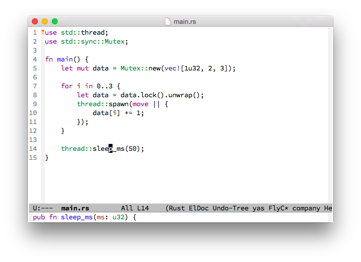
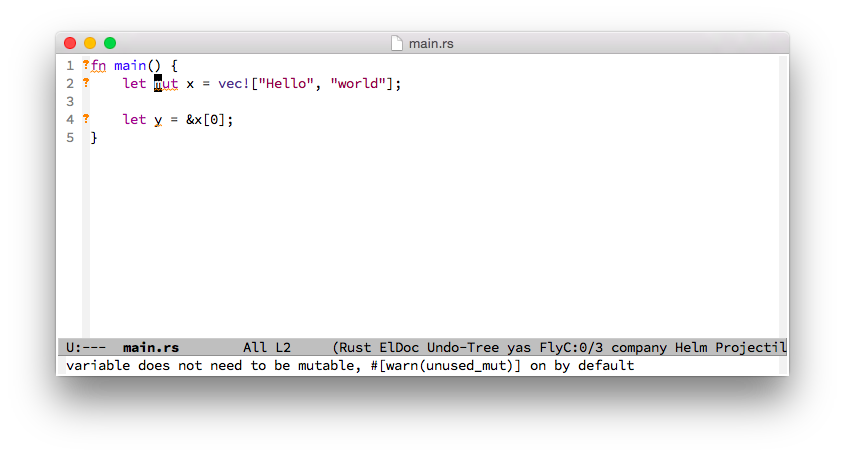
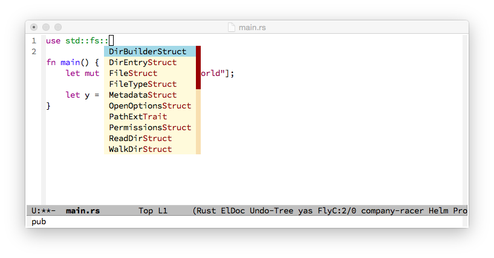
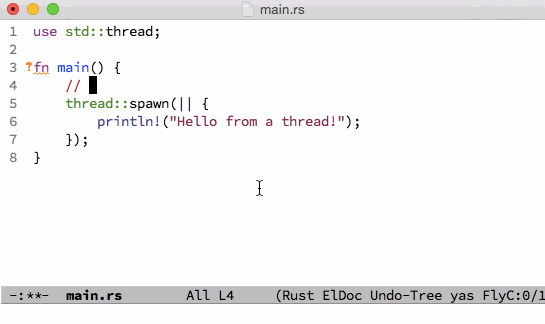

# Emacs

本節介紹 Emacs (Version 24) 的 Rust 配置，假設你已經安裝好了 Emacs，並且有使用 Emacs 的經驗。具體的安裝和使用說明，見網上相關文檔，在此不贅述。

另外，本節的例子是在 Mac OS 上，在 Linux 上面基本一樣。

Windows的Emacs用戶僅作參考。

## 簡介

Emacs 的 rust-mode 提供了語法高亮顯示和 elisp 函數，可以圍繞 Rust 函數定義移動光標。有幾個插件提供了附加的功能，如自動補全和動態語法檢查。



## 安裝插件

首先，需要將 melpa 代碼庫添加到你的插件列表中，才能安裝 Rust 需要的插件。將下面的代碼片段加入你的```~/.emacs.d/init.el``` 文件中。

```
;; Add melpa repository to archives
(add-to-list 'package-archives
    '("melpa" . "http://melpa.milkbox.net/packages/") t)

;; Initialize packages
(package-initialize)

```

運行下面的命令，更新插件列表。

- M-x eval-buffer
- M-x package-refresh-contents

然後，就可以安裝插件，在 Emacs 中使用 Rust 了。運行 ```M-x package-list-packages```，用 ```i``` 標記下述插件進行安裝，當所有的插件選擇好了之後，用 ```x``` 執行安裝。

- company
- company-racer
- racer
- flycheck
- flycheck-rust
- rust-mode

將下面的代碼片段加入你的```~/.emacs.d/init.el``` 文件：

```
;; Enable company globally for all mode
(global-company-mode)

;; Reduce the time after which the company auto completion popup opens
(setq company-idle-delay 0.2)

;; Reduce the number of characters before company kicks in
(setq company-minimum-prefix-length 1)
;; Set path to racer binary
(setq racer-cmd "/usr/local/bin/racer")

;; Set path to rust src directory
(setq racer-rust-src-path "/Users/YOURUSERNAME/.rust/src/")

;; Load rust-mode when you open `.rs` files
(add-to-list 'auto-mode-alist '("\\.rs\\'" . rust-mode))

;; Setting up configurations when you load rust-mode
(add-hook 'rust-mode-hook

     '(lambda ()
     ;; Enable racer
     (racer-activate)

	 ;; Hook in racer with eldoc to provide documentation
     (racer-turn-on-eldoc)

	 ;; Use flycheck-rust in rust-mode
     (add-hook 'flycheck-mode-hook #'flycheck-rust-setup)

	 ;; Use company-racer in rust mode
     (set (make-local-variable 'company-backends) '(company-racer))

	 ;; Key binding to jump to method definition
     (local-set-key (kbd "M-.") #'racer-find-definition)

	 ;; Key binding to auto complete and indent
     (local-set-key (kbd "TAB") #'racer-complete-or-indent)))

```



## 配置 Racer

Racer 需要 Rust 的源代碼用於自動補全。

- git clone https://github.com/rust-lang/rust.git ~/.rust
- 重新啟動 Emacs 並打開一個 Rust 源代碼文件。



## 結論

現在，可以在 Emacs 中編輯 Rust 源代碼文件了。功能總結如下：

- 語法高亮顯示和自動縮進
- 自動補全
- 動態語法錯誤檢查
- 跳轉到函數定義
- 內嵌文檔



## 註釋

1. 本節的內容適用於 Emacs Version 24；版本 23 的配置方法不同；版本 22 及以下不支持。
2. MacOS 自帶的 Emacs 版本是 22，版本 24 可以從[這裡](http://emacsformacosx.com/)下載。
