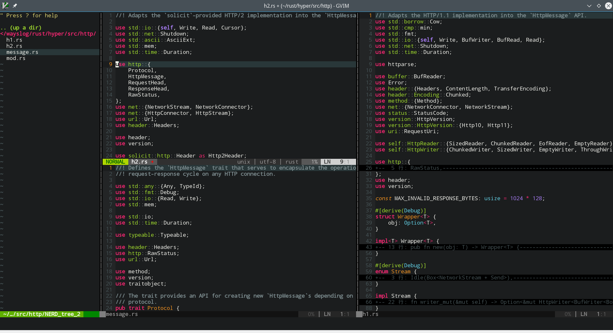
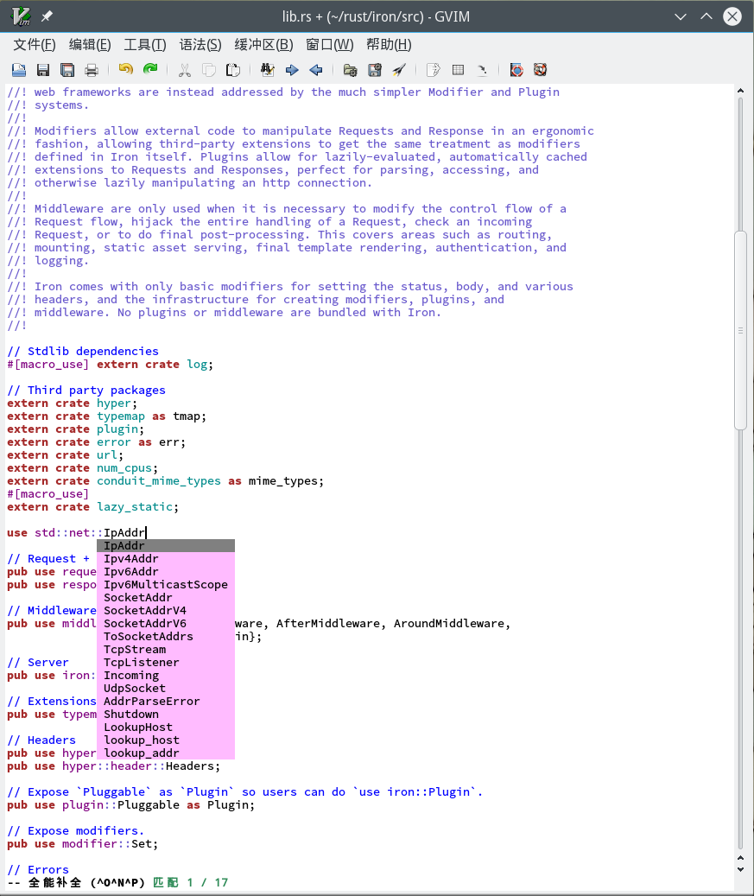

# vim/GVim安裝配置

本節介紹vim的Rust支持配置，在閱讀本節之前，我們假定你已經擁有了一個可執行的rustc程序，並編譯好了racer。

## 我的vim截圖

應邀而加



## 使用vundle

vundle是vim的一個插件管理工具，基本上算是本類當中最為易用的了。
首先我們需要安裝它

### linux or OS X

```bash
mkdir -p  ~/.vim/bundle/
git clone https://github.com/VundleVim/Vundle.vim.git ~/.vim/bundle/Vundle.vim
```

### windows

1. 首先找到你的gvim的安裝路徑，然後在路徑下找到vimfiles文件夾
2. 在這個文件夾中將vundle庫克隆到vimfiles/bundle/目錄下的Vundle.vim文件夾中

## 啟用rust支持

### 下載源碼

首先，你需要下載rust-lang的源碼文件，並將其解壓到一個路徑下。
這個源碼文件我們可以從[rust官網](https://www.rust-lang.org/downloads.html)下載到，請下載你對應平臺的文件。
然後將其解壓到一個目錄下，並找到其源碼文件中的`src`目錄。
比如我們解壓源碼包到`C:\\rust-source\`，那麼我們需要的路徑就是`C:\\rust-source\src`，記好這個路徑，我們將在下一步用到它。

### 修改vim配置

首先找到你的vimrc配置文件，然後在其中添加如下配置

```vim
set nocompatible
filetype off
set rtp+=~/.vim/bundle/Vundle.vim
call vundle#begin()

Plugin 'VundleVim/Vundle.vim'
Plugin 'racer-rust/vim-racer'
Plugin 'rust-lang/rust.vim'

call vundle#end()

filetype on
```

然後為了讓配置生效，我們重啟我們的(g)vim，然後在vim裡執行如下命令

```
:PluginInstall
```

這裡vundle會自動的去倉庫里拉取我們需要的文件，這裡主要是vim-racer和rust.vim兩個庫。

### 更多的配置

為了讓我們的vim能正常的使用，我們還需要在vimrc配置文件里加入一系列配置，

```vim
"" 開啟rust的自動reformat的功能
let g:rustfmt_autosave = 1

"" 手動補全和定義跳轉
set hidden
"" 這一行指的是你編譯出來的racer所在的路徑
let g:racer_cmd = "<path-to-racer>/target/release/racer"
"" 這裡填寫的就是我們在1.2.1中讓你記住的目錄
let $RUST_SRC_PATH="<path-to-rust-srcdir>/src/"
```

#### 使用 YouCompleteMe

YouCompleteMe 是 vim 下的智能補全插件, 支持 C-family, Python, Rust 等的語法補全, 整合了多種插件, 功能強大. Linux 各發行版的官方源裡基本都有軟件包, 可直接安裝. 如果有需要進行編譯安裝的話, 可參考[官方教程](https://github.com/Valloric/YouCompleteMe#installation)

讓 YCM 支持 Rust 需要在安裝 YCM 過程中執行 ./install.py 時加上 --racer-completer, 並在 .vimrc 中添加如下設置

```
let g:ycm_rust_src_path="<path-to-rust-srcdir>/src/"
"" 一些方便的快捷鍵
""" 在 Normal 模式下, 敲 <leader>jd 跳轉到定義或聲明(支持跨文件)
nnoremap <leader>jd :YcmCompleter GoToDefinitionElseDeclaration<CR>
""" 在 Insert 模式下, 敲 <leader>; 補全
inoremap <leader>; <C-x><C-o>
```

## 總結

經過不多的配置，我們得到了如下功能：

  1. 基本的c-x c-o補全 (使用 YCM 後, 能做到自動補全)
  2. 語法著色
  3. gd跳轉到定義

總體來看支持度並不高。



### 額外的
Q1. 顏色好挫

A1. 我推薦一個配色，也是我自己用的 [molokai](https://github.com/tomasr/molokai)

更詳細內容可以參見我的[vimrc配置](https://github.com/wayslog/dotfiles/blob/master/_vimrc)，當然，我這個用的是比較老的版本的vundle，僅供參考。

Have a nice Rust !
