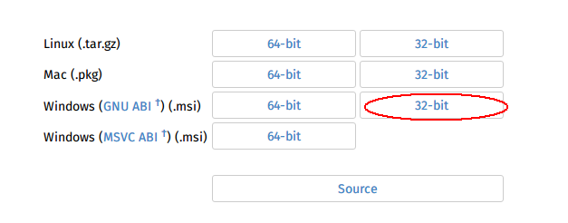
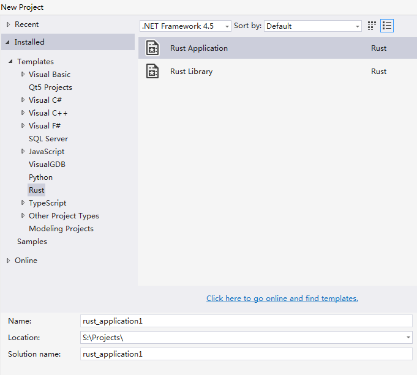
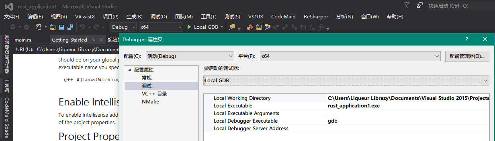

# Visual Studio

本文是使用VisualRust和VS GDB Debugger / VisualGDB 完成在VisualStudio中，編輯和調試Rust程序。

## 安裝Rust, Cargo

首先需要下載Rust, 下載地址https://www.rust-lang.org/downloads.html

這裡一定要下windows GNU ABI的版本, 因為我們要用GDB來調試.

另外，機器上也需要安裝Visual Studio2013或2015。
安裝完Rust,打開命令行，執行
cargo install racer

Racer是用來做Rust自動完成的，會在VisualRust使用。這裡我們使用rust編譯的racer, 並不用VisualRust裡自帶的racer，因為它太舊了.
另外需要下載Rust源代碼，設置
RUST_SRC_PATH為Rust源代碼src的目錄

## 安裝VisualRust和VS GDB Debugger

做完上述工作，就可以安裝VisualRust和VS GDB Debugger,在這裡下載
https://github.com/PistonDevelopers/VisualRust
https://visualstudiogallery.msdn.microsoft.com/35dbae07-8c1a-4f9d-94b7-bac16cad9c01

VisualGDB可在這裡購買
http://www.visualgdb.com/

## 編譯Rust項目

新建Rust項目

在tool, option裡設置racer和rust_src_path

這時候就可以在寫代碼的時候就可以自動提示了。像下面這樣

## 用VS GDB Debugger調試Rust項目

ok,愉快的開始你的Rust之旅吧。下面開始使用VS GDB Debugger調試Rust.

在解決方案中，添加GDB調試項目

設置需要調試的程序所在的目錄和文件名

設置需要調試的程序的編譯命令，此處用rustc，也可以使用cargo編譯

將需要調試的程序的源代碼添加到項目目錄下

打開源代碼文件並設置斷點信息，將項目設置為啟動項目並選擇Local GDB即可開始調試

## 用VisualGDB調試Rust項目

Build完Rust程序，點擊debug, 選擇quick debug with gdb

然後在裡面選擇MingW和exe的路徑

 點擊Debug,開始你的調試生活吧

