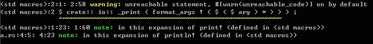

# 函數返回值
  在rust中，任何函數都有返回類型，當函數返回時，會返回一個該類型的值。我們先來看看main函數：
  
  ```rust
  fn main() {
    //statements
  }
  ```
  
  之前有說過，函數的返回值類型是在參數列表後，加上箭頭和類型來指定的。不過，一般我們看到的main函數的定義並沒有這麼做。這是因為main函數的返回值是`()`，在rust中，當一個函數返回`()`時，可以省略。main函數的完整形式如下：
  
  ```rust
  fn main() -> () {
    //statements
  }
  ```
  
  main函數的返回值類型是`()`，它是一個特殊的元組——沒有元素的元組，稱為`unit`，它表示一個函數沒有任何信息需要返回。在Rust Reference的[Types](https://doc.rust-lang.org/reference/types.html#tuple-types)中是的描述如下：
  > For historical reasons and convenience, the tuple type with no elements (`()`) is often called ‘unit’ or ‘the unit type’.

  `()`類型，其實類似於C/C++、Java、C#中的`void`類型。

  下面來看一個有返回值的例子：
  
  ```rust
  fn main() {
    let a = 3;
    println!("{}", inc(a));
  }

  fn inc(n: i32) -> i32 {
    n + 1
  }
  ```
  
  上面的例子中，函數`inc`有一個`i32`類型的參數和返回值，作用是將參數加1返回。需要注意的是`inc`函數中只有`n+1`一個表達式，並沒有像C/C++或Java、C#等語言有顯式地`return`語句類返回一個值。這是因為，與其他基於語句的語言（如C語言）不同，rust是基於表達式的語言，函數中最後一個表達式的值，默認作為返回值。當然，rust中也有語句，關於rust的語句和表達式，請看[下一節](statement_expression.md)。

## return關鍵字
  rust也有`return`關鍵字，不過一般用於提前返回。來看一個簡單地例子：
  
  ```rust
fn main() {
  let a = [1,3,2,5,9,8];
  println!("There is 7 in the array: {}", find(7, &a));
  println!("There is 8 in the array: {}", find(8, &a));
}

fn find(n: i32, a: &[i32]) -> bool {
  for i in a {
    if *i == n {
      return true;
    }
  }
  false
}
  ```
  
  上例中，`find`函數，接受一個`i32`類型`n`和一個`i32`類型的切片(`slice`)`a`，返回一個`bool`值，若n是a的元素，則返回`true`，否則返回`false`。可以看到，`return`關鍵字，用在`for`循環的`if`表達式中，若此時a的元素與n相等，則立刻返回true，剩下的循環不必再進行，否則一直循環檢測完整個切片(slice)，最後返回false。當然，return語句也可以用在最後返回，像C/C++一樣使用：把`find`函數最後一句`false`改為`return false;`（注意分號不可省略）也是可以的，不過這就不是rust的編程風格了。這裡需要注意的是，`for`循環中的`i`，其類型為`&i32`，需要使用解引用操作符來變換為`i32`類型。另外，切片（slice）在這裡可以看作是對數組的引用，關於切片與數組的詳細解釋可以看[Rust Reference](https://doc.rust-lang.org/reference.html#array-and-slice-types)和[rustbyexample](http://rustbyexample.com/primitives/array.html)中的相關內容。

## 返回多個值
  rust的函數不支持多返回值，但是我們可以利用元組來返回多個值，配合rust的模式匹配，使用起來十分靈活。先看例子：
  
  ```rust
fn main() {
  let (p2,p3) = pow_2_3(789);
  println!("pow 2 of 789 is {}.", p2);
  println!("pow 3 of 789 is {}.", p3);
}

fn pow_2_3(n: i32) -> (i32, i32) {
  (n*n, n*n*n)
}
  ```
  
  可以看到，上例中，`pow_2_3`函數接收一個`i32`類型的值，返回其二次方和三次方的值，這兩個值包裝在一個元組中返回。在`main`函數中，`let`語句就可以使用模式匹配將函數返回的元組進行解構，將這兩個返回值分別賦給`p2`和`p3`，從而可以得到`789`二次方的值和三次方的值。

## 發散函數
  發散函數（diverging function）是rust中的一個特性。發散函數不返回，它使用感嘆號`!`作為返回類型表示：
  
  ```rust
fn main() {
  println!("hello");
  diverging();
  println!("world");
}

fn diverging() -> ! {
  panic!("This function will never return");
}
  ```
  
  由於發散函數不會返回，所以就算其後再有其他語句也是不會執行的。倘若其後還有其他語句，會出現如下編譯警告：。當然了，我們要知道的是不發散的函數也是可以不返回的，比如無限循環之類的。
  發散函數一般都以`panic!`宏調用或其他調用其他發散函數結束，所以，調用發散函數會導致當前線程崩潰。[Rust Reference 6.1.3.2 Diverging functions][ref]中的描述如下：
  > We call such functions "diverging" because they never return a value to the caller. Every control path in a diverging function must end with a panic!() or a call to another diverging function on every control path. The ! annotation does not denote a type.

  [ref]:http://doc.rust-lang.org/reference.html#diverging-functions
