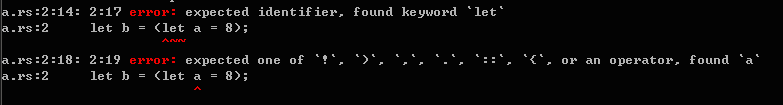

# 語句和表達式
  rust是一個基於表達式的語言，不過它也有語句。rust只有兩種語句：聲明語句和表達式語句，其他的都是表達式。基於表達式是函數式語言的一個重要特徵，表達式總是返回值。

## 聲明語句
  rust的聲明語句可以分為兩種，一種為變量聲明語句，另一種為Item聲明語句。
  1. 變量聲明語句。主要是指`let`語句，如:

  ```rust
  let a = 8;
  let b: Vec<f64> = Vec::new();
  let (a, c) = ("hi", false);
  ```
  
  由於let是語句，所以不能將let語句賦給其他值。如下形式是錯誤的：
  
  ```rust
  let b = (let a = 8);
  ```
  
  rustc編譯器會給出錯誤信息：

  2. Item聲明。是指函數（function）、結構體（structure）、類型別名（type）、靜態變量（static）、特質（trait）、實現（implementation）或模塊（module）的聲明。這些聲明可以嵌套在任意塊（block）中。關於Item聲明，Rust Reference中的描述如下：
  > An item declaration statement has a syntactic form identical to an item declaration within a module. Declaring an item — a function, enumeration, structure, type, static, trait, implementation or module — locally within a statement block is simply a way of restricting its scope to a narrow region containing all of its uses; it is otherwise identical in meaning to declaring the item outside the statement block.

  當然，這裡不能展開講這些Item都是如何聲明的，詳情請看RustPrimer的其他相關章節。

## 表達式語句
  表達式語句，由一個表達式和一個分號組成，即在表達式後面加一個分號就將一個表達式轉變為了一個語句。所以，有多少種表達式，就有多少種表達式語句。

  __rust有許多種表達式：__
  * 字面表達式（literal expression）

  ```rust
  ();        // unit type
  "hello";   // string type
  '1';       // character type
  15;         // integer type
  ```

  * 元組表達式(Tuple expression)：

  ```rust
  (0.0, 4.5);
  ("a", 4usize, true);
  ```
  
  通常不使用一個元素的元組，不過如果你堅持的話，rust也是允許的，不過需要在元素後加一個逗號：
  
  ```rust
  (0,); // single-element tuple
  (0); // zero in parentheses
  ```

  * 結構體表達式（structure expression）
  由於結構體有多種形式，所以結構體表達式也有多種形式。
  
  ```rust
  Point {x: 10.0, y: 20.0};
  TuplePoint(10.0, 20.0);
  let u = game::User {name: "Joe", age: 35, score: 100_000};
  some_fn::<Cookie>(Cookie);
  ```
  
  結構體表達式一般用於構造一個結構體對象，它除了以上從零構建的形式外，還可以在另一個對象的基礎上進行構建：
  
  ```rust
  let base = Point3d {x: 1, y: 2, z: 3};
  Point3d {y: 0, z: 10, .. base};
  ```

  * 塊表達式（block expression）：
  塊表達式就是用花括號`{}`括起來的一組表達式的集合，表達式間一般以分號分隔。塊表達式的值，就是最後一個表達式的值。
  
  ```rust
  let x: i32 = { println!("Hello."); 5 };
  ```
  
  如果以語句結尾，則塊表達式的值為`()`:
  
  ```rust
  let x: () = { println!("Hello."); };
  ```

  * 範圍表達式（range expression）:
  可以使用範圍操作符`..`來構建範圍對象（variant of `std::ops::Range`）：
  
  ```rust
  1..2;   // std::ops::Range
  3..;    // std::ops::RangeFrom
  ..4;    // std::ops::RangeTo
  ..;     // std::ops::RangeFull
  ```

  * if表達式（if expression）：

  ```rust
  let a = 9;
  let b = if a%2 == 0 {"even"} else {"odd"};
  ```

  * 除了以上這些外，還有許多，如：
    + path expression
    + mehond-call expression
    + field expression
    + array expression
    + index expression
    + unary operator expression
    + binary operator expression
    + return expression
    + grouped expression
    + match expression
    + if expression
    + lambda expression
    + ... ...

  這裡無法詳細展開，讀者可以到[Rust Reference][1]去查看。
  [1]:http://doc.rust-lang.org/reference.html#statements-and-expressions

> #### 以上表達式語句中的部分例子引用自[Rust Reference][ref]
  [ref]:http://doc.rust-lang.org/reference.html
