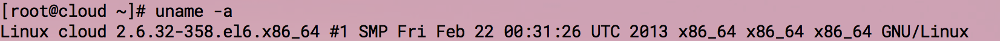

# Rust for Linux

Rust 支持主流的操作系統，Linux,Mac和 windows。

Rust 為Linux用戶提供了兩種安裝方式：

### 1、直接下載安裝包：

直接下載安裝包的話需要檢查一下你當前操作系統是64位還是32位，分別下載對應的安裝包。

查看操作系統請在終端執行如下命令:

`uname -a`

結果如下圖所示：

如上圖所示，如果是 **x86_64** 則證明是64位系統，需要[下載](https://static.rust-lang.org/dist/rust-1.5.0-x86_64-unknown-linux-gnu.tar.gz)64位安裝包；

如果是**x86-32**則需要[下載](https://static.rust-lang.org/dist/rust-1.5.0-i686-unknown-linux-gnu.tar.gz)32位安裝包

下載安裝包後解壓運行即可。*在書寫本章時，最新的穩定版本為1.5.0，*
 解壓：`tar -zxvf rust-1.5.0-x86_64-unknown-linux-gnu.tar.gz`

 解壓完進入對應的目錄：`cd rust-1.5.0-x86_64-unknown-linux-gnu`
 執行 `./install.sh`

上述命令執行完成後會打印： **Rust is ready to roll.** 表明安裝成功

此時執行: `rustc --version`, 你會看到對應的 rust 版本信息,如下圖所示：

### 2、命令行一鍵安裝：
Rust 提供簡單的一鍵安裝，命令如下：

`curl -sSf https://static.rust-lang.org/rustup.sh | sh`

打開終端執行如上命令即可。

**注意**

除了穩定版之外，Rust 還提供了 Beta 和 Nightly 版本，下載地址如下：
https://www.rust-lang.org/zh-CN/other-installers.html

如果你不想安裝 Rust 在你的電腦上，但是你還是像嘗試一下 rust，那麼這裡有一個在線的環境：http://play.rust-lang.org/

中國科學技術大學鏡像源包含 [rust-static](http://mirrors.ustc.edu.cn/rust-static/)，梯子暫時出問題的同學可以嘗試從這裡下載編譯器；除此之外。還有 Crates 源，詳見[這裡的說明](https://servers.ustclug.org/2016/01/mirrors-add-rust-crates/)。
