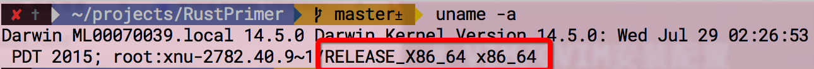

# Rust for Mac OS

Rust 支持主流的操作系統，Linux，Mac 和 windows。

Rust 為 mac 用戶提供了兩種安裝方式：

### 1、直接下載安裝包：

直接下載安裝包的話需要檢查一下你當前操作系統是64位還是32位，分別下載對應的安裝包。
查看操作系統請在終端執行如下命令:

`uname -a`

如上圖紅色部分所示，如果是 **x86_64** 則證明是64位系統，需要[下載](https://static.rust-lang.org/dist/rust-1.5.0-x86_64-apple-darwin.pkg)64位安裝包；
如果是**x86-32**則需要[下載](https://static.rust-lang.org/dist/rust-1.5.0-i686-apple-darwin.pkg)32位安裝包

和安裝普通的軟件一樣，直接運行安裝包即可。

*在書寫本章時，最新的穩定版本為1.5.0，*

### 2、命令行一鍵安裝：
Rust 提供簡單的一鍵安裝，命令如下：

`curl -sSf https://static.rust-lang.org/rustup.sh | sh`

*此過程，有可能需要你輸入幾次密碼*

你只需打開你的命令行執行如上代碼就可以了。（注意，你可能需要一個梯子，否則會遇到一些類似*Could not resolve host: static.rust-lang.org*的錯誤）

### 3.驗證安裝：
如果你完成了上面任意一個步驟，請執行如下命令：

`rustc --version`

如果看到如下信息，表明你安裝成功：

`rustc 1.5.0 (3d7cd77e4 2015-12-04)`

如果提示沒有 *rustc* 命令，那麼請回顧你是否有某個地方操作不對，請回過頭來再看一遍文檔。

**注意**

除了穩定版之外，Rust 還提供了 Beta 和 Nightly 版本，下載地址如下：
https://www.rust-lang.org/zh-CN/other-installers.html

如果你不想安裝 Rust 在你的電腦上，但是你還是像嘗試一下 rust，那麼這裡有一個在線的環境：http://play.rust-lang.org/

中國科學技術大學鏡像源包含 [rust-static](http://mirrors.ustc.edu.cn/rust-static/)，梯子暫時出問題的同學可以嘗試從這裡下載編譯器；除此之外，還有 Crates 源，詳見[這裡的說明](https://servers.ustclug.org/2016/01/mirrors-add-rust-crates/)。
