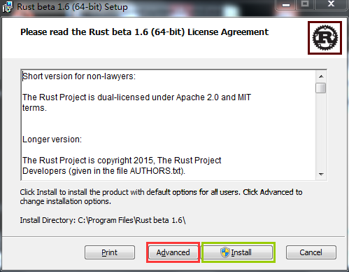

# Rust for Windows

Rust 支持主流的操作系統，Linux,Mac和 Windows。

Rust在Windows上的安裝和你在windows上安裝其它軟件一樣。

### 1、下載安裝包：

  [下載地址](https://www.rust-lang.org/zh-CN/other-installers.html)

  Rust提供了多個版本和多個平臺的安裝包，下載對應的即可，此處我們以[1.6.0](https://static.rust-lang.org/dist/rust-1.6.0-x86_64-pc-windows-gnu.msi)的穩定版為例。

### 2、安裝：
雙擊下載到的安裝包，如下圖所示：

默認，rust將安裝到所有用戶下，選擇“Advanced”，可以指定安裝用戶和安裝路徑。然後點擊"install"等待幾分鐘即可（中間可能會有安全提示，點擊允許即可，如果你裝了360之類的，需要小心360阻止寫入註冊表）。

### 3.驗證安裝：

安裝完成後，運行windows命令行，然後輸入:

`rustc --version`

看到 以 **rustc 1.6.0** 開頭，說明你安裝成功了。

**注意**

中國科學技術大學鏡像源包含 [rust-static](http://mirrors.ustc.edu.cn/rust-static/)，梯子暫時出問題的同學可以嘗試從這裡下載編譯器；除此之外。還有 Crates 源，詳見[這裡的說明](https://servers.ustclug.org/2016/01/mirrors-add-rust-crates/)。
