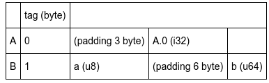

enum
====

Rust 中的列舉是 Rust 一個強大的功能，它跟 C 的列舉最大的不同是，它可以帶有資料

```rust
enum Foo {
  A(i32),
  B {
    a: u8,
    b: u64
  }
}
```

如果你有學過 C 語言，那你或許會知道 C 語言的列舉背後其實是個整數型態

```c
enum Foo {
  A,
  B
}

printf("%d\n", A); // 應該會印出 0
```

但 Rust 的呢，絕對不是隻是個整數那麼簡單而已，而其實在 C 之中也有類似的東西，那就是 union ，那才是唯一可以存進幾個不同型態的功能，像這樣：

```c
union Foo {
  int A,
  struct { char a; int b; } B;
}
```

就可以做出類似 Rust 中的 enum 的功能了，只是還是不太一樣，在 C 中的 union 要自己記住實際存了什麼，不然的話萬一存取錯欄位可能會發生不可預期的行為，那如果我們把資料存在哪個欄位的資訊也存進去呢：

```c
struct Foo {
  int tag;
  union {
    int A,
    struct { char a; int b; } B;
  } data;
}
```

比如有存資料的是 `A` 那就在 `tag` 存進 `0` ，如果是 `B` 那就存進 `1` ，透過多加一個變數，並在要進行存取前檢查這個變數，這樣就能減少出錯的可能性，而實際上 Rust 的 enum 就是以類似這樣的方式運作的，如果我們以上面的資料型態，再加上一個 `main`：

```rust
enum Foo {
  A(i32),
  B {
    a: u8,
    b: u64
  }
}

fn main() {
  let a = Foo::A(3);
  let b = Foo::B { a: 1, b: 42 };
}
```

然後拿去用這個指令編成組語的話

```shell
$ rustc --emit=asm main.rs
```

我們可以在組語的 `main` 裡找到這段

```asm
  movl  $3, 4(%rsp)
  movb  $0, (%rsp)
  movb  $1, 17(%rsp)
  movq  $42, 24(%rsp)
  movb  $1, 16(%rsp)
```

> 對了，這個系列在某些地方會看到組語，或 llvm ir ，但不會詳細解釋每個指令在做什麼，因此希望你可以自己去了解

於是從這段組語中可以推斷出來 Rust 中的 enum 應該是底下的儲存方式



但如果你拿去跟上面的 C 語言產生的組語比較的話，你會發現在 padding 方面好像又不太一樣， Rust 為了提高空間的利用效率，實際上是用像這樣的方式儲存的：

```
union Foo {
  struct A {
    tag: u8,
    0: i32
  },
  struct B {
    tag: u8,
    a: u8,
    b: u64
  },
}
```

> 上面那個並不是正確的語法，只是這樣寫我比較好表示而已

像這樣把 `tag` 也放進去當 struct 的一個值，再加上 Rust 會重排 struct 內的值，這樣在某些情況下就能減少 padding 佔的消耗

不過也因為這樣的特性，如何把 Rust 的 enum 與 C 的做轉換就是一大問題了，目前比較安全的做法就只有自己做轉換了

```rust
enum Foo {
  A(i32),
  B { a: u8, b: u64 },
}

#[derive(Copy, Clone)]
struct RawFooVariantB {
  a: u8,
  b: u64,
}

#[repr(C)]
union RawFooVariant {
  a: i32,
  b: RawFooVariantB,
}

#[repr(C)]
struct RawFoo {
  tag: u8,
  variant: RawFooVariant,
}

impl From<Foo> for RawFoo {
  fn from(foo: Foo) -> RawFoo {
    match foo {
      Foo::A(i) => RawFoo {
        tag: 0,
        variant: RawFooVariant { a: i },
      },
      Foo::B { a, b } => RawFoo {
        tag: 0,
        variant: RawFooVariant {
            b: RawFooVariantB { a, b },
        },
      },
    }
  }
}
```

目前這個問題有一些與之相關的 issue 與 rfc

- [#60533 Tracking issue for RFC 2363, "Allow arbitrary enums to have explicit discriminants"](https://github.com/rust-lang/rust/issues/60553)
- [RFC 2195 really_tagged_unions](https://github.com/rust-lang/rfcs/blob/master/text/2195-really-tagged-unions.md)

另外這種結構，雖說可以在 C 或 C++ 中實作出來，可是因為 C 與 C++ 都沒有 pattern matching ，所以用起來並沒有像 Rust 這樣好用，如果在 C++ 或許還可以用指標與 class 的繼承來做出類似的東西會比較方便一點

參考資料
--------

- [http://patshaughnessy.net/2018/3/15/how-rust-implements-tagged-unions](http://patshaughnessy.net/2018/3/15/how-rust-implements-tagged-unions)
