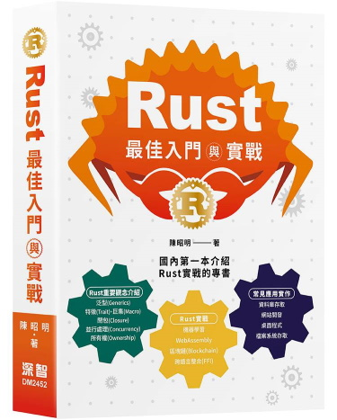

## [【Rust 最佳入門與實戰】](https://www.tenlong.com.tw/products/9786267383957?list_name=b-r7-zh_tw) 範例程式

## 各章參考資料：參考資料.pdf。
## 補充說明：
#### 1.  第二章、第十七章所使用到的resnet18.ot，檔案過大，無法上傳至GitHub，請直接至 https://github.com/LaurentMazare/tch-rs/releases/download/mw/resnet18.ot 下載。
#### 2.  第二章 2-7 須至 [PyTorch](https://pytorch.org/) 下載 LibTorch CPU版本，並解壓縮至 c:\libtorch，再依序執行下列指令：
#### - set_env.bat
#### - pretrained_models.exe resnet18.ot tiger.jpg
#### 3. LibTorch GPU版本 在 Windows 作業系統執行出現錯誤訊息【torch_cuda.dll cusparseSDDMM error】，可能是NVidia顯卡版本過舊，可參照 https://github.com/pytorch/pytorch/issues/60854 說明。

## 目錄：
### 第一篇為Rust基礎介紹，含第一~五章。
#### 第一章Rust入門，介紹Rust語言特點、環境建置、套件管理工具(Cargo)及學習資源。
#### 第二章Rust火力展示，預先展示Rust與Python/JavaScript整合，引用OpenCV套件進行影像處理，引用Polars套件進行資料分析(Data analysis)、機器學習/深度學習及資料庫存取等功能。
#### 第三章介紹Rust基礎的資料型別，學習任何程式語言，都是從變數資料型別及控制流程開始，Rust也不例外，Rust資料型別定義非常嚴謹，可以精準定義變數所需的記憶體空間，另外，必須掌握變數所有權才可以掌握記憶體管理。
#### 第四章介紹Rust流程控制，除了一般的分叉(if/else)、迴圈外，也會介紹例外管理機制，這方面與大部分的程式語言(Try/Catch)大相逕庭，需特別注意。
#### 第五章介紹命令行(CLI)應用程式實作，將之前學習的資料型別與控制流程的知識加以應用，開發一些簡單的命令行(Command Line Interface, CLI)應用程式，藉以熟悉命令行參數解析、多執行緒(Multi-threading)、工作日誌(Logging)、單元測試(Unit testing)及6.	組態管理(configuration management)等程式技巧。
### 第二篇為Rust進階介紹，含第六~十一章。
#### 第六章介紹所有權(Ownership)，這是Rust語言較難理解的部分，Rust為了確實做好記憶體管理，必須確實掌握變數的生命週期，才能在生命週期結束時，適時釋放記憶體。
#### 第七章介紹泛型(Generics)，它類似物件導向程式設計(OOP)的【多載】(Overload)、多型(Polymorphism)的概念，一個函數可以適用多種資料型別，不須為每一種型別各寫一個函數，另外，也介紹Rust內建的泛型資料結構。
#### 第八章介紹特徵(Trait)，Rust不提供類別(Class)，轉而提供Trait及結構(Struct)的整合，作為實踐【物件導向程式設計】(OOP)的基礎，這是Rust程式開發的重要基石。
#### 第九章介紹巨集(Macro)，巨集以特殊的語法形式擴展程式，類似程式產生器，也可以實作成【裝飾器】(Decorator)，加註在結構(struct)、枚舉(enum)及函數前面。
#### 第十章介紹閉包(Closure)，Closure是一種匿名函數，Python稱為Lambda function，是【函數程式設計】(Function Programming)的關鍵角色。
#### 第十一章介紹並行處理(Concurrency)，包括多個執行緒(Thread)及非同步(Asynchronous)處理，可解決I/O bound的瓶頸，提升執行效能。
### 第三篇Rust實戰，介紹開發應用程式常見的檔案系統、資料庫存取與使用者介面，還介紹網站開發、與其他程式語言溝通、資料科學、機器學習及深度學習…等，也包括最新的技術如WebAssembly、區塊鏈(Blockchain)、Foreign Function Interface (FFI)。
#### 第十二章介紹WebAssembly，簡稱wasm，是一種新形態的網頁運行方式，它類似Assembly的低階程式語言，以二進位格式(Binary format)在瀏覽器的JavaScript虛擬機內運行，執行效能直逼原生程式。
#### 第十三章介紹各種檔案讀寫方式、資料夾檢視與搜尋與各式資料庫的新增/查詢/更新/刪除(CRUD)。
#### 第十四章介紹資料庫存取，包括關聯式資料庫(Relational database)及NoSQL資料庫，也包括ORM(Object Relational Mapping)操作。
#### 第十五章介紹使用者介面(User Interface)，包括圖形化使用者介面(Graphic User Interface, GUI)、Web based的桌面程式及網站開發。
#### 第十六章介紹Foreign Function Interface (FFI)規格，透過此規格可與其他程式語言溝通，包括C/C++、Python…等。
#### 第十七章介紹以Rust開發機器學習/深度學習的方式。
#### 第十八章介紹區塊鏈(Blockchain)，越來越多的系統開發者使用Rust撰寫區塊鏈相關程式，我們介紹一個具體而微的區塊鏈程式，包括挖礦及P2P網路。
