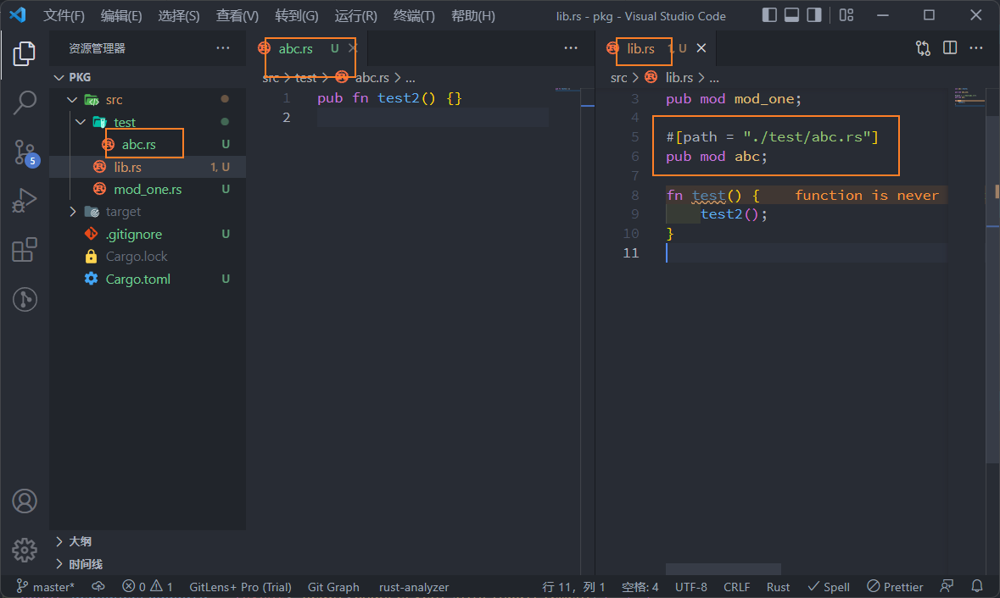

## 模組 (Module) 和套件 (Package)

我們學會函式後，程式碼可以分離，然而，隨著專案規模上升，函式名稱有可能相互衝突。雖然，我們也可以修改函式名稱，但是，只靠函數名稱來區分函式，往往會造成函數名稱變得冗長。像 C 語言中，沒有額外的機制處理函式名稱的衝突，就會看到很多長名稱的函式，像是 `gtk_application_get_windows` (出自 GTK+ 函式庫)。Rust 提供模組 (module) 的機制，處理函式命名衝突的問題。

*註：在許多程式語言中，以命名空間 (namespace) 提供類似的機制。*

在我們先前的內容中，函式和主程式都寫在同一個檔案。在實務上，我們會將函式或物件獨立出來，製成套件 (package)，之後可以重覆利用。例如，同一套函式庫，可供終端機或圖形介面等不同使用者介面來使用。在 Rust 中，套件和模組相互關連。Rust 的套件又稱為 crate。

### 使用模組

雖然我們在先前的內容沒有強調模組，實際上，我們已經在使用模組了。我們回頭看先前的一個例子：

```rust
// Call f64 module
use std::f64;
 
fn main() {
    // Call sqrt function
    let n = f64::sqrt(4.0);
 
    println!("{}", n);
}
```

在這個例子中，我們呼叫 `std` 函式庫之中的 `f64` 模組，之後，就可以呼叫該模組內的 `sqrt` 函式。

### 撰寫模組

在 Rust 中，使用 `mod` 這個關鍵字來建立模組。如下例：

```rust
mod english {
    pub fn hello(name: &str) {
        println!("Hello, {}", name);
    }
}
 
mod chinese {
    pub fn hello(name: &str) {
        println!("你好，{}", name);
    }
}
 
fn main() {
    // Call modules
    use english;
    use chinese;
 
    // Call two functions with the same name
    english::hello("Michael");
    chinese::hello("麥可");
}
```

在本例中，我們在兩個模組中定義了同名而不同功能的函式。由於這兩個函式被區隔不同的模組中，不會有命名衝突的問題。模組除了區隔函式名稱外，也提供私有區塊，在模組中的函式或物件，需以 `pub` 關鍵字宣告，否則無法在模組外使用。

如同我們先前看到的範例，模組也可以內嵌。如下例：

```rust
mod english {
    pub mod greeting {
        pub fn hello(name: &str) {
            println!("Hello, {}", name);
        }
    }
 
    pub mod farewell {
        pub fn goodbye(name: &str) {
            println!("Goodbye, {}", name);
        }
    }
}
 
fn main() {
    use english;
 
    english::greeting::hello("Michael");
    english::farewell::goodbye("Michael");
}
```

由本例可知，透過模組的機制，可以協助我們整理函式。

### 建立套件

在我們先前的範例中，我們建立的是應用程式專案，如下：

```sh
cargo new --bin myapp
```

但若想將函式或物件獨立出來，供其他 Rust 程式使用，則要用函式庫專案，如下：

```sh
cargo new --lib mylib
```

我們現在實際建立一個函式庫套件。以上述指令建立 mylib 函式庫套件。加入以下函式：

```rust
// mylib/src/lib.rc
pub fn hello(name: &str) -> String {
    format!("Hello, {}", name)
}
```

之後，退回到上一層目錄，建立 myapp 主程式套件。加入以下內容：

```rust
// myapp/src/main.rs
 
// Call mylib
extern crate mylib;
 
fn main() {
    assert_eq!(mylib::hello("Michael"), "Hello, Michael");
}
```

透過 `extern crate` 可以呼叫外部專案。另外，要修改 Cargo.toml 紀錄檔，加入以下內容：

```rust
[dependencies]
mylib = { path = "../mylib" }
```

之後，執行該專案，若可正確執行，代表我們成功地建立套件。

如果函式庫存放在遠端站臺上，需修改存取位置。在下例中，我們存取以 Git 存放的函式庫：

```rust
[dependencies]
rand = { git = "https://github.com/rust-lang-nursery/rand.git" }
```

Cargo.toml 是 Rust 套件 (i.e. crate) 使用的設定檔。建議花一些時間熟悉其[官方文件](http://doc.crates.io/guide.html)。

### 在套件中使用模組

在我們先前的例子中，透過 mylib 函式庫對函式命名做最基本的區隔。不過，我們也可以在函式庫中使用模組來進一步區隔函式。我們先以實例看加入模組後的效果：

```rust
// Call external library
extern crate phrase;
 
fn main() {
    assert_eq!("Hello, Michael", phrase::english::greeting::hello("Michael"));
    assert_eq!("你好，麥可", phrase::chinese::greeting::hello("麥可"));
}
```


同樣地，需於 Cargo.toml 加入套件位置：

```sh
[dependencies]
phrase = { path = "../phrase" }
```

我們現在要實際建立這個函式庫。退回上一層目錄，建立 phrase 函式庫專案：

```sh
cargo new --lib phrase
```

```sh
$ tree
.
├── Cargo.lock
├── Cargo.toml
└── src
    ├── chinese
    │   ├── greeting.rs
    │   └── mod.rs
    ├── english
    │   ├── greeting.rs
    │   └── mod.rs
    └── lib.rs
```

在 *src/lib.rs* 中宣告模組，記得要宣告公開權限：


在 *src/english/mod.rs* 中宣告子模組：

```rust
pub mod greeting;
```

```rust
pub fn hello(name: &str) -> String {
    format!("Hello, {}", name)
}
```

同樣地，在 *src/chinese/mod.rs* 中宣告子模組：

```rust
pub mod greeting;
```

同樣地，在 src/chinese/greeting.rs 中實作函式：

```rust
pub fn hello(name: &str) -> String {
	format!("你好，{}", name)
}
```

由於 Rust 的模組及套件和檔案名稱是連動的，若使用錯誤的檔案名稱將無法編譯，需注意。

### 進階的模組使用方式

在先前的例子中，由於函式庫結構較複雜，使得函式呼叫的動作變得繁瑣，Rust 提供別名來簡化這個動作。如下例：

```rust
extern crate phrase;
 
use phrase::english::greeting as en_greeting;
use phrase::chinese::greeting as zh_greeting;
 
fn main() {
    assert_eq!("Hello, Michael", en_greeting::hello("Michael"));
    assert_eq!("你好，麥可", zh_greeting::hello("麥可"));
}
```

Rust 官方文件中提供了另一個更複雜的模組呼叫範例：

```rust
// Rename crate
extern crate phrases as sayings;
 
// Rename module
use sayings::japanese::greetings as ja_greetings;
 
// Glob all functions in a module, NOT a good style
use sayings::japanese::farewells::*;
 
// A complex renaming scheme
use sayings::english::{self, greetings as en_greetings, farewells as en_farewells};
 
fn main() {
    println!("Hello in English; {}", en_greetings::hello());
    println!("And in Japanese: {}", ja_greetings::hello());
    println!("Goodbye in English: {}", english::farewells::goodbye());
    println!("Again: {}", en_farewells::goodbye());
 
    // Use a globbed function, AVOID it when possible.
    println!("And in Japanese: {}", goodbye());
}
```

稍微閱讀一下程式碼，大概就知道如何呼叫模組。要注意的是，globbing 的動作，會直接暴露函式名稱到主程式中，喪失使用模組區隔函式名稱的用意，應盡量避免。


---

## Rust模組組織結構

出處 ：https://jasonkayzk.github.io/2022/11/19/Rust%E6%A8%A1%E5%9D%97%E7%BB%84%E7%BB%87%E7%BB%93%E6%9E%84/

1. [基本說明](https://jasonkayzk.github.io/2022/11/19/Rust模塊組織結構/#基本說明)
2. Package、Crate和Module
   1. [包 Crate](https://jasonkayzk.github.io/2022/11/19/Rust模塊組織結構/#包-Crate)
   2. 項目 Package
      1. [二進制 Package](https://jasonkayzk.github.io/2022/11/19/Rust模塊組織結構/#二進制-Package)
      2. [庫 Package](https://jasonkayzk.github.io/2022/11/19/Rust模塊組織結構/#庫-Package)
      3. [易混淆的 Package 和包](https://jasonkayzk.github.io/2022/11/19/Rust模塊組織結構/#易混淆的-Package-和包)
      4. [典型的 Package 結構](https://jasonkayzk.github.io/2022/11/19/Rust模塊組織結構/#典型的-Package-結構)
   3. 模組 Module
      1. [建立巢狀模組](https://jasonkayzk.github.io/2022/11/19/Rust模塊組織結構/#創建嵌套模塊)
      2. 模組樹
         1. [父子模組](https://jasonkayzk.github.io/2022/11/19/Rust模塊組織結構/#父子模塊)
      3. 用路徑引用模組
         1. [絕對路徑引用](https://jasonkayzk.github.io/2022/11/19/Rust模塊組織結構/#絕對路徑引用)
         2. [相對路徑引用](https://jasonkayzk.github.io/2022/11/19/Rust模塊組織結構/#相對路徑引用)
         3. [絕對還是相對？](https://jasonkayzk.github.io/2022/11/19/Rust模塊組織結構/#絕對還是相對？)
      4. [程式碼可見性](https://jasonkayzk.github.io/2022/11/19/Rust模塊組織結構/#代碼可見性)
      5. [使用 super 引用模組](https://jasonkayzk.github.io/2022/11/19/Rust模塊組織結構/#使用-super-引用模塊)
      6. [使用 self 引用模組](https://jasonkayzk.github.io/2022/11/19/Rust模塊組織結構/#使用-self-引用模塊)
      7. [結構體和列舉的可見性](https://jasonkayzk.github.io/2022/11/19/Rust模塊組織結構/#結構體和枚舉的可見性)
      8. [模組與檔案分離](https://jasonkayzk.github.io/2022/11/19/Rust模塊組織結構/#模塊與文件分離)
3. 使用 use 及受限可見性
   1. 基本引入方式
      1. [絕對路徑引入模組](https://jasonkayzk.github.io/2022/11/19/Rust模塊組織結構/#絕對路徑引入模塊)
      2. [相對路徑引入模組中的函數](https://jasonkayzk.github.io/2022/11/19/Rust模塊組織結構/#相對路徑引入模塊中的函數)
      3. [引入模組還是函數？](https://jasonkayzk.github.io/2022/11/19/Rust模塊組織結構/#引入模塊還是函數？)
   2. 避免同名引用
      1. [模組::函數](https://jasonkayzk.github.io/2022/11/19/Rust模塊組織結構/#模塊-函數)
      2. [as 別名引用](https://jasonkayzk.github.io/2022/11/19/Rust模塊組織結構/#as-別名引用)
   3. [引入項再匯出](https://jasonkayzk.github.io/2022/11/19/Rust模塊組織結構/#引入項再導出)
4. [使用第三方包](https://jasonkayzk.github.io/2022/11/19/Rust模塊組織結構/#使用第三方包)
5. [使用 {} 簡化引入方式](https://jasonkayzk.github.io/2022/11/19/Rust模塊組織結構/#使用-簡化引入方式)
6. [使用 * 引入模組下的所有項](https://jasonkayzk.github.io/2022/11/19/Rust模塊組織結構/#使用-引入模塊下的所有項)
7. [其他引入模組的方式](https://jasonkayzk.github.io/2022/11/19/Rust模塊組織結構/#其他引入模塊的方式)
8. 受限的可見性
   1. [限制可見性語法](https://jasonkayzk.github.io/2022/11/19/Rust模塊組織結構/#限制可見性語法)

1. [一個單檔案多模組的使用案例](https://jasonkayzk.github.io/2022/11/19/Rust模塊組織結構/#一個單文件多模塊的使用案例)
2. [多個目錄間模組引用](https://jasonkayzk.github.io/2022/11/19/Rust模塊組織結構/#多個目錄間模塊引用)
3. [多個Cargo之間進行引用](https://jasonkayzk.github.io/2022/11/19/Rust模塊組織結構/#多個Cargo之間進行引用)

- [附錄](https://jasonkayzk.github.io/2022/11/19/Rust模塊組織結構/#附錄)

本文講述了Rust中模組的組織形式和約定；

原始碼：

- https://github.com/JasonkayZK/rust-learn/tree/project-structure


# **Rust模組組織結構**

## **基本說明**

當工程規模變大時，把程式碼寫到一個甚至幾個檔案中，都是不太聰明的做法，可能存在以下問題：

1. 單個檔案過大，導致打開、翻頁速度大幅變慢
2. 查詢和定位效率大幅降低，類比下，你會把所有知識內容放在一個幾十萬字的文件中嗎？
3. 只有一個程式碼層次：函數，難以維護和協作，想像一下你的作業系統只有一個根目錄，剩下的都是單層子目錄會如何：`disaster`

同時，將大的程式碼檔案拆分成包和模組，還允許我們實現程式碼抽象和復用：將你的程式碼封裝好後提供給使用者，那麼使用者只需要呼叫公共介面即可，無需知道內部該如何實現；

Rust 有自己的規則和約定來組織其模組；例如：一個 crate 包最多可以有一個庫 `crate`，任意多個二進制`crate`、匯入資料夾內的模組的兩種約定方式等等；

先把一些術語說明一下：

- 項目(Packages)：**一個 `Cargo` 提供的 `feature`，可以用來建構、測試和分享包；**
- 包(Crate)：**一個由多個模組組成的樹形結構，可以作為三方庫進行分發，也可以生成可執行檔案進行運行；**
- 模組(Module)：**可以一個檔案多個模組，也可以一個檔案一個模組**，模組可以被認為是真實項目中的程式碼組織單元；

首先，`包(crate)` 是 Cargo 中的定義，執行 `cargo new xxxx` 就是建立了一個包，`crate` 是二進制(bin)或庫(lib)項目；

Rust 約定：在 `Cargo.toml` 的同級目錄下：

- 包含`src/main.rs`檔案，就是**與包同名的二進制`crate`；**
- 包含`src/lib.rs`，就是與**包同名的庫`crate`；**

一個包內可以有多個 `crate`，多個`crates`就是一個模組的樹形結構；例如，如果一個包內同時包含`src/main.rs`和`src/lib.rs`，那麼他就有兩個`crate`；

如果想要包含多個二進制`crate`，`rust`規定：需要將檔案放在`src/bin`目錄下，每個檔案就是一個單獨的`crate`！

`crate root` 是用來描述如何建構`crate`的檔案；例如：`src/main.rs`、`src/lib.rs` 都是`crate root`；

**`crate root`將由`Cargo`傳遞給`rustc`來實際建構庫或者二進制項目！**

> **這也是為什麼，入口檔案中要寫入各個模組：`mod xxx;` 才能使其生效！**

**帶有 `Cargo.toml` 檔案的包用來整體描述如何建構`crate`；同時，一個包可以最多有一個庫`crate`，任意多個二進制`crate`；**


## **Package、Crate和Module**

項目 `Package` 和包 `Crate` 的概念很容易被搞混，甚至在很多書中，這兩者都是不分的，但是由於官方對此做了明確的區分，因此我們會在本章節中試圖(掙紮著)理清這個概念；

### **包 Crate**

對於 Rust 而言，**crate 是一個獨立的可編譯單元，它編譯後會生成一個可執行檔案或者一個庫；**

一個包會將相關聯的功能打包在一起，使得該功能可以很方便的在多個項目中分享；

例如：標準庫中沒有提供、而是在三方庫中提供的 `rand` 包；它提供了隨機數生成的功能，我們只需要將該包通過 `use rand;` 引入到當前項目的範疇中，就可以在項目中使用 `rand` 的功能：`rand::XXX`；

**同一個包中不能有同名的類型，但是在不同包中就可以；**例如，雖然 `rand` 包中，有一個 `Rng` 特徵，可是我們依然可以在自己的項目中定義一個 `Rng`，前者通過 `rand::Rng` 訪問，後者通過 `Rng` 訪問，對於編譯器而言，這兩者的邊界非常清晰，不會存在引用歧義；


### **項目 Package**

鑑於 Rust 團隊標新立異的起名傳統，以及包的名稱被 `crate` 佔用，庫的名稱被 `library` 佔用，經過斟酌， 我們決定將 `Package` 翻譯成項目，你也可以理解為工程、軟體包；

由於 `Package` 就是一個項目，因此它**包含有獨立的 `Cargo.toml` 檔案，以及因為功能性被組織在一起的一個或多個包；一個 `Package` 只能包含一個庫(library)類型的包，但是可以包含多個二進制可執行類型的包；**


#### **二進制 Package**

下面的命令可以建立一個二進制 `Package`：

```
$ cargo new my-project
     Created binary (application) `my-project` package
$ ls my-project
Cargo.toml
src
$ ls my-project/src
main.rs
```

這裡，Cargo 為我們建立了一個名稱是 `my-project` 的 `Package`，同時在其中建立了 `Cargo.toml` 檔案，可以看一下該檔案，裡面並沒有提到 `src/main.rs` 作為程序的入口；

原因是 Cargo 有一個慣例：**`src/main.rs` 是二進制包的根檔案，該二進制包的包名跟所屬 `Package` 相同，在這裡都是 `my-project`，所有的程式碼執行都從該檔案中的 `fn main()` 函數開始；**

使用 `cargo run` 可以運行該項目，輸出：`Hello, world!`；


#### **庫 Package**

再來建立一個庫類型的 `Package`：

```
$ cargo new my-lib --lib
     Created library `my-lib` package
$ ls my-lib
Cargo.toml
src
$ ls my-lib/src
lib.rs
```

首先，如果你試圖運行 `my-lib`，會報錯：

```
$ cargo run
error: a bin target must be available for `cargo run`
```

原因是：**庫類型的 `Package` 只能作為三方庫被其它項目引用，而不能獨立運行，只有之前的二進制 `Package` 才可以運行；**

與 `src/main.rs` 一樣，Cargo 知道，如果一個 `Package` 包含有 `src/lib.rs`，意味它包含有一個庫類型的同名包 `my-lib`，該包的根檔案是 `src/lib.rs`；


#### **易混淆的 Package 和包**

看完上面，相信大家看出來為何 `Package` 和包容易被混淆了吧？因為你用 `cargo new` 建立的 `Package` 和它其中包含的包是同名的！

不過，只要你牢記：**`Package` 是一個項目工程，而包只是一個編譯單元，基本上也就不會混淆這個兩個概念了：`src/main.rs` 和 `src/lib.rs` 都是編譯單元，因此它們都是包；**


#### **典型的 `Package` 結構**

上面建立的 `Package` 中僅包含 `src/main.rs` 檔案，意味著它僅包含一個二進制同名包 `my-project`；

如果一個 `Package` 同時擁有 `src/main.rs` 和 `src/lib.rs`，那就意味著它包含兩個包：庫包和二進制包；

**同時，這兩個包名也都是 `my-project` —— 都與 `Package` 同名；**

一個真實項目中典型的 `Package`，會包含多個二進制包，這些包檔案被放在 `src/bin` 目錄下，每一個檔案都是獨立的二進制包，同時也會包含一個庫包，該包只能存在一個 `src/lib.rs`：

```
.
├── Cargo.toml
├── Cargo.lock
├── src
│   ├── main.rs
│   ├── lib.rs
│   └── bin
│       └── main1.rs
│       └── main2.rs
├── tests
│   └── some_integration_tests.rs
├── benches
│   └── simple_bench.rs
└── examples
    └── simple_example.rs
```

- **唯一庫包：`src/lib.rs`**
- **默認二進制包：`src/main.rs`，編譯後生成的可執行檔案與 `Package` 同名**
- **其餘二進制包：`src/bin/main1.rs` 和 `src/bin/main2.rs`，它們會分別生成一個檔案同名的二進制可執行檔案**
- **整合測試檔案：`tests` 目錄下**
- **基準性能測試 `benchmark` 檔案：`benches` 目錄下**
- **項目示例：`examples` 目錄下**

這種目錄結構基本上是 Rust 的標準目錄結構，在 `GitHub` 的大多數項目上，你都將看到它的身影；

理解了包的概念，我們再來看看構成包的基本單元：模組；


### **模組 Module**

本小節講深入講解 Rust 的程式碼構成單元：模組；

使用模組可以將包中的程式碼按照功能性進行重組，最終實現更好的可讀性及易用性；

同時，我們還能非常靈活地去控制程式碼的可見性，進一步強化 Rust 的安全性；


#### **建立巢狀模組**

小餐館，相信大家都挺熟悉的，學校外的估計也沒少去，那麼咱就用小餐館為例，來看看 Rust 的模組該如何使用；

可以使用 `cargo new --lib restaurant` 建立一個小餐館；

注意，這裡建立的是一個庫類型的 `Package`，然後將以下程式碼放入 `src/lib.rs` 中：

```rust
// 餐廳前廳，用於吃飯
mod front_of_house {
    mod hosting {
        fn add_to_waitlist() {}

        fn seat_at_table() {}
    }

    mod serving {
        fn take_order() {}

        fn serve_order() {}

        fn take_payment() {}
    }
}
```

**以上的程式碼（在同一個檔案中就）建立了三個模組**，有幾點需要注意的：

- **使用 `mod` 關鍵字來建立新模組，後面緊跟著模組名稱；**
- **模組可以巢狀，這裡巢狀的原因是招待客人和服務都發生在前廳，因此我們的程式碼模擬了真實場景；**
- **模組中可以定義各種 Rust 類型，例如函數、結構體、列舉、特徵等；**
- **所有模組均定義在同一個檔案中；**

類似上述程式碼中所做的，使用模組，我們就能將功能相關的程式碼組織到一起，然後通過一個模組名稱來說明這些程式碼為何被組織在一起，這樣其它程式設計師在使用你的模組時，就可以更快地理解和上手；


#### **模組樹**

之前我們提到過 `src/main.rs` 和 `src/lib.rs` 被稱為包根(crate root)，是由於這兩個檔案的內容形成了一個模組 `crate`，該模組位於包的樹形結構(由模組組成的樹形結構)的根部：

```
crate
 └── front_of_house
     ├── hosting
     │   ├── add_to_waitlist
     │   └── seat_at_table
     └── serving
         ├── take_order
         ├── serve_order
         └── take_payment
```

這顆樹展示了模組之間**彼此的巢狀**關係，因此被稱為**模組樹**；

其中 `crate` 包根是 `src/lib.rs` 檔案，包根檔案中的三個模組分別形成了模組樹的剩餘部分；


##### **父子模組**

如果模組 `A` 包含模組 `B`，那麼 `A` 是 `B` 的父模組，`B` 是 `A` 的子模組；

在上例中，`front_of_house` 是 `hosting` 和 `serving` 的父模組，反之，後兩者是前者的子模組；

聰明的讀者，應該能聯想到，模組樹跟電腦上檔案系統目錄樹的相似之處；

然而不僅僅是組織結構上的相似，就連使用方式都很相似：**每個檔案都有自己的路徑，使用者可以通過這些路徑使用它們，在 Rust 中，我們也通過路徑的方式來引用模組；**


#### **用路徑引用模組**

想要呼叫一個函數，就需要知道它的路徑，在 Rust 中，這種路徑有兩種形式：

- **絕對路徑**，從包根開始，路徑名以包名或者 `crate` 作為開頭
- **相對路徑**，從當前模組開始，以 `self`，`super` 或當前模組的識別碼作為開頭

讓我們繼續經營那個慘淡的小餐館，這次為它實現一個小功能：

src/lib.rs

```rust
// 餐廳前廳，用於吃飯
pub mod front_of_house {
    pub mod hosting {
        pub fn add_to_waitlist() {}
    }
}

pub fn eat_at_restaurant() {
    // 絕對路徑
    crate::front_of_house::hosting::add_to_waitlist();

    // 相對路徑
    front_of_house::hosting::add_to_waitlist();
}
```

`eat_at_restaurant` 是一個定義在 crate root 中的函數，在該函數中使用了兩種方式對 `add_to_waitlist` 進行呼叫；

##### **絕對路徑引用**

因為 `eat_at_restaurant` 和 `add_to_waitlist` 都定義在一個包中，因此在絕對路徑引用時，可以直接以 `crate` 開頭，然後逐層引用，每一層之間使用 `::` 分隔：

```
crate::front_of_house::hosting::add_to_waitlist();
```

對比下之前的模組樹：

```
crate
 └── eat_at_restaurant
 └── front_of_house
     ├── hosting
     │   ├── add_to_waitlist
     │   └── seat_at_table
     └── serving
         ├── take_order
         ├── serve_order
         └── take_payment
```

可以看出，絕對路徑的呼叫，完全符合了模組樹的層級遞進，非常符合直覺；

如果類比檔案系統，就跟使用絕對路徑呼叫可執行程序差不多：`/front_of_house/hosting/add_to_waitlist`，使用 `crate` 作為開始就和使用 `/` 作為開始一樣；


##### **相對路徑引用**

再回到模組樹中，因為 `eat_at_restaurant` 和 `front_of_house` 都處於 `crate root` 中，因此相對路徑可以使用 `front_of_house` 作為開頭：

```
front_of_house::hosting::add_to_waitlist();
```

如果類比檔案系統，那麼它**類似於呼叫同一個目錄下的程序**，你可以這麼做：`front_of_house/hosting/add_to_waitlist`；


##### **絕對還是相對？**

**如果只是為了引用到指定模組中的對象，那麼兩種都可以；**

但是在實際使用時，需要遵循一個原則：**當程式碼被挪動位置時，儘量減少引用路徑的修改，相信大家都遇到過，修改了某處程式碼，導致所有路徑都要挨個替換，這顯然不是好的路徑選擇；**

回到之前的例子：

如果我們把 `front_of_house` 模組和 `eat_at_restaurant` 移動到一個模組中 `customer_experience`，那麼絕對路徑的引用方式就必須進行修改：`crate::customer_experience::front_of_house ...`；

但是假設我們使用的相對路徑，那麼該路徑就無需修改，因為它們兩個的相對位置其實沒有變：

```
crate
 └── customer_experience
    └── eat_at_restaurant
    └── front_of_house
        ├── hosting
        │   ├── add_to_waitlist
        │   └── seat_at_table
```

從新的模組樹中可以很清晰的看出這一點；

再比如，其它的都不動，把 `eat_at_restaurant` 移動到模組 `dining` 中，如果使用相對路徑，你需要修改該路徑，但如果使用的是絕對路徑，就無需修改：

```
crate
 └── dining
     └── eat_at_restaurant
 └── front_of_house
     ├── hosting
     │   ├── add_to_waitlist
```

不過，如果不確定哪個好，你可以考慮**優先使用絕對路徑，因為呼叫的地方和定義的地方往往是分離的，而定義的地方較少會變動；**


#### **程式碼可見性**

Rust 出於安全的考慮，默認情況下，所有的類型都是私有化的，包括函數、方法、結構體、列舉、常數，是的，就連模組本身也是私有化的；

在 Rust 中，**父模組`完全無法訪問`子模組中的私有項，但是子模組卻可以訪問父模組、父父..模組的私有項！**

例如下面的程式碼是無法編譯通過的：

```rust
mod front_of_house {
    mod hosting {
        fn add_to_waitlist() {}
    }
}

pub fn eat_at_restaurant() {
    // 絕對路徑
    crate::front_of_house::hosting::add_to_waitlist();

    // 相對路徑
    front_of_house::hosting::add_to_waitlist();
}
```

`hosting` 模組是私有的，無法在包根進行訪問；

那麼為何 `front_of_house` 模組就可以訪問？

因為它和 `eat_at_restaurant` 同屬於一個包根範疇內，**同一個模組內的程式碼自然不存在私有化問題**(所以我們之前章節的程式碼都沒有報過這個錯誤！)；

類似其它語言的 `public` 或者 Go 語言中的首字母大寫，Rust 提供了 `pub` 關鍵字，通過它你可以控制模組和模組中指定項的可見性；


#### **使用 `super` 引用模組**

在上文用路徑引用模組小節，使用路徑引用模組中，我們提到了相對路徑有三種方式開始：`self`、`super`和 `crate` 或者模組名，其中第三種在前面已經講到過，現在來看看通過 `super` 的方式引用模組項；

`super` 代表的是**父模組為開始的引用方式，非常類似於檔案系統中的 `..`；**

語法：`../a/b` 檔案名稱：

src/lib.rs

```rust
// 餐廳前廳，用於吃飯
pub mod front_of_house {
    pub mod serving {
        fn serve_order() {}

        // 廚房模組
        mod back_of_house {
            fn fix_incorrect_order() {
                cook_order();
                super::serve_order();
            }

            fn cook_order() {}
        }
    }
}
```

在廚房模組中，使用 `super::serve_order` 語法，呼叫了父模組中的 `serve_order` 函數；

那麼你可能會問，為何不使用 `crate::serve_order` 的方式？

其實也可以，不過如果你確定未來這種層級關係不會改變，那麼 `super::serve_order` 的方式會更穩定，未來就算它們都不在 crate root了，依然無需修改引用路徑；

所以路徑的選用，往往還是取決於場景，以及未來程式碼的可能走向；


#### **使用 `self` 引用模組**

`self` 其實就是引用自身模組中的項，也就是說和我們之前章節的程式碼類似，都呼叫同一模組中的內容，區別在於之前章節中直接通過名稱呼叫即可，而 `self`，你得多此一舉：

```rust
pub mod serving {

  fn serve_order() {
    self::back_of_house::cook_order()
  }

  // 廚房模組
  mod back_of_house {
    pub fn cook_order() {}
  }
}
```

是的，多此一舉，因為完全可以直接呼叫 `back_of_house`，但是 `self` 還有一個大用處，在後文中會講；


#### **結構體和列舉的可見性**

為何要把結構體和列舉的可見性單獨拎出來講呢？因為這兩個傢伙的成員欄位擁有完全不同的可見性：

- **將結構體設定為 `pub`，但它的所有欄位依然是私有的；**
- **將列舉設定為 `pub`，它的所有欄位則將對外可見；**

原因在於：**列舉和結構體的使用方式不一樣：**

- 如果列舉的成員對外不可見，那該列舉將一點用都沒有，因此列舉成員的可見性自動跟列舉可見性保持一致，這樣可以簡化使用者的使用；
- 而結構體的應用場景比較複雜，其中的欄位也往往部分在 A 處被使用，部分在 B 處被使用，因此無法確定成員的可見性，那索性就設定為全部不可見，將選擇權交給程式設計師；


#### **模組與檔案分離**

在之前的例子中，我們所有的模組都定義在 `src/lib.rs` 中，但是當模組變多或者變大時，需要**將模組放入一個單獨的檔案中**，讓程式碼更好維護；

現在，把 `front_of_house` 前廳分離出來，放入一個單獨的檔案中：

src/front_of_house.rs

```rust
// 餐廳前廳，用於吃飯
pub mod hosting {
    pub fn add_to_waitlist() {}

    fn seat_at_table() {}
}

pub mod serving {
    fn take_order() {}

    fn serve_order() {
        self::back_of_house::cook_order()
    }

    fn take_payment() {}

    // 廚房模組
    mod back_of_house {
        fn fix_incorrect_order() {
            cook_order();
            super::serve_order();
        }

        pub fn cook_order() {}
    }
}
```

然後，將以下程式碼留在 `src/lib.rs` 中：

```rust
mod front_of_house;

pub use crate::front_of_house::hosting;

pub fn eat_at_restaurant() {
    // 絕對路徑
    hosting::add_to_waitlist();

    // 相對路徑
    hosting::add_to_waitlist();
}
```

其實跟之前在同一個檔案中也沒有太大的不同，但是有幾點值得注意：

- `mod front_of_house`：告訴 Rust 從另一個和模組 `front_of_house` 同名的檔案中載入該模組的內容；
- 使用絕對路徑的方式來引用 `hosting` 模組：`crate::front_of_house::hosting`；

需要注意的是，和之前程式碼中 `mod front_of_house{..}` 的完整模組不同：

現在的程式碼中，**模組的聲明和實現是分離的**，實現是在單獨的 `front_of_house.rs` 檔案中，然後通過 `mod front_of_house;` 這條聲明語句從該檔案中把模組內容載入進來；

**因此我們可以認為：模組 `front_of_house` 的定義還是在 `src/lib.rs` 中，只不過模組的具體內容被移動到了 `src/front_of_house.rs` 檔案中；**

在這裡出現了一個新的關鍵字 `use`，聯想到其它章節我們見過的標準庫引入 `use std::fmt;`，可以大致猜測，該關鍵字**用來將外部模組中的項引入到當前範疇中來，這樣無需冗長的父模組前綴即可呼叫**：`hosting::add_to_waitlist();`，在下節中，我們將對 `use` 進行詳細的講解；


## **使用 use 及受限可見性**

如果程式碼中，通篇都是 `crate::front_of_house::hosting::add_to_waitlist` 這樣的函數呼叫形式，我不知道有誰會喜歡；

因此我們需要一個辦法來簡化這種使用方式，在 Rust 中，**可以使用 `use` 關鍵字把路徑提前引入到當前範疇中，隨後的呼叫就可以省略該路徑，極大地簡化了程式碼；**


### **基本引入方式**

在 Rust 中，引入模組中的項有兩種方式：[絕對路徑和相對路徑](https://course.rs/basic/crate-module/module.html#用路徑引用模塊)，這兩者在前文中都講過，就不再贅述；

先來看看使用絕對路徑的引入方式；

#### **絕對路徑引入模組**

```rust
mod front_of_house {
    pub mod hosting {
        pub fn add_to_waitlist() {}
    }
}

use crate::front_of_house::hosting;

pub fn eat_at_restaurant() {
    hosting::add_to_waitlist();
    hosting::add_to_waitlist();
    hosting::add_to_waitlist();
}
```

這裡，我們使用 `use` 和絕對路徑的方式，將 `hosting` 模組引入到當前範疇中，然後只需通過 `hosting::add_to_waitlist` 的方式，即可呼叫目標模組中的函數；

相比 `crate::front_of_house::hosting::add_to_waitlist()` 的方式要簡單的多；

那麼，還能更簡單嗎？


#### **相對路徑引入模組中的函數**

在下面程式碼中，我們不僅要使用相對路徑進行引入，而且與上面引入 `hosting` 模組不同，直接引入該模組中的 `add_to_waitlist` 函數：

```rust
mod front_of_house {
    pub mod hosting {
        pub fn add_to_waitlist() {}
    }
}

use front_of_house::hosting::add_to_waitlist;

pub fn eat_at_restaurant() {
    add_to_waitlist();
    add_to_waitlist();
    add_to_waitlist();
}
```

很明顯，函數呼叫又變得更短了；


#### **引入模組還是函數？**

從使用簡潔性來說，引入函數自然是更甚一籌，但是在某些時候，引入模組會更好：

- **需要引入同一個模組的多個函數**
- **範疇中存在同名函數**

在以上兩種情況中，使用 `use front_of_house::hosting` 引入模組要比 `use front_of_house::hosting::add_to_waitlist;` 引入函數更好；

**例如，如果想使用 `HashMap`，那麼直接引入該結構體是比引入模組更好的選擇，因為在 `collections` 模組中，我們只需要使用一個 `HashMap` 結構體：**

```rust
use std::collections::HashMap;

fn main() {
    let mut map = HashMap::new();
    map.insert(1, 2);
}
```

其實嚴格來說，對於引用方式並沒有需要遵守的慣例，主要還是取決於你的喜好，不過我們建議：

**優先使用最細粒度(引入函數、結構體等)的引用方式，如果引起了某種麻煩(例如前面兩種情況)，再使用引入模組的方式；**


### **避免同名引用**

根據上一章節的內容，我們只要**保證同一個模組中不存在同名項**就行；

話雖如此，一起看看，如果遇到同名的情況該如何處理；

#### **模組::函數**

```rust
use std::fmt;
use std::io;

fn function1() -> fmt::Result {
    // --snip--
}

fn function2() -> io::Result<()> {
    // --snip--
}
```

rust上面的例子給出了很好的解決方案，使用模組引入的方式，具體的 `Result` 通過 `模組::Result` 的方式進行呼叫；

可以看出，**避免同名衝突的關鍵，就是使用父模組的方式來呼叫；**

除此之外，還可以給予引入的項起一個別名；


#### **`as` 別名引用**

對於同名衝突問題，還可以使用 `as` 關鍵字來解決，它可以賦予引入項一個全新的名稱：

```rust
use std::fmt::Result;
use std::io::Result as IoResult;

fn function1() -> Result {
    // --snip--
}

fn function2() -> IoResult<()> {
    // --snip--
}
```

如上所示，首先通過 `use std::io::Result` 將 `Result` 引入到範疇，然後使用 `as` 給予它一個全新的名稱 `IoResult`，這樣就不會再產生衝突：

- `Result` 代表 `std::fmt::Result；`
- `IoResult` 代表 `std:io::Result`；


### **引入項再匯出**

**當外部的模組項 `A` 被引入到當前模組中時，它的可見性自動被設定為私有的，如果你希望允許其它外部程式碼引用我們的模組項 `A`，那麼可以對它進行再匯出：**

```rust
mod front_of_house {
    pub mod hosting {
        pub fn add_to_waitlist() {}
    }
}

pub use crate::front_of_house::hosting;

pub fn eat_at_restaurant() {
    hosting::add_to_waitlist();
    hosting::add_to_waitlist();
    hosting::add_to_waitlist();
}
```

如上，**使用 `pub use` 即可實現：**

**這裡 `use` 代表引入 `hosting` 模組到當前範疇，`pub` 表示將該引入的內容再度設定為可見；**

當你希望將內部的實現細節隱藏起來或者按照某個目的組織程式碼時，可以使用 `pub use` 再匯出；

例如，統一使用一個模組來提供對外的 API，那該模組就可以引入其它模組中的 API，然後進行再匯出，最終對於使用者來說，所有的 API 都是由一個模組統一提供的；


## **使用第三方包**

之前我們一直在引入標準庫模組或者自訂模組，現在來引入下第三方包中的模組；

關於如何引入外部依賴，在 [Cargo 入門](https://course.rs/first-try/cargo.html#package-配置段落)中就有講，這裡直接給出操作步驟：

1. **修改 `Cargo.toml` 檔案，在 `[dependencies]` 區域新增一行：`rand = "0.8.3"`**
2. **此時，如果你用的是 `VSCode` 和 `rust-analyzer` 外掛，該外掛會自動拉取該庫，你可能需要等它完成後，再進行下一步（VSCode 左下角有提示）**

好了，此時，`rand` 包已經被我們新增到依賴中，下一步就是在程式碼中使用：

```rust
use rand::Rng;

fn main() {
    let secret_number = rand::thread_rng().gen_range(1..101);
}
```

這裡使用 `use` 引入了第三方包 `rand` 中的 `Rng` 特徵，因為我們需要呼叫的 `gen_range` 方法定義在該特徵中；

> **crates.io，lib.rs**
>
> Rust 社區已經為我們貢獻了大量高品質的第三方包，你可以在 `crates.io` 或者 `lib.rs` 中檢索和使用；
>
> 從目前來說尋找包更推薦 `lib.rs`，搜尋功能更強大，內容展示也更加合理，但是下載依賴包還是得用`crates.io`；


## **使用 `{}` 簡化引入方式**

對於以下一行一行的引入方式：

```rust
use std::collections::HashMap;
use std::collections::BTreeMap;
use std::collections::HashSet;

use std::cmp::Ordering;
use std::io;
```

可以使用 `{}` 來一起引入進來，在大型項目中，使用這種方式來引入，可以減少大量 `use` 的使用：

```rust
use std::collections::{HashMap,BTreeMap,HashSet};
use std::{cmp::Ordering, io};
```

對於下面的同時引入模組和模組中的項：

```rust
use std::io;
use std::io::Write;
```

可以使用 `{}` 的方式進行簡化:

```rust
use std::io::{self, Write};
```

> **self**
>
> 上面使用到了模組章節提到的 `self` 關鍵字，用來替代模組自身，結合上一節中的 `self`，可以得出它在模組中的兩個用途：
>
> - **`use self::xxx`，表示載入當前模組中的 `xxx`。此時 `self` 可省略**
> - **`use xxx::{self, yyy}`，表示，載入當前路徑下模組 `xxx` 本身，以及模組 `xxx` 下的 `yyy`**


## **使用 `\*` 引入模組下的所有項**

對於之前一行一行引入 `std::collections` 的方式，我們還可以使用

```
use std::collections::*;
```

以上這種方式來引入 `std::collections` 模組下的所有公共項，這些公共項自然包含了 `HashMap`，`HashSet` 等想手動引入的集合類型；

當**使用 `\*` 來引入的時候要格外小心，因為你很難知道到底哪些被引入到了當前範疇中，有哪些會和你自己程序中的名稱相衝突：**

```rust
use std::collections::*;

struct HashMap;
fn main() {
   let mut v =  HashMap::new();
   v.insert("a", 1);
}
```

以上程式碼中，`std::collection::HashMap` 被 `*` 引入到當前範疇，但是由於存在另一個同名的結構體，因此 `HashMap::new` 根本不存在，因為對於編譯器來說，**本地同名類型的優先順序更高；**

在實際項目中，**這種引用方式往往用於快速寫測試程式碼，它可以把所有東西一次性引入到 `tests` 模組中；**


## **其他引入模組的方式**

通過 `#[path ="你的路徑"]` 可以放在任何目錄都行，如：

```
#[path ="你的路徑"]
mod core;
```

可以無視 `mod.rs` 或者目錄方式：

[](https://user-images.githubusercontent.com/100085326/164968138-0efae930-8bc0-4c8b-b4e8-163e6c566d5a.png)

當然，也可以在目錄下建立 `mod.rs` 檔案，但是需要一層一層的 `pub mod` 匯出，或者採用 `2018` 版本的模組目錄和模組.rs 同名方式（**官方推薦**)，總之，`#[path]` 方式最靈活（慎用）；

三種方式對比：

`Rust` 模組引用三種方式：

| Rust 2015                                   | Rust 2018                                   | #[path = “路徑”]                                             |
| :------------------------------------------ | :------------------------------------------ | :----------------------------------------------------------- |
| . ├── lib.rs └── foo/ ├── mod.rs └── bar.rs | . ├── lib.rs ├── foo.rs └── foo/ └── bar.rs | . ├── lib.rs └── pkg/ // 任意目錄名 ├── foo.rs // #[path = “./pkg/foo.rs”] └── bar.rs // #[path = “./pkg/bar.rs”] |


## **受限的可見性**

在上一節中，我們學習了[可見性](https://course.rs/basic/crate-module/module.html#代碼可見性)這個概念，這也是模組體系中最為核心的概念，控制了模組中哪些內容可以被外部看見，但是在實際使用時，光被外面看到還不行，我們還想控制哪些人能看，這就是 Rust 提供的受限可見性；

例如，**在 Rust 中，包是一個模組樹，我們可以通過 `pub(crate) item;` 這種方式來實現：`item` 雖然是對外可見的，但是隻在當前包內可見，外部包無法引用到該 `item`；**

所以，如果我們想要**讓某一項可以在整個包中都可以被使用，那麼有兩種辦法：**

- **在crate root中定義一個非 `pub` 類型的 `X`(父模組的項對子模組都是可見的，因此包根中的項對模組樹上的所有模組都可見)；**
- **在子模組中定義一個 `pub` 類型的 `Y`，同時通過 `use` 將其引入到包根；**

例如：

```rust
mod a {
    pub mod b {
        pub fn c() {          
            println!("{:?}",crate::X);
        }

      // 在子模組中定義一個 `pub` 類型的 `Y`，同時通過 `use` 將其引入到包根
        #[derive(Debug)]
        pub struct Y;
    }
}

// 在crate root中定義一個非 `pub` 類型的 `X`(父模組的項對子模組都是可見的，因此包根中的項對模組樹上的所有模組都可見)
#[derive(Debug)]
struct X;
use a::b::Y;
fn d() {
    println!("{:?}",Y);
}
```

以上程式碼充分說明瞭之前兩種辦法的使用方式，但是有時我們會遇到這兩種方法都不太好用的時候；

例如希望對於某些特定的模組可見，但是對於其他模組又不可見：

```rust
// 目標：`a` 匯出 `I`、`bar` and `foo`，其他的不匯出
pub mod a {
    pub const I: i32 = 3;

    fn semisecret(x: i32) -> i32 {
        use self::b::c::J;
        x + J
    }

    pub fn bar(z: i32) -> i32 {
        semisecret(I) * z
    }
    pub fn foo(y: i32) -> i32 {
        semisecret(I) + y
    }

    mod b {
        mod c {
            const J: i32 = 4;
        }
    }
}
```

這段程式碼會報錯，因為與父模組中的項對子模組可見相反，子模組中的項對父模組是不可見的；

這裡 `semisecret` 方法中，`a` -> `b` -> `c` 形成了父子模組鏈，那 `c` 中的 `J` 自然對 `a` 模組不可見；

如果使用之前的可見性方式，那麼想保持 `J` 私有，同時讓 `a` 繼續使用 `semisecret` 函數的辦法是：將該函數移動到 `c` 模組中，然後用 `pub use` 將 `semisecret` 函數進行再匯出：

```rust
pub mod a {
    pub const I: i32 = 3;

    use self::b::semisecret;

    pub fn bar(z: i32) -> i32 {
        semisecret(I) * z
    }
    pub fn foo(y: i32) -> i32 {
        semisecret(I) + y
    }

    mod b {
        pub use self::c::semisecret;
        mod c {
            const J: i32 = 4;
            pub fn semisecret(x: i32) -> i32 {
                x + J
            }
        }
    }
}
```

這段程式碼說實話問題不大，但是有些破壞了我們之前的邏輯；

如果想保持程式碼邏輯，同時又只讓 `J` 在 `a` 內可見該怎麼辦？

```rust
pub mod a {
    pub const I: i32 = 3;

    fn semisecret(x: i32) -> i32 {
        use self::b::c::J;
        x + J
    }

    pub fn bar(z: i32) -> i32 {
        semisecret(I) * z
    }
    pub fn foo(y: i32) -> i32 {
        semisecret(I) + y
    }

    mod b {
        pub(in crate::a) mod c {
            pub(in crate::a) const J: i32 = 4;
        }
    }
}
```

通過 `pub(in crate::a)` 的方式，我們指定了模組 `c` 和常數 `J` 的可見範圍都只是 `a` 模組中，`a` 之外的模組是完全訪問不到它們的！


#### **限制可見性語法**

`pub(crate)` 或 `pub(in crate::a)` 就是限制可見性語法，前者是限制在整個包內可見，後者是通過絕對路徑，**限制在包內的某個模組內可見**，總結一下：

- **`pub` 意味著可見性無任何限制；**
- **`pub(crate)` 表示在當前包可見；**
- **`pub(self)` 在當前模組可見；**
- **`pub(super)` 在父模組可見；**
- **`pub(in <path>)` 表示在某個路徑代表的模組中可見，其中 `path` 必須是父模組或者祖先模組；**


## **一個單檔案多模組的使用案例**

下面是一個模組的綜合例子：

my_mod/src/lib.rs

```rust
// 一個名為 `my_mod` 的模組
mod my_mod {
    // 模組中的項默認具有私有的可見性
    fn private_function() {
        println!("called `my_mod::private_function()`");
    }

    // 使用 `pub` 修飾語來改變默認可見性。
    pub fn function() {
        println!("called `my_mod::function()`");
    }

    // 在同一模組中，項可以訪問其它項，即使它是私有的。
    pub fn indirect_access() {
        print!("called `my_mod::indirect_access()`, that\n> ");
        private_function();
    }

    // 模組也可以巢狀
    pub mod nested {
        pub fn function() {
            println!("called `my_mod::nested::function()`");
        }

        fn private_function() {
            println!("called `my_mod::nested::private_function()`");
        }

        // 使用 `pub(in path)` 語法定義的函數隻在給定的路徑中可見。
        // `path` 必須是父模組（parent module）或祖先模組（ancestor module）
        pub(in crate::my_mod) fn public_function_in_my_mod() {
            print!("called `my_mod::nested::public_function_in_my_mod()`, that\n > ");
            public_function_in_nested()
        }

        // 使用 `pub(self)` 語法定義的函數則只在當前模組中可見。
        pub(self) fn public_function_in_nested() {
            println!("called `my_mod::nested::public_function_in_nested");
        }

        // 使用 `pub(super)` 語法定義的函數隻在父模組中可見。
        pub(super) fn public_function_in_super_mod() {
            println!("called my_mod::nested::public_function_in_super_mod");
        }
    }

    pub fn call_public_function_in_my_mod() {
        print!("called `my_mod::call_public_funcion_in_my_mod()`, that\n> ");
        nested::public_function_in_my_mod();
        print!("> ");
        nested::public_function_in_super_mod();
    }

    // `pub(crate)` 使得函數隻在當前包中可見
    pub(crate) fn public_function_in_crate() {
        println!("called `my_mod::public_function_in_crate()");
    }

    // 巢狀模組的可見性遵循相同的規則
    mod private_nested {
        pub fn function() {
            println!("called `my_mod::private_nested::function()`");
        }
    }
}

fn function() {
    println!("called `function()`");
}

#[cfg(test)]
mod tests {
    use super::*;

    #[test]
    fn main() {
        // 模組機制消除了相同名字的項之間的歧義。
        function();
        my_mod::function();

        // 公有項，包括巢狀模組內的，都可以在父模組外部訪問。
        my_mod::indirect_access();
        my_mod::nested::function();
        my_mod::call_public_function_in_my_mod();

        // pub(crate) 項可以在同一個 crate 中的任何地方訪問
        my_mod::public_function_in_crate();

        // pub(in path) 項只能在指定的模組中訪問
        // 報錯！函數 `public_function_in_my_mod` 是私有的
        //my_mod::nested::public_function_in_my_mod();

        // 模組的私有項不能直接訪問，即便它是巢狀在公有模組內部的

        // 報錯！`private_function` 是私有的
        //my_mod::private_function();

        // 報錯！`private_function` 是私有的
        //my_mod::nested::private_function();

        // 報錯！ `private_nested` 是私有的
        //my_mod::private_nested::function();
    }
}
```

> **上面的內容90%以上整理自：**
>
> - https://course.rs/basic/crate-module/intro.html
>
> **一本神一樣的 Rust 語言聖經！**


## **多個目錄間模組引用**

前面給出的例子大多都是在單個模組中引用；

本小節來看一看在不同目錄之間的引用；

看一下目錄結構：

```
$ tree .                      
.
├── Cargo.lock
├── Cargo.toml
└── src
    ├── main.rs
    └── user_info
        ├── mod.rs
        └── user.rs

3 directories, 9 files
```

**`rust`約定在目錄下使用`mod.rs`將模組匯出；**

看一下user.rs的程式碼：

```rust
#[derive(Debug)]
pub struct User {
    name: String,
    age: i32
}

impl User {
    pub fn new_user(name: String, age: i32) -> User {
        User{
            name,
            age
        }
    }
    pub fn name(&self) -> &str {
        &self.name
    }
}

pub fn add(x: i32, y: i32) -> i32 {
    x + y 
}
```

然後在`mod.rs`裡匯出：

```
pub mod user;
```

在`main.rs`呼叫：

```rust
mod user_info;
use user_info::user::User;

fn main() {
    let u1 = User::new_user(String::from("tom"), 5);
    println!("user name: {}", u1.name());
    println!("1+2: {}", user_info::user::add(1, 2));
}
```


## **多個Cargo之間進行引用**

最後，再來看看多個 Cargo 項目之間的引用；

首先分別建立一個可執行項目和一個庫項目：

```
cargo new multi-crate
cargo new utils --lib
```

在utils庫中，已經生成了程式碼：

```rust
pub fn add(left: usize, right: usize) -> usize {
    left + right
}

#[cfg(test)]
mod tests {
    use super::*;

    #[test]
    fn it_works() {
        let result = add(2, 2);
        assert_eq!(result, 4);
    }
}
```

在我們的二進制庫的`Cargo.toml`引入該庫：

```
[dependencies]
utils = { path = "../utils", version = "0.1.0" }
```

`path`就是庫項目的路徑；

`main.rs`使用`use`引入就可以使用了：

```rust
use utils::add;

fn main() {
    let x = add(1, 2);
    println!("utils::add(1, 2): {}", x);
}
```


# **附錄**

原始碼：

- https://github.com/JasonkayZK/rust-learn/tree/project-structure