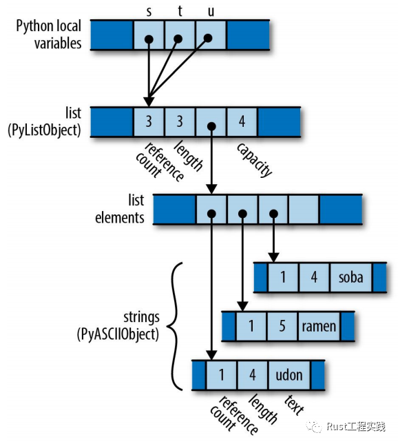
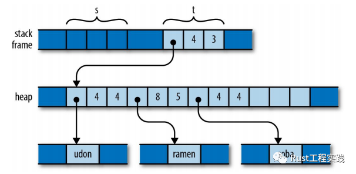
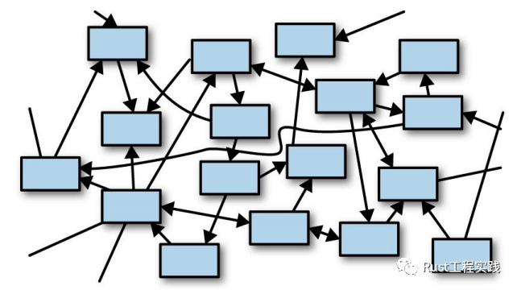
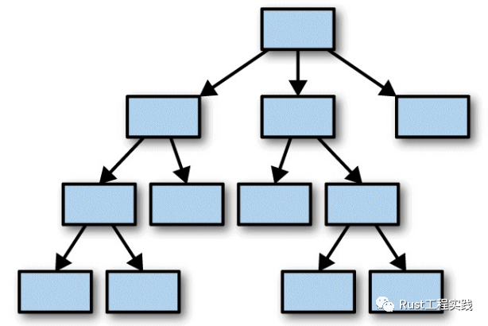
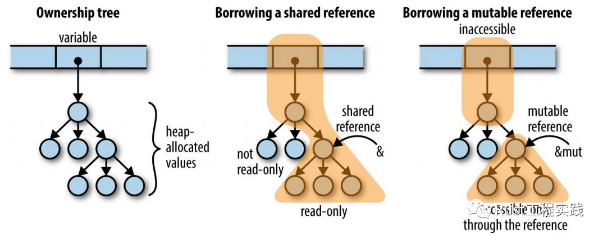
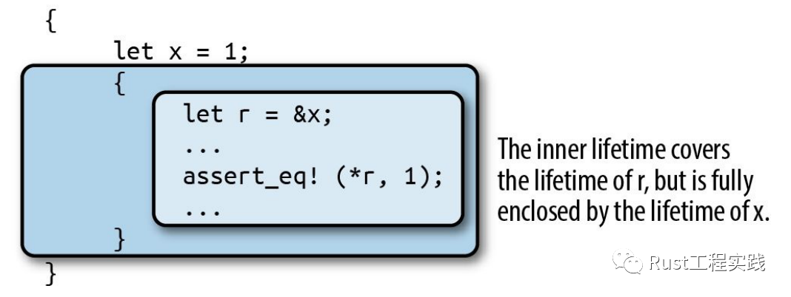

# 學 Rust 要有大局觀


# Crash Rust

學習一種新的語言，首先需要了解的就是該語言的基本設計思路，工程架構特點，本文希望可以幫住大多數對 Rust 感興趣的同學快速進入具體工程開發，並掃清大部分除基本語法之外的障礙; 具體涉及到的主題包括安裝，運行，發佈，三方包引入等等;

## Rust 安裝

### install

安裝 Rust 非常簡單，只需要一條命令，但是注意部分機器 curl 版本可能導致命令執行失敗，比如樑小孩自己的開發機 ubuntu20.04 自帶的 curl 提示 ssl 443 錯誤，如果遇到的話，嘗試重新安裝 curl

```
curl --proto '=https' --tlsv1.2 -sSf https://sh.rustup.rs | sh
```

### check

執行 Rustup 命令, 注意如果是第一次全新安裝, 先執行 `source $HOME/.cargo/env`

```
root@ecs-x86 :~/docs/Rust/CrashRustIn2Hours# source $HOME/.cargo/env
root@ecs-x86 :~/docs/Rust/CrashRustIn2Hours# rustup
Rustup 1.24.2 (755e2b07e 2021-05-12)
...
```

## Hello Rust!

接下來我們完成第一個 Rust 項目，功能只有一句打印輸出，但是大家在此章節應該學到的是如何編譯並運行 Rust 代碼程序;

### 編碼

創建第一個`rs`文件 (`hello.rs`)，文件內容如下:

```rust
fn main() {
    println!("hello Rust!");
}
```

文件目錄結構簡單，代碼目錄下只有一個單獨的`hello.rs`文件如下:

```
root@ecs-x86 CrashRustIn2Hours# tree code/
code/
└── hello.rs
0 directories, 1 file
```

### 編譯 & 執行

Rust 的編譯器叫做`rustc`，編譯時直接後跟待編譯的`rs`文件即可, 不執行輸出文件名則生成同名的可執行文件, 可以直接執行輸出文件得到程序結果

```
root@ecs-x86 code# rustc hello.rs 
root@ecs-x86 code# tree 
.
├── hello
└── hello.rs
0 directories, 2 files
root@ecs-x86 code# ls -lhF
total 3.3M
-rwxr-xr-x 1 root root 3.3M Jun  2 13:32 hello*
-rw-rw-rw- 1 root root   42 Jun  2 13:29 hello.rs
root@ecs-x86 code# ./hello 
hello Rust!
```

到此你看到的是純手工開發流程，包括編譯，文件創建，目錄組織等等都需要自行維護，為了方便工程化，並且快速創建工程，Rust 提供了自己的自動化工具鏈`cargo`;

#### Hello Cargo!

`cargo之於Rust`猶如`npm之於node`, `cargo`可以幫助你維護包依賴關係，安裝三方包，自動編譯代碼，執行結果，完善`debug`和`release`的各種部署需求;

`cargo`三板斧:

•`cargo init` 自動創建工程，包括基本的配置文件，`main.rs`生成等等

```
root@ecs-x86 code# cargo init
     Created binary (application) package
root@ecs-x86 code# tree
.
├── Cargo.toml
└── src
    └── main.rs
1 directory, 2 filese
```

•`cargo run` 自動編譯並執行; 注意，此時編譯選項均為 debug 模式，所以 target 目錄下只有一個 debug 目錄自動生成 (可執行文件亦在其中)

```
root@ecs-x86 code# cargo run
   Compiling code v0.1.0 (/root/docs/Rust/CrashRustIn2Hours/code)
    Finished dev [unoptimized + debuginfo] target(s) in 1.34s
     Running `target/debug/code`
Hello, world!
root@ecs-x86 code# tree -L 2
.
├── Cargo.lock
├── Cargo.toml
├── src
│   └── main.rs
└── target
    ├── CACHEDIR.TAG
    └── debug
```

•`cargo build` 單獨編譯，如果需要單獨 build 可能是最終發佈二進製程序，此時一般附帶參數`--release`

```
root@ecs-x86 code# cargo build --release
   Compiling code v0.1.0 (/root/docs/Rust/CrashRustIn2Hours/code)
    Finished release [optimized] target(s) in 0.35s
root@ecs-x86 code# tree -L 2
.
├── Cargo.lock
├── Cargo.toml
├── src
│   └── main.rs
└── target
    ├── CACHEDIR.TAG
    ├── debug
    └── release
4 directories, 4 files
```

## crate 和 module

•`crate`是 rust 對外分發和代碼共享的單位，類似 jar 包，類似 so 庫，是三方庫的概念 •`crate`是編譯打包的概念 •`crate`的核心標誌就是一個單獨的`Cargo.toml`文件，是一個邏輯可編譯的功能庫 •`cargo package`可以在`target/package/`目錄下生成對應的`*.crate`打包文件 •`module`是模塊的概念，是代碼組織方式，類似於 c++ 的`namespace`, 類似於 golang 的`package`的概念 •`module`的核心標誌是語法層面的`use <module_name>`的導入和聲明 •`module`有三種文件組織方式 (假設建立一個叫做`string_util`的 module)1. 內嵌文件中使用`mod string_util { ... }`的方式進行定義, 內部可以包含任意多函數，結構體等等 2. 建立一個獨立文件名`string_util.rs`，內部無上面的顯式`mod <module_name>`聲明 3. 建立一個文件夾`string_util`內部包含一個`mod.rs`文件，還有其他`submodule`的話文件夾中一般使用第二種創建新文件 • 三者取其一，如果發現都沒有或者有多重情況定義同一個`mod`的時候 rustc 便會報錯.

關於`crate`的其他理解可以參考官方 doc 的部分描述:

> A crate is a compilation unit in Rust. Whenever `rustc some_file.rs` is called, `some_file.rs is treated as the crate file.` If some_file.rs has mod declarations in it, then the contents of the module files would be inserted in places where mod declarations in the crate file are found, before running the compiler over it. In other words, modules do not get compiled individually, `only crates get compiled.`

> Rust thinks in modules, not files. There is no such thing as file imports, Important concepts in the Rust Module System are `packages`, `crates`, `modules`, and `paths`

學習`module`和`crate`的時候需要了解的基本前提知識如下:

> rust 的`pubilc`和`private`的作用域控制結構體層面提升到了`mod`範圍，結構體本身沒有類似的概念，這一點相比 c++,java，golang 均不同，此處的修改省去了`friend 友元`, `gettter`, `setter`等等一些列不必要的麻煩, 同一個`module`內部的所有結構體函數等等可以緊密合作，簡單直接，對外暴露的函數和類型單獨增加`pub`關鍵字導出, 優雅而且編碼友好

### crate 的直觀理解

rust 共享代碼模塊的公網地址為`crates.io`, 如果使用過`maven`，`rpm`等類似工具應該對此類地址並不陌生；

現在我們拆解一個`crates.io`上下載最多的`rand`模塊看一下其中的目錄結構，瞭解一下一個 rust crate 大致有什麼樣的目錄和文件結構

```
➜  rand git:(master) tree -L 1
.
├── CHANGELOG.md
├── COPYRIGHT
├── Cargo.toml       # 核心的Cargo.toml文件
├── LICENSE-APACHE
├── LICENSE-MIT
├── README.md
├── SECURITY.md
├── benches
├── examples
├── rand_chacha
├── rand_core       # 一個單獨的子crate
├── rand_distr
├── rand_hc
├── rand_pcg
├── rustfmt.toml
├── src              # `rand`的src目錄 
└── utils
9 directories, 8 files


## lib.rs 是比較特殊的一個文件名，一個crate一般只有一個，是默認的crate的導出點和入口文件.
➜  rand git:(master) tree -L 1 src
src
├── distributions
├── lib.rs
├── prelude.rs
├── rng.rs
├── rngs
└── seq
3 directories, 3 files
## 仔細研究`rand_core`你會發現它和外部的`rand`是同構的
➜  rand git:(master) tree -L 2 rand_core
rand_core
├── CHANGELOG.md
├── COPYRIGHT
├── Cargo.toml        # `rand_core`的`Cargo.toml` crate描述文件
├── LICENSE-APACHE
├── LICENSE-MIT
├── README.md
└── src
    ├── block.rs
    ├── error.rs
    ├── impls.rs
    ├── le.rs
    ├── lib.rs      # `rand_core`的`src/lib.rs`文件
    └── os.rs
1 directory, 12 files
```

可以看到，`rand crate`本身是以`外部依賴`其他`crate`(比如`rand_core`), 我們自己寫代碼的時候也可以按照這種方式組織代碼，雖然工程上看代碼屬於同一個目錄結構和工程內，但是實際上其中的代碼編譯關係是有明確的分割關係的. 因為`crate`本質上是類庫的同等地位，所以一個`crate`只允許一個`lib` (lib.rs) 編譯入口文件，但是可以允許有多個`main`函數（依賴核心的 lib.rs）單獨編譯可執行文件 (`binary crate`);

## 註釋和文檔

相比於 C++ 等古老的語言生態，rust 的生態支持解決了太多痛點，比如`crates.io`的存在保證了代碼的編寫，發佈，文檔的一體化，一切都是簡單的 cargo 命令即可完成；既然說到了文檔，就要知道 cargo 還有`cargo doc`命令，只要使用`markdown編寫的註釋便可直接生成對應的html文檔`，其開發友好程度讓人大呼過癮.

rust 的註釋寫法簡單說有如下幾種:

•`// 普通註釋`，此類註釋`cargo doc`會忽略 •`/// 文檔註釋` ，一般函數結構提元素的註釋寫法，內容可以是 markdown 語法，如果包含代碼段，代碼會被自動生成測試代碼 •`//! 高層的文檔註釋`，此類註釋生成的是高層模塊描述和簡介

```rust
cargo new --lib myutil
# 修改src/lib.rs為如下內容
//! # The first line
//! The second line
/// Adds one to the number given.
///
/// # Examples
///
/// ```
/// let five = 5;
///
/// assert_eq!(6, add_one(5));
/// # fn add_one(x: i32) -> i32 {
/// #     x + 1
/// # }
/// ```
pub fn add_one(x: i32) -> i32 {
    x + 1
}
```

以上面代碼為例，生成文檔的過程如下:

```
cargo doc --no-deps
cargo doc --open
```

 得到的自動化文檔如下:


# 學 Rust 要有大局觀 -二- Rust 的精髓


上一篇 ([學 Rust 要有大局觀](https://mp.weixin.qq.com/s?__biz=Mzg4MTYyNDU4Nw==&mid=2247483663&idx=1&sn=a3bbd0c90e01328529ac673b43e35254&scene=21#wechat_redirect)) 我們從 rust 的安裝部署，到 cargo 的基本使用，給大家做了科普，為了保證可以降低 Rust 的學習難度，一開始我們必須掃除掉除了基本語法之外的核心難點，這一篇我們關注於`所有權`（+ 生命週期) 這個 Rust 最難學的部分, 但是樑小孩今天十分鐘之內爭取讓你有學習 Rust 的戰略思維，知道 rust 應該怎麼學～

## Rust 精髓

我嘗試用幾個簡單的詞彙說明 Rust 的設計精髓和底層原理，方便對比其他語言和 Rust 的不同之處

•Rust 變量具有`閱後即焚`的特性, 相比之下其他語言的變量都是`耐用品`, 而 Rust 的變量屬於`一次性用品`•Rust 語言中`變量使用`和`值擁有`是明確區分的，而且其他語言的變量等號基本都是賦值，但是 Rust 是`所有權讓渡`

### 三種常見的內存模式

從下面三行簡單的賦值語句, 我們直觀感受一下 c++，python, 還有 Rust 的不同處理方式

```cpp
# c++代碼，僅僅用來說明簡單邏輯
auto s = std::vector<std::string>{ "udon", "ramen", "soba" }; 
auto t = s;    // 第一次使用s
auto u = s;    // 第二次使用s
```

#### c++ will copy


c++-copy

棧內的變量一直增長 (從左往右)，變量也一直可以被訪問使用. 而且`棧到堆的指向關係互相交織`(網狀); 由於 C++ 默認採用 copy 的方式進行`operator=`的操作，即使是`std::vector`複雜的 STL 結構，都是直接複製, 鑑於這種默認動作開銷比較大，一般程序員會手工引入`引用`或者`指針`來優化 (問題隨之而來，棧到堆的指針遲早變成網)

#### Python will count



python3-count

對於 python 而言，由於有 gc 的存在，gc 採用了`reference count`技術，所以邏輯層次上多了一個 PyObject 的中間層，保存了計數信息, 由於採用的是計數機制，而 python 棧上的變量都是對同一個值的多個引用，修改其中一個總是會讓其他變量的值也都一起變化

#### Rust will move (and crush!!)



rust-will-move-and-crush

對於 Rust 而言，變量的賦值操作等同於`值擁有權的讓渡`, 它的意義就是`auto t = s;`這種語句一旦執行，相當於`棧變量t取代了棧變量s,擁有了底層的值`, 隨之而來的就是`s在編譯階段就被編譯器標識為不再可用`; 這是 rust 編譯器處理代碼的邏輯，所以`auto u = s;`這樣的語句根本不會通過編譯，更無需再考慮代碼執行; x 這一切都發生在代碼分析階段，編譯過程中, 不管是簡單的賦值，還是被函數形參，還是一個值被從函數返回: 都是直接的`管理權讓渡`

#### 思考題

> 一個 for 循環，內部一個 print 函數打印了上面列表，這樣一個簡單的邏輯不同的語言會出現什麼樣的內存結果?

•c++ OK, s 可以再次被賦值使用，打印，進行各種操作 •Python OK, s 也可以正常使用 •Rust OK, 可以正常打印，但是 for 訓話結束之後，所有字符串`堆中的資源`都被釋放了, s 變成了不可再用的變量

好了，是不是感覺`太神奇了～～`, Rust 對變量的使用就是直接拿來，如果沒有新的上下文接受讓渡, 變量就被直接銷燬了, 這個神奇的設定就是 Rust 有別於其他各種語言，並且會有`move sematic`，`borrow`, `lifetime`的最底層設定, 這就是 rust 的遊戲規則.

簡單發散思考, 這個`神奇的move sematic`設定會導致什麼樣的直觀現象呢，類似與 c++,java,python 各種語言其實隨著程序一點一點執行，可能會有成百上千的 object 產生，其中的變量指針，引用，copy 互相交織在一起，看起來就會亂糟糟的，這常被稱之為`對象之海`（如下圖)



a sea of objects

由於 rust 特立獨行的底層遊戲規則，不管程序運行了多久，邏輯上看來，不管對象內部有多少子元素，列表還是字典，永遠只有一個 root（擁有它), 再加上我們將要說到的`使用權`的限制，Rust 的堆棧變量總是非常乾淨清楚 (`給你了，你就是owner`), 你不會有類似 c++ 中`三方庫函數返回了一個指針, 我應該free?`的疑問.（如下圖)



rust object tree

本文簡答說明瞭 Rust 最核心的底層設計，關於所有權的相關內容，我們可以詳細展開了, 敬請期待


# 學 Rust 要有大局觀 -三- 最痛就這麼痛了

# 導語

讀過上一篇 ([學 Rust 要有大局觀 (二) Rust 的精髓](https://mp.weixin.qq.com/s?__biz=Mzg4MTYyNDU4Nw==&mid=2247483686&idx=1&sn=4e078a7e273d62fdbda099b908036603&scene=21#wechat_redirect)) 的同學直接給我反饋的問題主要是: 為什麼 Rust 要有`move sematic`這個神奇設定，你說的都懂，但是好處在哪裡呢？(歡迎大家有問題直接在公眾號 "Rust 工程實踐" 留言提問, 讀者的反饋真的是寫作的原始反饋和動力). 所以在開始今天的`reference & lifetime`主題之前，我們簡單回顧一下轉移語義到底的好壞之處有哪些:

## move sematic 的好壞

### `好處`（rust 的承諾)

1. 方便編譯器編譯階段跟蹤內存值的使用情況，可以讓編譯器無比強大地分析堆棧狀態.2. 編譯階段排除了非常多內存不安全的內存 (代碼寫法), 不會存在懸空指針 (`dangling pointer`)

### `壞處`

• 學習曲線陡峭的重要原因之一，會進一步引出引用，生命週期等概念，容易讓初學者遭遇挫敗感 • 連一個`賦值`都 TM 編譯不過!?• 為什麼一個 print 打印之後，變量就沒了!?

## rust 痛點排行

根據`Rust Survey 2020 Results`[1] 調查結果顯示，rust 最難學的部分以`lifetime`排第一位. 全局觀很重要，今天我們就開始帶大家看一看最難的部分到底有多難，`最痛也就這麼痛了.` 可以看到生存週期，所有權，還有 trait，是大家掌握起來比較棘手主題.


rating-of-topics-difficulties

## rust reference

上一篇的末尾我們提到過一個簡單的思考，基於`move sematic`編寫代碼的時候，一個簡單的 for 循環 print 語句就會導致一個數組變量被使用後釋放掉，這其中的核心原因就是 for 循環語句理論上應該是`租借使用權`, 而不應該取得`所有權`; 為瞭解決這個問題，rust 提供了`reference類型的可copy變量`;

作為一個 c/c++ 程序員的你, 請思考，把上面 for 循環和打印語句作為函數體的情況下 (僅有外部變量的讀取需求)，如果在其他語言中，如此簡單的函數有可能造成程序崩潰嗎？或者會有什麼陷阱?

你的答案可能是這樣的; 函數的參數應該是`const &`, 常量引用，這樣我即避免了外部變量的拷貝，節省了內存和調用開銷，同時通過 const 保證了不改變使用的變量內容.

我想說的是，這都是沒問題的，但是這樣並不能保證你的`完美print`函數 core 掉，原因是，你通過`const &`對編譯器承諾了自己不改變變量，僅僅是使用，也不做 copy，然而`gcc`編譯器並不給你任何承諾，所以：

1. 變量其他地方被改掉了. 你讀取到了奇怪的內容.2. 變量被銷燬了，你讀取到了不應該操作的內存，程序崩掉了.

為什麼可以這樣？因為`程序員承諾我不修改我使用的內容`，但 c++ 語言本身，編譯器並`不承諾這個變量它自己不會變`(這種承諾不是相互的);

在 Rust 中, 程序員通過`borrow`得到一個`reference`來承諾僅讀取，或者肯定會修改一個變量

`borrow`的承諾寫法是在變量前增加一個`&`, 比如

```rust
struct Point {
    x: i32,
    y: i32 
}
let point = Point { x: 1000, y: 729 };
let r: &Point = &point;     // r現在是point的`只讀使用權`
let rr: &&Point = &r;        // rr現在是`只讀使用權`的`只讀使用權`
let rrr: &&&Point = &rr;    // rr現在是`只讀使用權`的`只讀使用權`的`只讀使用權`
```

上面的代碼的內存模型是這樣的:


A-chain-of-references-to-references

so~ 很明顯，如果使用`r`來訪問`point`的話，並不會影響 point 的所有權關係，即使`r被閱後即焚了也不影響point`, 內存上它倆使用的`棧資源`沒關係.

於此同時，編譯器同時許諾你在你使用這個 reference 期間, 任何對原有變量所有權的變動的代碼，及修改，我都拒絕編譯! 編譯器通過如下圖所示的規則來判斷是否拒絕代碼的編譯, 詳細來說，rustc 通過兩條規則來兌現它的承諾 (下圖的中間和最右則情況):




reference-and-ownership

詳細來說就是，編譯器做代碼靜態分析的時候，僅通過`閱讀文本符號`就知道是否要編譯此代碼還是直接拒絕繼續編譯代碼，因為`borrow`語意的語法是精確的，就是程序員給出的承諾. 以一個簡單的結構體來說，內部還有一個其他結構體，那麼它的內存模型大致就是上圖最左邊的樣子 (棧上是變量本身的空間，內容是指向堆內的資源的樹形結構). 下面以程序員要操作`結構體內部的結構體子元素`為例:

1. 當程序員承諾對一個子成員變量僅讀取的時候 (中圖)，編譯器承諾的兌現動作就是 • 對象樹 root 所有權變動的代碼編譯不可以通過 • 修改子成員內容的代碼編譯不可以通過 • 值 owner 也最多做讀取不能再多了 `2. 當程序員承諾對一個子成員變量要修改的時候 (右圖)，編譯器承諾的兌現動作就是 •`非承諾的引用`之外的所有試圖接觸這個值的代碼都不可以通過 • 即使是通過值的 owner 也不行讀取

基於以上兩條規則，請自己編寫 rust 的編譯器，給出下面代碼是否違反給程序員的承諾?(注意同樣的代碼寫法，若是 c++ 肯定是可以通過編譯的)

```rust
fn main() {
    let mut v = 10;    // v是一個可以改變的變量
    let r = &v;    // `&v` 就是程序員的承諾: 用r(reference)來借用變量v的使用權(讀取)
    let rr = &r;    // 程序員二次承諾還要用rr也讀取v, 並且
    v += 10        // 要改變v了，編譯過還是不過? 
    myprint(r);    // 打印函數, 使用r來訪問 
    myprint(rr);    // 打印函數, 使用rr來訪問
}
```

你是否疑惑上面的文字裡，樑小孩反覆地寫程序員得到一個引用是`承諾`對一個變量做只讀操作? 我就是讀取一下，有什麼要承諾的?

現在我要告訴你，rust 的語法規則之精確，讓你寫任何一句話都是在給編譯器訴說自己的承諾. 比如當你寫一個任意函數的時候，函數的聲明形式就是你給編譯器的承諾, 承諾對變量是如何使用的, 當你承諾只讀，但是函數體內部出現了寫操作，編譯器有權根據你先前的承諾拒絕編譯你的代碼.

再思考另外一種情況，多個變量的函數，一個只讀承諾，一個寫引用的承諾，還有一個是直接 move 語意的所有權取得；這就是你給編譯器的承諾，變量會被函數形參拿去值的所有權，如果使用不當被銷燬，是程序員自己一開始就不應該做出的`此函數對所有權負責`的承諾. 所以程序員一定要編碼之前想好頂層架構，因為一旦有變動，可能很多函數需要重寫.

## 生命週期

為了適應`move sematic`而引入的`borrow & reference`會帶來的新的問題是, 讓所有權和使用權發生了切割分離之後，引用和原始值的內存空間獨立，但是二者的邏輯關係要求: 原始值必須存在的前提下，引用才有存在的意義. 如果遇到`返回值引用了的函數`這樣的代碼是否要停止編譯? 很明顯函數返回了`使用權`, 如果此時不發生`move`需要有其他維度幫忙判斷代碼的邏輯合理性. 答案就是需要考慮`lifetime`生命週期.

從最原始的疑問開始: 你編寫了一個函數，並且返回了一個`reference`, 假如被引用的值是函數內部 local 變量，那麼基於安全考慮我們要拒絕它，如果引用的傳入參數的某個子元素，那麼我們要知道傳入參數的存活時間能否支撐這個引用是有效的. 所以編譯器一定跟蹤引用和對應變量是否存在衝突的讀寫情況，還要跟蹤每個變量的有效範圍，發現程序員讀寫違反承諾, 或者引用的生命週期不是被引用值生命週期的子集的時候，`合情合理`地拒絕編譯.



reference-with-a-lifetime

說了這麼多，其實只有圖中表示的一個核心原理，那就是 rust 編譯代碼要檢查是否存在像這樣的合理的嵌套 (cover) 關係.

如果事情到此為止的話一切完美，不過有很多中情況作用域的嵌套比上面的例子要更加隱晦, 比如一個結構體的成員`borrow`的外部資源, 比如一個函數調用其實就是變量進入新的作用域, 這種情況可能還會產生組合: 你得到一個內部包含了`reference`的結構體作為函數參數， 這時候資源跟蹤情況就很複雜了。此時，rust 編譯器要求你給出`明確的關於資源存活時間的承諾`. 這種承諾的表現方式就是讓很多同學看不懂的`生命週期語法`. 我們不關心語法，僅僅是回到原始問題上來，不管什麼樣的語法，我們應該通過這個語法給編譯器傳遞什麼信息呢? 程序員做的任何承諾，rust 編譯器都會仔細檢查，針對這種情況，程序要要做出的承諾無非就是類似`我絕對不會胡亂引用`這樣的信息，比如`我不會引用比結構體本身存活時間還短的變量`.

### 宣稱使用範圍

生命週期不是作用域, 是變量被使用的那段時間, 一個結構體有兩個引用類型的成員, 其中一個引用失效時，只要可以保證它也永遠不再被用到，那也是 OK 的. 所以我建議大家將生命週期理解成為程序員宣稱的`引用的合理使用範圍`;

```rust
struct S {
    r32: &i32;
    r64: &i64;
}
let s;
```

#### `給s.r32承諾範圍1`

1.`s.r32`存活時間 (reference) 一定要小於等於被引用值的存活時間(所有人都是必死的)2.`s.r32`存活時間和`s`一樣 (蘇格拉底是人)3. 所以`s`的存活時間必須小於等於`s.r32`引用的值的存活時間 (蘇格拉底是必死的)

#### `給s.r64承諾範圍2`

1.`s.r64`存活時間 (reference) 一定要小於等於被引用值的存活時間(所有人都是必死的)2.`s.r64`存活時間和`s`一樣 (蘇格拉底是人)3. 所以`s`的存活時間必須小於等於`s.r64`引用的值的存活時間 (蘇格拉底是必死的)

三段論裡`蘇格拉底是人`這個特殊陳述應該是問題的核心，因為當有多個成員變量的時候，被引用的具體值的生命週期可能一樣, r32 和 r64 原始值作用域會不同，但是無論如何`s`都是兩者之中`更小的那一個`.

編譯器處理上面的代碼的時候需要程序員承諾: 到底`s.r32`和`s.64`的範圍一樣還是不一樣，你若是宣稱一樣，那麼我檢查`s`的存在多久就可以了，你若是宣稱不一樣, 那麼我就得按照相對小的那個來判斷`s`的使用範圍是否合理.

OK, 是時候看一下實際代碼了~

```rust
struct A<'a> {
    r32: &'a i32;
    r64: &'a i64;
}
struct S<'a, 'b> {
    r32: &'a i32;
    r64: &'b i64;
}
```

這就是添加了`lifetime`聲明的結構體，其中`A`宣稱`A.r32`和`A.r64`的`預期使用範圍一樣`, 此時 rustc 編譯器按照 A 的實例存活時間判斷就可以了跟蹤實際引用的值是否滿足要求, 但是`S`現在宣稱`S.r32`和`S.r64`是兩個不同的使用範圍，此時 rustc 將分別跟蹤被引用的兩個值的存活時間是否都比`S`要大.

重新回到`返回引用的函數`這個原始問題上, 怎麼寫才合適?

```
// 程序員宣稱函數使用的時候, 返回值使用範圍和入參肯定一樣(或更小), rust會檢查確認是否真的這樣
fn smallest<'a>(v1: &'a [i32], v2:&'a [i32]) -> &'a i32 { ... }
```

到這裡你應該明白了，`lifetime`真的是一個編譯期概念，是程序員做出的承諾，rustc 會根據你的承諾檢查代碼是否是你宣稱的那樣，被引用的值是不是一直比引用時間更久.

到此為止，我們應該可以更清楚地理解一下`move sematic`到`borrow & reference`再到`liftime`的整個邏輯鏈條。他們到底都在解決什麼問題, 這正學習的時候需要大量的例子加深細節把握. 我們僅關心概念和概念提出的場景，解決的問題.

以上是我自己對這些概念的理解和思考，難免會有重大錯誤，但是應該能幫到大家. 下一篇咱們看`trait`是個什麼東西, 再會～～

#### 引用鏈接

`[1]` `Rust Survey 2020 Results`: *https://blog.rust-lang.org/2020/12/16/rust-survey-2020.html*


# 學 Rust 要有大局觀 -四- rust trait 的概念認知

# 導語

通過前三篇 ([學 Rust 要有大局觀 (三)](https://mp.weixin.qq.com/s?__biz=Mzg4MTYyNDU4Nw==&mid=2247483686&idx=1&sn=4e078a7e273d62fdbda099b908036603&scene=21#wechat_redirect)) 我們分別看了`move sematic`, `borrow & reference`以及`liftime`三個核心概念; 之前其實並沒有深入到任何 rust 的語法細節上，或者說盡量規避語法的講解，來到第四篇, 樑小孩仍然希望主要講解核心概念為主，代碼儘量用偽碼, 避免大家進入語法的細枝末節. 今天我們關注`traits`

## traits 是什麼

如果你沒有其他語言中 traits 的認知，那麼你將無法瞬間明白`特性`這個中文翻譯背後的實際意義，通常大家會說 traits 是 interface，而實際上 interface 和 traits 的關係更像是 “錘子必須可以砸釘子” 和“給錘子添加砸核桃功能”，理解這兩二者的區別之處在於，是否允許 “錘子” 製造的時候就知道它將來可以被用來砸核桃，這個時間差就是理解 traits 和 interface 微妙差異的精髓所在，錘子製造商和錘子使用者通常不是同一個人；換言之：traits 可以作用在一個預定義的類型上，給它添加某些`特性`, 並且無需修改該類型本身的所有聲明和原始定義的代碼，這樣不接觸原始類型定義和聲明代碼就可以給一個類型添加功能 (function) 的特性 (traits) 使得你無須將 “錘子” 重新封裝成為 “砸核桃工具” 這樣的新類型，沒有了這層封裝，代碼上寫法將靈活許多，第一次體會到這一點的程序員肯定會感覺非常震撼，

本篇的整體精髓大局觀，其實就是上面一段話而已，下面所有內容都是細節，下面讓我們一起看一下 traits 的實際實現細節.

## traits 的內存表示

通過如下代碼我們可以得到一個**特型目標**，它在內存中實際上就是一個胖指針.

```rust
use std::io::Write;

let mut buf: Vec<u8> = vec![];
let writer: &mut Write = &mut buf;
```


vtable

看明白上面圖的內存表示的話，如果你是 C++ 程序員應該就可以說基本上接近掌握了 traits 的精髓了。相比於 c++ 將 vptr 和對象成員保存在一起，rust 中類型數據就是數據本身，單獨實現的 traits 方法則是單獨聚合為一個胖指針這其中的好處非常微妙；明白了這個機制你也就可以知道為什麼對於標準類型 int 和 string 你還可以給它們擴展自己的方法; 而這是 c++ 做不到的。

同時，上面的內存模型是編譯期確定的，這也是 traits 為什麼是一種`static dispatch`;

## 語言內置 traits

rust 語言默認提供了 traits 的常見實現，編譯器可以自動處理已有類型擴展這些 traits；它們分別是：

•Eq, PartialEq, Ord, PartialOrd•Clone, 用來從 &T 創建副本 T。•Copy，使類型具有 “複製語義”（copy semantics）而非 “移動語義”（move semantics）。•Hash，從 &T 計算哈希值（hash）。•Default, 創建數據類型的一個空實例。•Debug，使用 {:?} formatter 來格式化一個值。

#### 內置 traits 用起來就像特定的註解

閱讀代碼吧，並且體會它與 java 註解的使用體驗，或許你會馬上理解其精髓。

```rust
//  CppStruct變量綁定、函數參數傳遞、函數返回值傳遞時將被複制, 而不是borrow

// 1. 編譯器支持的Copy traits
 #[derive(Copy, Debug)]
 pub struct CppStruct {
     pub x: i32,
     pub y: i32,
 }

impl Clone for CppStruct {
    fn clone(&self) -> Self {
        Self {
            x: self.x + 1,
            y: self.y + 1,
        }
    }
}

// 2. 用法及生效情況, 注意x1和x2的區別
let x0 = CppStruct { x: 0, y: 1 };
let x1 = x0;
let x2 = x0.clone();
println!("x1.value={:?}, x1.address={:p}", x1, &x1);
println!("x2.value={:?}, x2.address={:p}", x2, &x2);
println!("reuse variable x0={:?}, x0.address={:p}", x0, &x0);

// 輸出結果
x1.value=CppStruct { x: 0, y: 1 }, x1.address=0x16d24f0e8
x2.value=CppStruct { x: 1, y: 2 }, x2.address=0x16d24f0f0
reuse variable x0=CppStruct { x: 0, y: 1 }, x0.address=0x16d24f0e0
```

## 編碼自己的 traits

#### 自定義 traits 時，它更像是一種接口聲明

```rust
/// STEP1:   抽象一個機器學習Optimizer應該具有的核心功能，定義為一個trait
pub trait Optimizer<'a> {
    // 有默認實現的函數build_params
    fn build_params<U, T: From<U>>(params: Vec<U>) -> Vec<T> {
        let mut vec = Vec::with_capacity(params.len());
        for param in params {
            vec.push(T::from(param));
        }
        vec
    }
    // 無默認實現的函數，get_lr
    fn get_lr(&self) -> f32;

    // 無默認實現的函數，set_lr
    fn set_lr(&self, lr: f32);
}

/// STEP2: 實現一個SGD優化邏輯，並重載核心函數
pub struct SGD<'a, T> {
    params: RefCell<Vec<SGDParam<'a>>>,
    lr: Cell<f32>,
    penalty: T,
}

impl<'a, T: Penalty> Optimizer<'a> for SGD<'a, T> {

    fn get_lr(&self) -> f32 {
        self.lr.get()
    }

    fn set_lr(&self, lr: f32) {
        self.lr.set(lr)
    }
}
```

將 trait 理解為接口是一種很符合直覺的簡化，但是你只要知道它不等同於接口，只是可以`用起來很像接口`

## 結語（2022/02/13 03:34 成文）

這次關於 trait 最核心的內容就總結到此，實際使用時能明白其中的精髓就好了，關於 trait 的實際功能其實比本次介紹的要更多，但是筆者認為`有大局觀，知道它是什麼，對它有清晰的概念認知`的話，上面的內容已經足夠。收集更多問題後，後續找更多的例子來詳細展開用法也不遲。

# 學 Rust 要有大局觀 -五- 屬性的功能

## 什麼是 attribute？

attribute 是 rust 編譯器留給程序員的交互接口，一段代碼可以編譯產出為二進制機器碼的過程通常來說，用戶的代碼是編譯器的輸入，當編譯器認為代碼有問題，而程序員認為沒問題的時候，必須允許程序員和編譯器有交互，允許程序員指導個別代碼的處理方式。

下面列舉幾個比較有代表性的場景：

## 讓編譯器閉嘴

rustc 要求結構體的命名需為駱駝體，否則就會給出警告，假如程序員‘故意’要給出一個結構體，但是用了 python 的下劃線命名，為了讓編譯器忽略對命名格式的‘異議’，可以通過

```rust
#[allow(non_camlel_case_types)]
```

這個標記，把它放在結構體聲明之前，編譯器就可以按照程序員的意願主動放過。而不是輸出一堆警告。

## 讓編譯器臨場應變

所謂的臨場應變經典場景主要是硬件和操作系統環境區別，比如當前這個程序員的操作系統是`windows`, CPU 架構是`x86_64`又或者是`arm64`, 代碼編譯的時候有些別人的代碼確實不可能編譯通過，程序員需要主動處理條件編譯規則，指導編譯器不同架構下同一個代碼應該編譯哪一個具體實現。對應的 attribute 類似`#[cfg(windows)]`的標記說明具體信息。

## 讓編譯器改變默認行為

rust 瞭解之後你會知道有很多特有的術語，比如‘氧化’表示用 rust 去重寫一些現有的庫，或者用 rust 去實現一個特定的功能，但是畢竟很多東西編譯之後會有一些歷史命名習慣或者接口規則，不能按照 rust 本身的約定輸出，我們可以通過

```rust
#![crate_type = "cdylib"]
#![create_name=''crypto3]
```

這樣我們得到的名字是`libcrypto3.so`，我們還特意多加了一個`3`在`o`後面，表示這個庫是我們自己用 rust 氧化之後的版本; 否則我們得到的是一個原版命名的`libcrate.rlib`這樣的 rust 二進制庫名字.

## 讓編譯器區別對待一些函數和代碼

單測就是這樣一個典型場景，相比於其他語言用文件名後綴，前綴，或者是引入某些包單獨編碼而言，rust 支持的更為簡單直接，只要有 `#[test]`修飾的函數都會標記為測試函數，會在`cargo test`命令下被拉出來單獨執行。

## 讓編譯自動添加一些行為

這個用法就非常多樣了，典型場景是用`#[derive(Debug)]` 類似的標記好，以便編譯器自動給我們的類型添加特性.

```rust
#[derive(Debug)]
struct Point {
    x:f32,
    y:f32,
}
```

編譯器現在會給 Point 類自動添加一個`fmt`函數，這個函數功能類似 java 的`toString`， 或者 python 的`__repr__`等，注意：derive 的意義為派生，但這裡並沒有一個`默認的父類實現`, 代碼都是編譯器根據當前的類程成員變量自動添加並編譯的。

`derive`和`trait`搭配使用共同左右，想要明白其中細節可以閱讀本系列上關於`trait`的單獨篇章.

## 結語

看了一些快速簡單的例子，你應該知道 attribute 這個概念是什麼內涵了，知道了內涵也就明白了概念，遇到的時候就不會有疑惑了。下一篇我們講一下 rust 惱人的宏，用不用不重要，重要的時候通過瞭解 rust，大家一起思考一下手頭使用的語言到底哪裡不好，為什麼有新的設計。