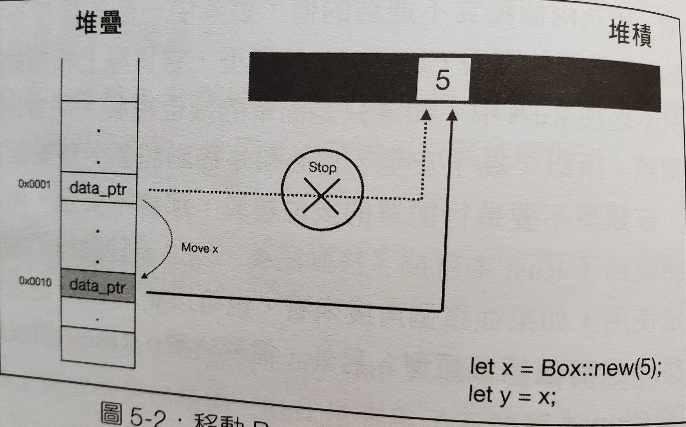
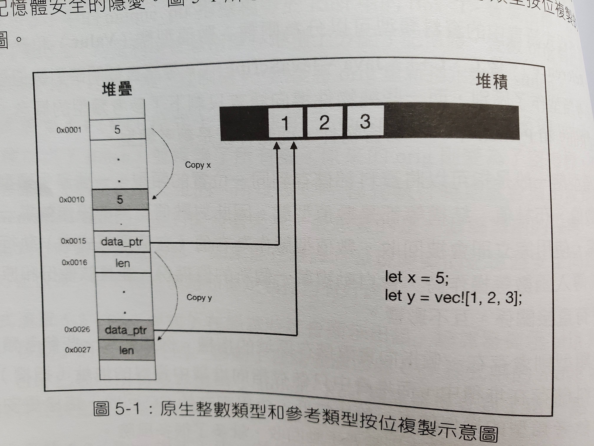

# Rust 所有權系統

## 所有權的機制 (Ownership)

1. 所有的 Value 與 記憶體位置 只會有一個 變數 管理他們，意思是不會有兩個變數同時紀錄同一個記憶體位置
2. 所有的 Value 與 記憶體位置 都必須要有個一個 變數 管理他們，所以當變數因為生命周期結束時，代表Value會被銷毀、記憶體位置會被釋放

## 所有權轉移 (Move)



```rust
#[derive(Debug)]
struct Person {
    age: i32
}
fn main () {
    let x = Person { age: 16 };
    let y = x;
    // borrow of moved value: `x`
    // 所有權被轉移了，所以你不能再使用 x
    println!("{:?}", x);
    println!("{:?}", y);
}
```

## 按位複製 (Copy)



- 記憶體位置是不能被 Copy 的
- struct 在沒有實現 Copy 前，是不會進行 Copy，而會進行 Move
- 但 array、tuple、Option 本身就有實現 Copy，所以在所有的值都可以實現 Copy 的情況，會進行 Copy，如果有一個值不能實現 Copy 則會進行 Move
- 實現 Copy、Clone trait (因為 Copy 繼承 Clone，所以必須同時實現 Copy 與 Clone trait) (關於 trait 會在之後的章節提到)

```rust
#[derive(Debug)]
struct Person {
    age: i32
}
// Clone trait 用來實現 deep clone
// 任何類型都可以實作 Clone
impl Clone for Person {
    fn clone (&self) -> Person {
        Person { age: self.age }
    }
}
// Copy trait 像是一個標籤
// 他裏面沒有任何可以實現的 function
// 但實作 Copy 的 struct 可以進行 Copy
// 不過可以實作 Copy 的 struct，成員必須不包含指標類型
impl Copy for Person {}
fn main () {
    let x = Person { age: 16 };
    let y = x;
    println!("{:p}", &x);
    println!("{:?}", x);
    println!("{:p}", &y);
    println!("{:?}", y);
}
```

- 快速實現 Copy 與 Clone

```rust
#[derive(Debug, Copy, Clone)]
struct Person {
    age: i32
}
fn main () {
    let x = Person { age: 16 };
    let y = x;
    println!("{:p}", &x);
    println!("{:?}", x);
    println!("{:p}", &y);
    println!("{:?}", y);
}
```

## 所有權借用 (Borrow)

### 介紹

- 借用分成不可變借用(&)跟可變借用(&mut)
- 用 & 來借用

```rust
#[derive(Debug)]
struct Person {
    age: i32
}
fn birthday (y: &mut Person) {
    y.age = y.age + 1;
}
fn main () {
    let mut x = Person { age: 16 };
    birthday(&mut x);
    println!("{:?}", x);
}
```

- 沒有借用的情況，所有權會被轉移

```rust
#[derive(Debug)]
struct Person {
    age: i32
}
fn birthday (mut y: Person) {
    y.age = y.age + 1;
}
fn main () {
    let x = Person { age: 16 };
    birthday(x);
    println!("{:?}", x);
}
```

output

```rust
   |
9  |     let x = Person { age: 16 };
   |         - move occurs because `x` has type `Person`, which does not implement the `Copy` trait
10 |     birthday(x);
   |              - value moved here
11 |     println!("{:?}", x);
   |                      ^ value borrowed here after move
```

### 借用的規則 (Rust 核心原則之一：共享不可變，可變不共享)

- 在不可變借用期間 (共享)，擁有者不能修改 Value，也不能進行可變借用 (不可變)，但可以再進行不可變借用

```rust
#[derive(Debug)]
struct Person {
    age: i32
}
#[allow(dead_code)]
fn birthday (y: &mut Person) {
    y.age = y.age + 1;
}
#[allow(unused_mut)]
fn main () {
    let mut x = Person { age: 16 };
    let y = &x; // 不可變借用，擁有者是 x，借用者是 y
    println!("{:p}", &x); // x 可以再進行不可變借用
    // cannot borrow `x` as mutable because it is also borrowed as immutable
    // 但不可以再進行可變借用
    birthday(&mut x);
    println!("{:?}", y); // 借用者 y 可以使用 x，印出值
}
```

- 在可變借用期間 (可變)，擁有者不能存取 Value，也不能進行不可變借用 (不共享)

```rust
#[derive(Debug)]
struct Person {
    age: i32
}
#[allow(dead_code)]
fn birthday (y: &mut Person) {
    y.age = y.age + 1;
}
#[allow(unused_mut)]
fn main () {
    let mut x = Person { age: 16 };
    let y = &mut x; // 可變借用，擁有者是 x，借用者是 y
    y.age = 1;
    // cannot borrow `x` as immutable because it is also borrowed as mutable
    // x 不可以再進行不可變借用
    println!("{:p}", &x);
    // cannot borrow `x` as mutable more than once at a time
    // 當然也不可以再進行可變借用
    birthday(&mut x);
    // cannot use `x.age` because it was mutably borrowed
    // 同時你也不可以存取 x
    y.age = x.age + 1;
    println!("{:?}", y); // 借用者 y 可以使用 x，印出值
}
```

- 借用者的

  生命周期

  不能夠長於擁有者

  - 範例在生命周期的章節再寫

## Also see

- https://shihyu.github.io/rust_hacks/ch6/02_move_copy.html
- https://rust-lang.tw/book-tw/ch04-01-what-is-ownership.html