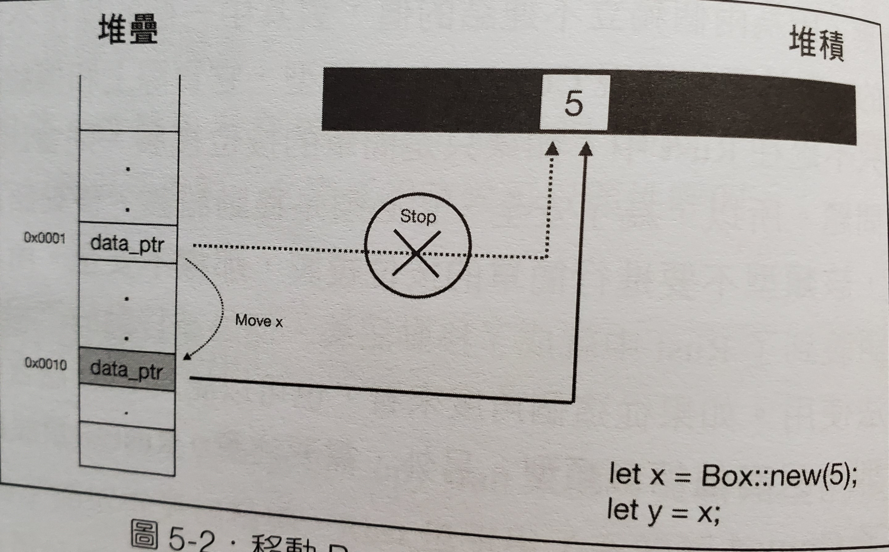

# Rust 所有權系統

## 所有權的機制 (Ownership)

1. 所有的 Value 與 記憶體位置 只會有一個 變數 管理他們，意思是不會有兩個變數同時紀錄同一個記憶體位置
2. 所有的 Value 與 記憶體位置 都必須要有個一個 變數 管理他們，所以當變數因為生命週期結束時，代表Value會被銷毀、記憶體位置會被釋放

## 所有權轉移 (Move)



```rust
#[derive(Debug)]
struct Person {
    age: i32
}
fn main () {
    let x = Person { age: 16 };
    let y = x;
    // borrow of moved value: `x`
    // 所有權被轉移了，所以你不能再使用 x
    println!("{:?}", x);
    println!("{:?}", y);
}
```

## 按位複製 (Copy)


- 記憶體位置是不能被 Copy 的
- struct 在沒有實現 Copy 前，是不會進行 Copy，而會進行 Move
- 但 array、tuple、Option 本身就有實現 Copy，所以在所有的值都可以實現 Copy 的情況，會進行 Copy，如果有一個值不能實現 Copy 則會進行 Move
- 實現 Copy、Clone trait (因為 Copy 繼承 Clone，所以必須同時實現 Copy 與 Clone trait) (關於 trait 會在之後的章節提到)

```rust
#[derive(Debug)]
struct Person {
    age: i32
}
// Clone trait 用來實現 deep clone
// 任何類型都可以實作 Clone
impl Clone for Person {
    fn clone (&self) -> Person {
        Person { age: self.age }
    }
}
// Copy trait 像是一個標籤
// 他裡面沒有任何可以實現的 function
// 但實作 Copy 的 struct 可以進行 Copy
// 不過可以實作 Copy 的 struct，成員必須不包含指標類型
impl Copy for Person {}
fn main () {
    let x = Person { age: 16 };
    let y = x;
    println!("{:p}", &x);
    println!("{:?}", x);
    println!("{:p}", &y);
    println!("{:?}", y);
}
```

- 快速實現 Copy 與 Clone

```rust
#[derive(Debug, Copy, Clone)]
struct Person {
    age: i32
}
fn main () {
    let x = Person { age: 16 };
    let y = x;
    println!("{:p}", &x);
    println!("{:?}", x);
    println!("{:p}", &y);
    println!("{:?}", y);
}
```

## 所有權借用 (Borrow)

### 介紹

- 借用分成不可變借用(&)跟可變借用(&mut)
- 用 & 來借用

```rust
#[derive(Debug)]
struct Person {
    age: i32
}
fn birthday (y: &mut Person) {
    y.age = y.age + 1;
}
fn main () {
    let mut x = Person { age: 16 };
    birthday(&mut x);
    println!("{:?}", x);
}
```

- 沒有借用的情況，所有權會被轉移

```rust
#[derive(Debug)]
struct Person {
    age: i32
}
fn birthday (mut y: Person) {
    y.age = y.age + 1;
}
fn main () {
    let x = Person { age: 16 };
    birthday(x);
    println!("{:?}", x);
}
```

output

```rust
   |
9  |     let x = Person { age: 16 };
   |         - move occurs because `x` has type `Person`, which does not implement the `Copy` trait
10 |     birthday(x);
   |              - value moved here
11 |     println!("{:?}", x);
   |                      ^ value borrowed here after move
```

### 借用的規則 (Rust 核心原則之一：共享不可變，可變不共享)

- 在不可變借用期間 (共享)，擁有者不能修改 Value，也不能進行可變借用 (不可變)，但可以再進行不可變借用

```rust
#[derive(Debug)]
struct Person {
    age: i32
}
#[allow(dead_code)]
fn birthday (y: &mut Person) {
    y.age = y.age + 1;
}
#[allow(unused_mut)]
fn main () {
    let mut x = Person { age: 16 };
    let y = &x; // 不可變借用，擁有者是 x，借用者是 y
    println!("{:p}", &x); // x 可以再進行不可變借用
    // cannot borrow `x` as mutable because it is also borrowed as immutable
    // 但不可以再進行可變借用
    birthday(&mut x);
    println!("{:?}", y); // 借用者 y 可以使用 x，印出值
}
```

- 在可變借用期間 (可變)，擁有者不能存取 Value，也不能進行不可變借用 (不共享)

```rust
#[derive(Debug)]
struct Person {
    age: i32
}
#[allow(dead_code)]
fn birthday (y: &mut Person) {
    y.age = y.age + 1;
}
#[allow(unused_mut)]
fn main () {
    let mut x = Person { age: 16 };
    let y = &mut x; // 可變借用，擁有者是 x，借用者是 y
    y.age = 1;
    // cannot borrow `x` as immutable because it is also borrowed as mutable
    // x 不可以再進行不可變借用
    println!("{:p}", &x);
    // cannot borrow `x` as mutable more than once at a time
    // 當然也不可以再進行可變借用
    birthday(&mut x);
    // cannot use `x.age` because it was mutably borrowed
    // 同時你也不可以存取 x
    y.age = x.age + 1;
    println!("{:?}", y); // 借用者 y 可以使用 x，印出值
}
```

- 借用者的

  生命週期

  不能夠長於擁有者

  - 範例在生命週期的章節再寫

## Also see

- https://shihyu.github.io/rust_hacks/ch6/02_move_copy.html
- https://rust-lang.tw/book-tw/ch04-01-what-is-ownership.html

---

## Rust-所有權

https://ithelp.ithome.com.tw/articles/10272643

所有權可以說是Rust核心概念，這讓Rust不需要垃圾回收(garbage collector)就可以保障記憶體安全。Rust的安全性和所有權的概念息息相，因此理解Rust中的所有權如何運作是非常重要的

### 所有權的規則

- Rust 中每個數值都會有一個變數作為它的**擁有者（owner）**。
- 同時間只能有一個擁有者。
- 當擁有者離開作用域時，數值就會被丟棄。

### **變數作用域**

用下面這段程序描述變數範圍的概念

```rust
{
    // 在宣告以前，變數s無效
    let s = "hello";
    // 這裡是變數s的可用範圍
}
// 變數範圍已經結束，變數s無效
```

變數作用域是變數的一個屬性，其代表變數的可使用範圍，默認從宣告變數開始有效直到變數所在作用域結束。

### 記憶體與分配

定義一個變數並賦予值，這個變數的值存在記憶體中，例如需要用戶輸入的一串字串由於長度的不確定只能存放在`堆(heap)上`，這需要記憶體分配器在執行時請求記憶體並在不需要時還給分配器

在擁有垃圾回收機制(garbage collector, GC)的語言中，GC會追蹤並清除不再使用的記憶體，如果沒有GC的話則需要在不使用時顯式的呼叫釋放記憶體

例如C語言

```rust
{    
    char *s = strdup("hello");    
    free(s); *// 釋放s資源*
}
```

Rust選擇了一個不同的道路，當變數在離開作用域時會自動釋放例如下面

```rust
{
    let s = String::from("hello"); // s 在此開始視為有效
    // 使用 s
} // 此作用域結束，釋放s變數     
```

當變數離開作用域(大括號結束)時會自動呼叫特殊函示drop來釋放記憶體

### 變數與資料互動的方式

**移動(Move)**

變數可以在Rust中以不同的方式與相同的資料進行互動

```rust
let x = 100;
let y = x;
```

這個代碼將值100綁定到變數x，然後將x的值復制並賦值給變數y現在棧(stack)中將有兩個值100。此情況中的數據是"純量型別"的資料，不需要存儲到堆中，`僅在棧(stack)中的資料的"移動"方式是直接複製`，這不會花費更長的時間或更多的存儲空間。"純量型別"有這些：

- 所有整數類型，例如 i32 、 u32 、 i64 等
- 布爾類型 bool，值為true或false
- 所有浮點類型，f32和f64
- 字符類型 char
- 僅包含以上類型數據的元組(Tuples)

現在來看一下非純量型別的移動

```rust
let s1 = String::from("hello");
let s2 = s1;
```

String物件的值"hello"為不固定長度長度型別所以被分配到堆(heap)

當s1賦值給s2，String的資料會被拷貝，不過我們拷貝是指標、長度和容量。我們不會拷貝指標指向的資料

前面説當變數超出作用域時，Rust自動調用釋放資源函數並清理該變數的記憶體。但是s1和s2都被釋放的話堆(heap)區中的"hello"被釋放兩次，這是不被系統允許的。為了確保安全，在給s2賦值時 s1已經無效了

```rust
let s1 = String::from("hello");
let s2 = s1; 
println!("{}, world!", s1); // 會發生錯誤 s1已經失效了
```

**克隆(clone)**

正常情況下Rust在較大資料上都會以淺拷貝的方式，當然也有提供深拷貝的method

```rust
let s1 = String::from("hello");
let s2 = s1.clone();
println!("{} {}", s1, s2);

輸出
hello hello
```

### 所有權與函式

將一個變數當作函式的參數傳給其他函式，怎樣安全的處理所有權

傳遞數值給函式這樣的語義和賦值給變數是類似的。傳遞變數給函式會是移動或拷貝就像賦值一樣

```rust
fn main() {
    // s被宣告
    let s = String::from("hello"); // s進入作用域

    takes_ownership(s); // s的值被當作參數傳入函式 所以可以當作s已經被移動，從這開始已經無效

    // x被宣告
    let x = 5; // x進入作用域

    makes_copy(x); // x的值被當作參數傳入函式，但x是純量型別 i32被copy，依然有效
} // 函式結束，x無效，接著是s的值已經被移動了它不會有任何動作

fn takes_ownership(some_string: String) {
    // 一個String參數some_string傳入，有效
    println!("{}", some_string);
} // 函式結束，參數some_string佔用的記憶體被釋放

fn makes_copy(some_integer: i32) {
    // 一個i32參數some_integer傳入，有效
    println!("{}", some_integer);
} // 函式結束，參數some_integer是純量型別，沒有任何動作發生
```

如果在呼叫takes_ownership之後在使用s變數在編譯時會出錯

### 回傳值與作用域

回傳值轉移所有權

```rust
fn main() {
    let s1 = gives_ownership(); // gives_ownership移動它的回傳值給s1
    let s2 = String::from("哈囉"); // s2進入作用域
    let s3 = takes_and_gives_back(s2); // s2移入takes_and_gives_back，該函式又將其回傳值移到s3
} // s3 在此離開作用域並釋放
  // s2 已被移走，所以沒有任何動作發生
  // s1 離開作用域並釋放

// 此函式回傳一個String
fn gives_ownership() -> String {
    let some_string = String::from("hello"); // some_string進入作用域

    return some_string; // 回傳some_string並移動給呼叫它的函式
}

// 此函式會取得一個String然後回傳它
fn takes_and_gives_back(a_string: String) -> String {
    // a_string進入作用域
    return a_string; // 回傳a_string並移動給呼叫的函式
}
```

引用與借用在前面介紹[定義函式](https://ithelp.ithome.com.tw/articles/10269251)時有介紹過了，這邊就不多講了

講一下迷途指標(dangling pointer)，這個在很多指標語言常發生的錯誤

簡單講就是用到空指標，Rust會在編譯時檢查這類型的錯誤

例如

```rust
fn dangle() -> &String { // 回傳String的迷途引用
    let s = String::from("hello"); // 宣告一個新的String
    return &s // 回傳String的引用
} // s在此會離開作用域並釋放
```

編譯時會產生錯誤 missing lifetime specifier