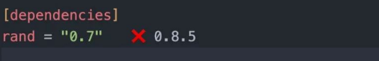
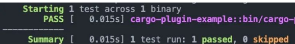
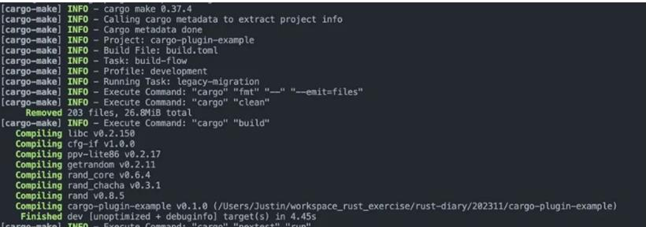
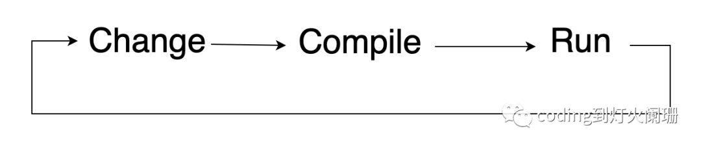
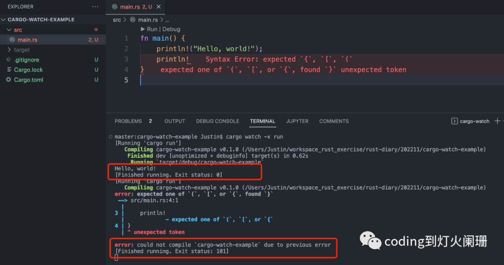

## 你應該知道的7個Rust Cargo外掛


**1. Cargo watch**
cargo watch監視你的項目原始檔，並在原始檔更改時運行Cargo命令。
安裝命令如下：

```js
cargo install cargo-watch
```

例子如下：

```rust
fn main() {
    println!("Hello, world!");
    println!("Hello, cargo-watch!");
}
```

然後，我們可以在命令列輸入以下命令，以便在原始檔更改時執行cargo run：

```js
cargo watch -x run
```

輸出如下：

```js
cargo watch -x run
[Running 'cargo run']
Hello, world!
Hello, cargo-watch!
[Finished running. Exit status: 0]
```

如果我們註釋掉第2行，我們的程式碼將自動重新編譯。

```js
[Running 'cargo run']
Hello, cargo-watch!
[Finished running. Exit status: 0]
```

cargo watch也提供了很多其他的選項，如：

```js
cargo watch -c -q -w ./src -x run
```

-c 來清空終端
-q 抑制cargo watch本身的輸出
-w 關注某個目錄，這裡只關注src目錄。
-x 運行cargo命令

**2. Cargo edit**
cargo edit 允許你從命令列新增、升級和刪除依賴項。
安裝命令如下：

```sh
sudo apt-get install librust-openssl-dev
cargo install cargo-edit
```

我們在命令列輸入以下命令，將rand 0.7版本新增到項目中：

```js
cargo add rand@0.7
```

這將自動更新Cargo.toml檔案：




如圖所示，rang 0.7不是最新版本，我們可以使用以下命令來升級依賴項：

```js
cargo upgrade --incompatible
```

結果如下：

```js
cargo upgrade --incompatible     
    Updating 'https://mirrors.sjtug.sjtu.edu.cn/git/crates.io-index' index
    Checking cargo-plugin-example's dependencies
name old req compatible latest new req
==== ======= ========== ====== =======
rand 0.7     0.7.3      0.8.5  0.8    
   Upgrading recursive dependencies
```

我們還可以通過以下命令來刪除依賴項：

```js
cargo rm rand
```

**3. Cargo modules**
cargo modules外掛允許我們可視化項目的模組結構，以樹狀格式顯示模組結構。

安裝命令如下：

```rust
cargo install cargo-modules
```

在命令列輸入以下命令：

```sh
cargo modules generate tree
```

輸出結果：

```js
crate cargo_plugin_example
├── mod modules: pub(crate)
└── mod utils: pub(crate)
```

在這裡，我們可以看到默認的crate模組，兩個頂級模組models和utils，我們還可以看到每個模組的可見性。

通過新增types，fns標誌，我們也可以看到每個模組內部的類型，函數等。

```js
cargo modules generate tree --types --fns
```

結果如下：

```js
crate cargo_plugin_example
├── fn main: pub(crate)
├── mod modules: pub(crate)
│   └── struct Message: pub
└── mod utils: pub(crate)
    └── fn msg_helpers: pub
```

**4. Cargo audit**
cargo audit檢查項目的依賴項是否有任何安全漏洞，這在持續整合中特別有用。

安裝命令如下：

```js
cargo install cargo-audit
```

要審計你的項目，只需輸入如下命令：

```js
cargo audit
```

結果如下：

```js
Fetching advisory database from `https://github.com/RustSec/advisory-db.git`
      Loaded 578 security advisories (from /Users/Justin/.cargo/advisory-db)
    Updating crates.io index
    Scanning Cargo.lock for vulnerabilities (9 crate dependencies)
```

在我們的項目中，沒有發現任何漏洞。

**5. Cargo tarpaulin**
cargo tarpaulin 是另一個對持續整合非常有用的外掛，這個外掛計算項目的程式碼覆蓋率。
安裝命令如下：

```js
cargo install cargo-tarpaulin
```

在項目根目錄下，輸入如下命令：

```js
cargo tarpaulin
```

結果如下：

```js
|| Uncovered Lines:
|| src/main.rs: 6-9
|| src/utils.rs: 1
|| Tested/Total Lines:
|| src/main.rs: 0/4 +0.00%
|| src/utils.rs: 0/1 +0.00%
|| 
0.00% coverage, 0/5 lines covered, +0.00% change in coverage
```

**6. Cargo nextest**
cargo-nextest 是新一代的rust測試程序，它提供了漂亮的測試結果，片狀的測試檢測，並且在某些程式碼庫上可以將測試運行速度提高60倍。
安裝命令如下：

```js
cargo install cargo-nextest
```

要使用cargo-nextest執行測試，需要在命令列執行如下命令：

```js
cargo nextest run
```

結果如下：

正如你所看到的，輸出是有組織的，並且具有漂亮的顏色，這有助於提高可讀性。

**7. Cargo make**
cargo-make 是rust的任務運行器和建構工具，它允許你定義一組任務並在流程中運行它們，任務可以在toml檔案中定義。

安裝命令如下：

```js
cargo install cargo-make
```

在項目根目錄下建立build.toml檔案，內容如下：

```js
[tasks.format]
command = "cargo"
args = ["fmt", "--", "--emit=files"]
[tasks.clean]
command = "cargo"
args = ["clean"]
[tasks.build]
command = "cargo"
args = ["build"]
dependencies = ["clean"]
[tasks.test]
command = "cargo"
args = ["nextest", "run"]
dependencies = ["clean"]
[tasks.build-flow]
dependencies = [
    "format",
    "build",
    "test"
]
```

它包括幾個任務：格式化程式碼，清理程式碼，建構程式碼，測試程式碼。最後定義一個建構流程，按流程給定順序執行任務。

在命令列執行如下命令執行cargo make：

```js
cargo make --makefile build.toml build-flow
```

結果如下：

至此，你應該知道的7個Rust Cargo外掛已經介紹完了，希望對你有所幫助。


---

```sh
rustup update # バージョン更新
rustup component add rustfmt # フォーマッタ追加
rustup component add rust-src # LSP(rust-analyzer)追加
rustup component add rust-analyzer
```


---

# 在 Rust 中使用 Cargo Watch 實時監聽代碼變化

當我們開發 Rust 應用程序時，有時我們需要減少更改、編譯和執行週期的時間。這聽起來有點複雜，但今天我將向你展示一個工具，它以一種非常簡單和自動的方式來實時監聽代碼變化。這個工具被稱爲 cargo watch，它減少了項目變更、編譯、運行週期的時間。

**Cargo Watch**

Cargo Watch 在你的項目上創建了一個監聽器，並在發生更改時運行 Cargo 命令。



我們從創建一個新項目開始。對於我們的例子，我們將其稱爲 cargo-watch-example：

```
cargo new cargo-watch-example
```

安裝 cargo watch：

```
cargo install cargo-watch
```

運行項目並觀察變化：

```
cargo watch -x run
```

如果希望只從工作目錄監聽變化，則添加 - w 選項以指定要從其中監聽變化更改的文件或目錄：

```
cargo watch -w src -x run
```

例如：



前面的例子是觀察整個項目或特定目錄上的變化的最簡單的配置，但你可以做的事情更多，這裏是命令說明：

```
USAGE:
    cargo watch [FLAGS] [OPTIONS]

FLAGS:
    -c, --clear              Clear the screen before each run
    -h, --help               Display this message
        --ignore-nothing     Ignore nothing, not even target/ and .git/
        --debug              Show debug output
        --why                Show paths that changed
    -q, --quiet              Suppress output from cargo-watch itself
        --no-gitignore       Don’t use .gitignore files
        --no-ignore          Don’t use .ignore files
        --no-restart         Don’t restart command while it’s still running
        --poll               Force use of polling for file changes
        --postpone           Postpone first run until a file changes
    -V, --version            Display version information
        --watch-when-idle    Ignore events emitted while the commands run.
                             Will become default behaviour in 8.0.

OPTIONS:
    -x, --exec <cmd>...
            Cargo command(s) to execute on changes [default: check]

    -s, --shell <cmd>...           Shell command(s) to execute on changes

    -d, --delay <delay>
            File updates debounce delay in seconds [default: 0.5]

        --features <features>
            List of features passed to cargo invocations

    -i, --ignore <pattern>...      Ignore a glob/gitignore-style pattern

    -B <rust-backtrace>
            Inject RUST_BACKTRACE=VALUE (generally you want to set it to 1)
            into the environment

        --use-shell <use-shell>
            Use a different shell. E.g. --use-shell=bash. On Windows, try
            --use-shell=powershell, which will become the default in 8.0.

    -w, --watch <watch>...
            Watch specific file(s) or folder(s) [default: .]

    -C, --workdir <workdir>
            Change working directory before running command [default: crate root]

ARGS:
    <cmd:trail>...    Full command to run. -x and -s will be ignored!

Cargo commands (-x) are always executed before shell commands (-s). You can use
the `-- command` style instead, note you'll need to use full commands, it won't
prefix `cargo` for you.

By default, your entire project is watched, except for the target/ and .git/
folders, and your .ignore and .gitignore files are used to filter paths.

On Windows, patterns given to -i have forward slashes (/) automatically
converted to backward ones (\) to ease command portability.
```
