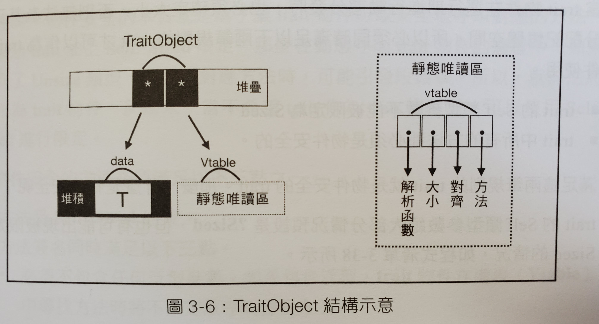
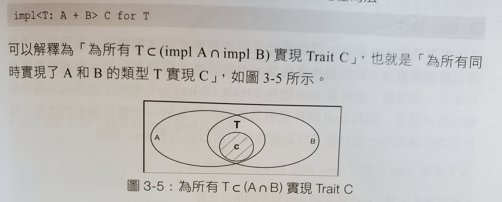

# Rust 型別系統

- Rust 型別系統
  - [型別大小](https://hackmd.io/@ballfish/H14LFb6hU#型別大小)
  - [泛型](https://hackmd.io/@ballfish/H14LFb6hU#泛型)
  - trait 用法
    - [宣告 interface](https://hackmd.io/@ballfish/H14LFb6hU#宣告-interface)
    - [用 trait 對泛型做限定 (trait Bound)](https://hackmd.io/@ballfish/H14LFb6hU#用-trait-對泛型做限定-trait-Bound)
    - [宣告抽象型別 (Abstract Type)](https://hackmd.io/@ballfish/H14LFb6hU#宣告抽象型別-Abstract-Type)
    - [動態分配與靜態分配的比較](https://hackmd.io/@ballfish/H14LFb6hU#動態分配與靜態分配的比較)
    - [impl Trait](https://hackmd.io/@ballfish/H14LFb6hU#impl-Trait)
    - [標籖](https://hackmd.io/@ballfish/H14LFb6hU#標籖)
- 類型轉換
  - [Deref](https://hackmd.io/@ballfish/H14LFb6hU#Deref)
  - as 運算符號
    - [類型轉換（含生命週期）](https://hackmd.io/@ballfish/H14LFb6hU#類型轉換（含生命週期）)
    - [限定用法](https://hackmd.io/@ballfish/H14LFb6hU#限定用法)
    - [From與Into](https://hackmd.io/@ballfish/H14LFb6hU#From與Into)
- Trait系統的不足
  - [孤兒原則](https://hackmd.io/@ballfish/H14LFb6hU#孤兒原則)
  - [程式複用率不高](https://hackmd.io/@ballfish/H14LFb6hU#程式複用率不高)


## 型別大小

- Sized Tyep
  - 大部分的類型都是 Sized Type，就是可以在編譯時期就知道大小的
  - 例如：u32, i64
- Dynamic Sized Type
  - 無法在編譯時期知道大小的型別則叫作「DST (Dynamic Sized Type)」
  - 例如：[T], Box
  - 
- Zero Sized Type
  - 另外還有一種類型叫「ZST (Zero Sized Type)」，在執行時期，不佔用空間大小的型別
  - 你可以用 ZST 來做一些反覆運算，Rust 編譯器有對 ZST 做最佳化

```rust
fn main() {
    let v: Vec<()> = vec![(); 10];
    // 像是你可以這樣寫
    for _i in v {
        println!("{:?}", 1);
    }
    
    // 雖然你有更簡單的寫法
    for _i in 1..10 {
        println!("{:?}", 1);
    }
}
```

- Bottom Type
  - 只的是 never 類型
  - 程式碼中用 `!` 表示
  - 特點
    - 沒有值
    - 是任意類型的子類型
  - Bottom Type 的用處
    - Diverging Function (發散函數)
    - loop 迴圈
    - 空列舉 `enum Void{}`
  - ex:

```rust
fn print_meow_forever () -> ! {
    loop { println!("meow"); }
}

fn main () {
    let i = if false {
        print_meow_forever();
    } else {
        100
    };
    println!("{}", i);
}
```

- ```
  turbofish
  ```

   運算子

  - 用來做顯示的型別宣告
    ex:

```rust
fn main () {
    let x = "1";
    println!("{}", x.parse::<i32>().unwrap());
}
```

## 泛型

- 用這樣的語法`<T>`宣告泛型
  ex:

```rust
struct Point<T> { x: T, y: T } 
```

## trait 用法

### 宣告 interface

- interface 裡可以定義 function 或 type
- interface 裡不能實作另一個 interface，但 interface 之間可以繼承
- 使用 `impl` 實作 interface
- 使用 `trait` 宣告 interface
- 孤兒原則 (Orphan Rule)
  - 要實現某個 trait，這個 trait 必須要在當前的 crate 中被定義
  - 用來避免標準函式庫，或在其他地方被定義好的 trait 被修改到，而難以追查

實作自己的 Add:

```rust
trait Add<RHS, Output> {
    fn my_add (self, rhs: RHS) -> Output;
}

impl Add<i32, i32> for i32 {
    fn my_add (self, rhs: i32) -> i32 {
        self + rhs
    }
}

impl Add<u32, i32> for u32 {
    fn my_add (self, rhs: u32) -> i32 {
        (self + rhs) as i32
    }
}

fn main () {
    let (a, b, c, d) = (1i32, 2i32, 3u32, 4u32);
    let x: i32 = a.my_add(b);
    let y: i32 = c.my_add(d);
    println!("{}", x);
    println!("{}", y);
}
```

標準函式庫裡的 Add trait

```rust
pub trait Add<RHS = Self> {
    type Output;
    fn add (self, rhs: RHS) -> Self::Output;
}
```

標準函式庫 u32 的加法實作

```rust
impl Add for u32 {
    type Output = u32;
    fn add (self, rhs: u32) -> u32 { self + rhs }
}
```

標準函式庫 String 的加法實作

```rust
impl Add for String {
    type Output = String;
    fn add (mut self, rhs: &str) -> String {
        self.push_str(rhs);
        self
    }
}
```

trait 裡的 function 可以有一個 default 的實作

```rust
trait Top {
    fn wear_top (&mut self, _clothes: String) {
        println!("Default: coat");
    }
}

trait Bottom {
    fn wear_bottom (&mut self, _clothes: String) {
        println!("Default: pants");
    } 
}

struct PersonLikeCoat {
    top: String,
    bottom: String,
}

impl Top for PersonLikeCoat {}

impl Bottom for PersonLikeCoat {
    fn wear_bottom (&mut self, clothes: String) {
        self.bottom = clothes;
        println!("Changed: {}", self.bottom);
    }
}

fn main () {
    let mut ballfish = PersonLikeCoat { top: String::from("coat"), bottom: String::from("pants") };
    ballfish.wear_top(String::from("sweater"));
    ballfish.wear_bottom(String::from("skirt"));
}
```

trait 的繼承

```rust
trait Top {
    fn wear_top (&mut self, _clothes: String) {
        println!("Default: coat");
    }
}

trait Bottom {
    fn wear_bottom (&mut self, _clothes: String) {
        println!("Default: pants");
    } 
}

struct Person {
    top: String,
    bottom: String,
}

impl Top for Person {}

impl Bottom for Person {
    fn wear_bottom (&mut self, clothes: String) {
        self.bottom = clothes;
        println!("Changed: {}", self.bottom);
    }
}

trait WholeBody: Top + Bottom {
    fn wear_whole_body (&mut self, top: String, bottom: String) {
        self.wear_top(top);
        self.wear_bottom(bottom);
    }
}

impl WholeBody for Person {}

fn main () {
    let mut ballfish = Person { top: String::from("coat"), bottom: String::from("pants") };
    ballfish.wear_whole_body(String::from("sweater"), String::from("skirt"));
}
```

### 用 trait 對泛型做限定 (trait Bound)

- 

語法 `fn generic<T: FirstTrait + SecondTrait>(t: T) {}`
或 `fn generice<T> (t: T) where T: FirstTrait + SecondTrait {}`

ex:

```rust
trait Top {
    fn wear_top (&mut self, _clothes: String) {
        println!("Default: coat");
    }
}

trait Bottom {
    fn wear_bottom (&mut self, _clothes: String) {
        println!("Default: pants");
    } 
}

struct Person {
    top: String,
    bottom: String,
}

impl Top for Person {}

impl Bottom for Person {
    fn wear_bottom (&mut self, clothes: String) {
        self.bottom = clothes;
        println!("Changed: {}", self.bottom);
    }
}

fn go_routin1<P: Top + Bottom> (p: &mut P) {
    p.wear_top(String::from("sweater"));
    p.wear_bottom(String::from("skirt"));
}

fn go_routin2<P> (p: &mut P) where P: Top + Bottom {
    p.wear_top(String::from("sweater"));
    p.wear_bottom(String::from("skirt"));
}

fn main () {
    let mut ballfish = Person { top: String::from("coat"), bottom: String::from("pants") };
    go_routin1::<Person>(&mut ballfish); // ::<Person> 可省
    go_routin2::<Person>(&mut ballfish); // ::<Person> 可省
}
```

### 宣告抽象型別 (Abstract Type)

- Abstract Type 是無法產生實體的型別
- rust 有兩種方式處理抽象型別：trait Object、impl Trait
- trait Object
  - 將 trait 當作一種型別使用
  - 與 trait bound 有點像，但 trait bound 是靜態分配，而 trait Object 是動態分配
  - trait Object 在編譯時期無法知道其記憶體大小，所以他本身是一種指標


```
pub struct TraitObject {
    pub data: *mut (),
    pub vtable: *mut (),
}
```

- 上面的 struct 來自標準函式庫，但不是真的 trait 物件

- data指標指向trait物件儲存的類型資料T

- vtable指標指向包含為T實作的virtual table (虛表）

- 虛表本身是一種struct，包含解構函數、大小、方法等

- 編譯器只知道trait object的指標，但不知道要呼叫哪個方法

- 運行期， 會從虛表中查出正確的指標• 再進行動態呼叫

- Trait物件的限制

  - Trait的Self有一個隱式的trait bound `?Sized`如`<Self: ?Sized>`，包含所有可確定大小的類型，也就是`<T: Sized>`
  - 但trait物件的Self不能被限定是Sized，因為trait物件一定是動態分配，所以不可能滿足Sized的條件
  - 但Trait物件在運行期進行動態分發時必須確定大小，否則無法為其正確分配記憶體空間
  - 因此trait中的方法必定是物件安全，物件安全即為必受到`Self: Sized`的約束，且為沒有額外Self類型參數的非泛型方法

  ```rust
  // 物件不安全的 trait
  trait Foo {
      fn bad<T> (&self, x: T);
      fn new() -> Self;
  }
  
  // 方法一：將不安全的部份拆出去
  trait Bar {
      fn bad<T> (&self, x: T);
  }
  trait Foo: Bar {
      fn new() -> Self;
  }
  
  // 方法二：使用 where
  trait Foo {
      fn bad<T>(&self, x: T);
      fn new() -> Self where self: Sized; // 但這個 trait 作為物件時， new 會無法被呼叫
  }
  ```

### 動態分配與靜態分配的比較

```rust
trait Top {
    fn wear_top (&mut self, _clothes: String) {
        println!("Default: coat");
    }
}

trait Bottom {
    fn wear_bottom (&mut self, _clothes: String) {
        println!("Default: pants");
    } 
}

struct Person {
    top: String,
    bottom: String,
}

impl Top for Person {}

impl Bottom for Person {
    fn wear_bottom (&mut self, clothes: String) {
        self.bottom = clothes;
        println!("Changed: {}", self.bottom);
    }
}

trait WholeBody: Top + Bottom {
    fn wear_whole_body (&mut self, top: String, bottom: String) {
        self.wear_top(top);
        self.wear_bottom(bottom);
    }
}

impl WholeBody for Person {}

fn static_dispatch<P: WholeBody> (p: &mut P) {
    p.wear_top(String::from("sweater"));
    p.wear_bottom(String::from("skirt"));
}

fn dynamic_dispatch (p: &mut WholeBody) {
    p.wear_top(String::from("sweater"));
    p.wear_bottom(String::from("skirt"));
}

fn main () {
    let mut ballfish = Person { top: String::from("coat"), bottom: String::from("pants") };
    static_dispatch::<Person>(&mut ballfish); // ::<Person> 可省
    dynamic_dispatch(&mut ballfish);
}
```

### impl Trait

- 是靜態分配的抽象類型

```rust
trait Fly {
    fn fly(&self) -> bool;
}

struct Duck;

impl Fly for Duck {
    fn fly(&self) -> bool {
        return true;
    }
}

fn fly_static (s: impl Fly) -> bool {
    s.fly()
}

fn can_fly (s: impl Fly) -> impl Fly {
    if s.fly() {
        println!("fly!");
    } else {
        println!("fell!")
    }
    s // return s
}

fn main () {
    let duck = can_fly(Duck);
}
```

- 雖然這個語法很有趣，但有些情況編譯器會誤判，例如下面的例子，`a` 跟 `b`，被編譯器認定為不同的 type，所以 `sum` 會報錯

```rust
use std::ops::Add;
fn sum<T>(a: impl Add<Output=T>, b: impl Add<Output=T>) -> T {
    a + b
}
```

- 與靜態分配型態相對的是 `dyn Trait` 動態分配的型態

```rust
fn dyn_can_fly (s: impl Fly+'static) -> Box<dyn Fly> {
    if s.fly() {
        println!("fly!");
    } else {
        println!("fell!");
    }
    Box::new(s)
}
```

### 標籖

- Rust一共提供5個常用的標籖• 被定義在 

  ```rust
  std::marker
  ```

   裡e

  - `Sized` 用來標識編譯期可確定大小的類型，大部份類型都預設定義實作 Sized
  - `Unsize` 用來標識動態大小類型
  - `Copy` 用來標識可安全按位複製類型
  - `Send` 用來標識可跨執行緒安全傳遞值的類型，也就是可以跨執行緒傳遞所有權
  - `Sync` 用來標識可在執行緒間安全共用參考的類型

- 標籤類 trait，都是用下面這種寫法標示他的標籤性質

```rust
#[lang = "sized"] // lang 表示 Sized trait 供 Rust 語言本身使用
pub trait Sized {} // 此程式為空，無實作方法
```

# 類型轉換

## Deref

- 參考使用`&`
- 設定值使用`*`
- 可以實作Deref的trait來自訂設定值的操作
- Deref是強制轉型的，如果某個類型`T`實作`Deref<Target=U>`，則使用`T`的參考時，參考會被轉型成`U`

```rust
fn foo (s: &[i32]) {
    println!("{:?}", s[0]);
}

fn main () {
    let a = "hello".to_string();
    let b = " world".to_string();
    // b 被自動 deref
    let c = a + &b;
    println!("{:?}", c);

    /// &Vec<T> -> &[T]
    let v = vec![1, 2, 3];
    foo(&v);

    let x = Rc::new("hello");
    let y = x.clone(); // Rc<&str>
    // 如果想要呼叫 &str 的 clone，必須要自己 deref
    let z = (*x).clone(); // &str
}
```

## as 運算符號

### 類型轉換（含生命週期）

```rust
fn main () {
    let a = 1u32;
    let b = a as u64;
    println!("{:?}", a);
    println!("{:?}", b);
    let c = std::u32::MAX;
    let d = c as u16;
    println!("{:?}", c);
    println!("{:?}", d);
    let e = -1i32;
    let f = e as u32;
    println!("{:?}", e);
    println!("{:?}", f);
    let a: &'static str = "hello"; // &'static str
    let b: &str = a as &str;
    let c: &'static str = b as &'static str;
}
```

### 限定用法

```rust
struct S(i32);
trait A {
    fn test(&self, i: i32);
}

trait B {
    fn test(&self, i: i32);
}

impl A for S {
    fn test(&self, i: i32) {
        println!("From A: {:?}", i);
    }
}

impl B for S {
    fn test(&self, i: i32) {
        println!("From B: {:?}", i)
    }
}

fn main () {
    let s = S(1);
    A::test(&s, 2);
    B::test(&s, 3);
    <S as A>::test(&s, 4);
    <S as B>::test(&s, 5);
}
```

### From與Into

- 定義於`std::convert`
- 互為反向操作

```rust
#[derive(Debug)]
struct Person { name: String }
impl Person {
    fn new<T: Into<String>>(name: T) -> Person {
        Person { name: name.into() }
    }
}

fn main () {
    let person = Person::new("Alex");
    let person = Person::new("Alex".to_string());
    println!("{:?}", person);

    // String from 的方法
    let to_string = "hello".to_string();
    let from_string = String::from("hello");
    assert_eq!(to_string, from_string);

    // 如果 U 實現了 From<T>，則 T 類型的實例，都可以呼叫 into 方法轉換為 U
    let a = "hello";
    let b: String = a.into();
    // 所以一般情況只要實作 From 即可，除非 From 很難實作，才需要實作 Into
}
```

# Trait系統的不足

## 孤兒原則

- [孤兒原則解說](https://www.notion.so/Rust-e160ff83074d4a6585e4281297687a34)
- 若下游程式想要使用擴充某些 crate，就必須包裝成新的 type，以迴避孤兒原則
- 而對一些本地端的類型，在被 Option，或是 Rc 等 interface 包裝後，就會被認定為非本地端類型，擴充時就會發生問題

```rust
use std::ops::Add;
#[derive(PartialEq)]
struct Int(i32);
impl Add<i32> for Int {
    type Output = i32;
    fn add (self, other: i32) -> Self::Output {
        (self.0) + other
    }
}

impl Add<i32> for Option<Int> {} // (X)

// 因為 Rust 裡 Box 有 #[fundamental] 標籤
impl Add<i32> for Box<Int> {
    type Output = i32;
    fn add (self, other: i32) -> Self::Output {
        (self.0) + other
    }
}

fn main () {
    assert_eq!(Int(3) + 3, 6);
    assert_eq!(Box::new(Int(3)) + 3, 6);
}
```

## 程式複用率不高

- 重複原則

  - 規定不可以為重疊的類型實作同一個 trait

  ```rust
  impl<T> AnyTrait for T {}
  impl<T> AnyTrait for T where T: Copy {}
  impl<T> AnyTrait for i32 {}
  ```

```rust
//  效能問題
// 這裡實作了 += 的對應方法
impl<R, T: Add<R> + Clone> AddAssign<R> for T {
    fn add_assign(&mut self, rhs: R) {
        // clone 會造成效能的負擔，有些類型不需要用 clone 這個方法
        // 但因為重複原則，無法限縮實作對象，所以為了效能，很多作法是位每個類型實作 trait
        // 造成程式複用度不高
        let tmp = self.clone() + rhs;
        *self = tmp;
    }
}
```