> 原文鏈接: https://www.youtube.com/watch?v=rDoqT-a6UFg
>
> **翻譯：[trdthg](https://github.com/trdthg)**
>
> 選題：[trdthg](https://github.com/trdthg)
>
> 本文由 [Rustt](https://Rustt.org) 翻譯，[RustCn](https://hirust.cn) 榮譽推出


# 可視化 Rust 各數據類型的內存佈局

> 本文已獲得作者翻譯許可。由於譯者個人能力有限，如有翻譯錯誤，希望讀者加以指正。  
> 視頻版翻譯：[B站視頻鏈接](https://www.bilibili.com/video/BV1KT4y167f1/) 

```rs
// file: main.rs
fn main() {
    println!("Hello World!");
}
```

當我們使用 Rust 中編寫程序時，由於 Rust 的 生命週期和所有權模型，你最好為程序可能用到的數據結構做一些前期設計，不然 Rust
編譯器可能讓你十分痛苦。瞭解每個數據類型的內存佈局有助於鍛鍊你的直覺，可以提前規避一些編譯錯誤和性能問題。

在這個文章裡，我們會討論

- 在計算機運行二進制文件時發生了什麼？
- 常見數據類型的內存佈局 (包括：整形，元組，切片，向量，字符串，結構體，枚舉，智能指針，特徵對象，還有各種 `Fn` 特徵)

## 二進制數據段

當你編寫一個 Rust 程序時，要麼直接調用 rustc，要不就是通過 cargo 去生成一個可執行文件。

```shell
$ rustc main.rs
$ cargo build
```

這個二進制文件以一種特定的格式存儲數據。對於 linux 系統，最常見的格式是 `elf64` 。不同的操作系統比如 linux, mac, windows
使用不同的格式。雖然二進制文件的格式不盡相同，但是它在各種的操作系統中的運行方式幾乎相同。

常見的二進制文件一般由 **文件頭 + 分區** 組成。 對於 `elf` 格式的二進制文件，它的結構大致如下圖所示：


> 段的數量根據編譯器而不同。這裡只展示了一些重要的一些段。

當你運行二進制文件時

以 `elf64` 格式的二進制文件為例，在程序運行時，內核會為程序分配一段連續的內存地址，並將這些分區映射到內存中去。

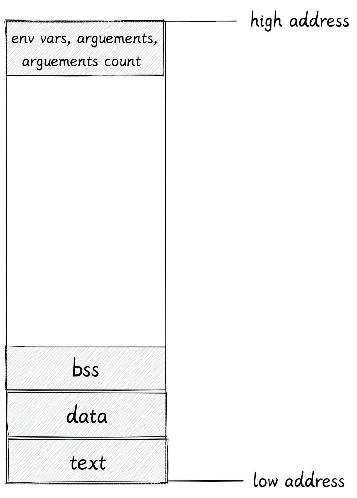

**注意**：這裡的內存地址並不是內存條裡實際的內存地址。但是當程序開始使用內存時，內核和硬件會把它們映射到真正的物理內存地址。這被稱為
**虛擬地址空間**。一個正在運行的程序被稱為一個進程。從進程的角度來看，它只能看到一段連續的內存，從 0 到地址高位的最大值。

下面我們會介紹進程地址空間中各個區域的作用：

1. 代碼段 (text)

   代碼段包含了可執行指令的集合。

   編譯器能把我們用高級語言寫的程序轉換為 CPU 可以執行的機器指令，代碼段就包含了這些指令。這些指令根據 CPU 架構而有所不同。編譯給 x86-64
   架構 CPU 運行的二進制文件不能在 ARM 架構的 CPU 上運行。

   代碼段是 **只讀** 的，運行的程序不能更改它。

2. 數據段 (data)

   數據段包含 **已經初始化** 過的數據。比如全局變量，全局靜態變量，局部靜態變量。

3. BSS 段 (bss)

   bss 代表 `Block started by symbol`, 這裡保存著 **未被初始化** 過的全局變量。由於 bss
   段的變量未被初始化，這一段並不會直接佔據二進制文件的體積，它只負責記錄數據所需空間的大小

4. 地址高位

   內核會把一些額外的數據，比如環境變量，傳遞給程序的參數和參數的數量映射到地址高位。

## 堆 & 棧

### 堆棧簡介

當程序運行時（運行態），還需要需要另外兩個域：堆和棧

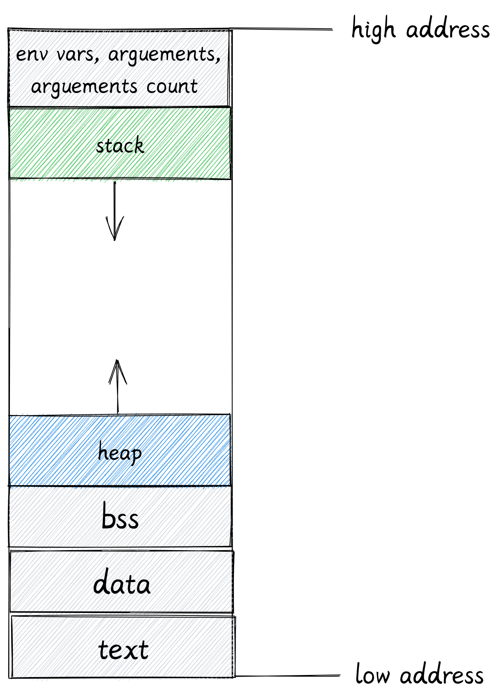

**棧**：

- 操作系統使用棧存儲一個進程的抽象細節，包括 (進程名字，進程 ID 等)。
- 一個進程至少有一個執行線程，每一個線程都有自己的棧內存。
- 在 64 位的 linux 系統上，Rust 程序為主線程分配 8MB 的棧內存。對於用戶創建的其他線程，rust 標準庫支持自定義大小，默認的大小是
  2MB。

- 棧內存的空間會從地址高位向低位增長，但是不會超過線程可以擁有的最大值。對於主線程來說就是 8MB。如果它使用的棧內存超過了
  8MB，程序就會被內核終止，並返回一個 `stackoverflow` 錯誤。

- 棧內存被用於執行函數 (見下方對棧的具體講解)。

> 雖然主線程的棧內存大小有 8MB，但是這 8MB 也不會被立即分配，只有當程序開始使用時，內核才會開始為它分配內存。

**堆**：

- 所有線程共享一塊堆內存
- 堆內存從地址低位向高位增長。

操作系統通常會提供一些接口讓我們檢查程序運行時的內存映射狀態，對於 linux 系統，你可以在 _/proc/PID/maps_ 文件中查看

下面展示了一個進程的映射狀態（部分）：

```
$ cat /proc/844154/maps
55e6c3f44000-55e6c412c000 r-xp 00000000 103:03 22331679                  /usr/bin/fish
55e6c412c000-55e6c4133000 r--p 001e7000 103:03 22331679                  /usr/bin/fish
55e6c4133000-55e6c4134000 rw-p 001ee000 103:03 22331679                  /usr/bin/fish
55e6c4134000-55e6c4135000 rw-p 00000000 00:00 0
55e6c4faa000-55e6c5103000 rw-p 00000000 00:00 0                          [heap]
7fd62326d000-7fd62326f000 r--p 00034000 103:03 22285665                  /usr/lib/ld-linux-x86-64.so.2
7fd62326f000-7fd623271000 rw-p 00036000 103:03 22285665                  /usr/lib/ld-linux-x86-64.so.2
7ffecf8c5000-7ffecf8f5000 rw-p 00000000 00:00 0                          [stack]
```

你可能會想問：堆內存和棧內存是否會相互覆蓋？因為他們兩個向對方的方向增長。

通過用 stack 的低位減去 heap 的高位

```py
>>> (0x7ffecf8c5000 - 0x55e6c5103000) / (10 ** 12)
46.282743488512
```

差距為 47TB，所以棧堆衝突的情況幾乎不可能出現

如果確實發生了，內核會提供守衛去終止程序。注意，這裡的內存是指虛擬內存，並非電腦的真實內存大小。

### CPU 字長

虛擬內存地址的範圍由 CPU 字長 (word size) 決定，字長是指 CPU 一次可以並行處理的二進制位數，對於 64 位的 CPU 來說，它的字長為
64 位 (8 字節)。CPU 中大多數或者全部寄存器一般都是一樣大。


因此可以得出：64 位 CPU 的尋址空間為 0 ~ 2^64-1。而對於 32 位的 CPU 來說，它的尋址空間只有從 0 到 2^32，大概 4GB。

目前，在 64 位 CPU 上，我們一般只使用前 48 位用於尋址，大小大概是 282TB 的內存

```
>>> 2**48 / (10**12)
281.474976710656
```

這其中，只有前 47 位是分配給用戶空間使用，這意味著大概有 141TB 的虛擬內存空間是為我們的程序分配的，剩下的位於地址高位的 141TB
是為保留給內核使用的。如果你去查看程序的虛擬內存映射，你能使用的最大內存地址應該是 `0x7fffffffffff`

```
>>> hex(2**47-1)
'0x7fffffffffff'
```

### 棧內存

接下來讓我們深入瞭解棧內存的用途

在這個例子中，整個程序只有一個主線程在運行，我們在 `main` 裡調用了 `add1` 函數。

```rs
fn main() {
    let a = 22;
    let b = add_one(a);
}

fn add_one(i: i32) -> i32 {
    i + 1
}
```

棧主要用來保存正在調用的函數的數據 (包括函數參數，函數的局部變量，和它的返回地址)。為一個運行中的函數分配的總內存被稱為一個 **棧幀**。

1. `main` 函數是程序的入口，首先 `main` 函數的棧幀被創建。

   `main` 函數內部有一個兩個 `i32` 類型的局部變量 `a` 和 `b`，大小都是 4 個字節，其中 `a` 的值為 22。`main`
   函數的棧幀會確保有足夠的空間去保存這些局部變量。

   ESP 和 EBP 寄存器內分別保存著棧頂指針和棧底指針，用來追蹤當前的棧的頂部和底部。

   

2. 當 `main` 函數調用 `add1` 時，一個新的棧幀被創建用來保存 `add1` 函數的數據。棧頂指針被修改為新棧的頂部。

   

   1. `add1` 函數要接受一個 `i32` 類型的參數，因此 4 字節的空間會被保留在 `add1` 函數的棧幀上。
   2. `add1` 函數並沒有局部變量
   3. 棧幀還會保存一個返回地址，當函數運行結束後，會根據該返回地址回到之前的指令。

3. 函數調用結束

   當函數調用結束後，就會把返回值 23 賦值給局部變量 `b`。同時棧頂指針也被修改。

   

   > 注意：函數運行結束後，add1
   > 的棧幀並沒有被釋放。當你的程序開始調用下一個函數時，新的棧幀會直接將其覆蓋。對於棧來說，開闢和釋放內存只需要修改棧指針即可。

由此可見，因為在棧上開闢和釋放內存只需要移動指針，不需要進行任何系統調用，它的效率是很高的。

當然棧也有一些限制：

- 只有在編譯時已知大小的變量才能被存儲在棧上。
- 函數不能返回一個位於函數內部的局部變量的引用

如果你把 add_one 改成下面的樣子，就會編譯失敗：

```rs
fn add_one(i: i32) -> &'static i32 {
    let result = i + 1;
    &result
}
```

```
error[E0515]: cannot return reference to local variable `result`
 --> src/main.rs:8:5
  |
8 |     &result
  |     ^^^^^^^ returns a reference to data owned by the current function
```

根據我們之前介紹過棧的工作原理，假設你現在返回了一個函數內局部變量的引用，但是當函數返回時，本質上函數的內存就被釋放了。當下一個函數被調用時，它的棧幀就會重寫這塊內存空間。

在一個帶有 GC 的語言裡，編譯器能夠檢測到這種覆蓋，並在會為這個變量在堆上分配一塊空間，並返回它的引用。但是在堆上分配會帶來部分額外開銷。因為 Rust 沒有
GC，而且不會強制你去顯式的分配堆內存，所以這裡會編譯失敗。

### 堆內存

在這個例子裡，我們在 `main` 函數中調用了 `heap` 函數。

```rs
fn main() {
    let result = heap();
}

fn heap() -> Box<i32> {
    let b = Box::new(23);
    b
}
```

首先會為兩個函數再棧上創建棧幀。接著使用 `box` 將 23 分配在堆上。然後把 23 在堆上的地址賦值給了變量 `b`。`box`
只是一個指針，所以棧上有足夠的空間去保存 `box`。


> 在 64 位系統上，指針的大小是 8 字節，所以在棧上的變量 b 的大小是 8 字節。而 b 指向的變量 23 是 `i32` 類型，它在堆上只需要佔用 4
> 字節。

當函數調用結束後，`heap` 函數返回的 `box` 指針就會被保存在 main 函數的局部變量裡。

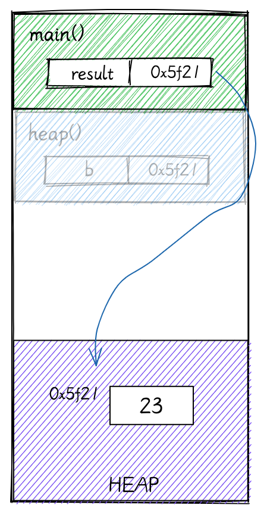

當你對棧上的數據進行賦值操作時，它的棧內存就會被直接 `copy` 過去。在這個例子裡，用來保存 `box` 的 8 個字節就是從 `heap`
函數的棧幀直接複製到 `main` 的局部變量 `result`。現在即使 `heap` 函數的棧幀被釋放，`result`
變量依然保存著數據的地址。堆允許你共享變量。

### 內存分配器

我們之前提到過每個線程都有各自的棧內存，他們共享一塊堆內存。

假設你的程序不斷在堆上分配新的數據，現在堆內存幾乎耗盡了，需要對堆內存進行擴容。

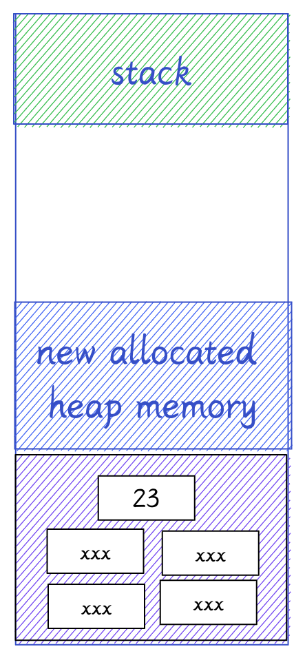

程序的內存分配器一般會使用系統調用請求操作系統分配更多內存。對於 linux 系統來說，一般是 `brk` 或者 `sbrk` 系統調用。

在 Rust 裡，堆內存分配器需要實現 `GlobalAlloc` 特徵。你幾乎不會直接用到它，編譯器會在需要時插入合適的系統調用。

```rs
// /rust/library/std/src/sys/unix/alloc.rs
#[stable(feature = "alloc_system_type", since = "1.28.0")]
unsafe impl GlobalAlloc for System {
    #[inline]
    unsafe fn alloc(&self, layout: Layout) -> *mut u8 {
        if layout.align() <= MIN_ALIGN && layout.align() <= layout.size() {
            libc::malloc(layout.size()) as *mut u8
        }
        ...
    }
    ...
}
```

你可能很熟悉 C 語言裡的 `malloc` 函數，但是它並不是系統調用，`malloc` 依然會調用 `brk` 或者 `sbrk` 去請求內核。Rust
的內存分配器依靠 C 標準庫裡提供的 `malloc` 函數，如果你使用像 `ldd` 這樣的工具去檢查二進制文件依賴的動態鏈接庫，你應該會看到 `libc`

```shell
$ ldd target/debug/demo
    linux-vdso.so.1 (0x00007fff60bd8000)
    libc.so.6 => /usr/lib/libc.so.6 (0x00007f08d0c21000)
    /lib64/ld-linux-x86-64.so.2 => /usr/lib64/ld-linux-x86-64.so.2 (0x00007f08d0ebf000)
```

> Linux 下 Rust 默認使用 GNU 作為鏈接器，因此 Rust 二進制文件依賴於操作系統上的 C 標準庫或者 `libc` 庫。`libc`
> 更像是操作系統的一部分，使用像 `libc` 這樣的動態鏈接庫有助於減少二進制文件體積。

同時，內存分配器也不總是依賴於系統調用在堆上分配內存：

1. 每次程序使用 box 等把數據分配在堆上時，程序的內存分配器都會成塊的請求內存去減少系統調用的次數。

2. 堆和棧不一樣，內存不一定總是在堆的末尾被釋放。當一些地方的內存被釋放後，它並沒有立即返還給操作系統，內存分配器會追蹤內存分頁，知道那些頁正在使用，那些頁被釋放了。所以當需要更多堆內存時，它可以直接使用這些已經釋放但還未歸還的內存分頁。

現在你應該知道為什麼分配堆內存比棧內存更消耗性能了。分配堆內存可能使用到系統調用，而且內存分配器每一次分配內前，都必須從堆上找到一個空閒內存塊。

## Rust 各數據類型的內存佈局

### 整形

| 長度 (byte) | 長度 (bit) | 有符號  | 無符號  |
| --------- | -------- | ---- | ---- |
| 1 字節      | 8 位      | i8   | u8   |
| 2 字節      | 16 位     | i16  | u16  |
| 4 字節      | 32 位     | i32  | u32  |
| 8 字節      | 64 位     | i64  | u64  |
| 16 字節     | 128 位    | i128 | u128 |

有符號和無符號整形的名字已經展示了它所佔的位數，比如 `i16` 和 `u16` 在內存都是 16 位 (2 字節)。它們都被完整的分配在函數的棧幀上。


`isize` 和 `usize` 的大小則取決於你的系統，32 位系統就佔用 4 字節，64 位系統就佔用 8 字節。

### 字符型

`char` Rust 的字符不僅僅是 ASCII，所有的 Unicode 值都可以作為 Rust 字符。 例如
`a`、`\u{CA0}`、`*`、`字`、`\n`、`🦀`

char 類型長度是 4 字節，直接分配在棧上


### 元組

元組是一些類型的集合

```rs
let a: (char, u8, i32) = ('a', 7, 354);
```

比如這裡，變量 a 包含了 char, u8, i32 三種數據類型，它的內存佈局就是將各個成員依次排列。

在這裡 char 佔用 4 字節，u8 佔用 1 字節，i32 佔用 4 字節。因為這三種類型都是隻在棧上分配的，所以整個元組也全在棧上分配。

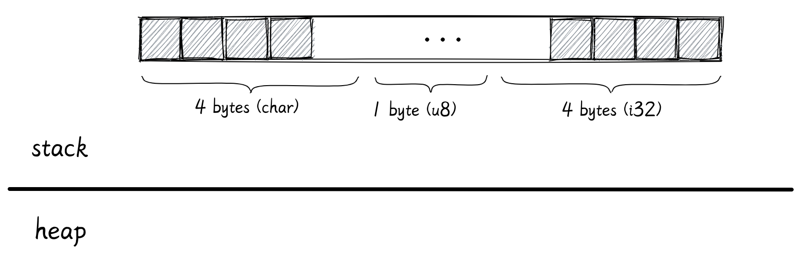

雖然看起來這個元組只會佔用 9 字節的空間，但是其實並不是這樣，你可以用 `size_of` 去查看這個元組佔用的真正字節數

```rs
std::mem::size_of::<T>()
```

### size_of 和 align_of

```rs
use std::mem::{size_of, align_of};

size_of::<(char, u8, i32)>(); // 12 字節

align_of::<(char, u8, i32)>(); // 4 字節
```

所有的數據類型還有一個對齊屬性，你可以通過 `align_of` 查看。

數據類型的大小必須是對齊屬性的整數倍。這一點不僅僅是 Rust，所有的編譯器都是這樣。數據對齊對 CPU 操作及緩存都有較大的好處，有助於 CPU
更快的讀取數據。

對於這個元組，它的對齊屬性值是 4，因此它佔用的字節數是 12。剩下的 3 字節會被編譯器填充空白數據

### 引用

接下來是引用類型 `&T`

```rs
let a: i32 = 25;

let b: &i32 = &a;
```

`a` 是 i32 類型，`b` 是對 `a` 的引用。

> 接下來，我不會在詳細展示每個數據的字節大小，我們將重點去關注整體，關注他們是存儲在堆上還是棧上。

在這裡，`a` 存儲在棧上，它佔據 4 個字節。`b` 也存儲在棧上，裡面保存了變量 `a` 的地址。引用類型的大小取決於你的機器位數，所以 64 位系統上它佔
8 字節。

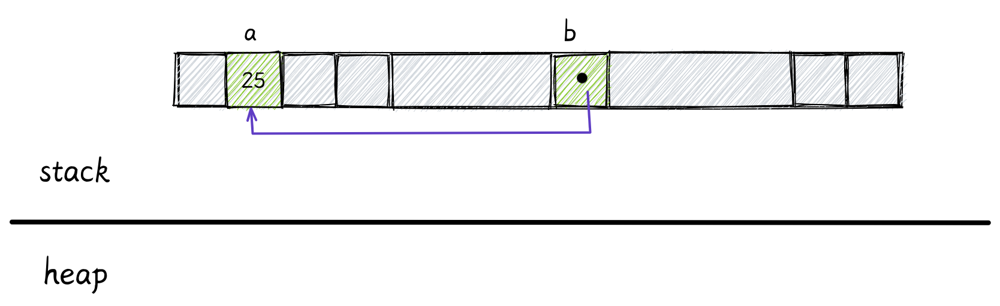

如果我們再用 `c` 保存 `b` 的引用，c 的類型就是 `&&i32`

```rs
let c: &&i32 = &b;
```

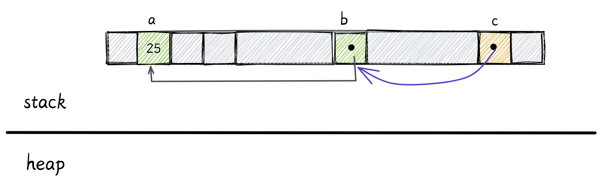

引用也能指向堆上的數據。


可變引用也有相同的內存佈局。

可變引用和不可變引用的區別是他們的使用方式，以及編譯器為可變引用添加的額外限制。

### 數組

```rs
let a: [i32; 3] = [55, 66, 77];
```


一個數組的大小是固定的，而且它的大小是數據類型的一部分。數組中的每個元素都會在棧上相鄰排放。但是當數組創建後，它的大小就不能再改變。

> 注意：只有大小固定而且在編譯時已知的數據類型才能存儲在棧上。

### Vec

Vec 類型是可擴容的，它的大小能夠改變，你可以用它代替數組。

```rs
let v: Vec<i32> = vec![55, 66, 77];
```


這裡我們的變量 `v` 存儲了和數組相同的數據，但是它是在堆上分配的。

變量 `v` 在棧上佔用的大小是固定的，包含 3 個 `usize`：

- 第一個表示數據在堆上的地址，
- 剩下的兩個表示 Vec 的容量和長度。

容量表示 Vec 的最大空間。當我們向 Vec 中添加更多數據時，如果元素個數還沒有達到容量大小，Rust 就不必為堆內存分配更多空間。

如果長度和容量已經相等了，我們還要向 Vec 添加更多數據，Rust 就會在堆中重新分配出一塊更大的內存，將原數據複製到新的內存區域，並更新棧中的指針。

### 切片

```rs
let s1: [i32] = a[0..2];

let s2: [i32] = v[0..2];
```

切片 `[T]` 和數組非常相似，但是不用指定大小。切片就像是底層數組的一個視圖，s1 表示數組 a 的前兩個元素，s2 表示向量的前兩個元素。

由於切片沒有指定元素數量，編譯時 Rust
編譯器不知道它具體佔了多少字節。同時，你也不能將切片存在變量中，因為它沒有已知大小，所以不能被分配在棧上，這樣的類型被稱為 **DST 動態大小類型** 。

> 還有其他的 DST 類型，比如字符串切片和特徵對象。

如果你嘗試運行上面的代碼，應該會編譯失敗：

```rs
error[E0277]: the size for values of type `[i32]` cannot be known at compilation time
 --> examples/vec.rs:8:9
  |
8 |     let s1: [i32] = a[0..2];
  |         ^^ doesn't have a size known at compile-time
  |
help: consider borrowing here
  |
8 |     let s1: [i32] = &a[0..2];
  |                     +
```

因此，幾乎在任何情況下，我們只會使用到切片的引用 **`&[T]`**。被引用的數據既能在棧上，也能在堆上：


我們之前說過，引用只是一個指針，它佔據一個 `usize` 去存儲它所指向的數據的地址。

但是當你用指針去指向一個動態大小類型時 (比如切片)，Rust 會使用一個額外的 `usize` 去存儲數據的長度。這種引用也叫做 **胖指針**
(將一些附加信息和指針一起存儲)。

切片引用可以用兩個 `usize` 表示，所以它可以存在棧上。

### 字符串

與字符串相關的有三種類型：`String`, `str`, `&str`，他們分別對應 `Vec`, `[T]`， `&[T}`

字符串類型 `String` 的內存佈局和向量相同，唯一的區別是，字符串類型必須是 UTF-8 編碼。

以下面的代碼為例：

```rs
let s1: String = String::from("hello");
```

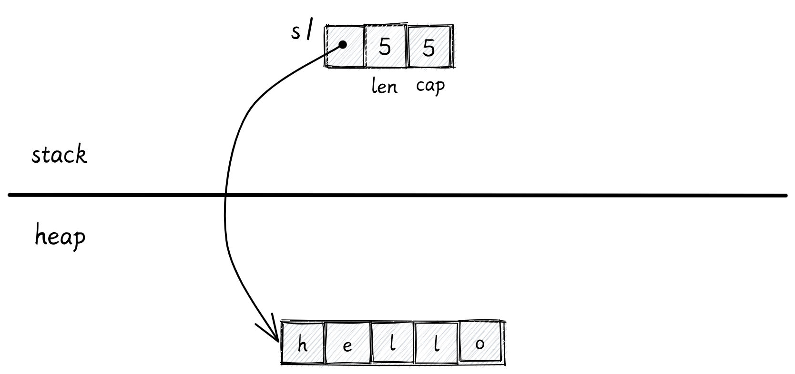

但是，如果你把一個字符串直接保存在變量中：

```rs
let s2: &str = "hello";
```

`s2` 的類型就會變成字符串切片的引用，這個字符串的數據不會在堆上，而是直接存儲在編譯好的二進制文件中。這種字符串有 `'static`
的生命週期，它永遠不會被釋放，在程序運行時都是可用的。

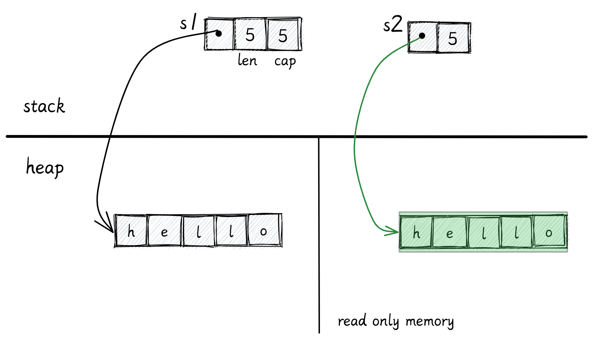

> 據我所知，Rust 不會指定字符串被保存在文件的那個部分，但是很可能就在代碼段 (text segment)

和切片引用一樣，對字符串的切片的引用也是一個胖指針，包含兩個 `usize`，一個用來存儲字符串的內存起始地址，另一個存儲字符串長度。

你不能直接使用字符串切片 `str`:

```rs
// error: size can not be known at compile time
let s: str = s1[1..3];
```

對字符串的切片引用是可行的：

```rs
let s: &str = &s1[1..3];
```


### 結構體

Rust 有三種結構體類型：結構體，元組結構體 (Tuple Struct) 和單元結構體 (Unit-like Struct)。

普通結構體：

```rs
struct Data {
    nums: Vec<usize>,
    dimension: (usize, usize),
}
```

元組結構體：

```rs
struct Data(Vec<usize>);
```

單元結構體：

```rs
struct Data;
```

單元結構體不保存任何數據，所以 Rust 編譯器甚至不會為他分配內存。

另外兩種結構體的內存排布非常類似於之前所說的元組，我們以普通的結構體為例：

```rs
struct Data {
    nums: Vec<usize>,
    dimension: (usize, usize),
}
```

它有兩個字段，一個 Vec 和一個元組，結構體的各個成員會在棧上依次相鄰排列。

- Vec 需要佔用 3 個 `usize`，nums 的成員會被分配在堆上。
- 元組需要佔用 2 個 `usize`。


> 注意：我們在這裡忽視了內存對齊和編譯器填充的 padding。

### 枚舉

像結構體一樣，Rust 支持用不同的語法表示枚舉。

下面展示的是一個 C 風格的枚舉，在內存中他們被保存為從零開始的整數，Rust 編譯器會自動選擇最短的整數類型。

```rs
enum HTTPStatus {
    Ok,
    NotFound,
}
```


在這裡最大值為 1，因此該枚舉可以使用 1 字節存儲。

你也可以手動為枚舉的每個變體指定它的值：

```rs
enum HTTPStatus {
    Ok = 200,
    NotFound = 404,
}
```

這個例子裡最大的數是 404，需要至少 2 字節存儲。所以這個枚舉的每種變體都需要 2 字節。


枚舉值也可以選擇具體的類型

```rs
enum Data {
    Empty,
    Number(i32),
    Array(Vec<i32>)
}
```

在這個例子中

- `Empty` 變體不存儲任何數據
- `Number` 內部有一個 `i32`
- `Array` 裡面有個 `Vec`

它們的內存佈局如下圖所示：


首先我們看 `Array` 變體：

首先是一個整數標記 2 佔用 1 字節，接著就是 `Vec` 所需的三個 `usize` ，編譯器還會填充一些空白區域讓他們內存對齊，所以這個變體需要 32
字節 (1 + 7 + 3 * 8)。

接著是 `Number` 變體，首先是整數標記 1，接著是 Number 裡存儲的 i32，佔用 4
字節。因為所有變體的大小應該是一致的，所以編譯器會為它們兩個都添加 Padding 達到 32 字節

對於 `Empty`，它只需要一個字節去存儲整數標記，但是編譯器也必須添加 31 字節的 Padding

所以，枚舉佔用的空間取決於最大變體佔用的空間。

減少內存使用的一個技巧就是降低枚舉最大變體佔用的內存：

```rs
enum Data {
    Empty,
    Number(i32),
    Array(Box<Vec<i32>>) // 使用 Box 代替
}
```

在這個例子裡，我們存除了 Vec 的指針，此時 Array 變體需要的內存只有 16 字節：


### Box

Box 是一個指針指向堆上的數據，所以 Box 在棧上只需要 1 個 `usize` 去存儲地址。

在上個例子中，Box 指向了一個在堆上分配的 Vec。

> 如果向量裡面有值，這些值也會被存儲在堆上。指向數據的指針將保存在 Vec 的指針字段裡

### 對 Option 的優化

```rs
pub enum Option<T> {
    None,
    Some(T)
}
```

由於 Rust 不允許出現空指針，想要實現同樣的效果，你需要使用

```rs
Option<Box<i32>>
```

這能夠讓 Rust 編譯器確保不會出現空指針異常。

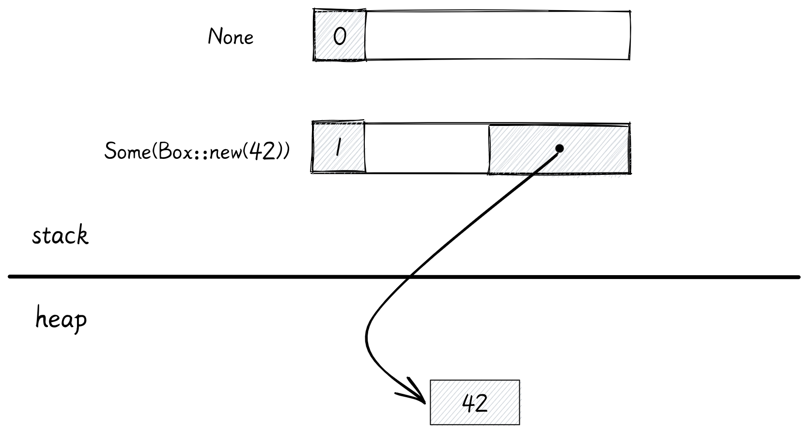

在其他語言裡，使用一個指針就能表示這兩種狀態。但是 Rust 卻需要一個額外的整數標記和隨之帶來的 padding，這會造成內存浪費。

編譯器能對此做出一些優化，如果 `Option` 裡是 `Box` 或者是類似的指針類型，編譯器就會省略掉整數標記，並使用值為 0 的指針表示 None。


這種特性使得 Rust 中被包裝在 `Option` 內的智能指針像其他語言裡的指針一樣，不會佔用多餘的內存。同時還能夠提前找到並消除空指針異常

### Copy 和 Move

在繼續向下討論之前，讓我們先了解一下 Copy 和 Move

```rs
let num：i32 = 42;
let num_copy = num;
```

對於原始類型數據，他們的大小是在編譯時已知的，會被存儲在棧上。如果你將一個變量賦值給另一個變量，它得到的實際上是原始數據的一份拷，Rust 會逐位進行復制。

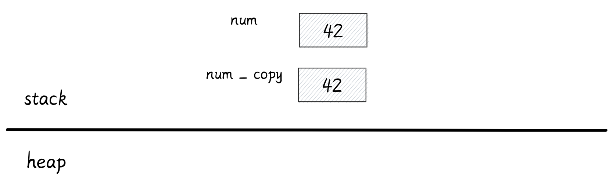

這兩個變量之後能同時使用

對於在堆上存儲的數據來說：

```rs
let v: Vec<String> = vec![
    "Odin".to_String(),
    "Thor".to_String(),
    "Loki".to_String(),
]
```

在這個例子裡，我們有一個在堆上分配的字符串向量。

變量 v 被保存在棧上，它需要 3 個 `usize` 去存儲 Vec 的信息，並指向數據在堆中的地址。

每個字符串也需要 3 個 `usize` 來存儲實際字符串的信息。

真正的字符串會被分配到堆上的其他地方。


從所有權角度來說，變量 v 擁有所有在堆上分配的內存。因為 Rust 沒有 GC，當變量 v 自己超出作用域後，它需要自己釋放自己擁有的堆內存。

接下來我們將 v 賦值給了 v2：

```rs
let v2 = v;
```

對於有 GC 的語言來說，程序會對變量 `v` 在棧上的數據進行了按位複製，最後 `v2` 也將擁有指向堆上數據的指針。

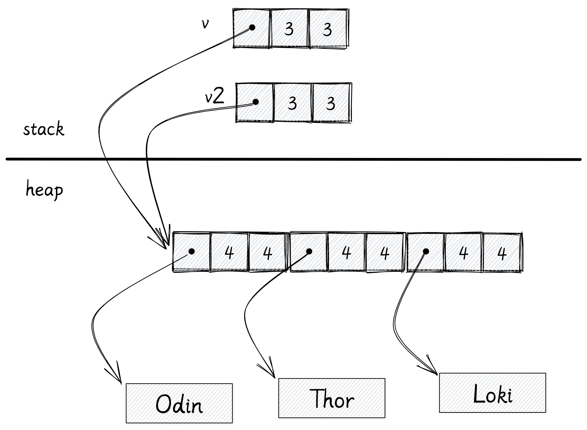

這種方案很節省內存，無論在堆中的數據有多大，我們只需要複製棧上的數據。垃圾回收器會追蹤堆內存的引用數量，當引用計數歸零，垃圾回收器會幫我們釋放堆內存。

但是 Rust 沒有 GC，它只有所有權模型。我們不清楚到底哪個變量需要對釋放內存負責。

另一種方案是：在賦值時為堆內存也創建一個副本。但是這會導致內存使用量升高，降低性能。

Rust 的選擇是讓用戶必須做出選擇：如果你在對變量賦值時想讓它擁有一份屬於自己的堆內存，你應該使用 `clone` 方法。如果你不使用 `clone`
方法，Rust 編譯器就不允許你再使用之前的變量。


我們把它稱為：變量 v 已經被 move 了，現在 v2 是數據的擁有者。當 v2 超出作用域時，它會負責釋放堆上的數據。

### Rc

有時候我們想讓一個值擁有多個擁有者，大多數情況下，你可以用普通的引用去解決。但是這種方法的問題在於，當數據的擁有者超出作用域後，所有的引用也不能再繼續使用。

我們想要的是所有變量都是數據的擁有者，只有所有變量都超出作用域後，數據才會被釋放。Rc 智能指針通過引用計數能夠實現這個功能：

```rs
use std::rc::Rc;

let v: Rc<Vec<String>> = Rc::new(vec![
    "Odin".to_String(),
    "Thor".to_String(),
    "Loki".to_String(),
]);

let v2 = v.clone();
println!("{}, {}", v.capacity(), v2.capacity())
```

當你使用 Rc 去包裹一個 Vec 時，Vec 的 3 個 `usize` 會和引用計數一起分配在堆上。變量 v 在棧只佔用一個 `usize`，裡面存儲了
Rc 在堆上的地址。


現在你能通過克隆 v 來創建 v2，這個克隆不會克隆任何位於堆上的數據，他只會克隆一份棧上的地址，然後將 Rc 的引用計數加 1，現在 v 和 v2
都持有相同的一份數據，這就是為什麼它被稱為引用計數指針。


但是 Rc 也有限制，Rc 內部的數據是不可變的，你可以使用內部可變性可以解決這個問題。

每當有一個共享者超出作用域，引用計數就會減 1，讓引用計數減到 0 時，整個堆內存就會被釋放。

### Send 和 Sync

Rust 有一些特殊的標記特徵，例如 Send 和 Sync。

如果一個類型實現了 Send，那就意味著數據可以從一個線程移動到另一個線程。

如果一個類型實現了 Sync，多個線程就可以使用引用去共享該數據。

Rc 沒有實現 Send 和 Sync。假設兩個線程在某個時間點同時擁有對某數據的引用，並且同時對該引用進行克隆。兩個線程同時更新引用計數就會引發線程安全問題。


### Arc

如果你真的想要在線程間共享數據，你應該使用 **原子** 引用計數指針 **Arc**。

Arc 的工作方式幾乎和 Rc 相同，只是引用計數的更新是原子性的，它是線程安全的。但是原子操作會帶來一些微小的性能損耗。如果你只需要在單線程內共享數據，使用
Rc 就夠了。

默認情況下 Arc 也是不變的，如果你想讓數據是可變的，你可以使用 `Mutex`。

```rs
// Arc<Mutex<T>>

let data: Arc<Mutex<i32>> = Arc::new(Mutex::new(0));
```

現在即使有兩個線程嘗試同時修改數據，他們需要首先獲取鎖，同時只有有一個線程能拿到鎖，因此只能由一個線程修改數據。

### 特徵對象

實現了特徵的實例被稱為特徵對象。

下面列舉了將一種具體類型轉化為特徵對象的方法：

```rust
use std::io::Write;

let mut buffer: Vec<u8> = vec![];
let w: &mut dyn Write = &mut buffer;
```

第一個例子中，轉化發生在為變量 `w` 賦值時

```rs
fn main() {
    let mut buffer: Vec<u8> = vec![];
    writer(&mut buffer);
}

fn writer(w: &mut dyn Write) {
    // ...
}
```

第二個例子中，轉化發生在將具體類型變量傳遞給接受特徵對象的函數時

這兩個例子裡 `Vec<u8>` 類型的變量都被轉化為實現了 `Write` 的特徵對象。

Rust 用胖指針表示一個特徵對象。該胖指針由兩個普通指針組成，佔用 2 個機器字長。

- 第一個指針指向值，這裡就是 `Vec<u8>`
- 另一個指針指向 vtable (虛表)。


`vtable` 在編譯時生成，被所有相同類型的對象共享。`vtable` 包含了實現 `Writer`
必須實現的方法的指針。當你在調用特徵對象的方法時，Rust 自動使用 `vtable` 找到對應的方法。

注意：`dyn Write` 也是動態大小類型，因此我們總是使用它的引用，即 `&dyn Write`。

我們能把 `Vec<u8>` 轉換成特徵對象是因為標準庫已經為它實現了 `Write` 特徵。

```rs
impl Write for Vec<u8>
```

Rust 不僅能將普通引用轉化為特徵對象，rust 也能將智能指針轉換為特徵對象：

```rs
// Box
use std::io::Write;

let mut buffer: Vec<u8> = vec![];
let w: Box<dyn Write> = Box::new(buffer);
```

```rs
// Rc
use std::io::Write;
use std::rc::Rc;

let mut buffer: Vec<u8> = vec![]

let mut w: Rc<dyn Write> = Rc::new(buffer);
```

無論是普通引用還是智能指針，在轉換髮生的時候，Rust 只是添加了適當的 `vtable` 指針，把原始指針轉換為了一個胖指針。

### 函數指針

函數指針只需要一個 `usize` 去存儲函數的地址。

`test_func` 是一個會返回 bool 的函數，我們可以把它存在了一個變量裡。

```rs
fn main() {
    let f: fn() -> bool = test_func;
}

fn test_func() -> bool {
    true
}
```


### 閉包

Rust 沒有具體的閉包類型，它制定了 3 個特徵 `Fn`、`FnMut`、`FnOnce`。

#### FnOnce

首先是 `FnOnce`，`create_closere` 函數返回了一個實現 `FnOnce` 的對象

```rs
fn main() {
    let c = create_closure();
}

fn create_closure() -> impl FnOnce() {
    let name = String::from("john");
    || {
        drop(name);
    }
}
```

在函數體內部我們創建了一個局部變量 `name`，它是字符串類型，在棧上佔據 3 個 `usize`
，接著又創建了一個閉包，閉包可以捕獲函數內的局部變量。在閉包內部，我們 drop 了 name。

FnOnce 只是一個特徵，它只定義了一個對象的行為或方法。Rust
內部會使用結構體表示閉包，它會根據閉包捕獲的變量創建對應的結構體，併為該結構體實現最合適的特徵

```rs
struct MyClosure {
    name: String
}

impl FnOnce for MyClosure {
    fn call_once(self) {
        drop(self.name)
    }
}
```

> `FnOnce` 特徵的真實函數簽名比較複雜，這裡只展示一個簡化版本。

結構體內部只有一個 name 字段，是閉包從 `create_closure` 函數內部捕獲而來，`call_once` 是 `FnOnce`
特徵必須實現的方法。因為閉包對應的結構體只有一個 String 類型字段，所以他的內存佈局和 String 一樣。


注意 call_once 函數的參數，他需要一個 `self` ，這意味著 `call_once`
只能調用一次。原因也很簡單，如果我們調用兩次這個閉包，拿他就會 drop `name` 兩次。

#### FnMut

在這個例子裡，我們創建了一個可變的閉包：

```rs
let mut i: i32 = 0;

let mut f = || {
    i += 1;
};

f();
f();
println!("{}", i); // 2
```

這個閉包的類型是 `FnMut` ，因為我們在閉包裡嘗試修改變量 i 。因此該閉包生成的結構體中將會有一個對變量 i 的可變引用，`call_mut`
方法也需要一個對 `self` 的可變引用：

```rs
struct MyClosure {
    i: &mut i32
}

impl FnMut for MyClosure {
    fn call_mut(&mut self) {
        *self.i += 1;
    }
}
```

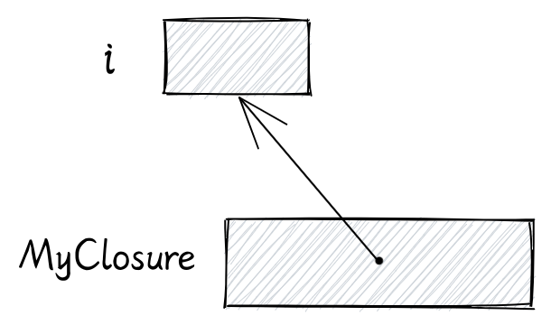

如果你在閉包 f 改為不可變的：

```rs
let f = || {
    i += 1;
};
```

就會編譯失敗：

```rs
error[E0596]: cannot borrow `f` as mutable, as it is not declared as mutable
  --> src/main.rs:16:5
   |
12 |     let f = || {
   |         - help: consider changing this to be mutable: `mut f`
13 |         i += 1;
   |         - calling `f` requires mutable binding due to mutable borrow of `i`
...
16 |     f();
   |     ^ cannot borrow as mutable
For more information about this error, try `rustc --explain E0596`.
```

錯誤信息提示我們，該閉包需要設為可變的

#### Fn

最後是 `Fn` 特徵：

```rs
fn create_closure() {
    let msg = String::from("hello");

    let my_print = || {
        println!("{}", msg);
    };

    my_print();
    my_print();
}
```

在這個例子裡，我們的閉包只是打印了一下它捕獲到的 msg 變量，`print` 宏接受的是變量的引用，所以 Rust 會自動為閉包實現 Fn 特徵：

```rs
struct MyClosure {
    msg: &String,
}

impl Fn for MyClosure {
    fn call(&self) {
        println!("{}", self.msg);
    }
}
```

生成的結構體內部只有一個對 `msg` 的引用。`call` 方法只需要一個 `self` 的引用，因此這個閉包能夠被多次調用。


#### move

這個例子中我們將使用和剛剛相同的閉包，只不過是用一個函數去返回：

```rs
fn create_closure() -> impl Fn() {
    let msg = String::from("hello");

    || {
        println!("{}", msg);
    }
}
```

但是這樣會編譯錯誤：

```rs
error[E0597]: `msg` does not live long enough
  --> src/main.rs:30:24
   |
29 |     || {
   |     -- value captured here
30 |         println!("{}", msg);
   |                        ^^^ borrowed value does not live long enough
31 |     }
32 | }
   | -- borrow later used here
   | |
   | `msg` dropped here while still borrowed

For more information about this error, try `rustc --explain E0597`.
```

錯誤信息提示我們，變量 `msg` 的生命週期可能比閉包短。

現在回想一下閉包的內存佈局，閉包的結構體內部只有一個對 `msg` 的引用。所以當函數調用結束後，它的棧幀將被釋放，閉包就不能再引用到該函數棧幀裡的局部變量。

Rust 希望我們使用 `move` 關鍵字去明確表示我們想讓閉包拿走閉包捕獲到的變量的所有權

```rs
fn create_closure() -> impl Fn() {
    let msg = String::from("hello");

    move || {
        println!("{}", msg);
    }
}
```

當我們使用 move 之後，閉包的結構體就不再是引用，而是字符串本身。

```rs
struct MyClosure {
    msg: String,
}

impl Fn for MyClosure {
    fn call(&self) {
        println!("{}", self.msg);
    }
}
```

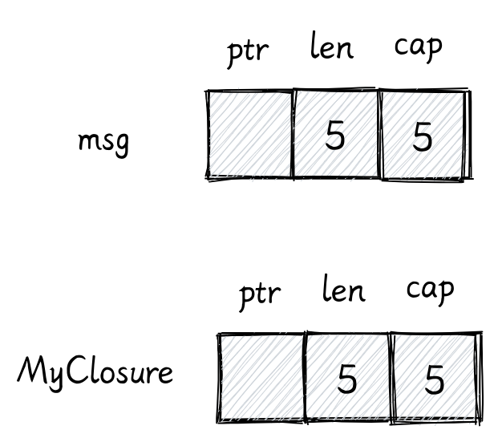

#### 捕獲多個變量

到目前為止，我們的閉包還只是捕獲一個變量，在這個例子裡閉包捕獲了兩個對象，一個字符串和一個 Vec：

```rs
fn create_closure() -> impl Fn() {
    let msg = String::from("hello");
    let v: Vec<i32> = vec![1, 2];

    move || {
        println!("{}", msg);
        println!("{:?}", v);
    }
}
```

它的結構體大致如下：

```rs
struct MyClosure {
    msg: String,
    v: Vec<i32>,
}

impl Fn for MyClosure {
    fn call(&self) {
        println!("{}", self.msg);
        println!("{:?}", self.v);
    }
}
```

它的內存佈局和結構體的一樣，並沒有什麼特殊的。


這個模式在其他地方也遵循，比如 異步生態中大量使用的 Future 特徵。在內存中編譯器會使用枚舉表示實際的對象，併為這個枚舉實現 Future
特徵。這裡不會詳細講解 Future 的實現細節，我提供了一個鏈接，視頻裡詳細的解釋了異步函數的實現細節。

## 資料

- [異步函數的一生 RustFest Barcelona - Tyler Mandry: Life of an async fn](https://www.youtube.com/watch?v=ZHP9sUqB3Qs)
- [堆棧 KAISER: hiding the kernel from user space](https://lwn.net/Articles/738975/)
- [虛擬地址空間 Virtual address spaces](https://docs.microsoft.com/en-us/windows-hardware/drivers/gettingstarted/virtual-address-spaces)
