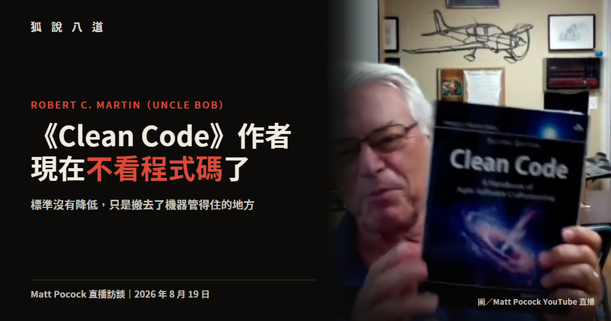

<!-- markdownlint-disable MD013 -->

# 《Clean Code》作者現在不看程式碼了，但他把規矩搬到了機器管得住的地方

圖／Matt Pocock 2026-08-19 直播訪談畫面

> 本文整理自 2026 年 8 月 19 日 Matt Pocock 對 Robert C. Martin（Uncle Bob）的直播訪談。可與前文〈[寫程式碼已經是解決的問題，Claude Code 負責人的後 AGI 計畫是釀味噌](https://www.anduril.tw/claude-code-boris/)〉對照閱讀，兩個人做了同一件事，理由完全相反。

寫了半個世紀程式、把「乾淨程式碼」四個字刻進整個軟體業腦袋裡的那個人，現在的工作目標是完全不必看程式碼。

說這話的是 Robert C. Martin，業界叫他 Uncle Bob。他 12 歲寫下第一支程式，18 歲成為職業程式設計師，《Clean Code》是他最有名的作品。8 月 19 日他穿著標誌性的浴袍上了 Matt Pocock 的直播，將近一小時裡把自己教了幾十年的東西重新排了一次序。

他的原話是「我會非常努力地把狀況弄到我完全不必看程式碼」，理由是他對程式碼很慢、agent 很快，所以他把程式碼交出去，自己顧程式碼周圍的事。

聽起來像投降，但他接下來講的每一件事，都是在說標準沒有降低，只是搬去了機器管得住的地方。

## 他先看到 agent 在鬼打牆

轉折發生在 2025 年底，他拿早期的 Grok agent 幫忙一個進行中的專案，立刻發現這東西寫完會留下一堆爛攤子。他的形容是這東西很快，卻把他自己拖慢了。

他接著改成不收拾，直接讓 agent 做下一件事，再下一件，爛攤子愈疊愈厚。然後 agent 開始變慢，改好一個地方卻弄壞另一個，回頭修那個又弄壞第三個，繞起圈子。有一次 agent 乾脆放棄了。

「它們可能很快、可能相對聰明，但它們跟人類一樣會被髒亂的程式碼影響。」他說門檻或許不同，但門檻存在，程式碼可以爛到 agent 也應付不了，然後它就開始空轉。

乾淨程式碼過去的理由是人類讀不動，現在多了第二個理由，機器也讀不動，差別只在於機器願意讀得久一點。

## 他放棄了在提示詞裡寫規矩

發現問題之後，多數人的反應是往指令檔裡塞東西，看到一個壞習慣就在 CLAUDE.md 或 AGENTS.md 加一條規則，愈加愈長。Uncle Bob 一開始也這樣，最後累積成一份五到十頁的文件。

但他觀察到模型看待這些規則的方式，用的是《神鬼奇航》那句台詞的意思，與其說是規定，不如說是參考用的建議。

他去查了原因，找到 lost in the middle 這個現象。2023 年 Nelson Liu 等七位來自史丹佛、柏克萊與 Samaya AI 的研究者發現，模型取用長脈絡時往往呈現一條 U 型曲線，最開頭跟最結尾的記得最牢，中間的顯著退化，連號稱長脈絡的模型也可能這樣。

翻成工程語言，你寫在開頭的規則只要文件夠長，它自己就會被推進中間。「也許你放在最前面的前三句還會留在優先位置，但第 50 句、第 80 句，它們沒了。」HumanLayer 創辦人 Dex Horthy 把同一件事叫做脈絡視窗的聰明區與笨蛋區，愈往後注意力愈被稀釋。

所以 Uncle Bob 的做法往兩個相反方向拉。開場提示詞砍到最短，短到有機會整段留在優先位置；所有真正不能違反的規矩全部搬出脈絡視窗，改成事後執行的確定性工具。「確定性工具不會那樣消失。」

## 二十年前太貴的兩個老東西

他搬出來的工具都是舊貨，第一個是 CRAP 分數。Alberto Savoia 跟同事 Bob Evans 在 2007 年提出，把一個函式有幾條分支、這些分支有沒有被測試蓋住兩件事揉成一個數字，數字愈高代表你動它愈危險。這個縮寫在英文裡本來就是「爛東西」的意思。

第二個是突變測試，跑一支小程式把原始碼裡的正負號、大於小於逐個翻面，每翻一次就跑一遍完整測試。語意既然被改掉，測試理應失敗，照樣通過的就是活下來的突變體，通常代表你的測試沒有真的在驗那一行的行為。

這兩樣他說自己早年都試過，也都放棄了。函式一個一個改、測試一份一份重寫，耗掉的時間他負擔不起，何況程式本來就在正常運作。突變測試的代價更高，那個專案的測試套件跑一次要 4 分鐘，他得跑好幾百次，只能丟著跑整晚。

想法一直都在，缺的是願意做這種苦工的人。

「這些傢伙很快，它們不在乎工作有多無聊，而且我叫它們做什麼它們就做什麼。」去年底他把這兩個工具丟給 agent，突變測試從整晚縮到 30 分鐘，跑完還會自己把洞補上。

## 五道關卡，一小時，換掉半天

他現在把 agent 排成一條產線，每一關只做一件事。規格員把人寫的文件轉成驗收測試跟一份 QA 流程，而且要求用人的視角寫：你正在操作這個介面，你必須證明它能動。撰寫員接手寫單元測試跟實作。清理員跑 CRAP 分析，收拾上一關的爛攤子。強化員跑突變測試，覆蓋率要 100%，他形容這一關毫不留情。最後 QA 把文件變成腳本去實際操作系統。

帳是這樣算的，一個任務交給單一 agent 五分鐘做完但結果可疑，走完這條產線要一小時，同一件事交給人大概半天。「所以我大概拿到四倍五倍的生產力提升，而且品質高很多，比人類願意投入的品質高很多。」

拆成多關還有一個副作用，任務切得愈窄，脈絡視窗就愈短，lost in the middle 的問題跟著變小，你反而能在開頭多堆幾條規則而它們真的被遵守。他還讓 agent 用完即死，下一個進來的是乾淨的脈絡。代價是每個 agent 光開機就要十幾秒，關卡之間的溝通開銷也高得誇張。

模組之間的依賴關係他也寫成一份規格檔，尾端掛一個檢查器，agent 違反了就得自己修好。他把這整套叫做讓 agent 跑迴圈，「你必須一直改，改到這個工具說可以為止」。這是拿生產力換品質，他也知道工具加太多總有一天會慢到不如人做，只是還沒找到臨界點。

## 門檻可以調，紀律不能搬

既然 agent 不是人，標準就不該原封不動照搬。他調的第一個東西是 CRAP 上限，給人類抓 4 以下，給 agent 放寬到 6，還在考慮推到 8，理由是 agent 有一個巨大而且精確的短期記憶。在覆蓋率 100% 的前提下，6 分的意思是這個函式有 6 條獨立路徑，而且每一條都有測試蓋住。

他不肯搬的是紀律，測試驅動開發他推廣了半輩子，卻明說不會強迫 agent 照做，「我不覺得讓 agent 寫一行測試、再寫一行正式程式碼、再寫下一行測試有任何意義」。對人有意義，因為人的短期記憶就那麼大，寫完測試剛好去倒杯咖啡，對 agent 沒有。他讓 agent 用 John Ousterhout 的方式做，寫完一個函式再補上它的測試。

他把這條界線劃在行為跟價值觀之間，把人類的行為紀律強加在 agent 身上大概是個錯誤，把人類的價值觀強加上去不是錯誤，但中間的門檻數字可能需要改。

## 規格驅動開發是瀑布式的鬼魂

對於現在正紅的規格驅動開發，他的判斷是那大概不會成功，理由是歷史。想把規格寫到極致再交給執行端，這個誘惑七〇年代就出現過，結果是瀑布式流程，而敏捷運動就是對它的回應。「所有這些沉重的前期規劃把一切搞得一團糟，因為最後生出來的東西跟計畫長得完全不一樣，從來都不一樣。」

換成 agent 之後誘惑一模一樣，而他那個禮拜才剛試過，結果照樣是災難。計畫訂得漂漂亮亮，agent 一跑起來才發現它們沒辦法照著跑，於是往某個荒謬的方向衝，你得喊停、退回去、重寫計畫、再重跑一次。

而且 agent 特別擅長寫計畫，「天啊它們有夠愛。它們會把計畫寫得華麗又漂亮，把各種細節都攤出來」，然後在最後崩掉。

他拿蓋房子當比喻，假設你對房子做任何更動都只要 1 美元，你會先花幾千美元請建築師畫完美的圖，還是直接跟工人說地基放這裡、廚房擺這邊，走進去發現動線很爛就把樓梯搬掉。他的判斷是改動成本既然掉到接近零，前期規劃反而變成整個流程裡最貴的一段。

規格在他手上是用完即丟的，不進版控，也不回頭引用。他接著說，人類寫的原始碼曾經就是最終的規格，現在原始碼還在，但寫的人不是我們了。

## 那新人怎麼辦

如果戰術層的活全被機器接走，沒寫過幾年程式的人要從哪裡長出戰略判斷力，這是主持人最後丟給他的問題。

他說他沒有完美答案，但第一步還是得寫程式碼，寫上一年或更久，寫到你知道 agent 每天在對付什麼。第二步是新人進公司之後應該被當成 agent 對待，帶他的資深工程師該給他跟 agent 一樣的任務，讓他過一樣的工具閘門。「你應該在那個狀態待上幾個月，生產力低得可怕，但學到的東西多得不得了。」對話裡因此冒出一個說法，你要成為 agent 的 sub-agent。

至於要學什麼，他的答案是學會認出鬼打牆。他去年底看得出問題，重點不在他看到爛程式碼，而在他看到 agent 在掙扎，而那個掙扎他認得，因為他自己走過。沒走過的人認不出來，所以他給的路徑是去讀那些沒人讀的老書，他點名 Tom DeMarco 跟 Ed Yourdon，對話裡也提到《Pragmatic Programmer》，那些教訓就是在那個年代學到的。

最後主持人把話題拉到抽象層，從二進位到組合語言、從組合語言到編譯器，現在從編譯器到模型，每爬一階，下面那一階的人都會說天要塌了。Uncle Bob 的回應是規則沒有變，所有基本功都還在，理由也還是同一套。他認為現在有一批人覺得基本功不重要了，那些人會學到教訓，而且不會花太久，因為他看過那面牆。

他形容那面牆的時候是這樣說的：「你丟掉的那些規則，一年後你會從地上撿起來，拍掉灰塵，然後想起當初為什麼需要它們。」

▶ 也可以直接在 YouTube 觀看：[https://youtu.be/zcLPGC-tvgk](https://youtu.be/zcLPGC-tvgk?ref=anduril.tw)

---

## 相關資料

- 原始影片：Matt Pocock，〈LIVE: Uncle Bob on Software Fundamentals in the Age of AI〉，2026 年 8 月 19 日
- Nelson F. Liu et al.，〈Lost in the Middle: How Language Models Use Long Contexts〉，arXiv:2307.03172，收錄於 TACL 2024
- Alberto Savoia，〈Enough About Coverage: Let's Talk About CRAP〉，Artima，2007 年 7 月 19 日
- Robert C. Martin，《Clean Code》第二版（附錄收錄與 John Ousterhout 的辯論）
- John Ousterhout，《A Philosophy of Software Design》
