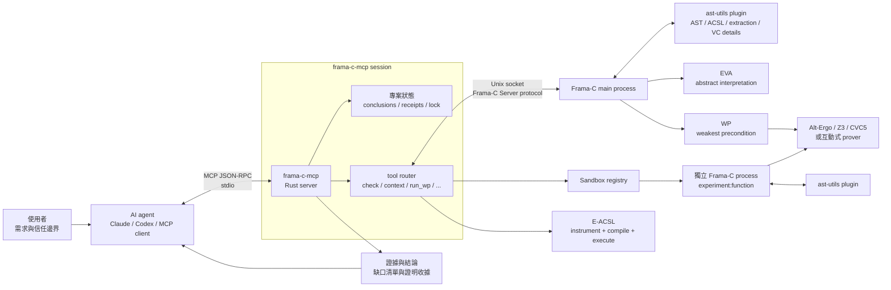
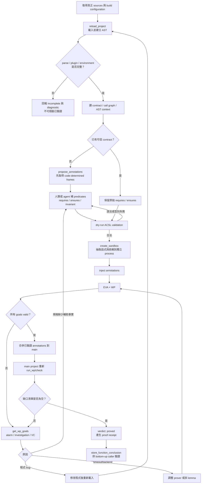
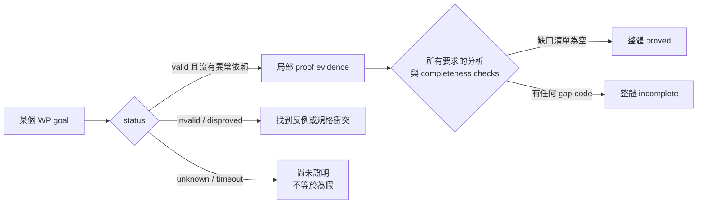
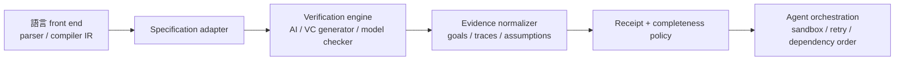
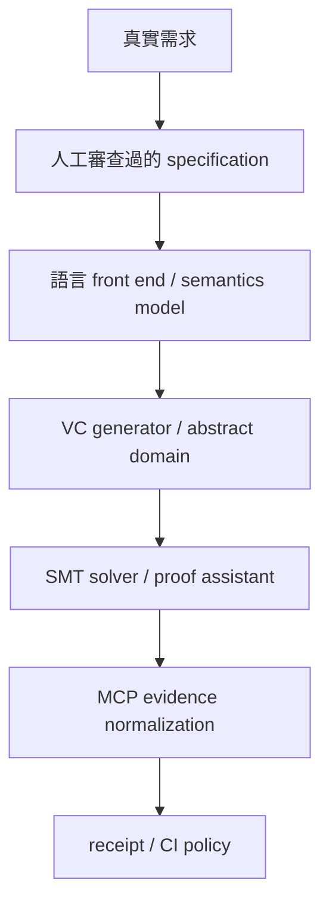

# 從規格、證據到證明：frama-c-mcp 白話指南

<!-- markdownlint-disable MD013 -->

> 資訊查核日期：2026-09-14  
> 適用範圍：`frama-c-mcp` 目前的實作，以及 C、C++、Rust、Go、Python
> 採用同類驗證流程的可行性。

## 先講結論

`frama-c-mcp` 是一個給 AI 代理程式使用的 C 程式正式驗證介面。「正式驗證」是把程式與
數學化規格轉成邏輯問題，再由分析器或證明器檢查，而不只是執行幾組測試資料。它把
[Frama-C](https://www.frama-c.com/) 的下列能力包裝成 MCP 工具：

- **ACSL**：寫在 C 程式旁的規格語言，用來描述呼叫條件、預期結果與可修改範圍。
- **annotation（註記）**：用 ACSL 寫下的規格，例如 `requires`、`ensures` 與迴圈不變量。
- **EVA**：以抽象解譯推估變數可能值與執行期錯誤，不必列舉每一個輸入。
- **WP**：把程式與 ACSL 規格轉成必須證明的邏輯命題，再交給證明器處理。
- **E-ACSL**：把可執行的 ACSL 規格轉成執行期檢查，實際執行程式以尋找違規案例。
- **MCP**：讓 AI 模型以統一協定呼叫外部工具與取得結構化結果的通訊協定。

因此，Claude、Codex 或其他 MCP 用戶端可以反覆執行：

```text
讀程式 → 寫／讀規格 → 分析風險 → 產生證明義務 → 嘗試證明
       ↑                                           ↓
       └──────── 根據未證明原因修正程式或輔助規格 ────────┘
```

它不是新的 theorem prover，也不會自動知道產品需求。真正解析與驗證 C 的是
Frama-C，Alt-Ergo、Z3、CVC5 等 solver 負責嘗試解開 WP 產生的邏輯命題；本專案負責
AI-friendly 的操作、狀態管理、隔離實驗、完整性判斷與 proof receipt。

一句最精確的描述是：

> 在指定原始碼、build configuration、machine model、ACSL specification、分析設定與
> 明列 assumptions 下，蒐集 Frama-C evidence，並判斷要求的 proof obligations 是否
> 全部成立且沒有未交代缺口。

## 閱讀前的特殊用詞速查

以下用詞會在後文反覆出現。英文會保留，是因為工具輸出、設定名稱與錯誤訊息通常使用
原文；中文解釋則用來說明它在本文扮演的角色。

| 用詞 | 白話解釋 | 不能直接推論什麼 |
| --- | --- | --- |
| Frama-C | 分析與驗證 C 程式的平台；EVA、WP、E-ACSL 都是其分析元件 | 使用 Frama-C 不代表程式自動得到完整證明 |
| formal verification（正式驗證） | 用數學模型與邏輯方法檢查程式是否符合規格 | 規格若寫錯，證明仍可能答非所問 |
| specification（規格） | 對輸入條件、輸出結果與副作用的精確約定 | 不等同於程式目前碰巧呈現的行為 |
| ACSL | C 程式的行為規格語言，全名為 ANSI/ISO C Specification Language | ACSL 本身不是分析器或證明器 |
| annotation（註記） | 附加在原始碼上的規格敘述 | 自動產生的註記不一定符合產品需求 |
| EVA | 以抽象解譯推估值域、可達性及可能的執行期警報 | 沒有警報不必然等於完整功能正確性證明 |
| abstract interpretation（抽象解譯） | 用有限的抽象值概括大量甚至無限種執行狀態 | 結果可能保守，因而產生誤報 |
| WP | 使用最弱前置條件，把程式與規格轉為驗證條件 | 產生條件不代表條件已經被證明 |
| weakest precondition（最弱前置條件） | 為保證執行後結果成立，反推執行前至少要成立的條件 | 「最弱」不表示安全要求較寬鬆 |
| proof obligation／VC | 必須證明的邏輯命題；VC 是 verification condition 的縮寫 | 單一 VC 通過不代表所有義務都通過 |
| E-ACSL | 將部分 ACSL 規格轉為可執行的執行期檢查 | 有限次執行不能取代所有輸入的靜態證明 |
| runtime check（執行期檢查） | 程式執行到特定位置時，動態檢查規格是否成立 | 沒走到的路徑仍未受檢查 |
| MCP | Model Context Protocol，AI 模型與外部工具交換請求及結果的協定 | MCP 只負責連接，不負責證明正確性 |
| JSON-RPC | 以 JSON 表示方法呼叫、參數與回應的訊息格式 | 傳輸成功不代表分析成功 |
| AST | Abstract Syntax Tree，編譯器解析原始碼後得到的樹狀結構 | AST 相同與否仍取決於前處理及編譯設定 |
| SMT solver | 檢查邏輯公式可滿足性或有效性的自動求解器，例如 Z3、CVC5 | `unknown` 不表示命題為假 |
| prover（證明器） | 嘗試證明驗證條件的自動或互動式工具 | `valid` 仍需檢查使用了哪些假設 |
| contract（契約） | 函式呼叫者與實作者之間的規格約定 | 契約本身也可能不完整或不符合需求 |
| precondition／`requires`（前置條件） | 呼叫函式前必須成立的條件 | 不能用不合理條件排除真實輸入來換取通過 |
| postcondition／`ensures`（後置條件） | 函式正常結束後必須成立的結果 | 沒寫到的功能不會自動被驗證 |
| frame condition／`assigns` | 限制函式最多可以修改哪些記憶體位置 | 只限制寫入範圍，未必描述寫入後的值 |
| loop invariant（迴圈不變量） | 進入迴圈與每輪結束時都必須保持成立的事實 | 寫下不變量不表示其初始化與保持性已證明 |
| sandbox（隔離環境） | 用獨立程序測試註記，避免失敗實驗污染主要分析狀態 | 隔離環境通過後仍要回到完整專案重驗 |
| counterexample（反例） | 能具體讓規格失敗的一組輸入或執行路徑 | 找不到反例不等於已完成數學證明 |
| proof receipt（證明收據） | 記錄來源、設定、義務、結果與雜湊的可追蹤摘要 | 不是數位簽章，也不是可獨立重播的證明項 |
| fail-closed（失敗時保守關閉） | 只要分析缺漏、逾時或狀態不明，就不宣告成功 | 不代表所有失敗都是程式錯誤 |
| `incomplete[]` | 收集未完成分析、未證明義務與未交代假設的缺口清單 | 空清單仍只涵蓋工具已知並檢查的缺口種類 |
| assumption／hypothesis（假設） | 證明過程暫時視為真的前提 | 未證明假設會縮小結論可信範圍 |
| bounded model checking（有界模型檢查） | 在指定展開次數或狀態界限內搜尋反例 | 界限內無反例通常不等於無界證明 |
| symbolic execution（符號執行） | 用符號值代表多組輸入並探索程式路徑 | 可能受路徑爆炸與逾時限制 |
| backend／adapter（後端／轉接器） | 後端執行實際分析；轉接器把不同工具結果轉成共通格式 | 統一格式不代表不同後端提供相同保證 |
| call graph（呼叫圖） | 描述哪些函式會呼叫哪些函式的關係圖 | 函式指標或動態呼叫可能讓關係不完整 |
| strongly connected component（強連通分量） | 呼叫圖中彼此可達的一組節點，常代表直接或間接遞迴 | 不能將其中函式完全拆開、各自獨立推理 |
| trusted base（可信基礎） | 證明必須先相信的編譯器、模型、工具、公理與外部規格 | 可信基礎越大，結論依賴的未驗證部分越多 |

## 為什麼需要這個專案

一般 AI code review 很擅長指出「這裡看起來可能越界」，但這只是合理推測。即使 AI 說
「看起來沒問題」，也沒有列出它究竟考慮了哪些輸入、路徑或假設。

Frama-C 有更嚴謹的分析能力，但它的專案狀態、AST、annotations、WP goals、prover
configuration 與結果不適合讓 agent 只靠零散 shell commands 操作。`frama-c-mcp` 在
兩者之間補上可反覆呼叫、可追蹤、失敗時能繼續調查的協定層。

## 系統架構



### 每一層負責什麼

| 元件 | 責任 | 不負責什麼 |
| --- | --- | --- |
| 使用者 | 提供需求、真正 build flags、目標函式，決定可接受的 specification | 不需要手動控制 Frama-C protocol |
| AI agent | 導航程式、提出輔助 annotation、讀 evidence、安排下一次驗證 | 不應擅自弱化 `requires`/`ensures` 來換綠燈 |
| Rust MCP server | tools、session、budget、receipt、sandbox、fail-closed accounting | 不自行證明 C semantics |
| `ast-utils` | AST context、ACSL injection/validation、依賴抽取、VC details | 不是獨立 solver |
| EVA | 用 abstract interpretation 推導值域、可達性與 runtime alarms | 不等同於函式完整 functional-correctness proof |
| WP | 把 C + ACSL 轉成 verification conditions | 不會替人決定 specification 應寫什麼 |
| SMT／proof assistant | 對邏輯 goals 給出 valid、unknown、timeout 等結果 | `unknown` 不代表性質為假，`valid` 仍要看 assumptions |
| E-ACSL | 將可執行 ACSL 變成 runtime checks，尋找具體違反 | 跑過有限測資不構成所有輸入的靜態證明 |

詳細模組邊界與可靠的代理程式呼叫順序，應以 `frama-c-mcp` 專案內的
`architecture.md` 與 `agent-playbook.md` 為準。

## Specification、Evidence、Proof 到底差在哪裡

### 規格（Specification）：要守的約定

Specification 描述「程式應該做到什麼」，而不是重述每一行怎麼做。C 路線使用
[ACSL](https://frama-c.com/html/acsl.html)：

| ACSL 元素 | 白話意思 | 誰要負責成立 |
| --- | --- | --- |
| `requires P` | 呼叫前 `P` 必須成立 | 每個 caller |
| `ensures Q` | 正常回傳後 `Q` 一定成立 | function implementation |
| `assigns X` | 最多只會修改 `X` | function implementation |
| `assert P` | 執行到這裡時 `P` 成立 | 到達該點的程式路徑 |
| `loop invariant I` | 進迴圈前及每輪之後 `I` 都成立 | 初始化與 loop body |
| `loop assigns X` | 每輪最多修改 `X` | loop body |
| `loop variant V` | `V` 非負且每輪嚴格下降 | loop termination proof |

`propose_annotations` 可以從 AST 抄出部分 frame facts，例如 loop 寫了哪些 locations。
但「加總的數學定義」「排序後保持 permutation」「權限檢查的產品政策」並不完整存在於
程式語法中，仍需人或 agent 撰寫並由 reviewer 確認。

### 證據（Evidence）：工具實際看見什麼

Evidence 是可供判斷的分析資料，不必然代表成功：

- source position 對應的 AST marker；
- EVA 的 before/after value sets 與 runtime alarms；
- WP 產生的 goal、status、prover、cache 狀態；
- 未證明 VC 的 hypotheses、separator 與 conclusion；
- caller/callee contracts、assumed dependencies；
- parser diagnostics、timeout、unmodeled header；
- E-ACSL 執行時的具體 counterexample；
- 本次驗證的 proof receipt。

好 evidence 必須能回答：「哪個檔案、哪個函式、哪一個 goal、在什麼環境、依賴哪些
假設，得到什麼結果？」只有一句「solver passed」是不夠的。

### 證明（Proof）：所有要求的義務都成立

WP 使用 weakest-precondition calculus，把 specification 倒推成執行前必須成立的邏輯
公式。外部 prover 再判斷這些 formulas 是否有效。

例如要證明 `ensures \result >= 0`，WP 不是執行幾個測資，而是根據每條控制流程推導：

```text
對所有滿足 requires 的輸入 n，
如果 C 運算、memory model 與列出的 assumptions 成立，
則每一條會正常回傳的路徑都滿足 result >= 0。
```

本專案只有在要求的分析完成、goals 有效，而且 `incomplete[]` 為空時，才把整體 verdict
稱為 `proved`。這就是 fail-closed：沒跑、沒看完、timeout 或倚賴未證明假設，都不能
被「沒有報錯」包裝成成功。

### 證明收據（Proof receipt）：這份證明針對哪個執行環境

每次 `check`／`run_wp` 的 receipt 會綁定：

- 每個 source file 的 SHA-256 與整體 `source_hash`；
- 正規化 AST 的 `ast_digest`；
- include paths、system include paths、defines、forced includes、machdep；
- function scope 與 contracts；
- 有效 EVA/WP configuration；
- prover environment 與 per-goal statuses；
- `incomplete[]` 的 count、codes 與 digest；
- 整份內容的 SHA-256。

所以「同一份 C 文字但 `-DNDEBUG` 不同」仍是不同驗證條件；source 或 AST 改變，也不能
拿舊 receipt 冒充現在的證據。實作入口位於 `frama-c-mcp` 專案內的
`src/mcp/receipt.rs`。

receipt 是可重算、可比較的驗證紀錄，不是第三方數位簽章，也不是 Coq/Rocq kernel 可
獨立重播的 proof term。它證明「這個 session 回報過哪些 evidence」，不憑空提高底層
solver 或 memory model 的可信度。

## 完整驗證流程



### 為什麼要 sandbox

錯誤 invariant 可能讓 WP 卡住，也可能污染同一個 Frama-C process 的 state。sandbox 會把
目標函式、型別、globals 與 callee dependencies 抽成暫存 C 檔，啟動獨立 Frama-C
process。實驗失敗即可刪除重建；成功後再明確 merge 回 main，最後仍需在完整 project
重新證明。

### 為什麼要 bottom-up

caller 通常使用 callee contract，而不是展開 callee body。若 callee 尚未證明，caller
的綠色結果可能建立在「先相信 callee」上。因此 `verify_program_step` 依 call graph 讓
callee 優先，保存 conclusion，再驗證 caller；遞迴 strongly connected component 則需
當成群組處理。

## 一個具體 C／ACSL 範例

以下函式計算前 `n` 個非負整數的總和。為了讓範例集中在 proof structure，先排除
machine integer overflow；實務上還要補足能保證總和不超過 `INT_MAX` 的 bound。

```c
/*@
  requires n >= 0;
  requires \valid_read(a + (0 .. n - 1));
  requires \forall integer k; 0 <= k < n ==> a[k] >= 0;
  assigns \nothing;
  ensures \result >= 0;
*/
int sum_nonnegative(const int *a, int n)
{
    int total = 0;

    /*@
      loop invariant 0 <= i <= n;
      loop invariant total >= 0;
      loop assigns i, total;
      loop variant n - i;
    */
    for (int i = 0; i < n; ++i)
        total += a[i];

    return total;
}
```

### 規格如何分工

1. `n >= 0` 排除負長度。
2. `\valid_read(...)` 保證每次 `a[i]` 都可讀。
3. quantified `requires` 保證每個元素非負。
4. `assigns \nothing` 表示不改動 caller 可觀察的 memory；local variables 不必列入
   function frame。
5. `ensures` 是目標：回傳值非負。
6. `0 <= i <= n` 把 array-bound fact 帶過 loop boundary。
7. `total >= 0` 把 postcondition 所需的中間事實帶到 loop exit。
8. `n - i` 用來證明終止。

### WP 大致會產生哪些 obligations

```text
Loop invariant initialization:
  requires  ==>  0 <= 0 <= n  且  total(0) >= 0

Loop invariant preservation:
  invariant 且 i < n 且 element assumptions
  ==> 執行 total += a[i], i++ 後 invariant 仍成立

Memory safety:
  0 <= i < n 且 valid_read(a[0 .. n-1])
  ==> a[i] 可讀

Loop variant:
  n - i >= 0，而且下一輪嚴格下降

Postcondition:
  invariant 且 !(i < n)
  ==> total >= 0
```

如果拿掉 `total >= 0` invariant，函式直覺上仍然正確，但 WP 在 loop exit 未必保有足夠
關係推出 postcondition。這叫「缺少 proof hint」，不一定是程式 bug。

反過來，如果程式實際會 overflow，加入一條不真的成立的 invariant 也不能正當修復；
它自己的 initialization/preservation obligations 應該失敗。正確處理是限制 `n`／元素
大小、改用更寬型別，或改寫程式。

## 如何讀取成功、失敗與不完整



常見阻擋項目：

| `incomplete[]` code | 白話解釋 | 通常下一步 |
| --- | --- | --- |
| `EVA_NOT_RUN` / `WP_NOT_RUN` | 分析根本沒完成 | 先排除啟動、parse、budget 問題 |
| `ALARM_NOT_VALID` | runtime safety alarm 尚未排除 | 查值域、pointer validity、overflow |
| `GOAL_NOT_VALID` | WP obligation 未證明 | 讀 VC，而不是只看 goal 名稱 |
| `PROVER_TIMEOUT` | 時間內沒有結論 | 拆 proof、補 invariant、換 prover；不可當成功 |
| `VALID_UNDER_HYP` | 綠燈依賴未建立的 hypothesis | 找到並證明上游 assumption |
| `ASSUMED_CALLEE_CONTRACT` | 使用了尚未證明的 callee contract | 先驗證 callee |
| `ASSUMED_VALID` | 性質由 axiom 宣告而非證明 | 移除或明列 trusted base |
| `PROPERTY_DEAD` | 性質只在不可達程式上成立 | 檢查 requires 是否排除了真實使用情境 |
| `PROPERTY_VACUOUS` | hypotheses 不可滿足，proof 空泛成立 | 執行 smoke/vacuity checks，修正 contract |
| `UNCONSTRAINED_ASSIGNS` | 允許寫入卻沒描述寫入結果 | 加 postcondition 或縮小 frame |
| `WP_MEMORY_MODEL_HYPOTHESIS` | proof 倚賴未由 caller 檢查的 separation | 寫進 `requires`，讓 callers 逐一證明 |
| `INDIRECT_CALL_UNRESOLVED` | function pointer 的 callee set 不明 | 加 calls/target constraints 或縮小範圍 |

完整的代碼詞彙位於 `frama-c-mcp` 專案內的 `src/mcp/checkgaps.rs`，ACSL 修正指引則見
該專案的 `writing-acsl.md`。

## 這套方法能不能用在其他語言

可以沿用「方法」，但不能直接沿用目前「實作」。這套方法需要五個可替換介面：



`frama-c-mcp` 現在的 front end、spec adapter 與 engine 都是 C-specific：Frama-C AST、
ACSL、EVA/WP、`ast-utils` requests。因此把 `.rs`、`.go` 或 `.py` 路徑交給現有 server
不會自動變成對應語言的 proof。要支援其他語言，應保留 orchestration、evidence schema、
fail-closed 與 receipt 思路，再為每種 verifier 實作 adapter。

## C、C++、Rust、Go、Python 比較

| 語言 | 現有專案可直接用？ | Specification 例子 | 可行工具鏈 | 主要 evidence / 保證 | 主要限制 |
| --- | --- | --- | --- | --- | --- |
| C | **可以，原生目標** | ACSL `requires`、`ensures`、`assigns`、invariant | Frama-C EVA/WP/E-ACSL；亦可另用 CBMC | abstract interpretation alarms、VC、SMT verdict、runtime violations、receipt；可做 unbounded deductive verification，但相對於 models/assumptions | C front-end、headers、inline asm、function pointers、memory model 與 specs 完整度 |
| C++ | **不直接支援** | ACSL++ 或 assertions/harnesses | Frama-Clang + ACSL++；CBMC/ESBMC 類 bounded model checking | Frama-Clang 路線接近 ACSL/WP；CBMC 常提供 property result 與 counterexample trace | Frama-Clang 主力仍偏 C++11，templates/STL/部分 ACSL++ 支援有限；bounded proof 只涵蓋給定展開界限／環境模型 |
| Rust | **不直接支援** | tool attributes/macros、pre/postconditions、proof functions、harnesses | Kani；Creusot + Why3；Verus；Prusti/Viper | Kani bit-precise bounded model checking；Creusot/Verus/Prusti 是 SMT-based deductive verification 路線 | 每套工具支援的 Rust subset、`unsafe`、traits、concurrency、stdlib model 與成熟度不同；不能因 Rust 型別安全就宣稱 functional correctness |
| Go | **不直接支援** | Gobra pre/postconditions、permissions、loop invariants | Gobra → Viper → SMT | memory/crash safety、data-race freedom、partial correctness與 source-level failed assertions | 支援 Go 的大型 subset 而非保證所有語言／runtime／library features；annotations 與 dependency specs 成本高 |
| Python | **不直接支援** | type hints + PEP 316、icontract、deal，或 Nagini specs | CrossHair + Z3；Nagini → Viper | CrossHair 擅長 symbolic path exploration 與 concrete counterexamples；Nagini較接近 modular deductive verification | 動態語言、native extensions、reflection、I/O、monkey patching 與 path explosion 使完整 coverage 困難；CrossHair timeout/no counterexample 不等於一般性的完整 proof |

### C：最適合直接使用本專案

Frama-C 官方將 ACSL 定位為 C 的 formal behavioral specification language；WP 用 Hoare-style
weakest preconditions 證明 ACSL properties，EVA 也可對 properties 與 runtime safety
提供分析結果。這正是本 repository 已實作的路徑。

適合：embedded、driver、parser、crypto primitives、memory-sensitive libraries，以及希望把
proof progress 接進 agent workflow／CI 的 C 專案。

### C++：概念接近，但工程風險高於 C

Frama-C 生態有 Frama-Clang 與 ACSL++，所以在受控 C++ subset 上，可以建立很接近本文的
流程。然而官方 manual 列出的限制包含 C++ feature coverage、templates robustness、標準庫
specifications 與部分 ACSL++ constructs；不能因為底層仍是 Frama-C 就假定任意現代 C++
專案可直接處理。

另一條路是 [CBMC](https://www.cprover.org/cbmc/) 類 bounded model checking。它對 C/C++
assertions、memory safety 與有限 loop unwind 很實用，並能給 counterexample trace。但結論
通常是「在這個 bound 與模型內找不到反例」，除非同時能證明 unwinding assertions／完整
涵蓋，否則不能改寫成 unbounded correctness proof。

建議：

- C-like、少 templates 的 C++ subset：評估 Frama-Clang/ACSL++。
- 需要快速找低階 bug、可設定明確 bounds：優先 CBMC/ESBMC adapter。
- 重度 templates、exceptions、coroutines、完整 STL：先做 capability probe，不能預設可驗證。

### Rust：工具選擇最多，但保證類型不同

- [Kani](https://model-checking.github.io/kani/) 是 bit-precise Rust model checker，使用 proof
  harnesses，擅長 panic、overflow、unsafe interaction 與 bounded state spaces。
- [Creusot](https://creusot.rs/) 把 annotated Rust 轉為 Why3 的中間驗證語言並產生 VCs，
  很接近 ACSL/WP 的 deductive workflow。
- [Verus](https://verus-lang.github.io/verus/guide/) 提供 specifications 與 proof language，
  以 SMT 靜態驗證 executable Rust 對所有符合模型的執行滿足使用者規格。
- [Prusti](https://viperproject.github.io/prusti-dev/user-guide/) 基於 Viper，支援 contracts、
  predicates 與 loop invariants；官方文件也明列預設及 partial-correctness 邊界。

Rust compiler 已提供 memory/type safety 的強大基線，但它不證明「排序真的排序」「餘額永不
變負」「協定狀態機符合需求」。這些仍需要 specifications 與對應 verifier。

若要做 Rust 版 MCP：Kani adapter 適合先做 counterexample-oriented MVP；Creusot 或 Verus
adapter 更接近本專案的 specification/VC/proof/receipt 主軸。

### Go：Gobra 最接近此專案的 deductive 路線

[Gobra](https://github.com/viperproject/gobra) 是 Go 的 modular verifier，將 annotated Go
翻譯到 Viper，再用 SMT backend 驗證。官方 tutorial 描述的目標包含 memory safety、crash
safety、data-race freedom，以及依使用者規格的 partial correctness。

它與此專案很容易建立概念映射：

| frama-c-mcp / C | Go adapter |
| --- | --- |
| ACSL contract | Gobra contract / permissions |
| WP VC | Viper verification obligation |
| WP failed goal | Gobra source-level failed assertion |
| callee contract dependency | imported package/interface specifications |
| proof receipt | source/module/tool/config/obligation digest |

困難在於 Go runtime、goroutines、channels、interfaces 與第三方 package specifications。Gobra
能處理並行推理不代表不寫 permissions/invariants 就會自動證明任意 production service。

### Python：最適合先從「找反例」開始

[CrossHair](https://crosshair.readthedocs.io/) 會用帶有 Z3 expressions 的 symbolic objects
實際呼叫 Python functions，探索路徑，支援 `assert`、PEP 316、icontract 與 deal。它非常
適合以下 agent loop：

```text
加入 contract → symbolic exploration → 回傳具體 counterexample
              → 修程式／contract → 重跑
```

但 Python 的動態行為與 native extensions 讓完整建模困難。CrossHair 自身也把定位描述為
介於 testing 與 type systems 的分析工具；timeout 或沒找到 counterexample，不能普遍解讀成
所有 Python executions 的 theorem。

[Nagini](https://github.com/marcoeilers/nagini) 是基於 Viper 的 statically typed Python
modular verifier，更接近 deductive verification，但適用 subset、annotations 與維護狀態都
需要在採用前做 capability probe。

建議 Python adapter 把結果分成：

- `counterexample_found`：強 evidence，帶具體輸入與 trace；
- `bounded_or_timed_search_clear`：指定 budget 內未找到；
- `unsupported_semantics`：native/side-effect/dynamic feature 未建模；
- `deductively_verified`：只能由明確具有此語意的 backend 產生。

不要把前兩者標成 `proved`。

## 跨語言共用的 MCP 架構建議

如果未來把這個專案擴充成多語言 verification MCP，建議不要把所有 backend 硬塞進相同
`valid/invalid` 字串。應共用外框、保留 backend semantics：

```text
VerificationSubject
  language, files, source_hash, build_identity, target

SpecificationSet
  language, syntax, clauses, trusted_clauses, spec_hash

Obligation
  stable_id, owner, kind, source_span, formula?, dependencies

Evidence
  backend, backend_version, method
  status, assumptions, bounds, timeout, counterexample?, from_cache

Completeness
  requested_analyses, completed_analyses, unsupported_features, gaps[]

Receipt
  subject + specification + toolchain + obligations + completeness + sha256
```

其中 `method` 至少區分：

- `abstract_interpretation`
- `deductive_verification`
- `bounded_model_checking`
- `symbolic_execution`
- `runtime_contract_checking`
- `proof_assistant_checked`

同一個 `status: valid` 在不同 method 下不是相同承諾。receipt 必須帶 bounds、unwind
completeness、unsupported features、trusted axioms、solver result 和 cache provenance。

## 建議的導入順序

### 只驗證 C

直接延伸目前專案：

1. 保存真實 compile database／preprocessor configuration。
2. 由安全性關鍵且依賴少的 leaf functions 開始。
3. 先建立 frame 與 runtime-safety specification。
4. 再加入 functional postconditions 與 loop invariants。
5. CI 使用 fail-closed verdict、goal floor 與 receipt freshness。
6. 對外部函式、axioms 與未證明 callee 建 trusted-base inventory。

### 多語言但先求實用

按「最容易得到有用 evidence」排序：

1. C：既有 Frama-C backend。
2. Rust：先接 Kani counterexamples，再視需求接 Creusot／Verus。
3. Python：CrossHair counterexample workflow，但禁止把 search-clear 寫成 proof。
4. Go：Gobra，適合願意投入 permissions/contracts 的關鍵 library。
5. C++：先限定受支援 subset；依需求選 Frama-Clang 或 bounded model checker。

### 多語言且要求一致 proof governance

先定義 backend-neutral receipt schema、completeness taxonomy 與 trust policy，再寫 adapters。
真正需要共用的是「不完整不能冒充成功」與「結論必須綁定 source/spec/toolchain」，不是要求
所有語言都回傳看似一致但語意不同的 `proved`。

## 這個專案證明了什麼、沒有證明什麼

### 能合理宣稱

- 對 receipt 指定的 source、AST、configuration 與 specification，列出的 WP obligations
  得到了列出的 prover statuses。
- `verdict: proved` 且 `incomplete[]` 為空時，本 server 沒有發現其已知 completeness gaps。
- EVA alarms、VC hypotheses、counterexamples 與 dependency assumptions 可被 agent 進一步調查。
- receipt hash 能偵測內容差異並支援 session 內比較。

### 不能單靠它宣稱

- specification 等同真正產品需求；
- compiler、Frama-C、plugin、solver 或硬體完全沒有 bug；
- 未建模的 OS、I/O、assembly、foreign code 或 concurrency 行為正確；
- `unknown`／timeout 代表程式錯誤；
- 有限 runtime tests 沒失敗就代表所有輸入正確；
- bounded model checker 在某個 bound 沒找到反例就代表 unbounded proof；
- hash receipt 是第三方簽章或 independently checkable proof term；
- 現有 `frama-c-mcp` 可以直接分析 C++、Rust、Go 或 Python。

## 信任邊界

最後一個實務問題不是「proof 是不是數學」，而是「你相信哪一層」：



自動 proof 最常見的失敗不是 solver 算錯，而是 specification 太弱、precondition 排除了真正
輸入、build identity 不符、callee／library models 被默認信任，或 analysis 根本沒完整跑完。
因此本專案最有價值的設計不只是「能呼叫 WP」，而是把 assumptions、`incomplete[]`、
source identity 與 proof receipt 一起帶回來。

## 參考資料

### 官方與原始資料

- [Frama-C：ACSL](https://frama-c.com/html/acsl.html)
- [Frama-C documentation](https://www.frama-c.com/html/documentation.html)
- [Frama-Clang user manual](https://www.frama-c.com/download/frama-clang-manual-0.0.8.pdf)
- [CBMC](https://www.cprover.org/cbmc/)
- [Kani Rust Verifier](https://model-checking.github.io/kani/)
- [Creusot](https://creusot.rs/)
- [Verus tutorial and reference](https://verus-lang.github.io/verus/guide/)
- [Prusti user guide](https://viperproject.github.io/prusti-dev/user-guide/)
- [Gobra repository and tutorial](https://github.com/viperproject/gobra)
- [Viper tutorial](https://viper.ethz.ch/tutorial/)
- [CrossHair documentation](https://crosshair.readthedocs.io/)
- [Nagini repository](https://github.com/marcoeilers/nagini)
