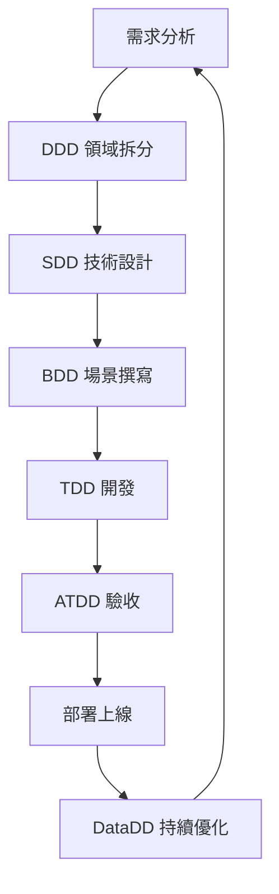

# 軟體開發方法論完整指南（XXDD 系列）

> 2026 年軟體工程實踐趨勢 - AI Agent 應用專題

---

## 📋 目錄

1. [方法論總覽](#方法論總覽)
2. [白話版快速理解](#白話版快速理解)
3. [SDD 與 BDD 的先後順序與協作關係](#sdd-與-bdd-的先後順序與協作關係)
4. [AI Agent 實戰應用](#ai-agent-實戰應用)
5. [完整開發流程](#完整開發流程)
6. [實戰建議與常見誤區](#實戰建議與常見誤區)

---

## 方法論總覽

### 完整對照表

| 分類 | 方法論 | 全稱 | 核心概念 | 適用場景 |
|------|--------|------|----------|----------|
| **需求與溝通** | BDD | Behavior-Driven Development | 使用自然語言（Given/When/Then）描述使用者行為，消除溝通隔閡 | 跨部門協作（PM、QA、開發） |
| **需求與溝通** | ATDD | Acceptance Test-Driven Development | 在開發前定義「驗收標準」，確保產出即客戶所需 | 外部專案交付、需求驗收 |
| **架構與設計** | DDD | Domain-Driven Design | 以「業務領域」為核心建模，劃分限界上下文（Bounded Context） | 中大型複雜系統、微服務架構 |
| **架構與設計** | SDD | Solution Design Document | 在開發前撰寫詳細的技術解決方案設計文件（API、DB、流程） | 團隊技術同步、大型架構變動 |
| **架構與設計** | MDD | Model-Driven Development | 透過圖形化模型（如 UML）或視覺化工具自動生成程式碼 | 低程式碼平台、工業自動化 |
| **品質與開發** | TDD | Test-Driven Development | 先寫失敗的測試，再寫功能程式碼，最後重構（紅-綠-重構） | 核心邏輯開發、底層 API 撰寫 |
| **品質與開發** | FDD | Feature-Driven Development | 以「小功能點」為單位進行快速迭代與進度回報 | 團隊人數多、強調進度透明的專案 |
| **維運與數據** | DataDD | Data-Driven Development | 根據數據分析結果來決定開發的優先順序與功能走向 | 產品優化、電商或社群平台 |

---

## 白話版快速理解

### 各方法論的本質

| 方法論 | 一句話說明 | 就像是... | 解決什麼問題 |
|--------|-----------|-----------|-------------|
| **BDD** | 用「人話」寫測試，大家都看得懂 | 寫劇本：「當用戶按下登入，應該要看到歡迎訊息」 | 做對的事 |
| **ATDD** | 客戶說要什麼，就先寫驗收標準 | 驗屋：交屋前就列好檢查清單 | 做對的事 |
| **DDD** | 把複雜業務拆成一塊塊領域來管理 | 城市規劃：金融區、住宅區各管各的 | 複雜業務管理 |
| **TDD** | 先寫會失敗的測試，再寫程式讓它過 | 先出題目，再寫答案 | 把事做對 |
| **SDD** | 開工前先畫設計圖 | 建築藍圖：標明鋼筋、水電怎麼配 | 把事做對 |
| **FDD** | 切成小功能，一個個快速做完 | 樂高積木：一塊塊組裝，隨時可展示 | 進度透明化 |
| **DataDD** | 用數據決定要做什麼 | 看銷售數據決定進貨品項 | 優先順序決策 |

### 核心價值總結

- **BDD/ATDD**：解決「做對的事」（Do the right thing）的問題
- **TDD/SDD**：解決「把事做對」（Do the thing right）的問題
- **DDD**：解決「複雜業務邏輯」的管理問題
- **DataDD**：解決「持續優化」的問題

---

## SDD 與 BDD 的先後順序與協作關係 🔄

### 核心問題：要先寫 SDD 還是 BDD？

**答案**：理想上**先 BDD 後 SDD**，但實務上會**並行迭代**！

---

### 理想的執行順序

```
階段 1: BDD (行為定義) → 階段 2: SDD (技術設計) → 階段 3: BDD (場景細化)
         ↓                        ↓                        ↓
    「要做什麼」                「怎麼做」              「驗證細節」
```

---

### 為什麼是這個順序？

#### 階段 1：先寫 BDD（高層次場景）

**目的**：確認「做對的事」

```gherkin
Feature: 用戶登入系統

  Scenario: 成功登入
    Given 用戶輸入正確的帳號密碼
    When 點擊登入按鈕
    Then 應該看到個人首頁
```

**此時重點**：
- ✅ 業務需求是什麼
- ✅ 用戶期望什麼行為
- ✅ 驗收標準是什麼
- ❌ 還不考慮技術細節

**產出物**：
- BDD 場景檔案（.feature）
- 用戶故事（User Story）
- 驗收標準清單

---

#### 階段 2：再寫 SDD（技術設計）

**目的**：根據 BDD 場景，設計技術方案

```markdown
## SDD - 登入功能技術設計

### API 設計
- POST /api/v1/auth/login
- Request: { "username": "string", "password": "string" }
- Response: { "token": "jwt_token", "user": {...} }

### 資料庫設計
- Table: users
- Columns: id, username, password_hash, created_at

### 技術選型
- 密碼加密: bcrypt
- Token: JWT (過期時間 24 小時)
- Session 儲存: Redis

### 流程圖
[用戶] → [API Gateway] → [Auth Service] → [Database]
                ↓
            [Redis Cache]
```

**此時重點**：
- ✅ 用什麼技術實作
- ✅ API 格式怎麼設計
- ✅ 資料結構如何規劃
- ✅ 效能與安全性考量

**產出物**：
- 技術設計文件（SDD.md）
- API 規格（OpenAPI/Swagger）
- 架構圖（系統、部署、流程圖）
- 資料庫 Schema

---

#### 階段 3：回來細化 BDD（技術細節場景）

**目的**：補充技術層面的測試場景

```gherkin
Feature: 登入 API 技術驗證

  Scenario: JWT Token 格式驗證
    Given 用戶成功登入
    When 系統回傳 Token
    Then Token 應該符合 JWT 標準
    And Token 包含 user_id 和 exp 欄位
    And Token 過期時間為 24 小時後
    
  Scenario: 密碼錯誤次數限制
    Given 用戶連續輸入錯誤密碼 5 次
    When 第 5 次登入失敗
    Then 帳號應該被鎖定 15 分鐘
    And 系統記錄安全事件到日誌
    And 發送警告郵件給用戶
    
  Scenario: Session 過期處理
    Given 用戶的 Token 已過期
    When 用戶嘗試存取需要認證的資源
    Then 系統返回 401 Unauthorized
    And 提示「請重新登入」
```

**產出物**：
- 完整的 BDD 場景檔案
- 邊界條件測試
- 異常處理場景
- 效能測試場景

---

### 實務上的互動關係

#### 迭代循環（Agile 開發）

```
Sprint Planning
    ↓
[1] 產品經理寫 BDD 高層場景
    「用戶要能登入系統」
    ↓
[2] 架構師看 BDD → 寫 SDD 技術設計
    「決定用 JWT、bcrypt、Redis」
    ↓
[3] 開發者看 SDD → 補充 BDD 技術場景
    「Token 格式、過期處理、錯誤次數」
    ↓
[4] 三方討論調整 → BDD & SDD 都更新
    「發現 Redis 成本高，改用 In-Memory Cache」
    ↓
[5] 開始 TDD 開發
    「紅-綠-重構循環」
```

---

### 三種常見的執行模式

#### 模式 A：瀑布式（❌ 不推薦）

```
BDD (100% 完成) → SDD (100% 完成) → 開發
```

**問題**：
- ❌ 發現技術限制時，BDD 已經定死
- ❌ 缺乏彈性，無法應對變化
- ❌ 返工成本高

**適用場景**：
- 需求非常明確且不會變的專案（罕見）
- 政府標案等嚴格規範的專案

---

#### 模式 B：並行式（✅ 強烈推薦）

```
BDD (核心場景 60%) ⟷ SDD (架構設計 60%)
         ↓                    ↓
   補充細節 (30%)  ⟷    技術細化 (30%)
         ↓                    ↓
   邊界案例 (10%)  ⟷    效能優化 (10%)
```

**優點**：
- ✅ 靈活調整，及早發現問題
- ✅ 團隊協作順暢
- ✅ 降低返工風險
- ✅ 符合敏捷精神

**執行方式**：
1. **Week 1**：BDD 寫主要場景，SDD 畫大架構
2. **Week 2**：BDD 加細節，SDD 補技術規格
3. **Week 3+**：邊開發邊調整兩份文件

**適用場景**：
- ✅ 大部分的軟體專案
- ✅ 需求會持續調整的專案
- ✅ 團隊規模 3 人以上

---

#### 模式 C：技術驅動（⚠️ 特殊情況）

```
SDD (技術可行性驗證) → BDD (根據技術限制調整場景)
```

**適用場景**：
- 🔬 技術 POC 專案
- 🧪 新技術導入評估
- ⚡ 效能要求極高的系統
- 🏭 硬體限制明確的專案

**範例**：
> 「我們要做即時語音翻譯，但發現現有技術延遲 > 3 秒，  
> 所以 BDD 場景要調整為『接受 3 秒延遲』而非『即時』」

**執行方式**：
1. 先做技術 POC 驗證可行性
2. 根據技術限制定義 BDD 場景
3. 確保 BDD 的期望在技術可達範圍內

---

### 實際案例對比

#### ✅ 案例 1：先 BDD 後 SDD（正確）

**需求**：AI 客服要能自動回答常見問題

**BDD 場景（先寫）**：
```gherkin
Feature: AI 客服自動回答

  Scenario: 自動回答運費問題
    Given 用戶問「運費怎麼算」
    When AI 識別到運費意圖
    Then 回答「訂單滿 500 免運，未滿收 60 元」
    And 回應時間少於 2 秒
    
  Scenario: 自動回答退貨問題
    Given 用戶問「如何退貨」
    When AI 識別到退貨意圖
    Then 回答退貨流程說明
    And 提供退貨申請連結
```

**SDD 設計（後寫）**：
```markdown
## AI 客服技術設計

### 意圖識別
- 模型：BERT-base-chinese
- 訓練資料：1000+ 標註對話
- 準確率目標：> 90%

### FAQ 儲存
- Vector Database: Pinecone
- Embedding Model: text-embedding-ada-002
- 相似度閾值：0.8

### 回應策略
- 相似度 > 0.8：自動回答
- 0.6 < 相似度 < 0.8：提供建議並轉人工
- 相似度 < 0.6：直接轉人工

### 效能指標
- 回應時間：< 2s (P95)
- 並發處理：100 QPS
```

**結果**：✅ 技術方案完全支援業務需求，開發順利

---

#### ❌ 案例 2：先 SDD 後 BDD（有風險）

**SDD 設計（先寫）**：
```markdown
## AI 對話系統技術設計

### 核心技術
- 模型：GPT-3.5-turbo
- API：OpenAI API
- 成本：$0.002 / 1K tokens

### 架構設計
- 每次對話呼叫 OpenAI API
- 回應時間：1-2 秒
- 無本地快取
```

**BDD 場景（後寫）**：
```gherkin
Feature: 高並發對話處理

  Scenario: 尖峰時段處理
    Given 同時有 10,000 用戶提問
    When 系統處理所有請求
    Then 所有用戶應在 2 秒內收到回應
    And 系統穩定運行不當機
```

**問題發現**：
- ❌ 10,000 次 × $0.002 = **$20 美金/次**
- ❌ 尖峰時段一天可能發生 10 次 = **$200/天**
- ❌ 月成本：**$6,000** （可能爆表！）
- ❌ OpenAI API 有 Rate Limit，無法支援 10,000 QPS

**解決方案**：
```markdown
## 重新設計 SDD

### 混合架構
- 常見問題：本地 BERT 模型（免費）
- 複雜問題：GPT-3.5（付費）
- 預估：70% 用本地，30% 用 API

### 成本優化
- 原方案：$6,000/月
- 新方案：$1,800/月（節省 70%）
```

**結果**：❌ 需要返工重新設計，浪費 2 週時間

**教訓**：應該先確認業務需求（高並發、成本限制），再選技術方案

---

### 不同專案規模的執行建議

#### 小型專案（1-3 人，1-2 週）

**時程安排**：
```
Day 1: 
  上午 (2hr)：團隊討論 BDD 主場景 (3-5 個)
  下午 (2hr)：架構師快速寫 SDD (簡化版)
  
Day 2-3:
  開發時邊補充 BDD 細節，邊調整 SDD
  使用 Google Doc 即時協作
```

**文件規模**：
- BDD：5-10 個場景
- SDD：2-3 頁 A4

**工具推薦**：
- BDD：直接寫 Markdown
- SDD：Google Doc / Notion

---

#### 中型專案（4-10 人，1-3 個月）

**時程安排**：
```
Week 1:
  - PM 撰寫 BDD 場景 (主流程)
  - 架構師撰寫 SDD (架構設計)
  - 每日站會同步進度 (15 min)

Week 2:
  - 開發者看 SDD 補充 BDD 技術場景
  - 三方 Review Meeting (2 hr)
  - 確認 BDD & SDD 一致性

Week 3+:
  - 開始 TDD 開發
  - 持續更新 BDD & SDD
  - 每週 Refinement Meeting
```

**文件規模**：
- BDD：20-50 個場景
- SDD：10-20 頁，包含圖表

**工具推薦**：
- BDD：Cucumber / SpecFlow
- SDD：Confluence / Notion
- 協作：Jira 關聯文件

---

#### 大型專案（10+ 人，3+ 個月）

**時程安排**：
```
Sprint 0 (準備期 - 2 週):
  - 產品經理：BDD 場景初稿 (Epic 層級)
  - 架構師：SDD 架構設計 (High-level)
  - 技術主管：技術可行性評估
  - 全員：Kickoff Meeting 對齊理解

Sprint 1-N (開發期):
  - BDD & SDD 並行細化
  - 每週 Refinement Meeting (2 hr)
  - 每兩週 Architecture Review (1 hr)
  - 文件版本控制（Git）

持續整個專案:
  - BDD & SDD 同步更新
  - 使用 ADR (Architecture Decision Record)
  - 定期文件審查
```

**文件規模**：
- BDD：100+ 個場景，多個 Feature
- SDD：50+ 頁，分模組撰寫

**工具推薦**：
- BDD：Cucumber + CI/CD 整合
- SDD：Confluence + PlantUML
- 版本控制：Git (docs/ 目錄)
- 協作：Jira + Confluence 雙向連結

---

### 協作的核心原則

#### 原則 1：先有業務需求（BDD），再談技術方案（SDD）

**❌ 錯誤範例**：
```
架構師：「我們用 Kubernetes 部署！」
PM：「為什麼？」
架構師：「因為很潮啊！」
```

**✅ 正確範例**：
```
PM：「我們需要支援 100 萬並發用戶」（BDD 需求）
架構師：「那我們用 K8s 做水平擴展」（SDD 方案）
PM：「預算只有 10 萬/月」（BDD 限制）
架構師：「那改用 Auto Scaling + Serverless」（SDD 調整）
```

**原則**：
- BDD 定義「目標」（what）
- SDD 提供「手段」（how）
- 目標不變，手段可調整

---

#### 原則 2：BDD 和 SDD 要持續對齊

**對齊機制**：

```
BDD 改了 → 檢查 SDD 是否需要調整
SDD 改了 → 檢查 BDD 是否需要更新

範例：
BDD 新增：「支援第三方登入（Google、Facebook）」
→ SDD 要補充：OAuth 2.0 整合設計

SDD 調整：「因成本考量，Redis 改用 In-Memory Cache」
→ BDD 要更新：「系統重啟會登出所有用戶」
```

**工具輔助**：
- **Jira**：關聯 BDD Feature 和 SDD Document
- **Confluence**：用雙向連結 (Backlinks)
- **Git**：使用分支關聯
  ```
  feature/user-login (BDD 場景)
  docs/user-login-sdd (SDD 文件)
  ```

**定期檢查**：
- 每日站會：快速確認一致性
- 每週 Refinement：深入檢查對齊
- Sprint Review：展示 BDD + SDD 完整性

---

#### 原則 3：文件是活的，持續演進

**版本控制範例**：

```
v0.1 → 草稿（抓大方向）
       - BDD：主要場景 3-5 個
       - SDD：架構草圖 + 技術選型

v0.5 → 完整（可以開發了）
       - BDD：包含異常處理場景
       - SDD：詳細 API 規格 + DB Schema

v1.0 → 定案（開發中確認）
       - BDD：補充邊界條件
       - SDD：效能優化方案

v1.x → 持續更新（根據實作調整）
       - BDD：根據實測調整驗收標準
       - SDD：記錄實作與設計的差異
```

**文件更新原則**：
- 📝 需求變更 → 先更新 BDD → 再調整 SDD
- 🔧 技術調整 → 先更新 SDD → 再檢查 BDD
- 🐛 發現 Bug → 兩者都要更新
- ✅ 功能完成 → 最終確認兩者一致性

---

### 協作的實戰技巧

#### 技巧 1：使用「三欄對照法」

**文件結構**：

| BDD 場景 | SDD 技術方案 | 實作狀態 |
|---------|-------------|---------|
| 用戶可以用 Google 登入 | OAuth 2.0 + Google API | ✅ 完成 |
| 登入後自動同步個人資料 | Google People API | 🚧 進行中 |
| 第三方登入失敗時顯示錯誤 | Error Handling + Log | ⏳ 待開發 |

**優點**：
- 一眼看出 BDD 和 SDD 的對應關係
- 追蹤開發進度
- 發現遺漏的場景或技術設計

---

#### 技巧 2：定期舉辦「對齊會議」

**會議形式**：

```
三方對齊會議（每週 1 次，1 小時）

參與者：
  - Product Manager (BDD 負責人)
  - Architect (SDD 負責人)
  - Tech Lead (開發負責人)

議程：
  1. 回顧上週 BDD 變更 (10 min)
  2. 回顧上週 SDD 變更 (10 min)
  3. 檢查是否有不一致 (20 min)
  4. 討論解決方案 (15 min)
  5. 確認 Action Items (5 min)
```

**產出物**：
- 會議記錄
- 需要更新的 BDD/SDD 清單
- Action Items 分配

---

#### 技巧 3：使用「影響分析矩陣」

**當 BDD 變更時**：

| BDD 變更 | 影響的 SDD 部分 | 影響程度 | 預估工時 |
|---------|---------------|---------|---------|
| 新增第三方登入 | Authentication 模組 | 🔴 高 | 3 天 |
| 調整密碼長度限制 | Validation 邏輯 | 🟡 中 | 0.5 天 |
| 修改錯誤訊息文字 | 前端 i18n 檔案 | 🟢 低 | 0.1 天 |

**當 SDD 變更時**：

| SDD 變更 | 影響的 BDD 場景 | 需要調整嗎 |
|---------|---------------|-----------|
| Redis → In-Memory | 「系統重啟後 Session 保留」 | ✅ 需要調整 |
| 增加 CDN | 無 | ❌ 不需要 |
| DB 改用分片 | 「查詢回應時間 < 1s」 | ⚠️ 需要重新測試 |

---

### 常見陷阱與解決方案

#### 陷阱 1：BDD 過於技術化

**❌ 錯誤範例**：
```gherkin
Scenario: 資料庫連線
  Given Redis 連線池初始化完成
  When 執行 HSET user:123 token "abc"
  Then 回傳 OK
```

**✅ 正確範例**：
```gherkin
Scenario: 用戶登入後記住狀態
  Given 用戶成功登入
  When 用戶關閉瀏覽器後重新開啟
  Then 用戶仍然保持登入狀態
```

**原則**：BDD 應該用「業務語言」，技術細節放 SDD

---

#### 陷阱 2：SDD 缺乏業務脈絡

**❌ 錯誤範例**：
```markdown
## 技術架構
- 使用 Redis Cluster
- 3 個 Master + 3 個 Slave
- 使用 Sentinel 做故障轉移
```

**✅ 正確範例**：
```markdown
## Session 管理技術設計

### 業務需求（來自 BDD）
- 支援 100 萬並發用戶登入
- 系統重啟後 Session 不丟失
- Session 過期時間 24 小時

### 技術方案
- Redis Cluster (高可用)
  - 3 Master + 3 Slave
  - Sentinel 自動故障轉移
- Session 持久化到 RDB
- 預估記憶體：100 萬 × 1KB = 1GB
```

**原則**：SDD 要說明「為什麼」選這個技術方案

---

#### 陷阱 3：文件與實作脫節

**問題**：
- 程式碼改了，文件沒更新
- 新人看文件被誤導
- 開會時大家各說各話

**✅ 解決方案**：

**方案 A：自動化驗證**
```python
# 用程式碼檢查 BDD 和實作是否一致
def test_bdd_scenarios():
    """確保 BDD 場景都有對應的測試"""
    feature_files = load_all_feature_files()
    test_files = load_all_test_files()
    
    for scenario in feature_files:
        assert has_corresponding_test(scenario, test_files), \
            f"場景 {scenario} 沒有對應的測試！"
```

**方案 B：CI/CD 檢查**
```yaml
# .github/workflows/docs-check.yml
name: Documentation Check

on: [pull_request]

jobs:
  check-docs:
    runs-on: ubuntu-latest
    steps:
      - name: 檢查 SDD 是否更新
        run: |
          if git diff --name-only | grep "src/"; then
            if ! git diff --name-only | grep "docs/sdd/"; then
              echo "❌ 程式碼有變更，但 SDD 未更新！"
              exit 1
            fi
          fi
```

**方案 C：定期審查**
```
每月文件健檢日：
  - 所有開發者一起審查 BDD & SDD
  - 找出過時或錯誤的內容
  - 集中時間更新文件
  - 更新後重新發布
```

---

### 總結與快速參考

#### 核心觀念速記

| 問題 | 答案 |
|------|------|
| **有先後順序嗎？** | 理想上先 BDD 後 SDD，但實務上會**並行迭代** |
| **為什麼先 BDD？** | 確保「做對的事」再考慮「怎麼做」 |
| **可以先 SDD 嗎？** | 可以，但風險是技術方案不符合業務需求，可能需要返工 |
| **最佳實踐？** | BDD 核心場景 (60%) → SDD 技術設計 (60%) → 交叉細化 (40%) |
| **小專案怎麼做？** | 簡化版本，BDD 和 SDD 可以在同一份文件 |
| **大專案怎麼做？** | 分模組撰寫，使用工具追蹤關聯 |

---

#### 一句話記住

> **BDD 是地圖（要去哪），SDD 是交通工具（怎麼去），兩者要配合才能順利抵達！** 🗺️🚗

---

#### 執行檢查清單

```markdown
## BDD 撰寫檢查

- [ ] 使用業務語言，非技術術語
- [ ] 每個場景都有明確的驗收標準
- [ ] 包含主流程、異常流程、邊界條件
- [ ] 與 Product Manager 確認無誤

## SDD 撰寫檢查

- [ ] 說明「為什麼」選這個技術方案
- [ ] 包含架構圖、流程圖、資料結構
- [ ] 有明確的效能、安全性、可維護性考量
- [ ] 與 BDD 場景對應，無遺漏

## 協作檢查

- [ ] BDD 和 SDD 已建立關聯（Jira/Confluence）
- [ ] 定期舉辦三方對齊會議
- [ ] 文件有版本控制
- [ ] 變更時同步更新兩份文件
```

---

## AI Agent 實戰應用

### 1. BDD - 讓 AI 聽懂需求 🗣️

#### 範例場景

```gherkin
Feature: 智能發票審核
  
  Scenario: 高額發票自動標記
    Given 用戶上傳一張發票照片
    When AI 辨識出總金額超過 1000 元
    Then 自動標記為「需要審核」並通知主管
    
  Scenario: 重複發票檢測
    Given 系統已有發票編號 AB12345678
    When 用戶上傳相同編號的發票
    Then 顯示「重複發票」警告訊息
```

#### 應用場景

- ✅ 訓練 AI Agent 的對話流程
- ✅ 定義 Chatbot 的回應邏輯
- ✅ 生成自動化測試腳本
- ✅ 與非技術人員溝通 AI 行為

#### 推薦工具

- **Cucumber** (Ruby/Java)
- **SpecFlow** (.NET)
- **Behave** (Python)
- **Gauge** (跨語言)

---

### 2. ATDD - 確保 AI 產出符合期待 ✅

#### 驗收標準範例

```markdown
## AI 客服系統驗收標準

### 功能性需求
- ✅ AI 回答準確率須達 85% 以上
- ✅ 意圖識別準確率須達 90% 以上
- ✅ 支援繁體中文、簡體中文、英文三種語言

### 非功能性需求
- ✅ 回應時間不超過 2 秒
- ✅ 並發處理能力：1000 QPS
- ✅ 無法回答時自動轉人工，轉接時間 < 5 秒

### 安全性需求
- ✅ 不洩漏個人隱私資訊
- ✅ 通過 OWASP Top 10 安全測試
- ✅ 符合 GDPR 資料保護規範
```

#### 應用場景

- 📊 定義 AI 模型的效能指標（Accuracy、F1-score、Precision、Recall）
- 🎯 設計 A/B 測試的成功條件
- 🤝 與客戶溝通 AI 的能力邊界
- 📝 建立 SLA（Service Level Agreement）

#### 關鍵指標範例

| 指標類型 | 具體指標 | 目標值 |
|---------|---------|--------|
| 準確性 | Intent Accuracy | ≥ 90% |
| 準確性 | Response Accuracy | ≥ 85% |
| 效能 | Response Time (P95) | ≤ 2s |
| 效能 | Throughput | ≥ 1000 QPS |
| 可用性 | Uptime | ≥ 99.9% |
| 滿意度 | User Satisfaction | ≥ 4.5/5 |

---

### 3. DDD - 拆分 AI Agent 的職責 🏗️

#### 領域劃分範例

```
📦 智能客服系統
│
├── 🔍 訂單查詢領域 (Order Context)
│   ├── 查詢訂單狀態
│   ├── 追蹤物流資訊
│   └── 訂單修改請求
│
├── 🔄 退換貨領域 (Return Context)
│   ├── 退貨申請
│   ├── 換貨流程
│   └── 退款進度查詢
│
├── 👤 會員問題領域 (Member Context)
│   ├── 帳號問題
│   ├── 密碼重設
│   └── 會員權益查詢
│
└── 💰 付款問題領域 (Payment Context)
    ├── 付款失敗處理
    ├── 發票開立
    └── 優惠券使用
```

#### 限界上下文（Bounded Context）設計

```python
# 訂單領域的實體
class Order:
    order_id: str
    status: OrderStatus
    items: List[OrderItem]
    
# 會員領域的實體（同一個人，但關注點不同）
class Member:
    member_id: str
    tier: MemberTier
    points: int
```

#### 應用場景

- 🤖 多 Agent 系統的架構設計（Multi-Agent System）
- 🎯 避免單一 AI 做太多事導致混亂
- 🔗 明確定義各 Agent 的邊界與溝通方式
- 📦 微服務架構的前期規劃

#### 實際案例

**AutoGPT / MetaGPT 的領域劃分**：
- 💼 Product Manager Agent（需求分析領域）
- 👨‍💻 Architect Agent（架構設計領域）
- 🔨 Engineer Agent（程式開發領域）
- 🧪 QA Agent（測試驗證領域）

---

### 4. TDD - 確保 AI 功能正確 🧪

#### 紅-綠-重構循環

```python
# === 第一步：RED（寫失敗的測試） ===
import pytest

def test_sentiment_analysis_positive():
    """測試正面情緒分析"""
    assert analyze_sentiment("這產品真棒！") == "positive"
    
def test_sentiment_analysis_negative():
    """測試負面情緒分析"""
    assert analyze_sentiment("品質很差，不推薦") == "negative"
    
def test_sentiment_analysis_neutral():
    """測試中性情緒分析"""
    assert analyze_sentiment("普通的產品") == "neutral"


# === 第二步：GREEN（寫最簡單能通過的程式） ===
def analyze_sentiment(text: str) -> str:
    """情緒分析函數 - 初版"""
    positive_words = ["棒", "好", "推薦"]
    negative_words = ["差", "爛", "不推薦"]
    
    for word in positive_words:
        if word in text:
            return "positive"
    
    for word in negative_words:
        if word in text:
            return "negative"
            
    return "neutral"


# === 第三步：REFACTOR（重構優化） ===
from transformers import pipeline

class SentimentAnalyzer:
    """重構後的情緒分析器"""
    
    def __init__(self):
        self.model = pipeline(
            "sentiment-analysis",
            model="ckiplab/bert-base-chinese-ws"
        )
    
    def analyze(self, text: str) -> str:
        """使用預訓練模型進行分析"""
        result = self.model(text)[0]
        label = result['label']
        score = result['score']
        
        if score < 0.6:
            return "neutral"
        return label.lower()
```

#### 應用場景

- 🔧 開發 AI 的輔助函數（資料清洗、後處理）
- 📝 確保 Prompt Engineering 的穩定性
- ✔️ 建立 AI 輸出的驗證機制
- 🐛 快速定位 Bug 位置

#### Prompt 測試範例

```python
def test_prompt_consistency():
    """測試 Prompt 的穩定性"""
    prompt = """
    請將以下文字分類為：正面、負面、中性
    文字：{text}
    """
    
    # 相同輸入應該得到相同輸出
    result1 = llm.generate(prompt.format(text="產品很好用"))
    result2 = llm.generate(prompt.format(text="產品很好用"))
    
    assert result1 == result2 == "正面"
```

---

### 5. DataDD - 用數據決定 AI 要做什麼 📊

#### 數據驅動決策流程

```
📊 步驟 1：收集數據
   └── 客服對話日誌分析

📈 步驟 2：分析發現
   ├── 30% 客服問題是「忘記密碼」
   ├── 20% 是「查詢物流」
   ├── 15% 是「退換貨流程」
   ├── 10% 是「優惠券使用」
   └── 25% 其他雜項

💡 步驟 3：決策
   ├── 優先訓練 AI 處理前三大問題（65% 覆蓋率）
   ├── 建立專屬 FAQ 資料庫
   └── 其他問題先轉人工

🎯 步驟 4：執行與監控
   ├── 部署新版 AI
   ├── 持續監控準確率
   └── 每週檢視數據調整策略

🔄 步驟 5：循環優化
   └── 根據新數據重新調整優先順序
```

#### 實際案例

**電商客服 AI 優化**

| 階段 | 問題覆蓋率 | AI 處理率 | 轉人工率 |
|------|-----------|----------|---------|
| 初期 | 40% | 30% | 70% |
| 3個月後 | 70% | 60% | 40% |
| 6個月後 | 85% | 75% | 25% |

#### 應用場景

- 📊 決定 AI 訓練的優先順序
- 🧪 透過 A/B Testing 優化 Prompt
- 📈 分析用戶回饋改進模型
- 💰 ROI 評估與資源分配

#### 數據收集指標

```python
# 關鍵數據收集範例
metrics = {
    "intent_distribution": {  # 意圖分布
        "password_reset": 0.30,
        "order_tracking": 0.20,
        "return_request": 0.15,
        # ...
    },
    "resolution_rate": 0.75,  # 問題解決率
    "avg_turns": 3.2,         # 平均對話輪數
    "escalation_rate": 0.25,  # 轉人工率
    "user_satisfaction": 4.3   # 用戶滿意度
}
```

---

## 完整開發流程

### 2026 年 AI Agent 開發標準流程



### 詳細步驟說明

#### 階段 1：策略規劃（DDD）

**目標**：釐清業務邊界，決定系統架構

```
任務清單：
☐ 識別核心領域（Core Domain）
☐ 劃分限界上下文（Bounded Context）
☐ 定義領域模型（Domain Model）
☐ 設計上下文映射（Context Mapping）
```

**產出物**：
- 領域模型圖
- 上下文關係圖
- 領域術語表

---

#### 階段 2：架構設計（SDD + BDD）

**目標**：確立技術規格與功能場景

```
任務清單：
☐ 撰寫 SDD 技術文件
  ├── API 規格設計
  ├── 資料庫 Schema
  ├── 系統架構圖
  └── 部署拓撲圖

☐ 撰寫 BDD 場景腳本
  ├── 主要使用情境
  ├── 異常處理流程
  └── 邊界條件測試
```

**產出物**：
- SDD 技術文件
- BDD 場景檔案（.feature）
- API 設計文件

---

#### 階段 3：開發實作（TDD）

**目標**：確保每個功能正確實作

```
開發循環：
1. 寫測試（RED）
2. 寫程式（GREEN）
3. 重構（REFACTOR）
4. 重複 1-3
```

**產出物**：
- 單元測試程式碼
- 功能程式碼
- 整合測試

---

#### 階段 4：驗收測試（ATDD）

**目標**：確認系統符合需求

```
驗收檢查：
☐ 功能性驗收
☐ 效能驗收
☐ 安全性驗收
☐ 使用者體驗驗收
```

**產出物**：
- 驗收測試報告
- 效能測試報告
- Bug 修復清單

---

#### 階段 5：持續優化（DataDD）

**目標**：根據數據持續改進

```
優化循環：
1. 收集運營數據
2. 分析問題熱點
3. 調整優先順序
4. 重新訓練模型
5. A/B 測試驗證
6. 全量上線
```

**產出物**：
- 數據分析報告
- 優化建議清單
- 新版本模型

---

## 實戰建議與常見誤區

### 不同規模專案的方法論選擇

| 專案規模 | 團隊人數 | 推薦組合 | 原因 |
|---------|---------|---------|------|
| **小型 POC** | 1-3人 | BDD + TDD | 快速驗證想法，確保核心邏輯正確 |
| **中型產品** | 4-10人 | DDD + ATDD + DataDD | 業務清晰、驗收明確、數據驅動 |
| **大型平台** | 10+人 | 全套方法論 | 複雜系統需要完整的方法論支撐 |
| **快速迭代** | 不限 | FDD + DataDD | 強調進度透明與快速反饋 |

---

### 常見誤區與解決方案

#### ❌ 誤區 1：只用一種方法

**問題**：過度依賴單一方法論，忽略其他面向

**後果**：
- 只用 TDD：測試很完整，但做錯功能
- 只用 BDD：需求很清楚，但程式碼品質差
- 只用 DDD：架構很漂亮，但交付速度慢

**✅ 正解**：組合使用，形成完整閉環

```
DDD (架構) + BDD (需求) + TDD (品質) + DataDD (優化)
= 完整的開發體系
```

---

#### ❌ 誤區 2：過度設計

**問題**：小專案使用過重的流程

**範例**：
- 2人的 POC 專案寫了 50 頁的 SDD
- 簡單的 CRUD API 畫了 20 張 DDD 圖
- 10 行程式碼寫了 100 行測試

**✅ 正解**：適度選擇，依規模調整

| 專案類型 | 文件複雜度 | 測試覆蓋率 |
|---------|-----------|-----------|
| POC | 簡化版 | 核心功能 60%+ |
| MVP | 標準版 | 重要功能 80%+ |
| 正式產品 | 完整版 | 全功能 90%+ |

---

#### ❌ 誤區 3：文件與實作脫節

**問題**：文件寫得很漂亮，但從不更新

**後果**：
- 新人看文件被誤導
- 文件變成裝飾品
- 溝通成本增加

**✅ 正解**：文件即測試，自動驗證

```gherkin
# BDD 腳本本身就是可執行的文件
Feature: 用戶登入
  
  Scenario: 成功登入
    Given 用戶輸入正確的帳號密碼
    When 點擊登入按鈕
    Then 應該看到「歡迎回來」訊息
```

這個腳本既是需求文件，也是自動化測試！

---

#### ❌ 誤區 4：忽略 AI 特性

**問題**：用傳統軟體開發方法套用在 AI 專案

**AI 專案的特殊性**：
- 🎲 **不確定性**：相同輸入可能有不同輸出
- 📊 **數據依賴**：模型品質取決於訓練資料
- 🔄 **持續演進**：需要不斷重新訓練
- 🧪 **難以測試**：很難寫出確定性的測試

**✅ 正解**：調整測試策略

```python
# 傳統測試（確定性）
def test_add():
    assert add(1, 2) == 3  # 必定成立

# AI 測試（機率性）
def test_sentiment_analysis():
    results = [analyze("很棒") for _ in range(100)]
    positive_rate = sum(r == "positive" for r in results) / 100
    assert positive_rate >= 0.85  # 允許 15% 誤差
```

---

### 最佳實踐建議

#### 1. 建立適合團隊的方法論組合

```
步驟 1：評估現況
  └── 團隊規模、專案複雜度、交付週期

步驟 2：選擇核心方法論
  └── 從 2-3 個方法論開始

步驟 3：逐步擴展
  └── 每季度評估，調整方法論組合

步驟 4：持續優化
  └── 根據回顧會議改進流程
```

---

#### 2. 建立自動化管道

```yaml
# CI/CD Pipeline for AI Agent
stages:
  - lint          # 程式碼風格檢查
  - unit_test     # TDD 單元測試
  - bdd_test      # BDD 場景測試
  - integration   # 整合測試
  - performance   # 效能測試
  - acceptance    # ATDD 驗收測試
  - deploy        # 部署
  - monitor       # DataDD 監控
```

---

#### 3. 重視團隊協作

| 角色 | 負責方法論 | 主要產出 |
|------|-----------|---------|
| Product Manager | BDD, ATDD | 場景腳本、驗收標準 |
| Architect | DDD, SDD | 架構圖、技術文件 |
| Developer | TDD, FDD | 程式碼、單元測試 |
| Data Scientist | DataDD | 數據分析、模型優化 |
| QA | ATDD, BDD | 測試腳本、測試報告 |

---

#### 4. 建立知識庫

```
📚 團隊知識庫架構
├── 📖 方法論指南
│   ├── BDD 實踐手冊
│   ├── TDD 最佳實踐
│   └── DDD 案例研究
│
├── 📝 模板庫
│   ├── SDD 模板
│   ├── BDD 場景模板
│   └── ATDD 驗收模板
│
└── 🎓 培訓資料
    ├── 新人入職指南
    ├── 內部分享簡報
    └── 外部課程資源
```

---

## 總結

### 一句話記住所有方法論

> **這些方法論就是讓你的 AI Agent「做對的事」(BDD/ATDD/DDD) + 「把事做對」(TDD/SDD) + 「持續變更好」(DataDD/FDD) 的完整工具箱！** 🛠️

### 核心原則

1. **不要教條主義**：方法論是工具，不是宗教
2. **持續改進**：根據回顧會議調整流程
3. **團隊共識**：方法論要全團隊理解與執行
4. **適度使用**：過度設計與缺乏設計都是問題
5. **自動化優先**：能自動化的盡量自動化

### 開始行動

```
第一步：選擇 1-2 個方法論開始實踐
第二步：建立基礎的自動化測試
第三步：定期回顧與調整
第四步：逐步擴展到其他方法論
```

---

## 參考資源

### 書籍推薦

- 📘 《Domain-Driven Design》 - Eric Evans
- 📗 《Test Driven Development: By Example》 - Kent Beck
- 📙 《The Cucumber Book》 - Matt Wynne & Aslak Hellesøy
- 📕 《Continuous Delivery》 - Jez Humble & David Farley

### 線上資源

- [Cucumber 官方文件](https://cucumber.io/docs/)
- [Martin Fowler's Blog](https://martinfowler.com/)
- [DDD Community](https://www.dddcommunity.org/)
- [Test Driven Development Wikipedia](https://en.wikipedia.org/wiki/Test-driven_development)

### 工具推薦

| 用途 | 工具 | 說明 |
|------|------|------|
| BDD | Cucumber, SpecFlow, Behave | 場景測試框架 |
| TDD | pytest, JUnit, NUnit | 單元測試框架 |
| DDD | EventStorming, Context Mapper | 領域建模工具 |
| DataDD | Mixpanel, Amplitude, Google Analytics | 數據分析平台 |
| CI/CD | GitHub Actions, GitLab CI, Jenkins | 自動化部署 |

---

**文件版本**：v1.0  
**更新日期**：2026-01-21  
**作者**：AI Development Best Practices Team  
**授權**：CC BY-SA 4.0

---

## 附錄：實戰 Checklist

### AI Agent 專案啟動檢查清單

```markdown
## 專案啟動前

- [ ] 確認專案規模與複雜度
- [ ] 選擇適合的方法論組合
- [ ] 建立團隊共識
- [ ] 準備開發環境與工具

## DDD 階段

- [ ] 識別核心領域
- [ ] 劃分限界上下文
- [ ] 定義領域模型
- [ ] 繪製上下文映射圖

## SDD + BDD 階段

- [ ] 撰寫技術設計文件
- [ ] 設計 API 規格
- [ ] 撰寫 BDD 場景腳本
- [ ] 定義驗收標準（ATDD）

## TDD 開發階段

- [ ] 建立單元測試框架
- [ ] 實踐紅-綠-重構循環
- [ ] 達到目標測試覆蓋率
- [ ] 程式碼審查（Code Review）

## ATDD 驗收階段

- [ ] 執行自動化驗收測試
- [ ] 效能測試
- [ ] 安全性測試
- [ ] 用戶驗收測試（UAT）

## DataDD 持續優化

- [ ] 建立數據收集管道
- [ ] 設定關鍵指標監控
- [ ] 定期數據分析會議
- [ ] 根據數據調整策略
```

---

**🎉 恭喜你讀完這份指南！現在你已經掌握了現代軟體開發方法論的精髓。**

**記住：方法論是幫助你更好地交付價值的工具，而不是束縛你的枷鎖。靈活運用，持續改進！** 💪
