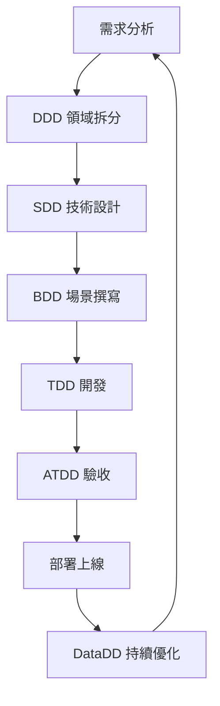

# 軟體開發方法論完整指南（XXDD 系列）

> 2026 年軟體工程實踐趨勢 - AI Agent 應用專題

---

## 📋 目錄

1. [方法論總覽](#方法論總覽)
2. [白話版快速理解](#白話版快速理解)
3. [AI Agent 實戰應用](#ai-agent-實戰應用)
4. [完整開發流程](#完整開發流程)
5. [實戰建議與常見誤區](#實戰建議與常見誤區)

---

## 方法論總覽

### 完整對照表

| 分類 | 方法論 | 全稱 | 核心概念 | 適用場景 |
|------|--------|------|----------|----------|
| **需求與溝通** | BDD | Behavior-Driven Development | 使用自然語言（Given/When/Then）描述使用者行為，消除溝通隔閡 | 跨部門協作（PM、QA、開發） |
| **需求與溝通** | ATDD | Acceptance Test-Driven Development | 在開發前定義「驗收標準」，確保產出即客戶所需 | 外部專案交付、需求驗收 |
| **架構與設計** | DDD | Domain-Driven Design | 以「業務領域」為核心建模，劃分限界上下文（Bounded Context） | 中大型複雜系統、微服務架構 |
| **架構與設計** | SDD | Solution Design Document | 在開發前撰寫詳細的技術解決方案設計文件（API、DB、流程） | 團隊技術同步、大型架構變動 |
| **架構與設計** | MDD | Model-Driven Development | 透過圖形化模型（如 UML）或視覺化工具自動生成程式碼 | 低程式碼平台、工業自動化 |
| **品質與開發** | TDD | Test-Driven Development | 先寫失敗的測試，再寫功能程式碼，最後重構（紅-綠-重構） | 核心邏輯開發、底層 API 撰寫 |
| **品質與開發** | FDD | Feature-Driven Development | 以「小功能點」為單位進行快速迭代與進度回報 | 團隊人數多、強調進度透明的專案 |
| **維運與數據** | DataDD | Data-Driven Development | 根據數據分析結果來決定開發的優先順序與功能走向 | 產品優化、電商或社群平台 |

---

## 白話版快速理解

### 各方法論的本質

| 方法論 | 一句話說明 | 就像是... | 解決什麼問題 |
|--------|-----------|-----------|-------------|
| **BDD** | 用「人話」寫測試，大家都看得懂 | 寫劇本：「當用戶按下登入，應該要看到歡迎訊息」 | 做對的事 |
| **ATDD** | 客戶說要什麼，就先寫驗收標準 | 驗屋：交屋前就列好檢查清單 | 做對的事 |
| **DDD** | 把複雜業務拆成一塊塊領域來管理 | 城市規劃：金融區、住宅區各管各的 | 複雜業務管理 |
| **TDD** | 先寫會失敗的測試，再寫程式讓它過 | 先出題目，再寫答案 | 把事做對 |
| **SDD** | 開工前先畫設計圖 | 建築藍圖：標明鋼筋、水電怎麼配 | 把事做對 |
| **FDD** | 切成小功能，一個個快速做完 | 樂高積木：一塊塊組裝，隨時可展示 | 進度透明化 |
| **DataDD** | 用數據決定要做什麼 | 看銷售數據決定進貨品項 | 優先順序決策 |

### 核心價值總結

- **BDD/ATDD**：解決「做對的事」（Do the right thing）的問題
- **TDD/SDD**：解決「把事做對」（Do the thing right）的問題
- **DDD**：解決「複雜業務邏輯」的管理問題
- **DataDD**：解決「持續優化」的問題

---

## AI Agent 實戰應用

### 1. BDD - 讓 AI 聽懂需求 🗣️

#### 範例場景

```gherkin
Feature: 智能發票審核
  
  Scenario: 高額發票自動標記
    Given 用戶上傳一張發票照片
    When AI 辨識出總金額超過 1000 元
    Then 自動標記為「需要審核」並通知主管
    
  Scenario: 重複發票檢測
    Given 系統已有發票編號 AB12345678
    When 用戶上傳相同編號的發票
    Then 顯示「重複發票」警告訊息
```

#### 應用場景

- ✅ 訓練 AI Agent 的對話流程
- ✅ 定義 Chatbot 的回應邏輯
- ✅ 生成自動化測試腳本
- ✅ 與非技術人員溝通 AI 行為

#### 推薦工具

- **Cucumber** (Ruby/Java)
- **SpecFlow** (.NET)
- **Behave** (Python)
- **Gauge** (跨語言)

---

### 2. ATDD - 確保 AI 產出符合期待 ✅

#### 驗收標準範例

```markdown
## AI 客服系統驗收標準

### 功能性需求
- ✅ AI 回答準確率須達 85% 以上
- ✅ 意圖識別準確率須達 90% 以上
- ✅ 支援繁體中文、簡體中文、英文三種語言

### 非功能性需求
- ✅ 回應時間不超過 2 秒
- ✅ 並發處理能力：1000 QPS
- ✅ 無法回答時自動轉人工，轉接時間 < 5 秒

### 安全性需求
- ✅ 不洩漏個人隱私資訊
- ✅ 通過 OWASP Top 10 安全測試
- ✅ 符合 GDPR 資料保護規範
```

#### 應用場景

- 📊 定義 AI 模型的效能指標（Accuracy、F1-score、Precision、Recall）
- 🎯 設計 A/B 測試的成功條件
- 🤝 與客戶溝通 AI 的能力邊界
- 📝 建立 SLA（Service Level Agreement）

#### 關鍵指標範例

| 指標類型 | 具體指標 | 目標值 |
|---------|---------|--------|
| 準確性 | Intent Accuracy | ≥ 90% |
| 準確性 | Response Accuracy | ≥ 85% |
| 效能 | Response Time (P95) | ≤ 2s |
| 效能 | Throughput | ≥ 1000 QPS |
| 可用性 | Uptime | ≥ 99.9% |
| 滿意度 | User Satisfaction | ≥ 4.5/5 |

---

### 3. DDD - 拆分 AI Agent 的職責 🏗️

#### 領域劃分範例

```
📦 智能客服系統
│
├── 🔍 訂單查詢領域 (Order Context)
│   ├── 查詢訂單狀態
│   ├── 追蹤物流資訊
│   └── 訂單修改請求
│
├── 🔄 退換貨領域 (Return Context)
│   ├── 退貨申請
│   ├── 換貨流程
│   └── 退款進度查詢
│
├── 👤 會員問題領域 (Member Context)
│   ├── 帳號問題
│   ├── 密碼重設
│   └── 會員權益查詢
│
└── 💰 付款問題領域 (Payment Context)
    ├── 付款失敗處理
    ├── 發票開立
    └── 優惠券使用
```

#### 限界上下文（Bounded Context）設計

```python
# 訂單領域的實體
class Order:
    order_id: str
    status: OrderStatus
    items: List[OrderItem]
    
# 會員領域的實體（同一個人，但關注點不同）
class Member:
    member_id: str
    tier: MemberTier
    points: int
```

#### 應用場景

- 🤖 多 Agent 系統的架構設計（Multi-Agent System）
- 🎯 避免單一 AI 做太多事導致混亂
- 🔗 明確定義各 Agent 的邊界與溝通方式
- 📦 微服務架構的前期規劃

#### 實際案例

**AutoGPT / MetaGPT 的領域劃分**：
- 💼 Product Manager Agent（需求分析領域）
- 👨‍💻 Architect Agent（架構設計領域）
- 🔨 Engineer Agent（程式開發領域）
- 🧪 QA Agent（測試驗證領域）

---

### 4. TDD - 確保 AI 功能正確 🧪

#### 紅-綠-重構循環

```python
# === 第一步：RED（寫失敗的測試） ===
import pytest

def test_sentiment_analysis_positive():
    """測試正面情緒分析"""
    assert analyze_sentiment("這產品真棒！") == "positive"
    
def test_sentiment_analysis_negative():
    """測試負面情緒分析"""
    assert analyze_sentiment("品質很差，不推薦") == "negative"
    
def test_sentiment_analysis_neutral():
    """測試中性情緒分析"""
    assert analyze_sentiment("普通的產品") == "neutral"


# === 第二步：GREEN（寫最簡單能通過的程式） ===
def analyze_sentiment(text: str) -> str:
    """情緒分析函數 - 初版"""
    positive_words = ["棒", "好", "推薦"]
    negative_words = ["差", "爛", "不推薦"]
    
    for word in positive_words:
        if word in text:
            return "positive"
    
    for word in negative_words:
        if word in text:
            return "negative"
            
    return "neutral"


# === 第三步：REFACTOR（重構優化） ===
from transformers import pipeline

class SentimentAnalyzer:
    """重構後的情緒分析器"""
    
    def __init__(self):
        self.model = pipeline(
            "sentiment-analysis",
            model="ckiplab/bert-base-chinese-ws"
        )
    
    def analyze(self, text: str) -> str:
        """使用預訓練模型進行分析"""
        result = self.model(text)[0]
        label = result['label']
        score = result['score']
        
        if score < 0.6:
            return "neutral"
        return label.lower()
```

#### 應用場景

- 🔧 開發 AI 的輔助函數（資料清洗、後處理）
- 📝 確保 Prompt Engineering 的穩定性
- ✔️ 建立 AI 輸出的驗證機制
- 🐛 快速定位 Bug 位置

#### Prompt 測試範例

```python
def test_prompt_consistency():
    """測試 Prompt 的穩定性"""
    prompt = """
    請將以下文字分類為：正面、負面、中性
    文字：{text}
    """
    
    # 相同輸入應該得到相同輸出
    result1 = llm.generate(prompt.format(text="產品很好用"))
    result2 = llm.generate(prompt.format(text="產品很好用"))
    
    assert result1 == result2 == "正面"
```

---

### 5. DataDD - 用數據決定 AI 要做什麼 📊

#### 數據驅動決策流程

```
📊 步驟 1：收集數據
   └── 客服對話日誌分析

📈 步驟 2：分析發現
   ├── 30% 客服問題是「忘記密碼」
   ├── 20% 是「查詢物流」
   ├── 15% 是「退換貨流程」
   ├── 10% 是「優惠券使用」
   └── 25% 其他雜項

💡 步驟 3：決策
   ├── 優先訓練 AI 處理前三大問題（65% 覆蓋率）
   ├── 建立專屬 FAQ 資料庫
   └── 其他問題先轉人工

🎯 步驟 4：執行與監控
   ├── 部署新版 AI
   ├── 持續監控準確率
   └── 每週檢視數據調整策略

🔄 步驟 5：循環優化
   └── 根據新數據重新調整優先順序
```

#### 實際案例

**電商客服 AI 優化**

| 階段 | 問題覆蓋率 | AI 處理率 | 轉人工率 |
|------|-----------|----------|---------|
| 初期 | 40% | 30% | 70% |
| 3個月後 | 70% | 60% | 40% |
| 6個月後 | 85% | 75% | 25% |

#### 應用場景

- 📊 決定 AI 訓練的優先順序
- 🧪 透過 A/B Testing 優化 Prompt
- 📈 分析用戶回饋改進模型
- 💰 ROI 評估與資源分配

#### 數據收集指標

```python
# 關鍵數據收集範例
metrics = {
    "intent_distribution": {  # 意圖分布
        "password_reset": 0.30,
        "order_tracking": 0.20,
        "return_request": 0.15,
        # ...
    },
    "resolution_rate": 0.75,  # 問題解決率
    "avg_turns": 3.2,         # 平均對話輪數
    "escalation_rate": 0.25,  # 轉人工率
    "user_satisfaction": 4.3   # 用戶滿意度
}
```

---

## 完整開發流程

### 2026 年 AI Agent 開發標準流程



### 詳細步驟說明

#### 階段 1：策略規劃（DDD）

**目標**：釐清業務邊界，決定系統架構

```
任務清單：
☐ 識別核心領域（Core Domain）
☐ 劃分限界上下文（Bounded Context）
☐ 定義領域模型（Domain Model）
☐ 設計上下文映射（Context Mapping）
```

**產出物**：
- 領域模型圖
- 上下文關係圖
- 領域術語表

---

#### 階段 2：架構設計（SDD + BDD）

**目標**：確立技術規格與功能場景

```
任務清單：
☐ 撰寫 SDD 技術文件
  ├── API 規格設計
  ├── 資料庫 Schema
  ├── 系統架構圖
  └── 部署拓撲圖

☐ 撰寫 BDD 場景腳本
  ├── 主要使用情境
  ├── 異常處理流程
  └── 邊界條件測試
```

**產出物**：
- SDD 技術文件
- BDD 場景檔案（.feature）
- API 設計文件

---

#### 階段 3：開發實作（TDD）

**目標**：確保每個功能正確實作

```
開發循環：
1. 寫測試（RED）
2. 寫程式（GREEN）
3. 重構（REFACTOR）
4. 重複 1-3
```

**產出物**：
- 單元測試程式碼
- 功能程式碼
- 整合測試

---

#### 階段 4：驗收測試（ATDD）

**目標**：確認系統符合需求

```
驗收檢查：
☐ 功能性驗收
☐ 效能驗收
☐ 安全性驗收
☐ 使用者體驗驗收
```

**產出物**：
- 驗收測試報告
- 效能測試報告
- Bug 修復清單

---

#### 階段 5：持續優化（DataDD）

**目標**：根據數據持續改進

```
優化循環：
1. 收集運營數據
2. 分析問題熱點
3. 調整優先順序
4. 重新訓練模型
5. A/B 測試驗證
6. 全量上線
```

**產出物**：
- 數據分析報告
- 優化建議清單
- 新版本模型

---

## 實戰建議與常見誤區

### 不同規模專案的方法論選擇

| 專案規模 | 團隊人數 | 推薦組合 | 原因 |
|---------|---------|---------|------|
| **小型 POC** | 1-3人 | BDD + TDD | 快速驗證想法，確保核心邏輯正確 |
| **中型產品** | 4-10人 | DDD + ATDD + DataDD | 業務清晰、驗收明確、數據驅動 |
| **大型平台** | 10+人 | 全套方法論 | 複雜系統需要完整的方法論支撐 |
| **快速迭代** | 不限 | FDD + DataDD | 強調進度透明與快速反饋 |

---

### 常見誤區與解決方案

#### ❌ 誤區 1：只用一種方法

**問題**：過度依賴單一方法論，忽略其他面向

**後果**：
- 只用 TDD：測試很完整，但做錯功能
- 只用 BDD：需求很清楚，但程式碼品質差
- 只用 DDD：架構很漂亮，但交付速度慢

**✅ 正解**：組合使用，形成完整閉環

```
DDD (架構) + BDD (需求) + TDD (品質) + DataDD (優化)
= 完整的開發體系
```

---

#### ❌ 誤區 2：過度設計

**問題**：小專案使用過重的流程

**範例**：
- 2人的 POC 專案寫了 50 頁的 SDD
- 簡單的 CRUD API 畫了 20 張 DDD 圖
- 10 行程式碼寫了 100 行測試

**✅ 正解**：適度選擇，依規模調整

| 專案類型 | 文件複雜度 | 測試覆蓋率 |
|---------|-----------|-----------|
| POC | 簡化版 | 核心功能 60%+ |
| MVP | 標準版 | 重要功能 80%+ |
| 正式產品 | 完整版 | 全功能 90%+ |

---

#### ❌ 誤區 3：文件與實作脫節

**問題**：文件寫得很漂亮，但從不更新

**後果**：
- 新人看文件被誤導
- 文件變成裝飾品
- 溝通成本增加

**✅ 正解**：文件即測試，自動驗證

```gherkin
# BDD 腳本本身就是可執行的文件
Feature: 用戶登入
  
  Scenario: 成功登入
    Given 用戶輸入正確的帳號密碼
    When 點擊登入按鈕
    Then 應該看到「歡迎回來」訊息
```

這個腳本既是需求文件，也是自動化測試！

---

#### ❌ 誤區 4：忽略 AI 特性

**問題**：用傳統軟體開發方法套用在 AI 專案

**AI 專案的特殊性**：
- 🎲 **不確定性**：相同輸入可能有不同輸出
- 📊 **數據依賴**：模型品質取決於訓練資料
- 🔄 **持續演進**：需要不斷重新訓練
- 🧪 **難以測試**：很難寫出確定性的測試

**✅ 正解**：調整測試策略

```python
# 傳統測試（確定性）
def test_add():
    assert add(1, 2) == 3  # 必定成立

# AI 測試（機率性）
def test_sentiment_analysis():
    results = [analyze("很棒") for _ in range(100)]
    positive_rate = sum(r == "positive" for r in results) / 100
    assert positive_rate >= 0.85  # 允許 15% 誤差
```

---

### 最佳實踐建議

#### 1. 建立適合團隊的方法論組合

```
步驟 1：評估現況
  └── 團隊規模、專案複雜度、交付週期

步驟 2：選擇核心方法論
  └── 從 2-3 個方法論開始

步驟 3：逐步擴展
  └── 每季度評估，調整方法論組合

步驟 4：持續優化
  └── 根據回顧會議改進流程
```

---

#### 2. 建立自動化管道

```yaml
# CI/CD Pipeline for AI Agent
stages:
  - lint          # 程式碼風格檢查
  - unit_test     # TDD 單元測試
  - bdd_test      # BDD 場景測試
  - integration   # 整合測試
  - performance   # 效能測試
  - acceptance    # ATDD 驗收測試
  - deploy        # 部署
  - monitor       # DataDD 監控
```

---

#### 3. 重視團隊協作

| 角色 | 負責方法論 | 主要產出 |
|------|-----------|---------|
| Product Manager | BDD, ATDD | 場景腳本、驗收標準 |
| Architect | DDD, SDD | 架構圖、技術文件 |
| Developer | TDD, FDD | 程式碼、單元測試 |
| Data Scientist | DataDD | 數據分析、模型優化 |
| QA | ATDD, BDD | 測試腳本、測試報告 |

---

#### 4. 建立知識庫

```
📚 團隊知識庫架構
├── 📖 方法論指南
│   ├── BDD 實踐手冊
│   ├── TDD 最佳實踐
│   └── DDD 案例研究
│
├── 📝 模板庫
│   ├── SDD 模板
│   ├── BDD 場景模板
│   └── ATDD 驗收模板
│
└── 🎓 培訓資料
    ├── 新人入職指南
    ├── 內部分享簡報
    └── 外部課程資源
```

---

## 總結

### 一句話記住所有方法論

> **這些方法論就是讓你的 AI Agent「做對的事」(BDD/ATDD/DDD) + 「把事做對」(TDD/SDD) + 「持續變更好」(DataDD/FDD) 的完整工具箱！** 🛠️

### 核心原則

1. **不要教條主義**：方法論是工具，不是宗教
2. **持續改進**：根據回顧會議調整流程
3. **團隊共識**：方法論要全團隊理解與執行
4. **適度使用**：過度設計與缺乏設計都是問題
5. **自動化優先**：能自動化的盡量自動化

### 開始行動

```
第一步：選擇 1-2 個方法論開始實踐
第二步：建立基礎的自動化測試
第三步：定期回顧與調整
第四步：逐步擴展到其他方法論
```

---

## 參考資源

### 書籍推薦

- 📘 《Domain-Driven Design》 - Eric Evans
- 📗 《Test Driven Development: By Example》 - Kent Beck
- 📙 《The Cucumber Book》 - Matt Wynne & Aslak Hellesøy
- 📕 《Continuous Delivery》 - Jez Humble & David Farley

### 線上資源

- [Cucumber 官方文件](https://cucumber.io/docs/)
- [Martin Fowler's Blog](https://martinfowler.com/)
- [DDD Community](https://www.dddcommunity.org/)
- [Test Driven Development Wikipedia](https://en.wikipedia.org/wiki/Test-driven_development)

### 工具推薦

| 用途 | 工具 | 說明 |
|------|------|------|
| BDD | Cucumber, SpecFlow, Behave | 場景測試框架 |
| TDD | pytest, JUnit, NUnit | 單元測試框架 |
| DDD | EventStorming, Context Mapper | 領域建模工具 |
| DataDD | Mixpanel, Amplitude, Google Analytics | 數據分析平台 |
| CI/CD | GitHub Actions, GitLab CI, Jenkins | 自動化部署 |

---

**文件版本**：v1.0  
**更新日期**：2026-01-21  
**作者**：AI Development Best Practices Team  
**授權**：CC BY-SA 4.0

---

## 附錄：實戰 Checklist

### AI Agent 專案啟動檢查清單

```markdown
## 專案啟動前

- [ ] 確認專案規模與複雜度
- [ ] 選擇適合的方法論組合
- [ ] 建立團隊共識
- [ ] 準備開發環境與工具

## DDD 階段

- [ ] 識別核心領域
- [ ] 劃分限界上下文
- [ ] 定義領域模型
- [ ] 繪製上下文映射圖

## SDD + BDD 階段

- [ ] 撰寫技術設計文件
- [ ] 設計 API 規格
- [ ] 撰寫 BDD 場景腳本
- [ ] 定義驗收標準（ATDD）

## TDD 開發階段

- [ ] 建立單元測試框架
- [ ] 實踐紅-綠-重構循環
- [ ] 達到目標測試覆蓋率
- [ ] 程式碼審查（Code Review）

## ATDD 驗收階段

- [ ] 執行自動化驗收測試
- [ ] 效能測試
- [ ] 安全性測試
- [ ] 用戶驗收測試（UAT）

## DataDD 持續優化

- [ ] 建立數據收集管道
- [ ] 設定關鍵指標監控
- [ ] 定期數據分析會議
- [ ] 根據數據調整策略
```

---

**🎉 恭喜你讀完這份指南！現在你已經掌握了現代軟體開發方法論的精髓。**

**記住：方法論是幫助你更好地交付價值的工具，而不是束縛你的枷鎖。靈活運用，持續改進！** 💪
