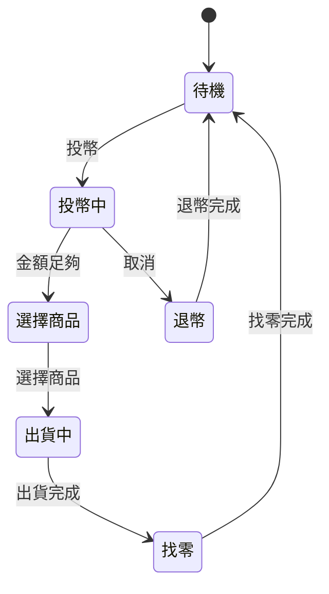

# 黑箱測試方法詳細指南

## 目錄

1. [邊界值分析](#1-邊界值分析)
2. [組合測試](#2-組合測試)
3. [決策表測試](#3-決策表測試)
4. [狀態轉移測試](#4-狀態轉移測試)

---

## 1. 邊界值分析

### 使用時機

當你要測試**單一輸入參數**時使用，例如：
- 年齡範圍驗證
- 金額限制檢查
- 數量上下限控制

### 實作步驟

#### Step 1：確認規格範圍

```python
# 範例：年齡驗證器（範圍 0-120）
from src.boundary_value.age_validator import AgeValidator

validator = AgeValidator(min_age=0, max_age=120)
```

#### Step 2：設計測試案例

針對**左邊界**和**右邊界**各測試 3 個值：

```python
# 左邊界測試
assert validator.validate(-1) is False   # 低於下限
assert validator.validate(0) is True     # 最小有效值
assert validator.validate(1) is True     # 最小有效值+1

# 右邊界測試
assert validator.validate(119) is True   # 最大有效值-1
assert validator.validate(120) is True   # 最大有效值
assert validator.validate(121) is False  # 超過上限
```

### 測試清單範本

| 測試項目 | 輸入值 | 預期結果 | 說明 |
|---------|-------|---------|------|
| 低於下限 | -1 | False | 無效值 |
| 最小有效值 | 0 | True | 邊界值 |
| 最小有效值+1 | 1 | True | 安全區 |
| 中間正常值 | 30 | True | 正常值 |
| 最大有效值-1 | 119 | True | 安全區 |
| 最大有效值 | 120 | True | 邊界值 |
| 超過上限 | 121 | False | 無效值 |

---

## 2. 組合測試

### 使用時機

當你要測試**多個參數交互作用**時使用，例如：
- 瀏覽器相容性（OS × Browser × Language × Resolution）
- 系統配置組合
- 多因素設定

### 實作步驟

#### Step 1：定義參數與值

```python
from src.pairwise.pict_generator import PairwiseGenerator

parameters = {
    'OS': ['Windows 10', 'Windows 11', 'macOS', 'Ubuntu', 'Fedora'],
    'Browser': ['Chrome', 'Firefox', 'Safari', 'Edge', 'Opera'],
    'Language': ['zh-TW', 'en-US']
}

# 全組合數：5 × 5 × 2 = 50 種
```

#### Step 2：生成 Pairwise 組合

```python
generator = PairwiseGenerator()
test_cases = generator.generate(parameters)

print(f"全組合數：50")
print(f"Pairwise 組合數：{len(test_cases)}")  # 約 10-15 個
print(f"縮減比例：{(1 - len(test_cases)/50) * 100:.1f}%")
```

#### Step 3：執行測試

```python
for test_case in test_cases:
    # 執行測試
    result = run_compatibility_test(
        os=test_case['OS'],
        browser=test_case['Browser'],
        language=test_case['Language']
    )
    assert result.success
```

### 縮減效果

| 參數數量 | 全組合 | Pairwise | 縮減比例 |
|---------|-------|---------|---------|
| 3×3×2 | 18 | 9 | 50% |
| 5×7×2 | 70 | 14 | 80% |
| 5×7×2×3×2 | 420 | 30-50 | 90%+ |

---

## 3. 決策表測試

### 使用時機

當你要測試**複雜的商業規則**時使用，例如：
- 會員折扣計算
- 保險理賠規則
- 權限控制邏輯

### 實作步驟

#### Step 1：列出所有條件

```python
# 範例：會員折扣計算
# 條件 1：會員等級（金卡/銀卡）
# 條件 2：購買金額（≥1000/<1000）
# 條件 3：使用優惠券（是/否）

# 總組合數：2³ = 8 種
```

#### Step 2：建立決策表

| 規則 | 會員等級 | 金額≥1000 | 有優惠券 | 折扣率 |
|-----|---------|-----------|---------|-------|
| 1 | 金卡 | 是 | 是 | 25% |
| 2 | 金卡 | 是 | 否 | 20% |
| 3 | 金卡 | 否 | 是 | 15% |
| 4 | 金卡 | 否 | 否 | 10% |
| 5 | 銀卡 | 是 | 是 | 15% |
| 6 | 銀卡 | 是 | 否 | 10% |
| 7 | 銀卡 | 否 | 是 | 10% |
| 8 | 銀卡 | 否 | 否 | 5% |

#### Step 3：實作與測試

```python
from src.decision_table.membership_discount import MembershipDiscountCalculator

calculator = MembershipDiscountCalculator()

# 測試規則 1
result = calculator.calculate(
    member_level='gold',
    amount=1500,
    has_coupon=True
)
assert result['discount_rate'] == 0.25
```

### 完整性檢查

- n 個布林條件 → 2ⁿ 種組合
- 確保所有組合都有對應的規則
- 使用 `get_decision_table()` 檢查完整性

---

## 4. 狀態轉移測試

### 使用時機

當你要測試**有順序或狀態的系統**時使用，例如：
- 販賣機
- 媒體播放器
- 遊戲流程
- 工作流引擎

### 實作步驟

#### Step 1：定義狀態圖



#### Step 2：測試每條轉移

```python
from src.state_transition.vending_machine import VendingMachine

machine = VendingMachine()

# 測試：待機 → 投幣中
machine.insert_coin(10)
assert machine.get_state() == '投幣中'

# 測試：投幣中 → 選擇商品
machine.confirm_amount()
assert machine.get_state() == '選擇商品'

# 測試：選擇商品 → 出貨中
machine.select_product('可樂')
assert machine.get_state() == '出貨中'
```

#### Step 3：測試完整流程

```python
def test_full_flow():
    """測試完整購買流程"""
    machine = VendingMachine()

    # 待機 → 投幣中 → 選擇商品 → 出貨中 → 找零 → 待機
    machine.insert_coin(50)
    machine.confirm_amount()
    machine.select_product('可樂')
    machine.dispense()
    change = machine.return_change()

    assert machine.get_state() == '待機'
    assert change == 20
```

### 覆蓋率目標

- **狀態覆蓋**：每個狀態至少訪問一次
- **轉移覆蓋**：每條轉移至少執行一次
- **成對轉移覆蓋**：連續的兩個轉移

---

## 測試方法選擇流程圖

```
開始
  ↓
測試對象是什麼？
  ├─ 單一參數 → 邊界值分析
  ├─ 多參數組合 → Pairwise 測試
  ├─ 複雜規則 → 決策表測試
  └─ 有狀態順序 → 狀態轉移測試
```

## 常見問題

### Q1：可以混合使用多種方法嗎？

**A：** 可以！實際專案中常常需要組合使用。例如：
- 先用決策表確定規則
- 再用邊界值測試每個參數
- 最後用狀態測試驗證流程

### Q2：如何知道測試是否完整？

**A：** 使用覆蓋率指標：
- 邊界值：左右邊界各 3 個值
- Pairwise：100% 兩兩組合覆蓋
- 決策表：2ⁿ 種組合全部覆蓋
- 狀態：100% 狀態與轉移覆蓋

### Q3：AI 能完全取代人工測試嗎？

**A：** 不能！AI 的角色是：
- ✅ 自動生成測試案例
- ✅ 快速建立測試模型
- ❌ 無法完全理解業務邏輯
- ❌ 無法處理所有邊緣情況

**最佳實踐：AI 產出 + 人工審核**

---

## 參考資源

- 課程筆記：`../黑箱測試方法與AI應用_課程筆記.md`
- 工具文件：
  - [AllPairs 文件](https://pypi.org/project/allpairspy/)
  - [Transitions 文件](https://github.com/pytransitions/transitions)
- 範例程式碼：`../src/` 目錄

---

**整理日期：** 2026-01-01
