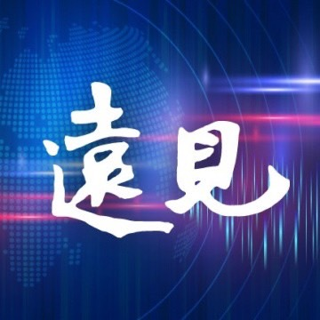

# 取代你的不是 AI，而是使用 AI 的人：程世嘉的 6 項關鍵思考

> 別怕 AI 拿走你的工作。AI 是標配，思考才是你的武器。

## 文章資訊

- 作者：遠見好讀
- 日期：2024-05-09
- 瀏覽數：11,800+
- 原文連結：[遠見好讀（來源頁）](https://www.gvm.com.tw/blog/217)

## 重點摘要

生成式 AI 不會一夕之間取代整份工作，而是逐步解構工作中的任務。重複性高、規則明確的任務最容易被 AI 取代；需要協調、決策、管理與情境判斷的工作，仍高度依賴人類。

## AI 取代的是任務，不是整個職位

以金融業為例，ATM 出現後並沒有讓銀行消失，而是讓銀行的角色轉型。AI 對職場的影響也類似，不是直接移除整個職位，而是改變職位中的任務組成。

- AI 擅長：資料處理、重複性作業、初步內容生成
- 人類擅長：協調溝通、決策判斷、組織管理

## 生產力提升的觀察

文中引用研究指出，生成式 AI 在多個工作領域帶來顯著生產力提升：

- 客服工作：約提升 20%
- 內容產出與資訊整理：約提升 70%
- 軟體工程寫程式：約提升 125%

這代表 AI 在任務層面可大幅加速，但並不等於可以完全替代人類角色。

## 把 AI 當作「啟動器」最有效

作者用「靜摩擦力」比喻工作起步階段最困難的部分。生成式 AI 在發想與草稿階段特別有價值，能快速提供方向與初稿，降低起步成本。

實務上可把 AI 用在：

- 腦力激盪：快速生成多個方向
- 草稿整理：先產生可編修版本
- 語句潤飾：協助修正文法與表達

但最終正確性與責任仍在人，不應把 AI 當成可直接交付成果的最終負責者。

## 關鍵思考（6 點）

- 生成式 AI 的核心價值是互動與啟發，不是保證精確答案。
- 與 AI 深度互動，能明顯提升學習與工作效率。
- 不必把問題簡化為「AI 會不會取代我」，而是要看「哪些任務會被重組」。
- AI 時代會加劇強者優勢，個人能力差距可能被放大。
- 面對快速變化，自我覺察與能力定位變得更重要。
- 不應把自我價值建立在外部按讚與短期回饋，應回到長期能力累積。

## 延伸閱讀

- [「人一輩子能做好一件事就功德圓滿了」傾盡全力的作品，無法被 ChatGPT 取代](https://www.gvm.com.tw/article/105518)
