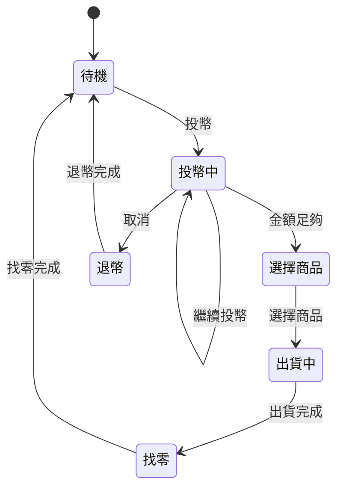

# 黑箱測試方法與 AI 應用 - 課程筆記

> 課程講師：成功大學資訊工程系 李信杰教授

---

## 📌 核心理念

### 測試人員的常見焦慮
- 「測試案例夠完整嗎?」
- 「測完了沒?」
- 面對無窮盡的測試情境，該如何取捨?

### 科學化黑箱測試的三大目標
1. 用**最少的測試案例**
2. 抓出**最大部分的 Bug**
3. 從「**依賴經驗**」轉化為「**依賴邏輯與演算法**」

---

## 🔍 四大科學測試方法

### 1️⃣ 等價類劃分 + 邊界值分析
**Equivalence Partitioning + Boundary Value Analysis**

#### 適用對象
- **單一輸入參數** (One-factor inputs)
- 例如：年齡、金額、數量等單一變數

#### 核心邏輯
- 將輸入範圍劃分為多個**等價類**
- 假設：同一類別內的資料測試效果相同
- **重點測試邊界值**

#### 為什麼測邊界?
- 程式邏輯（如 `if-else`）最容易在邊界判定條件出錯
- 邊界是最容易產生 Bug 的地方

#### 實際操作範例
```
規格要求：輸入範圍 0~1000

測試案例設計：
左邊界：
  - -1  (無效值，低於下限)
  - 0   (最小有效值)
  - 1   (最小有效值+1)

右邊界：
  - 999  (最大有效值-1)
  - 1000 (最大有效值)
  - 1001 (無效值，超過上限)
```

#### 白話解釋
> 就像考試範圍是 1-100 頁，你不用每頁都讀，但第 1 頁、第 100 頁、前後幾頁一定要特別注意，因為邊界最容易出錯。

---

### 2️⃣ 組合測試 (Pairwise Testing)
**Combinatorial Testing**

#### 適用對象
- **多輸入參數交互作用** (Multi-factor inputs)
- 多個參數互相影響的情境

#### 傳統困境：組合爆炸
```
範例：
- 5 種作業系統
- 7 種瀏覽器
- 2 種語言
- 3 種解析度
- 2 種網速

總組合數 = 5 × 7 × 2 × 3 × 2 = 420 種組合
→ 根本測不完！
```

#### Pairwise 原理
- **科學研究發現**：大部分的 Bug 僅由「**任意兩個參數**」的交互作用觸發
- 不需要測試所有組合
- 只要確保「**任兩參數的所有配對都測試過**」即可

#### 工具應用
- 使用工具：微軟的 **PICT** (Pairwise Independent Combinatorial Testing)
- 效果：將數百種組合縮減至**幾十個案例**
- 優點：省時間 + 抓到大部分 Bug

#### 白話解釋
> 像是試吃餐點，不用每種主食配每種飲料都試，只要確保「每種主食都至少配過每種飲料一次」，就能找出大部分搭配問題。

---

### 3️⃣ 決策表測試
**Decision Table Testing**

#### 適用對象
- **複雜的商業規則** (Complex business rules)
- 多種條件組合觸發特定動作
- 例如：保險理賠條件、折扣計算、會員權益

#### 傳統困境
- 規則繁雜時，人工手繪表格非常「**燒腦**」
- 容易漏掉某些條件組合
- 難以確保完整性

#### AI 輔助流程
1. **輸入**：測試人員提供文字需求
2. **轉換**：AI 自動轉化為決策表
3. **檢查**：完整性檢查 (Completeness Check)
   - 檢查是否涵蓋 2^n 個邏輯情境
4. **優化**：規則合併
   - 透過「Don't Care (-)」項簡化案例

#### AI 的優勢
- ✅ 擅長語義分析
- ✅ 快速理清邏輯關聯
- ✅ 自動 Highlight 重點
- ✅ 避免人為疏漏

#### 實際範例
```
商業規則：會員折扣計算

條件：
1. 會員等級：金卡 / 銀卡
2. 購買金額：≥1000 / <1000
3. 使用優惠券：是 / 否

AI 會列出所有 2^3 = 8 種組合
並自動檢查是否有遺漏
```

#### 白話解釋
> 像是保險理賠規則很複雜，AI 可以幫你列出所有可能的情況組合，確保沒有漏掉任何一種情境。

---

### 4️⃣ 狀態測試
**State Transition Testing**

#### 適用對象
- **具有先後順序或狀態切換的系統** (Multi-shot actions)
- 例如：
  - 販賣機
  - IDE 除錯工具 (Debugger)
  - 登入/登出流程
  - 媒體播放器

#### 傳統困境
- 狀態轉移圖 (State Diagram) 繪製困難
- 難以確認所有路徑是否都測試過
- 人工追蹤容易出錯

#### 測試覆蓋指標

##### a) 轉移覆蓋 (Transition Coverage)
- **定義**：每一條轉移線至少執行過一次
- **目標**：確保所有狀態轉換都被測試

##### b) 成對轉移覆蓋 (Pair Transition Coverage)
- **定義**：測試前後連續的兩個轉移
- **優點**：信心度更高，能發現更複雜的問題

#### AI 輔助方式
1. 測試人員提供需求文字
2. AI 根據需求產出 **Mermaid 語法**
3. 自動生成狀態轉移圖
4. 大幅降低建模門檻

#### 實際範例：販賣機


#### 白話解釋
> 像是遊戲流程（開始→進行→暫停→結束），AI 可以自動畫出所有可能的流程圖，確保每種路徑都有測試到。

---

## 🤖 AI 在測試設計中的角色與「人」的價值

### AI 的三大功能

#### 1. 降低燒腦程度
- AI 處理文字語義到邏輯模型的轉換
- 例如：需求文件 → 決策表 / 狀態圖
- 減少重複性、機械性的工作

#### 2. 自動化生成
- 快速產出測試模型
- 測試人員只需負責「**審核 (Review)**」
- 大幅提升工作效率

#### 3. 語義理解
- 分析複雜的文字需求
- 自動識別邏輯關聯
- 標示重點與潛在問題

### 人類的不可取代性

#### a) 責任歸屬
- **最終責任在人**
- AI 產出的結果可能有誤或不完整
- 必須由人進行最後的 Review
- 確認邏輯合理性與完整性

#### b) 異常測試
- 針對 AI 沒考慮到的情境進行探索
- **非法動作**：不符合規格的操作
- **邊緣情境**：極端或罕見的使用情況
- **創意測試**：想像使用者可能的「奇怪操作」

#### c) 業務理解
- 只有人能判斷哪些測試情境真正重要
- 理解業務脈絡與使用者需求
- 設定測試優先級

---

## 📊 四大方法比較表

| 測試方法 | 適用情境 | 主要目的 | AI 協助方式 | 關鍵技術 |
|---------|---------|---------|-----------|---------|
| **等價類劃分 + 邊界值** | 單一參數輸入 | 找出邊界條件錯誤 | 自動生成邊界測試案例 | 邏輯分析 |
| **組合測試 (Pairwise)** | 多參數交互作用 | 降低組合爆炸問題 | 使用 PICT 等工具優化組合 | 組合數學 |
| **決策表測試** | 複雜商業規則 | 確保邏輯完整性 | 文字→決策表轉換 | 語義分析 |
| **狀態測試** | 有順序的系統 | 覆蓋所有狀態轉移 | 生成 Mermaid 狀態圖 | 圖論算法 |

---

## 💡 課程總結

### 核心觀念
1. **測試不是亂測**，要用科學方法
2. **不同情境用不同方法**：
   - 單參數 → 邊界值分析
   - 多參數 → Pairwise 組合測試
   - 複雜規則 → 決策表
   - 有流程 → 狀態測試
3. **AI 是好幫手**，但人的判斷力不可取代

### 測試設計的黃金法則
- ✅ 用**邏輯**取代**直覺**
- ✅ 用**演算法**取代**經驗**
- ✅ 用**最少案例**抓**最多 Bug**
- ✅ **AI 產出** + **人工審核** = 最佳組合

### 最終目標
> **用最聰明的方式，找出最多的 Bug！**

---

## 📚 延伸學習資源

### 工具推薦
- **PICT**：微軟開發的 Pairwise 測試工具
- **Mermaid**：圖表生成語法，支援狀態圖
- **ChatGPT / Claude**：協助生成決策表與狀態圖

### 關鍵字
- Equivalence Partitioning (等價類劃分)
- Boundary Value Analysis (邊界值分析)
- Pairwise Testing (成對測試)
- Decision Table (決策表)
- State Transition Testing (狀態轉移測試)
- Combinatorial Explosion (組合爆炸)

---

## 📝 筆記日期
整理日期：2026-01-01  
課程來源：成功大學資訊工程系 李信杰教授

---

**END**
