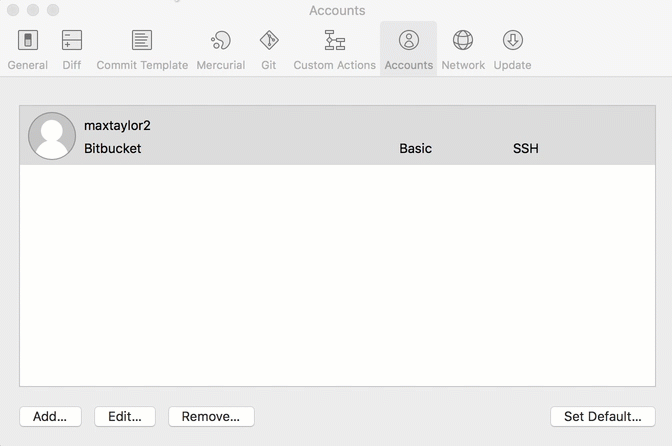

## 使用不同 ssh 金鑰登入 github


在 github 抓取 Repository 時，我們常常用 git ssh 帳號去 clone 一個 Repository，像是：

```sh
git clone git@github.com:laravel/laravel.git
```

而使用 ssh 去 clone Repository 時，則會需要 `ssh 金鑰` 才能夠順利的將專案複製下來，但只要有正確的金鑰，我們在每一次對 Repository 進行 clone / push / pull / fetch 的時候，則都不需要輸入帳號密碼即可完成操作（只要你的帳號有足夠的權限的話）

但當我們有個人的專案及公司的專案都在 github 時，且不同的專案所需要的 `ssh 金鑰` 皆不同時，則需要設定在不同的狀況需要使用不同的金鑰去存取我們的 Repository。

例如 `git@github.com:kj/kj.git` 需要 `id_rsa_kj_personal` 的金鑰，但 `git@github.com:kj-company/compony-project.git` 則需要 `id_rsa_kj_company` 的金鑰

此時可以使用的解法有下列 2 個

## 設定 .ssh/config 檔案

`.ssh/config` 的設定檔案格式像下方

```sh
Host <host_alias>                       # 主機別名
    HostName <hostname_or_ip>           # 主機網址或 ip
    IdentityFile <private_key_path>     # 金鑰位置
```

```sh
git clone ssh://git@github.com-CryptoTrade/shihyu/CryptoTrade.git
```


所以我們可以將 `.ssh/config` 檔案設定成這樣

```sh
# GitHub KJ 個人專案
Host github-kj-personal
    HostName github.com
    IdentityFile ~/.ssh/id_rsa_kj_personal

# GitHub KJ 公司專案
Host github-kj-company
    HostName github.com
    IdentityFile ~/.ssh/id_rsa_kj_company
```

設定完 `.ssh/config` 之後

在存取個人專案的網址會從 `git@github.com:kj/kj.git` 改成 `git@github-kj-personal:kj/kj.git`

在存取公司專案的網址會從 `git@github.com:kj-company/compony-project.git` 改成 `git@github-kj-company:kj-company/compony-project.git`

所以複製專案指令會變成

```sh
git clone git@github-kj-personal:kj/kj.git
git clone git@github-kj-company:kj-company/compony-project.git
```

下列是 git ssh 網址格式說明，所以可以看到我們用 `主機別名 Host <host_alias>` 將原本的主機名稱改掉

```ssh
# 原始網址
git@github.com:<accountname>/<reponame>.git

# 網址格式
git@<host_alias>:<accountname>/<reponame>.git
```

當我們存取 `github-kj-personal` 主機時，根據 `.ssh/config` 設定，我們會存取到設定的 `HostName` 為 `github.com`，使用的金鑰為 `~/.ssh/id_rsa_kj_personal`

當我們存取 `github-kj-company` 主機時，根據 `.ssh/config` 設定，我們會存取到設定的 `HostName` 為 `github.com`，使用的金鑰為 `~/.ssh/id_rsa_kj_company`

所以這樣設定可以讓我們同時對 github 使用不同的金鑰進行存取

## 加入臨時的 ssh 金鑰

在需要存取公司的 Repository 時，可以將公司的 ssh key 加入，這樣在一段時間內都可以使用此金耀進行存取

在 .bash_profile 可以設定指令的快捷

```shell
alias ssh-set-company-key='export GIT_SSH_COMMAND="ssh -i ~/.ssh/COMPANY_KEY";
                           export PS1="${PS1}COMPANY ==> "'
```

設定完指令 alias 後，之後需要使用到公司的金鑰時，就可以輸入此指令，就可以存取公司專案了

## 在 SourceTree 指定不同的金鑰



# 參考資料

- https://kejyuntw.gitbooks.io/ubuntu-learning-notes/content/network/network-multiple-ssh-key-to-same-github-site.html