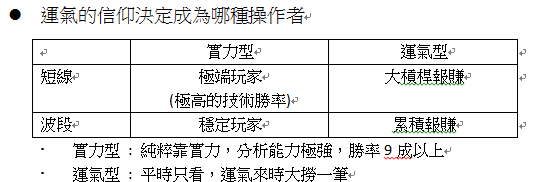
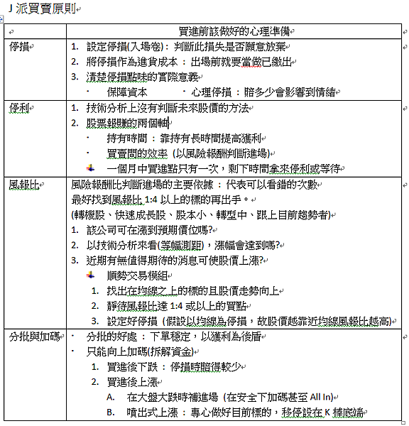

## 反市場 JG股市操作原理

出處: https://stu15834.pixnet.net/blog/post/352668034

 

- J派核心原理 – 反市場

- 世界上存在許多可遵循的重要規則，如看見紅燈停下，看見綠燈才起步
  - 「人們規定」的常識，這些規則可以看到多數人興奮和恐懼時，便是可以利用的東西。

- 範例 逆KD用法
  - 出現上升趨勢時
  - 在KD向下交叉且股價下跌時買進
  - 以前波低點作為停損
  - 當KD向下交叉失敗又突破前高時，將這次反轉失敗低點作為停損

### 停損

- 買進後續走跌並達到心理停損點 (感到壓力)
- 跌破確認過的低點

- 範例 逆布林+極限加碼

### 精神

- 抓住群眾恐懼時 – 在恐懼時買進

- 只管買進，除非暴利不然不停立

### 操作

- 在出現上升趨勢時

- 在布林下緣位置買進

- 突破上緣後不設技術分析停利，直到滿意報酬才停利

- 每漲250點(期貨3%)或股價10%等比買進第二筆

- 布林中線(20MA)上彎，同上每250點依承受風報比投入3.4筆

### 進場後操作

- 若非勝率高過9成，要遵守有賺不能賠

- 好的買點買進後都會漲一下
  - 沒漲一下 : 買點錯了，立即出場
  - 彈一下跌回 : 量能弱應退出
  -  彈後向上 : 進入移動停利操作，向上加碼
  -  彈後噴出 : 以K棒低點移停，根據風報比加碼
  - 進場後股價在停損停利間遊移 :
    - 賭博式停利法(目前最高價到停損價的一半停利，賭大獲利)
    - 進場時應看該股過去上漲時回檔%數，看報酬率能否承受

- 一口單

  -  拿過去一週的線圖找出事後看好的出手點，將這個出手點依據套用到過去一段時間看是否也完美接下來一段時間只在看到這個依據時才場，不然不動作

- 回測

  - 過去不代表未來，關鍵在於建立信心，看看自己當下能否做出正確的決策
  - ex: 線圖網站 – Trading View、Stock-ai
  -  回測要把握三個方向的表現
    - 多頭、空頭、盤整

  

### 客製化交易SOP四步驟

- 目標設定 : 放大心中報酬率，待找出最大痛苦值來制定報酬率
- 回測技術: 找出適合反市場的武器。
  - 用一樣技術的人哪裡會興奮? 哪裡會恐懼? 獨立思考這些事)

- 根據風險報酬比設定停損停利和分批計畫
- 下一口單，寫交易日至，隨時調整SOP

- 如何設定目標獲利 : **先回測過去暴漲型態前會出現的跡象，操作就是跡象出現時如何去賺到這筆錢，當找出過去暴漲跡象時就可得出風險報酬比，但漲跌前跡象其實差不多，所以只挑選一個方向做，猜對照計畫加碼，猜錯依風險報酬比停損。**  

### JG八原則

1. 股票市場就是賭 : 承認運氣的重要性，運氣不對就離開

2. 務必和股市預言保持距離 : 預測應著重預測過程的「資料」而非結果

3. 用財報選股離暴賺太遠

   1. 財報 – 過去式
   2. 買點 – 技術面
   3. 持有 – 想像力

4. 暴賺是最健康的股市態度

   1. 不想暴賺的人容易短進短出，只有想大賺的人懂得持有
   2. 兩種人在挑選股票的方向和心態會有差異

5. 當然要知道輸家的下一步

   1. 在輸家最容易恐慌的地方，便是最安全的地方
   2. 輸家的特徵
      1. 沒耐心 → 持有時間要長
      2. 短線容易恐慌 → 只在恐慌時進場
      3. 喜歡當沖 → 絕不用市價單，要習慣掛低兩檔買進。
      4. 盤中短線振幅越大代表短線客停損造成波動，不該進場

6. 「優勢」為輸贏最大分水嶺

   1. 找到自己可用的優勢
      1. 能否盯盤累積盤感
      2. 有無產業背景
      3.  人脈充足?有無內線可用?

7. 風險報酬比

   1. 股市賺錢不是靠預測，而是在最好的買點買進(符合風險報酬比)
     - 風報比的觀念在於好的防守，把防守當成最好的進攻

8. 要賺一輩子，一定要有全面性的操盤力

   1. 每個人都有心理極限，即使靠技術賺錢了，在達到極限後成長會減緩甚至賠錢。
     - 基本面和技術面雙能力才能讓交易長久，技術找買點，基本找信心。

   

   

