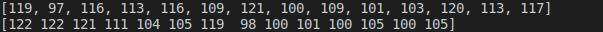

這些最佳化方法比起暴力搜尋可以讓策略更加robust 


基因演算法 :  https://medium.com/geekculture/optimising-trading-strategies-by-using-a-genetic-algorithm-bc90d7ddbefd 

向前優化 :  https://algotrading101.com/learn/walk-forward-optimization/

```
回到半年多前樓主的原帖稍微總結一下：
1. 基因演算法在優化投資策略(即「選股」、「擇時」)確實是很重要且相關的。
2. 基因演算法其實算「最佳化」的方法，所以什麼「模擬退火」、「粒子群(其實是鳥群和魚群)」、「梯次下降」等都是，而「線性規劃」、「二次規劃」、「牛頓法」也是，「向前優化」其實也是，族繁不及備載。基因是「演化類」，常見的是 GA (單目標), NSGA-II (多目標), NSGA-III (很多目標)等。
3. Danny Grove 在一年半前(西洋方格子)的文章，最早提出了使用基因演算法來優化策略的觀點，經過我們Finlab-er的實踐，特別是 TNeagle 在半年前率先使用，到現在我們使用的程度已經進化很多了。
4. 這種進化之所以可能，其實是奠基在韓老師建立的Finlab 資料和API以及很多個策略範例上，開創新的道路通常都是最難的。
5. 世界上的主流討論，看起來還是機器學習上面，包括討論少量參數(節儉原則)、大量參數甚至巨量參數跑出的效能。但我對機器學習在開發策略的成效如何還有待了解。
6. 目前 QuantCon 竟然沒有亞洲的場次，連中國、印度、新加坡也沒有，只偏重在歐美，是不是亞洲的量化人口還不夠多？
7. 至於向前優化部分，因為要切資料集，我也沒去研究這一塊；提出者是 algotrading101 的 Lucas Liew，只能再看有沒有進展。
量化投資其實很有趣的。
```


```
其實基因演算法就是適者生存，如果有學過生物的"育種"會更瞭解這個概念。
簡單說把策略視為個體，選股條件就是基因
一個好策略，一定有好基因
所以從一堆策略，篩選出比較好的策略後進行"雜交"
ex.
甲策略：A、B、C、D
乙策略：E、F、G、H

交配做出甲乙、乙甲策略
甲乙：A、B、G、H
乙甲：E、F、C、D

然後重複篩選和雜交的動作，就可以得到一群有著不錯基因的策略。
展開來講真的可以寫一大篇，核心概念就是上面所說的 "適者生存"。

結論：
這個方法不一定能找到 "最好" 的策略，但是可以找到 "比較好"的策略
前提是有辦法定義什麼是"好策略"
```


## 股市的自然選擇：會進化的策略｜FinLab 讀書會

https://discord.com/channels/897386624067969034/1123838318027755581/1193378774163669103

https://www.youtube.com/live/W-jxEZXu-pQ

我對於"策略的可解釋性"一直不理解為什麼要執著於這件事。首先，人類不是全知全能的。
當人類不是全知全能，就一定有不可解釋的事情，但這並不代表不可解釋的事情不合理，而是目前我們無法解讀。
我PPT上面才會有"存在即合理"這一句話。
其實目前大部分的AI，複雜性都已經超出人類可以解釋的範圍，但這並不代表AI給出的答案不合理(這也是有些人會認為AI有智慧的原因)

再來，GA會執著於某個數字，通常代表那邊就是平衡點。是"目前"基於歷史數據的平衡點，在數據的積累以及時間流動下這個平衡點是會"變動"的。
<@284659625175941121> 說 "感覺是在解空間中硬畫出一條線來擬合訓練資料" 。
其實這一點就是機器學習的目標，只是我們要找到的是"擬合的這條線"和"市場的隨機性"中取得最佳的平衡。
這樣才不會出現"過擬合"
而基因演算法從底層邏輯上就很難過擬合，所以可以不太去關注過擬合這個議題

ex. close.average(20) > close.average(60) 這樣一個條件在機器學習裡面就是2個參數 n種組合。
這樣的解空間真正是無限大，雖然直接限縮解空間範圍，但只要選股條件數量及品質不錯，也可以找到不錯的解。

我自己其實是在研究機器學習的過程中，發現機器學習的難度太大，短時間很難有一個不錯的成果。
所以我抽取機器學習的概念從邏輯底層去找一個簡單好用的替代辦法，所以才有分享的內容。
機器學習:
輸入許多特徵資料=>調參=>建立模型

基因演算法:
利用人類已經研究多年的選股條件將特徵資料先進行預先處理=>簡化調參=>建立模型

簡單來說，這一套就是機器學習的下位替代版。
只是因為引入很多人類已經研究過的經驗，所以可以在初期表現比機器學習好。
其實對我們來說，我們沒有必要去找到最佳的那個解，只要找到"相對"不錯的解然後可以在股市裡賺錢就好。
至於可解釋性，看有沒有經濟學家要拿去寫論文吧。


```
年化報酬率/abs(MDD) * 日索提諾
```


## GA + Vectotbt 

https://www.youtube.com/watch?v=W-jxEZXu-pQ

```py
import numpy as np
import yfinance as yf
import multiprocessing
import time
import vectorbt as vbt
import warnings
from deap import base, creator, tools, algorithms

warnings.filterwarnings("ignore")


def run_strategy_bt(data, fast_ma, slow_ma):
    fast_ma = vbt.MA.run(data, fast_ma)
    slow_ma = vbt.MA.run(data, slow_ma)
    entries = fast_ma.ma_crossed_above(slow_ma)
    exits = fast_ma.ma_crossed_below(slow_ma)
    return vbt.Portfolio.from_signals(data, entries, exits, init_cash=100)


# 定義適應度函數
def trade_fitness(individual, data):
    sma1, sma2 = individual
    if sma1 < sma2:
        fast_ma = sma1
        slow_ma = sma2
    else:
        fast_ma = sma2
        slow_ma = sma1

    pf = run_strategy_bt(data, fast_ma, slow_ma)
    returns_stats = pf.returns_stats(column=10, settings=dict(freq="d"))
    Annualized_Return = returns_stats["Annualized Return [%]"]
    Max_Drawdown = returns_stats["Max Drawdown [%]"]
    Sortino_Ratio = returns_stats["Sortino Ratio"]
    # print(Annualized_Return)
    # print(Max_Drawdown)
    # print(Sortino_Ratio)
    fitness = (Annualized_Return / abs(Max_Drawdown)) * Sortino_Ratio
    if np.isnan(fitness):
        fitness = 0

    print(
        f"pid: {multiprocessing.current_process().pid}, individual: {individual}, fitness: {fitness}"
    )
    return (fitness,)


if __name__ == "__main__":
    # 下載股票歷史數據
    ticker = "AAPL"
    data = yf.download(ticker, start="2020-01-01", end="2023-04-30")
    # fast_ma = vbt.MA.run(data, 10)
    # slow_ma = vbt.MA.run(data, 50)
    # entries = fast_ma.ma_crossed_above(slow_ma)
    # exits = fast_ma.ma_crossed_below(slow_ma)
    # pf = vbt.Portfolio.from_signals(data, entries, exits, init_cash=100)
    # returns_stats = pf.returns_stats(column=10, settings=dict(freq="d"))
    # print(data.head())
    # input()
    # 設置基因演算法參數
    creator.create("FitnessMax", base.Fitness, weights=(1.0,))
    creator.create("Individual", list, fitness=creator.FitnessMax)

    """
    在這個示例中,我們首先定義了交易策略的適應度函數 trade_fitness。這個函數計算了四個移動平均線的值,並根據它們的交叉關係生成交易訊號。然後,它計算了基於這個交易訊號的策略收益。適應度函數的輸出是策略的總收益。
    接下來,我們設置了基因演算法的參數,包括個體表示、交叉、變異、選擇等操作。個體由四個整數表示,分別對應四個移動平均線的天數,範圍為 5 到 250 天。
    然後,我們執行基因演算法優化,輸出了最優解及其適應度值(總收益)。
    運行這個程式碼,您將獲得最佳的四個移動平均線天數,以及使用這些天數時的最大策略收益。
    您可以根據需要調整適應度函數、個體表示等,以找到更複雜的交易策略。此外,您還可以添加其他約束條件,例如最大回撤等,使得優化更加全面。
    """
    toolbox = base.Toolbox()
    toolbox.register("attr_int", np.random.randint, 5, 100)

    toolbox.register(
        "individual", tools.initRepeat, creator.Individual, toolbox.attr_int, n=2
    )
    toolbox.register("population", tools.initRepeat, list, toolbox.individual)
    toolbox.register("evaluate", trade_fitness, data=data["Close"])
    toolbox.register("mate", tools.cxTwoPoint)
    toolbox.register("mutate", tools.mutUniformInt, low=5, up=100, indpb=0.2)
    toolbox.register("select", tools.selTournament, tournsize=3)

    """
    創建一個進程池,裡面有8個工作進程
    使用toolbox.register("map", pool.map)將pool.map函數註冊為toolbox中的"map"函數。
    這樣在評估個體時,就會使用pool.map進行並行計算。
    在優化結束後,使用pool.close()關閉進程池,並使用pool.join()等待所有工作進程結束。
    """
    pool = multiprocessing.Pool(processes=8)
    # 使用toolbox.register將pool.map註冊為"map"函數
    toolbox.register("map", pool.map)

    # 執行基因演算法優化
    pop = toolbox.population(n=100)
    hof = tools.HallOfFame(1)
    stats = tools.Statistics(lambda ind: ind.fitness.values)
    stats.register("avg", np.mean)
    stats.register("std", np.std)
    stats.register("min", np.min)
    stats.register("max", np.max)

    start_time = time.time()
    pop, log = algorithms.eaSimple(
        pop,
        toolbox,
        cxpb=0.5,
        mutpb=0.2,
        ngen=100,
        stats=stats,
        halloffame=hof,
        verbose=True,
    )

    # 關閉進程池並等待所有結果
    pool.close()
    pool.join()
    end_time = time.time()
    print("Time taken: ", end_time - start_time)

    # 輸出最優解
    best_ind = hof.items[0]
    print("Best individual: ", best_ind)
    print("Best fitness: ", best_ind.fitness.values[0])

    sma1, sma2 = best_ind
    if sma1 < sma2:
        fast_ma = sma1
        slow_ma = sma2
    else:
        fast_ma = sma2
        slow_ma = sma1

    pf = run_strategy_bt(data["Close"], fast_ma, slow_ma)
    returns_stats = pf.returns_stats(column=10, settings=dict(freq="d"))
    print(returns_stats)
    stats = pf.stats(column=10, settings=dict(freq="d"))
    print(stats)
```

## GA_Six_FA_Finlab

```python
from finlab import data
from finlab.backtest import sim
from functools import reduce
from deap import base, creator, tools
import json
import finlab
import numpy as np
import pandas as pd
import random
import multiprocessing
import warnings

warnings.filterwarnings("ignore")


def eval(index_list, df_list, eval_dict):
    # Cache:
    id = "".join([str(value) for value in index_list])
    if id in eval_dict:
        return eval_dict[id]
    else:
        # Filter the MyClass instances which are selected (index == 1)
        selected_dfs = [df for index, df in zip(index_list, df_list) if index == 1]

        # If no DataFrames are selected, return an empty DataFrame
        if not selected_dfs:
            result = pd.DataFrame()
        else:
            # Perform the intersection operation on the selected DataFrames using reduce
            result = reduce(lambda x, y: x & y, selected_dfs)

        if result.empty:
            value = 0
        else:
            # 年化報酬率 (daily_mean)
            # 年化夏普率 (daily_sharpe)
            # 年化所提諾率 (daily_sortino)
            # 最大回撤率 (max_drawdown)
            report = sim(result, resample="W", market="TW_STOCK", upload=False)
            日索提諾 = report.get_stats()["daily_sortino"]
            max_drawdown = report.get_stats()["max_drawdown"]
            daily_mean = report.get_stats()["daily_mean"]
            print(f"日索提諾: {日索提諾}")
            print(f"最大回撤: {max_drawdown}")
            print(f"年報酬: {daily_mean}")
            value = daily_mean / abs(max_drawdown) * 日索提諾
            print(f"fitness value: {value}")
            # metrics = report.get_metrics()
            # value = (
            #    metrics["profitability"]["annualReturn"]
            #    / abs(metrics["risk"]["maxDrawdown"])
            # ) * metrics["ratio"]["sortinoRatio"]

        eval_dict[id] = (value,)
        return (value,)  # Return a tuple


def main(Population_size, Generation_num, Threshold, df_list):
    # Initialization
    Cond_num = len(df_list)

    # Creator
    creator.create("FitnessMax", base.Fitness, weights=(1.0,))
    creator.create("Individual", list, fitness=creator.FitnessMax)

    # Toolbox
    toolbox = base.Toolbox()
    # Attribute generator
    toolbox.register("attr_bool", random.randint, 0, 1)
    # Structure initializers
    toolbox.register(
        "individual", tools.initRepeat, creator.Individual, toolbox.attr_bool, Cond_num
    )
    toolbox.register("population", tools.initRepeat, list, toolbox.individual)

    # Operators
    num_cpus = multiprocessing.cpu_count() - 1
    pool = multiprocessing.Pool(processes=num_cpus)
    toolbox.register("map", pool.imap)

    # Use Manager to create a shared dictionary
    manager = multiprocessing.Manager()
    eval_dict = manager.dict()

    # Pass eval_dict to the evaluate function
    toolbox.register("evaluate", eval, df_list=df_list, eval_dict=eval_dict)
    # 交配
    # cxOnePoint: 隨機選取一個點，將這個點之後的基因交換
    # cxTwoPoint: 隨機選取兩個點，將這兩個點之間的基因交換
    # cxUniform: 對每個基因以 indpb 的機率進行交換
    toolbox.register("mate", tools.cxTwoPoint)
    # 變異
    # mutFlipBit: 對每個位元以 indpb 的機率進行反轉 0->1, 1->0
    toolbox.register("mutate", tools.mutFlipBit, indpb=0.05)
    # 選擇
    # selTournament: 隨機選取 tournsize 個個體，再從這 tournsize 個個體中選擇適應度最好的個體
    # SelRoulette: 依照適應度的比例選擇個體
    # selBest: 選擇適應度最好的個體
    toolbox.register("select", tools.selTournament, tournsize=3)

    pop = toolbox.population(n=Population_size)

    # Evaluate the initial population
    fitnesses = list(toolbox.map(toolbox.evaluate, pop))
    for ind, fit in zip(pop, fitnesses):
        ind.fitness.values = fit

    CXPB, MUTPB = 0.5, 0.2
    g = 0

    # Initialize fits list
    fits = [ind.fitness.values[0] for ind in pop]

    while max(fits) < Threshold and g < Generation_num:
        g += 1
        print("-- Generation %i --" % g)

        offspring = toolbox.select(pop, len(pop))
        offspring = list(pool.imap(toolbox.clone, offspring))

        for child1, child2 in zip(offspring[::2], offspring[1::2]):
            if random.random() < CXPB:
                toolbox.mate(child1, child2)
                del child1.fitness.values
                del child2.fitness.values

        for mutant in offspring:
            if random.random() < MUTPB:
                toolbox.mutate(mutant)
                del mutant.fitness.values

        invalid_ind = [ind for ind in offspring if not ind.fitness.valid]
        fitnesses = list(toolbox.map(toolbox.evaluate, invalid_ind))

        for ind, fit in zip(invalid_ind, fitnesses):
            ind.fitness.values = fit

        pop[:] = offspring

        fits = [ind.fitness.values[0] for ind in pop]

        length = len(pop)
        mean = sum(fits) / length
        sum2 = sum(x * x for x in fits)
        std = abs(sum2 / length - mean**2) ** 0.5

        print("  Min %s" % min(fits))
        print("  Max %s" % max(fits))
        print("  Avg %s" % mean)
        print("  Std %s" % std)

    return dict(eval_dict)


if __name__ == "__main__":
    finlab.login(
        ""
    )

    # Data preparation
    close = data.get("price:收盤價")
    monthly_revenue_grow = data.get("monthly_revenue:去年同月增減(%)").fillna(0)
    operating_profit = data.get("fundamental_features:營業利益率")
    net_income_grow = data.get("fundamental_features:稅後淨利成長率")
    eps = data.get("financial_statement:每股盈餘")
    stock = data.get("financial_statement:存貨")
    stock_turnover = data.get("fundamental_features:存貨週轉率").replace(
        [np.nan, np.inf], 0
    )
    season_revenue = data.get("financial_statement:營業收入淨額")
    fcf_in = data.get("financial_statement:投資活動之淨現金流入_流出")
    fcf_out = data.get("financial_statement:營業活動之淨現金流入_流出")

    # Processing
    # Revenue growth
    monthly_revenue_grow_aa = (
        ((monthly_revenue_grow > 0).sustain(6))
        & (monthly_revenue_grow.average(6) > 25)
        & (monthly_revenue_grow.rise())
    )
    # Profit rate
    operating_profit_stable = (
        ((operating_profit.diff() / operating_profit.shift().abs()).rolling(3).min())
        * 100
    ) > -20
    operating_profit_aa_1 = operating_profit_stable & (operating_profit.average(4) > 15)
    operating_profit_aa_2 = operating_profit_stable & (
        (operating_profit.average(4) <= 15)
        & ((operating_profit.average(4) > 10))
        & operating_profit.rise()
    )
    operating_profit_aa = operating_profit_aa_1 | operating_profit_aa_2
    # Profit growth
    net_income_grow_aa_1 = ((net_income_grow > 0).sustain(3)) & (net_income_grow.rise())
    net_income_grow_aa_2 = (net_income_grow > 50).sustain(3)
    net_income_grow_aa = net_income_grow_aa_1 | net_income_grow_aa_2
    # Profit strength
    eps_aa = (eps.rolling(4).sum() > 5) & (eps > 0)
    # Inventory turnover
    stock_low = (
        (stock_turnover <= 0)
        | (stock_turnover > 10)
        | ((stock / season_revenue) <= 0.04)
    )
    # stock_low = ~stock_low
    # stock_low = stock_low.apply(lambda x: -x)
    stock_turnover_stable = (
        stock_turnover.diff() / stock_turnover.shift().abs()
    ).rolling(3).min() * 100 > -20
    stock_turnover_cumulate_loss_gt_m20 = (stock_turnover.fall().sustain(3, 2)) & (
        stock_turnover.pct_change()[stock_turnover.pct_change() < 0].rolling(2).sum()
        * 100
        < -20
    )
    stock_turnover_aa = (
        # (~stock_low)
        stock_low.apply(lambda x: -x)
        & stock_turnover_stable
        & (stock_turnover.average(4) > 1.5)
        # & ~(stock_turnover_cumulate_loss_gt_m20)
        & stock_turnover_cumulate_loss_gt_m20.apply(lambda x: -x)
    )
    # Cash flow
    fcf = fcf_in + fcf_out
    fcf_aa = fcf.rolling(6).min() > 0

    # Moving average
    sma5 = close.average(5)
    sma20 = close.average(20)
    sma60 = close.average(60)
    sma240 = close.average(240)
    long_sma = (close > sma5) & (sma5 > sma20) & (sma20 > sma60) & (sma60 > sma240)

    df_list = [
        monthly_revenue_grow_aa,
        operating_profit_aa,
        net_income_grow_aa,
        eps_aa,
        stock_turnover_aa,
        fcf_aa,
        long_sma,
    ]

    # Example usage:
    Population_size = 30
    Generation_num = 5
    Threshold = 30

    result = main(Population_size, Generation_num, Threshold, df_list)
    print(json.dumps(result, indent=4))
```

---

## 基於遺傳演算法（deap）的配詞問題與deap框架


### 基於deap的程序框架

```python
import numpy as np
from deap import base, tools, creator, algorithms
import random

# 問題定義；定式
creator.create('Fitness...', base.Fitness, weights=(...1.0,)) #　最大化問題
creator.create('Individual', list, fitness=creator.Fitness...)

# 個體編碼；主要依靠人為設計
geneLength=...
toolbox = base.Toolbox()
toolbox.register('個體實現方法的名稱',...)
toolbox.register('individual', tools.initRepeat, creator.Individual, toolbox.個體實現方法的名稱, n=geneLength)
#print(toolbox.individual())#列印檢查個體

#建立種群；定式
N_POP = ...#種群內個體數量，參數過小，則搜尋速度過慢
toolbox.register('population',tools.initRepeat,list,toolbox.individual)
pop = toolbox.population(n=...)#建立一個種群pop
#for ind in pop:#列印一個種群檢查
#   print(ind)

#評價函數；主要依靠人為設計
def evaluate(ind):
    pass
    
#註冊各種工具，人為選擇具體的方法；寫法定式
toolbox.register('evaluate', evaluate)#評價函數
toolbox.register('select', tools...)#選擇
toolbox.register('mate', tools...)#交叉
toolbox.register('mutate', tools...)#突變

#超參數設定；人為根據理論與經驗設定
NGEN = ...#迭代步數，參數過小，則在收斂之前就結束搜尋
CXPB = ...#交叉機率，參數過小，則族群不能有效更新
MUTPB = ...#突變機率，參數過小，則容易陷入局部最優

#開始工作，先對初始的種群計算適應度；定式
invalid_ind = [ind for ind in pop if not ind.fitness.valid]
fitnesses = toolbox.map(toolbox.evaluate,invalid_ind)
for ind ,fitness in zip(invalid_ind,fitnesses):
    ind.fitness.values = fitness
    
#循環迭代，近似定式，但是可以自行增加一些提高遺傳演算法性能的方法
for gen in range(NGEN):
    offspring = toolbox.select(pop,N_POP)#先選擇一次
    offspring = [toolbox.clone(_) for _ in offspring]#再克隆一次，克隆是必須的

    for ind1,ind2 in zip(offspring[::2],offspring[1::2]):#交叉操作
        if random.random() < CXPB:#交叉
            toolbox.mate(ind1,ind2)
            del ind1.fitness.values
            del ind2.fitness.values
    for ind in offspring:#變異操作
        if random.random() <MUTPB:
            toolbox.mutate(ind)
            del ind.fitness.values
    invalid_ind = [ind for ind in offspring if not ind.fitness.valid]#將刪除了適應度的個體重新評估
    fitnesses = toolbox.map(toolbox.evaluate, invalid_ind)
    for fitness, ind in zip(fitnesses, invalid_ind):
        ind.fitness.values = fitness
   #精英選擇策略，加速收斂 
    combinedPop = pop + offspring#將子代與父代結合起來
    pop = tools.selBest(combinedPop,N_POP)#再從子代與父代的結閤中選擇出適應度最高的一批作為新的種群

#顯示演算法運行結果
bestInd = tools.selBest(pop,1)[0]#選擇出最好的個體編號
bestFit = bestInd.fitness.values[0]#最好的個體適應度
print('best solution: '+str(bestInd))#列印解
print('best fitness: '+str(bestFit))#列印適應度

```

 由以上的程序框架可知：
- （1）個體編碼方式、評價函數基本依靠個人根據實際問題設計。
- （2）選擇方法註冊工具、迭代運算等基本是定式。
- （3）迭代運算雖然可以當做定式用，但是適當增加一些諸如精英選擇策略這樣的程式碼可以明顯提高演算法性能。


### 配詞問題

  配詞問題內容比較簡單，比如有個字串‘`woshidaxuesheng`’，希望能用隨機演算法經過尋優將等長的隨機字母序列生成同樣的內容。在遺傳演算法裡就等於是生成一個擁有很多隨機字母個體的種群，經過運算後得到一個個體內容最接近於‘`woshidaxuesheng`’。
  先貼上完整的原始碼，再分析問題。這裡可以看到配詞問題程式碼用了兩種評價函數：一種是將配詞問題轉化為最小化問題，令個體的內容與目標字串差異最小；一種是將配詞問題轉化為最大化問題，令個體的內容與目標字串相同性最強。
  本程式碼將最小化思路程序片段進行了註釋，使用最大化思路程序。

```python
import numpy as np
from deap import base, tools, creator, algorithms
import random

# 問題定義
#creator.create('FitnessMin', base.Fitness, weights=(-1.0,)) #　最小化問題
#creator.create('Individual', list, fitness=creator.FitnessMin)
creator.create('FitnessMax', base.Fitness, weights=(1.0,)) #　最大化問題
creator.create('Individual', list, fitness=creator.FitnessMax)

# 個體編碼
geneLength = 14#字串內有14個字元
toolbox = base.Toolbox()
toolbox.register('genASCII',random.randint, 97, 122)#英文小寫字符的ASCII碼範圍為97~122
toolbox.register('individual', tools.initRepeat, creator.Individual, toolbox.genASCII, n=geneLength)
#print(toolbox.individual())

#建立種群
N_POP = 100#種群內個體數量，參數過小，則搜尋速度過慢
toolbox.register('population',tools.initRepeat,list,toolbox.individual)
pop = toolbox.population(n=N_POP)
#for ind in pop:#列印一個種群檢查
#   print(ind)

#評價函數
#def evaluate(ind):
#    target = list('zzyshiwodedidi')
#    target = [ord(item) for item in target]
#    return (sum(np.abs(np.asarray(target) - np.asarray(ind)))),
def evaluate(ind):
    target = list('zzyshiwodedidi')#需要匹配的字串
    target = [ord(item) for item in target]#將字串內的字元都轉換成ASCII碼
    return (sum(np.abs(np.asarray(target) == np.asarray(ind)))),
    
#註冊各種工具
toolbox.register('evaluate', evaluate)#評價函數
toolbox.register('select', tools.selTournament, tournsize=2)#錦標賽選擇
toolbox.register('mate', tools.cxUniform, indpb=0.5)#均勻交叉
toolbox.register('mutate', tools.mutShuffleIndexes, indpb=0.5)#亂序突變

#超參數設定
NGEN = 300#迭代步數，參數過小，則在收斂之前就結束搜尋
CXPB = 0.8#交叉機率，參數過小，則族群不能有效更新
MUTPB = 0.2#突變機率，參數過小，則容易陷入局部最優

#開始工作，先對初始的種群計算適應度
invalid_ind = [ind for ind in pop if not ind.fitness.valid]
fitnesses = toolbox.map(toolbox.evaluate,invalid_ind)
for ind ,fitness in zip(invalid_ind,fitnesses):
    ind.fitness.values = fitness
    
#循環迭代
for gen in range(NGEN):
    offspring = toolbox.select(pop,N_POP)#先選擇一次
    offspring = [toolbox.clone(_) for _ in offspring]#再克隆一次

    for ind1,ind2 in zip(offspring[::2],offspring[1::2]):#交叉
        if random.random() < CXPB:#交叉
            toolbox.mate(ind1,ind2)
            del ind1.fitness.values
            del ind2.fitness.values
    for ind in offspring:#變異
        if random.random() <MUTPB:
            toolbox.mutate(ind)
            del ind.fitness.values
    invalid_ind = [ind for ind in offspring if not ind.fitness.valid]#將刪除了適應度的個體重新評估
    fitnesses = toolbox.map(toolbox.evaluate, invalid_ind)
    for fitness, ind in zip(fitnesses, invalid_ind):
        ind.fitness.values = fitness
   #精英選擇策略，加速收斂 
    combinedPop = pop + offspring#將子代與父代結合起來
    pop = tools.selBest(combinedPop,N_POP)#再從子代與父代的結閤中選擇出適應度最高的一批作為新的種群

bestInd = tools.selBest(pop,1)[0]#選擇出最好的個體編號
bestFit = bestInd.fitness.values[0]#最好的個體適應度
bestInd = [chr(item) for item in bestInd]#將該個體裡的ASCII碼轉換成字元形式
print('best solution: '+str(bestInd))#列印字元
print('best fitness: '+str(bestFit))#列印適應度，這裡可以看到適應度並不是我們需要的問題的解，僅僅是對解的一種評估得分
```

### 程式設計

#### 個體設計

首先考慮個體是如何設計編碼的。

我們要得到一個與’`zzyshiwodedidi`‘最相近的字串，顯然這個個體也得是個小寫字母的字串，而且長度得和’`zzyshiwodedidi`'相同，所以個體的基因長度肯定是14。
綜上，個體應該是個長度為14的隨機小寫字母列表。

```python
# 個體編碼
geneLength = 14#字串內有14個字元
toolbox = base.Toolbox()
toolbox.register('genASCII',random.randint, 97, 122)#英文小寫字符的ASCII碼範圍為97~122
toolbox.register('individual', tools.initRepeat, creator.Individual, toolbox.genASCII, n=geneLength)
#print(toolbox.individual())
```

小寫英文字母的ASCII碼範圍是97~122，而且ASCII碼肯定是整數，所以隨機函數應該是隨機生成整形（int），所以註冊函數寫成：

```python
toolbox.register('genASCII',random.randint, 97, 122)
```

再將這個註冊函數代入到個體的註冊函數裡面即可。

```python
toolbox.register('individual', tools.initRepeat, creator.Individual, toolbox.genASCII, n=geneLength)
```

#### 評價函數設計

  我們想要評價一個個體和’`zzyshiwodedidi`‘的相似程度，自然要進行比較，字元顯然不方便直接比，但是轉換成ASCII碼（數字）顯然就方便的多。
  於是評價函數的設計思路就是：將目標’`zzyshiwodedidi`'轉化為ASCII碼，然後與個體的基因依次對比（個體本身就是ASCII碼）。

```python
def evaluate(ind):
    target = list('zzyshiwodedidi')#需要匹配的字串
    target = [ord(item) for item in target]#將字串內的字元都轉換成ASCII碼
    return (sum(np.abs(np.asarray(target) == np.asarray(ind)))),
```

使用`ord`函數將字串裡的字元依次轉換為ASCII碼。

```python
	target = list('zzyshiwodedidi')#需要匹配的字串
    target = [ord(item) for item in target]#將字串內的字元都轉換成ASCII碼
```

依次轉換完成後需要依次比對，這裡需要注意一件事，**將目標字串轉換為ASCII碼序列，與直接的隨機數列表個體的資料形式不同**。


  
  

**由上圖可見，第一行個體是列表格式，元素之間用`,`割開；而第二行目標字串轉換完後是矩陣形式，是一個行向量**。
  因此需要將個體使用`np.asarry`函數轉換為矩陣形式：

```python
 return (sum(np.abs(np.asarray(target) == np.asarray(ind)))),
```

  當然只需要轉換個體就行了：

```python
 return (sum(np.abs(target == np.asarray(ind)))),
```

#### 精英選擇策略

精英選擇策略，即在每一輪迭代循環中，將父代與交叉變異後的子代整一塊，形成一個雙倍於之前規模的大種群，隨後在這個大種群中提取出一半適應度最優的個體。
說白了就是父代子代一起評，前一半的全提走，後一半的全踢走。
顯然，這樣的做法會加速收斂，快速得到一個充滿高適應度個體的精英種群。
這個策略以後也可以叫`內卷策略`。

```python
#精英選擇策略，加速收斂 
    combinedPop = pop + offspring#將子代與父代結合起來
```
