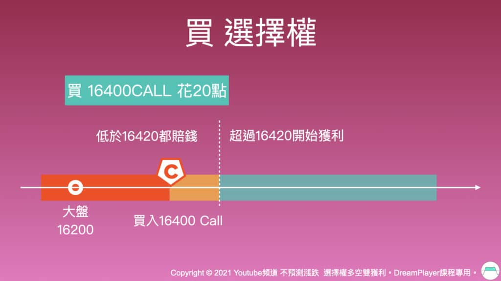
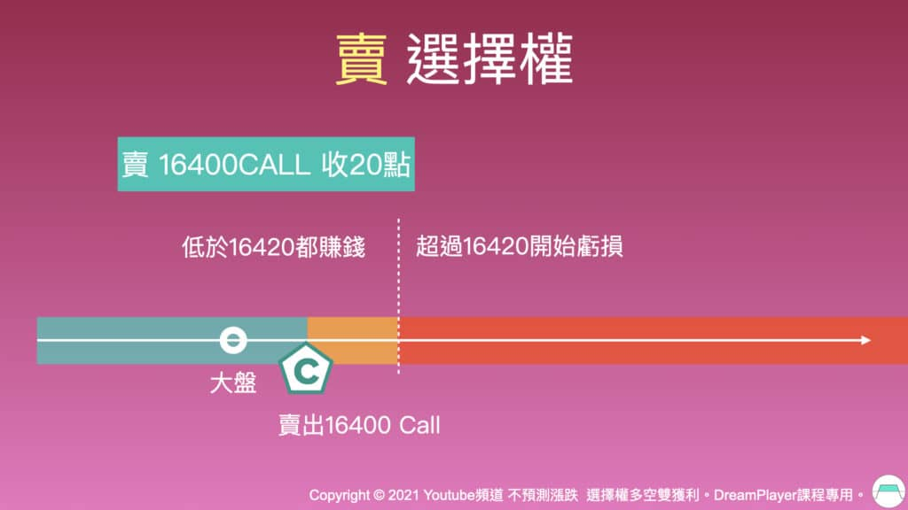
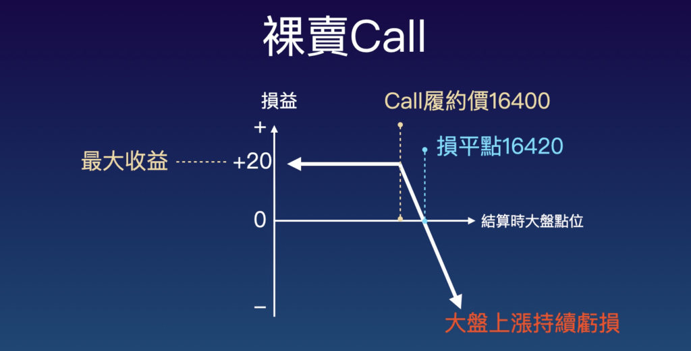
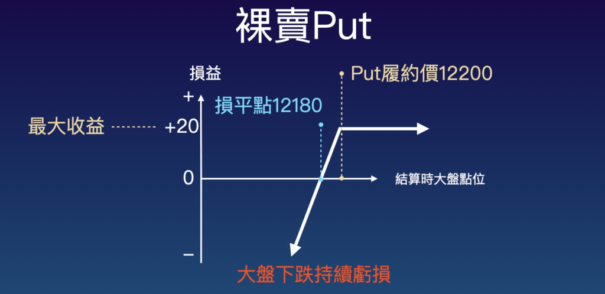
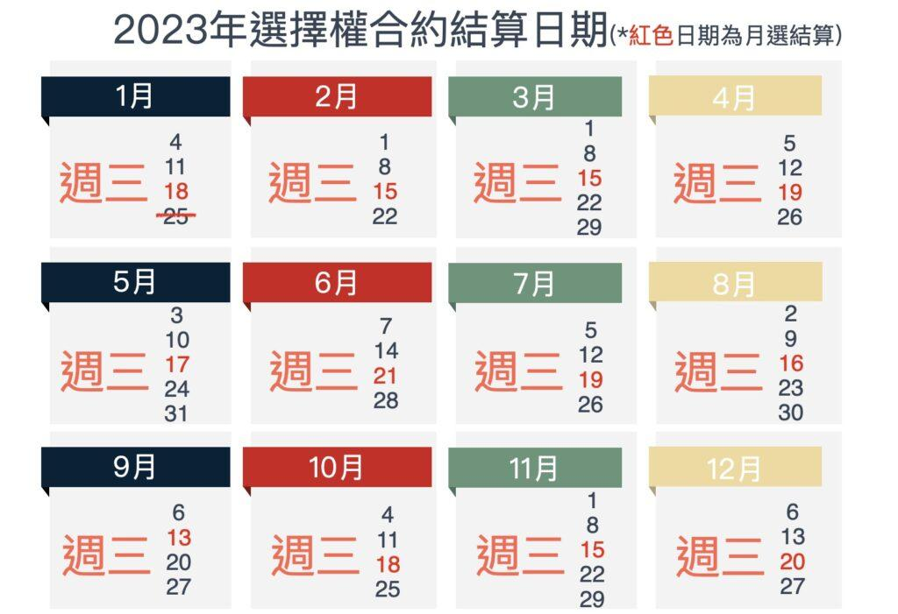
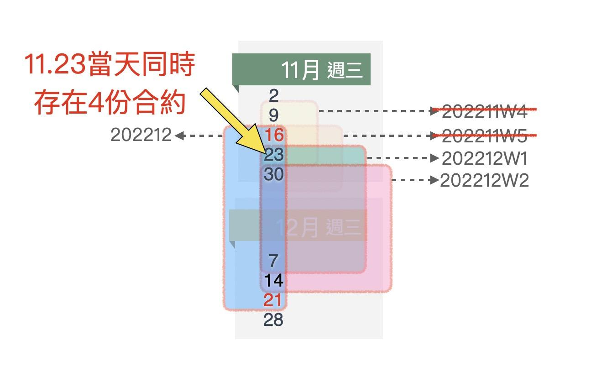

## 買權賣權是什麼？選擇權基本運作與策略運用

出處：https://gooptions.cc/%E9%81%B8%E6%93%87%E6%AC%8A%E6%95%99%E5%AD%B8/#%E7%82%BA%E4%BB%80%E9%BA%BC%E8%A6%81%E6%93%8D%E4%BD%9C%E9%81%B8%E6%93%87%E6%AC%8A%EF%BC%9F%E9%80%A3%E8%82%A1%E7%A5%9E%E5%B7%B4%E8%8F%B2%E7%89%B9%E9%83%BD%E5%9C%A8%E7%8E%A9%EF%BC%81

選擇權（英文Options）**是一種買賣方可於未來看狀況再決定是否要交易的權利，以權利金進行交易**。買方，買進選擇的權利並付出權利金；賣方，賣出選擇權利可收取權利金。買賣兩方在契約約定日期再決定是否執行交易，而這日期就是選擇權結算日。選擇權交易是為了避險而設計，判斷期貨未來價格將上漲可買CALL（買權），判斷會下跌可買PUT（賣權）。

快速瞭解 選擇權 精華重點 key takeaways：

- **選擇權是一種買賣方可於未來看狀況再決定是否要交易的權利，以權利金進行交易**
- **選擇權優勢：降低持倉成本、看錯不一定賠、小金額對沖高風險**
- **交易立場很重要：賣CALL是看漲不過高但不一定是看空、勝率高**
- **選擇權不建議裸賣，用價差單交易可以有效降低風險，提升勝率**
- **臺股選擇權有『週選擇權』與『月選擇權』，週選擇權每週三結算，月選擇權在每個月第3個星期三進行結算，每月結算一次**
- **同時持有買方、賣方部位的CALL和PUT進行策略組合，可提高交易勝率。例如Iron Condor同時賣出CALL和PUT保持中立**

著名投資人Michael Benklifa認為：「交易股票就像是你有一個好工具，而交易選擇權就像是有一整個工具箱。」可見選擇權在金融市場中是十分強大的投資工具！透過本文的選擇權教學，我們將帶你輕鬆入門選擇權投資，瞭解買權賣權的運作方式、看懂選擇權策略圖，打造長期穩定的獲利來源。

## 為什麼要操作選擇權？連股神巴菲特都在玩！

在本文開始之前，也可以先看影音說明，加深學習印象。

### 選擇權投資優勢1：降低持倉成本

股神[巴菲特（Warren Buffett）](https://zh.wikipedia.org/zh-hk/沃倫·巴菲特)其實是選擇權大莊家，從他的公司財報就可以看到，[美股選擇權](https://gooptions.cc/美股選擇權教學/)交易佔巴菲特公司營收不小的部分，而他最常用的作法之一就是「賣-賣權（賣put）」，也就是「看不跌破」。

當巴菲特要買入一家公司股票，他的做法是先賣這家公司股票的賣權（Put），假設現在公司股價100元，巴菲特可能會賣履約價60元的Put，收20元權利金。接著巴菲特著手買入該公司的股票。因為大量買入，股價上漲，賣出的put價值降低後，這20元權利金就是實拿獲利。雖說股價是100元，但巴菲特其實只花了100-20=80元買入，賣選擇權同時也幫助巴菲特大幅降低持倉成本。

### 選擇權投資優勢2：看錯不一定賠

假設大盤在17200，如果判斷臺積電財報數字亮眼、準備上漲，可以賣出臺股選擇權 17000的賣權（賣PUT），當臺積電上漲帶動大盤上漲，賣出的PUT則獲利，降低臺積電現貨持有成本；萬一臺積電未如預期上漲，但是臺股也沒下跌，選擇權結算時大盤點位在賣出的17000PUT之上，這口PUT還是獲利的，可見選擇權策略運用正確，就算看錯方向也不一定會虧損。

## 認識買權賣權（Call / Put）

- 買Call （買-買權）⮕ 判斷指數「**會漲到**」某個點位
- 買Put （買-賣權）⮕ 判斷指數「**會跌到**」某個點位
- 賣Call （賣-買權）⮕ 判斷指數「**不會漲到**」某個點位
- 賣Put （賣-賣權）⮕ 判斷指數「**不會跌到**」某個點位

Call表示買權，Put表示賣權，而在選擇權操作中，所有策略都是由這4個選擇權動作組合而成，以下為你進一步解析：

### **買Call**

判斷指數「會漲到」某個點位，屬於「看多」。例如，現在指數是16000，認為會漲到16200，那就可以買16200Call。

### **買Put**

判斷指數「會跌到」某個點位，屬於「看空」。例如，現在指數是16000，認為會跌到15800，那就可以買15800Put 。

### **賣Call**

判斷指數「**不會漲到」**某個點位。例如，現在指數是16000，認為不會漲到16500，那就可以賣16500Call 。要注意的是，賣Call跟看空、做空是不同的事情，千萬不要覺得賣Call就是看空，賣16500Call就算大盤一天大漲200點，從16100漲到16300，只要沒漲過16500賣Call都是獲利。

### **賣Put**

判斷指數「**不會跌到」**某個點位。例如，現在指數是16000，認為不會跌到15500，那就可以賣15500Put 。同樣地，賣Put 跟看多是不同的事情，千萬不要覺得賣Put 就是看多。我將交易方式、動作意圖和資金列在表格中：

| **交易**                  | **判斷**                       | **資金**                     | **注意事項**                                 |
| ------------------------- | ------------------------------ | ---------------------------- | -------------------------------------------- |
| 買CALL（買 買權）- 為買方 | 判斷指數「**會漲到**」某個點位 | 支出權利金，從帳戶內扣款     | 看多、勝率低                                 |
| 買PUT（買 賣權）- 為買方  | 判斷指數「**會跌到**」某個點位 | 支出權利金，從帳戶內扣款     | 看空、勝率低                                 |
| 賣CALL（賣 買權）- 為賣方 | 判斷指數「**漲不到**」某個點位 | 收權利金，但帳戶內要有保證金 | 看漲不過高但不一定是看空、勝率高、不建議裸賣 |
| 賣PUT（賣 賣權）- 為賣方  | 判斷指數「**跌不到**」某個點位 | 收權利金，但帳戶內要有保證金 | 看漲不破低，不是看多、勝率高、不建議裸賣     |

選擇權交易說明

如果想做空或對沖風險，可參考做空教學 [用期貨空單取代股票放空來對沖虧損風險的方式](https://gooptions.cc/期貨空單/)

------

### 你需要這3個『能幫助交易更穩定』的資訊嗎？

1. 說明波動率指數影片 x2 （**這些影片我從未發布在任何公開管道*）
2. 超優惠開戶管道 x2
3. 選用選擇權策略的評估過程說明影片 x1

[需領取請點此連結](javascript:;)

------

## 選擇權損平點怎麼看？買賣選擇權策略解析

瞭解操作概念要先從「買賣方式」開始理解。以下為你詳細說明：

### 買進買權（買CALL）

買Call 很直覺，因為大家都會買東西，只要一張圖片就可以理解。

買東西就要花錢，當大盤在16200時，買16400Call支出20點（臺幣$1000元），需瞭解以下重點：

- 時機：看漲。買Call是看漲，認為大盤會漲到16400，則買入16400Call。
- 最大虧損：20點。選擇權每週三進行結算，結算時大盤沒漲到16400，則支出的20點權利金歸零，最大虧損為20點。
- 最大獲利：無限。大盤漲上天買Call就賺上天，但勝率極低就是了。
- 損平點：16420。

買方損平點為什麼是16420呢？雖然看對方向買CALL是看大盤漲到16400，但大盤到了16400其實還沒開始獲利，因為一開始花20點買CALL，所以需要大盤繼續漲，把支出的20點權利金都漲到了才是真的開始獲利。從上圖中也可以看到，低於16400的紅色區塊是最大虧損20點，中間橘色區塊是「虧損漸減區」，漲到16420過後的綠色區塊才開始獲利。

P.S. 上述提到的『16200、16400』是履約價；『20點』則是一口的權利金。

### 賣出買權（賣CALL）

知道怎麼買東西，就要知道怎麼賣東西，其實真的很簡單，一樣也是看圖就能理解它的運作機制。

賣16400Call（賣出買權）收20點權利金，賣東西收錢一樣很直覺！同時必須掌握以下重點：

- 時機：看漲不過。賣Call是看漲不過，認為大盤不會漲到16400則賣出16400Call。
- 最大獲利：20點。不管大盤從當初建倉時的16200漲、跌、盤整，只要結算時大盤沒漲過16400，收到的20點權利金全拿。
- 最大虧損：超過16420後無限。無限虧損聽起來好像很可怕，但其實是個很好打破的迷思。只要用價差單進行賣出，除了可以大幅降低保證金需求，還可以完全控制虧損的風險。（歡迎參考：[選擇權價差單是什麼？瞭解價差單概念、目的，打破風險迷思！](https://gooptions.cc/選擇權價差單/)）
- 損平點：16420。

賣出16400Call，表示認為大盤不會漲超過16400，當大盤低於16400都能賺錢，如果漲到16400以上則要開始賠錢給買方，橘色區域是「獲利遞減區」，漲過16420則開始虧損，為什麼是16420才開始虧損？由於賣方是先賣出才收錢，先收了20點，一旦漲超過16400，大盤每漲1點要賠給買方1點，會先從買方那裡收到的20點開始賠，也就是**拿買方自己的錢賠給他**，若是把收到的錢賠完才會賠到本金。

光是這一點「買方vs賣方」的勝率就差很多了，買方要花錢買機會，還要漲到把花掉的錢賺回來才算是真獲利；賣方則是先收錢，若漲到16400，可以先拿收到的錢賠給對方。

於是我們知道了：

**買選擇權要先花錢，賣選擇權可以先收錢**！

## 教你看懂選擇權策略圖，掌握賣方損益計算！

### 裸賣Call損益計算方式

「裸賣」顧名思義就是隻賣Call ，但沒做價差保護。賣一口16400Call ，收到20點權利金。從下圖來看，橫軸是大盤點位，縱軸是損益變化：

- 最大收益：當大盤結算在16400以下，穩拿20點。
- 損平點：當大盤結算在16420整，打平。
- 虧損：當開始往16420以上繼續漲，那就每1點都要賠錢，漲到16500點就賠80點。

**我建議千萬不要裸賣CALL，不僅獲利有限、風險無限，還要押很多保證金，大盤上漲會持續虧損，很可能血本無歸，必須用價差單策略控制風險。**下方影片教你用這兩個方式取代裸賣。

那麼賣call該怎麼賺錢呢？我們延續剛剛的例子：

- 狀況1：賣16400的call，當初跟買方收20點權利金，結算後大盤收盤在16300，選擇權價值為0點，賣方需花0點買回來平倉，則獲利20–0=20點。
- 狀況2：賣16400的call，當初跟買方收20點權利金，結算後大盤收盤在16410，因為大盤漲的比16400call的履約價還要高10點，所以賣方要賠給買方10點。但是當初賣出收的權利金是20點，所以賣方還是獲利，獲利20–10=10點。

### 裸賣PUT損益計算方式

裸賣Put 卻沒有做價差保護，當你賣一口12200Put 收到20點權利金，該如何計算損平點呢？以下帶你一起看選擇權策略圖：

裸賣選擇權策略圖

- 最大收益：當大盤結算在12200以上，穩拿20點。
- 損平點：當大盤結算在12180整，打平。

為什麼損平點是12180呢？因為賣出Put ，當跌破履約價，每跌1點就要賠給買方1點，跌到12180要賠20點，不過一開始權利金就先收了20點，所以拿權利金去賠給買方。**賣出Put 的履約價減掉收到的權利金等於損平點位。**

以下提供50秒影片，為你說明賣Put的獲利方式，幫助您更好理解與記憶！

## 提高勝率的平倉方式教學

選擇權平倉是：賣出選擇權能收權利金，之後花較少的權利金買回來跟原本賣出部位互相沖銷就是平倉。以賣CALL為例說明，有3種狀況CALL權利金都會下降，代表賣方賣CALL可獲利平倉：

1. 大盤下跌，CALL權利金減少
2. 大盤盤整，時間價值降低讓外在價值降低，CALL權利金會減少
3. 波動率降低於是外在價值降低，CALL權利金減少

以上三種狀況賣CALL的賣方都能平倉且獲利。大家都知道獲利平倉，但何時才是適合時機呢？獲利50%時平倉是好時機。

透過數學原理，我在這另一篇文章詳細說明為什麼 [選擇權獲利50%時平倉就是好時機](https://gooptions.cc/選擇權平倉-移除風險提升勝率/)！這樣做可以提升勝率，而且這是有理論依據與數學證明的。

## 臺股選擇權2種合約與選擇權結算

買賣CALL和PUT是選擇權的交易動作，而臺股選擇權有**「雙週選擇權」**與**「月選擇權」**兩種合約供投資人交易：

- **雙週選擇權**每14天結算一次，於每星期三8:45開放新合約交易，直到兩週後的星期三13:25進行結算，所以每個週三都同時有新、舊合約可交易。
- **月選擇權**是在每個月第3個星期三進行結算，每月結算一次。

*注意事項，選擇權結算價是依照大盤點數，也就是[加權指數](https://zh.wikipedia.org/wiki/加權股價指數)進行計算，不是看[臺指期貨大臺、小臺](https://gooptions.cc/期貨交易/)，結算日當天所有買、賣的選擇權合約都要進行結算。臺灣券商會於**每月第1週要結算**的週選合約用W1表示，第2週用W2，以此類推。但是不會有W3，因為月選合約會在當月第3週的星期三進行結算，所以不會有W3合約。

下方列出2023選擇權結算日期總整理，幫您快速掌握交易時間。更多細節可以參考 [選擇權結算日與策略運用](https://gooptions.cc/選擇權結算日/) 說明。

2023年選擇權結算日日期

## 選擇權策略運用

除了單純買、賣CALL或PUT的交易，透過同時持有買方、賣方部位的CALL和PUT進行策略組合，可以幫投資人有效避開追漲殺跌看方向操作，進而提高交易勝率。例如Iron Condor（中文：鐵兀鷹）是選擇權最早出現的策略之一，透過同時賣出CALL和PUT保持中立。

常見的[選擇權策略](https://gooptions.cc/category/strategy/)與使用時機：

- 當[價平和](https://gooptions.cc/價內價外/)高、震幅低：使用[中立策略Iron Condor](https://gooptions.cc/category/learn-options-trading/50秒學1招/選擇權策略運用iron-condor/)，維持中立賺取時間價值。臺股2020年之前適合。
- 當價平和高、震幅高：適合使用[大區間進場策略](https://gooptions.cc/選擇權策略教學-大區間策略/)，賺波動價值。臺股2021年走勢適合。
- 當價平和低、震幅高：[雙買+小臺進場策略](https://gooptions.cc/courses/選擇權搭配期貨策略『雙買＋小臺』/)可以大幅交易提昇盈虧比。臺股2021年Q3～2022年Q2適合。
- 偏多策略 [跨合約賣權多頭搭配賣CALL](https://gooptions.cc/賣權多頭搭配買權空頭策略/) 策略。時機簡單明瞭新手適用。

## 2023年中立策略Iron Condor隆重回歸

2023了，邁入新的一年，今年主軸是開發自動化交易機器人，目前已經完成策略初步回測階段，成效非常好，目前有2個策略回測2020~2022的數據，都有傑出表現。我先說在回測過程中意外發現的事情。

上述說到，2020開始的後疫情時期臺股走勢發生變化，我比較少用IRON CONDOR，但在開發交易機器人的過程意外發現，過去兩年期間，週一週二使用iron condor績效出乎意料好，這邊的好不是幾十上百倍回報，而是固定週一或週二在適當時機與點位做iron condor，穩穩做回測數據是能保持長期穩定獲利。

以前中立策略Iron Condor習慣是週三開始建倉，維持中立把時間價值賺起來，遇到危險則調整部位，沒想過是到接近結算的週一才建倉，完全出乎意料。

知道我說『中立策略Iron Condor隆重回歸』的原因後，我帶你好好認識這個策略，不管是新手或是老手，都必須來瞭解這個選擇權最早被發明出來的策略，學會後，再看3種 iron condor分別如何進場建倉。

Iron Condor的做法是同時賣出CALL也賣出PUT，同時看大盤漲不過高點也跌不破低點。假設大盤在15000，同時賣15200 CALL和14800PUT，接下來，不管是從15000開始的漲跌或盤整，結算時大盤落在這個400點的區間中，你都獲利，這就是維持中立的意思。

當你保持中立，讓大盤在這400點區間中上下走，你將很能好好避開典型散戶的追漲殺跌心態。

### 3種iron condor建倉方式

中立策略Iron Condor建倉方式總結有3種：

1. **對稱Iron Condor 先做再說**：不管當下狀況是有趨勢還是盤整，直接在大盤往上和往下一樣距離履約價建倉賣出CALL和PUT價差單，把大盤夾在正中間。
2. **有明顯趨勢時建倉**：可透過順勢或逆勢建立出第一邊，接著找相近的delta建立第二邊，做動態Iron Condor。這個狀況主要是用在當下可能有明顯的趨勢，但是也不想只做單邊、不想押注單邊。
3. **看支撐壓力建倉**：大盤移動過程中，用自己的方式判斷支撐、壓力點。接著，在壓力點往後N檔，可能100點、150點或200點，挑選一個合適的履約價賣出第1組價差單，接著再建立另外一邊價差單做對稱位置Iron Condor。

## 選擇權也有夜盤交易

- 臺股期貨與選擇權一般交易時段：**08:45~13:45**
- 臺股夜盤時段是：**15:00~次日05:00**

**在夜盤時段都可交易選擇權**：政府設立夜盤目的是讓投資人多一個避險管道。投資人能於夜盤進行交易。臺指期夜盤是跟著國際情勢波動，而夜盤主要交易量以專業投資人的自動交易程式為主。用手機APP可以看到夜盤期貨與選擇權報價，選『臺指近”全”』即可。細節可以參考 [選擇權夜盤避險方式教學](https://gooptions.cc/臺股夜盤/)。

## 選擇權建倉與平倉系統操作教學

選擇權建倉與平倉可以透過多次IOC功能，由電腦監測價差點數並自動連續嘗試建倉直到成交為止（就是洗單），多次IOC是選擇權交易人必用工具。

我們可以善用[選擇權多次IOC下單功能](https://gooptions.cc/選擇權夜盤用多次ioc/)來進行自動建倉與平倉，大幅降低盯盤時間。下方影片是多次IOC系統操作手把手教學。

## 認識Put Call Ratio

**[選擇權 Put Call Ratio](https://gooptions.cc/put-call-ratio/)（又寫做 P/C Ratio）是**：把當日選擇權 Put未平倉量 除以 Call未平倉量。從選擇權賣方角度看，P/C Ratio數值越大通常看成偏多指標，因為Put未平倉量比Call未平倉量多，可以推斷賣Put多，更不容易跌破支撐；如果P/C Ratio越小則相反，代表賣CALL較多，看上漲遇壓不容易突破。賣出選擇權需壓保證金，賣方需要準備較多資金，所以Put Call Ratio是從賣方風險角度進行解讀。

## 選擇權教學結論

1. 買選擇權要付出權利金，賣選擇權則收權利金。
2. 買方要大漲、大跌才有機會以小博大，因為除了要看對方向，還要把付出的權利金賺回來。
3. 買方付出權利金，就算看對方向也可能賠錢。
4. 賣方當莊家，先收權利金，就算看錯方向也可能賺錢。
5. 千萬不要裸賣選擇權。可透過同時持有買方賣方部位搭配使用，用交易策略提升勝率。

## 說人話的選擇權課程｜一步步瞭解選擇權運作，打造長期穩定獲利

長期經營並製作中文市場最專業的選擇權教學網站，多年來我產出超過150個教學影片並回覆上千則留言，讓我完全清楚新手交易時遇到的問題與解決方法；我知道怎麼進行教學，最能幫助大家快速上手選擇權交易。**今年是課程持續更新的第3年了，一次加入，永久更新**！

幾年前自己默默交易著選擇權，後來因為經營網站和YT頻道，開始認識一些業界前輩，有了更多交流。過程中學到很多選擇權策略，讓我能幫學員把這堂 說人話的選擇權課程 持續更新、優化。

> **最新動向！跟業界高手羊叔討論，我把『雙買＋小臺』從原本的策略操作，延伸出更多配置來提高勝率，並免費更新給大家！**

## 選擇權常見問題QA

**為什麼要操作選擇權？**

一是選擇權可以降低持倉成本，二是即使看錯，也不一定賠。假設大盤在17200，看臺積電上漲帶動大盤往上，可以賣出臺股選擇權 17000的賣權（賣PUT）同時買入臺積電。
萬一臺積電未如預期上漲，但臺股也沒下跌，結算時大盤點位在賣出的17000PUT之上，這口PUT還是獲利的：看錯也沒賠，還能降低臺積電持倉成本。

**選擇權損平點怎麼看？**

選擇權損平點計算方式：把履約價加上支出的權利金即是損平點。例如：買東西要花錢，當大盤在16200時，認為大盤會漲到16400，買進16400Call支出20點（臺幣$1000元），此時損平點是16420，最大虧損為20點，最大獲利為無限，但勝率低就是了。

**裸賣是什麼？**

「裸賣」顧名思義就是隻賣Call ，但沒做價差保護。交易人可以用『價差單』保護部位控制風險。

**雙週選和月選的差別？**

**雙週選擇權**每週三結算並有新的週合約，所以每個週三都同時有新、舊合約可交易；**月選擇權**是在每個月第3個星期三進行結算。市場上有時候會同時存在高達4份合約。以2022.11.23（三）為例，有：當天要結算的舊合約、當天新雙週選合約、將於下個週三結算的合約和12月的月選合約（如下圖）。

**怎麼建倉和平倉？可以掛單嗎？**

選擇權建倉與平倉可以掛單，需透過多次IOC功能，由電腦監測價差點數並自動連續嘗試建倉直到成交為止（就是洗單），多次IOC是選擇權交易人必用工具。