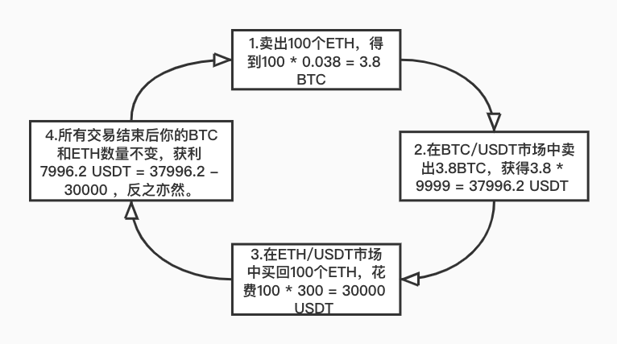

# 三角套利策略

## 策略說明

三角套利又叫間接套利或多邊套利，起源於外匯市場中利用交叉匯率定價錯誤進行的套利。

**所謂三角套利，是一種引入三種貨幣的套利手段。它利用三種外匯對合理交叉匯率的暫時性偏離來實現套利。理論上，如果我們擁有很低延遲的下單平臺，並且可以獲得較低的買賣價差，那麼我們有機會實現無風險套利**。

三角套利在數字貨幣市場同樣適用，通常情況下，數字貨幣之間的匯率與其相對應的美元價格相關。但由於數字貨幣市場波動性較強，部分交易所由於流動性不足等各種原因，會造成某些時刻，**合成交叉價格和市場價格的暫時偏離**，當這種偏離足夠抵消我們的交易成本時，我們便可使用三角套利方法實現無風險利潤。

**適用情況**：行情有較大波動時，不同交易標的漲跌幅不同導致的不同交易對之間的價格變動之後。

**舉個例子**，現貨市場現有這樣三個交易對：BTC/USDT，ETH/USDT，ETH/BTC。

假設前提是：市場中的手續費為零:

BTC/USDT買1 = 9999 USDT，賣1=10000 USDT；

ETH/USDT買1 = 299 USDT，賣1 = 300 USDT；

ETH/BTC買1 = 0.029901 BTC，賣1 = BTC 0.03001 BTC。

我們根據BTC/USDT以及ETH/USDT的現價計算出ETH/BTC的現價，計算後得知ETH/BTC的理論買1 = 0.029902 BTC，賣1 = 0.03000 BTC，與市場現價基本吻合。

若某時刻價格出現波動，**ETH/BTC買1變為0.038 BTC，賣1變為0.039 BTC，另外兩個交易對價格不變**。

最終，所有盈虧均反映在USDT上，我們在市場行情的波動下，利用價差實現了三角套利。

**優勢**：受交易標的價格漲跌影響較小，無行情劇烈變動導致的大額虧損，總體風險較小。

**劣勢**：掛單變動導致價格滑點；交易存在手續費成本；可能存在套利後未及時兌換成穩定幣，持有幣種價格下跌導致虧損的風險；受交易資料延遲以及交易所訂單撮合性能影響較大。

**此外，KuCoin擁有level3等級的交易資料、極優的撮合引擎，以及對api使用者提供特別的手續費折扣，極大程度的減少了你在策略實施時的劣勢，同時提供sandbox環境作為資料測試支撐，幫助你規避風險。**

**請注意，任何策略在使用時需要做好風險管理，如果你想在實際環境中利用策略獲得穩定的盈利，我們希望你能夠在sandbox環境配合其他參數或是策略進行測試調整，以使你能夠達到目的，我們也非常期待你能分享你的測試資料以及獨到的見解。**

**當然，如果這個過程中，你遇到任何問題需要幫助亦或是有賺錢的策略想要分享，請在ISSUE中反映，我們會努力及時響應。**

**如果你對該策略有興趣，請點選右上角star，我們會根據star個數來衡量策略的受歡迎程度和後續最佳化優先順序，你也可以點選右上角watching通過接收更新通知來持續關注該項目**。

## 比特幣怎麼低風險套利？不知道這6點不要買比特幣（建議收藏）

先說結論：

**1.比特幣套利不是騙局，但是，比特幣套利機會很少。**

**2.收費教你比特幣搬磚套利的100%是騙子，別問我為什麼知道。**

**3.拿不準時，記得翻翻我這篇文章（文章略長，可以先收藏）。**

OK，下面我們進入正題，比特幣套利方法有很多種，一般人我不告訴他。常見的有現貨搬磚、期現對沖、期期對沖、跨平臺合約對沖、跨品種套利、大週期套利（適合小白）。

------

（1）現貨搬磚

什麼是現貨交易？一手交錢，一手交貨。比如你去菜市場買菜，這就是一種現貨交易。

由於比特幣在不同交易所存在價差，這就產生了搬磚套利的概念。就好像同樣的土豆超市1斤賣5塊，而菜市場1斤才2塊，於是你可以從菜市場買土豆，賣給超市，這便是套利原理。具體到比特幣來說，現貨搬磚的方法有兩個：

- 在A平臺買入[比特幣](https://www.bixiaobao.com/cn/coinlist/bitcoin)，在B平臺賣出。好處是風險低，缺點是手續費高，搬磚一次十分麻煩，利潤低。
- 在A和B兩個平臺同時存入比特幣和USDT，在價格低的平臺買入比特幣，價格高的平臺賣出比特幣。這種方法的缺點是資金佔用大，有時需要承擔一定的波動風險。

（2）期現對沖

期現對沖也是一種常見的比特幣套利方法，這種方法的好處是風險低，效率高，我見過牛逼的策略年化超過100%，回撤才百分之幾，缺點是門檻略高，一般人玩不了。

由於比特幣期貨和現貨之間常常存在價差，因此產生了套利機會。什麼是比特幣期貨？大家可以把期貨理解成一種可以賣出的品種，舉例，假如幣小寶判斷未來比特幣價格下跌，即使我手裡沒有比特幣，也可以賣出，這便是期貨交易。（要是不理解期貨相關概念，建議先收藏文章）

- 期現對沖的基本方法是：在某一價位買入比特幣，同時在比特幣期貨賣出比特幣。當比特幣期貨價格低於現貨價格時，平倉期貨，同時賣出比特幣；當比特幣現貨價格高於期貨時，賣出現貨，平掉期貨。
- 舉例，幣小寶在6萬塊的位置買入了1枚比特幣現貨，同時在該價位賣出1枚比特幣期貨。10天以後，比特幣現貨跌至5.2萬，而比特幣期貨卻跌至5萬。賣出現貨，幣小寶虧損0.8萬；平倉期貨，幣小寶賺了1萬。一來一去，賺了0.2萬。

（3）期期對沖（交割合約）

期期對沖是利用不同期貨品種進行套利。比特幣期貨分為永續合約和交割合約。交割合約又分本週，次周，季度，次季度。由於不同合約間差價不同，而短期合約都會涉及到交割從而產生了套利機會。

- 比如比特幣本週合約5萬塊，指數5.2萬，季度5.5萬。即可做多本週，等比例做空季度。等交割時平倉獲利即可。

期期對沖需要非常專業的水平，建議慎重參與。

（4）跨平臺合約對沖

這種方法是針對永續合約的。幣小寶參與過一段時間，個人覺得風險收益比較低。

與現貨類似，不同平臺之間的永續合約也存在一定價差。

- 可以在價格低的平臺做多比特幣永續，價格高的平臺做空比特幣永續，待價格回歸後平倉即可。

（5）跨品種套利

跨品種套利主要是指比特幣不同交易對之間的套利，有時也稱三角套利。比如BTC/USDT、BTC/ETH、ETH/USDT這三個交易對之間由於行情波動存在套利機會。

- 舉例，BTC/USDT=10000；BTC/ETH=50；ETH/USDT=220
- 此時，買入BTC,花費10000美金，之後將BTC全部換成50ETH，最後再將ETH賣出50*220=11000。這筆交易獲利1000美金。

不過，實際交易中這種機會比較少，需要碰運氣，這種方法的優勢是風險非常低。

（6）大週期套利（適合小白）

很多人看了上面的幾點，還是不明白怎麼進行比特幣套利。下面講一種非常簡單的套利方法，也就是大週期套利。

這個方法是幣小寶獨家首創哈。先說這個方法的缺點：持有週期長（3~6個月或更長），交易機會少（1年1次），好處是操作簡單，風險可控，適合小白。

- 大週期套利原理是：比特幣價格一般會圍繞長期開採成本大幅波動。當比特幣價格大幅低於開採成本時，果斷買進，高於開採成本時，賣出。
- 舉例：比特幣在2018年12月至2019年3月之間價格小於3萬，而當時最好的礦機挖一枚比特幣都得4萬多，因此，可以果斷買入。而比特幣歷史價格也顯示，在這一區域買入獲利的概率非常高。

unnamed.png

而今年的3月份市場大跌，比特幣一度跌到3.8萬，再次出現了一次非常強烈了買入機會。如果你不知道怎麼看挖礦成本，還有一個辦法是，根據比特幣歷史K線判斷。

- 當比特幣價格低於周線MA256時，選擇買入，高於MA256時，賣出。

------

總結，目前市場確實存在很多比特幣套利策略，但是萬變不離其宗，套利的本質是價差。與一般的炒幣相比，套利風險低，吸引了大量的專業玩家介入。目前市場一般都是程序化套利，類似於股票行業的高頻交易。因此，對於一般人門檻較高。比特幣套利確實也不乏大牛，一年幾倍時有發生，但那都是常人難以企及的高度。幣小寶認為，大週期套利雖然交易機會少，但是好在門檻低。

總之，要想對比特幣套利深入瞭解，還需要在實踐中進行提升，切勿一知半解盲目投資，**否則可能遇到各種名義的搬磚套利騙子**（比如至今仍然存在的火幣搬磚套利騙局）。本文主要拋磚引玉，期待大家在比特幣投資方面取得更大的成就。