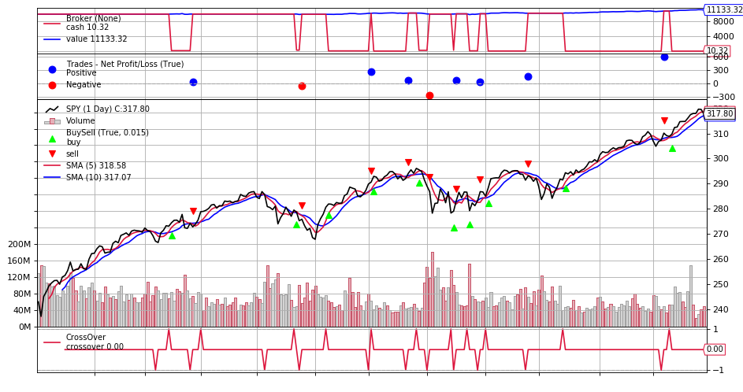
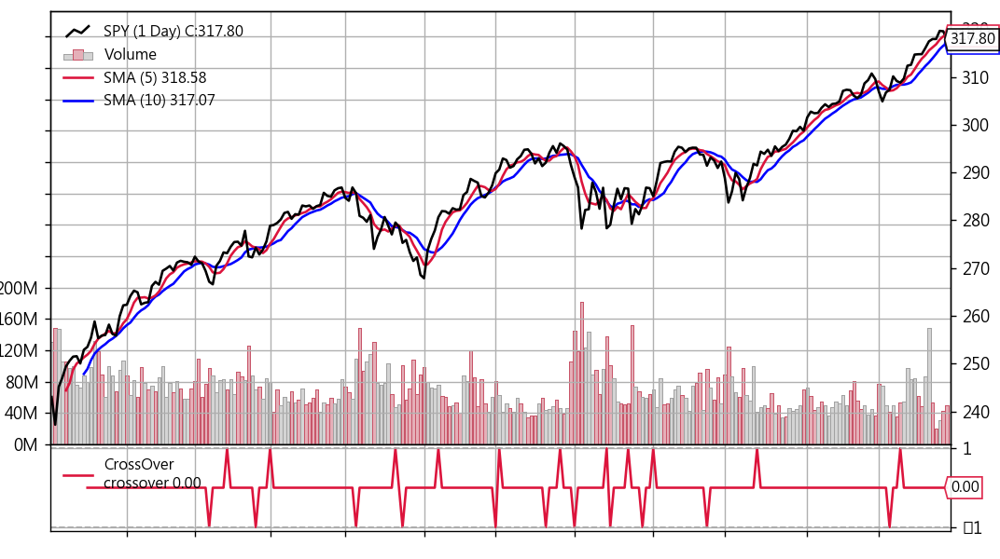
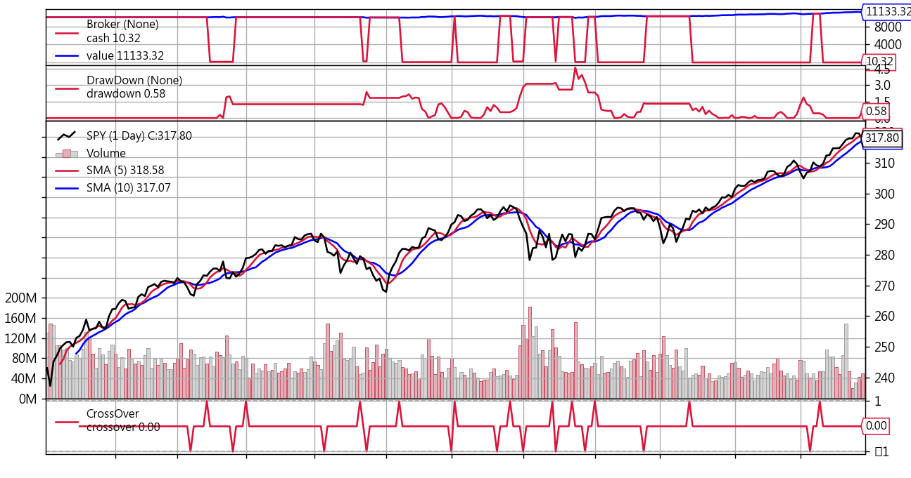

## Observers模組

還記得在Day10均線交叉策略看到的這張圖嗎？從上到下分成4個區塊(Cash and Value/Trade/BuySell/CrossOver)，之前有分別講一下這4個區塊的功能，這篇則是說明這些區塊是怎麼呼叫出來的，以及這些區塊是否可以增加更多資訊或是刪減一些區塊。


先來看一下[document](https://www.backtrader.com/docu/observers-and-statistics/observers-and-statistics/)：

> All backtrader sample charts have so far had 3 things plotted which seem to be taken for granted because they are not declared anywhere:
>
> - Cash and Value (what’s happening with the money in the broker)
> - Trades (aka Operations)
> - Buy/Sell Orders
>
> They are Observers and exist within the submodule backtrader.observers. They are there because Cerebro supports a parameter to automatically add (or not) them to the Strategy:
>
> - `stdstats (default: True)`

所以如果要把Cash & Value/Trades/BuySell的內容刪除，只要在cerebro的部份修改成下面這行就好：

```python
cerebro = bt.Cerebro(stdstats=False)
```

就會得到下面這張圖，只剩下股價走勢、長短均線、均線交叉訊號。


那如果想要把Cash & Value的部份也納入觀察，可以單獨增加這個區塊，只要在cerebro的部份改成：

```python
import math
cerebro = bt.Cerebro(stdstats=False)
# 加上下面這一行
cerebro.addobserver(bt.observers.Broker)
cerebro.adddata(data)
cerebro.addstrategy(SmaCross)
cerebro.run()
cerebro.plot()
```

或是再加上DrawDown圖(每日損失)：

```python
...
cerebro.addobserver(bt.observers.Broker)
# 加上下面這行
cerebro.addobserver(bt.observers.DrawDown)
...
```



如果想把Drawdown的部份，用文字印出來，則可以在strategy的部份，加上兩行code：

```python
class SmaCross(bt.Strategy):
    ...
    def next(self):
        ...
        # 加上下面這兩行
        self.log('DrawDown: %.2f' % self.stats.drawdown.drawdown[-1])
        self.log('MaxDrawDown: %.2f' % self.stats.drawdown.maxdrawdown[-1])
        ...
```

執行回測時就會印出每日DrawDon及MaxDrawDown，如下

```
2019-01-16, DrawDown: 0.00
2019-01-16, MaxDrawDown: 0.00
2019-01-17, DrawDown: 0.00
2019-01-17, MaxDrawDown: 0.00
...
2019-03-29, DrawDown: 1.26
2019-03-29, MaxDrawDown: 1.97
2019-04-01, DrawDown: 1.26
2019-04-01, MaxDrawDown: 1.97
...
2019-12-27, DrawDown: 0.00
2019-12-27, MaxDrawDown: 4.60
2019-12-30, DrawDown: 0.00
2019-12-30, MaxDrawDown: 4.60
```

從上面幾個例子來看，backtrader可以根據個人需求去調整觀測數據的模板，算是蠻彈性的機制，因為不同策略要看的指標往往會有些不同。

**本篇總結**
那這篇就先寫到這，backtrader這幾篇寫了交易策略、下單部位控制、數據觀測模板，接下來就可以來介紹python串接券商API下單，因為我自己是用IB(Interactive Brokers)交易，所以會以IB的API作為範例，請繼續收看囉。