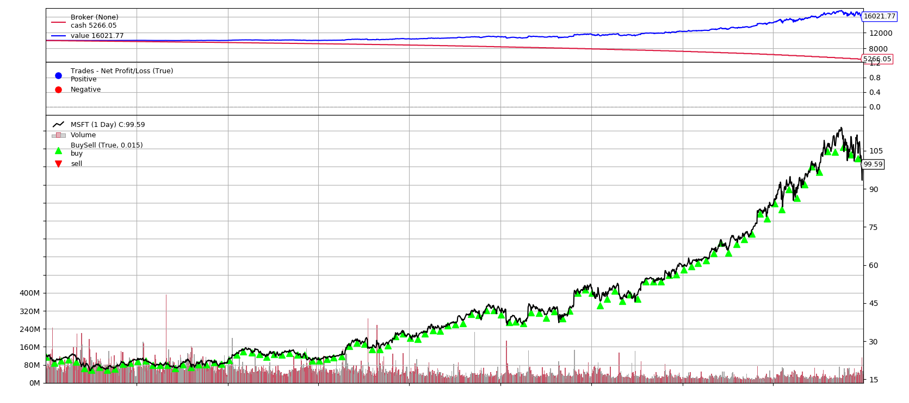

# Python回測框架（一）Backtrader 介紹

### **為什麼設計投資策略需要「回測」？**

出處: https://stockbuzzai.wordpress.com/2019/07/08/python%e5%9b%9e%e6%b8%ac%e6%a1%86%e6%9e%b6%ef%bc%88%e4%b8%80%ef%bc%89backtrader-%e4%bb%8b%e7%b4%b9/


因為人都有盲點，在股市暗潮洶湧的環境中，會有我們沒考量到的變因潛伏期中。**透過回測，我們可以找到之前沒發現的暗礁**，**使投資策略更完備**、更安全航行於股海之中。

在這邊介紹一個能簡單操作回測的程式 Backtrader，讓你能輕鬆上手，用電腦幫你運用過去的數據測試選股策略！

### **Backtrader 介紹**

Backtrader 是一套基於 Python 的策略回測框架，可以讓使用者花更多時間專注於策略上而不需要處理一些交易細節和輸出回測的結果。

這是一個簡單的範例。內容很簡單，我們先放入一筆錢，然後每月買一張微軟 (MSFT) 的股票，最後輸出回測的結果。

```python
data = bt.feeds.YahooFinanceData(dataname='MSFT',
                                  fromdate=datetime(2010, 1, 1),
                                  todate=datetime(2018, 12, 31))
  
cerebro.adddata(data) 
```

在回測中最重要的，就是需要有數據，Backtrader 提供了從 Yahoo!Finance 直接撈取資料的功能，在這一段程式碼中，我們下載 MSFT 從 2010/1/1 到 2018/12/31 的股價資料，並把資料添加到 cerebro。

Backtrader 除了支援使用 Yahoo!Finance 撈取資料之外，也支援從 csv 載入資料，有興趣的人可以查看 [Data Feeds](https://www.backtrader.com/docu/datafeed/)。

```python
class TestStrategy(bt.Strategy):
     def __init__(self):
         self._next_buy_date = datetime(2010, 1, 5)
  
     def next(self):
         if self.data.datetime.date() >= self._last_buy_date.date():
             self._last_buy_date += relativedelta(months=1)
             self.buy(size=1)  
```

處理完資料的問題，接下來就可以專注於策略的部分。我們的策略是每月 5 日購買 1 股股票。

```python
def __init__(self):
         self._next_buy_date = datetime(2010, 1, 5)
```

我們的資料設定的時間是 2010/1/1 到 2018/12/31，因此我們設定第一個購買股票的日期為 2010/1/5。

```python
def next(self):
         if self.data.datetime.date() >= self._last_buy_date.date():
             self._last_buy_date += relativedelta(months=1)
             self.buy(size=1)  
```

next 這個 method 是每一個交易日都會被呼叫一次，我們在這個 method 中比對交易日是否已經到達我們的預期的交易日，當到達的時候就把交易日加上一個月，並購買一股。

```python
cerebro.adddata(data) 
cerebro.addstrategy(TestStrategy)
cerebro.broker.set_cash(cash=10000)
cerebro.run()
cerebro.plot()
```

我們將策略添加到 cerebro 之中，同時不要忘了把我們的起始資金設定為 10000，然後呼叫 cerebro.run() 來直接交易模擬的工作。最後，我們希望把結果用圖型化的方式輸出，於是呼叫 cerebro.plot() 來展示結果。

以下是我們輸出的結果：



由圖可見， 最上方藍線為淨值曲線，紅線為現金值曲線；最下方為 MSFT 價格走勢圖和我們的買入點，我們的帳戶淨值由原始的 10,000 增長至 16,021.77。在這段期間，我們總共買入 108 股，買入的平均價格為 43.83 元，資產多了 6021.77 元！

下次，我們來回測定期定額買入股票的績效。

＿＿

#### **完整程式碼：**

```python
from datetime import datetime
import backtrader as bt
from dateutil.relativedelta import relativedelta
  
class TestStrategy(bt.Strategy):
     def __init__(self):
         self._next_buy_date = datetime(2010, 1, 5)
  
     def next(self):
         if self.data.datetime.date() >= self. _next_buy_date.date():
             self. _next_buy_date += relativedelta(months=1)
             self.buy(size=1)
  
cerebro = bt.Cerebro()
data = bt.feeds.YahooFinanceData(dataname='MSFT',
                                  fromdate=datetime(2010, 1, 1),
                                  todate=datetime(2018, 12, 31))
  
cerebro.adddata(data) 
cerebro.addstrategy(TestStrategy)
cerebro.broker.set_cash(cash=10000)
cerebro.run()
cerebro.plot() 
```