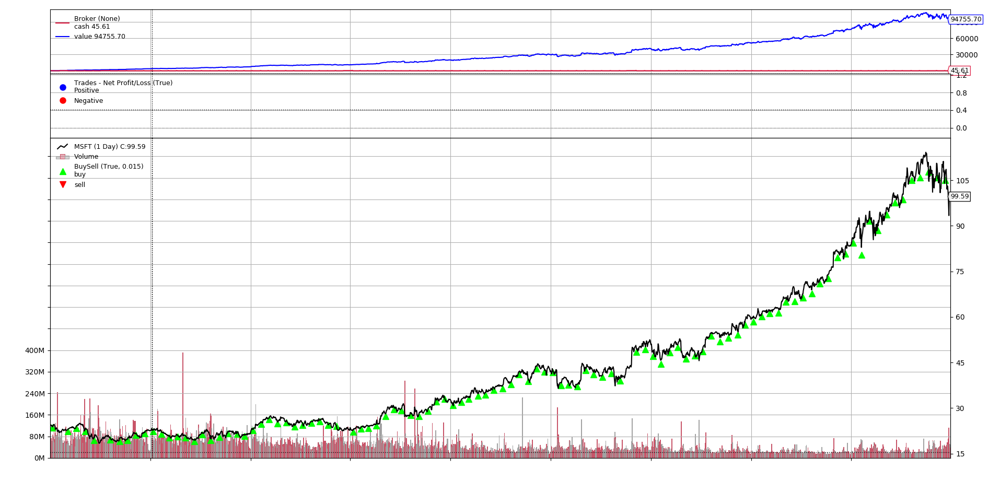
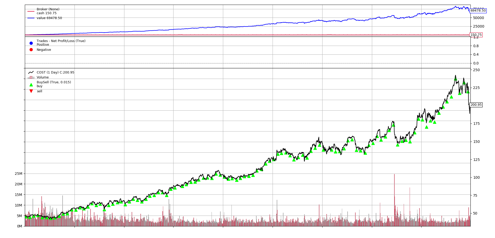
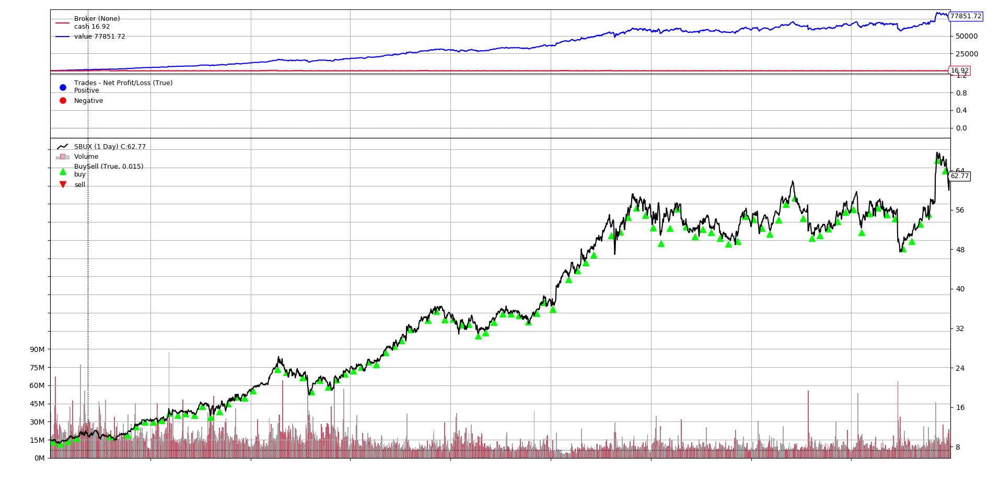

# Python 回測框架（二）定期定額投資

出處: https://stockbuzzai.wordpress.com/2019/07/09/python-%e5%9b%9e%e6%b8%ac%e6%a1%86%e6%9e%b6-%e4%ba%8c%ef%bc%9a%e5%ae%9a%e6%9c%9f%e5%ae%9a%e9%a1%8d%e6%8a%95%e8%b3%87/


在上一篇 [Python回測框架 (一)： Backtrader介紹](https://stockbuzzai.wordpress.com/2019/07/08/python回測框架（一）backtrader-介紹/) 中我們介紹如何使用 Backtrader 做定期投資，可是一般我們投資不會一開始準備一大筆錢，然後每期讓它扣款，通常是定期定額的投資。因此在這篇文章中會介紹如何使用 Backtrader 做定期定額的投資。

```python
def __init__(self):
         self._last_deposit_date = datetime(2010, 1, 5)
         self._last_buy_date = datetime(2010, 1, 7)
```

在初始化的部分，我們一共分成兩個變數，_last_deposit_date 是紀錄本月的入金時間，_last_buy_date 則是記錄實際購買的時間。因為 Backtrader 在增加現金至系統的時候，我有兩天的延遲，所以必須在入金的兩天之後才能進行股票的購買。

```python
def next(self):
         current_date = self.data.datetime.date()
         if current_date >= self._last_deposit_date.date():
             self._last_deposit_date += relativedelta(months=1)
             self._last_buy_date = datetime.combine(date=current_date, time=datetime.min.time()) + relativedelta(days=3)
             self.broker.add_cash(cash=300)
```

在處理每個交易日的部分，我們程式碼一共分成兩段，這一段程式碼是先判斷今天是不是匯款日，如果是匯款日的話，將 300 美金存入銀行，同時將 _last_deposit_date 設定為下一個月的同一天，並且把交易日設定為三天後。

```python
if current_date >= self._last_buy_date.date():
             price = (self.data.high + self.data.low) / 2.0
             volume = math.floor((self.broker.cash) / price)
             self.buy(size=volume)
             self._last_buy_date += relativedelta(months=1)
```

這一段程式碼是判斷當今天為交易日的時候，我們使用當日最高價（self.data.high）和最低價（self.data.low）的平均來計算要買的量。把持有的現金（self.broker.cash）除上價格就是我們預計買的量。同時把交易日加上一個月。

```python
cerebro.broker.set_cash(cash=1)
```

最後，因為我們這次是採取定期定額的投資，所以我們把錢設定為 1 (因為設定為 0 的時候在資產計算會 Crash)。

以下分別是每月用 300 美元購買微軟 (MSFT)、好市多 (COST)、星巴克 (SBUX) 的狀況，購買的時間是 2010/01/01 到 2018/12/31。其中明顯的可以發現微軟的總淨值 94755.7 比好市多的 69478.5 和星巴克的 77851.72 還要好 10% 以上，因此慎選好股票是很重要的一件事情。

微軟 (MSFT)

好市多 (COST)

星巴克 (SBUX)

＿＿＿

#### **完整程式碼：**

```python
from datetime import datetime
from dateutil.relativedelta import relativedelta
import backtrader
import math
  
class TestStrategy(backtrader.Strategy):
     def __init__(self):
         self._last_deposit_date = datetime(2010, 1, 5)
         self._last_buy_date = datetime(2010, 1, 7)
  
     def next(self):
         current_date = self.data.datetime.date()
         if current_date >= self._last_deposit_date.date():
             self._last_deposit_date += relativedelta(months=1)
             self._last_buy_date = datetime.combine(date=current_date, time=datetime.min.time()) + relativedelta(days=3)
             self.broker.add_cash(cash=300)
  
         if current_date >= self._last_buy_date.date():
             price = (self.data.high + self.data.low) / 2.0
             volume = math.floor((self.broker.cash) / price)
             self.buy(size=volume)
             self._last_buy_date += relativedelta(months=1)
  
cerebro = backtrader.Cerebro()
data = backtrader.feeds.YahooFinanceData(dataname='MSFT',
                                  fromdate=datetime(2010, 1, 1),
                                  todate=datetime(2018, 12, 31))
  
cerebro.adddata(data) 
cerebro.addstrategy(TestStrategy)
cerebro.broker.set_cash(cash=1)
cerebro.run()
cerebro.plot() 
```