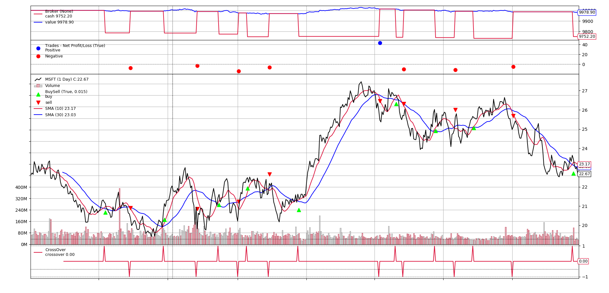
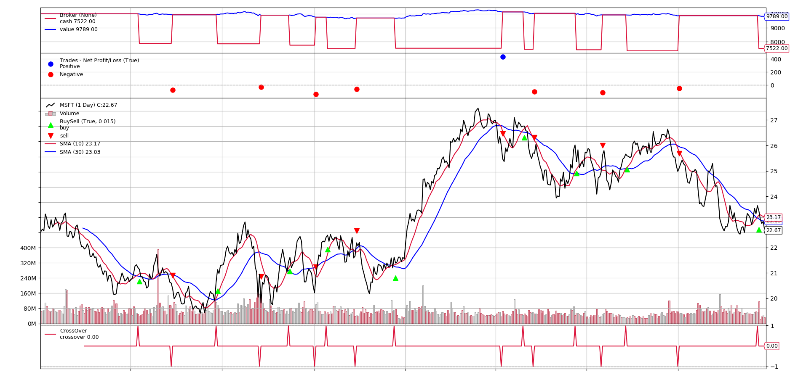
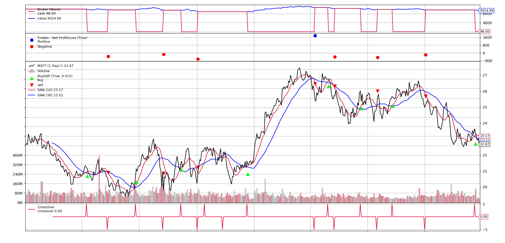

# Python 回測框架（五）Sizer

出處：https://stockbuzzai.wordpress.com/2019/07/23/python-%e5%9b%9e%e6%b8%ac%e6%a1%86%e6%9e%b6%ef%bc%88%e4%ba%94%ef%bc%89sizer/

在上一篇 [**Python 回測框架（四）CrossOver 和 Signal**](https://stockbuzzai.wordpress.com/2019/07/15/python-回測框架（四）crossover-和-signal/) 中，我們談到了如何使用CrossOver 和 Signal 來買賣商品。但是我們又遇到了一個問題，我們無法控制買賣的商品數量。在一般交易中，我們可能會根據當前的狀況來買賣不同的數量的商品，因此我們在這一篇文章要介紹的就是 Backtrader 中負責控制買賣商品數量的工具 Sizer。

首先我們先回看下面這段程式碼：

```python
from datetime import datetime
import backtrader
  
class SmaCross(backtrader.SignalStrategy):
    def __init__(self):
        sma10 = backtrader.ind.SMA(period=10)
        sma30 = backtrader.ind.SMA(period=30)
        crossover = backtrader.ind.CrossOver(sma10, sma30)
        self.signal_add(backtrader.SIGNAL_LONG, crossover)
  
cerebro = backtrader.Cerebro()
data = backtrader.feeds.YahooFinanceData(dataname='MSFT',
                                         fromdate=datetime(2011, 1, 1),
                                         todate=datetime(2012, 12, 31))
  
cerebro.adddata(data)
cerebro.addstrategy(SmaCross)
cerebro.addsizer(backtrader.sizers.SizerFix, stake=10)
cerebro.run()
cerebro.plot() 
```

這一段程式碼幾乎跟 [**Python 回測框架（四）CrossOver 和 Signal**](https://stockbuzzai.wordpress.com/2019/07/15/python-回測框架（四）crossover-和-signal/) 中的程式碼一樣，但是我們多了一行程式碼：

```python
cerebro.addsizer(backtrader.sizers.SizerFix, stake=10) 
```

這裡我們設定了一個 Sizer，這個 Sizer 每次買賣固定的數量，一次是 10 股。下列是設定不同的 stake 的值的時候所產生的結果。

stake = 1

stake=1 的時候，產生的結果跟 [**Python 回測框架（四）CrossOver 和 Signal**](https://stockbuzzai.wordpress.com/2019/07/15/python-回測框架（四）crossover-和-signal/) 中是相同的。

stake = 10

stake=10 的時候，我們發現每次購買股票資金明顯花費的比較多。

stake = 100

stake=100 的時候，我們發現每次購買的的數量確實更多了，所花費的資金也更多。

另外，在 Backtrader 之中，主要分成兩種 sizer。一種 sizer 屬於預設的 sizer，在系統中如果沒有其他的 sizer，就使用這個 sizer。在之前的程式碼就是使用預設 sizer 的範例。

另一種 sizer 是跟隨著 strategy 的，這種 sizer 只處理對應的 strategy 的買賣。設定strategy 的 sizer 有二種方法，一種是透過 cerebro 的 addsizer_byidx 來設定，如以下範例：

```python
idx = cerebro.addstrategy(SmaCross)
cerebro.addsizer_byidx(idx, backtrader.sizers.SizerFix, stake=100) 
```

其中 idx 是 cerebro 在新增 strategy 的時候所回傳 idx 值，以此當參數來新增 sizer。

第二種方式是透過 strategy 的 setsizer 來設定 sizer，程式碼如下：

```python
self.setsizer(backtrader.sizers.SizerFix(stake=100))
```

### **如何自訂 sizer**

要撰寫自訂的 sizer，需要繼承 backtrader.Sizer 這個物件，然後覆寫 _getsizing 這個函式，以下是範例：

```python
class AllSizer(backtrader.Sizer):
    def _getsizing(self, comminfo, cash, data, isbuy):
        if isbuy:
            return math.floor(cash/data.high)
        else:
            return self.broker.getposition(data) 
```

AllSizer 是一個直接將資金買入商品的 sizer，其中 comminfo 代表手續費的相關資訊，cash 代表目前持有的現金，data 代表目前這檔商品，isbuy 代表這是買入還是賣出的請求。在買入的部分，我們利用持有現金除上當天最高價計算買入的股票數。賣出的時候則是把所有持倉都賣出。

以下是完整的程式碼和執行的結果：

```python
from datetime import datetime
import yfinance as yf
import backtrader
import math


class AllSizer(backtrader.Sizer):
    def _getsizing(self, comminfo, cash, data, isbuy):
        if isbuy:
            return math.floor(cash / data.high)
        else:
            return self.broker.getposition(data)


class SmaCross(backtrader.SignalStrategy):
    def __init__(self):
        sma10 = backtrader.ind.SMA(period=10)
        sma30 = backtrader.ind.SMA(period=30)
        crossover = backtrader.ind.CrossOver(sma10, sma30)
        self.signal_add(backtrader.SIGNAL_LONG, crossover)

        self.setsizer(AllSizer())


cerebro = backtrader.Cerebro()
# data = backtrader.feeds.PandasData(dataname=yf.download('TSLA', '2018-01-01', '2023-01-01'))
data = backtrader.feeds.PandasData(
    dataname=yf.download("MSFT", "2011-01-01", "2023-01-01")
)

# data = backtrader.feeds.YahooFinanceData(
#    dataname="MSFT", fromdate=datetime(2011, 1, 1), todate=datetime(2012, 12, 31)
# )

cerebro.adddata(data)
idx = cerebro.addstrategy(SmaCross)
cerebro.run()
# pip install matplotlib==3.2.2
cerebro.plot()
```



有了 sizer，我們就可以把計算買賣商品數量的邏輯獨立，讓我們在撰寫回測程式的時候更方便且更有彈性。

## Backtrader - sizer

出處：https://ithelp.ithome.com.tw/articles/10279754

之前有介紹過，如果我們下單除了股價以外，還有一個很重要的因素就是要買幾股，有些時候，我們的策略可能會需要不同的買入數量，Backtrader 也有一個物件 sizer 可以提供相關的彈性，如果預設的沒有合適的，也可以自訂義一個，以下先介紹內建的一些 sizer

### FixedSize

顧名思義就是固定的數量
參數：

- stake { default 1 }: 固定數量的股數
- tranches { default 1 }: 只執行 stake 的幾分之一
  *最後的數量 = stake / tranches*

```python
cerebro.addsizer(bt.sizers.SizerFix, stake = 1000)
```

### FixedReverser

一樣是固定數量，只是在賣的時候，會賣出 2 倍的庫存，也就是把正的庫存賣成負的庫存
參數：

- stake { default 1 } 固定的股數

```python
cerebro.addsizer(bt.sizers.FixedRevert, stake = 1000)
```

### PercentSizer

使用一定比例的帳戶餘額去買進
參數：

- percents { default 20 }: 20%

```python
cerebro.addsizer(bt.sizers.PercentSizer, percents = 80)
```

### AllInSizer

基本上和 PercentSizer 一樣，只是預設是 100% 的帳戶餘額去買進股票，另一個差別就是 All in 聽起來比較霸氣。
*這裡有一個要注意的是，AllIn 是以當天的收盤價去算要買的股數，可是在執行買入的時候，是隔天的開盤價，所以隔天是漲的話，就會造成餘額不足，買入失敗喔*

```python
cerebro.addsizer(bt.sizers.AllInSizer)
```

### 其它

PercentSizerInt, AllInSizerInt，這兩個看說明是說在回傳數量的時候會轉成整數，不過我真正去執行的結果，兩個都是一樣的，所以暫時看不出差別

### 自訂義 sizer

要自訂義 sizer 也很簡單

- 訂義一個 sizer 的 class 繼承 backtrader.Sizer
  繼承後可以使用 self.strategy 和 self.broker 來取得相關資料
  - 取得庫存 self.strategy.getposition(data)
  - 取得目前淨值 self.broker.getvalue() (或是 self.stratgy.broker.getvalue())
- 覆寫 _getsizing(self, comminfo, cash, data, isbuy)
  - comminfo: 手續費相關資訊
  - cash：目前帳戶餘額
  - data: 目前的操作(買入/賣出)資料
  - isbuy: 是否為買入(True)

例如：改寫 percent 變成可以買的最大的張數 ( 1000 股 )

```python
import backtrader as bt
import math
class PercentBoardSizer(bt.Sizer):
    params = (
        ('percents', 20),
    )

    def _getsizing(self, comminfo, cash, data, isbuy):
        position = self.broker.getposition(data)
        if not position:
            size = cash / data.close[0] * (self.p.percents / 100)
            
            if size < 1000:
                # 小於 1000 股，就不買
                size = 0
            else:
                size = math.floor(size / 1000) * 1000
        else:
            size = position.size

        size = int(size)
        
        return size

class AllInBoardSizer(PercentBoardSizer):
    params = (
        ('percents', 100),
    )
```

### 使用方法

- 在 strategy 中：

  - def setsizer(self, sizer): 可以取得已經初始化的 sizer
  - def getsizer(self): 回傳目前使用的 sizer
  - sizer 屬性可以直接進行 get/set (前幾天的範例就是使用這個)

- 使用 cerebro：
  *目前看來，如果 strategy 和 cerebro 都有設定的話，會以 cerebro 為主*，cerebro 有兩個方法可以設定

  - addsizer(sizerClass, *args, **kwargs): 指定所有的 strategy 使用的 sizer
  - addsizer_byidx(idx, sizerClass, *args, **kwargs): 根據不同的 strategy inx 來使用不同的 sizer
    ex:

  ```python
  cerebro = bt.Cerebro()
  # 預設的 sizer
  cerebro.addsizer(bt.sizers.SizerFix, stake = 1000)
  
  # 這樣就可以針對不同的 strategy 來設定不同的 sizer
  idx = cerebro.addstrategy(TestStrategy)
  cerebro.addsizer_byidx(idx, bt.sizers.SizerFix, stake = 5)
  ```
