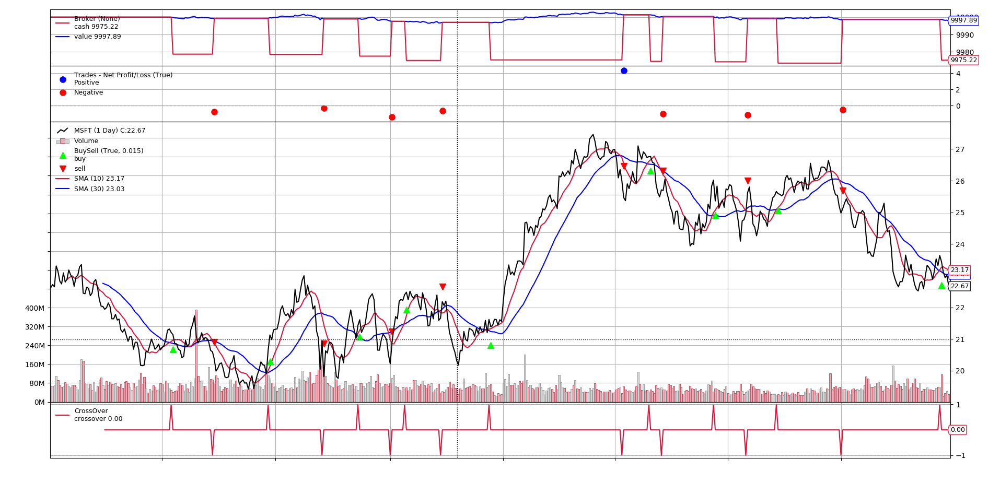
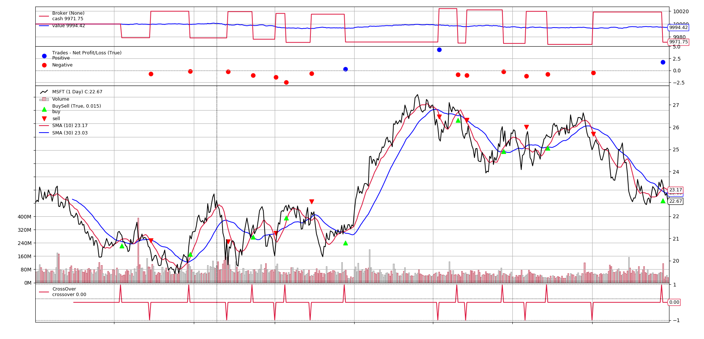

# Python 回測框架（四）CrossOver 和 Signal

出處：https://stockbuzzai.wordpress.com/2019/07/15/python-%e5%9b%9e%e6%b8%ac%e6%a1%86%e6%9e%b6%ef%bc%88%e5%9b%9b%ef%bc%89crossover-%e5%92%8c-signal/


### **CrossOver**

什麼是 CrossOver 呢？CrossOver 是一個判斷輸入的價格或是技術指標狀態的工具。

首先我們先來看下面這一段程式碼：

```python
def __init__(self):
     sma10 = backtrader.ind.SMA(period=10)
     sma30 = backtrader.ind.SMA(period=30)
     self.crossover = backtrader.ind.CrossOver(sma10, sma30)  
```

在這段程式碼之中，我們建立了一條 10 日的短均線 (sma10) 和一條 30 日的長均線 (sma30)。接著，我們利用了 sma10 和 sma30 建立了一個 CrossOver。

當短均線向上穿越長均線時，sma10 的數值變得比 sma30 大，此時 CrossOver 會回傳一個大於 0 的數值，做為買進訊號。反之，當短均線向下穿越長均線時，sma10 的數值變得小於 sma30 ，CrossOver 會回傳一個小於 0 的數值，為賣出訊號。

以下我們利用 CrossOver 來做買賣：

```python
def next(self):
     if not self.position:
         if self.crossover > 0:
             self.buy()
  
     elif self.crossover < 0:
         self.close() 
```

這段程式碼中，當我們沒有持倉，且 crossover 大於 0，我們買進股票 1 股 (一樣是以微軟股票為例)，當 crossover 小於 0，我們平倉。

#### **CROSSOVER 完整程式碼**

```python
from datetime import datetime
import backtrader
  
  
class SmaCross(backtrader.Strategy):
     def __init__(self):
         sma10 = backtrader.ind.SMA(period=10)
         sma30 = backtrader.ind.SMA(period=30)
         self.crossover = backtrader.ind.CrossOver(sma10, sma30)
  
     def next(self):
         if not self.position:
             if self.crossover > 0:
                 self.buy()
  
         elif self.crossover < 0:
             self.close()
  
  
cerebro = backtrader.Cerebro()
data = backtrader.feeds.YahooFinanceData(dataname='MSFT',
                                          fromdate=datetime(2011, 1, 1),
                                          todate=datetime(2012, 12, 31))
  
cerebro.adddata(data)
cerebro.addstrategy(SmaCross)
cerebro.run()
cerebro.plot() 
```

根據這個程式碼，以下是我們的回測結果。我們可以清楚地看當 sma10 和 sma30 發生交叉之後，我們就買進和賣出對應的股票。

微軟 (MSFT)

### **Signal**

很多人可能覺得 CrossOver 可能沒什麼用處，因為我們直接比較 sma10 和 sma30 的數值也可以得到相同的結果，不需要用到這個工具。其實這個工具的主要用途是配合我們現在要介紹的另外一個工具 Signal 來使用。

以下我們先來看一段程式碼：

```python
class SmaCross(backtrader.SignalStrategy):
     def __init__(self):
         sma10 = backtrader.ind.SMA(period=10)
         sma30 = backtrader.ind.SMA(period=30)
         crossover = backtrader.ind.CrossOver(sma10, sma30)
         self.signal_add(backtrader.SIGNAL_LONG, crossover) 
```

我們把 SmaCross 這個策略跟之前的比較，我們把 Strategy 換成了 SignalStrategy。在初始化的部分，我們的前三步驟跟之前一樣，分別建立了一個 10 日、30 日均線和一個 CrossOver，最大的不同是我們把這個 CrossOver 添加進了一個 Signal 之中。

Signal 會根據傳入資料的狀態變化時來進行動作。當傳入資料的變成正的，則發出 long 的信號，當傳入資料變為負的，則發出 short 的信號。當傳入資料變為 0，則不發出信號。至於 long 和 short 的行為則根據第一個參數來定義。目前這個參數一共有五種選擇分別是：

#### **MAIN GROUP:**

- LONGSHORT：long 和 short 的信號都接收

- LONG：

  - 收到 long 的信號時會買入

  - 收到 short 的信號時會平倉，但是

    - 如果系統中有 LONGEXIT 的信號，會先離場

    - 如果系統中有 SHORT 的信號而且沒有 LONGEXIT 的信號，會先離場再賣出。

- SHORT：

  - 收到 short 的信號時會賣出

  - 收到 long 的信號時會平倉，但是

    - 如果系統中有 SHORTEXIT 的信號，會先離場。

    - 如果有 LONG 的信號而且沒有 SHORTEXIT 的信號，會先離場再買入。

#### **EXIT GROUP:**

- LONGEXIT：收到 short 會離場
- SHORTEXIT：收到 long 會離場

當使用 LONG 的時候，我們可以看到跟之前相同的的結果：

LONG

如果將 LONG 改為 LONGSHORT，我們將得到另外一個結果：

LONGSHORT

#### **完整的程式碼**

```python
from datetime import datetime
import backtrader
  
  
class SmaCross(backtrader.SignalStrategy):
     def __init__(self):
         sma10 = backtrader.ind.SMA(period=10)
         sma30 = backtrader.ind.SMA(period=30)
         crossover = backtrader.ind.CrossOver(sma10, sma30)
         self.signal_add(backtrader.SIGNAL_LONG, crossover)
  
  
cerebro = backtrader.Cerebro()
data = backtrader.feeds.YahooFinanceData(dataname='MSFT',
                                          fromdate=datetime(2011, 1, 1),
                                          todate=datetime(2012, 12, 31))
  
cerebro.adddata(data)
cerebro.addstrategy(SmaCross)
cerebro.run()
cerebro.plot() 
```