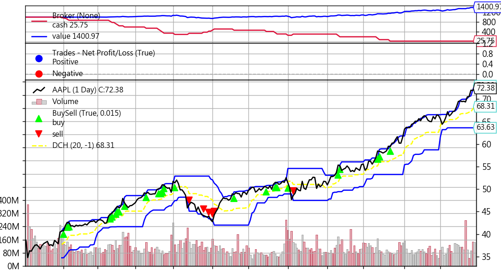

## 唐奇安通道策略

## 通道策略

要講通道策略，直接看圖最快，下面是維基百科裡面的圖：


從上圖可以看到，白色的線是股價走勢，上下有兩條黃色的線包覆中間的白色線，包圍的區間看起來就像是一個通道，所以叫做通道策略，上下兩條黃線則是稱為上下軌。

計算這兩條黃色線的方式有很多不同的方式，本篇介紹其中一種叫做唐奇安通道(Donchian Channel)，唐奇安通道的上下軌計算方式為，上軌為過去一段時間內的最高價，下軌為過去一段時間內的最低價。

若股價超過上軌，可能表示多頭較強勢，所以產生買進訊號，若股價低於下軌，可能表示空頭較強勢，所以產生賣出訊號。至於這過去一段時間要採用多長的時間，會跟商品性質或是交易頻率比較有相關。

## 開始寫策略吧

寫唐奇安通道策略大概需要三個步驟：

- 計算通道上下軌
- 撰寫交易策略
- 執行回測

### 計算通道上下軌

因為上下軌是用來買進賣出的指標，因此可以使用backtrader的[Indicators](https://www.backtrader.com/docu/induse/)，官網文件有非常詳細的介紹。下面程式碼是官網的範例，由於實在蠻複雜的，就一行一行來解釋：

```python
from datetime import datetime
import yfinance as yf
import backtrader as bt


# 定義一個Indicator物件
class DonchianChannels(bt.Indicator):
    # 這個物件的別名，所以後面我們可以用DCH/DonchianChannel來呼叫這個指標
    alias = ('DCH', 'DonchianChannel',)
    
    # 三條線分別代表唐奇安通道中的 中軌(上軌加下軌再除以2)、上軌、下軌
    lines = ('dcm', 'dch', 'dcl',)  # dc middle, dc high, dc low
    
    # 軌道的計算方式：用過去20天的資料來計算，所以period是20，lookback的意思是要不要將今天的資料納入計算，由於唐奇安通道是取過去20天的最高或最低，所以一定不能涵蓋今天，不然永遠不會有訊號出現，所以要填-1(從前一天開始算20天)
    params = dict(
        period=20,
        lookback=-1,  # consider current bar or not
    )
    
    # 是否要將Indicators另外畫一張圖，然而通道線通常都是跟股價圖畫在同一張，才能看得出相對關係，所以這裡就填subplot=False
    plotinfo = dict(subplot=False)  # plot along with data
    
    # 繪圖設定，ls是line style，'--'代表虛線
    plotlines = dict(
        dcm=dict(ls='--'),  # dashed line
        dch=dict(_samecolor=True),  # use same color as prev line (dcm)
        dcl=dict(_samecolor=True),  # use same color as prev line (dch)
    )
    
    def __init__(self):
        # hi與lo是指每日股價的最高與最低價格
        hi, lo = self.data.high, self.data.low
        
        # 視需求決定是否要從前一天開始讀資料，上面已經定義lookback存在，所以這邊會直接從前一天的資料開始跑
        if self.p.lookback:  # move backwards as needed
            hi, lo = hi(self.p.lookback), lo(self.p.lookback)
        
        # 定義三條線的計算方式
        self.l.dch = bt.ind.Highest(hi, period=self.p.period)
        self.l.dcl = bt.ind.Lowest(lo, period=self.p.period)
        self.l.dcm = (self.l.dch + self.l.dcl) / 2.0  # avg of the above
```

### 撰寫交易策略

寫策略的部份就相對簡單很多，第一步把指標帶入，再來就產出訊號拉。

```python
# 撰寫交易策略
class MyStrategy(bt.Strategy):
    def __init__(self):
        # DCH就是上面定義的 DonchianChannels的alias
        self.myind = DCH()

    def next(self):
        if self.data[0] > self.myind.dch[0]:
            self.buy()
        elif self.data[0] < self.myind.dcl[0]:
            self.sell()
```

### 執行回測

```python
cerebro = bt.Cerebro()
cerebro.addstrategy(MyStrategy)
cerebro.broker.setcash(1000)
cerebro.broker.setcommission(commission=0.001)

data = bt.feeds.PandasData(
    dataname=yf.download("AAPL", "2019-01-01", "2019-12-31", auto_adjust=True)
)

cerebro.adddata(data)
print('Starting Value: %.2f' % cerebro.broker.getvalue())
cerebro.run()
print('Ending Value: %.2f' % cerebro.broker.getvalue())
cerebro.plot()
```


```python
from datetime import datetime
import yfinance as yf
import backtrader as bt

# 定義一個Indicator物件
class DonchianChannels(bt.Indicator):
    # 這個物件的別名，所以後面我們可以用DCH/DonchianChannel來呼叫這個指標
    alias = (
        "DCH",
        "DonchianChannel",
    )

    # 三條線分別代表唐奇安通道中的 中軌(上軌加下軌再除以2)、上軌、下軌
    lines = (
        "dcm",
        "dch",
        "dcl",
    )  # dc middle, dc high, dc low

    # 軌道的計算方式：用過去20天的資料來計算，所以period是20，lookback的意思是要不要將今天的資料納入計算，由於唐奇安通道是取過去20天的最高或最低，所以一定不能涵蓋今天，不然永遠不會有訊號出現，所以要填-1(從前一天開始算20天)
    params = dict(period=20, lookback=-1,)  # consider current bar or not

    # 是否要將Indicators另外畫一張圖，然而通道線通常都是跟股價圖畫在同一張，才能看得出相對關係，所以這裡就填subplot=False
    plotinfo = dict(subplot=False)  # plot along with data

    # 繪圖設定，ls是line style，'--'代表虛線
    plotlines = dict(
        dcm=dict(ls="--"),  # dashed line
        dch=dict(_samecolor=True),  # use same color as prev line (dcm)
        dcl=dict(_samecolor=True),  # use same color as prev line (dch)
    )

    def __init__(self):
        # hi與lo是指每日股價的最高與最低價格
        hi, lo = self.data.high, self.data.low

        # 視需求決定是否要從前一天開始讀資料，上面已經定義lookback存在，所以這邊會直接從前一天的資料開始跑
        if self.p.lookback:  # move backwards as needed
            hi, lo = hi(self.p.lookback), lo(self.p.lookback)

        # 定義三條線的計算方式
        self.l.dch = bt.ind.Highest(hi, period=self.p.period)
        self.l.dcl = bt.ind.Lowest(lo, period=self.p.period)
        self.l.dcm = (self.l.dch + self.l.dcl) / 2.0  # avg of the above


# 撰寫交易策略
class MyStrategy(bt.Strategy):
    def __init__(self):
        # DCH就是上面定義的 DonchianChannels的alias
        self.myind = DCH()

    def next(self):
        if self.data[0] > self.myind.dch[0]:
            self.buy()
        elif self.data[0] < self.myind.dcl[0]:
            self.sell()


# 執行回測
cerebro = bt.Cerebro()
cerebro.addstrategy(MyStrategy)
cerebro.broker.setcash(1000)
cerebro.broker.setcommission(commission=0.001)

data = bt.feeds.PandasData(
    dataname=yf.download("AAPL", "2019-01-01", "2019-12-31", auto_adjust=True)
)

cerebro.adddata(data)
print("Starting Value: %.2f" % cerebro.broker.getvalue())
cerebro.run()
print("Ending Value: %.2f" % cerebro.broker.getvalue())
cerebro.plot()

```


回測2019年的結果(過去績效僅供參考，不保證未來能夠持續獲利)：
Starting Value: 1000.00
Ending Value: 1400.97


從上圖可以看得出來，因為2019年AAPL股價一直上漲的關係，很容易突破前20日的高點，導致綠色的三角形比紅色三角形多。

**本篇總結**
這篇就簡單的寫了一下用Backtrader回測唐奇安通道策略，又對這個框架多瞭解一些，覺得bt的功能真的超多，好用好用！