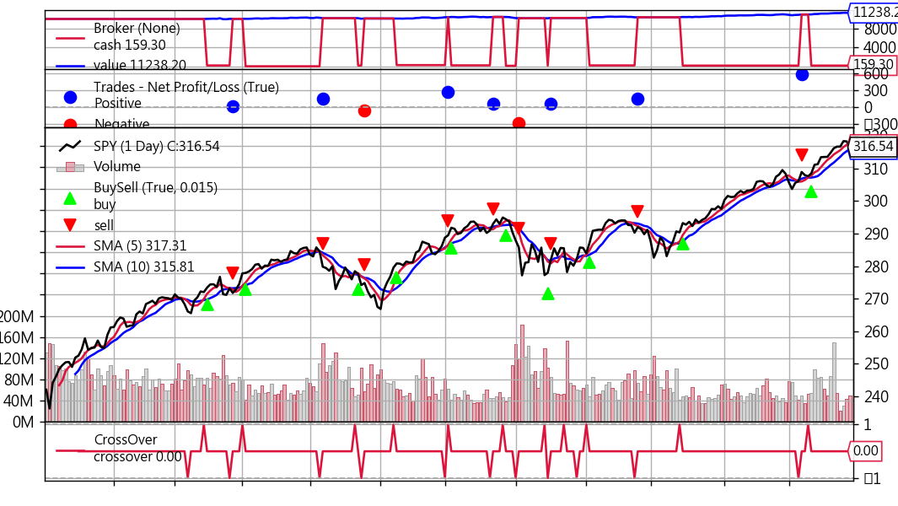

## 均線交叉策略

出處：https://ithelp.ithome.com.tw/articles/10242427


前面幾個策略的回測方式，是自己刻一個回測函數，其實是挺麻煩的，還好因為做量化的大家都有回測的需求，所以早就有人開發回測框架拉，就跟網頁開發使用的前端框架或後端框架類似，已經把常用到的功能都寫成模組囉，非常好用。

以Python為基礎的回測框架，包含vnpy、zipline、backtrader...等等，這次先來介紹一下backtrader，因為它用起來蠻直覺的，一些函數也都蠻口語化的，都是很容易懂的英文命名。

### Backtrader做回測會用到的元素

就跟一般做回測，通常會需要：OHLC資料、交易策略、回測模組、分析工具。下面就用前一篇寫的均線交叉策略來說明，怎麼使用backtrader做回測：

#### 1. 餵資料(Data Feeds)

關於data feeds的用法，官網的document有列出蠻多種取得資料的方式，這邊就先用常用的Yahoo Finance的資料。

```python
# data feeds
import math
import yfinance as yf
import datetime
import backtrader as bt
import backtrader.feeds as btfeeds


# 從Yahoo Finance取得資料
data = bt.feeds.PandasData(
    dataname=yf.download("SPY", "2015-07-06", "2023-01-01", auto_adjust=True)
)
```

#### 2. 撰寫策略

```python
# sma cross strategy
class SmaCross(bt.Strategy):
    # 交易紀錄
    def log(self, txt, dt=None):
        dt = dt or self.datas[0].datetime.date(0)
        print('%s, %s' % (dt.isoformat(), txt))
    
    # 設定交易參數
    params = dict(
        ma_period_short=5,
        ma_period_long=10
    )

    def __init__(self):
        # 均線交叉策略
        sma1 = bt.ind.SMA(period=self.p.ma_period_short)
        sma2 = bt.ind.SMA(period=self.p.ma_period_long)
        self.crossover = bt.ind.CrossOver(sma1, sma2)
        
        # 使用自訂的sizer函數，將帳上的錢all-in
        self.setsizer(sizer())
        
        # 用開盤價做交易
        self.dataopen = self.datas[0].open

    def next(self):
        # 帳戶沒有部位
        if not self.position:
            # 5ma往上穿越20ma
            if self.crossover > 0:
                # 印出買賣日期與價位
                self.log('BUY ' + ', Price: ' + str(self.dataopen[0]))
                # 使用開盤價買入標的
                self.buy(price=self.dataopen[0])
        # 5ma往下穿越20ma
        elif self.crossover < 0:
            # 印出買賣日期與價位
            self.log('SELL ' + ', Price: ' + str(self.dataopen[0]))
            # 使用開盤價賣出標的
            self.close(price=self.dataopen[0])

# 計算交易部位
class sizer(bt.Sizer):
    def _getsizing(self, comminfo, cash, data, isbuy):
        if isbuy:
            return math.floor(cash/data[1])
        else:
            return self.broker.getposition(data)
```

#### 3. 執行回測 and 顯示分析圖表

cerebro是backtrader回測模組的名稱，將資料、策略丟給cerebro之後，就可以執行回測並作圖了。

```python
# 初始化cerebro
cerebro = bt.Cerebro()
# feed data
cerebro.adddata(data)
# add strategy
cerebro.addstrategy(SmaCross)
# run backtest
cerebro.run()
# plot diagram
cerebro.plot()
```


```python
# data feeds
import math
import yfinance as yf
import datetime
import backtrader as bt
import backtrader.feeds as btfeeds


# sma cross strategy
class SmaCross(bt.Strategy):
    # 交易紀錄
    def log(self, txt, dt=None):
        dt = dt or self.datas[0].datetime.date(0)
        print("%s, %s" % (dt.isoformat(), txt))

    # 設定交易參數
    params = dict(ma_period_short=5, ma_period_long=10)

    def __init__(self):
        # 均線交叉策略
        sma1 = bt.ind.SMA(period=self.p.ma_period_short)
        sma2 = bt.ind.SMA(period=self.p.ma_period_long)
        self.crossover = bt.ind.CrossOver(sma1, sma2)

        # 使用自訂的sizer函數，將帳上的錢all-in
        self.setsizer(sizer())

        # 用開盤價做交易
        self.dataopen = self.datas[0].open

    def next(self):
        # 帳戶沒有部位
        if not self.position:
            # 5ma往上穿越20ma
            if self.crossover > 0:
                # 印出買賣日期與價位
                self.log("BUY " + ", Price: " + str(self.dataopen[0]))
                # 使用開盤價買入標的
                self.buy(price=self.dataopen[0])
        # 5ma往下穿越20ma
        elif self.crossover < 0:
            # 印出買賣日期與價位
            self.log("SELL " + ", Price: " + str(self.dataopen[0]))
            # 使用開盤價賣出標的
            self.close(price=self.dataopen[0])


# 計算交易部位
class sizer(bt.Sizer):
    def _getsizing(self, comminfo, cash, data, isbuy):
        if isbuy:
            return math.floor(cash / data[1])
        else:
            return self.broker.getposition(data)


# 從Yahoo Finance取得資料
data = bt.feeds.PandasData(
    dataname=yf.download("SPY", "2015-07-06", "2023-01-01", auto_adjust=True)
)


## 執行回測 and 顯示分析圖表

# 初始化cerebro
cerebro = bt.Cerebro()
# feed data
cerebro.adddata(data)
# add strategy
cerebro.addstrategy(SmaCross)
# run backtest
cerebro.run()
# plot diagram
cerebro.plot()
```


執行程式後，會顯示下面的資料及圖表：

- 分析圖表
  如下圖，預設的起始資金是10000元，期末資產淨值是11238，所以報酬率大概是12.38%，這張圖有四個區塊可以解釋一下，分別從上到下說明：



1. 第1區塊：藍色代表資產淨值，紅色代表帳戶現金，所以當紅色線突然掉下去的時候，就代表買入股票，上升就代表賣出股票。
2. 第2區塊：代表每次賣出的獲利情況，藍色點點表示賺錢，紅色點點表示虧錢。
3. 第3區塊：顯示長短均線、買賣點、股價走勢、交易量，從這張圖可以大概看出來買賣的時間點與走勢的相對關係。
4. 第4區塊：cross over訊號出現的點，可以仔細看到，第一個訊號是賣出訊號(線圖向下凸)，但是因為帳上沒有部位，所以沒有賣出動作。

**本篇總結**
這篇就大概寫了一下backtrader怎麼使用，當然它的功能是非常強大的，還有許多功能是我沒接觸過的，大家都可以google或看document去把玩把玩，蠻有趣的。