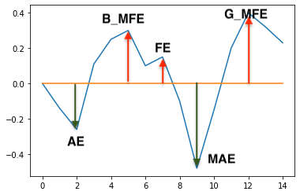
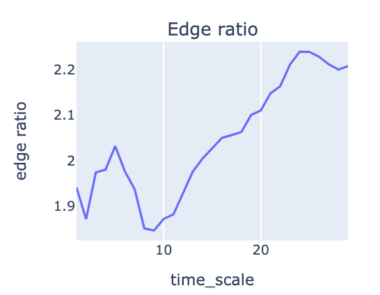
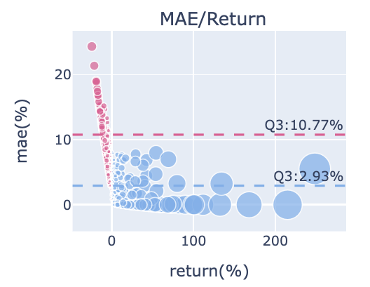
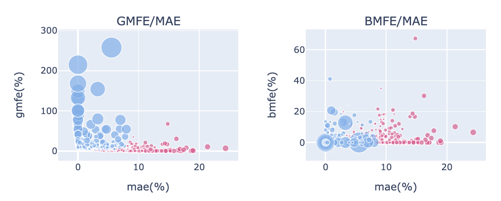
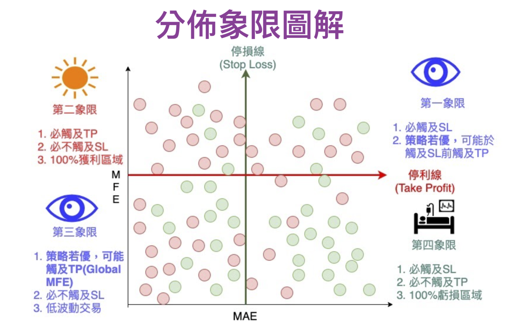
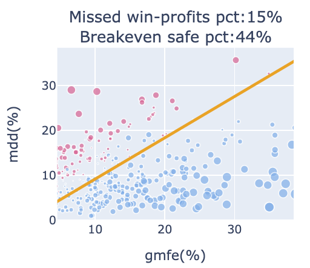
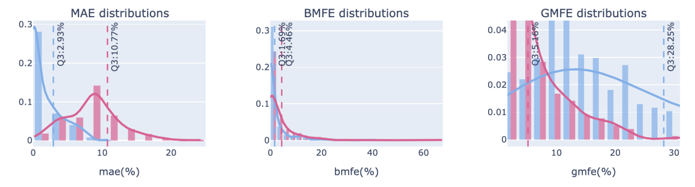
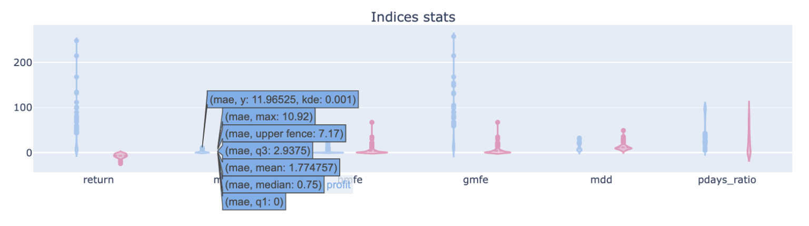
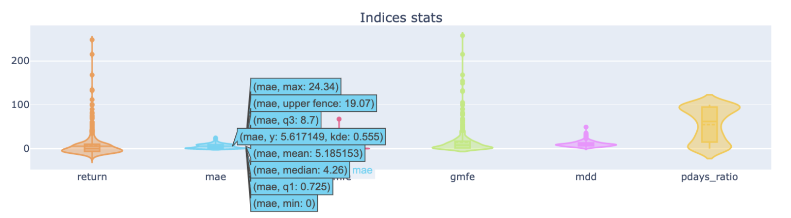

# 揭開策略的波動面紗｜MAE&MFE分析圖組使用指南

出處 : https://www.finlab.tw/display_mae_mfe_analysis/


一般我們跑回測會取得報酬率曲線、最大回撤、夏普率等策略總體數值，但這些指標讓我們難以一窺策略下每筆交易的實際波動細節。交易就像跑步比賽，若只看總體數值結果，就像只看一個人跑步的結果，不看過程細節，但這些過程都是我們可以觀察、優化的階段，比如要觀察策略波動時序、勝敗手交易的波動分佈是否明顯分群、策略的停損停利怎麼放比較好？藉由對波動性的分析，就不用每次都要堅持跑完煎熬的過程，可能讓我們在更佳點位出場，減少被洗掉、沒高歌離席的遺憾。

內容目錄  隱藏 
1 如何顯示MAE&MFE分析圖組

1.1 程式範例
1.2 輸出圖組範例
2 名詞定義2.1 波幅
2.2 Edge ratio
3 如何解讀圖組
3.1 報酬率統計圖
3.2 Edge Ratio 時序圖
3.2.1 參數設定
3.2.2 應用解釋
3.3 MAE/Return 分佈圖
3.4 MFE/MAE 分佈圖
3.4.1 分佈象限圖解
3.5 MDD/GMFE 分佈圖
3.6 MAE、ＭFE 密度分佈圖
4 Indices Stats
5 結論
6 相關學習資源


## 如何顯示MAE&MFE分析圖組

Finlab的[回測分析模組](https://doc.finlab.tw/reference/analysis/#finlab.analysis.Report.display_mae_mfe_analysis)可以輕鬆將`Report.get_trades(...)` 的結果帶入[Plotly.python](https://plotly.com/graphing-libraries/)做視覺化呈現。

### 程式範例

```python
from finlab import data
from finlab.backtest import sim

pb = data.get('price_earning_ratio:股價淨值比')
close = data.get('price:收盤價')

position = (1/(pb * close) * (close > close.average(60)) * (close > 5)).is_largest(20)
report = sim(position, resample='Q',mae_mfe_window=30,mae_mfe_window_step=2)
report.display_mae_mfe_analysis()
```

### 輸出圖組範例


## 名詞定義

### 波幅

再分析接下來的圖表前，要先認識一下波幅的分類，有利於分析前建立基礎知識。



- AE (adverse excursion) : 不利方向幅度，做多的話，就是下跌的波段。
- MAE : 最大不利方向幅度，做多的話，就是持有過程中的最大累積跌幅。
- FE (favorable excursion) : 有利方向幅度，做多的話，就是上漲的波段。
- BMFE : MAE之前發生的最大有利方向幅度。若BMFE越高，越有可能在碰上MAE之前，先觸及停利出場 (註1)。
- GMFE (Global MFE) : 全域最大有利方向幅度。若發生在MAE之前，則BMFE等於GMFE。若在MAE之後，則代表要先承受MAE才可能吃到較高的獲利波段。
- MDD (Max Drawdown) : 最大回撤幅度。
- Return : 報酬率。

### Edge ratio


來自海龜法則 (註2) 的指標，中文稱優勢比率。
edge ratio為平均GMFE / 平均MAE，這可以藉此評估進場優勢，一個真正隨機性的訊號大致上會帶來相等的MFE與MAE。
若大於1，代表存在正優勢，潛在最大獲利空間比最大虧損多，在持有過程中保有優勢可以中途停利或做其他操作，也就是策略的容錯率較高。反之則為劣勢，可能要抗衡較多的虧損狀態。

## 如何解讀圖組

將交易分為獲利 (profit-藍點) 與虧損 (loss-紅點) 分別呈現，圖組右方的legend可以任一點選，只看profit或loss的分群呈現。接著會「由上到下、由左至右」，解釋各子圖用途。

### 報酬率統計圖


子圖1-1，呈現策略下每筆交易的報酬率分佈，計算出勝率及平均每筆報酬。
圖片標題為交易勝率，綠色虛線為平均每筆交易的報酬率。
分佈曲線越平坦，代表報酬率範圍大，可能有較多的極端報酬率要處理，通常出現在波動大的策略。
若呈現右偏型態(右側的尾部更長，分佈的主體集中在左側)，代表多數交易為虧損，若整體策略為獲利，則獲利為少筆交易為主要貢獻。
若呈現左偏型態(左側的尾部更長，分佈的主體集中在右側)，代表多數交易為獲利。
若呈現鐘型曲線，代表分佈較為平均。

### Edge Ratio 時序圖



子圖1-2是策略edge ratio隨進場時間 (x軸) 後的變化，可以判斷隨著持有時間推移，策略有沒有波幅操作優勢。

#### 參數設定

edge ratio的計算設定由回測函數` backtest.sim()` 裡的mae_mfe_window, mae_mfe_window_step 兩個參數來控制。

- mae_mfe_window : 計算mae_mfe於進場後於不同持有天數下的數據變化，主要應用為優勢比率計算。預設為0，只會產生出場階段的mae_mfe。
- mae_mfe_window_step : 與 mae_mfe_window參數做搭配，為時間間隔設定，預設為1。若mae_mfe_window設20，mae_mfe_window_step 設定為2，相當於 python 的range(0,20,2)，以2日為間距計算mae_mfe。

#### 應用解釋

edge ratio若一直保持在1以上，持有都具有優勢，子圖範例就是這類情況，開局就有不錯表現，明顯的谷底落在第8天後持續走高，代表可能延遲到第8天進場會有低點，之後獲利一路放大優勢。
edge ratio時序圖走勢有很多種，若是開低走高，一開始都低於1，代表策略可能太早進場，一開始都要先承受虧損，這時可以檢討進場時機點，考慮延遲進場。

若edge ratio走勢保持在1以上，代表策略優勢明顯。若還隨著時間走高，獲利空間也上升，策略容錯率就較大，就算因一些因素延遲進場仍有較大機率有獲利範圍。
若edge ratio走勢很常在1以下，代表策略經常被虧損壓著打，是策略負面訊號。

若隨持有時間變化，優勢漸漸流失，比率開始下降，代表MAE普遍變高，可能是策略催化劑褪色，該策略適合短線操作並考慮加上停利提早出場。
若edge ratio走勢跳動，代表無明顯趨勢可判斷。
若策略週期是20天，發現time_scale大於20時，edge ratio趨勢持續走升，則透露策略可能太早出場，錯過後面更大的報酬，可以考慮修正持股週期，吃到更大的獲利。

### MAE/Return 分佈圖



子圖1-3，x軸為報酬率，Y軸為MAE，將勝敗手分群顯示成散點圖，比對報酬率與MAE的關係。
此範例中可以發現多數獲利的藍點都有較小的MAE，虧損的紅點有較大的MAE。
虧損部位的MAE第75%位數為10.77%，幾乎所有的藍點都低於這個位置，也就是說過了這個位置，交易最終就容易是虧損結果，可**設為停損**參考位置，可保留多數獲利部位、減少大賠部位損失。
獲利部位的MAE第75%位數為2.93%，代表多數獲利部位在持有過程中可能的最低點區間，碰到這位置後就有較高機率再往上，積極操作者或分批進場者可**設為攤平加碼點**位置，有機會讓獲利空間更多或賠更多。

### MFE/MAE 分佈圖



從子圖 2-1、2-2 可以觀察MAE與MFE的數據關係，散點圖大小由報酬率來決定。
比對兩張圖可發現，策略內許多GMFE很大的標的，都比BMFE大，代表許多漲幅都發生在MAE之後。想要有較高獲利，就要先忍受回檔，通常這容易發生在趨勢波段策略。
若是短線優異的策略，BMFE 會比較高，可以有較高機率在接觸MAE或停損前先做停利。

#### 分佈象限圖解




MAE/BMFE分佈圖(註3) 能幫助我們看出策略體質、優化設置停損停利。
大原則是「分佈在第二象限的點越多越好， 第四象限的點越少越好」、「獲利與虧損明顯分群在不同象限」。
如此 stop_loss過濾掉多數mae過大的標的，少過濾掉獲利的標的。take_profit盡量讓多數虧損的交易先觸及停利出場。

### MDD/GMFE 分佈圖




子圖2-3，判斷損益兩平點與鎖利點，橘線為45度線。
橘線以上為MDD > GMFE，如果越多獲利點位於這個位置，代表持有歷程可能歷經大回檔吃掉獲利轉為虧損，雖然最終會是獲利，但我們原本有機會賺更多。

MDD > GMFE 的情況常是一開始就吃大虧損～後來轉正，或是途中大賺後，突然急速下殺賠錢。都是比較不理想的狀況。子標題顯示的「Missed win-profits pct」為「獲利交易位於橘線上的數量/獲利交易數」，數值越高代表潛在錯失獲利的機會較高，數值越高代表越需要設定移動停利去保護獲利。

橘線以下為MDD < GMFE，代表獲利的交易達到價格高點後，即使後來回檔，因回檔不會吃掉全部GMFE，所以不會轉為虧損。若是虧損的部位位於橘線以下，由於MAE <= MDD < GMFE、MAE <= Return，可以推導出即使虧損，MAE也會比GMFE小，比較高的機會是小虧出場。子標題顯示的「Breakeven safe pct」 為「橘線下的比例/全部交易數」，也就是越不容易輸的比例。

### MAE、ＭFE 密度分佈圖



子圖3-1、3-2、3-3。由 [plotly-distplot](https://plotly.com/python/distplot/) 繪製而成，看指標的比例分佈曲線。
子圖3-1為 MAE 密度分佈圖，通常策略體質若較優，勝敗手的高峰會有明顯分群，贏錢的MAE通常較小、輸錢的MAE通常較大，向右過了藍紅曲線的交叉點後，虧損的交易會變得比獲利的交易多，可以視為比較緊的停損點或是開始分批停損的參考。勝敗手Q3(第75分位數)的應用可參考MAE/Return 分佈圖的說明，勝手Q3為積極者加碼點，敗手Q3為絕對停損點，再不跑就容易大賠啦！

子圖 3-2、3-3 為 MFE 密度分佈圖，應用概念與子圖3-1類似。
多數的敗手不會超過敗手MFE Q3 的位置 (圖中的5.16)，換句話說，漲過這個點後，多數交易最終會是獲利的，既然最終會是獲利的，那就會是一個不錯的突破加碼點位，若想要更高的機率確保加碼點安全性，可以用敗手MFE 大於Q3 的位置，例如藍紅曲線的交叉點。
勝手MFE Q3 則可視為分批停利減碼點參考位置。


## Indices Stats



group模式



overlay模式

子圖4-1，將各種數據用[提琴圖](https://plotly.com/python/violin/)呈現統計結果，可藉由`display_mae_mfe_analysis` 中的 violinmode 參數控制顯示模式，預設為group模式，將勝敗手分群統計，overlay模式為全數統計。提琴圖hover過後能顯示數據的**分位數**資料，可快速觀察所有數據的統計分佈，方便設定停損停利點能參考分位數的數值。
除了先前介紹的mae_mfe，其他還有統計數值:

- pdays_ratio:獲利交易日數/交易持有日數，中位數數值若大於0.5，代表多數交易持有期間都是獲利，操作起來更有彈性。若mfe高，但pdays_ratio低，代表若沒把握到衝高的少數時期，則會錯過理想報酬。

## 結論

是不是對波動分析更加瞭解了呢？一張圖表包山包海，完整分析出策略細節。

若想更深入瞭解MAE/MFE最大幅度分析法。除了國外資源，中文內容推薦[藍月記事](https://www.maemfe.org/search/label/交易-MAE%2FMFE最大幅度分析[影片])，其對這方面的策略體質觀察、優化有全方位的影片教學內容，作者對量化分析與交易心理有獨道見解，推薦大家前往學習。


---

## 為什麼策略優化容易讓 SL/TP 往 MAE/MFE 分佈圖左上移動

出處: https://www.maemfe.org/2020/05/why-the-sltp-moving-to-the-top-left-corner-of-MAEMFE-plot.html

今天來談一個在策略優化過程中，可能會遇到的一種情況

當我們在優化交易策略的參數的時候，有些人會把 Stoploss 和 Takeprofit 放進去一起優化。

這不是不行，如果你已經有一套方法去同時優化模型參數、SL/TP 那很好，但是如果你優化完，你發現每次到樣本外常常都掛掉的話，我會猜測可能 **錯誤以為 MDD 變小是模型優化的「因」。**

通常來說，許多人會使用「**粒度大**」、「**交易間**」的評估指標，例如最大連續虧損（MDD）做為策略優化的參考 ，希望盡量找到一個 MDD 小的參數。

如果此時伴隨著 SL 和 TP 下去優化，有時候會得到 **SL 開始變小**、**TP 開始變大**，然後 **MDD 變小**的情況，很多人認為，這樣的情況代表「**好**」，因為每一筆交易的潛在虧損更小、潛在獲利更大，整體的 MDD 更小，感覺應該是更穩健。

在一些條件考量之下，這樣的想法是對的，但如果你如果經常使用這方式，還是無法在外樣本得到好的結果的話，你要謹慎考慮其實你落入一個優化的陷阱。

當你使用粒度大的評估指標，什麼是粒度大呢？也就是可能因為越少的交易，就使得這個評估指標急遽的變差的，我們就叫做粒度大的評估指標。

最大連續虧損就可能因為少數幾個交易連續大幅度的損失，就造成 MDD 非常高，所以 MDD 某種程度可以看成是粒度較大的評估指標；其次是夏普率，夏普率可能會因為少數一些交易帶來大幅度的報酬／虧損，使得淨值曲線的標準差急遽升高，這也是一個粒度大的評估指標。

這些粒度大的評估指標，因為容易受到少數的交易影響，所以你在優化過程中，很難在一開始就針對這些少數交易對陣下藥，所以如果你能讓 MDD 持續的下降，通常伴隨的是一種「**全局**」調整。

你認為可能因為些微修改模型參數，就能突然改善那些影響 MDD 的少數交易嗎？其實很難，大多數時候，你會發現都是因為 SL/TP 的調整，讓 MDD 變小、讓夏普遍高。

所以，這個錯誤的以 MDD 為因的情況，可能是以這樣的一種情況在優化：

**調整模型參數、訊號濾網 → 降低SL/提高TP → MDD變小**

所以你以為你在優化參數、調整濾網，讓 MDD 變小，但其實你是在讓模型參數能讓你更加的能降低 SL 提高 TP，這樣才能「**對全部交易有直接影響**」而間接降低 MDD，所以 MDD 變小隻是一個結果。

這會有什麼問題呢？

當持續性的降低 SL 和提高 TP，你其實對於波動的忍耐度就更低，所以你如果參數還能賺錢，通常來說你只是在不斷地讓模型參數、訊號濾網維持一個程度的勝率，使得這個勝率下的 SL 能繼續縮小、TP 繼續提高。

通常維持勝率比較依賴進場的時機，當勝率無法維持，通常下一步就是調整出場時機，讓某一些少數交易能帶來大幅度的獲利，所以接下來會看見勝率衰減、平均報酬增加、平均虧損降低，然後繼續縮小 SL，提高 TP。

在這過程中，你的進場和出場已經被特別優化了，這時候你如果還是使用「交易間」的評估方式，你就根本看不到買賣訊號裡面到底有沒有配合波動進出。

到最後，就是過擬合。

很多人發現，**在這樣的優化過程中只要稍微考慮一下加減碼，就會讓優化變得順利一點，為什麼？**因為你等於把 SL/TP 過度優化的負擔分攤出去，然後你的加減碼某種程度其實反應的就是在不同市場波動水準下的調整，當然你在樣本外就會看到好像和樣本內有一咪咪相似的感覺。

但是這樣模型還是不能用，你還是會掛掉，**如果可以用，你就會發現你要經常性的重新訓練和優化你的策略參數，然後還有一些人以為，這樣代表我在「適應」市場**，其實他只是在脫褲子放屁的「適應波動」而已。


## Maximum favorable excursion and Maximum adverse excursion calculation Toolkit

出處 :  https://github.com/RainBoltz/pymfae

```python
import matplotlib.pyplot as plt
import pandas as pd
import datetime as dt
import numpy as np
import plotly.graph_objs as go
import plotly.io as pio
import json


def get_mae(
    order_type: str,
    entry_time: dt.datetime or int,
    exit_time: dt.datetime or int,
    price_data: pd.DataFrame or pd.Series or np.array or list,
):
    """
    parameters:
        order_type: str, 做多或做空 ('long' 或 'short')
        entry_time: dt.datetime 或 int, 進場時間 (若有OHLC資料，則視為open進場)
        exit_time: dt.datetime 或 int, 出場時間 (若有OHLC資料，則視為close出場)
        price_data: pd.DataFrame 或 pd.Series, 以datetime為index的價格資料
                    np.array 或 list, 以陣列紀錄的價格資料
                    (DataFrame為OHLC資料；Series、Array或List則為Tick或Close資料)

    return:
        mae: float, 交易期間最大回徹
        mae_time: dt.datetime 或 int, MAE發生時間
    """
    mae = 0.0
    mae_time = None

    if type(price_data) == pd.DataFrame:
        data = price_data.loc[entry_time:exit_time]
        entry_price = data["open"].loc[entry_time]
        for index, values in data.iterrows():
            if order_type == "long":
                drawdown = values["low"] - entry_price
            elif order_type == "short":
                drawdown = entry_price - values["high"]
            if mae > drawdown:
                mae = drawdown
                mae_time = index

    elif type(price_data) == pd.Series:
        data = price_data.loc[entry_time:exit_time]
        entry_price = data.loc[entry_time]
        for index, values in enumerate(data):
            if order_type == "long":
                drawdown = values - entry_price
            elif order_type == "short":
                drawdown = entry_price - values
            if mae > drawdown:
                mae = drawdown
                mae_time = index

    elif type(price_data) == np.array or type(price_data) == list:
        entry_price = price_data[entry_time]
        for index, values in enumerate(price_data[entry_time : exit_time + 1]):
            if order_type == "long":
                drawdown = values - entry_price
            elif order_type == "short":
                drawdown = entry_price - values
            if mae > drawdown:
                mae = drawdown
                mae_time = entry_time + index

    return mae, mae_time


def get_mfe(
    order_type: str,
    entry_time: dt.datetime or int,
    exit_time: dt.datetime or int,
    price_data: pd.DataFrame or pd.Series or np.array or list,
):
    """
    parameters:
        order_type: str, 做多或做空 ('long' 或 'short')
        entry_time: dt.datetime 或 int, 進場時間 (若有OHLC資料，則視為open進場)
        exit_time: dt.datetime 或 int, 出場時間 (若有OHLC資料，則視為close出場)
        price_data: pd.DataFrame 或 pd.Series, 以datetime為index的價格資料
                    np.array 或 list, 以陣列紀錄的價格資料
                    (DataFrame為OHLC資料；Series、Array或List則為Tick或Close資料)

    return:
        mfe: float, 交易期間最大回徹
        mfe_time: dt.datetime 或 int, MAE發生時間
    """
    mfe = 0.0
    mfe_time = None

    if type(price_data) == pd.DataFrame:
        data = price_data.loc[entry_time:exit_time]
        entry_price = data["open"].loc[entry_time]
        for index, values in data.iterrows():
            if order_type == "long":
                profit = values["high"] - entry_price
            elif order_type == "short":
                profit = entry_price - values["low"]
            if mfe < profit:
                mfe = profit
                mfe_time = index

    elif type(price_data) == pd.Series:
        data = price_data.loc[entry_time:exit_time]
        entry_price = data.loc[entry_time]
        for index, values in enumerate(data):
            if order_type == "long":
                profit = values - entry_price
            elif order_type == "short":
                profit = entry_price - values
            if mfe < profit:
                mfe = profit
                mfe_time = index

    elif type(price_data) == np.array or type(price_data) == list:
        entry_price = price_data[entry_time]
        for index, values in enumerate(price_data[entry_time : exit_time + 1]):
            if order_type == "long":
                profit = values - entry_price
            elif order_type == "short":
                profit = entry_price - values
            if mfe < profit:
                mfe = profit
                mfe_time = entry_time + index

    return mfe, mfe_time


def mae_mfe_pair(
    order: list,
    price_data: pd.DataFrame or pd.Series or np.array or list,
    mae_first: bool = True,
):
    """
    parameters:
        order: list, 所有交易紀錄，交易紀錄為dict
                交易紀錄格式:
                {
                    'order_type': str,
                    'entry_time': dt.datetime 或 int,
                    'exit_time': dt.datetime 或 int
                }
        price_data: pd.DataFrame 或 pd.Series, 以datetime為index的價格資料
                    np.array 或 list, 以陣列紀錄的價格資料
                    (DataFrame為OHLC資料；Series、Array或List則為Tick或Close資料)
        mae_first: bool (預設為True), MFE是否出現在MAE之前

    return:
        results: list, 所有交易紀錄結果，交易紀錄結果為dict
                交易紀錄結果格式:
                {
                    'mae': float,
                    'mfe': float,
                    'mae_time': dt.datetime 或 int,
                    'mfe_time': dt.datetime 或 int
                }
    """
    results = []
    for this_order in order:
        mae, mae_time = get_mae(
            this_order["order_type"],
            this_order["entry_time"],
            this_order["exit_time"],
            price_data,
        )

        if mae_first:
            mfe, mfe_time = get_mfe(
                this_order["order_type"], this_order["entry_time"], mae_time, price_data
            )
        else:
            mfe, mfe_time = get_mfe(
                this_order["order_type"],
                this_order["entry_time"],
                this_order["exit_time"],
                price_data,
            )

        results.append(
            {"mae": mae, "mfe": mfe, "mae_time": mae_time, "mfe_time": mfe_time}
        )

    return results


def mae_mfe(orders, x_y_line=True, return_fig_ax=False):
    """
    parameters:
        orders: list, 所有交易的mae和mfe資料，資料必須放在dict裡面
            資料格式:
            {
                'mae': float,
                'mfe': float,
                ...
                (可以包含其他資料)
            }
        
        x_y_line: bool (預設為True), 是否繪製x=y的虛線
        return_fig_ax: bool (預設為False), 是否回傳matplotlib的繪圖元件

    return:
        (optional)
        fig: plotly的基本繪圖元件
    """
    fig = go.Figure()

    mae = []
    mfe = []
    for order in orders:
        mae.append(abs(order["mae"]))
        mfe.append(order["mfe"])
    fig.add_trace(
        go.Scatter(
            x=mae, y=mfe, mode="markers", name="Orders", marker=dict(color="red")
        )
    )

    if x_y_line:
        x_y_line_x = [0, max(max(mae), max(mfe))]
        x_y_line_y = [0, max(max(mae), max(mfe))]
        fig.add_trace(
            go.Scatter(
                x=x_y_line_x,
                y=x_y_line_y,
                mode="lines",
                name="x=y",
                line=dict(dash="dash", color="black", width=1),
            )
        )

    fig.update_layout(
        xaxis_title="MAE", yaxis_title="MFE", title="MAE vs MFE", legend=dict(title="")
    )

    if return_fig_ax:
        return fig
    else:
        pio.show(fig)


if __name__ == "__main__":

    # Define your price data as a pandas DataFrame or Series, or as a numpy array or list
    price_data = pd.DataFrame(
        {
            "open": [10, 12, 15, 13, 14],
            "high": [13, 15, 17, 16, 16],
            "low": [9, 11, 14, 12, 12],
            "close": [12, 14, 16, 14, 15],
        },
        index=[
            dt.datetime(2021, 1, 1, 9, 0),
            dt.datetime(2021, 1, 2, 9, 0),
            dt.datetime(2021, 1, 3, 9, 0),
            dt.datetime(2021, 1, 4, 9, 0),
            dt.datetime(2021, 1, 5, 9, 0),
        ],
    )

    # Define your orders as a list of dictionaries, with each dictionary representing an order
    orders = [
        {
            "order_type": "long",
            "entry_time": dt.datetime(2021, 1, 1, 9, 0),
            "exit_time": dt.datetime(2021, 1, 2, 9, 0),
        },
        {
            "order_type": "short",
            "entry_time": dt.datetime(2021, 1, 2, 9, 0),
            "exit_time": dt.datetime(2021, 1, 3, 9, 0),
        },
        {
            "order_type": "long",
            "entry_time": dt.datetime(2021, 1, 3, 9, 0),
            "exit_time": dt.datetime(2021, 1, 4, 9, 0),
        },
        {
            "order_type": "short",
            "entry_time": dt.datetime(2021, 1, 4, 9, 0),
            "exit_time": dt.datetime(2021, 1, 5, 9, 0),
        },
    ]

    print(price_data.to_markdown(), "\n")
    print(json.dumps(orders, indent=4, default=str))

    # Call the mae_mfe_pair function with your orders and price data
    results = mae_mfe_pair(orders, price_data)

    # The results will be a list of dictionaries, with each dictionary representing the MAE/MFE for an order
    print(json.dumps(results, indent=4, default=str))

    # mae_mfe(results)
```

```sh
|                     |   open |   high |   low |   close |
|:--------------------|-------:|-------:|------:|--------:|
| 2021-01-01 09:00:00 |     10 |     13 |     9 |      12 |
| 2021-01-02 09:00:00 |     12 |     15 |    11 |      14 |
| 2021-01-03 09:00:00 |     15 |     17 |    14 |      16 |
| 2021-01-04 09:00:00 |     13 |     16 |    12 |      14 |
| 2021-01-05 09:00:00 |     14 |     16 |    12 |      15 | 

[
    {
        "order_type": "long",
        "entry_time": "2021-01-01 09:00:00",
        "exit_time": "2021-01-02 09:00:00"
    },
    {
        "order_type": "short",
        "entry_time": "2021-01-02 09:00:00",
        "exit_time": "2021-01-03 09:00:00"
    },
    {
        "order_type": "long",
        "entry_time": "2021-01-03 09:00:00",
        "exit_time": "2021-01-04 09:00:00"
    },
    {
        "order_type": "short",
        "entry_time": "2021-01-04 09:00:00",
        "exit_time": "2021-01-05 09:00:00"
    }
]
[
    {
        "mae": "-1",    
        "mfe": "3",
        "mae_time": "2021-01-01 09:00:00",
        "mfe_time": "2021-01-01 09:00:00"
    },
    {
        "mae": "-5",
        "mfe": "1",
        "mae_time": "2021-01-03 09:00:00",
        "mfe_time": "2021-01-02 09:00:00"
    },
    {
        "mae": "-3",
        "mfe": "2",
        "mae_time": "2021-01-04 09:00:00",
        "mfe_time": "2021-01-03 09:00:00"
    },
    {
        "mae": "-3",
        "mfe": "1",
        "mae_time": "2021-01-04 09:00:00",
        "mfe_time": "2021-01-04 09:00:00"
    }
]

# 解說: "order_type": "long", "entry_time": "2021-01-01 09:00:00", "exit_time": "2021-01-02 09:00:00" 
# 2021-1-1 以open價為基準是10, 2021-1-1 low:9 所以mae: -1, 2021-1-1 high:13 所以  
"mae": "-1",    
"mfe": "3",
"mae_time": "2021-01-01 09:00:00",
"mfe_time": "2021-01-01 09:00:00"
```

- 策策略裡停損的標準是採用mdd還是mae?
  - mae, mdd跟移動出場比較有關
- B_mfe
  - B_mfe是mae之前的mfe，做多的話，也就是你吃到最大下跌前的漲幅，一般會用mae決定停損位置，mfe決定停利，若你的B_mfe蠻高的，有比較高的機率在停損前停利，這是理想的狀況。
- G_mfe
  - G_mfe是全域的mfe，最大漲幅可能出現在mae之後，若你的策略B_mfe很小，G_mfe較大，代表你的策略容易先吃跌再上衝，停損不能設太緊，不然會被洗掉，通常這是波動大策略會有的現象，應對策略可以考慮延遲進場，降低成本，這會延伸到edge ratio對mfe/mae的時序分析，看哪時候進場的mfe/mae最大。
- 策略若個股勝率低於40%，建議別再自選，整個策略買，自己再選容易買到跌的，但策略整體卻是漲。 
  - 我是習慣加條件把策略縮到5-10檔，集火拚高報酬，偏愛動能與高成長。每個月換股一次讓他去跑。 進出場點優化用海龜法則的優勢比率分析、停損停利用mae mfe分析。


## 計算出  mae bmfe gmfe
```python
import pandas as pd


def get_metrics(prices):
    base_price = prices[0]
    min_price = min(prices)
    max_price = max(prices[1:])

    max_price_before_min = (
        max(prices[: prices.index(min_price)])
        if min_price is not None and prices[: prices.index(min_price)] != []
        else None
    )

    bmfe = (
        ((max_price_before_min - base_price) / base_price) * 100
        if max_price_before_min is not None and base_price < max_price_before_min
        else 0
    )

    gmfe = (
        ((max_price - base_price) / base_price) * 100
        if max_price is not None and max_price > base_price
        else 0
    )

    mae = (
        (min_price - base_price) / base_price * 100
        if min_price is not None and min_price < base_price
        else 0
    )

    return mae, bmfe, gmfe


def get_max_drawdown(prices):
    df = pd.DataFrame(prices, columns=["Close"])
    df["Max"] = df["Close"].cummax()
    df["Drawdown"] = df["Close"] / df["Max"] - 1
    df["Max Drawdown"] = df["Drawdown"].cummin()
    mdd = df["Max Drawdown"].min()
    return mdd * 100


if __name__ == "__main__":
    prices = [
        12.65,
        12.8,
        12.6,
        12.6,
        12.6,
        12.6,
        12.85,
        14.55,
        15.0,
        13.65,
        14.0,
        13.8,
        13.85,
        14.3,
        14.2,
        14.9,
        15.7,
        15.8,
        15.4,
        15.5,
        15.25,
        15.15,
        15.0,
        15.9,
    ]

    mae, bmfe, gmfe = get_metrics(prices)
    print(f"MAE: {mae:.5f}%")
    print(f"BMFE: {bmfe:.5f}%")
    print(f"GMFE: {gmfe:.5f}%")
    print(f"MDD: {get_max_drawdown(prices):.5f}%")
```


```python
import pandas as pd

class PriceMetrics:
    def __init__(self, prices):
        self.prices = prices
        self.base_price = prices[0]
        self.min_price = min(prices)
        self.max_price = max(prices[1:])
        self.max_price_before_min = self._get_max_price_before_min()
        self.mae = self._calculate_mae()
        self.bmfe = self._calculate_bmfe()
        self.gmfe = self._calculate_gmfe()
        self.edge_ratio = self._calculate_edge_ratio()

    def _get_max_price_before_min(self):
        if self.min_price is None or self.prices[:self.prices.index(self.min_price)] == []:
            return None
        return max(self.prices[:self.prices.index(self.min_price)])

    def _calculate_mae(self):
        if self.min_price is None or self.min_price >= self.base_price:
            return 0
        return (self.min_price - self.base_price) / self.base_price * 100

    def _calculate_bmfe(self):
        if self.max_price_before_min is None or self.base_price >= self.max_price_before_min:
            return 0
        return ((self.max_price_before_min - self.base_price) / self.base_price) * 100

    def _calculate_gmfe(self):
        if self.max_price is None or self.max_price <= self.base_price:
            return 0
        return ((self.max_price - self.base_price) / self.base_price) * 100

    def _calculate_edge_ratio(self):
        if self.mae == 0:
            return 0
        return ((self.gmfe - self.mae) / abs(self.mae)) * 100

    def get_max_drawdown(self):
        df = pd.DataFrame(self.prices, columns=["Close"])
        df["Max"] = df["Close"].cummax()
        df["Drawdown"] = df["Close"] / df["Max"] - 1
        df["Max Drawdown"] = df["Drawdown"].cummin()
        mdd = df["Max Drawdown"].min()
        return mdd * 100

if __name__ == "__main__":
    #prices = [100, 90, 80, 70, 60, 50, 40, 30, 20, 10]
    prices = [10, 20, 15, 25, 18, 30, 12]
    metrics = PriceMetrics(prices)
    print(metrics.mae)
    print(metrics.bmfe)
    print(metrics.gmfe)
    print(metrics.edge_ratio)
    print(metrics.get_max_drawdown())
```

