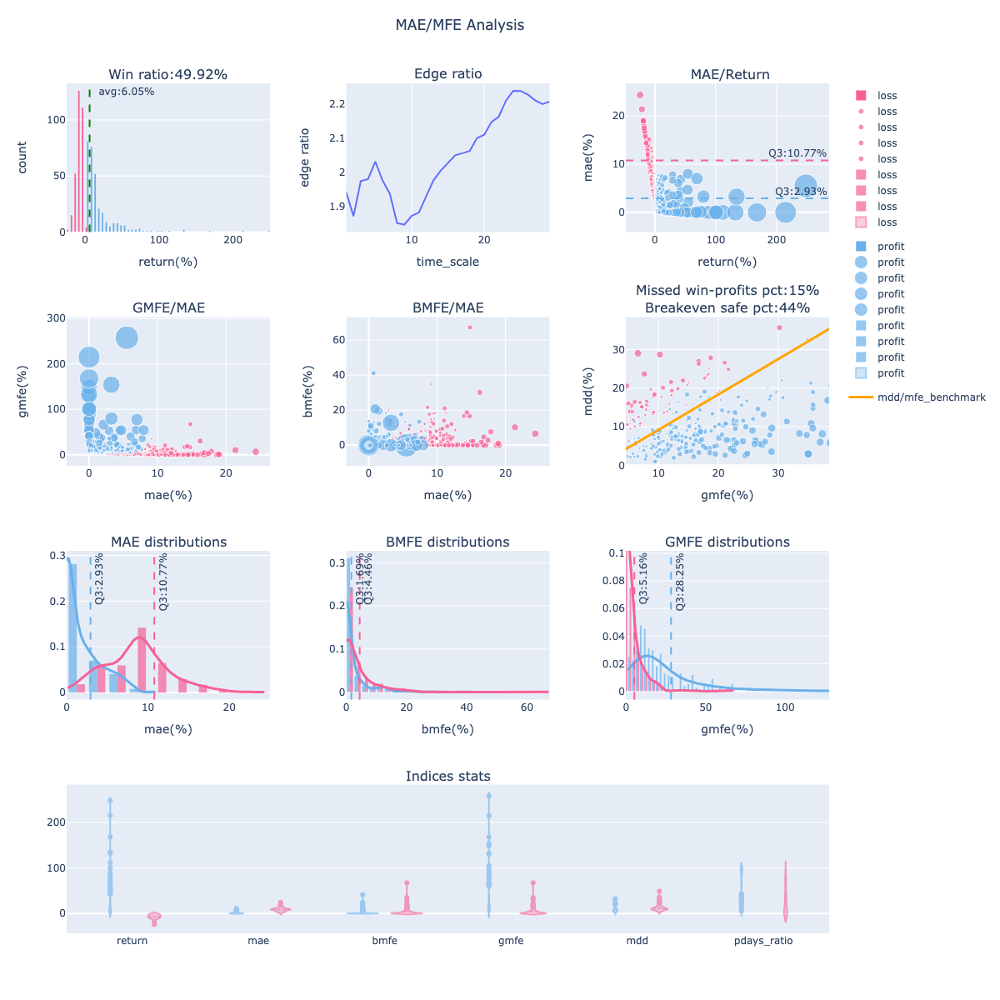
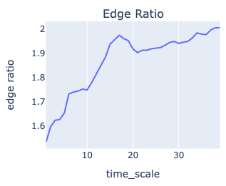
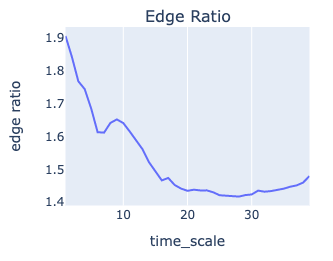

# 彈性進出場的判斷 ｜ 優勢比率應用

出處: https://www.finlab.tw/edge-ratio-follow-application/

當你開發完策略，也跑完統計清單，有沒有碰過一種狀況是策略換股週期在月初每月換股，但現在已經月中，你在猶豫適不適閤中途進場？
你一定想過若點位和日期不同，雖然是同一檔標的，但不同價位所面臨的風險完全不一樣，可能策略回測賺錢，但你中途進價太高，導致最後是虧損的局面。

或是你害怕中途進場買高，結果策略一路走高，你只能看著他一路飆，錯過補票機會。
雖然保守一點來看，其實這也沒什麼不好，少賺總比賠錢好，想貼合回測曲線，下次換股日再注意也是選項，但有沒有辦法讓我們判斷策略的進出場彈性，做更積極的決策？


## 優勢比率定義

要如何判斷策略適不適合補票(中途進場或加碼)？可以藉由海龜交易法則的 Edge Ratio (優勢比率來判斷)。
優勢比率為平均 GMFE (策略每筆交易紀錄的最大有利幅度) 除以平均 MAE (策略每筆交易紀錄的最大不利幅度)。這可以藉此評估進場優勢，一個隨機性的訊號大致上會帶來相等的 MFE 與 MAE。

若大於1，代表存在正優勢，潛在最大獲利空間比最大虧損多，在持有過程中保有優勢可以中途停利或做其他操作，也就是策略的容錯率較高。反之則為劣勢，可能要抗衡較多的虧損狀態。

## 優勢比率時序分析

我們加上時序分析，判斷策略每筆歷史交易持有過程 n 天內的優勢比率變化，看看隨著持有時間變長，優勢比率是不是會走高？通常一個好的趨勢策略，都會逐步拉開優勢空間。

### 如何使用 FinLab Package 顯示策略的優勢比率?

回測函數[sim ](https://doc.finlab.tw/reference/backtest/#finlab.backtest.sim)裡面的參數「mae_mfe_window」控制「優勢比率時序圖」的時間長度，設定40就是看40天的變化，為了加快回測運算，此參數預設為None，如果要顯示優勢比率，且既一定要自己設定「mae_mfe_window」數值。
一般來說若是月週期 (20交易日) 的策略，我都會拉長一點到40，看策略有沒有可能20天後的edge_ratio持續走升，若是此情況，可以著墨策略延後出場，獲取更多報酬的可能性。
sim會回傳[report物件](https://doc.finlab.tw/reference/analysis/#finlab.analysis.Report.display_mae_mfe_analysis)，使用report物件內的`display_mae_mfe_analysis()`方法即可顯示「波動分析圖」。想知道「波動分析圖」更多應用可參考此篇[文章](https://www.finlab.tw/display_mae_mfe_analysis/)。

```python
from finlab.backtest import sim

report=sim(position=position, mae_mfe_window=40)
report.display_mae_mfe_analysis()
```

回傳圖表的最上排第二張子圖即是「優勢比率時序圖」。

「波動分析圖


## 分析案例

舉幾個FinLab策略的時序圖來示範「優勢比率時序圖」如何分析 ?

### 營收動能瘋狗策略



優勢比率開高一路走升，優勢空間隨著時間放大，擁有不錯的趨勢策略特質，有較高的近場彈性，但接近第20天左右(下次營收截止日換股)有高峰，這時就不建議中途進場，容易在高點套住，應等下期緩股訊號出現。
[策略連結](https://ai.finlab.tw/strategyview/?uid=TJN4FDuqrwU8DML7DAjUYFIMutp2&sid=營收強勢動能瘋狗)。

### 投信大哥跟屁蟲策略



三天決勝負的短線策略。
優勢開高後一路走跌，優勢空間隨著時間快速縮小，越慢進場的局面越不利。
極度不適合延遲進場，沒跟到第一天就別跟了。
投信買賣超這個因子對短線較有影響力，過去市場應有不少人在投信短期大買後跟單，導致此現象，但這項催化劑也退的很快，長期走勢的影響力就不大，容易被其他變數幹擾，較不適合當中長期因子。
[策略連結](https://ai.finlab.tw/strategyview/?uid=TJN4FDuqrwU8DML7DAjUYFIMutp2&sid=投信大哥跟屁蟲)。

### 藏獒策略


類似營收動能瘋狗策略，但不強調營收創新高，比較多轉機股條件。
優勢比率在第五天創出小高峰後，會有一段明顯回撤，也就是延遲第8天進場的話，甚至有機會買的比第一天成本比，過了這個小低谷後，優勢空間開始走出大波段。
[策略連結](https://ai.finlab.tw/strategyview/?uid=TJN4FDuqrwU8DML7DAjUYFIMutp2&sid=藏獒)。

## 結論

你的策略有什麼樣子的「優勢比率時序圖」呢？趕緊用FinLab Package 來實做看看，會夠瞭解你策略的細節喔！