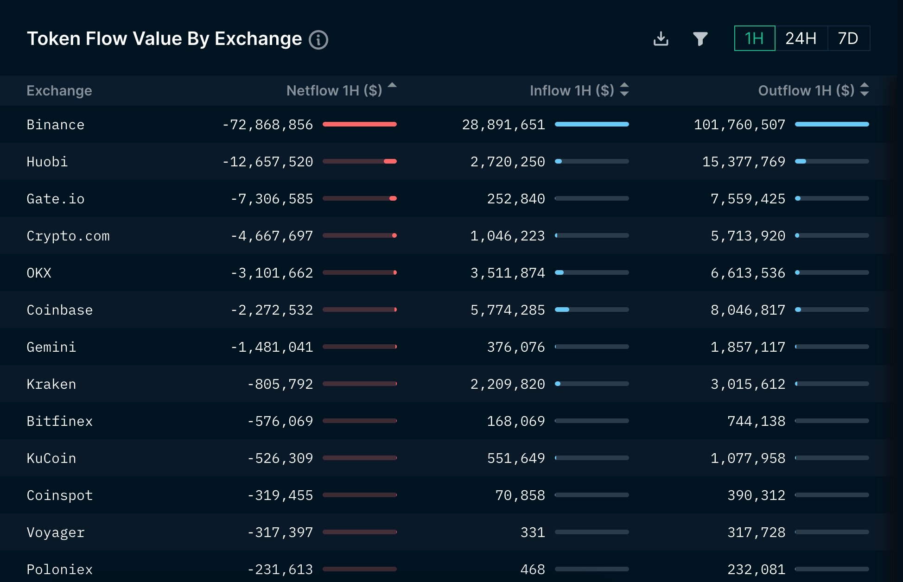
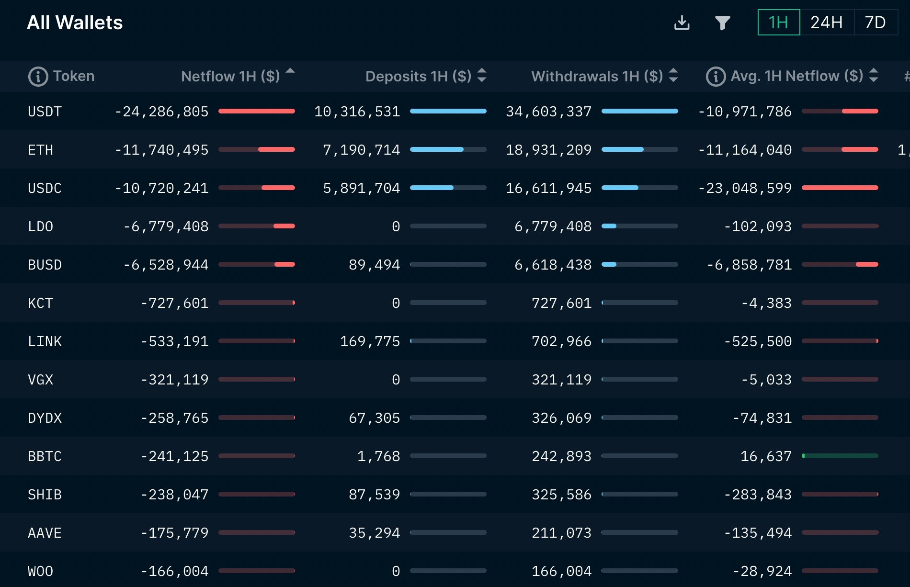
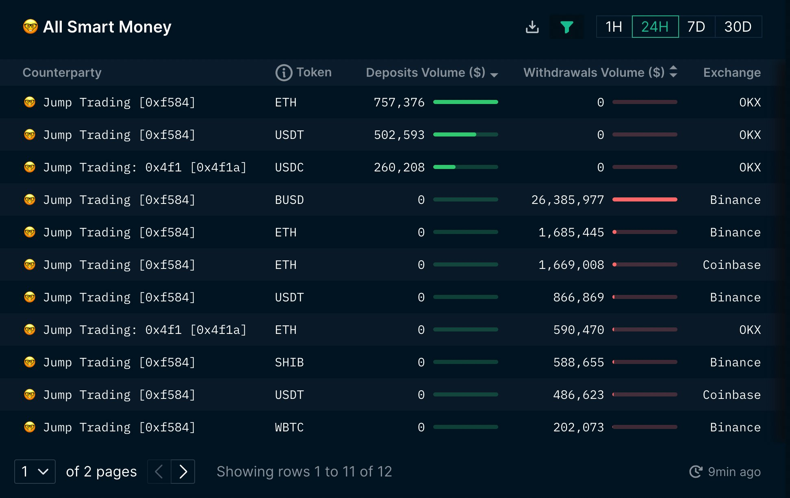
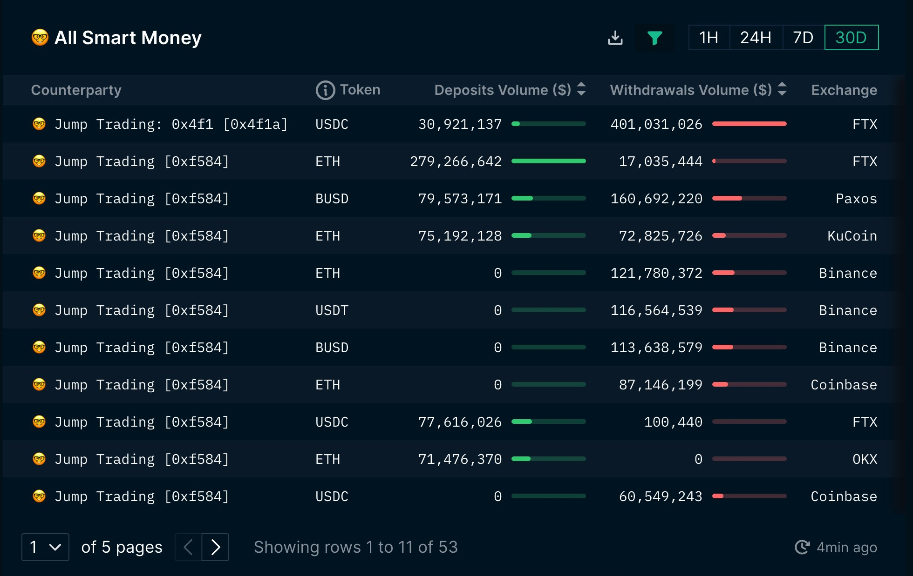

#### **Nansen**

Nansen專注於追蹤鏈上活動，以"為鏈上地址打標簽"而出名，其中最有名的標簽就是“smart money”--聰明錢。擁有聰明錢標簽的是加密世界中的精英們的錢包地址，他們的交易行為通常能帶來不菲的收益，其他交易者自然也想要跟隨他們的交易行為。

Nansen擁有很強的快速迭代能力，比如在NFT市場興起之後，快速推出了一係列NFT相關的產品服務，如NFT Paradise、 NFT God Mode、NFT Wallet Profiler等。

**【主要功能】**

Nansen提供的功能主要有portfolio、smart alerts、watchlist等。在Nansen的主界麵上，可以查看主要公鏈的宏觀數據、defi數據、穩定幣數據和NFT市場的基本情況，包括主要NFT的市值、地板價、成交量、成交額和持有錢包數等。

portfolio：Nansen的用戶可以使用錢包地址登錄他們的網站，登錄後，就可以在頁麵上查看錢包地址下所有的資產、交易記錄、資產分析等。

smart alerts：Nansen允許用戶訂閱智能警報，在他們訂閱的地址進行活動時他們會收到通知。

watchlist：用戶可以向watchlist中添加想要監測的錢包地址，來隨時監測該地址的動向。

目前Nansen提供一部分免費功能，但絕大部分功能需要付費使用，這也是nansen的主要收入來源。

**【是否支持自定義數據】**

目前Nansen提供的數據都是經過他們處理的，不支持用戶自定義的數據分析。由於他們麵向的主要是需要高可用數據的機構投資者，因此提供的數據基本都是已經建模處理過後的成品數據。

**【覆蓋區塊鏈】**

Nansen已經支持了包括 Layer 2 在內的41條公鏈上的數據。

**【數據延遲】**

分鐘級彆延遲。

**【研報】**

Nansen擁有一個由18名分析師組成的分析團隊，在他們網站的nansen research板塊中為用戶提供研報，研究的內容涵蓋了L1/L2, NFT, GAMING, DEFI和宏觀趨勢等。

https://pro.nansen.ai/

交易所資金流動狀況
https://pro.nansen.ai/exchange-flows/exchanges

https://portfolio.nansen.ai/dashboard/binance
https://portfolio.nansen.ai/dashboard/okx
https://portfolio.nansen.ai/dashboard/bybit
https://portfolio.nansen.ai/dashboard/bitfinix

#### 通知  slack , tele

[Smart Alerts](https://pro.nansen.ai/alert-triggers)

[Nansen.ai - 如何追蹤大戶](https://www.youtube.com/watch?v=wwCZ11lAC4Y&ab_channel=mrblock%E5%8D%80%E5%A1%8A%E5%85%88%E7%94%9F)

[Nansen：鏈上數據分析初步指南](https://www.youtube.com/watch?v=yiirdqwDJHQ&ab_channel=GRENADE%E6%89%8B%E6%A6%B4%E5%BD%88)

---

[幣安出現什麼徵兆時要塊陶？](https://disp.cc/b/DigiCurrency/fyaw)

作為一個hodler 熊市時我其實不太關注市場消息
這也導致此次FTX事件中後知後覺 被關廁所損失近40萬鎂

雖然主要資產是放在冷錢包中, 但這個損失還是不少
如果回到11/05, 是否有什麼確切證據可以知道FTX已經發生擠兌?

(板上的示警文章已看過, 有板友也因此得救, 但我想知道的是確實數據)

1) 以前常用的例如 Whale Alert:
   https://twitter.com/whale_alert

   能否事先看出來? 在搜尋列輸入過濾條件
   ftx from:whale_alert since:2022-11-05
   從11/05到寫這篇文章的期間只有30筆alert, 坦白說看不出什麼跡象

   過濾條件:
   binance from:whale_alert since:2022-11-05
   可以看到過去幾天有相當大額的#USDC burned (可能為提現)

   實際來說, 一家交易所如果要避開whale alert的偵測, 只要切細成較小額度
   就能辦到, 例如100M USD切成1M x 100, 就偵測不到
   所以也許FTX原本就是都切成小額居多, 而幣安比較沒這樣做
   無論如何, 用whale alert似乎不太靠譜

2) 使用鏈上數據分析, 例如Nansen:
   https://pro.nansen.ai/

   有七天試用期, 長期用要繳費, 另外它有twitter:
   https://twitter.com/nansen_ai

   正在示警各穩定幣和ETH大量流出:

   Exchange ETH & ERC20 tokens netflow in the last hour

   Binance -$72.9M
   Huobi -$12.7M
   Gateio -$7.3M
   Cryptocom -$4.7M
   OKX -$3.1M

   Bittrex +$771K
   Bitkub +$496K
   Paribu +$191K
   Bitpanda +$55K
   Probit +$51K

   *ETH & ERC20 tokens only, from addresses that we have labeled

Most of the withdrawals/negative netflows are in

USDT -$24.3M
ETH -$11.7M
USDC -$10.7M
LDO -$6.8M
BUSD -$6.5M

過去7天交易所流出排行:
https://twitter.com/nansen_ai/status/1591617986275966976/photo/1

Jump Trading in the last 24 hours:

Total withdrawals from exchanges:
$32.5M

Total deposits: 
$1.5M

*ETH & ERC20 tokens only, from addresses that we have labeled

In the last 7 days: 

Total withdrawals:
$691M

Total deposits: 
$229M

過去30天交易所流出排行:
https://twitter.com/nansen_ai/status/1591617991648890880/photo/1

In the last 30 days:

Total withdrawals:
$1.5B

Total deposits: 
$750M

不意外的看到FTX流出42B, 但只回補了39B, 而幣安則流出45B
此外鏈新聞在11/07示警FTX流出大量穩定幣也是採用nansen的數據:
https://abmedia.io/20221107-ftx-stable-coin-outflow

[**用戶避風頭？FTX穩定幣發生大量提幣，幣安流入超過3億！ | 鏈新聞 ABMedia**](https://abmedia.io/20221107-ftx-stable-coin-outflow)
[![[圖\]](https://abmedia.io/wp-content/uploads/2022/11/GTLQ0G88P7WP72YDEL9MLV5VSDLXD34IW0H6TIG147JE1W98AP2ROJS7GNC0IQEO.png)](https://abmedia.io/20221107-ftx-stable-coin-outflow)資產機構 Alameda Research 的資產結構疑雲事件在近期引起不少討論，甚至引起 FTX 及幣安執行長的網路論戰、籌碼較勁。若從鏈上數據角度出發，可發現此事件已對 FTX 用戶造成影響並引發大量提幣，使數億美元的穩定幣從 FTX 流出。 ...

但這篇新聞的圖表並非來自twitter, 且它還列出各家交易所穩定幣餘額
並示警FTX在11/07時就只剩261M美金的穩定幣了

看來使用Nansen是可以看得出來, 前提是付費使用者以及有習慣看圖表

3) 追蹤名人的推特:
   除了以上提到的以外, CZ呀、kraken官方..等等的也許能得到警訊

4) 查看交易所列出的錢包:
   在這個恐慌期中, 各家交易所又想起了PoR的重要性, 但這也不是能短時間做好的,
   以幣安為例, 就先給出了它的冷熱錢包:
   https://reurl.cc/LXMAmy

   其中BUSD和BNB先不用管, 專注看它的BTC, ETH, 和USDC錢包即可

   這三種錢包加總約有十幾B美金的價值, 但別忘了FTX光11/08單日就被提款50B
   如果爆發恐慌擠兌, 以幣安市佔為FTX 4倍來估算, 這點錢應該是瞬間就空了

實際動作：
鑒於FTX的爆炸, 我開始轉出除了kraken以外交易所裡的資產
BTC和ETH直接打入冷錢包, 其餘小幣都賣成穩定幣
以幣安來說就是都賣成BUSD, 然後走erc20匯出成USDC

如果很多人也正在跟我做一樣的事, 則BTC和ETH相對抗跌
也不排除有人是賣小幣買成ETH存冷錢包的
而其他幣無可避免要先崩一波了

