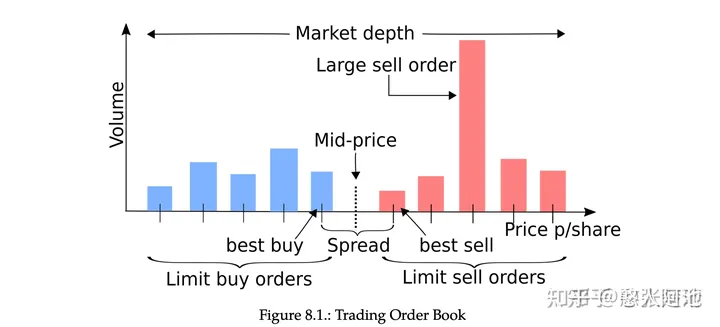

## 量化交易學習-訂單簿建模

出處:https://zhuanlan.zhihu.com/p/499342831

## 相關資料蒐集：

[Quant最愛：【HFT系列】基於機器學習的動態高頻限價訂單簿框架（Tick資料）](https://zhuanlan.zhihu.com/p/37825746)

[Optimal high-frequency market making strategy research based on limit order book](https://link.zhihu.com/?target=https%3A//www.sysengi.com/CN/10.12011/1000-6788(2018)01-0016-19)

[https://github.com/timothyyu/gdax-orderbook-ml](https://link.zhihu.com/?target=https%3A//github.com/timothyyu/gdax-orderbook-ml)

[R語言對高頻交易訂單流進行建模分析 3](https://link.zhihu.com/?target=https%3A//blog.csdn.net/oxuzhenyi/article/details/77586465)

[R語言對高頻交易訂單流進行建模分析 4](https://link.zhihu.com/?target=https%3A//blog.csdn.net/oxuzhenyi/article/details/77586479)

[Quant最愛：重構訂單簿！基於深度學習的A股Tick級價格變動預測](https://zhuanlan.zhihu.com/p/417149085)

[數量技術宅：股指期貨高頻資料機器學習預測](https://zhuanlan.zhihu.com/p/335257490)

[張楚珩：【強化學習 187】Order Book Trading + RL](https://zhuanlan.zhihu.com/p/417118422)

[陳穎：基於高頻limit order book資料的短程價格方向預測——via multi-class SVM](https://zhuanlan.zhihu.com/p/22335838)

[文兄：【量化策略】基於Level 2高頻資料的機器學習預測研究](https://zhuanlan.zhihu.com/p/24910472)

[Haitian Wei：orderbook模型論文筆記](https://zhuanlan.zhihu.com/p/20116878)

[基於深度學習的股票限價訂單簿中間價格預測研究](https://link.zhihu.com/?target=https%3A//www.doc88.com/p-95329032997779.html)

[基於Order Book的簡單特徵：以Optiver競賽為例](https://link.zhihu.com/?target=https%3A//xueqiu.com/8188497048/198528860)

[基於Order Book的深度學習模型：預測多時間段收益序列](https://link.zhihu.com/?target=https%3A//mp.weixin.qq.com/s/N12GzvYCOpcqDlkaei5moA)

[https://towardsdatascience.com/price-impact-of-order-book-imbalance-in-cryptocurrency-markets-bf39695246f6](https://link.zhihu.com/?target=https%3A//towardsdatascience.com/price-impact-of-order-book-imbalance-in-cryptocurrency-markets-bf39695246f6)

相關的論文可是老多了，挑幾個：

[Investigating Limit Order Book Characteristics for Short Term Price Prediction: a Machine Learning Approach](https://link.zhihu.com/?target=https%3A//arxiv.org/abs/1901.10534v1)

[https://arxiv.org/abs/2007.07319](https://link.zhihu.com/?target=https%3A//arxiv.org/abs/2007.07319)

[DeepLOB: Deep Convolutional Neural Networks for Limit Order Books](https://link.zhihu.com/?target=https%3A//arxiv.org/abs/1808.03668v6)

## 一張圖解釋訂單簿：

## 可能能用的特徵：

1. 基本：K線、交易量、大單交易量、趨勢指標等。
2. 訂單簿快照資料，價格、數量、訂單數量、訂單持續時間
3. 買單賣單跨度，買單賣單均值
4. 加權平均價格
5. 訂單價格差，累計加權價格差
6. 買賣訂單密度，分佈刻畫。泊松分佈建模
7. 訂單分佈的變化，變化速率
8. 時間相關：每檔變化量，變化率，買賣檔位的變化差異。一段時間的新增限價單、市價單、取消單的總量，當前時段相對歷史的比例，總量變化率。對數收益率

## 模型目標：

1. 趨勢分類：一段時間後的價格變化，分類模型
2. 做市商演算法：AS模型的保留價格與最優差價

## 問題：

1. 模型低訊號雜訊比，如何進行設計
2. 間隔時間的參數調優，論文說2horizon最好。標的物的流動性建模。