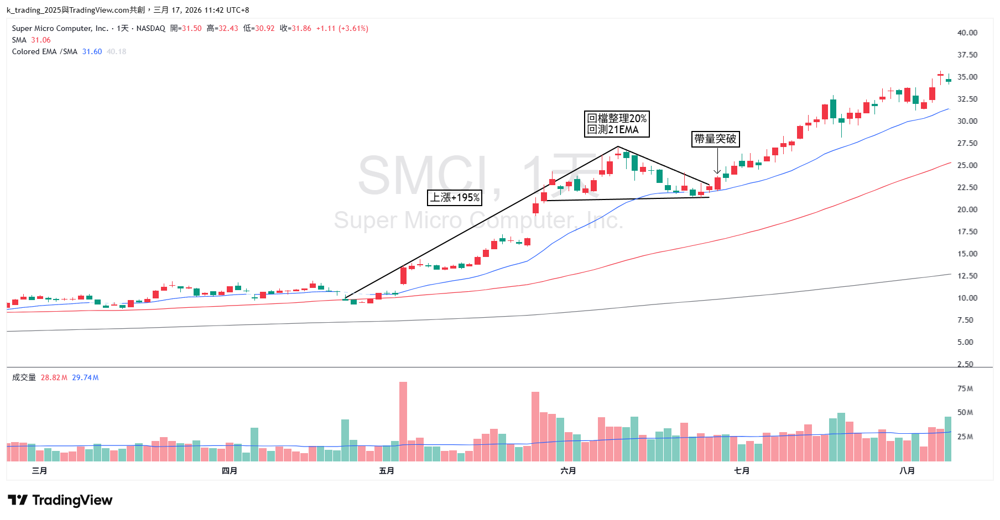
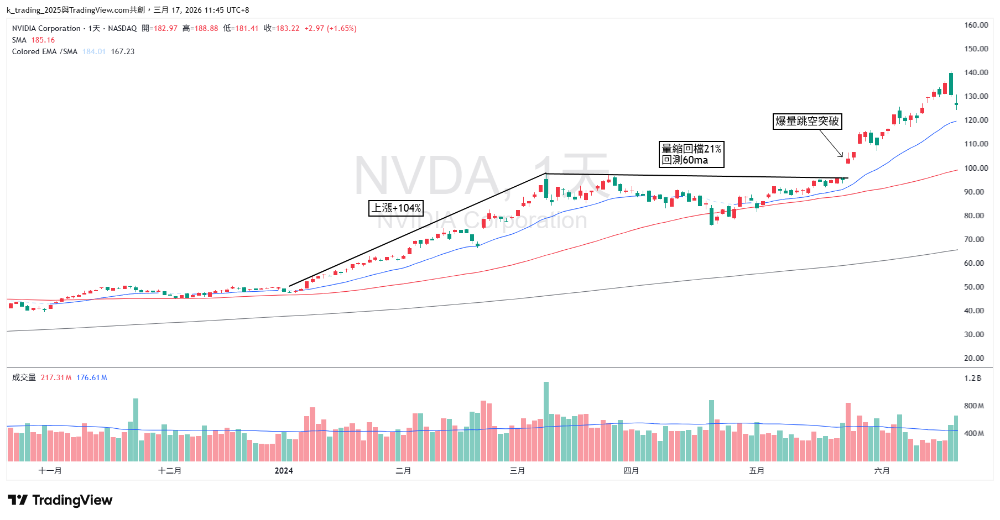
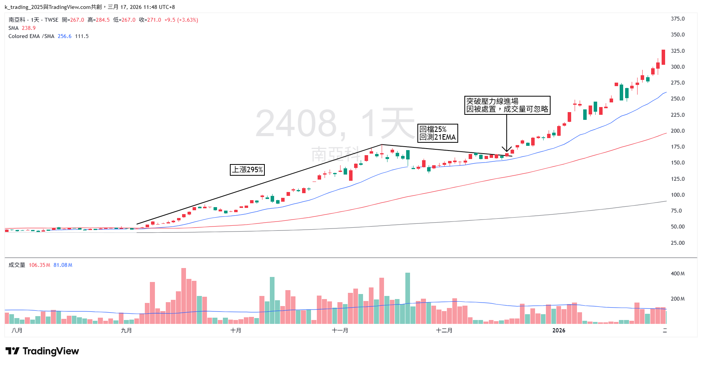

# Qullamaggie HTF 交易策略完整解析

如果你有在研究動能交易，那你一定要研究 Kristjan Kullamägi。網路上大家更習慣叫他 **Qullamaggie**。

這位來自瑞典斯德哥爾摩的交易者，用一個 5,000 美元的帳戶，靠著一套極度系統化的動能波段交易框架，將資金翻到超過 1 億美元。

沒有富爸爸、沒有內線消息、沒有機構資源。就是一個人、一台電腦、一套他花了數千小時打磨出來的交易系統。

> 如果你只能交易一種型態，那就選 High Tight Flag。你會賺到多到不知道怎麼花的錢。

這篇文章整理 Qullamaggie 這個人，以及他最核心的武器：HTF 的完整交易策略，並附上幾個實際案例。

## 一、Qullamaggie 是誰？

Kristjan Kullamägi 是瑞典全職交易者。他不是金融科班出身，最初只是一個普通的年輕人，靠著自學技術分析和圖表研究，在美股市場中找到了自己的利基。

他的交易哲學可以用一句話概括：**虧損極小，獲利極大**。

他的勝率只有 25%～30%，也就是說每 10 筆交易大概只有 2 到 3 筆賺錢。但他賺錢的那幾筆，獲利往往是初始風險的 5 倍、10 倍，甚至 20 倍以上。

這就是他所謂的 **非對稱風險回報（Asymmetric Risk/Reward）**：你不需要每一筆都對，只需要做對的時候，讓利潤真正奔跑。

## 二、什麼是高漲旗型（HTF）

HTF 是 High Tight Flag 的縮寫。關於 HTF 型態的詳細條件與範例，可參考這篇：[交易技術｜高漲旗型（High-Tight Flag）](https://vocus.cc/article/6801a304fd89780001215c92)。

HTF 的概念很直觀：一檔股票在短時間內出現一波 **爆發性大漲**，然後進入一段 **有序、波幅逐漸收斂的盤整**。當股價帶量突破盤整區間時，往往會開啟下一波同等級甚至更大的漲幅。

用白話來說就是：**大漲 → 休息 → 再大漲**。

如果你研究過去 100 年來那些漲了 5 倍、10 倍的超級飆股，會發現它們幾乎都是以這種「階梯式」的方式上漲。不是一口氣直線拉上去，而是漲一段、整理一段、再漲一段。HTF 就是在捕捉「整理完畢、即將再次啟動」的關鍵時刻。

## 三、HTF 交易的完整 SOP

### 第一步：選股，找到全市場最強的 1%

Qullamaggie 絕不交易沒在動的股票。他每天篩選全市場個股，找出過去 1 個月、3 個月和 6 個月內，**漲幅位居全市場前 1%～2% 的股票**。

這些股票就是所謂的強勢股。它們之所以漲得多，背後通常有機構法人在大力買進，這就是動能的來源。

此外，他偏好 **ADR（平均每日波幅）大於 4%～5%** 的股票，因為波動夠大才有足夠的利潤空間。

### 第二步：等待型態成熟

篩出強勢股後，不是馬上衝進去買，而是必須等待股價形成完整的 HTF 型態：

- 旗桿夠高（前期漲幅 30% 以上）
- 旗面夠緊（波幅逐漸收斂，量能萎縮）
- 均線有支撐

### 第三步：進場，開盤區間突破

當型態成熟、股價開始向上挑戰盤整區間上緣時，用突破當日高點的策略進場。

具體做法是觀察開盤後 5 分 K 或 60 分 K。當股價向上突破該 K 線高點，同時突破日線級別的盤整區間時，市價買入。

> 註：此方法適用美股，但不太適用台股，因為台股假突破較多。

重點是 **絕不預測，絕不 FOMO 進場**，必須等到價格真正帶量突破時才進場。

### 第四步：停損，當日低點

停損永遠設在 **進場當日的最低點**。

> 註：此方法適用美股，但不太適用台股，因為台股假跌破較多。

這裡有一個鐵律：**停損幅度不能超過該股票的 ADR**。舉例來說，如果一檔股票的 ADR 是 5%，但你的停損距離卻要 10%，代表風險報酬比已經失衡，這筆交易必須放棄。

### 第五步：部分停利與移動停損

進場後的 3～5 天內，通常會有一波急漲。這時候：

1. 賣出 1/3 到 1/2 的部位，先將獲利落袋。
2. 停損上移到進場成本價，確保剩餘部位不會虧錢。
3. 剩餘部位用 10MA 或 20MA 作為移動停損。
4. 只有當收盤價跌破均線時才出清，盤中跌破不算。

這就是 Qullamaggie 的交易精髓：**鎖定利潤、消除風險，然後讓剩餘部位盡情奔跑**。在多頭市場中，一筆好的 HTF 交易獲利達到初始風險的 10～20 倍以上，是很常見的事。

## 四、風控：數學上的非對稱優勢

Qullamaggie 對風險管理有近乎偏執的嚴格要求：

- 單筆風險上限：每筆交易的風險控制在帳戶總資金的 0.25%～1%，極少超過 1%。
- 單一部位上限：通常佔帳戶的 10%～20%。
- 隔夜持倉上限：任何單一標的不超過帳戶總額的 30%。
- 絕不向下攤平：只在獲利的部位上加碼，而且必須等到形成新的盤整並再次突破。

另外一個很重要的觀念是 **市場環境感知**。HTF 突破策略並不是在所有市場環境下都有效。Qullamaggie 只有在指數（S&P 500 或 Nasdaq）的 **10MA 高於 20MA，且雙雙呈上升趨勢時**，才會積極做多。

如果大盤在空頭或震盪，突破的失敗率會極高，這時候最好的策略就是縮小部位，甚至空手觀望。

## 五、實際案例

### 案例一：SMCI，2023 年 AI 浪潮的經典 HTF

### 案例二：NVDA，2023 年 AI 財報的 HTF

### 案例三：南亞科，HTF 的台股實戰

以上案例說明，不管是美股、台股、日股、陸股，甚至加密貨幣，只要有足夠的流動性和波動性，HTF 的邏輯在任何市場都成立。

因為它反映的是人類最根本的市場行為：機構買盤推動 → 短線交易者開始獲利了結 → 股價進入整理 → 新一波買盤再次推動。

## 六、為什麼多數人做不好 HTF？

講到這裡，你可能會覺得：「就這樣？看起來不難啊。」

沒錯，策略本身並不複雜，越簡單的策略通常越有效。Qullamaggie 自己也說過，這些型態在 100 年前就存在，50 年前存在，今天仍然存在。它們不會失效，因為人性不會改變。

**但難的不是知道，而是有紀律地做到。**

大部分人做不好 HTF，原因有三個。

### 第一，不願意接受頻繁的小額虧損

25%～30% 的勝率意味著你會連續被停損，一週停損 3、4 次是很正常的事。多數人在連吃幾次停損之後，就開始懷疑策略、亂改規則，最後變成情緒交易。

### 第二，賺錢的時候拿不住

好不容易抓到一檔飆股，漲了 10% 就急著全部賣掉去填補之前的虧損，然後再眼睜睜看著它又漲了 100%。讓利潤奔跑，說起來容易，做起來需要極大的心理素質。

### 第三，不看市場環境就亂開槍

空頭趨勢或指數盤整的時候硬做突破，失敗率可能超過 80%。Qullamaggie 非常強調，不是每一天都適合交易，有時候最好的交易就是不交易。

## 七、結語：刻意練習是唯一的捷徑

Qullamaggie 曾經分享過，他花了超過 7～8 年的時間，建立了一個包含數千張歷史飆股圖表的資料庫。他反覆研究過去幾十年來所有超級飆股的走勢，直到自己能夠在一秒鐘內辨識出 A+ 等級的型態。

**這就是刻意練習的力量。** 沒有捷徑，沒有聖杯，只有大量、有目的性的重複練習。

交易的成功方程式其實很簡單：

> 成功的交易 = 有效的策略 × 嚴格的風控 × 堅定的紀律

策略人人都能學會，風控規則也不難設定。但能不能在每一個不同的時刻，都有紀律地執行每一個細節，才是區分贏家和韭菜的真正分水嶺。
