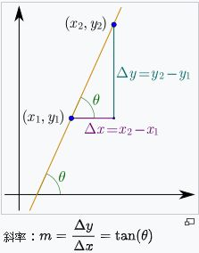

## MultiCharts用「斜率」/「角度(LinearRegAngle)」定義趨勢變化

https://www.pfcf.com.tw/featured/detail/2010

#### 線性回歸

首先讀者要稍微回憶一下中學數學--線性回歸(linear regression)，可自行GOOGLE相關資料，不想花時間知其所以然，也沒關係，直接往下讀也不難上手應用。

透過線性回歸計算，我們可以把某個區間的價格(例如過去5根K棒收盤價)計算其線性關係，如下圖所示，θ即是這條線與Y軸的角度，m斜率即是度量y與x變動比率。無論角度或斜率，在Powerlanguage都有內建函式可供直接引用計算。
 

[](https://2.bp.blogspot.com/-u0yXfr_5zIg/XJ-QDdc5EmI/AAAAAAAACNM/Rrg8V0v8Tuk6BpA1Fs0TFkGWTOQOEUWXwCLcBGAs/s1600/Multicharts_%E6%96%9C%E7%8E%87%E8%A7%92%E5%BA%A6201903001.jpg)

####  

#### 角度(LinearRegAngle)

行情強勢多頭，漲勢就會越接近90度，反之，行情重挫，下跌的角度就會接近-90度，很多人以為是要用斜率來表達價格趨勢的變化，其實用角度更為直觀。我們用LinearRegAngle這個函式可計算出角度：

LinearRegAngle(Price, Len)

例如我們想表達上漲強度變強，也就是角度越來越陡，PowerLanguage我們可以這樣寫：

*Value1= LinearRegAngle(close, 5);*
*Condition1=Value1>Value1[1];*

意即，我們計算出最近5根K棒收盤價的線性角度，然後比較前一個角度，變大就代表角度變陡。因為單算收盤價的線性回歸往往變動太大反而難以定向趨勢，可以用均線來平滑取而代之，如下：

*Value1=Average(close,5);*
*Value2= LinearRegAngle(Value1, 5);*
*Condition1=Value2>Value2[1] and Value2>60;*

如上，我們可以再多指定一個閥值，例如60度，角度上升且大於60度，定義出行情為強勢多頭。也有人再深入，就進到微積分的領域了。

 

#### 斜率(LinearRegSlope)

如前面所言，我們想表達(趨勢)斜率變陡或變平，我們其實想要的是角度而非斜率，或者說採用角度(LinearRegAngle)是比較值觀好用的，當然如果你堅持要用斜率也無不可，用法與上面角度一樣，斜率函式為：

LinearRegSlope(Price, Len)

 

#### 結論與後記

其實我們都知道市場價格非線性，橫豎也回歸不出來，卻使用從線性回歸得出的角度或斜率似乎有些矛盾弔詭，不過無妨，這樣的運用提供我們一個量化且具體的數字跟邏輯，仍有其價值。在MultiCharts裡尚有Linear Reg Curve這個指標，主要是用到LinearRegValue這個函式，可以根據線性回歸公式算出目前甚至未來的”理論”價格，這類預測價格的做法，實務價值反而就不大了。


---

```python
#!/usr/bin/env python
# coding: utf-8

# # Algo Trad Pipeline
# > A basic example of a algo trading pipeline with data fetch, strategy, backtest and online trading.
# 
# - toc: true 
# - badges: true
# - comments: true
# - categories: [jupyter]
# 

# ### Install dependence & init setting

# In[ ]:


pip install cryptota -U


# In[ ]:


# INIT
# Fetch data setting
CRYPTO    = "ADAUSDT"
START     = '7 day ago UTC'
END       = 'now UTC'
INTERVAL  = '1m'
# trading strategy parameter
PARAMETER = { "initial_state": 1, "delay": 500, "initial_money": 100,"max_buy":10, "max_sell":10 }
# binance api key and secret
APIKEY    = ""
APISECRET = ""


# In[ ]:


import cryptota
import vectorbt as vbt
import numpy as np
from binance import Client, ThreadedWebsocketManager, ThreadedDepthCacheManager
import matplotlib.pyplot as plt
import time
from datetime import timedelta

client = Client(APIKEY,APISECRET)


# In[ ]:


UNITS = {"s":"seconds", "m":"minutes", "h":"hours", "d":"days", "w":"weeks"}

def convert_to_seconds(s):
    count = int(s[:-1])
    unit = UNITS[ s[-1] ]
    td = timedelta(**{unit: count})
    return td.seconds + 60 * 60 * 24 * td.days


# ### Fetch data

# In[ ]:


binance_data = vbt.BinanceData.download(
    CRYPTO,
    start=START,
    end=END,
    interval=INTERVAL
)


# In[ ]:


price = binance_data.get()


# In[ ]:


price


# ### Get technology analysis feature

# In[ ]:


ta = cryptota.TA_Features()
df_full = ta.get_all_indicators(price.copy())


# In[ ]:


df_full


# ### Purpose a strategy

# In[ ]:


def buy_stock(
    real_movement,
    delay = 5,
    initial_state = 1,
    initial_money = 10000,
    max_buy = 1,
    max_sell = 1,
    print_log=True
):
    """
    real_movement = actual movement in the real world
    delay = how much interval you want to delay to change our decision from buy to sell, vice versa
    initial_state = 1 is buy, 0 is sell
    initial_money = 1000, ignore what kind of currency
    max_buy = max quantity for share to buy
    max_sell = max quantity for share to sell
    """
    starting_money = initial_money
    delay_change_decision = delay
    current_decision = 0
    state = initial_state
    current_val = real_movement[0]
    states_sell = []
    states_buy = []
    states_entry = []
    states_exit = []
    current_inventory = 0

    def buy(i, initial_money, current_inventory):
        shares = initial_money // real_movement[i]
        if shares < 1:
            if print_log:
                print(
                    'day %d: total balances %f, not enough money to buy a unit price %f'
                    % (i, initial_money, real_movement[i])
                )
        else:
            if shares > max_buy:
                buy_units = max_buy
            else:
                buy_units = shares
            initial_money -= buy_units * real_movement[i]
            current_inventory += buy_units
            if print_log:
                print(
                    'day %d: buy %d units at price %f, total balance %f'
                    % (i, buy_units, buy_units * real_movement[i], initial_money)
                )
            states_buy.append(0)
        return initial_money, current_inventory

    if state == 1:
        initial_money, current_inventory = buy(
            0, initial_money, current_inventory
        )

    for i in range(0, real_movement.shape[0], 1):
        sentry = False
        sexit = False
        if real_movement[i] < current_val and state == 0:
            if current_decision < delay_change_decision:
                current_decision += 1
            else:
                state = 1
                initial_money, current_inventory = buy(
                    i, initial_money, current_inventory
                )
                current_decision = 0
                states_buy.append(i)
                sentry = True
                
        if real_movement[i] > current_val and state == 1:
            if current_decision < delay_change_decision:
                current_decision += 1
            else:
                state = 0

                if current_inventory == 0:
                    if print_log:
                        print('day %d: cannot sell anything, inventory 0' % (i))
                else:
                    if current_inventory > max_sell:
                        sell_units = max_sell
                    else:
                        sell_units = current_inventory
                    current_inventory -= sell_units
                    total_sell = sell_units * real_movement[i]
                    initial_money += total_sell
                    try:
                        invest = (
                            (real_movement[i] - real_movement[states_buy[-1]])
                            / real_movement[states_buy[-1]]
                        ) * 100
                    except:
                        invest = 0
                    if print_log:
                        print(
                            'day %d, sell %d units at price %f, investment %f %%, total balance %f,'
                            % (i, sell_units, total_sell, invest, initial_money)
                        )

                current_decision = 0
                states_sell.append(i)
                sexit = True
        states_entry.append(sentry)
        states_exit.append(sexit)
        current_val = real_movement[i]
        
    invest = ((initial_money - starting_money) / starting_money) * 100
    total_gains = initial_money - starting_money
    return states_buy, states_sell,states_entry,states_exit, total_gains, invest


# ### Backtest

# In[ ]:


states_buy, states_sell, states_entry, states_exit, total_gains, invest = buy_stock(df_full.close,**PARAMETER)


# In[ ]:


close = df_full['close']
fig = plt.figure(figsize = (15,5))
plt.plot(close, color='r', lw=2.)
plt.plot(close, '^', markersize=10, color='m', label = 'buying signal', markevery = states_buy)
plt.plot(close, 'v', markersize=10, color='k', label = 'selling signal', markevery = states_sell)
plt.legend()
plt.show()


# In[ ]:


fees = 0.001
try:
  fees = client.get_trade_fee(symbol=CRYPTO)[0]['makerCommission']
except:
  pass


# In[ ]:


portfolio_kwargs = dict(size=np.inf, fees=float(fees), freq=INTERVAL)
portfolio = vbt.Portfolio.from_signals(df_full['close'], states_entry, states_exit, **portfolio_kwargs)


# In[ ]:


portfolio.plot().show()


# In[ ]:


portfolio.stats()


# ### Online

# In[ ]:


info = client.get_symbol_info(CRYPTO)
info


# In[ ]:


while True: 
    binance_data = binance_data.update()
    price = binance_data.get()

    states_buy, states_sell, states_entry, states_exit, total_gains, invest = buy_stock(price.Close, 
                                                                                        initial_state = 1, 
                                                                                        delay = 10, 
                                                                                        initial_money = 1,
                                                                                        max_buy=1,
                                                                                        max_sell=1,
                                                                                        print_log=False)

    states_entry[-1],states_exit[-1]
    
    if not (states_entry[-1] or states_exit[-1]):
        print("doing_noting")
    if states_entry[-1]:
        order = client.create_test_order( ## use test_order for real~
        symbol='ADAUSDT',
        side=Client.SIDE_BUY,
        type=Client.ORDER_TYPE_MARKET,
        quantity=8)
        print("buy",order)
    if states_exit[-1]:
        order = client.create_test_order( ## use test_order for real~
        symbol='ADAUSDT',
        side=Client.SIDE_BUY,
        type=Client.ORDER_TYPE_MARKET,
        quantity=8)
        print("sell",order)
    
    time.sleep(convert_to_seconds(INTERVAL))

```

