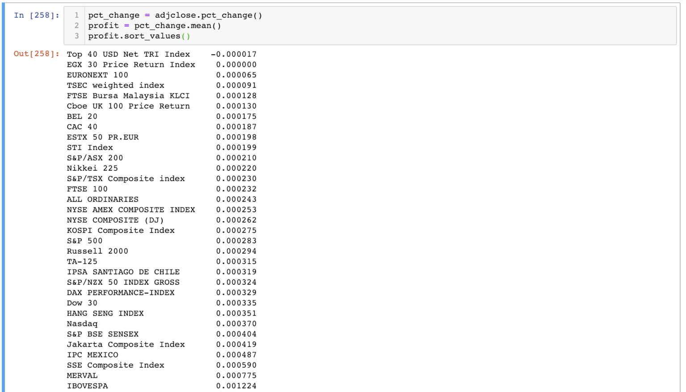
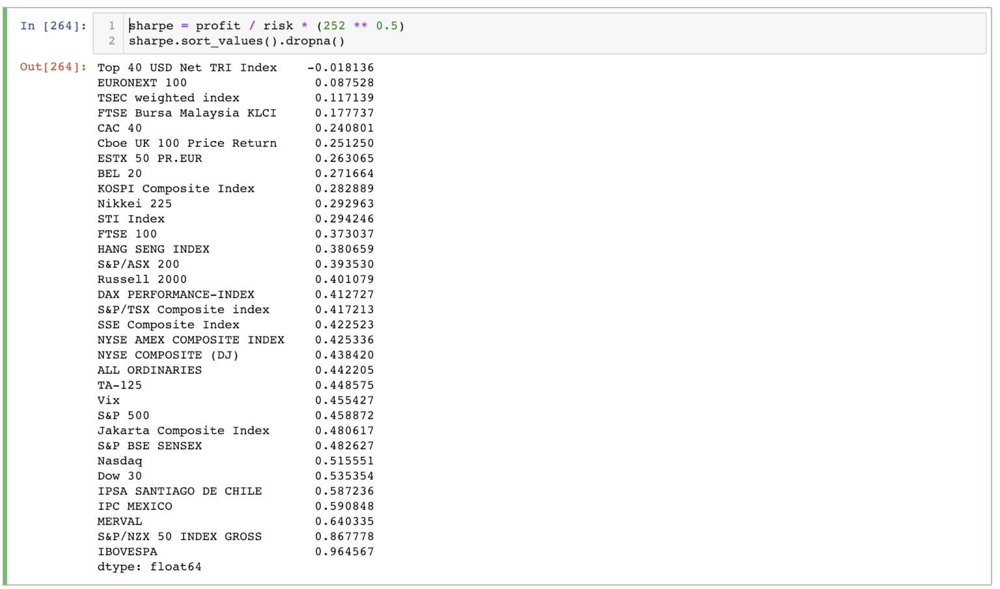
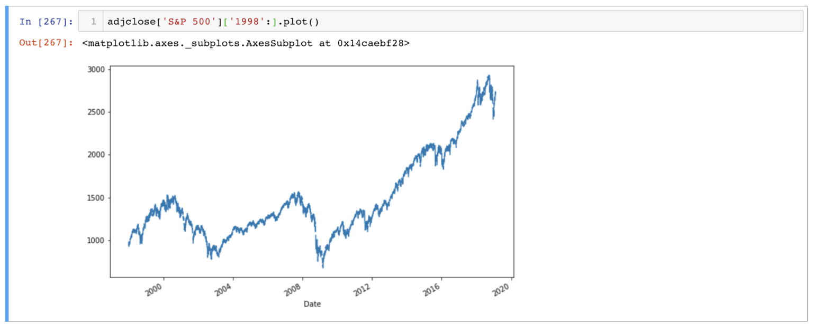
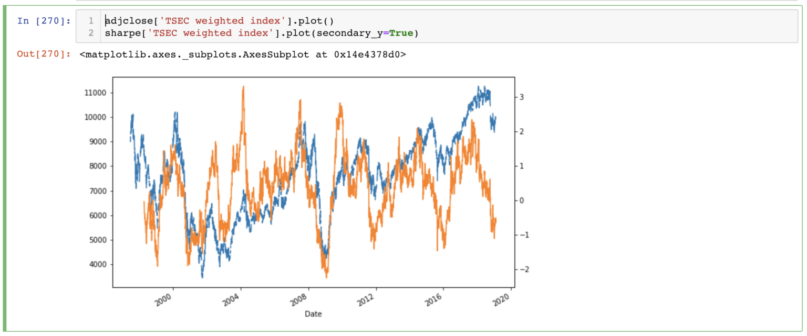
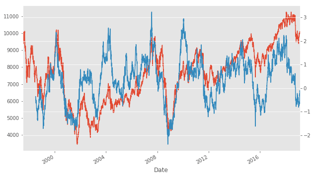
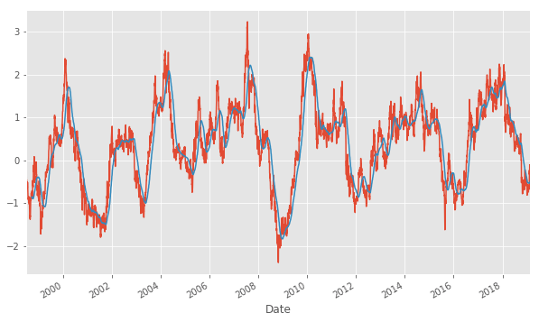
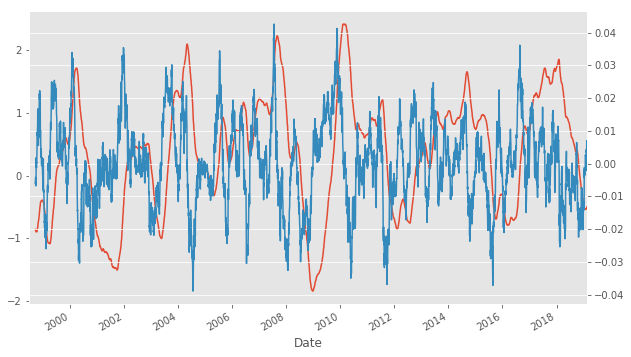
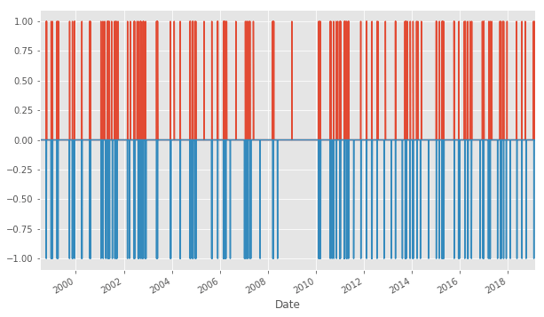
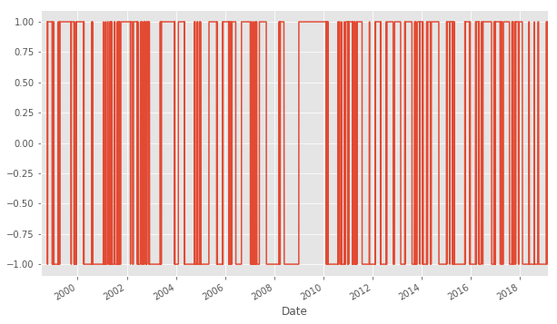

# 如何衡量風險與報酬？夏普比率告訴你

出處:https://www.finlab.tw/python%E6%96%B0%E6%89%8B%E6%95%99%E5%AD%B8%EF%BC%9A%E9%A2%A8%E9%9A%AA%E8%88%87%E5%A0%B1%E9%85%AC/

### sharp ratio 簡單講，就是「報酬 / 風險」！

以這著比率，可以想像，sharp ratio 越高，代表獲利大於風險，
而sharp ratio 越低，代表風險大於獲利，那就會有點危險了！
所以找一個sharp ratio 越高的指數，就等於找出了「獲利大且風險相對小」的指數喔！

### 如何定義獲利？

獲利可以用每天平均的漲跌來代表，也就是今天漲1％，明天跌1％，平均獲利就是0％，
接下來我們就用python來計算每天平均獲利吧

首先，記得回去前一個單元，找出上次的adjclose：


接下來，我們就可以來計算獲利：

```python
pct_change = close.pct_change()
profit = pct_change.mean()
profit.sort_values()
```

上方的程式碼，
第一行，有好用的功能，叫做`adjclose.pct_change()`，這個函示會計算今天漲了x％，並且以x/100來表示，將整個table中的每一條時間序列都進行計算喔！
第二行，針對每一檔指數，將每一天的漲跌都平均起來，
第三行，進行由小到大的排序



以平均獲利來說，看到臺股（TSEC weighted index）竟然排在倒數第三位，
可以見臺灣投資人多麼可憐XDD

### 如何衡量風險

風險通常會用標準差（standard deviation）來計算，標準差，可以想像是股票震盪的程度，例如金融海嘯的時候，股票上上下下的比較劇烈，標準差很大。今天就不折磨各位了，有興趣請參考[wiki介紹](https://zh.wikipedia.org/zh-tw/標準差)，我們直接用 python 當中現有的程式碼來計算即可：

```python
risk = pct_change.std()
```

### 計算sharpe ratio

這個就更簡單了，直接相除即可

```python
sharpe = profit / risk * (252 ** 0.5)
sharpe.sort_values()
```

可以看到上述程式，我們額外乘了一個「252 ** 0.5」
因為我們希望算年化 annual sharpe ratio，
其中的252是一年大約的交易天數，
而「**」是「次方」的意思。
為什麼要乘這個常數？最主要是因為大家幫自己的歷史回測計算sharpe ratio時候，都有乘上這個數字，要乘了才有辦法跟別人比較XD，
當然這背後可能有更深層的數學邏輯，但我傾向於這樣理解（懶）。



你會發現

### 臺股竟然倒數第三名！

註：2020年更新，臺灣排名第六名！超級前面～～～

可以發現臺股真的好慘，慘不忍睹，為什麼會這樣呢，我們可以將歷史圖表畫出來：


可以發現因為我們是從1998年開始計算的，那個時候剛好也上萬點，跟現在的萬點是同一個萬點，反觀我們來看美股：



可以看到從1998年開始，直到現在漲了將近3倍！
可見臺股的獲利不理想是導致於sharpe ratio比較低的很大的因素。

我們目前計算的sharpe ratio，是所有歷史資料的平均值，
然而我們知道，雖然臺股總平均來說很爛，但是應該有時也有可圈可點之處，
我們希望用時間移動窗格，每日都計算252天以前的sharpe值，

來找出臺股表現比較好的時段

### 移動窗格

你以為這個很難嗎？其實超簡單，跟上面幾乎一樣，只要做一點小更改：

```python
# before
profit = pct_change.mean()
risk = pct_change.std()
sharpe = profit / risk * (252 ** 0.5)

# after
profit = pct_change.rolling(252).mean()
risk = pct_change.rolling(252).std()
sharpe = profit / risk * (252 ** 0.5)
```

幾乎長的一模一樣對吧？唯一不一樣的是`rolling(252)`這個功能，
這是移動窗格252天的意思。
額外要注意的是，之前的寫法中，sharpe是一個series，index為指數名稱，而在現在的寫法中，sharpe變成了一個dataframe（table），其index代表日期，而columns代表每檔指數，其中的數值是 252 天的 sharpe ratio，神奇吧！

這就是python跟R最強大的資料處理功能！

有了這個移動窗格版的sharpe ratio，我們做圖後，就可以來看一些端倪：

### 做圖看端倪

```python
close['TSEC weighted index'].plot()
sharpe['TSEC weighted index'].plot(secondary_y=True)
```

以上的代碼可以繪出下面這張圖，其中藍色的為加權指數，而黃色的為sharpe ratio，由於這兩個時間序列的數值差非常多，臺股可能是在4000～10000左右，而sharpe可能是在-2～2左右，所以上方第二行程式中，我們用`secondary_y=True`這個參數，來將兩個數值的座標分開，所以下方的圖中，可以看到sharpe ratio的大小標示在右邊。

以上所有程式碼，都可以在[ colab 範例中](https://colab.research.google.com/drive/1W-pA4jdlPVfil9WZqsRK0Nd8Mel4tMlx?usp=sharing)找到喔！



可以看到，sharpe ratio （黃）在臺股加權指數（藍）高點時，會比較大，而臺股低點時，會比較低
圖中還可以看出，在大盤高點時，sharpe ratio會領先大盤往下落，接下來我們就可以利用這個特點，來模擬一些買賣的實驗。

# 避開危險的投資時機 – 夏普指數策略


出處：https://www.finlab.tw/python%E6%96%B0%E6%89%8B%E6%95%99%E5%AD%B8%EF%BC%9A%E5%A4%8F%E6%99%AE%E6%8C%87%E6%95%B8%E7%AD%96%E7%95%A5/


可以用來衡量風險跟報酬的指標（也就是報酬 / 風險），這集我們就利用Sharpe ratio來進行臺股的模擬買賣，假裝我們這20年來，都使用sharpe ratio的策略，可以得到多少獲利呢？

### 為何Sharpe ratio幾乎都小於一

上次有人問我，夏普指標小於一，代表風險（分母）大於獲利（分子），而為什麼市面上所有的指數，其sharpe ratio都小於一，難道股票都不能賺錢嗎？

這只是代表，在股市中，我們為了要獲利，往往需要承受很大的風險！但不代表長期投資下來是不能獲利的。我們必須要找到sharpe ratio比較高的策略，才能使風險降低，獲利升高。

### 利用Python研發一個策略

首先，我們得準備臺股的歷史紀錄，還有臺股的夏普指標，假如之前沒有跟上，可以到[上一個單元](https://www.finlab.tw/Python新手教學：風險與報酬/)複習一下喔！：

```python
close['TSEC weighted index'].plot()
sharpe['TSEC weighted index'].plot(secondary_y=True)
```



可以發現，當sharpe ratio比較低時，臺股也都是在比較低點，
可以發現，當sharpe ratio比較高時，臺股也都是在比較高點，
當sharpe ratio 轉折時，通常也是臺股會轉折的時候

利用這個觀察，我們就可以來編寫一個策略：

1. 當sharpe ratio往上轉折時，則買入
2. 當sharpe ratio往下轉折時，則賣出

### 利用Python快速編寫

為了找出轉折點，我們必須做一點資料處理：

1. 時間序列的平滑
2. 時間序列的斜率
3. 找出斜率由正到負，或由負到正的訊號

為了使用python寫出上述的策略，我們要先將夏普值平滑一下，不然雜訊太多了：

```python
sr = sharpe['TSEC weighted index'].dropna()

d = 60
srsma = sr.rolling(d).mean()
sr.plot()
srsma.plot()
```




來色的線是我們就將sharpe ratio做移動窗格的平均，可以發現平均之後，時間序列比較平滑，這樣子我們找轉折點比較方便，所謂的轉折點，就是斜率由正到負，或由負到正的瞬間，所以我們要先找出夏普曲線的斜率。

### 夏普曲線的斜率

斜率非常簡單，可以使用`diff`這個功能：

```python
srsma = sr.rolling(d).mean()
srsmadiff = srsma.diff()
srsma.plot()
srsmadiff.plot(secondary_y=True)
```



可以發現上圖中，橘色的為sharpe ratio，藍色的為斜率，當橘色線由上而下轉折時，藍色的線會快速向下穿越0，有了這個特性，我們就可以來找轉折點了！

### 找轉折點

接下來我們可以來找轉折點了，就是斜率由正到負，或由負到正的瞬間。

```python
buy = (srsmadiff > 0) & (srsmadiff.shift() < 0)
sell = (srsmadiff < 0) & (srsmadiff.shift() > 0)

(buy * 1).plot()
(sell * -1).plot()
```



以上就是簡單的訊號產生

### 找出持有的時段

那我們就可以來看一下，假如天都用一樣的方式來產生這些訊號，當 `buy`訊號為`True`時，買入，而當`sell=True`時空手，如此執行20年的持有加權指數的時段：

```python
import numpy as np
hold = pd.Series(np.nan, index=buy.index)
hold[buy] = 1
hold[sell] = -1
hold.ffill(inplace=True)
hold.plot()
```



交易頻率似乎有點高，不過沒關係，我們之後還會再做調整
接來是回測

### 回測

今天我們先簡單算一算，不考慮手續費，但是真實情況是必須考慮的喔！請謹記在心

```python
twii = adjclose['TSEC weighted index'][buy.index]

pct_change = twii.pct_change()
pct_ratio = (pct_change.shift(-1)+1) # 今天到明天的價格變化

pct_ratio.fillna(1)[hold == 1].cumprod().plot()
```

這段程式碼，有點複雜，當中的`pct_change`是一個每天獲利上下 x％。
而`pct_ratio`代表買入之後每天的變化（不漲不跌是1，大於1則漲，小於1則跌）
我們希望將「持有」時間段的`pct_ratio`全部都乘起來，代表獲利。


