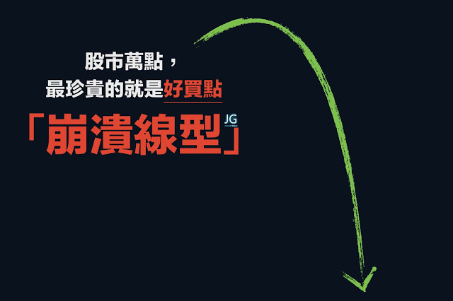
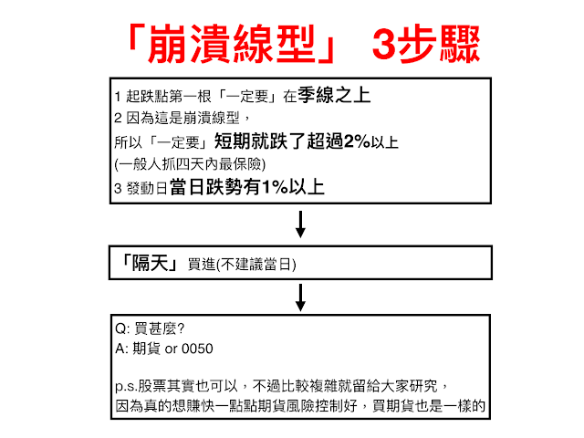

- 多方趨勢

  - 觀察大盤指數(道瓊指數/上市櫃指數)
  - 只做初升跟主升 
  - 追趨勢盤整後第一天突破5% 做隔日沖 or 抱波段

- 盤整

  - 做短線 (當沖/隔日沖)
    - 均線糾結第一天發動> 5% 尾盤進場
    - 篩選盤整股票隔天程式掛9.5% 進場

-  向上加碼 (槓桿商品) or 美股 (趨勢太長幾年連續上漲)

  - ex: 臺指每賺200點加碼一次
    - 期貨拆10筆進場
    - 看對行情，等待回檔才向上加碼，並不是每格200點加碼這樣風險大，要等回檔再加碼通常都是技術分析上，一個很好的買點
      - 應該要賺300點後，回檔到200點再加碼
      - 後期脫離總成本遠安全就可以加大點 (需要計算)
  
- 向下攤平 (臺股勝率高)

  - 用在止跌反轉 (崩跌線型 ？)
  - 進場點
    - 第二筆打進去需判斷
      - 離止跌點很近
      - 近情要起漲
      - 波動率邊緣進場 ATR 低波動？
  - 如何設定停損？
    - 需根據分析設定停損，所以停損要小 5~8%？
    - 分析的止跌點停損設很大是凹單
  - 保留一筆資金在股價高於成本區後再進場 ex: 40萬 30萬  拉過成均成本再進去 30萬(最後一筆)
    - 為什麼最後一筆要拉過成本再進怕遇到崩跌，全部錢會吐回去

- 爆賺
    - 下時代會是誰？ ex: 現在是特斯拉在火，誰讓特斯拉逼著起來
    - 找好商品(獨角獸)
    - 找好買點才可以持續加碼
        - 崩跌後出現
    - 轉機股、未來成長股
    - 成本低才好加碼
    - 張松允月K長紅發動後，等待拉回量縮持續買(能爆賺?)  

- 逆勢好處
    - 順勢交易進場點價位通常不好
    - 所以要順大逆小(逆KD)
  
- JG

  - 逆KD /逆布林

    - 逆布林
      - 多頭趨勢使用
        跌破下緣買進，並設好停損
        通過通道上緣不要停利，向上分批賣出

  - 恐慌 定義 

    -  多頭趨勢裡 
    - 技術分析者恐慌  
  
  - 賭博式停利法
  
    - 拿獲利一半來賭
  
  - YT 網友: 多頭市場很適合向下攤平 
  
    - https://www.youtube.com/watch?v=5AQHkBoUybA
  
    


---

https://medium.com/blacksecurity/%E8%88%87%E7%9C%BE%E4%B8%8D%E5%90%8C%E7%9A%84%E6%80%9D%E8%80%83-%E5%8F%8D%E5%B8%82%E5%A0%B4-jg%E8%82%A1%E5%B8%82%E6%93%8D%E4%BD%9C%E5%8E%9F%E7%90%86-%E8%AE%80%E5%BE%8C%E5%BF%83%E5%BE%97-990c5cb13fc3

- 股市是一個推理遊戲，想贏就得先搞懂「反市場」
  - 十次跌破裡面有八次是假跌破，是不是跌破去買進才是真道理？
  - 停損停利人人會設，你是機械式地提早賣掉飆漲股，還是有策略放大你的好運？
  - 許多人推崇KD指標、布林通道，但是否可以改良、做出不同選擇？
  - 避開主流，別把自己交給機率，盡可能的放大運氣才能暴賺。
- 不合人性，任何方法都會賠錢
  - 存股很健康正向，但你知道六成優質股曾股價腰斬，許多人「存不住」而虧損出場嗎？
  - 看財報、看線圖……有各種預測股價的技術，但你想過「高勝率」不如「暴賺致富」嗎？
  - 操盤賺錢的關鍵不在預測，不在求穩定，而是要用符合人性的方式來長期操作。
  - 弄懂「反市場」心理，你才能在別人害怕的時機買進，在別人過於樂觀的時機賣出！
- 用買賣來攻擊，用情緒來防守
  - 股市裡沒有一個人是技術超強但心理脆弱，卻還能成為贏家。

- JG的八原則:

  - 股票市場就是賭
  - 務必和股市預言保持距離
  - 財報選股，離爆賺實在太遠
  - 爆賺，是最健康的股市態度
  - 當然要知道輸家的下一步
  - 優勢為輸贏之間的最大分水嶺
  - 贏家第一課:風險報酬比
  - 要賺一輩子，一定要有全面性的操盤力

  

## CH1 反市場:股市致富之道

第一章部分提到**運氣**的重要性，JG強調運氣是股市重要的一個點，對於運氣的信仰決定你成為怎麼樣的投資者，運氣型玩家有個精神就是拿到好牌就要爆賺一筆。不過拿到好牌大多數人也不知道怎麼打這副好牌。

## CH2 J派買賣原則

## 停損

> 停損並非代表自己看錯，而是讓自己把握其他賺錢機會

### 風險報酬比

JG有強調**風險報酬比**在投資前的心態很重要

風險報酬比為:

```
虧損:獲利  --> 建議為 1:3 
```

意思是**賺一次可以抵賠錢三次**，進場四次贏超過一次就可以

## CH3 J派核心原理:反市場

### 技術指標

KD人人皆知但充滿不確定性，指標是不精確的結果而且不是原因，打開五分線看盤會發現一下交叉一下沒交叉，會有無數次的**假**交叉。臺股和美股不同，絕對不能追高，因為波動有限。

### KD指標

JG推薦逆KD，像是**KD向下交叉+下跌買進搭配書中寫得停利與停損和其他條件。**

### 股市預言

股市預言請**全部打叉**，市場的短期波動是被**消息與躁動散戶**所影響。

### SUMMARY

用反市場避開主流才能爆賺，別把人生交給機率，拿到好牌就狠狠賭下去

## CH4 不合人性，任何方法都會賠錢(存股與複利)

我看了不少有關存股、複利、價值投資或中長期投資的影片或書籍，這段大概會有很多爭議或不同觀點，也會有人提出解法或觀點，但一百種人就有一百種投資方法(與觀點)，能賺錢就是好方法，而且我更好奇JG對於ETF看法就是。

中長期投資入門可參考另一篇心得:[我的職業是股東](https://medium.com/blacksecurity/股市經典教科書-我的職業是股東-讀後心得筆記-11fe370f5ec7)、[金融名詞解釋](https://medium.com/blacksecurity/金融九大指標解釋-殖利率-eps-roa與roe-本益比per-pbr-股價淨值比-6d97a9fab7ba)

### 複利

市場流行一種觀念，**低報酬=安全。**

複利本身意義是用賺來的錢不斷在投入股市去利滾利，關鍵不是安全而是要**持續不斷高報酬。**

但**心理**上大多人想要快速致富，**盲目地投入就導致失敗**，JG建議先求爆賺後求穩定，最後求不敗

### 存股

存股概念:隨時買+賭不會倒閉+高殖利率

前提是你在**低點買**，加上人性很容易導致失敗，市面上老師大多數都是從金融海嘯後才出來出書，又遇到大多頭市場所以全部都是對的。

**盲點:忽略買點**

假設以2009存到2019**績效最好**

假設以2006存到2016 **績效稍微差一點**

假設以2004存到2014 **績效會非常差**

心理上還是最大的敵人，靠配股配息會失敗是因為賺得少、賠得多，大金額的帳面虧損下跌顯違反人性，無法抱住。

**優化存股:**

1. 買在最有利的景氣區間
2. 買成長股，例如當時的玉山金，不是因為他很安全而是他會成長。
3. 成長股要挑資本額20億以下比較好的成長動能
4. 成長擺第一 ，股利股息擺第一
5. 找好機會一次出手，除了巴菲特，年輕的投機客大多數都是基本面與基數面雙主修。

### 預測

這點倒是和經典書一樣的道理，股市不能預測。

## CH5 脫離輸家的反市場思考

### 下單

下單沒有邏輯，用感覺下單，而不是推論。

在**趨勢**底下，所有技術分析都是一坨屎

### 明牌

聽到的**必死無疑** ，沒有更多資訊，只有一句話，若有資訊也不知道轉了幾手的消息。

好明牌一定要**有未來性**，還要追查**來源**與**證實理由**

### 雜誌與市場

當市場的氣氛是恐慌時候，一定要當個冷靜的人，因為股票市場大多是賠錢的，而賠錢的人說話不需要聽，股市多頭時候誰講的話都是對的。

## CH6 建立贏家的心理正回饋

贏家的心理與技術是兼具的。

### 股市癮

每天都想進出股市，一定要下單穩+準確的目標。

## CH8 反市場贏家的八個原則

1. 股票市場就是賭 — **不要以為自己可以掌控市場**，很多情況都是運氣。不把股市**當賭**且不停損停利。容易患得失。
2. 務必和股市預言保持距離 — 應思考是否為正確的真利多。
3. 財報選股，離爆賺實在太遠 — 唯一要注意的是**資本支出**，代表董監持股信心。
4. 爆賺，是最健康的股市態度 — **不要有短進短出**的壞毛病
5. 當然要知道輸家的下一步
6. 優勢為輸贏之間的最大分水嶺
7. 贏家第一課:風險報酬比
8. 要賺一輩子，一定要有全面性的操盤力 — 總體經濟學搭配技術面**比對**

總體經濟弱+技術強=市場超強->重壓

總體經濟好+技術弱=市場超漲有短線疑慮->減碼

總體經濟好+技術強=安心持有

總體經濟差+技術弱=空手

# 崩潰線型

## 

## 

## **正方形黃色=發動點第一根；****藍色圓圈是買點。**

我建議要抓就抓兩根以上的大黑棒，每根超過1%(越多越好、越猛越好)
基本上已經可以用這個推論出很多更進階甚至更漂亮的買點。

這招在季線上揚(包括向上震盪)的時候非常關鍵好用
而且這種買點通常都是投資人最恐慌的時候，但知識就是力量，賺錢就是靠這個。

只是務必不要太求精準，太精準會錯過許多買點，瞭解其中的涵義更為重要
例如你可以想想，那空頭怎麼用，反著用就好。

而這些你如果願意再花點時間回測，我相信你還可以找到更多更好的潛在買點來提升報酬率，祝大家在股市順利！


---

```
1. 轉折
2. 右側交易 轉折處往上往下點數進場 守轉折處
3. 個股開盤試搓 漲跌停
4. 外資買賣超 前100名 漲跌停
5. 外資買超漲停 隔天拉高轉折往下做空 守轉折 反之亦然
6. 5大 10大法人
7. 一買一賣 往下買 不是攤平


進場策略: 3倍數口數
選股: 前天 外資買賣超 前100名 漲跌停
外資買超漲停 隔天拉高轉折往下做空 守轉折 反之亦然
例如: 高低點10點轉折進場
作空: 開165 漲到 180高點 後轉折往下到170 進場 or 跌破平盤
作多: 開165 跌到 150低點 後轉折往上到160 進場 or 漲破平盤

出場策略：(6R )
1R 2R(損益兩平) 3R(賣一口) 6R 再賣一口 剩餘一口去賭放到尾盤平倉 或是漲跌停第二次打開再平倉

ex:
現貨8:45 漲停, 但股票期貨沒有漲停那強代表有問題
9:00 開盤169往下空在168
RISK 設定 1
167(1R)
166(2R) 點到166後就反彈再點到168 就平倉損益兩平
165(3R)賣一口
162(6R)再賣一口
剩餘一口去賭放到尾盤平倉 或是漲跌停第二次打開再平倉
```
