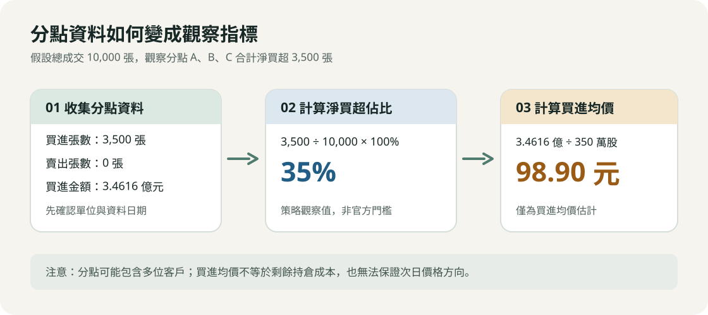
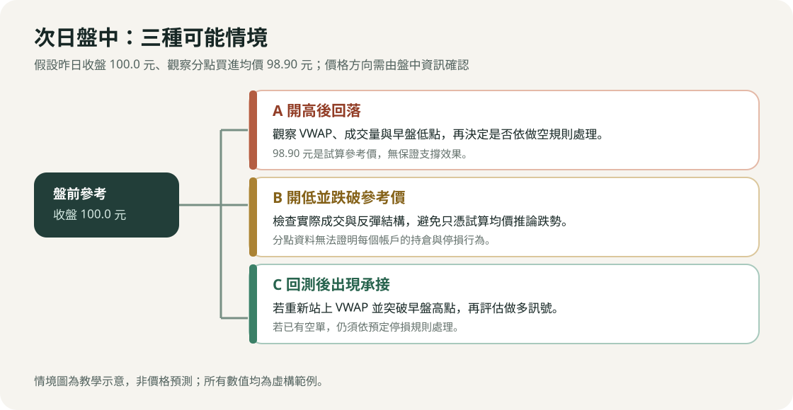
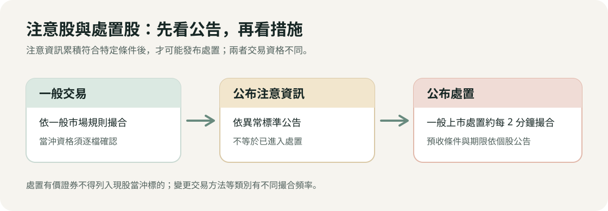

# 台股當沖（作多／做空）、隔日沖與處置股交易策略實戰手冊

## 目錄

1. [全日交易時間軸作戰標準程序（Master Daily Timeline SOP）](#一-全日交易時間軸作戰標準程序master-daily-timeline-sop)
2. [盤前篩選與籌碼分析量化標準（SOP 0）](#二-盤前篩選與籌碼分析量化標準sop-0)
3. [當沖做空實戰詳細步驟方法（Short SOP 1~4）](#三-當沖做空實戰詳細步驟方法short-sop-14)
4. [當沖做多實戰詳細步驟方法（Long SOP 1~4）](#四-當沖做多實戰詳細步驟方法long-sop-14)
5. [隔日沖主力操盤手法與散戶因應詳細步驟（Overnight SOP 1~2）](#五-隔日沖主力操盤手法與散戶因應詳細步驟overnight-sop-12)
6. [處置股交易機制與策略情境](#六-處置股交易機制與策略情境)
7. [盤中微觀盤口技術（Tape Reading 判讀步驟）](#七-盤中微觀盤口技術tape-reading-判讀步驟)
8. [風控體系與部位計算公式（Risk & Position Sizing）](#八-風控體系與部位計算公式risk--position-sizing)
9. [文獻與方法出處完整索引標記表](#九-文獻與方法出處完整索引標記表)

---

## 一、 全日交易時間軸作戰標準程序（Master Daily Timeline SOP）

```text
[15:30 ~ 21:00] 盤後籌碼解析 ➔ 產出隔日「做空清單」與「做多清單」
       ↓
[08:30 ~ 09:00] 盤前試撮觀察 ➔ 過濾假漲停、預估開盤量、確認開盤價區間
       ↓
[09:00 ~ 09:15] 早盤第一波交戰 ➔ 隔日沖出貨 / 開高走低破均價空 / 巨量換手多
       ↓
[09:15 ~ 10:00] 盤中趨勢與二次轉折 ➔ 二度不過高量背離空 / 拉回均價線守穩多
       ↓
[10:00 ~ 12:30] 盤中震盪與秒沖 ➔ 權證大單點火秒沖 / 假鎖漲停炸板禿鷹空
       ↓
[12:30 ~ 13:20] 尾盤隔日沖點火 ➔ 主力 499 鎖漲停 / 散戶搭便車鎖碼
       ↓
[13:20 ~ 13:30] 強制平倉沖銷 ➔ 13:25 前所有當沖部位全數市價回補出清
```

---

## 二、 盤前篩選與籌碼分析量化標準（SOP 0）

- **【執行時間】**：每日 15:30（證交所揭露券商分點買賣日報表）~ 21:00。
- **【方法出處】**：
  - **權證小哥**：《權證小哥完全公開——權證暴賺勝經》——分點籌碼挑選強弱勢股。
  - **蔡司（Tsai S）**：《蔡司籌碼名師系列》——籌碼集中度與關鍵贏家分點篩選法則。

### 步驟 1：取得資料並設定基本流動性門檻

1. **成交量門檻**：近 5 日平均成交量 > 3,000 張，當日成交量 > 5,000 張（避免當沖遭遇流動性滑價或無法沖銷）。
2. **波動度門檻**：當日震幅 > 4% 或當日收盤漲跌幅 > 4%。
3. **當沖標的確認**：務必確認該股票具備**「現股當沖（得先賣後買）」**資格。

### 步驟 2：計算「隔日沖買超佔比」與「主力成本線」（做空觀察名單）

#### 資料取得與計算方式

1. 查詢[證交所買賣日報表](https://bsr.twse.com.tw/bshtm/bsWelcome.aspx)，或從看盤軟體取得個股券商分點進出資料，再篩選前五大買超分點。證交所說明，一般交易報表於每個交易日下午 3 時至 4 時產製；應以實際發布時間為準。
2. 檢查名單中是否出現觀察中的隔日沖分點，並核對每個分點的買進、賣出張數與買進金額。**分點資料包含券商自營及受託交易，無法單憑分點名稱判定交易者身分或次日必然賣出。**
3. 計算隔日沖買超佔比。以下 20%、30% 與 35% 是本文的策略篩選門檻，並非證交所認定標準。

   `隔日沖買超佔比 = 觀察分點淨買超張數合計 ÷ 當日總成交張數 × 100%`

   - **初步觀察門檻**：至少 20%。
   - **優先觀察門檻**：至少 30%；35% 為較嚴格的篩選值。

4. 計算觀察分點的加權平均買進價。若買進金額單位為「元」、張數單位為「張」，須將張數乘以 1,000 股；有買有賣時，總買進均價不能直接視為剩餘部位的實際成本。

   `買進均價 = 觀察分點買進金額合計 ÷（觀察分點買進張數合計 × 1,000）`



#### 假設數值試算

以下分點名稱與數字均為**虛構範例**，僅用於說明計算方法。假設股票昨日收盤價為 100.0 元，當日總成交量為 10,000 張；其中三個觀察分點的資料如下：

| 分點 | 買進張數 | 賣出張數 | 淨買超張數 | 買進均價 | 買進金額（元） |
| :--- | ---: | ---: | ---: | ---: | ---: |
| 觀察分點 A | 1,800 | 0 | 1,800 | 98.5 | 177,300,000 |
| 觀察分點 B | 1,000 | 0 | 1,000 | 99.0 | 99,000,000 |
| 觀察分點 C | 700 | 0 | 700 | 99.8 | 69,860,000 |

- **淨買超張數合計**：1,800 + 1,000 + 700 = 3,500 張。
- **買超佔比**：3,500 ÷ 10,000 × 100% = 35%。
- **買進金額合計**：177,300,000 + 99,000,000 + 69,860,000 = 346,160,000 元。
- **加權平均買進價**：346,160,000 ÷（3,500 × 1,000）≈ 98.90 元／股。
- **相對收盤價的帳面變動**：（100.0 − 98.90）÷ 98.90 × 100% ≈ 1.11%；此數值未計交易成本，也不能推定分點的實際剩餘持倉。

#### 次日盤中情境示意



- **情境 A：開高後回落**。若價格跌破盤中 VWAP，可依「做空 SOP 1」檢查成交量與停損位置；98.90 元僅是試算參考價，不保證形成支撐。
- **情境 B：開低並跌破參考價**。先確認實際成交與反彈結構，不應只因跌破試算買進均價就推定會持續下跌。
- **情境 C：回測參考價後出現承接**。若股價重新站上 VWAP 並突破早盤高點，可依「做多 SOP 1」評估；原有空單仍須遵守停損規則。

### 步驟 3：篩選「地緣分點 / 內部人連續吸籌」（做多觀察名單）

1. 篩選過去 20~60 天股價於底部區間橫盤整理之個股。
2. 檢查買超第一、二名分點是否為**「公司總部 / 廠區周遭之地緣券商」**（如新竹券商買進竹科 IC 設計股、台南/高雄券商買進在地螺絲扣件廠）。
3. **門檻條件**：近 5 日「籌碼集中度」 > 15%，且地緣券商過去 5~10 日每日皆呈現淨買超。

---

## 三、 當沖做空實戰詳細步驟方法（Short SOP 1~4）

---

### 【做空 SOP 1】獵殺隔日沖大戶（開高走低摜破均價線）

- **【方法出處】**：
  - **權證小哥**：《權證小哥：贏家養成指南》、《權證小哥完全公開——權證暴賺勝經》
  - **CMoney 籌碼 K 線**：隔日沖主力退場實戰專欄
- **【適用情境】**：昨日漲停且隔日沖買超佔比 > 25%，今日早盤開高倒貨。

#### 做空 SOP 1 詳細執行步驟

- **Step 1：盤前 08:30~09:00 預判開盤情境**
  - 昨日隔日沖大戶鎖漲停，正常情況今日早盤將跳空開高 +1.5% ～ +3.5%。
  - 若試撮階段開在平盤或開低，代表市場弱勢，倒貨賣壓將更加兇猛。
- **Step 2：09:00~09:03 觀察第一根 1 分 K 棒與盤口五檔**
  - **開盤巨量**：開盤前 3 分鐘成交量通常達到昨日全日量的 10% ～ 15%。
  - **五檔盤口檢查**：下檔委買一到五掛滿幾百張大單（假支撐誘多），但成交明細卻瘋狂跳出**大筆內盤黑單（綠字）**，代表大戶正在以市價把籌碼直接倒給市價追進來的散戶。
- **Step 3：確認進場觸發訊號（Trigger Signal）**
  - **訊號 1**：股價摜破當日**成交量加權平均線（VWAP 均價線）**。
  - **訊號 2**：股價帶量摜破早盤第一根 1 分 K 棒的最低價（或第一根 5 分 K 棒低點）。
  - **下單動作**：觸發上述兩條件同時滿足時，以**市價單**或**委買一檔（內盤價）**迅速掛出「現股當沖先賣（空單）」。
- **Step 4：設定精確停損價（Hard Stop Loss）**
  - 空單進場後，**立即在看盤系統掛出反向停損觸價單（Stop Market Order）**。
  - **停損價格**：設在「當日最高價（HOD）加 2 檔跳動（Ticks）」或「重新帶量站回 VWAP 均價線上 2 檔」。
- **Step 5：執行停利回補（Take Profit）**
  - **第一階段停利（平倉 50%）**：當股價回測至昨日收盤價（平盤價 0%）或跌破主力昨日買進成本線時，市價買回一半部位。
  - **第二階段停利（平倉剩餘 50%）**：時間來到 09:25~09:35，成交量萎縮、連續 3 根 1 分 K 棒不再破底且均線走平時，全數回補出場。

---

### 【做空 SOP 2】假鎖漲停「炸板」禿鷹放空法

- **【方法出處】**：
  - **自由人 Freeman（李堯勳）**：《台指期當沖交易密技》——極短線盤口破線禿鷹策略
  - **非凡電視台《錢線百分百》**：台股當沖實戰專案
- **【適用情境】**：盤中股價衝上漲停，主力虛張聲勢掛假單鎖碼，但遭遇大賣單敲開。

#### 做空 SOP 2 詳細執行步驟

- **Step 1：監控漲停板排隊張數之動態變化**
  - 股價拉至漲停價（+10%），掛在漲停價之委買排隊單（排隊買單）開始出現**異常抽單（撤單）**現象。
  - 例如原本排隊 5,000 張，在 30 秒內快速萎縮至 1,500 張、800 張。
- **Step 2：偵測炸板（敲開）瞬間**
  - 成交明細連續出現單筆 100~300 張的大筆市價賣單（黑單），直接將剩餘排隊委買單全數吃光，成交價滑落至 +9.5%、+9.0%。
- **Step 3：進場下單**
  - **下單時機**：在漲停板被吃穿跌至 +9.0% ～ +8.5% 瞬間，以**市價（Market Order）**敲進空單。
  - **預期利潤**：吃散戶追高多頭踩踏的多殺多恐慌波，通常股價會在 3~5 分鐘內急速下殺至 +5.5% ～ +6.5%。
- **Step 4：停損與緊急自救（最高警戒）**
  - **唯一且嚴格的停損點**：若主力只是洗盤，下方又有巨量買單湧入將股價**重新拉回漲停價（+10%）**，**必須立刻以市價回補停損**！
  - **理由**：若被漲停鎖死，當天無法在 13:30 前買回，將被迫進入「借券/券差程序」，每日借券費率最高達 7%，且隔日極可能再開高，產生毀滅性損失。

---

### 【做空 SOP 3】權證大戶早盤倒貨＋自營商砍現貨避險單空法

- **【方法出處】**：
  - **權證小哥**：理財寶「主力收購權證監控表」實戰教學
- **【適用情境】**：前一日大戶大量買超認購權證（隔日沖），今日一早出脫引發自營商系統性程式賣現貨。

#### 做空 SOP 3 詳細執行步驟

- **Step 1：盤前確認自營商避險現貨庫存**
  - 前一日盤後查詢「三大法人買賣超」，若「自營商（避險）」買超金額排名前列，且對照「主力收購權證監控表」確認為短線隔日沖大戶所為。
- **Step 2：09:00~09:05 鎖定自營商程式賣單**
  - 早盤 09:01 起，權證大戶在權證市場掛市價出清認購權證。
  - 發行券商自營商的造市避險演算法被系統強制觸發，必須在現貨市場掛出對應的現貨賣單以維持 Delta 中立。
  - **成交明細特徵**：現貨成交明細每隔 1~2 秒跳出一筆中型賣單（如連續 22 張、33 張、50 張的固定程式單），推動價格急跌。
- **Step 3：進場與回補**
  - **進場**：現貨跌破開盤第一根 1 分 K 低點時，直接追空進場。
  - **回補**：自營商避險砍單通常在 09:15~09:20 結束。當現貨成交明細中的定額程式單停止出現，五檔出現單筆大買單護盤時，立即全數回補獲利了結。

---

### 【做空 SOP 4】日內 VWAP 破線與二度攻高量價背離放空法

- **【方法出處】**：
  - **巨人傑（GiantJie）**：《資產破億的當沖客》——日內動能衰竭與期望值交易
  - **金湯尼（Kim Tony）**：《金湯尼盤中速讀術：冰火能量圖》
- **【適用情境】**：早盤衝高但無實質主力鎖碼，高檔動能衰竭轉為空方。

#### 做空 SOP 4 詳細執行步驟

- **Step 1：繪製高點與早盤 VWAP**
  - 股價在 09:00~09:20 創下當日最高價（High of Day, HOD），隨後拉回跌破均價線（VWAP）。
- **Step 2：觀察二次反彈（雙重頂 / 假突破確認）**
  - 股價自低點反彈，試圖挑戰早盤高點 HOD。
  - **背離檢視**：第二波攻高時的 1 分鐘成交量只有第一波攻高時的 30% ～ 50%（量價背離）；五檔委賣單大單壓頂，外盤吃單速度緩慢。
  - 股價未能過 HOD，或剛創微幅新高（過高不到 1~2 檔）立刻爆出一根實體大黑 K 吞噬。
- **Step 3：下單與停損**
  - **進場點**：跌破二次攻高之起漲頸線，或再次帶量跌破 VWAP 時進場放空。
  - **停損點**：設在二次攻高之最高點上方 1 檔。

---

## 四、 當沖做多實戰詳細步驟方法（Long SOP 1~4）

---

### 【做多 SOP 1】隔日沖「強換手 / 軋空」順勢多法

- **【方法出處】**：
  - **巨人傑（GiantJie）**：盤口微觀籌碼吸收（Absorption）與量價結構
  - **蔡司（Tsai S）**：CMoney 籌碼 K 線名師專題
- **【適用情境】**：昨日有隔日沖大軍大買，今日早盤巨量倒貨卻跌不破平盤與均價線，市場出現真主力接盤。

#### 做多 SOP 1 詳細執行步驟

- **Step 1：盤前鎖定具備強題材或產業熱門之隔日沖標的**
  - 昨日買超前五名有凱基台北、美林等隔日沖分點，但該標的當前屬於全市場最強主流族群（如 AI、重電、散熱等）。
- **Step 2：09:00~09:15 檢驗「巨量抗跌」訊號**
  - 早盤開盤 15 分鐘成交量超過昨日總成交量的 25% ～ 40%。
  - **關鍵異相**：隔日沖主力瘋狂倒出數千張賣單，但股價**完全跌不破平盤**，且回測始終**守在當日均價線（VWAP）之上**（顯示有更大手筆的買盤在均價線上方將所有賣單一口不剩全部吃光）。
- **Step 3：09:15~09:30 觀察量縮整理與浮額洗淨**
  - 09:15 之後，隔日沖出貨告一段落，成交量開始顯著萎縮。
  - 股價在 VWAP 之上進行狹幅橫盤整理（橫盤箱體），下檔委買單開始逐步向上墊高。
- **Step 4：進場點觸發**
  - 五檔突然連續跳出多筆 50~100 張以上的**大筆外盤紅單（市價買單）**。
  - 股價帶量突破早盤 09:00~09:20 的高點（HOD）或突破盤整箱體上緣。
  - **下單動作**：市價或委賣一檔掛進「現股當沖先買（多單）」。
- **Step 5：停損與出場設定**
  - **停損點**：設在早盤橫盤整理箱體的下緣，或跌破當日 VWAP 下方 2 檔。
  - **出場點**：此種強換手形態極易直奔漲停，若漲停鎖死且排隊單 > 3,000 張，可抱至尾盤；若漲停開開關關或未鎖死，於 13:00~13:15 出清獲利了結。

---

### 【做多 SOP 2】地緣分點連續吸籌初升段帶量點火多

- **【方法出處】**：
  - **蔡司（Tsai S）**：《蔡司籌碼名師系列》——地緣券商追蹤法
  - **CMoney 籌碼 K 線**：地緣券商與主力分點雷達戰法
- **【適用情境】**：低檔盤整標的，盤後連續數日發現地緣券商集中買超，今日盤中發動攻擊。

#### 做多 SOP 2 詳細執行步驟

- **Step 1：確認突破關鍵頸線價位**
  - 盤前標註該股票過去 20~60 天盤整區間的最高點（頸線壓力位）。
- **Step 2：09:00~09:20 偵測異常攻擊量**
  - 09:15 前成交量已達到過去 5 日均量的 1 倍以上。
  - 五檔委賣單開始被單筆百張以上的大單持續吃掉。
- **Step 3：進場下單**
  - **最佳買點**：股價帶量突破盤整區頸線價位的瞬間；或是突破後拉回測試頸線支撐、踩穩當日 VWAP 不破並再度轉折向上時。
- **Step 4：停損與停利**
  - **停損點**：跌回盤整頸線下方 1.5% 或摜破當日 VWAP。
  - **停利點**：地緣主力做的是真波段，當天收實體長紅機率極高。當沖可在漲幅達到 +4% ～ +6% 或尾盤 13:10~13:20 分批獲利了結。

---

### 【做多 SOP 3】投信認養第 1~3 天「拉回均價線回測買多」

- **【方法出處】**：
  - **股市阿水（Water）**：《股市阿水：布林通道戰法》——法人籌碼與盤中進出
  - **權證小哥**：投信認養與季底作帳操作專欄
- **【適用情境】**：投信剛開始進場買超之中小型績優成長股。

#### 做多 SOP 3 詳細執行步驟

- **Step 1：盤前篩選法人建倉初升股**
  - 昨日投信買超佔比 > 5%，且投信持股率 < 5%（代表剛開始認養，非高檔出貨期）。
- **Step 2：盤中等待回測 VWAP**
  - 投信多採演算法被動吃貨，早盤股價通常開小高後隨大盤波動拉回。
  - 當股價拉回至 VWAP 均價線附近（距離 VWAP 0.3% ～ 0.5% 範圍內）。
  - **五檔盤口檢查**：下檔委買單有穩定的中型委買單（如每檔 30~50 張）均勻鋪墊，成交明細未見異常爆量摜殺。
- **Step 3：進場與出場**
  - **進場點**：回測碰觸 VWAP 未跌破，隨後出現外盤小量連續紅單轉折向上時進場作多。
  - **停損點**：跌破 VWAP 超過 1% 立即停損。
  - **出場點**：下午 13:00~13:25 為法人程式單補單拉抬的高峰期，在尾盤急拉時市價賣出平倉。

---

### 【做多 SOP 4】權證大單盤中點火「自營商避險連動抬轎多」（極短線秒沖）

- **【方法出處】**：
  - **權證小哥**：理財寶「盤中權證大戶即時監控表」軟體實戰法
- **【適用情境】**：盤中突然有權證大戶狂敲某檔股票的認購權證，引發券商自營商在現貨市場買進避險。

#### 做多 SOP 4 詳細執行步驟

- **Step 1：即時監控軟體警示設定**
  - 設定監控條件：單一股票在 30 秒內，認購權證成交金額超過 500 萬元或成交口數超過 3,000 口。
- **Step 2：秒級反應下單（反應時間需在 3 秒以內）**
  - 軟體跳出警示音時，迅速切換至該股票現貨看盤視窗。
  - 觀察現貨外盤委賣單是否開始被單筆百張以上買單瘋狂吞噬。
  - **下單動作**：立刻以**市價（Market Order）**或**委賣二檔**敲進現貨多單。
- **Step 3：極短線獲利了結（秒沖出場）**
  - 自營商避險買盤推升現貨的速度極快，通常在 1~3 分鐘內直線噴發 +2% ～ +4%。
  - **出場訊號**：一旦權證成交明細不再跳出大筆認購單，且現貨外盤推力停滯（出現內盤小黑單），**立刻以市價賣出平倉，絕不戀戰留倉**。

---

## 五、 隔日沖主力操盤手法與散戶因應詳細步驟（Overnight SOP 1~2）

---

### 【主力操盤手內部作業手冊 SOP】主力如何執行「隔日沖」？

- **【文獻來源與出處】**：
  - **《財訊》雙週刊**：調查報導〈揭密台股隔日沖神秘部隊：虎尾幫與嘉義幫〉
  - **非凡電視台《錢線百分百》**：籌碼名師專案解密
  - **券商法人自營部與高頻量化團隊**實務運作流程

```text
[階段 1：11:00~12:30 標的掃描]
利用即時量化選股雷達，掃描全市場：
1. 漲幅達 +6% ~ +8% 之強勢股。
2. 族群具備題材熱度、當日成交總額在前 50 名內。
3. 距離漲停板剩餘委賣單總量在 1,500 ~ 3,000 張以內（易於一網打盡）。

[階段 2：12:30~13:20 資金切分與點火掃盤]
1. 分散至 3~8 個不同證券分公司帳戶（如凱基台北、美林、元大土城等）。
2. 單筆拆分為 499 張上限單（台股系統單筆限制），於 10~30 秒內連續發射 3~6 筆 499 買單。
3. 一口氣將上檔所有委賣單全數市價掃光，將價格直線釘在漲停板（+10%）。

[階段 3：13:20~13:30 假單鎖碼與市場心理操控]
1. 漲停瞬間，各分點立刻送出巨額委買單在漲停價排隊（如掛進 10,000 ~ 30,000 張委買）。
2. 製造「漲停買不到、明日必開高」的市場狂熱心理。
3. 強迫早盤放空之當沖散戶與融券放空者在尾盤市價買回停損（進一步強化鎖碼穩定度）。

[階段 4：次日 08:30~09:15 倒貨出脫清倉]
1. 08:30~08:59 試撮階段：掛進巨額委買單製造「試撮漲停」假象，吸引散戶於開盤前掛高價搶買。
2. 08:59:45~08:59:55：於試撮結束前數秒迅速撤銷（抽單）所有虛擬買單。
3. 09:00:00：利用昨日慣性跳空開高（通常開高 +2% ~ +5%）。
4. 09:00~09:10：趁散戶與法人買盤進場追價瞬間，以市價或外盤大筆賣單直接倒光手中所有股票，實現獲利了結。
```

---

### 【散戶操作 SOP】散戶如何「搭隔日沖便車」做多？

- **【方法出處】**：
  - **金湯尼（Kim Tony）**：《只買一張也能賺錢的散戶當沖密技》——順勢搭便車戰法
- **【適用對象】**：盤中反應極快、能嚴格執行紀律之極短線交易者。

#### 散戶操作 SOP 詳細執行步驟

- **Step 1：12:30~13:10 偵測主力點火**
  - 觀察自選股中漲幅達到 +7% ～ +8.5% 的股票，成交明細突然跳出連續 499 買單（或連續數十筆 50 張外盤買單），價格直線向上衝刺。
- **Step 2：掛單跟進**
  - **動作**：在股價來到 +8.5% ～ +9.2% 尚未完全鎖死前，立刻以**市價單**敲進；或者在漲停價位出現的第一秒，立刻送出「漲停價委買單」參與排隊。
- **Step 3：檢查是否「鎖死」**
  - 13:25 檢視漲停板上的排隊委買量。
  - **安全標準**：漲停排隊委買量必須大於當日總成交量的 10% 以上（例如成交量 2 萬張，排隊至少 2,000 張以上），才算安全鎖死。
  - **異常撤退**：若尾盤出現排隊單快速減少或炸板敲開，**不論盈虧立即在 13:25~13:30 市價砍單出場**，絕不可抱過夜。
- **Step 4：次日早盤出場 SOP（唯一動作：賣出）**
  - 隔日開盤（09:00:00）無論跳空開高多少（例如開高 +2% ～ +4%），**開盤前預先掛好委託賣單（或開盤第一時間市價賣出）**。
  - **鐵律**：搭便車隔日沖的目的僅在賺取隔日的「跳空溢價」，開盤 5 分鐘內必須清倉完畢，切不可貪戀後續漲幅而把隔日沖做成套牢長抱。

---

## 六、 處置股交易機制與策略情境

本節整理五種處置股交易情境。制度部分以[證交所現行處置作業要點第 6 條](https://twse-regulation.twse.com.tw/tw/law/DOC01.aspx?FLCODE=FL007225&FLNO=6)與[現股當沖標的說明](https://www.twse.com.tw/zh/products/system/day-trading.html)為準；實際標的、期間及措施應查[證交所公布處置有價證券](https://www.twse.com.tw/zh/announcement/punish.html)或櫃買中心公告。



### 6.1 先確認處置措施

1. **注意與處置的差別**：被列為注意股不等於已進入處置。連續三個營業日達特定注意標準，或連續五日、十日內六日、三十日內十二日達相關標準等情形，才可能依第 6 條發布處置；以當日公告為準。
2. **撮合頻率**：證交所現行第 6 條對一般上市處置有價證券，首次與三十個營業日內再次處置均規定約每 **2 分鐘**撮合一次；變更交易方法等類別另有不同頻率，特別處置也可能調整。
3. **預收款券**：首次處置，單筆達 **10** 交易單位或當日多筆累計達 **30** 交易單位時，依規定預收全部買進價金或賣出證券；三十個營業日內再次處置，原則上所有委託均預收。信用交易及特定專戶另有條文規定，須依個別公告確認。
4. **現股當沖資格**：證交所明列處置有價證券不得列入現股當沖標的。委託前應再次檢查券商系統的標的資格及處置公告。

### 6.2 五種策略情境

以下為原稿策略的**觀察與決策框架**，不是處置規則或經驗勝率。分點買賣資料無法辨識單一交易者，也無法保證價格方向。

#### 情境 1：量縮鎖漲停

- **觀察**：比較處置前後成交量、漲停委買量與實際成交；同時檢查題材和處置剩餘期間。
- **進出場**：若已有部位，先規劃可接受虧損與賣出條件。量縮鎖漲停不代表次日仍能漲停；處置期間若跌停且買盤不足，停損單也可能無法成交。

#### 情境 2：接近注意或處置門檻

- **觀察**：依官方注意資訊、處置作業要點和歷史價格，估算可能觸發的條件；價格以外的成交量及其他例外情形也須檢查。
- **進出場**：把「可能進處置」當成情境，不能只用單一臨界收盤價判定，也不能從尾盤委託推定特定主力意圖。

#### 情境 3：處置初期急跌後回測均線

- **觀察**：記錄 20 日均線、處置前買進均價估計及分盤成交量，確認是否出現實際承接。
- **進出場**：若分批買入，預先設定部位上限及退出條件；均線和分點估算價都不保證支撐，需考慮賣單無法即時成交的風險。

#### 情境 4：處置結束前與解除處置當日

- **觀察**：先核對公告的處置截止日，並在解除處置當天重新確認現股當沖資格、開盤量價與 VWAP。
- **進出場**：原稿提出「出關前卡位」與「出關首日跌破 VWAP 放空」兩種方向；兩者均須待盤中條件成立後評估，不能將出關當成固定開高或開低訊號。

#### 情境 5：以股票期貨觀察同一標的

- **觀察**：先查[期交所股票期貨標的名單](https://www.taifex.com.tw/cht/2/stockLists)，並確認契約仍可交易。現貨受處置時，期交所可能依[股票期貨處置保證金措施](https://www.taifex.com.tw/cht/5/sSFAdj)調高保證金：一般首次處置為原級距的 **1.5 倍**、再次處置為 **2 倍**；特別處置可能另有調整。
- **進出場**：比較股期與現貨價格時，須計入基差、保證金、流動性及兩市場不同的撮合節奏。股期並非不受現貨處置影響，也不能把預估撮合價當作已成交價格。

### 6.3 分點判讀與流動性風險

- **分點買賣超**：可比較處置前後分點買賣方向與成交量，但買超不等於持股、賣超也無法證明「主力倒貨」；單一分點可能代表多位客戶。
- **委託與成交**：處置股採分盤撮合，委託簿的排隊量不等於實際成交量。大額委託可撤銷，應以成交結果與官方公告核對。
- **資金與退出**：預收款券會占用可用資金；跌停或量縮時，實際成交價可能偏離預設停損價。部位大小應按可承受損失與可能無法立即退出的情境決定。

---

## 七、 盤中微觀盤口技術（Tape Reading 判讀步驟）

- **【方法出處】**：
  - **巨人傑（GiantJie）**：《資產破億的當沖客》——五檔微觀結構與成交跳動解讀
  - **自由人 Freeman**：盤口跳動節奏分析

### 7.1 五檔掛單「真假單」辨識對照表

```text
【誘多出貨盤（放空訊號）】               【誘空吃貨盤（作多訊號）】
  委賣五檔（稀疏）                         委賣五檔（厚重巨量壓頂）
  ┌───────┬──────┐                        ┌───────┬──────┐
  │ 101.5 │   15 │                        │ 101.5 │  850 │
  │ 101.0 │   22 │                        │ 101.0 │ 1200 │
  │ 100.5 │   30 │                        │ 100.5 │  950 │
  ├───────┼──────┤                        ├───────┼──────┤
  │ 100.0 │  800 │ ◄── 假大單誘多          │ 100.0 │   35 │
  │  99.5 │ 1500 │                        │  99.5 │   20 │
  │  99.0 │ 2200 │                        │  99.0 │   18 │
  └───────┴──────┘                        └───────┴──────┘
  委買五檔（厚重假支撐）                   委買五檔（稀疏無假單）

  實質盤況：                               實質盤況：
  下檔看似支撐強大，但成交全是大黑單        上檔看似賣壓沉重，但成交全是大紅單
  砸內盤，大買單一被砸到就快速抽單。        一口口吃掉大賣單，且價格跌不下去。
```

### 7.2 冰山委託（Iceberg Order）偵測步驟

1. 觀察某個特定整數關卡（如 100.0 元）。
2. 五檔顯示 100.0 元的委買量只有 20 張。
3. 盤面連續砸下 5 筆市價 50 張的賣單（合計 250 張），但 100.0 元**始終沒有被砸穿**，五檔上的數字依然顯示 15~20 張。
4. **判讀**：這代表大戶採用**冰山買單（Iceberg Order）**，底層設定每消耗 20 張自動補進 20 張，代表該價位有強大實質買盤防守。

---

## 八、 風控體系與部位計算公式（Risk & Position Sizing）

- **【方法出處】**：
  - **巨人傑（GiantJie）**：期望值交易系統與部位風控模型
  - **台灣證券交易所（TWSE）**：現股當沖風險防範作業準則

### 8.1 單筆部位大小計算公式（1% 風險原則）

每一筆交易進場前，必須先決定停損點，再根據可承受之風險金額計算進場張數：

`最大容忍虧損額 = 交易總資金 × 1%`

`可交易股數 = 最大容忍虧損額 ÷（每股價差風險 + 每股預估手續費與稅）`

- **實例計算**：
  - 總資金：1,000,000 元（1% 最大容忍虧損 = 10,000 元）。
  - 進場放空價：100 元，設定停損價：102 元（停損差額 2 元）。
  - 可放空張數：`10,000 ÷（2,000 + 400）≈ 4` 張（4,000 股）。
  - **嚴格禁止以「帳戶可用額度上限」隨意下滿**。

### 8.2 每日最大停損額（Max Daily Drawdown）

- 設定每日最大虧損金額（如總資金之 2%）。
- **執行標準**：當日虧損一旦達到該金額，**系統立即強制停止下單權限，並立刻關閉看盤軟體，當日絕不允許進行任何一筆報復性交易**。

---

## 九、 文獻與方法出處完整索引標記表

| 編號 | 策略 / 手法名稱 | 主要創始 / 推廣代表人物 | 著作 / 專欄 / 文獻出處 | 關鍵技術指標 |
| :---: | :--- | :--- | :--- | :--- |
| **1** | **獵殺隔日沖大戶放空法** | **權證小哥** | 《權證小哥完全公開——權證暴賺勝經》、《權證小哥：贏家養成指南》、理財寶專欄 | 隔日沖分點佔比、VWAP 均價線、開盤巨量 |
| **2** | **假鎖漲停炸板放空法** | **自由人 Freeman (李堯勳)** | 《台指期當沖交易密技》、《台指期天王自由人的極短線交易》 | 委買排隊單撤銷、炸板瞬間市價追空 |
| **3** | **自營商避險連動空/多法** | **權證小哥** | 理財寶「主力收購權證監控表」軟體實戰教學、Smart 智富專訪 | 認購權證爆發大單、自營商 Delta 避險程式單 |
| **4** | **VWAP 與微觀盤口當沖法** | **巨人傑 (GiantJie)** | 《資產破億的當沖客》、鏡週刊深度專訪、非凡新聞專案 | VWAP 均價線、五檔假單、Iceberg 冰山單、期望值部位管理 |
| **5** | **隔日沖強換手軋空多法** | **巨人傑 / 蔡司** | 巨人傑盤口微觀籌碼吸收實戰語錄、蔡司籌碼 K 線名師專題 | 隔日沖巨量倒貨抗跌、VWAP 守穩、過高追多 |
| **6** | **地緣券商追蹤做多法** | **蔡司 (Tsai S)** | 《蔡司籌碼名師系列》——地緣券商追蹤法、CMoney 專家專欄 | 公司總部周遭券商、籌碼集中度、頸線突破 |
| **7** | **投信認養初升段做多法** | **股市阿水 / 權證小哥** | 《股市阿水：布林通道戰法》、Smart 智富月刊專欄 | 投信持股率 <5% 首買、拉回 VWAP 接多 |
| **8** | **盤中冰火能量與多空指標** | **金湯尼 (Kim Tony)** | 《只買一張也能賺錢的散戶當沖密技》、《金湯尼盤中速讀術》 | 委託買賣筆數差、能量差、搭便車鎖漲停 |
| **9** | **處置股交易機制** | **臺灣證券交易所** | [處置作業要點第 6 條](https://twse-regulation.twse.com.tw/tw/law/DOC01.aspx?FLCODE=FL007225&FLNO=6)、[現股當沖標的說明](https://www.twse.com.tw/zh/products/system/day-trading.html) | 處置條件、撮合頻率、預收款券、當沖資格 |
| **10** | **量縮鎖漲停與注意門檻情境** | **本文情境整理** | 第六章策略情境 1、2；制度依證交所公告 | 成交量、處置公告、退出條件 |
| **11** | **處置初期急跌與均線回測情境** | **本文情境整理** | 第六章策略情境 3；非實證勝率 | 均線、分點資料、流動性 |
| **12** | **處置結束與解除處置情境** | **本文情境整理** | 第六章策略情境 4；應核對個股公告 | 處置截止日、VWAP、當沖資格 |
| **13** | **處置股股票期貨觀察** | **臺灣期貨交易所** | [股票期貨標的名單](https://www.taifex.com.tw/cht/2/stockLists)、[處置保證金措施](https://www.taifex.com.tw/cht/5/sSFAdj) | 契約資格、保證金、基差與流動性 |
| **14** | **處置期間分點與委託判讀** | **本文情境整理** | 第六章分點判讀與流動性風險；非交易者身分認定 | 分點買賣超、委託與成交差異 |
| **15** | **隔日沖主力部隊生態調查** | **財訊雙週刊調查報導組** | 《財訊》雙週刊專題報導〈揭密台股隔日沖神秘部隊：虎尾幫與嘉義幫〉 | 尾盤 499 點火鎖碼、次日 08:30 試撮誘多抽單 |
| **16** | **逐筆交易與借券違約規範** | **臺灣證券交易所 (TWSE)** | 臺灣證券交易所作業規章手冊、現股當沖作業辦法 | 逐筆撮合、7% 標借費率、違約申報程序 |

---
*免責聲明：本手冊整理之各項策略、步驟、參數與分點數據僅供學術研究與交易策略開發參考。金融市場交易具備高度財務風險，投資人應建立獨立風控機制，自負盈虧責任。*
