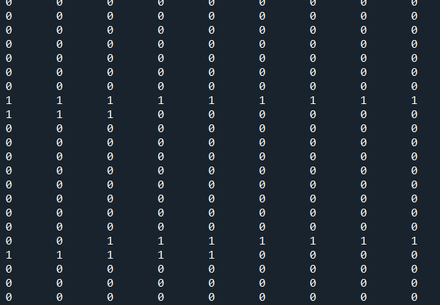
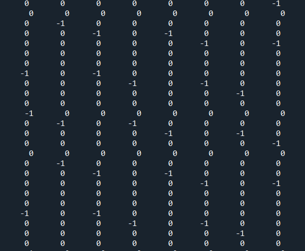
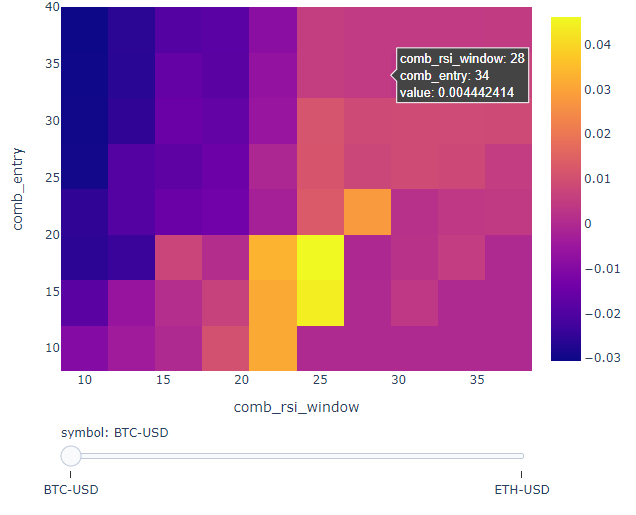
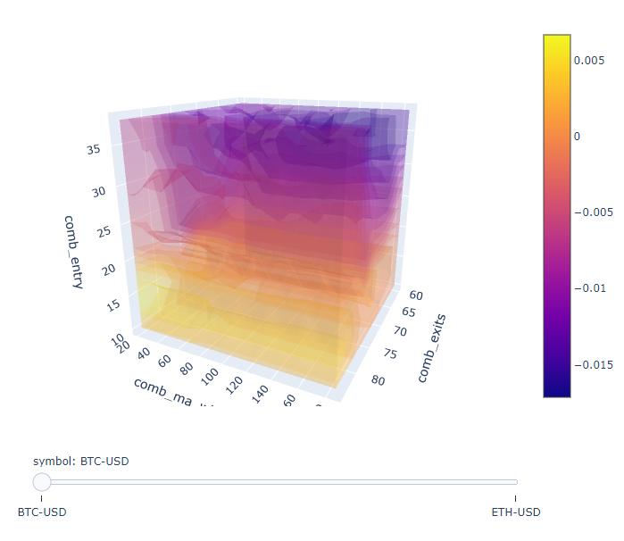

## 多幣種回測

```python
import numpy as np
import pandas as pd
import vectorbt as vbt
import warnings
from datetime import datetime


# Prepare data
start = "2019-01-01 UTC"  # crypto is in UTC
end = "2020-01-01 UTC"
btc_price = vbt.YFData.download("BTC-USD", start=start, end=end).get("Close")
eth_price = vbt.YFData.download("ETH-USD", start=start, end=end).get("Close")
comb_price = btc_price.vbt.concat(
    eth_price, keys=pd.Index(["BTC", "ETH"], name="symbol")
)
comb_price.vbt.drop_levels(-1, inplace=True)

fast_ma = vbt.MA.run(comb_price, [10, 20], short_name="fast")
slow_ma = vbt.MA.run(comb_price, [30, 30], short_name="slow")

entries = fast_ma.ma_crossed_above(slow_ma)
exits = fast_ma.ma_crossed_below(slow_ma)

pf = vbt.Portfolio.from_signals(comb_price, entries, exits)
print(pf.total_return())
print(pf.stats())
```

## Multiple assets, multiple trade signals per asset 

```python
import pandas as pd
import vectorbt as vbt

price = pd.DataFrame({"p1": [1, 2, 3, 4], "p2": [5, 6, 7, 8]})
price.columns.name = "asset"
entries = pd.DataFrame(
    {
        "en1": [True, False, False, False],
        "en2": [False, True, False, False],
        "en3": [False, False, True, False],
        "en4": [False, False, False, True],
    }
)
entries.columns.name = "entries"
exits = pd.DataFrame(
    {
        "ex1": [False, False, False, True],
        "ex2": [False, False, False, True],
        "ex3": [False, False, False, True],
        "ex4": [False, False, False, True],
    }
)
exits.columns.name = "exits"
entries = entries.vbt.stack_index(pd.Index(["p1", "p1", "p2", "p2"], name="asset"))
exits = exits.vbt.stack_index(pd.Index(["p1", "p1", "p2", "p2"], name="asset"))
portfolio = vbt.Portfolio.from_signals(price, entries, exits)  # not grouped portfolio
print(portfolio.total_return())
print(portfolio.total_return(group_by='asset'))  # group not grouped portfolio

portfolio = vbt.Portfolio.from_signals(price, entries, exits, group_by='asset')  # grouped portfolio
print(portfolio.total_return())

print(portfolio.total_return(group_by=False))  # ungroup grouped portfolio

```

## from_order_func 做資金加減碼

```python
from numba import njit
from vectorbt.portfolio import nb
from vectorbt.portfolio.enums import Direction

import numpy as np
import vectorbt as vbt
import pandas as pd
import warnings

pd.options.display.float_format = lambda x: "%.2f" % x

warnings.simplefilter("ignore", UserWarning)


def simulate():
    @njit
    def order_func_nb(c, action, direction, fees):
        # _size = 1000 / float(c.close[c.i, c.col])
        # print(
        #    "Close:",
        #    c.close[c.i, c.col],
        #    "Direction:",
        #    direction,
        #    "c.i:",
        #    c.i,
        #    "c.col:",
        #    c.col,
        #    "fees:",
        #    fees,
        #    "_size:",
        #    round(_size, 2),
        #    "position_now:",
        #    c.position_now,
        #    "action:",
        #    action[c.i],
        # )

        size = 0
        if action[c.i] == 1:
            # 1000 / float(c.close[c.i, c.col]) 買入 1000 元的股票
            size = 1000 / float(c.close[c.i, c.col])
        elif action[c.i] == -1:
            # -c.position_now 持有全部的股票賣出
            size = -c.position_now

        return nb.order_nb(
            price=c.close[c.i, c.col], size=size, direction=direction, fees=fees,
        )

    # 加碼策略
    action = pd.Series([1, 1, -1, 1, -1, 0, 0, 1, -1])
    dates = pd.date_range("20220301", periods=len(action))
    price = pd.DataFrame(
        {"Price": [100, 200, 300, 400, 500, 600, 700, 800, 900]}, index=dates
    )
    fees = 0.002  # per frame
    pf = vbt.Portfolio.from_order_func(
        price,
        order_func_nb,
        np.asarray(action),
        Direction.LongOnly,
        fees,
        init_cash=1000000,
    )
    orders_records_readable = pf.orders.records_readable.drop("Column", axis=1)
    print(orders_records_readable.to_markdown(index=False, floatfmt=".2f"))
    print(pf.assets().rename(columns={"Price": "assets"}))
    print(pf.cash().rename(columns={"Price": "cash"}))
    print(pf.stats())


if __name__ == "__main__":
    simulate()
```


## OrderContext

```python
class OrderContext(tp.NamedTuple):
    target_shape: tp.Shape  # 目標形狀
    group_lens: tp.Array1d  # 分組長度
    init_cash: tp.Array1d  # 初始現金
    cash_sharing: bool  # 是否共享現金
    call_seq: tp.Optional[tp.Array2d]  # 呼叫順序
    segment_mask: tp.ArrayLike  # 分段遮罩
    call_pre_segment: bool  # 是否在分段之前呼叫
    call_post_segment: bool  # 是否在分段之後呼叫
    close: tp.ArrayLike  # 收盤價
    ffill_val_price: bool  # 是否向前填充估值價格
    update_value: bool  # 是否更新持倉估值
    fill_pos_record: bool  # 是否填充持倉紀錄
    flex_2d: bool  # 是否彈性處理2D數據
    order_records: tp.RecordArray  # 訂單紀錄
    log_records: tp.RecordArray  # 日誌紀錄
    last_cash: tp.Array1d  # 上次現金
    last_position: tp.Array1d  # 上次持倉
    last_debt: tp.Array1d  # 上次負債
    last_free_cash: tp.Array1d  # 上次自由現金
    last_val_price: tp.Array1d  # 上次估值價格
    last_value: tp.Array1d  # 上次持倉估值
    second_last_value: tp.Array1d  # 倒數第二次持倉估值
    last_return: tp.Array1d  # 上次收益率
    last_oidx: tp.Array1d  # 上次訂單索引
    last_lidx: tp.Array1d  # 上次日誌索引
    last_pos_record: tp.RecordArray  # 上次持倉紀錄
    group: int  # 分組
    group_len: int  # 分組長度
    from_col: int  # 起始欄位
    to_col: int  # 終止欄位
    i: int  # 迭代器
    call_seq_now: tp.Optional[tp.Array1d]  # 當前呼叫順序
    col: int  # 當前欄位
    call_idx: int  # 當前呼叫索引
    cash_now: float  # 現金餘額
    position_now: float  # 持倉量
    debt_now: float  # 負債金額
    free_cash_now: float  # 自由現金餘額
    val_price_now: float  # 估值價格
    value_now: float  # 持倉估值
    return_now: float  # 當前收益率
```


```sh
報告列出了許多評估指標：

Start：回測開始日期。
End：回測結束日期。
Period：回測時間段。
Start Value：回測開始時的資產價值。
End Value：回測結束時的資產價值。
Total Return [%]：回測期間的總回報率。
Benchmark Return [%]：基準指數的回報率。
Max Gross Exposure [%]：最大總槓桿率。
Total Fees Paid：交易費用總額。
Max Drawdown [%]：最大回撤率。
Max Drawdown Duration：最大回撤期間。
Total Trades：總交易次數。
Total Closed Trades：總平倉交易次數。
Total Open Trades：總持倉交易次數。
Open Trade PnL：未平倉交易的盈虧。
Win Rate [%]：勝率。
Best Trade [%]：最佳交易回報率。
Worst Trade [%]：最差交易回報率。
Avg Winning Trade [%]：平均勝利交易回報率。
Avg Losing Trade [%]：平均虧損交易回報率。
Avg Winning Trade Duration：平均勝利交易持續時間。
Avg Losing Trade Duration：平均虧損交易持續時間。
Profit Factor：盈虧比。
Expectancy：預期值。
Sharpe Ratio：夏普比率。
Calmar Ratio：卡爾馬比率。
Omega Ratio：歐米茄比率。
Sortino Ratio：索提諾比率。

其中一些指標的定義可能需要參考具體的金融概念，例如回報率、總槓桿率、回撤率、夏普比率等等。這些指標可以幫助用戶評估交易策略的表現，以便做出相應的調整和優化。
```


## asset_flow

```python
import numpy as np
from vectorbt.records.nb import col_map_nb
from vectorbt.portfolio.nb import simulate_from_orders_nb, asset_flow_nb
from vectorbt.portfolio.enums import Direction

close = np.array([1, 2, 3, 4, 5])[:, None]
order_records, _ = simulate_from_orders_nb(
    target_shape=close.shape,
    close=close,
    group_lens=np.array([1]),
    init_cash=np.array([100]),
    call_seq=np.full(close.shape, 0)
)

print(order_records)

col_map = col_map_nb(order_records['col'], close.shape[1])
asset_flow = asset_flow_nb(close.shape, order_records, col_map, Direction.Both)
print(asset_flow)
```


## 資金1000 加碼 size 統計

```python
import pandas as pd

# create a date range
dates = pd.date_range("20220301", periods=7)

# create a price dataframe
price = pd.DataFrame({"price": [50, 100, 200, 250, 300, 400, 500]}, index=dates)

# create entry and exit dataframes
entries = pd.DataFrame(
    {"entry": [False, True, True, False, False, True, False]}, index=dates
)
exits = pd.DataFrame(
    {"exit": [False, False, False, False, True, False, True]}, index=dates
)

# concatenate the dataframes horizontally
df = pd.concat([price, entries, exits], axis=1)

# calculate the size column based on entries and exits
size = []
current_size = 0
for i in range(len(df)):
    if df["entry"][i]:
        current_size = 1000 / df["price"][i]
    elif df["exit"][i]:
        current_size = -sum(size)
    elif not df["entry"][i] and not df["exit"][i]:
        current_size = 0
    size.append(current_size)

# add the size column to the dataframe
df["size"] = size

# print the resulting dataframe
print(df)
```


```python
from numba import njit
from vectorbt.portfolio import nb
from vectorbt.portfolio.enums import (
    SizeType,
    Direction,
    NoOrder,
    OrderStatus,
    OrderSide,
)


import numpy as np
import vectorbt as vbt
import pandas as pd
import warnings

warnings.simplefilter("ignore", UserWarning)


@njit
def pre_sim_func_nb(c):
    # We need to define stop price per column once
    stop_price = np.full(c.target_shape[1], np.nan, dtype=np.float_)
    return (stop_price,)


@njit
def order_func_nb(c, stop_price, entries, exits, size):
    # Select info related to this order
    entry_now = nb.get_elem_nb(c, entries)
    exit_now = nb.get_elem_nb(c, exits)
    size_now = nb.get_elem_nb(c, size)
    price_now = nb.get_elem_nb(c, c.close)
    stop_price_now = stop_price[c.col]

    # Our logic
    if entry_now:
        if c.position_now == 0:
            return nb.order_nb(
                size=size_now, price=price_now, direction=Direction.LongOnly
            )
    elif exit_now or price_now >= stop_price_now:
        if c.position_now > 0:
            return nb.order_nb(
                size=-size_now, price=price_now, direction=Direction.LongOnly
            )
    return NoOrder


@njit
def post_order_func_nb(c, stop_price, stop):
    # Same broadcasting as for size
    stop_now = nb.get_elem_nb(c, stop)

    if c.order_result.status == OrderStatus.Filled:
        if c.order_result.side == OrderSide.Buy:
            # Position entered: Set stop condition
            stop_price[c.col] = (1 + stop_now) * c.order_result.price
        else:
            # Position exited: Remove stop condition
            stop_price[c.col] = np.nan


def simulate(close, entries, exits, size, threshold):
    return vbt.Portfolio.from_order_func(
        close,
        order_func_nb,
        vbt.Rep("entries"),
        vbt.Rep("exits"),
        vbt.Rep("size"),  # order_args
        pre_sim_func_nb=pre_sim_func_nb,
        post_order_func_nb=post_order_func_nb,
        post_order_args=(vbt.Rep("threshold"),),
        broadcast_named_args=dict(  # broadcast against each other
            entries=entries, exits=exits, size=size, threshold=threshold
        ),
    )


if __name__ == "__main__":
    close = pd.Series([10, 11, 12, 13, 14])
    entries = pd.Series([True, True, False, False, False])
    exits = pd.Series([False, False, False, True, True])
    pf = simulate(close, entries, exits, np.inf, 0.1)
    print(pf.orders.records_readable)
    print(pf.assets())
    print(pf.cash())
    print(pf.stats())

```

## 使用 from_order_func 動態加碼

```python
from numba import njit
from vectorbt.utils.enum_ import map_enum_fields
from vectorbt.portfolio import nb
from vectorbt.portfolio.enums import (
    SizeType,
    Direction,
    NoOrder,
    OrderStatus,
    OrderSide,
)


import yfinance as yf
import numpy as np
import vectorbt as vbt
import pandas as pd
import warnings

warnings.simplefilter("ignore", UserWarning)

# 下載股票價格數據
# symbols = ["GOOG"]
# raw_data = yf.download(symbols, start="2010-01-01", end="2023-03-09")
# close = raw_data.loc[:, "Close"]

# Buy 10 units each tick using closing price:
def test():
    @njit
    def order_func_nb(c, size):
        return nb.order_nb(size=size)

    close = pd.Series([1, 2, 3, 4, 5])
    pf = vbt.Portfolio.from_order_func(close, order_func_nb, 10, init_cash=100000,)
    print(pf.assets())
    print(pf.cash())
    print(pf.stats())


def from_order_function_test():
    @njit
    def order_func_nb(c, size, direction, fees):
        print(
            "Close:",
            c.close[c.i, c.col],
            "Size:",
            size[c.i],
            "Direction:",
            direction[c.col],
            "c.i:",
            c.i,
            "c.col:",
            c.col,
            "fees:",
            fees,
        )
        return nb.order_nb(
            price=c.close[c.i, c.col],
            size=size[c.i],
            direction=direction[c.col],
            fees=fees,
        )

    if True:
        # 加碼策略
        size = pd.Series([1, 1, -2, 1, -1])  # per row
        dates = pd.date_range("20220301", periods=5)
        price = pd.DataFrame(
            {"a": [100, 200, 300, 400, 500], "b": [500, 400, 300, 200, 100]},
            index=dates,
        )  # per element
    else:
        size = pd.Series([1, -1, 1, -1])  # per row
        dates = pd.date_range("20220301", periods=4)
        price = pd.DataFrame(
            {"a": [100, 200, 300, 400], "b": [400, 300, 200, 100]}, index=dates,
        )  # per element

    direction = ["longonly", "shortonly"]  # per column
    fees = 0.01  # per frame
    direction_num = map_enum_fields(direction, Direction)
    pf = vbt.Portfolio.from_order_func(
        price,
        order_func_nb,
        np.asarray(size),
        np.asarray(direction_num),
        fees,
        init_cash=10000,
    )
    print(pf.orders.records_readable)
    print(pf.assets())
    print(pf.cash())
    print(pf.stats())


if __name__ == "__main__":
    # Disable scientific notation
    pd.options.display.float_format = lambda x: "%.2f" % x
    test()
    print("\n=================================================\n")
    from_order_function_test()
```


## VectotBT  example

```py
from datetime import datetime
import vectorbt as vbt

interval = '4h'
cols = ['Open', 'High', 'Low', 'Close', 'Volume']
start_str = '360 days ago UTC'
end_str = f'{datetime.now()}'
#symbols = ["BTCUSDT", "ETHUSDT", "LTCUSDT", "BNBUSDT", "XRPUSDT"]
symbols = ["BTCUSDT"]
df = vbt.BinanceData.download(symbols,start=start_str,interval=interval).get(cols)
ma99 = vbt.MA.run(df["Close"], 99, short_name="ma99")

entries = ma99.close_crossed_above(ma99.ma) 
exits = ma99.close_crossed_below(ma99.ma) 
pf = vbt.Portfolio.from_signals(df["Close"], entries, exits)
print(pf.stats())
```

# Python筆記 : 股票策略回測 by Vectorbt


## 大致介紹

vectorbt是一套拿來進行量化分析的套件，特別的點在於他有numpy的速度,以及pandas的方便性。
因此比起其他的回測套件，他擁有極佳的速度，可以在短時間之內分析大量的策略。其中，套到這個套件裡面的所有參數都可以進行向量化，允許我們同時對所有元素執行相同的操作。另外，也使用 Numba 解決了與向量化相關的路徑依賴問題。

這邊大部分使用的套件說明都可以在[這裡](https://vectorbt.pro/api/)看到詳細說明。

## 模組

```python
import vectorbt as vbt 
# import plotly 可不用，因vectorbt有自帶視覺化套件
import datetime
import pandas as pd
import numpy as np
```

## 時間設定以及視覺化分析資料的位置

```python
filename='某個位置路徑'
end_date=datetime.datetime.now()
start_date=end_date - datetime.timedelta(days=3) #限制在3天之內
```

這邊設3天是因為等等要抓取的時間單位為一分鐘，故三天已經夠長了。

## Data Import

```python
btc_price = vbt.YFData.download('BTC-USD',  
                                #['BTC-USD','ETH-USD'], 可以用列表同時import多重的data
                                interval='1m',  #改變時間的單位
                                start = start_date,
                                end=end_date,
                                missing_idnex='drop').get('Close') 
```

vectorbt會自動抓取yfinace的api，只要yfinance有的，都可以抓的到。
標的可以分為:

| 臺股                            | 美股      | 加密貨幣     |
| :------------------------------ | :-------- | :----------- |
| Ex : [2330.TW](http://2330.tw/) | Ex : TSLA | Ex : BTC-USD |

## 交易策略

這裡使用的交易策略相當簡單，因為主要目的是為了熟悉vectorbt的使用。

| 情況                                 | 操作 |
| :----------------------------------- | :--- |
| rsi>設定的高標                       | 賣出 |
| rsi<設定的低標 且 最近的收盤價低於ma | 買入 |

當rsi大於我們設定的高標，代表目前股市可能進入過熱的壯臺，則我們可以選擇在這時候進行賣出的操作。當相反情況出現，rsi低於我們設定的低標的話，而且這時候的收盤價低於ma線，表示這時候或許是一個很好的入場點，則我們可以在這時候進行買入的操作。(這邊都是極度簡單的操作，要是這樣就可以穩穩贏過大盤就太感謝了…)

## 客製化訊號以及策略

這邊主要可以分成三個區塊，分別為:

1. Define一個函數，裡面主要用來計算出是否可以進入市場的訊號 -> 1及-1。
2. 算是一個用來做出策略的食譜，裡面放著等等產出的資料變數名稱以及一些默認變數。
3. 實際執行策略，裡麵包含一些變數的範圍。

### 1. Define a function

```python
def custom_indicator(close,               #每當在這邊增加一個參數，就要在第二步驟的ind裡面的param_names裡面增加
                     rsi_window = 14,
                     ma_window = 50,
                     entry=30,
                     exits=70
                     ):    
    close_5m = close.resample('5T').last() #將資料型態從1min變成5min
    rsi = vbt.RSI.run(close_5m, window = rsi_window).rsi  #rsi中的rsi值(因為在這裡的前面rsi出來的不會只有單純的rsi)
    rsi, _ =rsi.align(close,    #將5min的資料重新展開成1min
                     broadcast_axis=0,
                     method='ffill',  #並將空值以第5分鐘的copy塞進去
                     join='right'  #rsi是right table，close是left table
                     ) #by doing so, rsi跟close有same shape，只是rsi是5min的資料，close是1分鐘的資料
    close = close.to_numpy()
    rsi = rsi.to_numpy()
    ma = vbt.MA.run(close, window = ma_window).ma.to_numpy()
    trend = np.where(rsi > exits, -1, 0) #要是rsi>70，則賣出(-1)，否則甚麼都不做(0)
    trend = np.where((rsi < entry)&(close < ma),  1, trend)  #要是rsi<30而且收盤價<ma，則買入(1)，如果沒有的話就按照原本的trend
    return trend
```

### 2. 策略的食譜

```python
ind = vbt.IndicatorFactory(   
    class_name = 'Combination',
    short_name = 'comb', 
    input_names=['close'], #輸入的parameter的名字
    #param_names=['window'], #hyper parameter的名字，也可用列表呈現
    param_names=['rsi_window','ma_window','entry','exits'],
    output_names=['value']  #output出來的名字
    ).from_apply_func(   #提供一些默認值給recipe，就是上面define的function裡面的parameter
        custom_indicator,
        rsi_window=14,
        ma_window=50,
        entry=70,
        exits=30,
        keep_pd=True #保持資料型態為pandas，避免變成numpy arrays
        )
```

### 3. 實際執行策略

```python
res = ind.run(  #run 一個策略
    btc_price,
    #rsi_window = [14,35,21], #給定特定值
    rsi_window = np.arange(10,40,step=3,dtype=int), #給定一個範圍
    #ma_window = [21,50,100],
    ma_window = np.arange(20,200,step=15,dtype=int),
    #entry=[30,40],
    entry = np.arange(10,40,step=4,dtype=int),
    #exits=[60,70],
    exits = np.arange(60,85,step=4,dtype=int),
    param_product=True) #如果沒有這個的話，只會按照list的順序，並不會兩兩配對
```

這邊有兩種險方式來定義變數，一個是給定特定值的list，Ex:[14,35,21]，表示將rsi_window分別設定為14、35、21，代表只會嘗試這三個數值。另一種方式則是使用np.arange，將在這個range的數值全部帶進去進行計算，進而求出每一種狀況下的獲利。

### 執行結果

```
print(res.value)
```

output:

```python
comb_rsi_window                10                  ...      37                
comb_ma_window                20                   ...     185                
comb_entry                     10                  ...      38                
comb_exits                     60              64  ...      80      84        
symbol                    BTC-USD ETH-USD BTC-USD  ... ETH-USD BTC-USD ETH-USD
Datetime                                           ...                        
2022-08-11 03:07:00+00:00       0       0       0  ...       0       0       0
2022-08-11 03:09:00+00:00       0       0       0  ...       0       0       0
2022-08-11 03:11:00+00:00       0       0       0  ...       0       0       0
2022-08-11 03:13:00+00:00       0       0       0  ...       0       0       0
2022-08-11 03:15:00+00:00       0       0       0  ...       0       0       0
                          ...     ...     ...  ...     ...     ...     ...
2022-08-14 03:00:00+00:00       0       0       0  ...       0       0       0
2022-08-14 03:01:00+00:00       0       0       0  ...       0       0       0
2022-08-14 03:02:00+00:00       0       0       0  ...       0       0       0
2022-08-14 03:03:00+00:00       0       0       0  ...       0       0       0
2022-08-14 03:04:00+00:00       0       0       0  ...       0       0       0

[3690 rows x 13440 columns]
```

如果將結果攤開來看，會呈現



以及



代表著我們進出場的訊號。

## 將訊號帶入策略執行

這時我們將剛剛得到的res進行處裡，其中1設定為entries，-1設定為exits。

```
entries = res.value == 1
exits = res.value == -1
```

實際執行

```
pf = vbt.Portfolio.from_signals(btc_price, entries, exits)
```

試著看看執行結果

```
print(pf.stats().to_string()) #to_string()可以將全部結果攤開
```

會得到:

```
Output from spyder call 'get_namespace_view':
Start                         2022-08-11 03:07:00+00:00
End                           2022-08-14 03:04:00+00:00
Period                                             3690
Start Value                                       100.0
End Value                                    100.179789
Total Return [%]                               0.179789
Benchmark Return [%]                           3.590516
Max Gross Exposure [%]                        83.020833
Total Fees Paid                                     0.0
Max Drawdown [%]                               2.078304
Max Drawdown Duration                       2193.187668
Total Trades                                    4.26994
Total Closed Trades                            3.966369
Total Open Trades                              0.303571
Open Trade PnL                                 0.076599
Win Rate [%]                                  63.829362
Best Trade [%]                                 0.680632
Worst Trade [%]                                -0.39365
Avg Winning Trade [%]                          0.607418
Avg Losing Trade [%]                            -0.6351
Avg Winning Trade Duration                   260.345941
Avg Losing Trade Duration                    445.916595
Profit Factor                                       inf
Expectancy                                     0.202725
```

執行此段程式碼則可以獲得所有變數組合的報酬

```
print(pf.total_return().to_string())
```

只擷取其中一小段

```
                 170             10          60          BTC-USD    0.000000
                                                         ETH-USD    0.000000
                                             64          BTC-USD    0.000000
                                                         ETH-USD    0.000000
                                             68          BTC-USD    0.000000
                                                         ETH-USD    0.000000
                                             72          BTC-USD    0.000000
                                                         ETH-USD    0.000000
                                             76          BTC-USD    0.000000
                                                         ETH-USD    0.000000
                                             80          BTC-USD    0.000000
                                                         ETH-USD    0.000000
                                             84          BTC-USD    0.000000
                                                         ETH-USD    0.000000
                                 14          60          BTC-USD    0.000000
                                                         ETH-USD    0.000000
                                             64          BTC-USD    0.000000
                                                         ETH-USD    0.000000
                                             68          BTC-USD    0.000000
                                                         ETH-USD    0.000000
                                             72          BTC-USD    0.000000
                                                         ETH-USD    0.000000
                                             76          BTC-USD    0.000000
                                                         ETH-USD    0.000000
                                             80          BTC-USD    0.000000
                                                         ETH-USD    0.000000
                                             84          BTC-USD    0.000000
                                                         ETH-USD    0.000000
```

只抽取此策略的報酬率

```
returns = pf.total_return()
print(returns.max()) #最大的報酬率
print(returns.idxmax()) #最大的組合
print(returns.to_string()) #所有組合
```

可以得到

```
0.06338762101981515 
(37, 20, 30, 84, 'ETH-USD') #分別代表rsi_window, ma_window, entry, exits 
```

## 資料視覺化

vectorbt套件中有附兩種資料視覺化的模式，分別為:

1. Heatmap
2. Volume

### Heatmap

```
fig = returns.vbt.heatmap(
    x_level = 'comb_rsi_window',
    #y_level = 'comb_ma_window',
    y_level = 'comb_entry',
    slider_level = 'symbol' #如果同時分析不同標的，則可以透過slider切換
    )
fig.write_html(filename,auto_open=True)#圖片儲存並自動展開
```



### Volume

將資料以3d的樣式呈現，可同時比較多個變數。

```
fig = returns.vbt.volume(
    x_level = 'comb_exits',
    y_level = 'comb_ma_window',
    z_level = 'comb_entry',
    slider_level = 'symbol'
    )
fig.write_html(filename,auto_open=True)#圖片儲存並自動展開
```


