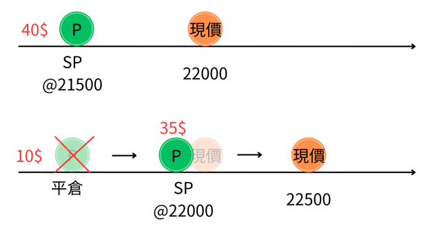
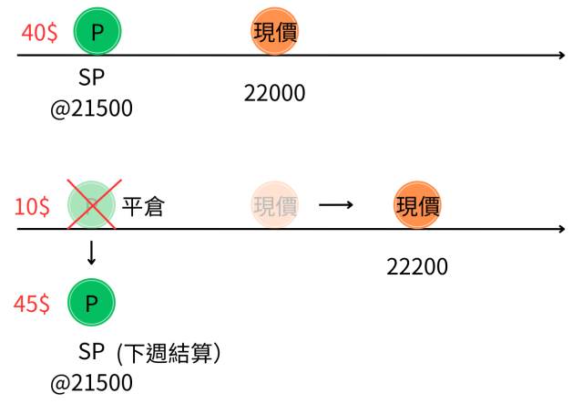
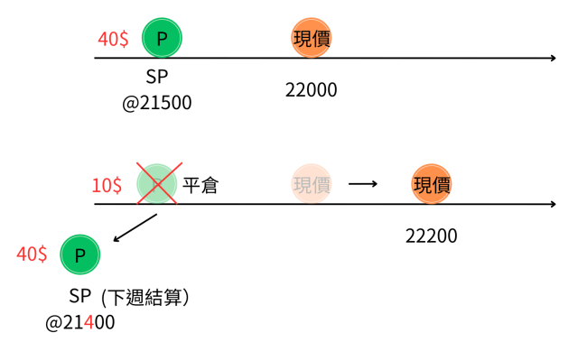

# 周選擇權的賣方轉倉（rolling）實戰3秘訣

**作者：** 勳仔
**日期：** 2025年1月11日
**分類：** 選擇權

---

## 前言

在「指數節稅多元收益投資法」框架下，周選擇權的賣方策略是重要的收益來源之一。本文將介紹如何透過週選擇權的轉倉（rolling）技巧來提升整體績效。

核心概念是：**利用賣出週選擇權來收取權利金，同時等待指數回檔至目標價位。**

適當利用週選擇權rolling（轉倉）的技巧，可以提升整體的績效。

---

## 三種轉倉技巧

### 1. 垂直轉倉（Vertical Rolling）

**定義：** 保持到期日不變，調整履約價格

**適用情境：**
- 權利金剩餘價值高時使用
- 可以增加額外收益

**操作方式：**
- 買回原有部位
- 同時賣出相同到期日、但不同履約價的新部位

---

### 2. 水平轉倉（Horizontal Rolling）

**定義：** 保持履約價不變，將到期日延後至下週

**適用情境：**
- 距離到期日較近
- 時間價值已經縮水

**操作方式：**
- 買回即將到期的部位
- 同時賣出相同履約價、但到期日延後的新部位

---

### 3. 對角轉倉（Diagonal Rolling）

**定義：** 同時調整履約價和到期日

**適用情境：**
- 用於「用時間換取獲利」
- 特別是在虧損情況下轉為盈利

**操作方式：**
- 買回原有部位
- 同時賣出不同履約價、不同到期日的新部位

---

## 重要原則

### ⚠️ 嚴格控制槓桿

> 「適當利用週選擇權rolling（轉倉）的技巧，可以提升整體的績效」

**關鍵提醒：**
- 不應為追求權利金而盲目增加部位
- 嚴格控制槓桿倍數
- 風險管理優先於收益最大化

---

## 總結

週選擇權的轉倉技巧提供了靈活的部位管理方式：

1. **垂直轉倉** - 調整價格，增加收益
2. **水平轉倉** - 延長時間，保持履約價
3. **對角轉倉** - 同時調整，最大彈性

選擇適合的轉倉策略，配合市場狀況和個人風險承受度，才能在週選擇權操作中獲得穩定收益。

---

**資料來源：** [勳仔投資理財網](https://shiuncorner.com/)
