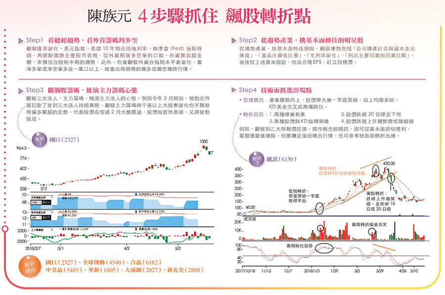

## 三心法順勢操作 陳族元10年資產翻10倍

https://www.businesstoday.com.tw/article/category/80401/post/201805300009/


覆巢之下無完卵，再好的股票，當遇到大環境趨勢反轉向下，一樣可以摔得體無完膚。」陳族元若有所思地說。

他認為，投資市場的贏家有兩種人，一種是基本面派，有機會長抱、賺大波段行情，卻也容易執著自己看好基本面的個股，不願意相信自己看錯，會敗在停損太慢。第二種是主力派，看籌碼、看技術面，但對買的股票不見得了解，也可能敗在誤判公司經營實績。

 

## **心法１》研判臺股多空** **美元指數、公債殖利率、升息進度**

 

原本篤信基本面派的陳族元，為了精進投資技巧，集兩者的優點，藉由建立投資SOP，從而也盡可能地減少判斷盲點。他採取的作法是，首先觀察大環境趨勢，包括外資、主力籌碼變化，研判臺股大盤多空轉折；再從趨勢產業，聚焦基本面轉好，技術面與籌碼面轉強的個股，並以此作為進出場的依據。而無論是看大盤或看個股、看基本面或技術面，關鍵，都是判斷多空趨勢轉折是否即將發生。

 

陳族元分析，「掌握轉折的順勢操作法」一共有三大心法。首先，是從美元指數、美國十年期公債殖利率，以及聯準會（Fed）公佈的升息進度變化等，研判臺股大盤多空走勢。

 

簡單地說，這三者都攸關臺股資金水位，弱美元、低利率、聯準會採寬鬆政策，相對有利臺股資金，透過這樣的基本判斷，可以初步擬定臺股資金部位的控管。


```
研判臺股大盤多空走勢時，確實可以考慮美元指數、美國十年期公債收益率以及聯邦儲備系統（Fed）的升息進度等因素。這些因素可以影響全球資本流動、市場信心和企業盈利等方面，從而對股市產生影響。

以下是一些常考慮的因素：

美元指數： 臺股通常受到全球資本流動的影響，而美元是國際貿易和金融活動中的主要貨幣。美元指數的走勢可以反映出美元相對其他主要貨幣的強弱，對出口導向型經濟的臺灣來說，美元的變化可能對企業盈利和出口業績有一定的影響。

美國十年期公債收益率： 長期利率的變動可以影響企業的融資成本和投資決策，也可以影響投資者對股票相對於債券的偏好。如果十年期公債收益率上升，可能導致投資者更傾向於債券而非股票，從而對臺股形成一定的壓力。

聯邦儲備系統的升息進度： 如果美聯儲加息，這可能導致全球資本流動的變化，也可能影響到全球的資產價格。升息可能對股票市場形成一定的負面影響，因為投資者可能更傾向於尋求相對較安全的資產。

宏觀經濟指標： 關注臺灣和全球的宏觀經濟指標，例如GDP增長率、出口資料、失業率等，可以提供對整體經濟環境的瞭解，從而影響股市表現。

地緣政治風險： 全球地緣政治緊張局勢可能對股市產生不確定性。關注國際事務，特別是與臺灣相關的地緣政治動態，對於預測市場可能的波動具有重要意義。

在進行多空走勢的研判時，綜合考慮這些因素，並密切關注相關的新聞和資料，可以幫助制定更全面的投資策略。需要注意的是，股市受多種因素影響，且市場具有一定的不確定性，因此投資決策應該謹慎，並根據個人的風險偏好和投資目標做出相應的調整。
```


 

## **心法2》觀察外資籌碼** **期貨多空口數、買賣超金額、臺指期**

 

其次，在籌碼觀察方面，則會從外資期貨淨多單與淨空單的口數、外資買賣超金額變化、臺指期佈局情況，研判大盤多空方向。例如二○一五年四月二十七日，臺股前一次攻上萬點時，外資淨多單卻不到萬口，隔日指數創高，淨多單更大減至五千七百多口，代表外資心態保守，隨後五月轉成淨空單，僅四天就超過一萬口，即使當時外資現貨買超，若忽略期貨警訊，恐怕難逃當時萬點下修的命運。

至於今年臺股大盤怎麼看？陳族元直言，綜觀上述指標做觀察，相較於去年大多頭行情明確，今年在操作上，宜更謹慎看待，積極留意多空轉折訊號。他以前面提到的幾項指標分析，近來美國十年期公債殖利率屢過三％，債券殖利率走高，加上美元轉強，熱錢從新興市場回到美國，再加上聯準會採緊縮貨幣姿態，均不利多頭。

 

事實上，早在今年一月間，他就看見當時外資淨多單不增反減，一月三十日也終止連日來的現貨買超，加上主力籌碼、投資法人也出現連續性賣盤，讓他開始佈局空單，後來大盤果然下修至一○一八九點的波段低點，空單佈局讓他賺了近千點的行情。

 

後來，雖然臺股開始跌深反彈，陳族元也在三月中旬作多被動元件，但美國總統川普對中國進口加徵關稅，兩國貿易戰的不確定性，以及國際油價大漲，使得通膨疑慮升高，未來聯準會升息腳步加快，讓投資部位不小的他，操作策略猶如法人，雖然現貨持股有九成，但期貨避險空單也不在少數。對於不作空的投資人，他建議目前持股最好不要超過五成，以因應臺股後市的盤勢變化。

 

## **心法3》精選趨勢個股** **鎖定基本面成長、擁轉機題材標的**

 

確定大盤方向後，就是第三心法，精選個股。對此，陳族元會鎖定趨勢產業，挑基本面出現成長或轉機題材的公司，進而從籌碼、K線、價量、形態等技術面表現，來確認轉折與趨勢，作為進出場的依據，尤其在籌碼與基本面獲利數字的計算方面，陳族元也都會製作Excel分析表，當作進出場的準則。

 

陳族元以先前操作的飆股撼訊為例，他在去年十月十一日當撼訊股價突破整理平臺、在三十八元附近買進時，也沒想到今年四月會大漲到波段高點四二○元。陳族元說，去年八月時，他就看好乙太幣飆漲的商機，經過基本面研究發現，撼訊是相關挖礦商機的重點供貨廠商，且股本小，獲利貢獻度最高，是賺機會財的最佳口袋名單。

他分析，一七年五月起，撼訊連續六個月營收年增率成長，而當營收超過一定規模後，獲利跳升的速度開始加快，從六月單月每股EPS一元、七月二元多就可看出端倪；他推估，當公司營收超過三億元，每多一千萬元就可以貢獻每股純益○．一元，因此只要公司一公佈營收，就能概算出獲利，當他算出撼訊今年第一季單季就賺四元至五元，更是讓他見獵心喜，因為有了乙太幣風潮的趨勢，加上基本面獲利跳升，再搭技術面轉強與主力籌碼追進，更能增加投資勝率。

 

擅長追蹤籌碼的陳族元說，撼訊股價最剽悍的一八○元漲到四二○元波段，「就是典型的噴出行情，是市場老主力的傑作。」他從追蹤券商分點籌碼推測，追捧大咖多為市場資金雄厚的主力，他笑著舉例，「不難發現，富隆證券陸續有大單，市場就揣測這是出自老主力『阿不拉』之手。」

 

只是，在撼訊大漲的過程中，他沒有一路抱到四月最高點四二○元，而是在股價八○元、一五○元附近等陸續出脫持股。回頭來看，雖然放掉了最後的大波段，但因為從基本面分析精準抓到「向上轉折點」，也讓他在前後不到半年的時間仍有超過五倍獲利，就獲利倍數來看，不輸由市場主力主導的最後末升段。

 

換個角度思考，當個股漲勢由主力主導，一旦反轉，跌勢往往也更加迅猛，殺得散戶措手不及。相對之下，若能「由基本面提早掌握向上轉折買點」，則可讓自己不必為了賺飽賺足，而承擔「與主力互鬥」的風險。

 

另方面，之所以提早出場，也是因為陳族元發現了新的轉折向上獲利機會。「你會發現，三、四月矽晶圓族群股價拉高，主力籌碼一直賣，被動元件漲這麼多，卻一直有人買。進一步研究基本面，你就會發現未來股價仍很有戲。」

陳族元說，他在華新科股價九十幾元陸續大單佈局，抱到一七○元附近，又發現國巨更值得投資，轉而在五、六百元附近加碼國巨，尤其從資金追逐的角度來看今年三月以來的漲勢，不但主力籌碼大增，千張以上大戶持股也在一定的水準，後續果然一度飆高到一○六五元，惟近期散戶籌碼增加，主力籌碼出現調節，宜留意股價漲多整理的震盪。

 

[]

 

## **展望後市** **看好被動元件、矽晶圓、金融**

 

展望未來，陳族元看好的標的有被動元件的國巨、自動化設備廠全球傳動、矽晶圓的合晶與中美晶，以及受惠升息環境的金融股新光金等。而受到原物料漲勢激勵，他也看好大成鋼擁有六個月低價庫存的優勢，今年EPS上看五元，至於華新持有華新科，現金殖利率近四％，法人預估今年EPS有三元多，也是值得留意的標的。

 

無論是從資金大環境判斷大盤轉折，或者是從基本面提早抓住向上轉折點，都是為了能夠降低「系統性翻盤」、「與主力互鬥」的風險。也就是仰賴這樣的投資準備，讓陳族元即使面臨臺股高檔震盪，也能持盈保泰，在茫茫股海中戰無不勝。
