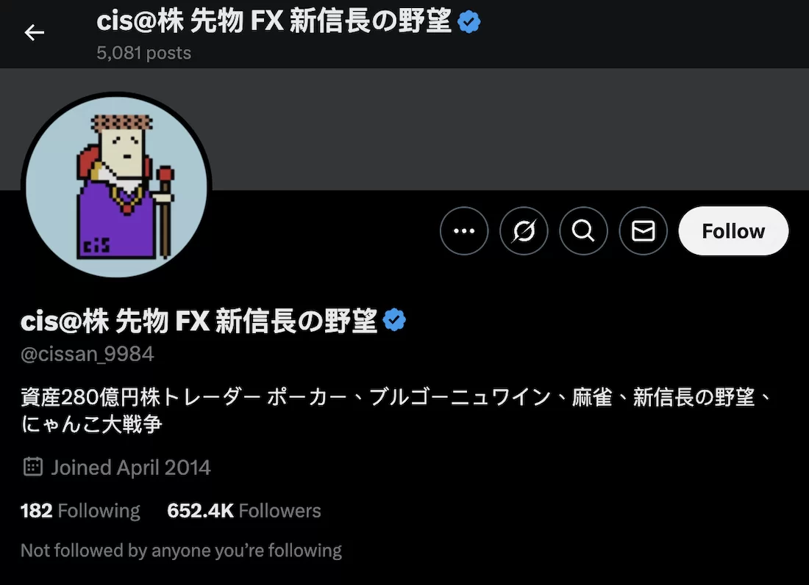
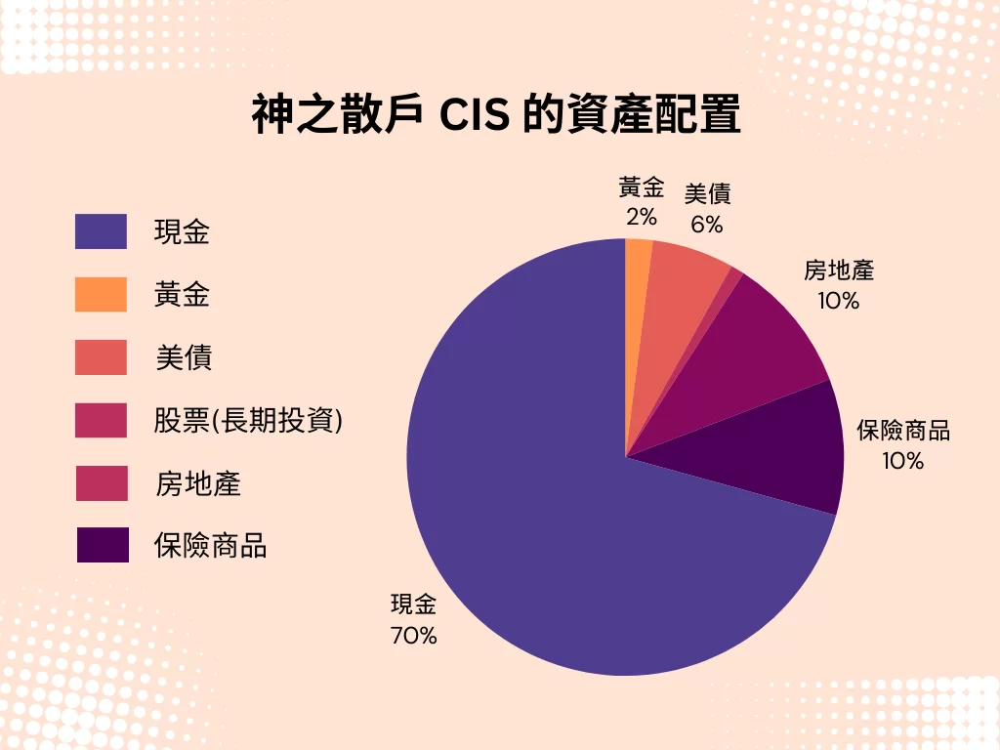
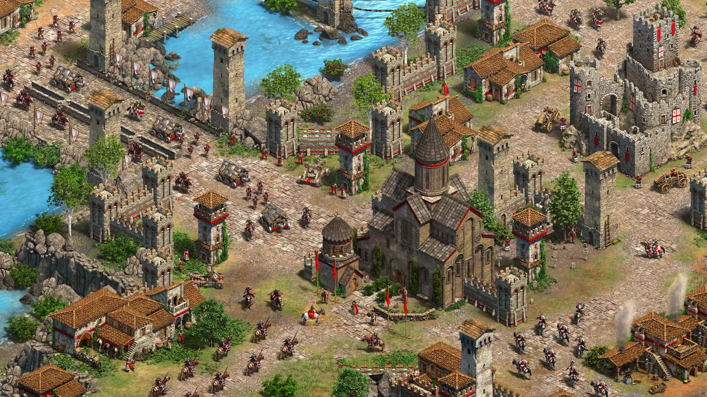

# 《主力的思維》重點整理與筆記：市場贏家的交易法則 - Jay Yang

在股票市場，**多數投資人賺不到錢，不是因為技術不夠，而是因為輸給了自己的本能**。我們常聽到「順勢交易」、「停損比停利重要」，但當真正進入市場時，卻總是做出與理性相反的決策。

**《主力的思維》**這本書，就是一本打破傳統投資思維的作品，由**日本知名短線交易者，神之散戶 CIS 撰寫**，分享他如何從 100 萬日圓起家，透過交易累積到 2300 億日圓的資產。

想快速瞭解本書重點，可以直接點連結跳到筆記章節：

[《主力的思維》重點筆記](https://realjayyang.com/book-cis-trader/#study-note)

## 內容簡介

《主力的思維》並非一本傳統的投資書籍，**這本書不會教你如何選股、如何分析基本面，而是分享交易者如何在市場上存活並賺錢**。CIS 強調，市場本質上是一場博弈，成功的關鍵不在於預測，而在於反應。

在書籍中 CIS 除了分享如何散戶翻身到主力的經驗外，更不藏私的分享了**身為「主力」的投資哲學**。CIS 主要討論以下三個核心問題：

1️⃣ 為什麼順勢交易是致勝關鍵，而逆勢操作是致命錯誤？

2️⃣ 為什麼「便宜買進」其實是錯誤策略？

3️⃣ 如何克服人性弱點，成為市場贏家？

## 作者介紹

[CIS (しす)](https://x.com/cissan_9984) ，是日本最為知名的全職股票投資人。在 2018 年年底的資產總額為 230 億日圓 (約 14 億美元)。

-   從 100 萬日圓起家，透過短線交易迅速翻倍，累積到上百億日圓資產。
-   2005 年，透過「[Livedoor 事件](https://zh.wikipedia.org/zh-tw/Livedoor%E4%BA%8B%E4%BB%B6)」的市場波動，一天內賺取 20 億日圓。
-   2008 年金融海嘯時，成功運用資金管理與市場心理獲利數十億日圓。
-   他曾於 2013 年公開表示，當年獲利 160 億日圓（約 1.2 億美元）。

由於 CIS 的每一筆交易都帶有巨大的影響力，因此被網友稱為「**憑一己之力撼動日經平均指數的男人**」。也是《主力的思維》的原文書名《[一人の力で日経平均を動かせる男の投資哲學](https://www.amazon.co.jp/%E4%B8%80%E4%BA%BA%E3%81%AE%E5%8A%9B%E3%81%A7%E6%97%A5%E7%B5%8C%E5%B9%B3%E5%9D%87%E3%82%92%E5%8B%95%E3%81%8B%E3%81%9B%E3%82%8B%E7%94%B7%E3%81%AE%E6%8A%95%E8%B3%87%E5%93%B2%E5%AD%A6-cis/dp/4041069696)》的參考來源。

除了《主力的思維》，他也活躍於日本投資圈，曾在 Twitter 分享交易心得，影響無數交易者。

| 年份 | 重要記事 |
| --- | --- |
| 1979 | 3 月 CIS 出生。 |
| 2000 | 夏天升上大四時，開戶存入 300 萬日圓，開始投資股票。 |
| 2001 | 法政大學畢業後，進入親戚開的公司上班。 |
| 2002 | 開始玩股票當沖，資產一度銳減至 104 萬日圓，但是自從改變投資心法後，開始持續獲利。 |
| 2004 | 6 月辭職，當時的資產為 6000 萬日圓。後來成為全職操盤手。年底已賺到 2 億日圓 |
| 2005 | J-Com 事件一戰成名， CIS 只花20秒下決定下單，便賺入 6 億日圓，年底更高達近 30 億日圓。 |
| 2013 | 交易了價值 140 億美元的股票。個人交易量佔日本東京證券交易所全年散戶股票交易量的0.5%。CIS 一日最高紀錄是買賣 700 億日圓股票。 |
| 2015 | 黑色星期一，CIS 放空日經 225 指數期貨大賺 3400 萬美元，引來《彭博新聞社》關注，盛讚「A Perfect Play」 |
| 2016 | 11 月 CIS 告訴關注者，他賣空了汽車安全氣囊生產商 Takata 集團的股票。訊息一出 Takata 跌了 8.8%。目前該公司已破產。12 月 CIS 稱買了 200 萬股 TOSHIBA 的股票，而後 TOSHIBA 股價扶搖直上 |
| 2018 | 市場遭遇比特幣大跌，CIS 利用比特幣交易所伺服器的漏洞，大量買入自動停損的比特幣，賺進一億五千萬日圓。 |

## 《主力的思維》重點筆記

### 1. 先戰勝本能，投資才有勝算

#### 順勢操作勝率最高

-   持續上漲的股票大機率會再漲，持續下跌的股票大機率會再跌。
-   **不要逆勢操作，不要買正在下跌的股票**——順勢操作勝算最高。
-   買進的股票如果下跌，應該果斷賣掉。
-   **「回檔買進」是錯誤觀念，稍微下跌時買進是一種逆勢操作。**  -   不要貪便宜，趁低買進通常是錯的。不要有「稍微下跌時買進」、「想趁便宜的時機買進」的想法。
      -   不要預設立場，上漲就要勇敢進場

#### 只顧停利，會錯失大波段

-   **趨勢向上時停利，不是聰明的做法。**
-   股票下跌 10% 要立刻停損，但上漲 10% 不該急著賣。根據回測結果，繼續下跌的可能性比反彈高。
-   **勝率並不重要，最重要的是加總的損益。**（作者回測發現，自己的勝率僅 30% 但單筆獲利是虧損的 10-20 倍）

#### 「攤平」是最差勁的技巧

-   明知失敗卻加碼買進，**應該承認錯誤，果斷停損**。
-   如果不願認賠，最後會輸得一蹋塗地，一切只是投資者不想承認失敗的人性弱點。
-   投資者不能避免損失，但必須**避免巨大的損失**。

#### 已經停損的股票，能再次買回嗎？

-   CIS 認為可以再次買回，但要必須遵循原則，他的原則就是**只買上漲的股票。**
-   **買賣三次以上都沒獲利**，就應該放棄這檔股票，換下一支操作。

#### 恐懼之時，就是機會來臨之時

-   **市場極端恐慌時，往往是獲利良機。**與巴菲特的名言「別人恐懼我貪婪」理念相同。
-   風險與報酬是天生對立的，**投資的目的就是承擔風險換取報酬**。需要克服害怕虧損的心理。
-   CIS 基本上不避險，承擔風險的目的就是要追求利潤，**把成本用來分散風險會稀釋掉利潤**。
-   購買前，應該思考上漲與下跌的原因，如果上漲原因比較有利就會買進（判斷風險報酬比是否合理）。反之判斷**進場勝率如果不到 50%，根本不該進場**。

### 2. 能創造假設的人，才能戰勝股市

#### 三隻泥鰍理論

CIS 把股市中的獲利機會比喻成三隻泥鰍，分別是：

**第 1 隻泥鰍**：市場剛開始注意到某個新趨勢或題材，只有少數投資者發現，這時進場的人獲利空間最大，這是**最美味**的一隻泥鰍。

**第 2 隻泥鰍**：趨勢已經被更多人注意到，但仍有機會獲利，這時進場的人雖然不如第一波賺得多，但仍有價值，這隻泥鰍**還算好吃**。一發現有獲利機會就馬上行動。

**第 3 隻泥鰍**：市場上的大部分人都已經知道這個趨勢，散戶開始湧入，股價可能已經過熱或即將見頂，這時進場的人幾乎沒什麼獲利空間，這隻泥鰍已經**沒什麼味道**了。

#### 市場上，機會稍縱即逝

-   根據泥鰍理論：第一隻泥鰍最值錢，第二隻還能賺錢，第三隻就沒價值了。
-   不要相信媒體的故事，媒體往往事後解釋股價變動，重點是市場的資金流動、**大家正在買賣什麼股票**。
-   賭徒要堅持到最後一刻，**錢進到口袋了才是真正分出勝負**，否則都是「未實現損益」。
-   越希望能是大獲全勝，越容易陰溝裡翻船。

#### 獲利的關鍵：預測未來趨勢

-   最好的假設：是**別人還沒發現、但有邏輯性的假設**。
-   追逐主流媒體的新聞速度太慢了。**越多人知道的資訊，代表其越沒有價值。**
-   操作手法也是同理，**同樣的方法只要越來越多人知道，這個方法就不管用**。

#### 如何發現下一個題材股

-   觀察社群動態、論壇、交易量等**異常變化**。
-   從**市場資金流向**，判斷下個可能炒作的板塊。
-   提前選擇可能納入指數的股票，搶在公告前買入。
-   即使是截然不同的產業，股票也會莫明其妙連動。

### 3. 冷靜審視市場與自己，是邁進勝利的第一步

#### 股價是市場共識，無需自作聰明

-   CIS 認為透過基本面分析找便宜股票沒用，**股價本身即已充分反映市場共識**。
-   **市場氣氛是一個可交易的訊號**，絕對不是無用的資訊。

#### 市場突發事件的應對策略

-   CIS 認為追逐行情是一個追求獲利、承擔風險的行為。
-   市場突然發生利空時，建議**優先減碼**，而不是猜測底部。
-   市場發生超跌後，建議**分批買入**，而不是一次性進場。
-   如果市場因**短期利多大漲**，CIS 反而會考慮會反向操作。

#### CIS 的投資心法

-   投資一定有風險，**害怕風險的人不要玩股票**。
-   **時間不等人**，即知執行才能出奇制勝。
-   即使買入時想法再簡單，**一但操作時花的是自己的錢，還是會知意難行**。例如：每當股價下跌時，心裡會覺得賣掉比較好，但還是會想很多擔心會不會反彈。
-   **股價上漲創新高時，CIS 會欣然買進**。一般散戶的想法，股價已經漲到前所未有的高點，擔心是不是要下跌了。
-   大部分的人都想低買高賣，所以不想買在高點，但是股價高低都是比較來的。一檔股票基本上不存在「合理的價格」，**只要賣的時間比買進高就能獲利**。

#### 最早連戰連敗的經驗

-   CIS 早期信仰基本面選股，對各種企業做財務分析，找出便宜被低估的股票買入。當時他挑選了航空業中幾個便宜的標的，結果越買跌越兇。
-   後來經過反省，CIS 認為與其思考股票並未反映企業價值，不如搞清楚，股價本身就是答案，是所有投資人公認的數字。**即使看起來很便宜，也是誰都知道的資訊**。
-   除非有內線交易，能事先掌握到價值波動，否則沒有人知道企業的潛力與股價的連動關係。
-   **散戶並沒有資訊優勢**。如果不先下手為強，就無法從別人手中把財富搶過來。

#### 股市只能在股市學習

-   寫在書裡的投資方法都是過去的事情，對未來毫無幫助。CIS 認為**市場是動態變化的**，過去的成功模式未必適用於未來。
-   操盤手的困難點在，必須一再否定自己的理論。某種方法曾經奏效，也可能因市場環境變化而失靈。因此成功的投資人必須**敢於否定過去的認知，迅速調整策略。**
-   無法客觀審視自己的人肯定沒有勝算，投資人需要謙虛地從市場學習，而不是試圖證明自己是對的。

#### Twitter 的新聞比 NHK 還快

-   **CIS 平常只看股價波動跟 Twitter**：通常是先看股價波動，發現不尋常變化就減碼，最後才會看新聞。
-   需關注能最早取得資訊的地方。川普贏得總統大選時，**當地的 Twitter 最早傳出訊息**，路透社跟彭博的新聞 30 秒後才跟上。
-   **利用時區優勢**：日本、美國、歐洲的股票市場，星期一最早開市的是日本，因此週末發生世界級大事件，日本股市會首當其衝。每當歐美政治出狀況，賣盤會傾巢而出，**日本常會出現賣超**。
-   **股價會因為羊群效應過度反應**：以 CIS 經驗來說，上述情況 **90% 都能逆勢買進**，因為大多數人不看好。反之亦然，美國週末如出現利多訊息，道瓊期貨大漲，日經指數也跟著大漲，則要賣空，因為通常很快就會打回原型。

#### 提防內線交易

-   訊息容易走漏風聲，市場上出現可疑的賣盤或買盤，最好認為那是內線交易
-   疑似被炒作的股票就是機會。**價格波動劇烈的股票是絕佳的當沖標的**。第一時間上車，趕快賣掉，落袋為安。

#### 資金盲目流動時，正是獲利良機

-   機構投資者（如基金、保險公司、政府基金）通常**有固定的資金配置規則**，會根據某個規則，得出在特定期間要買某股票的結論，被作者稱為「**盲目的資金**」，
-   **這種「必須執行的買賣」，往往會產生短期的資金盲目流動**，股價因此被推高或壓低，與基本面無關。
-   資金流入時可順勢而為，**提早買入或搭上順風車**，短線能撈一筆。
-   反之資金流出時，短期賣壓可能會過度反應，判斷**從倒貨倒完的地方**開始買進。

### 4. 職業操盤手的思維

本段主要指的是極短線的當沖交易，某些概念也適用於隔日沖：

#### 交易本質是「搶奪金錢的遊戲」

-   **CIS 對配息沒有興趣**，因為沒賺頭。
-   **CIS 不做長期投資**，理由是連明天的股價都不確定了，如何確定半年一年，甚至是十年後。比起放眼未來，抓住現在的優勢比較有搞頭。
-   **追求流動性與波動**：早盤最活躍，9:00 – 09:20 是日本股市短線交易的最佳時間。

**短線交易的執行細節：**

-   判斷市場趨勢：交易者需要在極短時間內決定**是順勢交易還是逆勢操作**
-   當沖交易的「停損位」與「加碼時機」：交易者通常設有嚴格的停損，因為**當天就要結束交易，不能承受太大損失**。隔日沖可能允許更寬鬆的停損範圍。
-   **降低流動性風險**：當沖交易需要在市場流動性高時操作，因為這樣才能快速進出場，不影響價格。如果流動性不足，可能會導致無法順利賣出或買入。

#### 資金管理與倉位控制

-   **高勝率時重倉，無法確定時輕倉**：當天結束交易時，必須確保整體盈虧穩定。不要輕易放大部位，除非有極高勝率。
-   **根據市場變化，靈活調整資金配置**：例如發現市場震盪劇烈時減少部位，趨勢明確時加大部位。
-   把錢砸在波動較大的個股，是最有效率的投資手法。特別是**資金小的時候**。
-   資金大的時候容易買到漲停，賣的時候會有倒貨效應。因此當**資產變多時，很難有效率專注在單一股票上**，此時需要專注整體的表現。

#### 投資房地產是自討苦吃

-   投資房地產與其說是投資，不如說是強迫勞動。CIS 早期買了大樓想出給便利商店，發現是「早知道就別買」，要處理收租、折舊、招商、修繕、處理庶務工作⋯⋯不如做其他更輕鬆能賺錢的事情。
-   **CIS 偏好投資流動性高的資產**，例如股票，因為**可以迅速調整資金配置**。當房地產市場不好時，即使你擁有大筆資產，也可能無法迅速變現來投資其他機會。
-   **CIS 認為房子不是必要的負擔**，而是生活方式的選擇。他寧可租飯店房間，享受能請人櫃檯把整箱麥茶送到家門口的便利性。

#### 投資最重要的事情：賺錢的效率

-   CIS 認為**現金就是力量**。把資金花在哪必須以「**效率為優先**」， 不該為了社會價值觀（擁有房產）犧牲投資自由度。
-   CIS 分享了一個案例：他朋友資產 7 億，拿 6 億去買房子，剩下 1 億要繼續玩股票。房地產鎖住了大量資金，影響了朋友的賺錢效率。
-   資金應該集中在能產生更高報酬的地方，**不建議用來購買低流動性的資產**（如房地產、奢侈品）。CIS 對物質生活不講究，穿 UNIQLO，也不買遊艇與別墅，因為他認為**真正的財富是來自於投資的自由，而不是擁有昂貴的物品。**
-   越是靠投資賺錢的人，花在投資以外的錢就要更小心謹慎。**沒了本金，就無法賺大錢**。
-   CIS 的投資策略是「**集中資金在最大報酬的機會上**」，而不是分散投資來降低風險。最有效率的機會就是，找出能大撈一筆的機會，盡可能把全部財產投進去。因此才會選鎖定股價波動劇烈的個股，小心找出能孤注一擲的機會。

#### CIS 的資產配置

| 部位 | 比例 | 說明 |
| --- | --- | --- |
| 現金 | 70% | CIS 的交易方式需要極高的流動性，因此現金對他來說是最好的資產。市場會不斷產生短期機會，**擁有現金才能即時抓住機會**。當市場動盪時，**現金讓他能夠保持安全**，避免被市場波動吞噬。 |
| 黃金 | 2% | **資金靈活性比避險更重要**，所以只配置 **2%**。當市場劇烈波動時，CIS 更願意靠交易獲利，而不是依賴黃金作為保值工具。 |
| 美債 | 6% | 日幣的貶值風險一直存在，持有部分美債可以**對沖日圓貶值風險。但股票交易的獲利能力遠超美債**，所以配置極低。 |
| 股票 | 1% | 指的是**股票的長期投資部位**。市場永遠在變，長期投資者容易受到不可控風險影響。 |
| 房地產 | 10% | 這筆投資的目的並非獲利，而是「理解市場運作」，讓自己不會對這個領域完全無知。 |
| 保險商品 | 10% | 保險產品本質上是「風險管理工具」，而不是高報酬投資。投資的目的也是學習。 |

#### CIS 對於退休金的運用

-   **不相信人性**：不需要把退休金交給基金經理人操作，要是真的有這麼多資金，不如交給 AI 操盤。
-   **CIS 建議投資美國市場**，投資日本國內市場像是奪取日本同胞的錢。
-   **退休後，現金流比資產增值更重要**：分散投資美股，高殖利率、看起來快倒的公司（短期財務狀況不佳，但經濟復甦後仍可能回穩）。

#### 開投資公司的經驗

CIS 也在書中分享了開投資公司時的經驗，以及對人性本能的觀察：

-   即使員工學習相同的知識，最終交易結果仍然大不相同，**這說明「技術」不是唯一決定勝負的關鍵，人性才是**。
-   同樣的交易策略，**不同的人執行，結果可能完全相反**：會獲利瞭解的人就會馬上停利、有人動不動就停損、有人在股價漲停時有勇氣加碼，而有人則害怕高位進場。
-   **「人的本能會反映在買賣上」**，克服人性才是投資的關鍵：漲停時，大多數人選擇觀望或獲利了結，但真正能賺大錢的人，卻敢於在這時候繼續買進，這需要很大的勇氣執行
-   光靠上課是不行了，人的本能會反映在買賣上，一扯到金錢，人就會輸給本能。

CIS 曾兩次創業失敗，這顯示了**「交易」與「經營企業」**是兩種完全不同的挑戰。

-   **投資的風險是「市場的不確定性」**，但創業的風險來自於「人事管理、資金運營、競爭壓力等現實問題」。
-   CIS 擅長的是交易，但創業涉及管理與決策，這些不是他的強項，因此他並不適合創業。

### 5. 靠玩遊戲訓練投資技術

#### 遊戲訓練投資的核心技能

遊戲是作者的投資技巧原點，CIS 透過玩遊戲（**快打旋風、網路創世紀、世紀帝國**）訓練集中力、判斷力、持續力。**買股票也要有快速判斷的反射神經**。

世紀帝國 Age of Empires：受全職投資們一致推崇的遊戲

#### 作者的童年經驗

-   CIS 小時候去柑仔店玩抽抽樂，**找出期望值比較高的法則**跟攻略法
-   在班上自行發行過虛擬貨幣在朋友間流通，透過代幣可以兌換零食文具，去作者家打電動。過程瞭解到貨幣發行太多，其價值就會下跌。
-   比起玩遊戲的輸贏，**CIS 更重視「如何提高勝率」**。作者從小鋼珠機臺中學到，如何挑勝率高的機臺、分配資金讓勝率最大化。

### 6. 成為億萬富翁，全拜網路論壇所賜

#### 交易心理學的應用

-   人性**在賠錢時，人會不願認輸**；賺錢時，人會想要過早獲利了結。
-   市場本能是錯的，真正賺錢的方法就是克服這些錯誤的本能反應。
-   **每次交易都應該是一個獨立事件**，不要被過去的盈虧影響。

#### 投資初期的巨大虧損與轉變

-   剛開始做股票一直賠錢，700 萬丟進股市後僅剩 104 萬，累計虧損超過 1000 萬。
-   CIS 認為，除了極少數厲害的操盤手外，投資世界的賺與賠只有毫釐之差，**運氣成分很大**。
-   市場充滿偶然性，**極端情境下才能真正勝過經濟指標**。

#### 放棄長期投資，轉向短線交易

-   與網路論壇的股市版網友交流後，CIS 放棄了長期投資策略。
-   股價便宜或貴、企業成長性這些指標，往往只是投資者的主觀認知，並**不一定能反映未來漲跌**。
-   真正賺錢的人，更多是基於短期的股價波動、技術面走勢，或市場對個股納入指數的預期來做交易。
-   **資訊的速度決定優勢**，口耳相傳的訊息比媒體報導更快、更具影響力。

#### 累積 6,000 萬資產後辭掉工作

-   資產快速增長的同時，**身體卻出現嚴重警訊**。
-   長期交易壓力導致健康亮紅燈，出現掉髮、腸胃不適等問題。
-   **專注於工作往往忽略健康管理**，長時間專注交易導致睡眠不足，影響免疫系統。
-   後來為了健康與家庭，CIS 決定只交易早盤，並**改善生活習慣**，身體狀況逐漸回復。
-   學會**平衡交易與生活**，才能長期穩定發展。

### 7. 給新手投資者的建議

#### 快的人永遠快，慢的人永遠慢

-   投資市場的**贏家往往都是「行動快的人」**，而不是「想得快的人」。
-   能賺到身家萬億的，都是攻擊型投資者，一旦發現機會，就會果斷出手。
-   CIS 自認為自己是防守型投資人，一面停損、一面伺機而動。

#### 策略：長期投資虧損公司

-   經濟危機時，買進被嚴重低估的公司，等待景氣回暖後獲利。
-   但要注意，若公司破產，就沒有真正的「底部」。
-   2008 年金融海嘯，雖然有不少低價買點，但 CIS 也經歷了不動產信託基金跌停的慘痛經驗。
-   2006 年 1 月 Livedoor 事件，虧損五億，顯示市場極端風險無法預測。

#### 如何投資不景氣時的虧損公司？

-   若資金有限（50-100 萬日圓），**CIS 認為可以從 IPO 公司當沖開始**，因為波動率較大。苗頭不對立刻停損，上漲就抱住，執行當沖模式。
-   不想做功課又想賺錢的人，可以**考慮景氣迴圈股**，投資在景氣低迷時虧損的公司。當景氣回暖，這類公司可能股價翻倍甚至更高。
-   **市場容易過度悲觀**，當大家都恐懼時，往往是進場機會。反之景氣大好時，股價已經反映樂觀預期，這時候買進風險較大。

#### 投資人如何戰勝 AI？

-   **AI 不敢承擔高風險，但人類有勇氣承擔**，因此高風險高報酬領域仍然是人類的優勢。
-   風險越大，潛在的報酬也越高，這是 AI 無法取代的領域。

#### 市場情緒與危機應對

-   財富增加的同時，金錢的價值也不斷下跌，市場並非靜態的。
-   **危機與轉機只有一念之差**，市場恐懼時，投資人容易短視、做出錯誤決策。
-   景氣變差時，市場動盪不安，可能是獲利的機會，也可能讓投資人賠到傾家蕩產。
-   **冷靜才能做出正確決策**，避免市場情緒影響交易。

#### 虛擬貨幣交易策略

-   上漲買入、下跌賣出，**不要在下跌時買進**。
-   市場氣氛會影響投資情緒，虛擬貨幣和其他金融商品的投資心理是一樣的。

#### 夠努力就能贏過大多數人

-   世界上存在努力與回報的螺旋，**只要用功就能成功**。成功帶來快感，因此會繼續投入更多努力，形成正向迴圈。最終越來越進步，越來越成功。
-   但 **80% 的人對賠錢感到有壓力**，這類人適合當上班族，而不是投資人。
-   追求**穩定並不會帶來效益極大化**，投資本質上是風險與報酬的交換。

#### 賭場贏家也是股市贏家

##### 投資與賭博的相似性

-   股價與撲克牌類似，都是機率與風險的遊戲。
-   行情只會上下波動，**交易的本質不是進場（下注）就是退場（蓋牌）**。
-   **不停損的人，等於永遠都在進場**，這是極高風險的行為。
-   每次進出場都有風險，投資人要判斷哪種情境下獲利機率最大。

##### 撲克牌與麻將 vs. 股票交易

-   股票與撲克牌最大不同點：股市沒有固定玩家與籌碼上限，只能看到買賣成交量。而**撲克牌能透過算牌，計算籌碼，本質上是機率遊戲**，甚至是拿到爛牌虛張聲勢都能考量進機率。
-   但兩者的共通點是，**懂得「風險管理」的人，通常在交易與賭博中都能勝出**。
-   麻將跟撲克牌是同一類遊戲。**善於比較風險與報酬的人，通常比較會打麻將**。
-   麻將中，**「下注」與「蓋牌」的判斷**，遠大於牌面的好壞對勝負結果的影響。
-   投資市場也是如此，決策時機的重要性遠大於分析技巧。

##### 21 點算牌法與投資應用

-   普通算牌法：計算 **10、J、Q、K、A 等高點數牌的數量**，判斷剩餘的機率。高點數多時增加籌碼，反之亦然。
-   CIS 的方法：除了高張牌，還會**記住 5、4、6 的張數**，以計算牌面會變得很好的機率。
-   這種邏輯應用在投資上，就是透過資料與市場行為，推測未來的機率。

#### 股票市場是最刺激的賭場

-   股票市場既是知識競技場，也是最刺激的遊戲，更是能增加財富的遊戲。
-   市場永遠充滿未知與變數，因此**學習與適應力**比固定策略更重要。
-   沒有人能百分百預測市場，但透過學習與經驗累積，可以**提升勝率**。
-   股市如同賭場，是一場資本博弈的遊戲，懂得**風險與報酬**的人才能勝出。

## 讀後心得

身為一名臭散戶，能透過這本書窺探影響市場價格的「主力們」，究竟是如何思考與參與股市博弈。在短線交易的角度來看，《主力的思維》提供了非常有價值的參考。散戶有望透過**揣摩主力的進出場策略**，搭著大戶的順風車一起吃香喝辣。

CIS 是全職投資人，能夠投入大量時間研究市場，因此他極度重視資金的流動性與利用效率，不偏好非現金資產。

CIS 的成功在於，其**懂得在正確的時機，把資金放在正確的地方**。但對於普通上班族來說，我們只能偶爾關注市場，不可能全天候盯盤，資金量體也不夠大，因此**散戶若完全照搬 CIS 的策略，有可能會更快畢業**。

書中的許多交易心法，如**紀律止損、承認錯誤、評估勝率**等，其實都是投資界常見的概念，但真正能夠執行的人極少。這些道理我們都懂，卻因為人性難以克服而無法做到。

這讓我想起股市中流傳的一句話：

> 大部分的人去菜市場買菜時，總願意貨比三家，找到最便宜幾十元的蔬果。但在下單股票時，卻不願意花一樣的心力研究標的。

投資市場並不會對任何人仁慈，唯有克服人性、培養紀律，才能真正存活下來。
